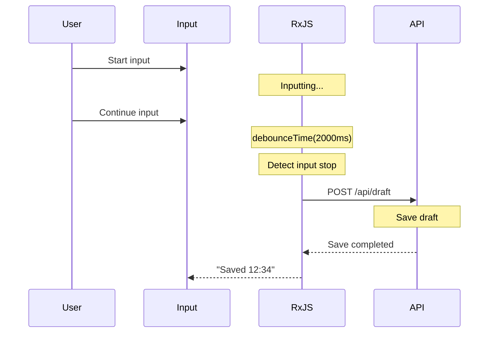

# Form Processing Patterns

Form processing is one of the central features in web application development. RxJS allows you to efficiently implement reactive and easy-to-use forms.

This article describes specific patterns of form processing that are necessary in practice, such as real-time validation, auto-save, and multiple field integration.

## What You Will Learn in This Article

- Implementing real-time validation
- Auto-save functionality (debounce + distinctUntilChanged)
- Combining multiple fields (combineLatest)
- Conditional field display
- Submit processing and double submission prevention (exhaustMap)
- Error indication and reset handling
- Form state management

> [!TIP] Prerequisites
> This article assumes knowledge of [Chapter 3: Creation Functions](../creation-functions/index.md) and [Chapter 4: Operators](../operators/index.md).

## Real-Time Validation

### Problem: I Want to Run Validation on Every Input

I want to run validation on every user input and provide immediate feedback.

### Solution: debounceTime + distinctUntilChanged

```typescript
import { fromEvent, map, debounceTime, distinctUntilChanged } from 'rxjs';
interface ValidationResult {
  valid: boolean;
  message: string;
}

const emailInput = document.createElement('input');
emailInput.id = 'email';
emailInput.type = 'email';
emailInput.placeholder = 'Enter email address';
emailInput.style.padding = '10px';
emailInput.style.margin = '10px';
emailInput.style.width = '300px';
emailInput.style.fontSize = '16px';
emailInput.style.border = '2px solid #ccc';
emailInput.style.borderRadius = '4px';
document.body.appendChild(emailInput);

const emailError = document.createElement('div');
emailError.id = 'email-error';
emailError.style.margin = '0 10px 10px 10px';
emailError.style.color = '#f44336';
emailError.style.fontSize = '14px';
emailError.style.minHeight = '20px';
document.body.appendChild(emailError);

fromEvent(emailInput, 'input').pipe(
  map(event => (event.target as HTMLInputElement).value.trim()),
  debounceTime(300),           // Wait 300ms after input stops
  distinctUntilChanged()       // Ignore if value is the same as last time
).subscribe(email => {
  const result = validateEmail(email);

  if (result.valid) {
    emailInput.style.borderColor = '#4CAF50';
    emailError.textContent = '';
  } else {
    emailInput.style.borderColor = '#f44336';
    emailError.textContent = result.message;
  }
});

// Email address validation
function validateEmail(email: string): ValidationResult {
  if (email.length === 0) {
    return { valid: false, message: 'Please enter your email address' };
  }

  const emailRegex = /^[^\s@]+@[^\s@]+\.[^\s@]+$/;
  if (!emailRegex.test(email)) {
    return { valid: false, message: 'Email address format is incorrect' };
  }

  return { valid: true, message: '' };
}
```

> [!NOTE] Real-time Validation Points
> - Wait for input stop with `debounceTime(300)` (to prevent overprocessing)
> - Prevent duplicate validation with `distinctUntilChanged()`
> - Visual feedback of validation results (CSS classes)

### Combining Multiple Validation Rules

```typescript
import { fromEvent, combineLatest, map, debounceTime, distinctUntilChanged, startWith } from 'rxjs';
interface PasswordValidation {
  minLength: boolean;
  hasUpperCase: boolean;
  hasLowerCase: boolean;
  hasNumber: boolean;
  hasSpecialChar: boolean;
}

const passwordInput = document.createElement('input');
passwordInput.id = 'password';
passwordInput.type = 'password';
passwordInput.placeholder = 'Password';
passwordInput.style.padding = '10px';
passwordInput.style.margin = '10px';
passwordInput.style.width = '300px';
passwordInput.style.fontSize = '16px';
passwordInput.style.border = '2px solid #ccc';
passwordInput.style.borderRadius = '4px';
passwordInput.style.display = 'block';
document.body.appendChild(passwordInput);

const confirmPasswordInput = document.createElement('input');
confirmPasswordInput.id = 'confirm-password';
confirmPasswordInput.type = 'password';
confirmPasswordInput.placeholder = 'Confirm Password';
confirmPasswordInput.style.padding = '10px';
confirmPasswordInput.style.margin = '10px';
confirmPasswordInput.style.width = '300px';
confirmPasswordInput.style.fontSize = '16px';
confirmPasswordInput.style.border = '2px solid #ccc';
confirmPasswordInput.style.borderRadius = '4px';
confirmPasswordInput.style.display = 'block';
document.body.appendChild(confirmPasswordInput);

const confirmError = document.createElement('div');
confirmError.id = 'confirm-error';
confirmError.style.margin = '0 10px 10px 10px';
confirmError.style.color = '#f44336';
confirmError.style.fontSize = '14px';
confirmError.style.minHeight = '20px';
document.body.appendChild(confirmError);

// Create validation checklist elements
const validationContainer = document.createElement('div');
validationContainer.style.margin = '10px';
validationContainer.style.padding = '10px';
validationContainer.style.border = '1px solid #ddd';
validationContainer.style.borderRadius = '4px';
validationContainer.style.width = '300px';
document.body.appendChild(validationContainer);

const checkElements: Record<string, HTMLElement> = {};
const checks = [
  { id: 'check-length', label: 'At least 8 characters' },
  { id: 'check-uppercase', label: 'Contains uppercase' },
  { id: 'check-lowercase', label: 'Contains lowercase' },
  { id: 'check-number', label: 'Contains number' },
  { id: 'check-special', label: 'Contains special character' }
];

checks.forEach(({ id, label }) => {
  const checkEl = document.createElement('div');
  checkEl.id = id;
  checkEl.textContent = `${label}`;
  checkEl.style.padding = '5px';
  checkEl.style.color = '#999';
  validationContainer.appendChild(checkEl);
  checkElements[id] = checkEl;
});

const password$ = fromEvent(passwordInput, 'input').pipe(
  map(event => (event.target as HTMLInputElement).value),
  debounceTime(300),
  distinctUntilChanged(),
  startWith('')
);

const confirmPassword$ = fromEvent(confirmPasswordInput, 'input').pipe(
  map(event => (event.target as HTMLInputElement).value),
  debounceTime(300),
  distinctUntilChanged(),
  startWith('')
);

// Password validation
password$.subscribe(password => {
  const validation = validatePassword(password);
  displayPasswordValidation(validation);
});

// Password match confirmation
combineLatest([password$, confirmPassword$]).subscribe(
  ([password, confirmPassword]) => {
    if (confirmPassword.length === 0) {
      confirmError.textContent = '';
      confirmPasswordInput.style.borderColor = '#ccc';
      return;
    }

    if (password !== confirmPassword) {
      confirmError.textContent = 'Passwords do not match';
      confirmPasswordInput.style.borderColor = '#f44336';
    } else {
      confirmError.textContent = '';
      confirmPasswordInput.style.borderColor = '#4CAF50';
    }
  }
);

function validatePassword(password: string): PasswordValidation {
  return {
    minLength: password.length >= 8,
    hasUpperCase: /[A-Z]/.test(password),
    hasLowerCase: /[a-z]/.test(password),
    hasNumber: /[0-9]/.test(password),
    hasSpecialChar: /[!@#$%^&*(),.?":{}|<>]/.test(password)
  };
}

function displayPasswordValidation(validation: PasswordValidation): void {
  const checkItems = [
    { id: 'check-length', valid: validation.minLength },
    { id: 'check-uppercase', valid: validation.hasUpperCase },
    { id: 'check-lowercase', valid: validation.hasLowerCase },
    { id: 'check-number', valid: validation.hasNumber },
    { id: 'check-special', valid: validation.hasSpecialChar }
  ];

  checkItems.forEach(({ id, valid }) => {
    const element = checkElements[id];
    if (element) {
      if (valid) {
        element.style.color = '#4CAF50';
        element.style.fontWeight = 'bold';
      } else {
        element.style.color = '#999';
        element.style.fontWeight = 'normal';
      }
    }
  });
}
```

> [!TIP] Using combineLatest
> Using `combineLatest` makes it easy to implement validation that combines the values of multiple fields (e.g., password match checking).

## Auto-Save Functionality

### Problem: I Want to Save Drafts Automatically

I want to automatically save user input periodically to prevent data loss.

### Solution: debounceTime + switchMap

```typescript
import { fromEvent, combineLatest, of, map, debounceTime, distinctUntilChanged, switchMap, catchError, tap, startWith } from 'rxjs';
interface DraftData {
  title: string;
  content: string;
  lastSaved?: Date;
}

const titleInput = document.createElement('input');
titleInput.id = 'title';
titleInput.type = 'text';
titleInput.placeholder = 'Enter title';
titleInput.style.padding = '10px';
titleInput.style.margin = '10px';
titleInput.style.width = '500px';
titleInput.style.fontSize = '18px';
titleInput.style.border = '2px solid #ccc';
titleInput.style.borderRadius = '4px';
titleInput.style.display = 'block';
document.body.appendChild(titleInput);

const contentTextarea = document.createElement('textarea');
contentTextarea.id = 'content';
contentTextarea.placeholder = 'Enter content';
contentTextarea.rows = 10;
contentTextarea.style.padding = '10px';
contentTextarea.style.margin = '10px';
contentTextarea.style.width = '500px';
contentTextarea.style.fontSize = '16px';
contentTextarea.style.border = '2px solid #ccc';
contentTextarea.style.borderRadius = '4px';
contentTextarea.style.display = 'block';
contentTextarea.style.resize = 'vertical';
document.body.appendChild(contentTextarea);

const saveStatus = document.createElement('div');
saveStatus.id = 'save-status';
saveStatus.style.margin = '10px';
saveStatus.style.fontSize = '14px';
saveStatus.style.color = '#666';
saveStatus.style.minHeight = '20px';
document.body.appendChild(saveStatus);

const title$ = fromEvent(titleInput, 'input').pipe(
  map(event => (event.target as HTMLInputElement).value),
  startWith('')
);

const content$ = fromEvent(contentTextarea, 'input').pipe(
  map(event => (event.target as HTMLTextAreaElement).value),
  startWith('')
);

// Monitor form changes
combineLatest([title$, content$]).pipe(
  map(([title, content]): DraftData => ({ title, content })),
  debounceTime(2000),          // Wait 2 seconds after input stops
  distinctUntilChanged((prev, curr) =>
    prev.title === curr.title && prev.content === curr.content
  ),
  tap(() => {
    saveStatus.textContent = 'Saving...';
    saveStatus.style.color = '#FF9800';
  }),
  switchMap(draft =>
    saveDraft(draft).pipe(
      map(savedDraft => ({ ...savedDraft, success: true })),
      catchError(err => {
        console.error('Save error:', err);
        return of({ ...draft, success: false });
      })
    )
  )
).subscribe(result => {
  if (result.success) {
    saveStatus.textContent = `Saved (${formatTime(result.lastSaved!)})`;
    saveStatus.style.color = '#4CAF50';
  } else {
    saveStatus.textContent = 'Save failed';
    saveStatus.style.color = '#f44336';
  }
});

// Draft save API (mock)
function saveDraft(draft: DraftData) {
  console.log('Saving draft:', draft);
  return of({
    ...draft,
    lastSaved: new Date()
  });
}

function formatTime(date: Date): string {
  const hours = date.getHours().toString().padStart(2, '0');
  const minutes = date.getMinutes().toString().padStart(2, '0');
  return `${hours}:${minutes}`;
}
```

#### Auto-Save Flow



> [!IMPORTANT] Auto-Save Best Practices
> - **debounceTime**: Set appropriate delay (1-3 seconds)
> - **distinctUntilChanged**: Don't save if content hasn't changed
> - **switchMap**: Cancel old requests
> - **Visual feedback**: Display save status to user

## Multiple Field Coordination

### Problem: I Want to Change Display According to Other Field Values

Examples: Selecting a country changes the prefecture list, shipping method changes shipping address input display, etc.

### Solution: combineLatest and withLatestFrom

```typescript
import { fromEvent, of, map, startWith, switchMap } from 'rxjs';
interface Country {
  code: string;
  name: string;
}

interface Prefecture {
  code: string;
  name: string;
  countryCode: string;
}

const countrySelect = document.createElement('select');
countrySelect.id = 'country';
countrySelect.style.padding = '10px';
countrySelect.style.margin = '10px';
countrySelect.style.fontSize = '16px';
countrySelect.style.border = '2px solid #ccc';
countrySelect.style.borderRadius = '4px';
countrySelect.style.display = 'block';

// Add country options
const countries: Country[] = [
  { code: '', name: 'Select country' },
  { code: 'JP', name: 'Japan' },
  { code: 'US', name: 'United States' }
];
countries.forEach(country => {
  const option = document.createElement('option');
  option.value = country.code;
  option.textContent = country.name;
  countrySelect.appendChild(option);
});
document.body.appendChild(countrySelect);

const prefectureSelect = document.createElement('select');
prefectureSelect.id = 'prefecture';
prefectureSelect.style.padding = '10px';
prefectureSelect.style.margin = '10px';
prefectureSelect.style.fontSize = '16px';
prefectureSelect.style.border = '2px solid #ccc';
prefectureSelect.style.borderRadius = '4px';
prefectureSelect.style.display = 'block';

// Add initial empty option
const emptyOption = document.createElement('option');
emptyOption.value = '';
emptyOption.textContent = 'Please select';
prefectureSelect.appendChild(emptyOption);
document.body.appendChild(prefectureSelect);

const country$ = fromEvent(countrySelect, 'change').pipe(
  map(() => countrySelect.value),
  startWith(countrySelect.value)
);

// Update prefecture list when country changes
country$.pipe(
  switchMap(countryCode =>
    getPrefecturesByCountry(countryCode)
  )
).subscribe(prefectures => {
  updatePrefectureOptions(prefectureSelect, prefectures);
});

// Get prefecture list from country code (mock)
function getPrefecturesByCountry(countryCode: string) {
  const prefectures: Record<string, Prefecture[]> = {
    JP: [
      { code: '13', name: 'Tokyo', countryCode: 'JP' },
      { code: '14', name: 'Kanagawa', countryCode: 'JP' },
      { code: '27', name: 'Osaka', countryCode: 'JP' }
    ],
    US: [
      { code: 'CA', name: 'California', countryCode: 'US' },
      { code: 'NY', name: 'New York', countryCode: 'US' },
      { code: 'TX', name: 'Texas', countryCode: 'US' }
    ]
  };

  return of(prefectures[countryCode] || []);
}

function updatePrefectureOptions(
  select: HTMLSelectElement,
  prefectures: Prefecture[]
): void {
  select.innerHTML = '<option value="">Please select</option>';

  prefectures.forEach(pref => {
    const option = document.createElement('option');
    option.value = pref.code;
    option.textContent = pref.name;
    select.appendChild(option);
  });
}
```

### Conditional Field Display

```typescript
import { fromEvent, map, startWith } from 'rxjs';

const shippingMethodSelect = document.createElement('select');
shippingMethodSelect.id = 'shipping-method';
shippingMethodSelect.style.padding = '10px';
shippingMethodSelect.style.margin = '10px';
shippingMethodSelect.style.fontSize = '16px';
shippingMethodSelect.style.border = '2px solid #ccc';
shippingMethodSelect.style.borderRadius = '4px';
shippingMethodSelect.style.display = 'block';

const shippingOptions = [
  { value: '', label: 'Select shipping method' },
  { value: 'home-delivery', label: 'Home delivery' },
  { value: 'store-pickup', label: 'Store pickup' }
];
shippingOptions.forEach(option => {
  const optionEl = document.createElement('option');
  optionEl.value = option.value;
  optionEl.textContent = option.label;
  shippingMethodSelect.appendChild(optionEl);
});
document.body.appendChild(shippingMethodSelect);

const homeDeliverySection = document.createElement('div');
homeDeliverySection.id = 'home-delivery';
homeDeliverySection.style.padding = '15px';
homeDeliverySection.style.margin = '10px';
homeDeliverySection.style.border = '2px solid #4CAF50';
homeDeliverySection.style.borderRadius = '4px';
homeDeliverySection.style.backgroundColor = '#f1f8f4';
homeDeliverySection.style.display = 'none';
homeDeliverySection.innerHTML = '<h4 style="margin-top: 0;">Enter home delivery information</h4><p>Please enter address, phone number, etc.</p>';
document.body.appendChild(homeDeliverySection);

const storePickupSection = document.createElement('div');
storePickupSection.id = 'store-pickup';
storePickupSection.style.padding = '15px';
storePickupSection.style.margin = '10px';
storePickupSection.style.border = '2px solid #2196F3';
storePickupSection.style.borderRadius = '4px';
storePickupSection.style.backgroundColor = '#e3f2fd';
storePickupSection.style.display = 'none';
storePickupSection.innerHTML = '<h4 style="margin-top: 0;">Enter store pickup information</h4><p>Please select pickup store</p>';
document.body.appendChild(storePickupSection);

fromEvent(shippingMethodSelect, 'change').pipe(
  map(() => shippingMethodSelect.value),
  startWith(shippingMethodSelect.value)
).subscribe(method => {
  if (method === 'home-delivery') {
    homeDeliverySection.style.display = 'block';
    storePickupSection.style.display = 'none';
  } else if (method === 'store-pickup') {
    homeDeliverySection.style.display = 'none';
    storePickupSection.style.display = 'block';
  } else {
    homeDeliverySection.style.display = 'none';
    storePickupSection.style.display = 'none';
  }
});
```

### Calculate Shipping Cost with Multiple Conditions

```typescript
import { combineLatest, fromEvent, map, startWith } from 'rxjs';
interface ShippingCalc {
  country: string;
  weight: number;
  shippingMethod: string;
}

const countrySelect = document.createElement('select');
countrySelect.id = 'country';
countrySelect.style.padding = '10px';
countrySelect.style.margin = '10px';
countrySelect.style.fontSize = '16px';
countrySelect.style.border = '2px solid #ccc';
countrySelect.style.borderRadius = '4px';
countrySelect.style.display = 'block';

const countryOptions = [
  { value: 'JP', label: 'Japan' },
  { value: 'US', label: 'United States' },
  { value: 'OTHER', label: 'Other' }
];
countryOptions.forEach(option => {
  const optionEl = document.createElement('option');
  optionEl.value = option.value;
  optionEl.textContent = option.label;
  countrySelect.appendChild(optionEl);
});
document.body.appendChild(countrySelect);

const weightInput = document.createElement('input');
weightInput.id = 'weight';
weightInput.type = 'number';
weightInput.placeholder = 'Weight (kg)';
weightInput.min = '0';
weightInput.step = '0.1';
weightInput.value = '1';
weightInput.style.padding = '10px';
weightInput.style.margin = '10px';
weightInput.style.width = '200px';
weightInput.style.fontSize = '16px';
weightInput.style.border = '2px solid #ccc';
weightInput.style.borderRadius = '4px';
weightInput.style.display = 'block';
document.body.appendChild(weightInput);

const shippingMethodSelect = document.createElement('select');
shippingMethodSelect.id = 'shipping-method';
shippingMethodSelect.style.padding = '10px';
shippingMethodSelect.style.margin = '10px';
shippingMethodSelect.style.fontSize = '16px';
shippingMethodSelect.style.border = '2px solid #ccc';
shippingMethodSelect.style.borderRadius = '4px';
shippingMethodSelect.style.display = 'block';

const methodOptions = [
  { value: 'standard', label: 'Standard shipping' },
  { value: 'express', label: 'Express shipping' }
];
methodOptions.forEach(option => {
  const optionEl = document.createElement('option');
  optionEl.value = option.value;
  optionEl.textContent = option.label;
  shippingMethodSelect.appendChild(optionEl);
});
document.body.appendChild(shippingMethodSelect);

const shippingCostDisplay = document.createElement('div');
shippingCostDisplay.id = 'shipping-cost';
shippingCostDisplay.style.padding = '15px';
shippingCostDisplay.style.margin = '10px';
shippingCostDisplay.style.fontSize = '20px';
shippingCostDisplay.style.fontWeight = 'bold';
shippingCostDisplay.style.color = '#2196F3';
shippingCostDisplay.style.border = '2px solid #2196F3';
shippingCostDisplay.style.borderRadius = '4px';
shippingCostDisplay.style.backgroundColor = '#e3f2fd';
shippingCostDisplay.textContent = 'Shipping: ¥0';
document.body.appendChild(shippingCostDisplay);

const country$ = fromEvent(countrySelect, 'change').pipe(
  map(() => countrySelect.value),
  startWith(countrySelect.value)
);

const weight$ = fromEvent(weightInput, 'input').pipe(
  map(() => parseFloat(weightInput.value) || 0),
  startWith(parseFloat(weightInput.value) || 1)
);

const shippingMethod$ = fromEvent(shippingMethodSelect, 'change').pipe(
  map(() => shippingMethodSelect.value),
  startWith(shippingMethodSelect.value)
);

combineLatest([country$, weight$, shippingMethod$]).pipe(
  map(([country, weight, shippingMethod]): ShippingCalc => ({
    country,
    weight,
    shippingMethod
  })),
  map(calc => calculateShippingCost(calc))
).subscribe(cost => {
  shippingCostDisplay.textContent = `Shipping: ¥${cost.toLocaleString()}`;
});

function calculateShippingCost(calc: ShippingCalc): number {
  let baseCost = 0;

  // Base cost by country
  if (calc.country === 'JP') {
    baseCost = 500;
  } else if (calc.country === 'US') {
    baseCost = 2000;
  } else {
    baseCost = 3000;
  }

  // Additional cost by weight (¥100/kg for weight over 1kg)
  if (calc.weight > 1) {
    baseCost += Math.ceil(calc.weight - 1) * 100;
  }

  // Multiplier by shipping method
  if (calc.shippingMethod === 'express') {
    baseCost *= 2;
  }

  return baseCost;
}
```

> [!TIP] Usage of combineLatest
> Best used when combining values of multiple fields for calculation and display.
> - Shipping calculator (country + weight + shipping method)
> - Discount calculations (product + coupon + membership rank)
> - Search filters (category + price range + rating)

## Submit Processing and Double Submission Prevention

### Problem: I Want to Prevent Duplicate Submissions Due to Button Mashing

When the form submit button is hit repeatedly, the same data is submitted multiple times.

### Solution: Prevent Duplicate Submissions with exhaustMap

```typescript
import { fromEvent, of, exhaustMap, tap, catchError, finalize } from 'rxjs';
interface FormData {
  name: string;
  email: string;
  message: string;
}

const form = document.createElement('form');
form.id = 'contact-form';
form.style.padding = '20px';
form.style.margin = '10px';
form.style.border = '2px solid #ccc';
form.style.borderRadius = '8px';
form.style.maxWidth = '500px';
form.style.backgroundColor = '#f9f9f9';

const nameInput = document.createElement('input');
nameInput.type = 'text';
nameInput.name = 'name';
nameInput.placeholder = 'Name';
nameInput.required = true;
nameInput.style.padding = '10px';
nameInput.style.margin = '10px 0';
nameInput.style.width = '100%';
nameInput.style.fontSize = '16px';
nameInput.style.border = '1px solid #ccc';
nameInput.style.borderRadius = '4px';
nameInput.style.boxSizing = 'border-box';
form.appendChild(nameInput);

const emailInput = document.createElement('input');
emailInput.type = 'email';
emailInput.name = 'email';
emailInput.placeholder = 'Email address';
emailInput.required = true;
emailInput.style.padding = '10px';
emailInput.style.margin = '10px 0';
emailInput.style.width = '100%';
emailInput.style.fontSize = '16px';
emailInput.style.border = '1px solid #ccc';
emailInput.style.borderRadius = '4px';
emailInput.style.boxSizing = 'border-box';
form.appendChild(emailInput);

const messageTextarea = document.createElement('textarea');
messageTextarea.name = 'message';
messageTextarea.placeholder = 'Message';
messageTextarea.required = true;
messageTextarea.rows = 5;
messageTextarea.style.padding = '10px';
messageTextarea.style.margin = '10px 0';
messageTextarea.style.width = '100%';
messageTextarea.style.fontSize = '16px';
messageTextarea.style.border = '1px solid #ccc';
messageTextarea.style.borderRadius = '4px';
messageTextarea.style.resize = 'vertical';
messageTextarea.style.boxSizing = 'border-box';
form.appendChild(messageTextarea);

const submitButton = document.createElement('button');
submitButton.id = 'submit-button';
submitButton.type = 'submit';
submitButton.textContent = 'Submit';
submitButton.style.padding = '12px 30px';
submitButton.style.margin = '10px 0';
submitButton.style.fontSize = '16px';
submitButton.style.fontWeight = 'bold';
submitButton.style.color = '#fff';
submitButton.style.backgroundColor = '#2196F3';
submitButton.style.border = 'none';
submitButton.style.borderRadius = '4px';
submitButton.style.cursor = 'pointer';
form.appendChild(submitButton);

document.body.appendChild(form);

const statusMessage = document.createElement('div');
statusMessage.id = 'status-message';
statusMessage.style.padding = '10px';
statusMessage.style.margin = '10px';
statusMessage.style.fontSize = '16px';
statusMessage.style.borderRadius = '4px';
statusMessage.style.minHeight = '20px';
document.body.appendChild(statusMessage);

fromEvent(form, 'submit').pipe(
  tap(event => {
    event.preventDefault();
    submitButton.disabled = true;
    submitButton.textContent = 'Submitting...';
    submitButton.style.backgroundColor = '#999';
    statusMessage.textContent = '';
  }),
  exhaustMap(() => {
    // Collect form data
    const formData = new FormData(form);
    const data: FormData = {
      name: formData.get('name') as string,
      email: formData.get('email') as string,
      message: formData.get('message') as string
    };

    return submitForm(data).pipe(
      catchError(err => {
        console.error('Submit error:', err);
        return of({ success: false, error: err.message });
      })
    );
  }),
  finalize(() => {
    submitButton.disabled = false;
    submitButton.textContent = 'Submit';
    submitButton.style.backgroundColor = '#2196F3';
  })
).subscribe(result => {
  if (result.success) {
    statusMessage.textContent = 'Submission successful!';
    statusMessage.style.backgroundColor = '#d4edda';
    statusMessage.style.color = '#155724';
    statusMessage.style.border = '1px solid #c3e6cb';
    form.reset();
  } else {
    const errorText = 'error' in result ? result.error : 'Unknown error';
    statusMessage.textContent = `Submission failed: ${errorText}`;
    statusMessage.style.backgroundColor = '#f8d7da';
    statusMessage.style.color = '#721c24';
    statusMessage.style.border = '1px solid #f5c6cb';
  }
});

// Form submission API (mock)
function submitForm(data: FormData) {
  console.log('Form submit:', data);
  return of({ success: true });
}
```

**exhaustMap Behavior:**

```
User clicks:    ●    ●●●        ●
                |    |          |
exhaustMap:     ●              ●
                |              |
              API call      API call
              (after done)  (after done)

※ Clicks during submission are ignored
```

> [!IMPORTANT] Importance of exhaustMap
> **exhaustMap** ignores new values until the previous Observable completes.
> This enables:
> - Prevents duplicate submissions due to button hits
> - Blocks additional requests during API calls
> - Prevents user errors

### Validation Before Submission

```typescript
import { fromEvent, combineLatest, map, startWith, exhaustMap, withLatestFrom, filter, tap, of } from 'rxjs';
interface FormData {
  name: string;
  email: string;
  message: string;
}

const form = document.createElement('form');
form.id = 'contact-form';
form.style.padding = '20px';
form.style.margin = '10px';
form.style.border = '2px solid #ccc';
form.style.borderRadius = '8px';
form.style.maxWidth = '500px';
form.style.backgroundColor = '#f9f9f9';

const nameInput = document.createElement('input');
nameInput.id = 'name';
nameInput.type = 'text';
nameInput.placeholder = 'Name';
nameInput.style.padding = '10px';
nameInput.style.margin = '10px 0';
nameInput.style.width = '100%';
nameInput.style.fontSize = '16px';
nameInput.style.border = '1px solid #ccc';
nameInput.style.borderRadius = '4px';
nameInput.style.boxSizing = 'border-box';
form.appendChild(nameInput);

const emailInput = document.createElement('input');
emailInput.id = 'email';
emailInput.type = 'email';
emailInput.placeholder = 'Email address';
emailInput.style.padding = '10px';
emailInput.style.margin = '10px 0';
emailInput.style.width = '100%';
emailInput.style.fontSize = '16px';
emailInput.style.border = '1px solid #ccc';
emailInput.style.borderRadius = '4px';
emailInput.style.boxSizing = 'border-box';
form.appendChild(emailInput);

const messageTextarea = document.createElement('textarea');
messageTextarea.id = 'message';
messageTextarea.placeholder = 'Message (at least 10 characters)';
messageTextarea.rows = 5;
messageTextarea.style.padding = '10px';
messageTextarea.style.margin = '10px 0';
messageTextarea.style.width = '100%';
messageTextarea.style.fontSize = '16px';
messageTextarea.style.border = '1px solid #ccc';
messageTextarea.style.borderRadius = '4px';
messageTextarea.style.resize = 'vertical';
messageTextarea.style.boxSizing = 'border-box';
form.appendChild(messageTextarea);

const submitButton = document.createElement('button');
submitButton.id = 'submit-button';
submitButton.type = 'submit';
submitButton.textContent = 'Submit';
submitButton.disabled = true;
submitButton.style.padding = '12px 30px';
submitButton.style.margin = '10px 0';
submitButton.style.fontSize = '16px';
submitButton.style.fontWeight = 'bold';
submitButton.style.color = '#fff';
submitButton.style.backgroundColor = '#999';
submitButton.style.border = 'none';
submitButton.style.borderRadius = '4px';
submitButton.style.cursor = 'not-allowed';
form.appendChild(submitButton);

document.body.appendChild(form);

// Validation state for each field
const nameValid$ = fromEvent(nameInput, 'input').pipe(
  map(() => nameInput.value.trim().length > 0),
  startWith(false)
);

const emailValid$ = fromEvent(emailInput, 'input').pipe(
  map(() => /^[^\s@]+@[^\s@]+\.[^\s@]+$/.test(emailInput.value)),
  startWith(false)
);

const messageValid$ = fromEvent(messageTextarea, 'input').pipe(
  map(() => messageTextarea.value.trim().length >= 10),
  startWith(false)
);

// Check if all fields are valid
const formValid$ = combineLatest([nameValid$, emailValid$, messageValid$]).pipe(
  map(([name, email, message]) => name && email && message)
);

// Toggle submit button enable/disable
formValid$.subscribe(valid => {
  submitButton.disabled = !valid;
  if (valid) {
    submitButton.style.backgroundColor = '#2196F3';
    submitButton.style.cursor = 'pointer';
  } else {
    submitButton.style.backgroundColor = '#999';
    submitButton.style.cursor = 'not-allowed';
  }
});

// Form submission processing
fromEvent(form, 'submit').pipe(
  tap(event => event.preventDefault()),
  withLatestFrom(formValid$),
  filter(([_, valid]) => valid), // Only when validation passes
  exhaustMap(() => {
    const data = {
      name: nameInput.value,
      email: emailInput.value,
      message: messageTextarea.value
    };

    return submitForm(data);
  })
).subscribe(result => {
  console.log('Submission completed:', result);
  form.reset();
});

// Form submission API (mock)
function submitForm(data: FormData) {
  console.log('Form submit:', data);
  return of({ success: true });
}
```

> [!TIP] Using withLatestFrom
> Using `withLatestFrom` allows you to check the latest validation status when submitting.

## Error Display and Reset Processing

### Centralized Form Error Management

```typescript
import { BehaviorSubject} from 'rxjs';

class FormErrorManager {
  private errors$ = new BehaviorSubject<Map<string, string>>(new Map());
  private elementCache = new Map<string, { error: HTMLElement; input: HTMLElement }>();

  setError(field: string, message: string): void {
    const currentErrors = this.errors$.value;
    currentErrors.set(field, message);
    this.errors$.next(new Map(currentErrors));
    this.displayError(field, message);
  }

  clearError(field: string): void {
    const currentErrors = this.errors$.value;
    currentErrors.delete(field);
    this.errors$.next(new Map(currentErrors));
    this.hideError(field);
  }

  clearAllErrors(): void {
    this.errors$.next(new Map());
    this.hideAllErrors();
  }

  hasErrors(): boolean {
    return this.errors$.value.size > 0;
  }

  getErrors() {
    return this.errors$.asObservable();
  }

  // Register elements for a field (must be called before using setError/clearError)
  registerField(field: string, inputElement: HTMLElement, errorElement: HTMLElement): void {
    this.elementCache.set(field, { input: inputElement, error: errorElement });
  }

  private displayError(field: string, message: string): void {
    const elements = this.elementCache.get(field);
    if (!elements) {
      console.warn(`Field "${field}" not registered. Call registerField() first.`);
      return;
    }

    elements.error.textContent = message;
    elements.error.style.display = 'block';
    elements.input.style.borderColor = '#f44336';
    elements.input.style.backgroundColor = '#ffebee';
  }

  private hideError(field: string): void {
    const elements = this.elementCache.get(field);
    if (!elements) {
      return;
    }

    elements.error.textContent = '';
    elements.error.style.display = 'none';
    elements.input.style.borderColor = '#ccc';
    elements.input.style.backgroundColor = '#fff';
  }

  private hideAllErrors(): void {
    this.elementCache.forEach((elements) => {
      elements.error.style.display = 'none';
      elements.error.textContent = '';
      elements.input.style.borderColor = '#ccc';
      elements.input.style.backgroundColor = '#fff';
    });
  }
}

// Usage example (Self-contained: creates form elements dynamically)
const errorManager = new FormErrorManager();

// Create email input and error elements
const emailInput = document.createElement('input');
emailInput.id = 'email';
emailInput.type = 'email';
emailInput.placeholder = 'Email address';
emailInput.style.padding = '10px';
emailInput.style.margin = '10px';
emailInput.style.width = '300px';
emailInput.style.fontSize = '16px';
emailInput.style.border = '2px solid #ccc';
emailInput.style.borderRadius = '4px';
emailInput.style.display = 'block';
document.body.appendChild(emailInput);

const emailError = document.createElement('div');
emailError.id = 'email-error';
emailError.style.margin = '0 10px 10px 10px';
emailError.style.color = '#f44336';
emailError.style.fontSize = '14px';
emailError.style.display = 'none';
document.body.appendChild(emailError);

// Create password input and error elements
const passwordInput = document.createElement('input');
passwordInput.id = 'password';
passwordInput.type = 'password';
passwordInput.placeholder = 'Password';
passwordInput.style.padding = '10px';
passwordInput.style.margin = '10px';
passwordInput.style.width = '300px';
passwordInput.style.fontSize = '16px';
passwordInput.style.border = '2px solid #ccc';
passwordInput.style.borderRadius = '4px';
passwordInput.style.display = 'block';
document.body.appendChild(passwordInput);

const passwordError = document.createElement('div');
passwordError.id = 'password-error';
passwordError.style.margin = '0 10px 10px 10px';
passwordError.style.color = '#f44336';
passwordError.style.fontSize = '14px';
passwordError.style.display = 'none';
document.body.appendChild(passwordError);

// Register fields with error manager
errorManager.registerField('email', emailInput, emailError);
errorManager.registerField('password', passwordInput, passwordError);

// Set errors
errorManager.setError('email', 'Email address format is incorrect');
errorManager.setError('password', 'Password must be at least 8 characters');

// Clear errors
setTimeout(() => {
  errorManager.clearError('email');
}, 2000);

// Clear all errors
setTimeout(() => {
  errorManager.clearAllErrors();
}, 4000);

// Monitor errors
errorManager.getErrors().subscribe(errors => {
  console.log('Current error count:', errors.size);
});
```

## Form State Management

### Complete Form State Management Class

```typescript
import { BehaviorSubject, Observable } from 'rxjs';
interface FormState<T> {
  value: T;
  valid: boolean;
  dirty: boolean;
  touched: boolean;
  submitting: boolean;
}

class ReactiveForm<T extends Record<string, any>> {
  private state$: BehaviorSubject<FormState<T>>;
  private validators: Map<keyof T, ((value: any) => boolean)[]> = new Map();

  constructor(initialValue: T) {
    this.state$ = new BehaviorSubject<FormState<T>>({
      value: initialValue,
      valid: false,
      dirty: false,
      touched: false,
      submitting: false
    });
  }

  // Update field value
  setValue(field: keyof T, value: any): void {
    const currentState = this.state$.value;
    const newValue = { ...currentState.value, [field]: value };

    this.state$.next({
      ...currentState,
      value: newValue,
      valid: this.validateForm(newValue),
      dirty: true
    });
  }

  // Add validator
  addValidator(field: keyof T, validator: (value: any) => boolean): void {
    const validators = this.validators.get(field) || [];
    validators.push(validator);
    this.validators.set(field, validators);
  }

  // Validate entire form
  private validateForm(value: T): boolean {
    for (const [field, validators] of this.validators.entries()) {
      const fieldValue = value[field];
      const isValid = validators.every(validator => validator(fieldValue));
      if (!isValid) return false;
    }
    return true;
  }

  // Set touched flag
  setTouched(field: keyof T): void {
    const currentState = this.state$.value;
    this.state$.next({
      ...currentState,
      touched: true
    });
  }

  // Set submitting state
  setSubmitting(submitting: boolean): void {
    const currentState = this.state$.value;
    this.state$.next({
      ...currentState,
      submitting
    });
  }

  // Reset form
  reset(initialValue?: T): void {
    const resetValue = initialValue || this.state$.value.value;
    this.state$.next({
      value: resetValue,
      valid: false,
      dirty: false,
      touched: false,
      submitting: false
    });
  }

  // Get state
  getState(): Observable<FormState<T>> {
    return this.state$.asObservable();
  }

  getValue(): T {
    return this.state$.value.value;
  }

  isValid(): boolean {
    return this.state$.value.valid;
  }

  isDirty(): boolean {
    return this.state$.value.dirty;
  }
}

// Usage example
interface UserForm {
  name: string;
  email: string;
  age: number;
}

const userForm = new ReactiveForm<UserForm>({
  name: '',
  email: '',
  age: 0
});

// Add validators
userForm.addValidator('name', value => value.length > 0);
userForm.addValidator('email', value => /^[^\s@]+@[^\s@]+\.[^\s@]+$/.test(value));
userForm.addValidator('age', value => value >= 18);

// Update values
userForm.setValue('name', 'John Doe');
userForm.setValue('email', 'john@example.com');
userForm.setValue('age', 25);

// Monitor state
userForm.getState().subscribe(state => {
  console.log('Form state:', state);
  console.log('Valid:', state.valid);
  console.log('Dirty:', state.dirty);
});

// Form submission
if (userForm.isValid()) {
  userForm.setSubmitting(true);
  const formData = userForm.getValue();
  console.log('Submission data:', formData);

  // After API call
  userForm.setSubmitting(false);
  userForm.reset();
}
```

> [!TIP] Advantages of Custom Form Classes
> - **Centralized State Management**: Manage all form state in one place
> - **Validation Integration**: Flexible per-field validation rules
> - **Reactive Updates**: Automatic notification of state changes
> - **Reusability**: Use the same logic across multiple forms

## Test Code

Example test of form processing.

```typescript
import { debounceTime, map } from 'rxjs';
import { TestScheduler } from 'rxjs/testing';

describe('Form processing', () => {
  let testScheduler: TestScheduler;

  beforeEach(() => {
    testScheduler = new TestScheduler((actual, expected) => {
      expect(actual).toEqual(expected);
    });
  });

  it('should validate email with debounce', () => {
    testScheduler.run(({ cold, expectObservable }) => {
      const input$ = cold('a-b-c----|', {
        a: 'test',
        b: 'test@',
        c: 'test@example.com'
      });

      const result$ = input$.pipe(
        debounceTime(300, testScheduler),
        map(email => /^[^\s@]+@[^\s@]+\.[^\s@]+$/.test(email))
      );

      expectObservable(result$).toBe('-----c----|', { c: true });
    });
  });

  it('should prevent double submit with exhaustMap', () => {
    testScheduler.run(({ cold, hot, expectObservable }) => {
      const submit$ = hot('a--b-c----d|');

      const result$ = submit$.pipe(
        exhaustMap(() => cold('---x|', { x: 'submitted' }))
      );

      // Only the first and last submit are processed
      expectObservable(result$).toBe('---x-----x|', { x: 'submitted' });
    });
  });
});
```

## Summary

By mastering form processing patterns, you can implement user-friendly and robust forms.

> [!IMPORTANT] Key Points
> - **Real-time validation**: debounceTime + distinctUntilChanged
> - **Auto-save**: debounceTime + switchMap to prevent excessive saving
> - **Multi-field coordination**: Combine values with combineLatest
> - **Double submission prevention**: Block additional requests during submission with exhaustMap
> - **State Management**: Centralize form state with BehaviorSubject

> [!TIP] Best Practices
> - **Instant Feedback**: Improve UX with real-time validation
> - **Appropriate delay**: Set debounceTime (300ms to 2000ms)
> - **Visual feedback**: Clear indication of errors, save status
> - **Accessibility**: aria attributes, proper placement of error messages
> - **Testing**: Always test validation logic

## Next Steps

Once you have mastered form processing patterns, move on to the following patterns:

- [API Calls](./api-calls.md) - Form submission and API integration
- [UI Event Handling](./ui-events.md) - UI events in forms
- [Real-time Data Processing](./real-time-data.md) - Real-time validation, server-side validation
- [Caching Strategies](./caching-strategies.md) - Form data caching

## Related Sections

- [Chapter 3: Creation Functions](../creation-functions/index.md) - Details of combineLatest, withLatestFrom
- [Chapter 4: Operators](../operators/index.md) - debounceTime, exhaustMap details
- [Chapter 5: Subject](../subjects/what-is-subject.md) - Utilization of BehaviorSubject

## Reference Resources

- [RxJS Official: combineLatest](https://rxjs.dev/api/index/function/combineLatest) - More info about combineLatest
- [RxJS Official: exhaustMap](https://rxjs.dev/api/operators/exhaustMap) - Details of exhaustMap
