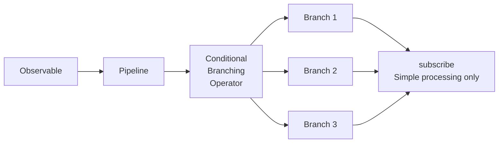
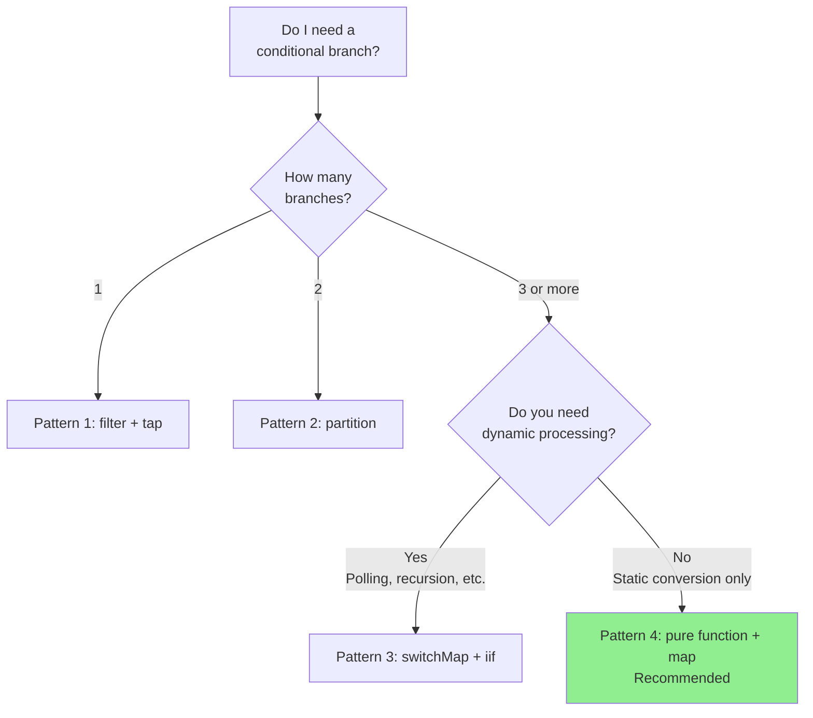

# Conditional branching patterns within subscribe

One of the problems that developers starting to use RxJS often run into is complex conditional branching within the `subscribe()` callback. This article explains why this is a problem and how it should be remedied, along with practical patterns.

> [!NOTE] Public APIs used in this article
> This article uses a free REST API called [JSONPlaceholder](https://jsonplaceholder.typicode.com/). The code actually works, so you can copy and paste it and try it in your browser.
>
> The conversion patterns to custom API response types (including `status`, `errorCode`, etc.) are also shown to help you convert external API responses to internal types in a real project.

## Problem: Complex conditional branching within subscribe

Conditional branching within subscribe reduces code readability and makes testing difficult. Let's look at the following example.

### Preparation: Helper function to wrap JSONPlaceholder API

First, define a helper function that converts the JSONPlaceholder API response to a custom type. This pattern can also be used to convert an external API to an internal type in a real project.

```typescript
import { Observable, from, of, map, catchError } from 'rxjs';

/**
 * JSONPlaceholder API Response Type
 */
interface Post {
  userId: number;
  id: number;
  title: string;
  body: string;
}

/**
 * Custom API Response Type
 */
interface ApiResponse<T = any> {
  status: 'success' | 'error' | 'pending';
  data?: T;
  errorCode?: string;
  message?: string;
}

/**
 * Wrap JSONPlaceholder API and convert to custom API response type
 *
 * The pattern of converting external API responses to internal types is often used in real projects.
 * This allows you to localize the impact of API changes and use consistent types within your application.
 */
function fetchPost(postId: number = 1): Observable<ApiResponse<Post>> {
  return from(
    fetch(`https://jsonplaceholder.typicode.com/posts/${postId}`)
      .then(response => {
        if (!response.ok) {
          throw new Error(`HTTP error! status: ${response.status}`);
        }
        return response.json();
      })
  ).pipe(
    map((data: Post) => ({
      status: 'success' as const,
      data
    })),
    catchError(err => {
      // Convert errors to custom response types
      let errorCode = 'UNKNOWN_ERROR';

      if (err.message.includes('404')) {
        errorCode = 'NOT_FOUND';
      } else if (err.message.includes('500')) {
        errorCode = 'SERVER_ERROR';
      } else if (err.message.includes('Failed to fetch')) {
        errorCode = 'NETWORK_ERROR';
      }

      return of({
        status: 'error' as const,
        errorCode,
        message: err.message
      });
    })
  );
}
```

### Examples of anti-patterns

The following example uses the above helper function (`fetchPost`), but it has performed a complicated conditional branching within `subscribe()`.

```typescript
/**
 * ❌ Example of problematic code
 * Complex conditional branching in subscribe
 */
class BadExampleManager {
  loading = false;
  data: Post | null = null;
  errorMessage = '';
  successMessage = '';

  // Callbacks for UI updates (optional)
  onStateChange?: (state: { loading: boolean; data: Post | null; errorMessage: string; successMessage: string }) => void;

  init(): void {
    this.fetchData();
  }

  fetchData(): void {
    this.loading = true;
    this.updateUI();

    // Get post data from JSONPlaceholder API
    fetchPost(1).subscribe({
      next: response => {
        this.loading = false;

        // ❌ Problem: Complex conditional branching within subscribe
        if (response.status === 'success') {
          if (response.data) {
            // Data validation
            if (response.data.title && response.data.body) {
              this.data = response.data;
              this.successMessage = `Loaded post "${response.data.title}"`;
            } else {
              this.errorMessage = 'Data format is invalid';
            }
          } else {
            this.errorMessage = 'No data available';
          }
        } else if (response.status === 'error') {
          if (response.errorCode === 'NOT_FOUND') {
            this.errorMessage = 'Data not found (non-existent post ID)';
          } else if (response.errorCode === 'NETWORK_ERROR') {
            this.errorMessage = 'Network error. Check the connection.';
            // Retry
            setTimeout(() => this.fetchData(), 5000);
          } else if (response.errorCode === 'SERVER_ERROR') {
            this.errorMessage = 'A server error has occurred';
          } else {
            this.errorMessage = 'An error has occurred';
          }
        } else if (response.status === 'pending') {
          this.errorMessage = 'Processing is in progress. Please wait a moment.';
          // Polling
          setTimeout(() => this.fetchData(), 3000);
        }
        this.updateUI();
      }
    });
  }

  private updateUI(): void {
    if (this.onStateChange) {
      this.onStateChange({
        loading: this.loading,
        data: this.data,
        errorMessage: this.errorMessage,
        successMessage: this.successMessage
      });
    }
  }
}

// Usage example (can be run in a browser console)
const badExample = new BadExampleManager();
badExample.onStateChange = (state) => {
  if (state.loading) console.log('Loading...');
  if (state.errorMessage) console.error(state.errorMessage);
  if (state.successMessage) console.log(state.successMessage);
  if (state.data) console.log('Data:', state.data);
};
badExample.init();

// Example output:
// Loading...
// Loaded post "sunt aut facere repellat provident occaecati excepturi optio reprehenderit"
// Data: {userId: 1, id: 1, title: "...", body: "..."}
```

### Problems with this implementation

> [!WARNING] Problems caused by conditional branches in subscribe
> 1. **Reduced readability** - deep nesting makes it difficult to follow the flow of processing
> 2. **Difficulty in testing** - logic in subscribe is difficult to write unit tests
> 3. **lack of reusability** - same logic cannot be used elsewhere
> 4. **Non-declarative** - deviates from the declarative style of RxJS
> 5. **Managing Side Effects** - multiple state changes are scattered and difficult to track

## Solution Summary

Conditional branches in subscribe are handled in the pipeline using RxJS operators. This makes the code declarative and easier to test.



This article describes four patterns:

1. **Pattern 1**: branching by filter + tap
2. **Pattern 2**: branching by partition
3. **Pattern 3**: dynamic branching with switchMap + iif
4. **Pattern 4**: Functionalization + transformation by map (recommended)

## Pattern 1: branching by filter + tap

The simplest way is to use `filter` to pass through only the values that match the conditions, and use `tap` to perform side effects.

### Example implementation

This example uses the `fetchPost()` function defined above to retrieve data from the JSONPlaceholder API.

```typescript
class Pattern1Manager {
  private destroy$ = new Subject<void>();

  loading = false;
  data: Post | null = null;
  errorMessage = '';

  // Callbacks for UI updates (optional)
  onStateChange?: (state: { loading: boolean; data: Post | null; errorMessage: string }) => void;

  init(): void {
    this.fetchData();
  }

  fetchData(): void {
    this.loading = true;
    this.updateUI();

    fetchPost(1).pipe(
      // ✅ Only pass through successful responses
      filter(response => response.status === 'success'),

      // ✅ Data validation
      filter(response => response.data !== undefined),

      // ✅ Log output (side effects)
      tap(response => console.log('Data acquisition successful:', response.data)),

      // Error handling
      catchError(err => {
        console.error('Error:', err);
        this.errorMessage = 'Data acquisition failed';
        this.loading = false;
        this.updateUI();
        return of(null);
      }),

      takeUntil(this.destroy$)
    ).subscribe({
      next: response => {
        this.loading = false;

        // ✅ Simple assignment only
        if (response) {
          this.data = response.data;
        }
        this.updateUI();
      }
    });
  }

  private updateUI(): void {
    if (this.onStateChange) {
      this.onStateChange({
        loading: this.loading,
        data: this.data,
        errorMessage: this.errorMessage
      });
    }
  }

  destroy(): void {
    this.destroy$.next();
    this.destroy$.complete();
  }
}

// Usage example (can be run in a browser console)
const pattern1 = new Pattern1Manager();
pattern1.onStateChange = (state) => {
  if (state.loading) console.log('Loading...');
  if (state.errorMessage) console.error(state.errorMessage);
  if (state.data) console.log('Post data:', state.data);
};
pattern1.init();

// Example output:
// Loading...
// Data acquisition successful: {userId: 1, id: 1, title: "...", body: "..."}
// Post data: {userId: 1, id: 1, title: "...", body: "..."}
```

### Advantages and Disadvantages

> [!TIP] Pattern 1 Features
> **advantages:**
> - simple and easy to understand
> - step-by-step filtering
> - clear step-by-step instructions
>
> **Drawbacks:**
> - not suitable for multiple branches (need to create a stream for each branch)
> - filtered values cannot be used in subsequent steps

## Pattern 2: Branching by partition

Using `partition`, an Observable can be split into two streams based on a condition.

### Implementation example

This example also uses the `fetchPost()` function to retrieve data from the JSONPlaceholder API.

```typescript
/**
 * Type definition of processing results
 */
interface ProcessedResult {
  type: 'success' | 'error';
  data?: Post;
  message: string;
}

class Pattern2Manager {
  private destroy$ = new Subject<void>();

  loading = false;
  result: ProcessedResult | null = null;

  // Callbacks for UI updates (optional)
  onStateChange?: (state: { loading: boolean; result: ProcessedResult | null }) => void;

  init(): void {
    this.fetchData();
  }

  fetchData(): void {
    this.loading = true;
    this.updateUI();

    const response$ = fetchPost(1).pipe(
      catchError(err => {
        console.error('HTTP Error:', err);
        return EMPTY;
      })
    );

    // ✅ Split by success and error
    const [success$, error$] = partition(
      response$,
      response => response.status === 'success'
    );

    // Processing success stream
    const successStream$ = success$.pipe(
      map(response => ({
        type: 'success' as const,
        data: response.data,
        message: 'Data retrieved'
      })),
      tap(() => console.log('Success processing complete'))
    );

    // Processing error stream
    const errorStream$ = error$.pipe(
      map(response => ({
        type: 'error' as const,
        message: this.getErrorMessage(response.errorCode)
      })),
      tap(result => console.log('Error processing complete:', result.message))
    );

    // ✅ Merge and subscribe to two streams
    merge(successStream$, errorStream$).pipe(
      takeUntil(this.destroy$)
    ).subscribe({
      next: result => {
        this.loading = false;
        this.result = result;

        // Additional processing based on specific error code
        if (result.type === 'error') {
          this.handleError(result);
        }
        this.updateUI();
      }
    });
  }

  private getErrorMessage(errorCode?: string): string {
    const messages: Record<string, string> = {
      'NOT_FOUND': 'Data not found (non-existent post ID)',
      'NETWORK_ERROR': 'Network error. Check the connection.',
      'SERVER_ERROR': 'A server error has occurred'
    };

    return messages[errorCode || ''] || 'An error has occurred';
  }

  private handleError(result: ProcessedResult): void {
    // Additional processing based on error type (e.g., redirect to login screen)
  }

  private updateUI(): void {
    if (this.onStateChange) {
      this.onStateChange({
        loading: this.loading,
        result: this.result
      });
    }
  }

  destroy(): void {
    this.destroy$.next();
    this.destroy$.complete();
  }
}

// Usage example (can be run in a browser console)
const pattern2 = new Pattern2Manager();
pattern2.onStateChange = (state) => {
  if (state.loading) console.log('Loading...');
  if (state.result) {
    console.log(`[${state.result.type}] ${state.result.message}`);
    if (state.result.data) console.log('Post data:', state.result.data);
  }
};
pattern2.init();

// Example output:
// Loading...
// Success processing complete
// [success] Data retrieved
// Post data: {userId: 1, id: 1, title: "...", body: "..."}
```

### Advantages and Disadvantages

> [!TIP] Pattern 2 Features
> **advantages:**
> - Two branches can be clearly separated
> - Each stream can be processed independently
> - Easy to test
>
> **Disadvantages:**
> - limited to 2 branches (not suitable for more than 3 branches)
> - need to subscribe to both streams

## Pattern 3: dynamic branching with switchMap + iif

With `iif` you can switch to different Observables depending on the condition.

### Implementation example

This example tries a non-existent post ID (999) and shows what happens in case of an error.

```typescript
class Pattern3Manager {
  private destroy$ = new Subject<void>();

  loading = false;
  data: Post | null = null;
  statusMessage = '';

  // Callbacks for UI updates (optional)
  onStateChange?: (state: { loading: boolean; data: Post | null; statusMessage: string }) => void;

  init(): void {
    // Try a post ID (999) that does not exist
    this.fetchData(999);
  }

  fetchData(postId: number = 1): void {
    this.loading = true;
    this.updateUI();

    fetchPost(postId).pipe(
      // ✅ Branch processing according to response status
      switchMap(response =>
        iif(
          // Condition 1: Success
          () => response.status === 'success',
          // Processing on success
          of(response).pipe(
            map(r => ({ type: 'success' as const, data: r.data })),
            tap(() => console.log('Data acquisition successful'))
          ),
          // Condition 2: Error
          // Converted to error stream with throwError in case of error
          throwError(() => ({
            message: this.getErrorMessage(response.errorCode),
            errorCode: response.errorCode
          }))
        )
      ),
      retry({
        count: 2,
        delay: 1000 // Wait 1 second and retry
      }),
      catchError(err => {
        console.error('Error:', err);
        this.statusMessage = err.message || 'An error has occurred';
        this.loading = false;
        this.updateUI();
        return EMPTY;
      }),
      takeUntil(this.destroy$)
    ).subscribe({
      next: result => {
        this.loading = false;

        if (result.type === 'success') {
          this.data = result.data;
          this.statusMessage = '';
        }
        this.updateUI();
      }
    });
  }

  private getErrorMessage(errorCode?: string): string {
    const messages: Record<string, string> = {
      'NOT_FOUND': 'Data not found (non-existent post ID)',
      'NETWORK_ERROR': 'Network error. Check the connection.',
      'SERVER_ERROR': 'A server error has occurred'
    };
    return messages[errorCode || ''] || 'An error has occurred';
  }

  private updateUI(): void {
    if (this.onStateChange) {
      this.onStateChange({
        loading: this.loading,
        data: this.data,
        statusMessage: this.statusMessage
      });
    }
  }

  destroy(): void {
    this.destroy$.next();
    this.destroy$.complete();
  }
}

// Usage example (can be run in a browser console)
const pattern3 = new Pattern3Manager();
pattern3.onStateChange = (state) => {
  if (state.loading) console.log('Loading...');
  if (state.statusMessage) console.log(state.statusMessage);
  if (state.data) console.log('Post data:', state.data);
};
pattern3.init();

// Example output (when trying non-existent post ID 999):
// Loading...
// Error: {...}
// Data not found (non-existent post ID)
//
// When specifying a valid post ID (1):
// pattern3.fetchData(1);
// Loading...
// Data acquisition successful
// Post data: {userId: 1, id: 1, title: "...", body: "..."}
```

### Advantages and Disadvantages

> [!TIP] Pattern 3 Features
> **advantages:**
> - can switch to different Observables depending on conditions
> - Easy to combine with retry processing
> - suitable for dynamic processing (polling, recursive calls, etc.)
>
> **Drawbacks:**
> - deep nesting may reduce readability
> - difficult to debug
> - Difficult for beginners to understand
>
> **Note:** This example shows a simple success/error branch, but can actually accommodate more complex dynamic processing, such as polling for asynchronous processing including pending states.

## Pattern 4: Functionalization + transformation by map (recommended)

The most recommended pattern is to cut out the conditional branch logic as a pure function and transform it with the `map` operator.

### Example implementation

This example defines a pure function that converts the API response returned from `fetchPost()` into a ViewModel for UI display.

```typescript
/**
 * View model for UI display
 */
interface ViewModel {
  loading: boolean;
  displayData: Post | null;
  messageType: 'success' | 'error' | 'info' | null;
  message: string;
  showRetryButton: boolean;
}

/**
 * ✅ Pure Function: Convert API Response to ViewModel
 * Easy to test and reuse
 */
function mapResponseToViewModel(response: ApiResponse<Post>): ViewModel {
  // Processing successful responses
  if (response.status === 'success') {
    return {
      loading: false,
      displayData: response.data || null,
      messageType: 'success',
      message: `Loaded post "${response.data?.title}"`,
      showRetryButton: false
    };
  }

  // Processing error responses
  if (response.status === 'error') {
    const errorMessages: Record<string, string> = {
      'NOT_FOUND': 'Data not found (non-existent post ID)',
      'NETWORK_ERROR': 'Network error. Check the connection.',
      'SERVER_ERROR': 'A server error has occurred. Please wait a moment and try again.'
    };

    const message = errorMessages[response.errorCode || ''] ||
                    response.message ||
                    'An error has occurred';

    return {
      loading: false,
      displayData: null,
      messageType: 'error',
      message,
      showRetryButton: isRetryableError(response.errorCode)
    };
  }

  // Handling of Pending responses (not generated by the JSONPlaceholder API, but for future extension)
  if (response.status === 'pending') {
    return {
      loading: true,
      displayData: null,
      messageType: 'info',
      message: 'Processing is in progress. Please wait a moment.',
      showRetryButton: false
    };
  }

  // Fallback
  return {
    loading: false,
    displayData: null,
    messageType: 'error',
    message: 'Unknown response',
    showRetryButton: false
  };
}

/**
 * ✅ Pure functions: determine if an error can be retried
 */
function isRetryableError(errorCode?: string): boolean {
  const retryableErrors = ['NETWORK_ERROR', 'SERVER_ERROR'];
  return retryableErrors.includes(errorCode || '');
}

/**
 * ✅ Pure functions: return side effects for specific errors
 */
function getErrorSideEffect(errorCode?: string): (() => void) | null {
  const sideEffects: Record<string, () => void> = {
    'NETWORK_ERROR': () => {
      console.log('Network error: Please check your connection');
    },
    'SERVER_ERROR': () => {
      console.log('Server error: Wait a moment and try again');
    }
  };

  return sideEffects[errorCode || ''] || null;
}

class Pattern4Manager {
  private destroy$ = new Subject<void>();

  viewModel: ViewModel = {
    loading: false,
    displayData: null,
    messageType: null,
    message: '',
    showRetryButton: false
  };

  // Callbacks for UI updates (optional)
  onStateChange?: (viewModel: ViewModel) => void;

  init(): void {
    this.fetchData();
  }

  fetchData(postId: number = 1): void {
    // Set initial loading state
    this.viewModel = {
      loading: true,
      displayData: null,
      messageType: null,
      message: '',
      showRetryButton: false
    };
    this.updateUI();

    fetchPost(postId).pipe(
      // ✅ Convert using pure functions in pipeline
      map(response => mapResponseToViewModel(response)),

      // ✅ Side-effects are executed in tap (separated from pure functions)
      tap(viewModel => {
        console.log('ViewModel:', viewModel);
      }),

      // Error handling
      catchError(err => {
        console.error('HTTP Error:', err);

        const errorViewModel: ViewModel = {
          loading: false,
          displayData: null,
          messageType: 'error',
          message: 'Network error occurred',
          showRetryButton: true
        };

        return of(errorViewModel);
      }),

      takeUntil(this.destroy$)
    ).subscribe({
      next: viewModel => {
        // ✅ Simple assignment only in subscribe
        this.viewModel = viewModel;

        // Perform side effects according to error code
        if (viewModel.messageType === 'error') {
          const sideEffect = getErrorSideEffect(
            // Since the original errorCode is not kept here,
            // it needs to be added to the ViewModel
          );
          sideEffect?.();
        }
        this.updateUI();
      }
    });
  }

  private updateUI(): void {
    if (this.onStateChange) {
      this.onStateChange(this.viewModel);
    }
  }

  destroy(): void {
    this.destroy$.next();
    this.destroy$.complete();
  }
}

// Usage example (can be run in a browser console)
const pattern4 = new Pattern4Manager();
pattern4.onStateChange = (viewModel) => {
  if (viewModel.loading) console.log('Loading...');
  if (viewModel.message) console.log(`[${viewModel.messageType}] ${viewModel.message}`);
  if (viewModel.displayData) console.log('Post data:', viewModel.displayData);
  if (viewModel.showRetryButton) console.log('Show Retry button');
};
pattern4.init();

// Example output:
// Loading...
// ViewModel: {loading: false, displayData: {...}, messageType: "success", message: "Loaded post \"...\"", showRetryButton: false}
// [success] Loaded post "sunt aut facere repellat provident occaecati excepturi optio reprehenderit"
// Post data: {userId: 1, id: 1, title: "...", body: "..."}
```

### Further improvement: keep errorCode

In the above example, the `errorCode` is not included in the ViewModel, so side effects cannot be determined. Here is an improved version.

```typescript
/**
 * Improved ViewModel (keeps errorCode)
 */
interface ImprovedViewModel {
  loading: boolean;
  displayData: Post | null;
  messageType: 'success' | 'error' | 'info' | null;
  message: string;
  showRetryButton: boolean;
  errorCode?: string; // ✅ Preserves error codes
}

/**
 * Improved mapping function
 */
function mapResponseToImprovedViewModel(response: ApiResponse<Post>): ImprovedViewModel {
  if (response.status === 'success') {
    return {
      loading: false,
      displayData: response.data || null,
      messageType: 'success',
      message: `Loaded post "${response.data?.title}"`,
      showRetryButton: false
    };
  }

  if (response.status === 'error') {
    const errorMessages: Record<string, string> = {
      'NOT_FOUND': 'Data not found (non-existent post ID)',
      'NETWORK_ERROR': 'Network error. Check the connection.',
      'SERVER_ERROR': 'A server error has occurred'
    };

    return {
      loading: false,
      displayData: null,
      messageType: 'error',
      message: errorMessages[response.errorCode || ''] || 'An error has occurred',
      showRetryButton: isRetryableError(response.errorCode),
      errorCode: response.errorCode // ✅ Preserves error codes
    };
  }

  if (response.status === 'pending') {
    return {
      loading: true,
      displayData: null,
      messageType: 'info',
      message: 'Processing',
      showRetryButton: false
    };
  }

  return {
    loading: false,
    displayData: null,
    messageType: 'error',
    message: 'Unknown response',
    showRetryButton: false
  };
}

class ImprovedPattern4Manager {
  private destroy$ = new Subject<void>();
  viewModel: ImprovedViewModel = {
    loading: false,
    displayData: null,
    messageType: null,
    message: '',
    showRetryButton: false
  };

  // Callbacks for UI updates (optional)
  onStateChange?: (viewModel: ImprovedViewModel) => void;

  init(): void {
    this.fetchData();
  }

  fetchData(postId: number = 1): void {
    fetchPost(postId).pipe(
      map(response => mapResponseToImprovedViewModel(response)),
      tap(viewModel => console.log('ViewModel:', viewModel)),
      catchError(err => {
        console.error('HTTP Error:', err);
        return of({
          loading: false,
          displayData: null,
          messageType: 'error' as const,
          message: 'Network error',
          showRetryButton: true
        });
      }),
      takeUntil(this.destroy$)
    ).subscribe({
      next: viewModel => {
        this.viewModel = viewModel;

        // ✅ Perform side effects according to error code
        if (viewModel.errorCode) {
          const sideEffect = getErrorSideEffect(viewModel.errorCode);
          sideEffect?.();
        }
        this.updateUI();
      }
    });
  }

  private updateUI(): void {
    if (this.onStateChange) {
      this.onStateChange(this.viewModel);
    }
  }

  destroy(): void {
    this.destroy$.next();
    this.destroy$.complete();
  }
}

// Usage example (can be run in a browser console)
const improvedPattern4 = new ImprovedPattern4Manager();
improvedPattern4.onStateChange = (viewModel) => {
  if (viewModel.loading) console.log('Loading...');
  if (viewModel.message) console.log(`[${viewModel.messageType}] ${viewModel.message}`);
  if (viewModel.displayData) console.log('Post data:', viewModel.displayData);
};
improvedPattern4.init();

// Example output:
// ViewModel: {loading: false, displayData: {...}, messageType: "success", message: "...", showRetryButton: false}
// [success] Loaded post "sunt aut facere repellat provident occaecati excepturi optio reprehenderit"
// Post data: {userId: 1, id: 1, title: "...", body: "..."}
```

### Advantages and Disadvantages

> [!TIP] Pattern 4 Features (Recommended)
> **advantages:**
> - **Easy to test**: pure function, easy to unit test
> - **Reusable**: Can use the same logic in other components
> - **Highly readable**: Clear separation of conversion logic
> - **Type safe**: TypeScript type inference works
> - **Highly maintainable**: clear scope of impact when logic changes
>
> **Disadvantages:**
> - More code (but trade-off for clarity)

## Practical example: complete implementation of API response handling

Here is a practical example implementation that combines the previous patterns, using the JSONPlaceholder API.

```typescript
/**
 * View Model Type Definition
 */
interface DataViewModel<T = any> {
  loading: boolean;
  data: T | null;
  error: {
    message: string;
    code?: string;
    retryable: boolean;
  } | null;
  info: string | null;
}

/**
 * Data Acquisition Service
 */
class DataService {

  /**
   * Data acquisition (automatic retry support)
   */
  fetchData<T>(postId: number = 1): Observable<DataViewModel<T>> {
    return fetchPost(postId).pipe(

      // Response conversion to ViewModel
      map(response => this.mapToViewModel<T>(response)),

      // HTTP error handling
      catchError((err: Error) =>
        of(this.createErrorViewModel<T>(err))
      ),

      // Automatic retry for retriable errors
      retry({
        count: 2,
        delay: 1000 // Wait 1 second and retry
      })
    );
  }

  /**
   * Converting API response to ViewModel (pure function)
   */
  private mapToViewModel<T>(response: ApiResponse<T>): DataViewModel<T> {
    if (response.status === 'success') {
      return {
        loading: false,
        data: response.data || null,
        error: null,
        info: null
      };
    }

    if (response.status === 'error') {
      return {
        loading: false,
        data: null,
        error: {
          message: this.getErrorMessage(response.errorCode, response.message),
          code: response.errorCode,
          retryable: this.isRetryableError(response.errorCode)
        },
        info: null
      };
    }

    // Pending (does not occur with JSONPlaceholder API, but for future extension)
    return {
      loading: true,
      data: null,
      error: null,
      info: 'Processing...'
    };
  }

  /**
   * Creating a ViewModel from an HTTP error
   */
  private createErrorViewModel<T>(err: Error): DataViewModel<T> {
    return {
      loading: false,
      data: null,
      error: {
        message: err.message || 'An error has occurred',
        code: 'FETCH_ERROR',
        retryable: true
      },
      info: null
    };
  }

  /**
   * Obtaining error messages
   */
  private getErrorMessage(errorCode?: string, fallbackMessage?: string): string {
    const messages: Record<string, string> = {
      'NOT_FOUND': 'Data not found (non-existent post ID)',
      'NETWORK_ERROR': 'Network error. Check the connection.',
      'SERVER_ERROR': 'A server error has occurred'
    };

    return messages[errorCode || ''] || fallbackMessage || 'An error has occurred';
  }

  /**
   * Determine if the error is retriable
   */
  private isRetryableError(errorCode?: string): boolean {
    const retryable = ['NETWORK_ERROR', 'SERVER_ERROR'];
    return retryable.includes(errorCode || '');
  }
}

/**
 * Data Display Manager
 */
class DataDisplayManager {
  private destroy$ = new Subject<void>();
  private dataService = new DataService();

  viewModel: DataViewModel = {
    loading: false,
    data: null,
    error: null,
    info: null
  };

  // Callbacks for UI updates (optional)
  onStateChange?: (viewModel: DataViewModel) => void;

  init(): void {
    this.loadData();
  }

  loadData(postId: number = 1): void {
    this.viewModel = {
      loading: true,
      data: null,
      error: null,
      info: null
    };
    this.updateUI();

    this.dataService.fetchData(postId).pipe(
      takeUntil(this.destroy$)
    ).subscribe({
      next: viewModel => {
        // ✅ Only simple assignment in subscribe
        this.viewModel = viewModel;
        this.updateUI();
      }
    });
  }

  private updateUI(): void {
    if (this.onStateChange) {
      this.onStateChange(this.viewModel);
    }
  }

  destroy(): void {
    this.destroy$.next();
    this.destroy$.complete();
  }
}

// Usage example (can be run in a browser console)
const dataDisplay = new DataDisplayManager();
dataDisplay.onStateChange = (viewModel) => {
  if (viewModel.loading) console.log('Loading...');
  if (viewModel.error) {
    console.error(viewModel.error.message);
    if (viewModel.error.retryable) console.log('Can be retried');
  }
  if (viewModel.info) console.log(viewModel.info);
  if (viewModel.data) console.log('Post data:', viewModel.data);
};
dataDisplay.init();

// Example output:
// Loading...
// Post data: {userId: 1, id: 1, title: "...", body: "..."}
//
// Example in case of error (specifying non-existent post ID 999):
// dataDisplay.loadData(999);
// Loading...
// Data not found (non-existent post ID)
// Can be retried
```

> [!IMPORTANT] Key Points of Practical Patterns
> 1. **Conversion at the Service Layer**: Convert the API response to the ViewModel at the service layer
> 2. **Use pure functions**: Carve out conditional branching logic as pure functions
> 3. **Simplify in subscribe**: only do assignment when subscribing
> 4. **Unify error handling**: Complete error handling in the pipeline
> 5. **Ensure type safety**: Ensure safety in ViewModel type definitions

## Selection Guidelines

Here are some guidelines for each scenario to help you decide which pattern to choose.



### Pattern Selection Criteria

| Scenario | Recommended Pattern | Reason |
|---------|------------|------|
| Simple filtering | Pattern 1 (filter + tap) | Simple and easy to understand |
| Two branches of success/failure | Pattern 2 (partition) | Clear separation possible |
| Polling and retry | Pattern 3 (switchMap + iif) | Supports dynamic processing |
| Complex conditional branching | Pattern 4 (pure function + map) | Testable and reusable |
| Requires state management | Pattern 4 (pure function + map) | Suitable for ViewModel pattern |

> [!TIP] When in doubt, choose **Pattern 4 (pure function + map)**
> - Most maintainable
> - Easiest to test
> - Suitable for team development
> - Compatible with TypeScript's type system

## Summary

Complex conditional branching within subscribe is one of the anti-patterns of RxJS. Using the four patterns described in this article, you can write declarative and maintainable code.

### Key Principles

> [!IMPORTANT] Principles for avoiding conditional branches in subscribe
> 1. **Logic is handled in the pipeline** - complete the conversion before subscribe
> 2. **Use pure functions** - carve out the conditional branching logic as a function
> 3. **Use ViewModel pattern** - convert to a model for UI display
> 4. **Separate side effects with tap** - clearly separate pure conversion from side effects
> 5. **Make sure of type safety** - Make the most of TypeScript's type system

### Before / After Comparison

**Before (anti-pattern):**
```typescript
observable$.subscribe(value => {
  if (value.status === 'success') {
    if (value.data) {
      this.data = value.data;
    }
  } else if (value.status === 'error') {
    if (value.errorCode === 'AUTH_ERROR') {
      // ...
    } else if (value.errorCode === 'NOT_FOUND') {
      // ...
    }
  }
});
```

**After (recommended pattern):**
```typescript
observable$.pipe(
  map(response => mapToViewModel(response)),
  tap(viewModel => console.log('Processed:', viewModel))
).subscribe(viewModel => {
  this.viewModel = viewModel;
});
```

### Related Sections

- **[RxJS Anti-Patterns](/en/guide/anti-patterns/)** - Common mistakes and solutions
- **[Error Handling](/en/guide/error-handling/strategies.md)** - Basics of error handling
- **[API Calling Patterns](/en/guide/practical-patterns/api-calls.md)** - Practical patterns of API communication
- **[Form Handling Patterns](/en/guide/practical-patterns/form-handling.md)** - conditional branching in forms

## Test code

Here is an example test for Pattern 4 (pure function + map).

```typescript
describe('mapResponseToViewModel', () => {
  it('should map success response correctly', () => {
    const response: ApiResponse = {
      status: 'success',
      data: { id: 1, name: 'Test' }
    };

    const result = mapResponseToViewModel(response);

    expect(result.loading).toBe(false);
    expect(result.displayData).toEqual({ id: 1, name: 'Test' });
    expect(result.messageType).toBe('success');
    expect(result.showRetryButton).toBe(false);
  });

  it('should map error response with retryable error', () => {
    const response: ApiResponse = {
      status: 'error',
      errorCode: 'RATE_LIMIT'
    };

    const result = mapResponseToViewModel(response);

    expect(result.loading).toBe(false);
    expect(result.displayData).toBeNull();
    expect(result.messageType).toBe('error');
    expect(result.showRetryButton).toBe(true); // RATE_LIMIT can be retried
  });

  it('should map error response with non-retryable error', () => {
    const response: ApiResponse = {
      status: 'error',
      errorCode: 'NOT_FOUND'
    };

    const result = mapResponseToViewModel(response);

    expect(result.showRetryButton).toBe(false); // NOT_FOUND is not retryable
  });

  it('should map pending response', () => {
    const response: ApiResponse = {
      status: 'pending'
    };

    const result = mapResponseToViewModel(response);

    expect(result.loading).toBe(true);
    expect(result.messageType).toBe('info');
  });
});

describe('isRetryableError', () => {
  it('should identify retryable errors', () => {
    expect(isRetryableError('RATE_LIMIT')).toBe(true);
    expect(isRetryableError('TIMEOUT')).toBe(true);
    expect(isRetryableError('SERVER_ERROR')).toBe(true);
  });

  it('should identify non-retryable errors', () => {
    expect(isRetryableError('NOT_FOUND')).toBe(false);
    expect(isRetryableError('AUTH_ERROR')).toBe(false);
    expect(isRetryableError('VALIDATION_ERROR')).toBe(false);
  });
});
```

> [!TIP] Why testing pure functions is easy
> - Does not depend on external state
> - Same input always returns same output
> - No side effects
> - No need to mock or spy

## Reference Resources

Further learning resources to avoid conditional branches in subscribe.

- [Official RxJS Documentation - Operators](https://rxjs.dev/guide/operators) - How to use operators
- [Learn RxJS - Transformation Operators](https://www.learnrxjs.io/learn-rxjs/operators/transformation) - More on transformation operators
- [Learn RxJS - Partition](https://www.learnrxjs.io/learn-rxjs/operators/transformation/partition) - Example usage of partition
- [RxJS Best Practices](https://blog.angular-university.io/rxjs-best-practices/) - Best practices for RxJS
