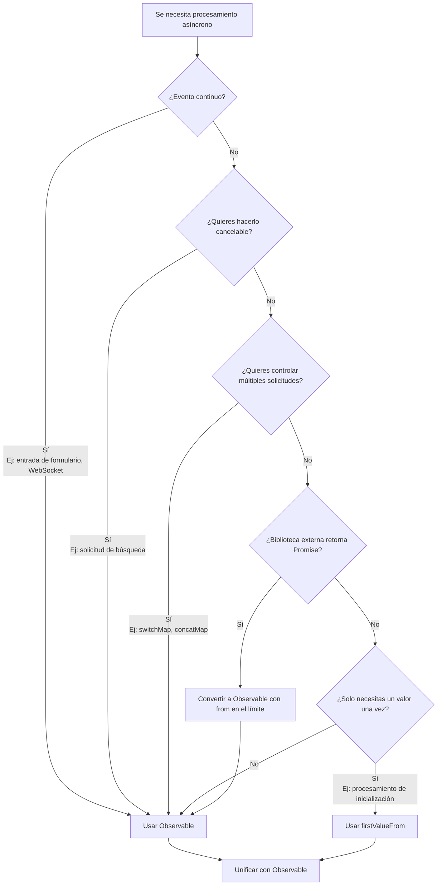

# Anti-patrón de mezcla de Promise y Observable

Promise y Observable son ambos mecanismos para manejar procesamiento asíncrono, pero **si se mezclan sin clarificar los límites del diseño, ocurren varios problemas**. Esta página explica en detalle los anti-patrones por mezcla y los métodos apropiados de unificación.

## Por qué es importante la unificación

Mezclar Promise y Observable causa los siguientes problemas.

### 1. No cancelable

Observable puede interrumpir el procesamiento con `unsubscribe` / `takeUntil`, pero **Promise no se puede interrumpir una vez iniciado**.

```ts
import { interval, Subject } from 'rxjs';
import { takeUntil } from 'rxjs';

const destroy$ = new Subject<void>();

// ✅ Observable: Cancelable
interval(1000).pipe(
  takeUntil(destroy$)
).subscribe(n => console.log(n));

// Usuario deja la pantalla y se cancela
destroy$.next();
destroy$.complete();
```

```ts
// ❌ Promise: No cancelable
async function fetchData() {
  const response = await fetch('/api/data');
  // fetch no se detiene aunque el usuario deje la pantalla
  return response.json();
}
```

**Impacto:** Solicitudes innecesarias durante transición de rutas, ejecución de efectos secundarios no necesarios

### 2. Dificultad en control de múltiples disparos

Observable puede serializar, cancelar y prevenir reentrada de múltiples solicitudes con `switchMap`/`concatMap`/`exhaustMap`.

```ts
import { fromEvent } from 'rxjs';
import { switchMap, debounceTime } from 'rxjs';

const searchInput = document.getElementById('serch-input')!;

// ✅ Observable: Solo procesar la solicitud más reciente
fromEvent(searchInput, 'input').pipe(
  debounceTime(300),
  switchMap(event => searchAPI((event.target as HTMLInputElement).value))
  // Las solicitudes antiguas se cancelan automáticamente
).subscribe(results => displayResults(results));
function searchAPI(query: string) {
  return fetch(`/api/search?q=${query}`).then(r => r.json());
}

function displayResults(results: unknown) {
  console.log(results);
}
```

Con Promise, necesitas implementar manualmente este tipo de control, lo que se vuelve complejo.

### 3. Correspondencia con eventos múltiples veces

Observable es fuerte en procesar **valores que fluyen continuamente** como entrada de formularios, WebSocket, eventos.

```ts
import { fromEvent } from 'rxjs';
import { map } from 'rxjs';

// ✅ Observable: Procesar eventos continuos
fromEvent(document, 'mousemove').pipe(
  map(event => ({ x: (event as MouseEvent).clientX, y: (event as MouseEvent).clientY }))
).subscribe(position => {
  console.log('Mouse position:', position);
});
```

Promise está especializado en procesamiento "solo una vez", no es adecuado para eventos continuos.

### 4. Facilidad de prueba

Observable puede garantizar tiempo y concurrencia con pruebas marble.

```ts
import { TestScheduler } from 'rxjs/testing';

// ✅ Observable: Se puede controlar tiempo con pruebas marble
// ※ Este código se ejecuta dentro de framework de pruebas (Jasmine/Jest)
describe('Observable Test', () => {
  let scheduler: TestScheduler;

  beforeEach(() => {
    scheduler = new TestScheduler((actual, expected) => {
      expect(actual).toEqual(expected); // Usar expect de framework de pruebas
    });
  });

  it('should emit values over time', () => {
    scheduler.run(({ cold, expectObservable }) => {
      const source$ = cold('a-b-c|');
      expectObservable(source$).toBe('a-b-c|');
    });
  });
});
```

El código basado en Promise tiende a tener pruebas asíncronas complejas. Consulta [Métodos de prueba](/es/guide/testing/unit-tests) para detalles.


## Patrones típicos donde "te atascas" con mezcla (evitar)

A continuación se muestran patrones problemáticos comúnmente vistos en proyectos reales.

### ❌ Anti-patrón 1: Mezcla de async/await y pipe()

Si usas `await` en medio del procesamiento Observable, o mezclas procesamiento Promise y Observable, se vuelve no cancelable.

```ts
import { ajax } from 'rxjs/ajax';
import { firstValueFrom } from 'rxjs';

// ❌ Ejemplo malo: Mezcla Observable → Promise → Promise
async function fetchUserData() {
  const user = await firstValueFrom(ajax.getJSON('/api/user'));

  // Después de convertir a Promise, se vuelve no cancelable
  return fetch('/api/profile').then(response => response.json());
}
```

```ts
import { of } from 'rxjs';
import { map } from 'rxjs';

// ❌ Ejemplo malo: Intentar usar await dentro de pipe() (en realidad no funciona)
async function processData() {
  return of(1, 2, 3).pipe(
    map(async (value) => {
      const result = await someAsyncOperation(value);
      return result; // Se convierte en Observable<Promise<T>>
    })
  );
}

async function someAsyncOperation(value: number): Promise<number> {
  return value * 2;
}
```

#### Problemas
- Se vuelve no cancelable
- Canal de error se separa (va al lado `unhandledrejection` en lugar de `error`)
- Las responsabilidades de Promise y Observable se vuelven ambiguas
- El tipo se convierte en `Observable<Promise<T>>`

### ❌ Anti-patrón 2: Uso de `toPromise()` (ya obsoleto)

```ts
import { interval } from 'rxjs';

// ❌ Ejemplo malo: toPromise() se eliminó en RxJS v8
interval(1000).toPromise().then(value => {
  console.log(value);
});
```

**Solución:** Usar `firstValueFrom` / `lastValueFrom` (se describe más adelante)

### ❌ Anti-patrón 3: `await` dentro de `subscribe`

```ts
import { fromEvent } from 'rxjs';

const button = document.getElementById('btn') as HTMLButtonElement;

// ❌ Ejemplo malo
fromEvent(button, 'click').subscribe(async () => {
  const data = await fetch('/api/data').then(r => r.json());
  console.log(data);
  // El flujo se vuelve ilegible, manejo de errores difícil
});
```

#### Problemas
- El flujo se vuelve ilegible
- Fuente de solicitudes duplicadas
- Posibilidad de fugas de memoria

### ❌ Anti-patrón 4: Anidamiento de subscribe

```ts
import { ajax } from 'rxjs/ajax';

// ❌ Ejemplo malo
ajax.getJSON('/api/users').subscribe(users => {
  ajax.getJSON('/api/settings').subscribe(settings => {
    console.log(users, settings);
    // Infierno de callbacks
  });
});
```

#### Problemas
- Complejización del manejo de errores
- Gestión de cancelación de suscripción difícil

### ❌ Anti-patrón 5: Obtención paralela del mismo dato con Promise y Observable

```ts
import { ajax } from 'rxjs/ajax';

// ❌ Ejemplo malo
async function loadData() {
  const userPromise = fetch('/api/user').then(r => r.json());
  const user$ = ajax.getJSON('/api/user');

  // Se obtienen los mismos datos dos veces
}
```

#### Problemas
- Ejecución doble
- Competencia de orden

### ❌ Anti-patrón 6: Retornando Promise dentro de Observable

Usar `async/await` dentro del constructor de Observable dificulta el manejo de errores.

```ts
import { Observable } from 'rxjs';

// ❌ Ejemplo malo: Usar async function dentro de Observable
const data$ = new Observable(subscriber => {
  async function fetchData() {
    const response = await fetch('/api/data');
    const data = await response.json();
    subscriber.next(data);
    subscriber.complete();
  }

  fetchData(); // Se retorna Promise pero no se pueden capturar errores
  // Si fetchData() rechaza, subscriber.error() no se llama
});
```

```ts
import { Observable } from 'rxjs';

// ❌ Ejemplo malo: Pasar Promise a subscriber.next()
const data$ = new Observable(subscriber => {
  const promise = fetch('/api/data').then(r => r.json());
  subscriber.next(promise); // Fluye el objeto Promise
  subscriber.complete();
});

// Se recibe Promise en el lado de suscripción
data$.subscribe(value => {
  console.log(value); // Se imprime Promise { <pending> }
});
```

#### Problemas
- Errores de Promise no fluyen al canal de error de Observable
- Posibilidad de convertirse en `unhandledrejection`
- Se pasa objeto Promise a subscriber.next()
- El suscriptor necesita hacer unwrap de Promise

#### Solución

```ts
import { from, defer } from 'rxjs';

// ✅ Ejemplo bueno: Convertir Promise a Observable con from()
const data$ = from(fetch('/api/data').then(r => r.json()));

// ✅ Ejemplo bueno: Evaluación diferida con defer()
const data$ = defer(() => fetch('/api/data').then(r => r.json()));
```


## Guía práctica: Convertir limpiamente en el límite

Como es difícil evitar completamente la mezcla, la mejor práctica es **convertir apropiadamente en el límite del diseño**.

### Patrón 1: Promise → Observable (SDK externo, etc. retorna Promise)

Cuando biblioteca externa o código legacy retorna Promise, **convertir a Observable solo una vez en el límite**.

```ts
import { from } from 'rxjs';
import { switchMap } from 'rxjs';

// SDK externo retorna Promise
async function externalSDK(): Promise<{ userId: string }> {
  return { userId: '123' };
}

// ✅ Ejemplo bueno: Convertir en el límite y unificar con Observable a partir de ahí
const user$ = from(externalSDK());

user$.pipe(
  switchMap(user => from(fetchProfile(user.userId)))
).subscribe(profile => {
  console.log(profile);
});

async function fetchProfile(userId: string): Promise<{ name: string }> {
  return { name: 'John' };
}
```

### Patrón 2: Observable → Promise (contexto síncrono donde "solo necesitas una vez")

Cuando solo necesitas un valor una vez como procesamiento de inicialización o función de guarda, usa `firstValueFrom` / `lastValueFrom`.

```ts
import { ajax } from 'rxjs/ajax';
import { firstValueFrom, shareReplay } from 'rxjs';

// ✅ Ejemplo bueno: Cachear cuando haces await múltiples veces
const config$ = ajax.getJSON('/api/config').pipe(
  shareReplay({ bufferSize: 1, refCount: true })
);

async function initialize() {
  const config = await firstValueFrom(config$);
  console.log('Config loaded:', config);
}

async function validate() {
  const config = await firstValueFrom(config$); // Obtener del caché
  console.log('Validating with config:', config);
}
```

**⚠️ Atención:** `firstValueFrom` solo obtiene **el primer ítem**. **Nunca uses** con eventos continuos (valueChanges, WebSocket, etc.).

```ts
import { interval } from 'rxjs';
import { firstValueFrom } from 'rxjs';

// ❌ Ejemplo malo: firstValueFrom en stream infinito
const value = await firstValueFrom(interval(1000));
// Solo obtiene un valor y termina (comportamiento no intencionado)
```

### Patrón 3: Unificación de manejo de errores

Ten cuidado de que el canal de manejo de errores no se separe entre Promise y Observable.

```ts
import { from } from 'rxjs';
import { catchError } from 'rxjs';
import { of } from 'rxjs';

async function riskyOperation(): Promise<string> {
  throw new Error('Something went wrong');
}

// ✅ Ejemplo bueno: Unificar con manejo de errores de Observable
from(riskyOperation()).pipe(
  catchError(error => {
    console.error('Error caught in Observable pipeline:', error);
    return of('fallback value');
  })
).subscribe(result => {
  console.log(result); // 'fallback value'
});
```


## Ejemplos de reemplazo de mezclas comunes

### Ejemplo 1: Convertir a Promise en el medio → then

#### ❌ Ejemplo malo

```ts
import { ajax } from 'rxjs/ajax';
import { firstValueFrom } from 'rxjs';

async function loadUser() {
  const user = await firstValueFrom(ajax.getJSON('/api/user'));

  // Convertir a Promise y continuar procesamiento con then
  return fetch('/api/profile')
    .then(response => response.json())
    .then(profile => {
      console.log(user, profile);
    });
}
```

#### ✅ Ejemplo bueno A: Todo Observable

```ts
import { ajax } from 'rxjs/ajax';
import { switchMap } from 'rxjs';

// Procesar manteniéndose Observable
ajax.getJSON('/api/user').pipe(
  switchMap(user => ajax.getJSON('/api/profile').pipe(
    // Combinar user y profile
  ))
).subscribe(profile => {
  console.log(profile);
});
```

#### ✅ Ejemplo bueno B: Contexto donde solo necesitas await una vez

```ts
import { ajax } from 'rxjs/ajax';
import { shareReplay, firstValueFrom } from 'rxjs';

const user$ = ajax.getJSON('/api/user').pipe(
  shareReplay({ bufferSize: 1, refCount: true })
);

async function loadUserOnce() {
  const user = await firstValueFrom(user$);
  console.log('User loaded once:', user);
}
```


### Ejemplo 2: await dentro de subscribe

#### ❌ Ejemplo malo

```ts
import { fromEvent } from 'rxjs';

const button = document.getElementById('search-btn') as HTMLButtonElement;

fromEvent(button, 'click').subscribe(async () => {
  const results = await fetch('/api/search').then(r => r.json());
  console.log(results);
});
```

#### ✅ Ejemplo bueno

```ts
import { fromEvent, from } from 'rxjs';
import { switchMap } from 'rxjs';

const button = document.getElementById('search-btn') as HTMLButtonElement;

fromEvent(button, 'click').pipe(
  switchMap(() => from(fetch('/api/search').then(r => r.json())))
).subscribe(results => {
  console.log(results);
});
```


## Diagrama de flujo de decisión (guía fácil de recordar)

Guía para cuando dudes si usar Promise u Observable en un proyecto.



### Criterios específicos de decisión

| Condición | Recomendación | Razón |
|---|---|---|
| **Eventos continuos** (entrada de formulario, WebSocket) | Observable | Promise solo puede retornar un valor una vez |
| **Quieres hacerlo cancelable** (solicitud de búsqueda) | Observable | Promise no es cancelable |
| **Control de múltiples solicitudes** (switchMap, concatMap) | Observable | Difícil de controlar con Promise |
| **Biblioteca externa retorna Promise** | Convertir con `from()` | Convertir solo una vez en el límite |
| **Solo necesitas un valor una vez** (procesamiento de inicialización) | `firstValueFrom` | Combinar con `shareReplay(1)` según necesidad |


## Resumen

- **La mezcla en sí no es mala**, pero la respuesta correcta es **clarificar "límite" del diseño** e inclinarse hacia un lado
- **Unificar basándose en Observable** y **convertir con `firstValueFrom`/`from()` solo en lugares mínimos necesarios** es lo que menos problemas causa y garantiza pruebas, legibilidad y cancelabilidad
- **Eventos continuos (formulario, WebSocket) nunca convertir a Promise**

## Secciones relacionadas

- **[Diferencias entre Promise y RxJS](/es/guide/basics/promise-vs-rxjs)** - Métodos básicos de conversión
- **[Manejo de errores](/es/guide/error-handling/strategies)** - Estrategias de procesamiento de errores de Observable
- **[Errores comunes y soluciones](/es/guide/anti-patterns/common-mistakes)** - Otros anti-patrones

## Próximos pasos

1. Identificar lugares en código existente donde Promise y Observable se mezclan
2. Clarificar límites y unificar con Observable
3. Agregar `takeUntil` en lugares donde se necesita procesamiento de cancelación
