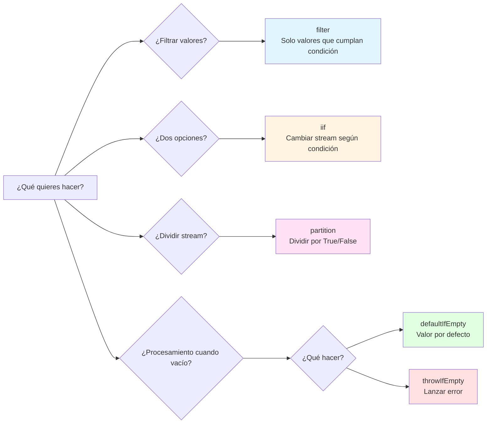

# Infierno de anidamiento de if dentro de subscribe

## Por qué esto es un anti-patrón

La "bifurcación condicional compleja dentro de subscribe" es un **anti-patrón claro** en RxJS. Se reconoce como patrón de implementación a evitar por las siguientes razones.

### 1. Va contra la filosofía de diseño de RxJS

RxJS recomienda **programación declarativa**. Deberías expresar "qué hacer" en el pipeline, no escribir los detalles de "cómo hacerlo" dentro de subscribe.

```typescript
// ❌ Anti-patrón: Programación imperativa (procedimental)
userService.getUser(id).subscribe(user => {
  if (user.isActive) {
    if (user.role === 'admin') {
      console.log('Admin user');
    }
  }
});

// ✅ Estilo RxJS: Programación declarativa
userService.getUser(id).pipe(
  filter(user => user.isActive),
  filter(user => user.role === 'admin'),
  tap(user => console.log('Admin user'))
).subscribe();
```

### 2. Problemas del mismo nivel que otros anti-patrones

Al igual que otros anti-patrones tratados en el Capítulo 10, causa los siguientes problemas:

| Anti-patrón | Problema principal |
|---------------|---------|
| **Fuga de memoria** | Olvido de unsubscribe |
| **Infierno de subscribe** | Subscribe anidados |
| **Infierno de if dentro de subscribe** ← Esta página | Bifurcación condicional compleja |

### 3. Problemas específicos

1. **Baja legibilidad** - El anidamiento se profundiza, la intención del código se vuelve poco clara
2. **Difícil de probar** - Los casos de prueba explotan con demasiadas bifurcaciones condicionales
3. **No reutilizable** - La lógica queda encerrada dentro de subscribe, no se puede usar en otro lugar
4. **Difícil de depurar** - Difícil seguir el flujo de valores, lleva tiempo identificar puntos problemáticos
5. **Manejo de errores complejo** - Difícil rastrear dónde ocurrió el error

### 4. Rango aceptable y rango a evitar

```typescript
// ✅ Rango aceptable: Bifurcación simple (1-2 sentencias if)
subscribe(user => {
  if (user.isAdmin) {
    console.log('Admin user');
  } else {
    console.log('Regular user');
  }
});

// ⚠️ Requiere atención: 2-3 niveles de anidamiento
subscribe(user => {
  if (user) {
    if (user.isActive) {
      console.log('Active user');
    }
  }
});

// ❌ Anti-patrón: 3 o más niveles de anidamiento
subscribe(user => {
  if (user) {
    if (user.isActive) {
      if (user.role === 'admin') {
        if (user.permissions.includes('write')) {
          // Esto es claramente un anti-patrón
        }
      }
    }
  }
});
```

> [!IMPORTANT] Criterios de juicio
> - **1-2 sentencias if**: Rango aceptable (aunque preferible con operadores)
> - **3 o más niveles de anidamiento**: Anti-patrón claro (debe refactorizarse)
> - **Procesamiento asíncrono anidado**: Necesita refactorización inmediata


## Patrones malos comunes

### Patrón 1: Bifurcación condicional compleja dentro de subscribe

```typescript
// ❌ Ejemplo malo: Anidamiento de sentencias if dentro de subscribe
userService.getUser(id).subscribe(user => {
  if (user) {
    if (user.isActive) {
      if (user.role === 'admin') {
        // Procesamiento para administradores
        console.log('Admin user:', user.name);
        adminService.loadAdminData().subscribe(adminData => {
          if (adminData) {
            // Más anidamiento...
          }
        });
      } else {
        // Procesamiento para usuarios regulares
        console.log('Regular user:', user.name);
      }
    } else {
      // Usuario inactivo
      console.log('Inactive user');
    }
  } else {
    // Usuario no encontrado
    console.log('User not found');
  }
});
```

### Problemas de este código
1. **5 niveles de anidamiento** - Legibilidad significativamente reducida
2. **subscribe dentro de subscribe** - Riesgo de fuga de memoria
3. **Sin manejo de errores** - No está claro dónde puede ocurrir un error
4. **Imposible de probar** - Difícil probar todos los caminos
5. **Lógica no reutilizable** - No se puede usar en otro lugar


## Soluciones usando operadores condicionales de RxJS

### Solución 1: Bifurcación condicional usando filter

**¿Cuándo usar?**: Para filtrar valores, excluir valores innecesarios

```typescript
import { filter, tap, switchMap } from 'rxjs';

// ✅ Ejemplo bueno: Separar condiciones con filter
userService.getUser(id).pipe(
  filter(user => user !== null),           // Verificación de null
  filter(user => user.isActive),           // Verificación de activo
  filter(user => user.role === 'admin'),   // Verificación de rol
  tap(user => console.log('Admin user:', user.name)),
  switchMap(user => adminService.loadAdminData())
).subscribe({
  next: adminData => console.log('Admin data loaded', adminData),
  error: err => console.error('Error:', err)
});
```

> [!NOTE] Beneficios
> - ✅ Cada condición es independiente (fácil de leer)
> - ✅ Orden claro en pipeline
> - ✅ Manejo de errores centralizado

### Solución 2: Bifurcación de dos opciones usando iif

**¿Cuándo usar?**: Para ejecutar Observable diferente según condición

```typescript
import { iif, of, switchMap } from 'rxjs';

// ✅ Ejemplo bueno: Cambiar stream con iif según condición
userService.getUser(id).pipe(
  switchMap(user =>
    iif(
      () => user.role === 'admin',
      adminService.loadAdminData(),    // Caso administrador
      userService.loadUserData()       // Caso usuario regular
    )
  )
).subscribe(data => console.log('Data:', data));
```

> [!NOTE] Beneficios
> - ✅ Bifurcación de dos opciones clara
> - ✅ Cada procesamiento es Observable independiente
> - ✅ Fácil de probar

### Solución 3: Procesamiento de bifurcación usando partition

**¿Cuándo usar?**: Para dividir stream en dos y procesar por separado

```typescript
import { partition, merge, tap, switchMap, map } from 'rxjs';

// ✅ Ejemplo bueno: Dividir stream en dos con partition
const [activeUsers$, inactiveUsers$] = partition(
  userService.getUsers(),
  user => user.isActive
);

// Procesamiento de usuarios activos
const processedActive$ = activeUsers$.pipe(
  tap(user => console.log('Active:', user.name)),
  switchMap(user => userService.loadProfile(user.id))
);

// Procesamiento de usuarios inactivos
const processedInactive$ = inactiveUsers$.pipe(
  tap(user => console.log('Inactive:', user.name)),
  map(user => ({ ...user, status: 'archived' }))
);

// Integrar dos streams
merge(processedActive$, processedInactive$).subscribe(
  result => console.log('Processed:', result)
);
```

> [!NOTE] Beneficios
> - ✅ Separación completa de activos/inactivos
> - ✅ Cada uno se puede procesar independientemente
> - ✅ Fácil de extender

### Solución 4: Valor por defecto con defaultIfEmpty

**¿Cuándo usar?**: Para proporcionar valor por defecto cuando está vacío

```typescript
import { defaultIfEmpty, filter } from 'rxjs';

// ✅ Ejemplo bueno: Proporcionar valor por defecto cuando está vacío
userService.getUser(id).pipe(
  filter(user => user !== null),
  defaultIfEmpty({ id: 0, name: 'Guest', role: 'guest' })
).subscribe(user => {
  console.log('User:', user.name);
});
```

> [!NOTE] Beneficios
> - ✅ No necesita verificación de null
> - ✅ Valor por defecto claro
> - ✅ No necesita bifurcación dentro de subscribe

### Solución 5: Manejo de errores con throwIfEmpty

**¿Cuándo usar?**: Para tratar como error cuando está vacío

```typescript
import { throwIfEmpty, catchError, filter } from 'rxjs';
import { of } from 'rxjs';

// ✅ Ejemplo bueno: Lanzar error cuando está vacío
userService.getUser(id).pipe(
  filter(user => user !== null),
  throwIfEmpty(() => new Error('User not found')),
  catchError(err => {
    console.error('Error:', err.message);
    return of(null);
  })
).subscribe(user => {
  if (user) {
    console.log('User found:', user.name);
  }
});
```

> [!NOTE] Beneficios
> - ✅ Procesamiento de errores claro
> - ✅ Completo dentro del pipeline
> - ✅ subscribe solo tiene procesamiento de éxito


## Ejemplo práctico: Refactorización de lógica condicional compleja

### Before: Infierno de if dentro de subscribe

```typescript
// ❌ Ejemplo malo: Lógica condicional compleja (6 niveles de anidamiento)
apiService.fetchData().subscribe(data => {
  if (data) {
    if (data.status === 'success') {
      if (data.result) {
        if (data.result.items.length > 0) {
          data.result.items.forEach(item => {
            if (item.isValid) {
              if (item.price > 0) {
                // Procesamiento...
                console.log('Valid item:', item);
              }
            }
          });
        } else {
          console.log('No items found');
        }
      }
    } else {
      console.log('Request failed');
    }
  }
});
```

> [!WARNING] Problemas
> - 6 niveles de anidamiento
> - Más bifurcaciones condicionales dentro de forEach
> - Sin manejo de errores
> - Imposible de probar
> - Procesamiento de arrays ineficiente

### After: Estructurado con operadores

```typescript
import { filter, map, defaultIfEmpty, switchMap, tap } from 'rxjs';
import { from } from 'rxjs';

// ✅ Ejemplo bueno: Organizar condiciones con operadores
apiService.fetchData().pipe(
  // 1. Verificación de existencia de datos
  filter(data => data !== null),

  // 2. Verificación de estado
  filter(data => data.status === 'success'),

  // 3. Verificación de existencia de resultado
  filter(data => data.result !== null),

  // 4. Expandir array
  map(data => data.result.items),
  defaultIfEmpty([]),  // Por defecto array vacío

  // 5. Procesar cada ítem individualmente
  switchMap(items => from(items)),

  // 6. Solo ítems válidos
  filter(item => item.isValid),

  // 7. Verificación de precio
  filter(item => item.price > 0),

  // 8. Log de depuración
  tap(item => console.log('Valid item:', item))

).subscribe({
  next: item => console.log('Processing:', item),
  error: err => console.error('Error:', err),
  complete: () => console.log('All items processed')
});
```

> [!TIP] Mejoras
> - ✅ Anidamiento 0 (todo plano)
> - ✅ Cada condición es independiente y fácil de leer
> - ✅ Se agregó manejo de errores
> - ✅ Fácil de probar (se puede probar cada operador individualmente)
> - ✅ Procesamiento de arrays eficiente (convertido a stream con from())


## Guía de selección de operadores condicionales

Con el siguiente diagrama de flujo puedes juzgar qué operador usar.



| Condición | Operador a usar | Razón |
|-----|----------------|------|
| Filtrar valores | `filter()` | Solo pasar valores que cumplan condición |
| Elegir entre dos opciones | `iif()` | Cambiar stream según condición |
| Dividir stream en dos | `partition()` | Dividir en dos streams por True/False |
| Por defecto cuando vacío | `defaultIfEmpty()` | Usar valor por defecto cuando no hay valor |
| Error cuando vacío | `throwIfEmpty()` | Lanzar error cuando no hay valor |
| Múltiples opciones (3 o más) | Operador personalizado | Cuando se necesitan 3 o más bifurcaciones |


## Pasos de refactorización

### Step 1: Identificar condiciones
Enumerar todas las sentencias if dentro de subscribe

```typescript
// Ejemplo: Hay las siguientes condiciones
if (data)                        // ← Condición 1
if (data.status === 'success')   // ← Condición 2
if (data.result)                 // ← Condición 3
if (item.isValid)                // ← Condición 4
if (item.price > 0)              // ← Condición 5
```

### Step 2: Clasificar condiciones
- **Condiciones de filtrado** → `filter()`
- **Bifurcación de dos opciones** → `iif()`
- **División de stream** → `partition()`
- **Valor por defecto** → `defaultIfEmpty()`
- **Condición de error** → `throwIfEmpty()`

### Step 3: Convertir a pipeline
Reemplazar condiciones por operadores dentro de pipe

```typescript
.pipe(
  filter(data => data !== null),              // Condición 1
  filter(data => data.status === 'success'),  // Condición 2
  filter(data => data.result !== null),       // Condición 3
  switchMap(data => from(data.result.items)),
  filter(item => item.isValid),               // Condición 4
  filter(item => item.price > 0)              // Condición 5
)
```

### Step 4: Simplificar subscribe
subscribe solo efectos secundarios (salida de logs, operaciones DOM, etc.)

```typescript
.subscribe({
  next: item => console.log('Valid item:', item),
  error: err => console.error('Error:', err),
  complete: () => console.log('Complete')
});
```

### Step 5: Escribir pruebas
Verificar que cada operador funciona como se espera

```typescript
// Ejemplo: Prueba de filter
it('should filter out null values', () => {
  const source$ = of(null, { id: 1 }, null);
  const result$ = source$.pipe(
    filter(data => data !== null)
  );

  result$.subscribe(data => {
    expect(data).not.toBeNull();
  });
});
```


## Reutilización con operador personalizado

La lógica condicional compleja se puede reutilizar si se extrae a operador personalizado.

```typescript
import { pipe } from 'rxjs';
import { filter } from 'rxjs';

// Operador personalizado: Solo usuarios administradores activos
function filterActiveAdmins<T extends { isActive: boolean; role: string }>() {
  return pipe(
    filter((user: T) => user.isActive),
    filter((user: T) => user.role === 'admin')
  );
}

// Ejemplo de uso
userService.getUsers().pipe(
  filterActiveAdmins(),
  tap(user => console.log('Active admin:', user.name))
).subscribe();
```

> [!NOTE] Beneficios
> - ✅ Reutilizable
> - ✅ Fácil de probar
> - ✅ Intención clara por nombre


## Recursos de aprendizaje relacionados

Para entender este anti-patrón, consulta también las siguientes secciones.

- **[Capítulo 4: Operadores condicionales](/es/guide/operators/conditional/)** - Detalles de filter, iif, defaultIfEmpty
- **[Capítulo 10: Anti-patrones](/es/guide/anti-patterns/)** - Otros anti-patrones
- **[Capítulo 11: Barrera de comprensión conceptual](/es/guide/overcoming-difficulties/conceptual-understanding)** - Comprensión de programación declarativa
- **[Capítulo 11: Selección de operadores](/es/guide/overcoming-difficulties/operator-selection)** - Cómo elegir operadores apropiados


## Checklist de evitación de anti-patrones

Verifica tu código.

```markdown
- [ ] No hay 3 o más sentencias if anidadas dentro de subscribe
- [ ] Las bifurcaciones condicionales se procesan con operadores dentro de pipe
- [ ] subscribe solo realiza efectos secundarios (logs, operaciones DOM)
- [ ] Se usan filters para excluir valores innecesarios
- [ ] El procesamiento cuando vacío se maneja con defaultIfEmpty o throwIfEmpty
- [ ] Las condiciones complejas se extraen a operador personalizado
- [ ] El manejo de errores se realiza con catchError
- [ ] No hay más subscribes anidados dentro de subscribe
```

## Próximos pasos

Después de entender este anti-patrón, aprende patrones prácticos en las siguientes páginas.

1. **[Errores comunes y soluciones](/es/guide/anti-patterns/common-mistakes)** - Aprender otros anti-patrones
2. **[Capítulo 11: Superación de dificultades](/es/guide/overcoming-difficulties/)** - Superar dificultades específicas de RxJS
3. **[Capítulo 13: Patrones prácticos](/es/guide/)** - Dominar patrones de implementación correctos (en preparación)

> [!TIP] Punto importante
> La bifurcación condicional compleja dentro de subscribe es un anti-patrón claro que va contra la filosofía de programación declarativa de RxJS. Usa operadores como filter, iif, partition para procesar condiciones dentro del pipeline.
