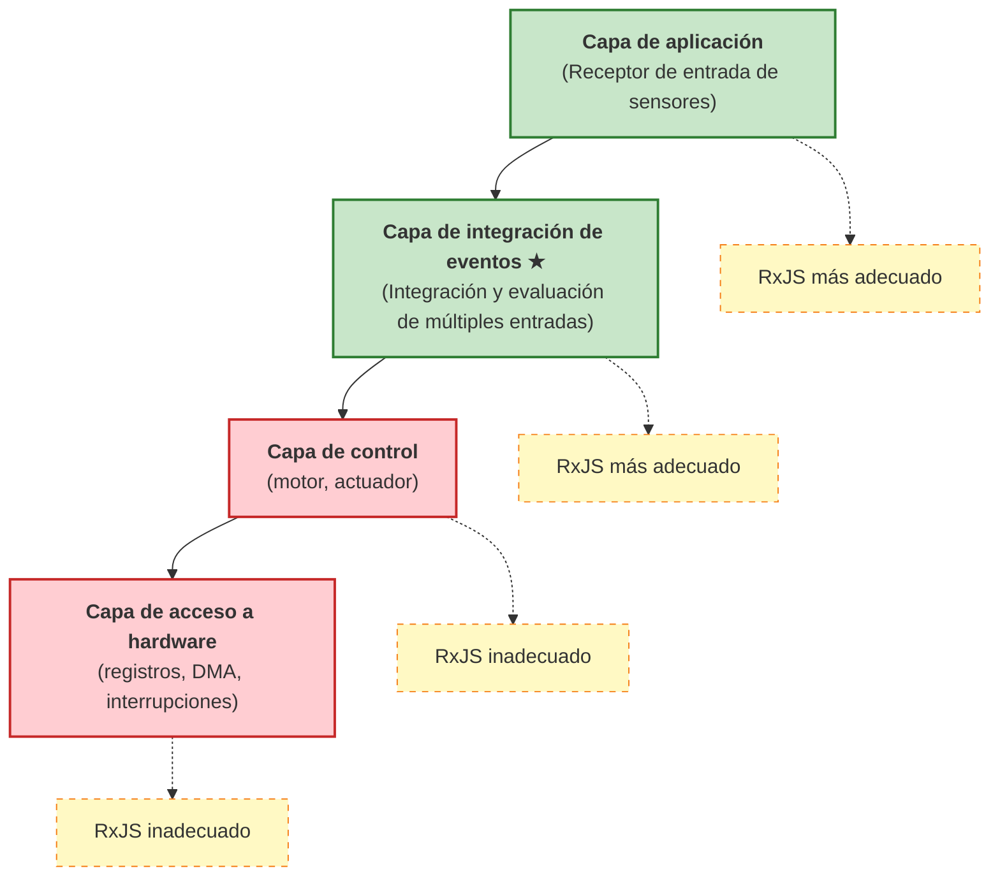

# Embebido y RP

Esta presentación discutirá las posibilidades y limitaciones de cómo se puede utilizar la programación reactiva, especialmente el procesamiento de flujos asíncronos como RxJS, en sistemas embebidos.

## ¿Qué es la programación reactiva?

La programación reactiva es una **técnica declarativa** que trata con flujos de datos asíncronos a lo largo del tiempo. Ve los eventos y flujos de datos como "valores que cambian con el tiempo" y los transforma, combina y filtra.

En la programación imperativa convencional, es necesario describir explícitamente "cuándo" y "cómo" procesar, pero en la programación reactiva, se describe declarativamente "qué" se procesa.

```ts
// Enfoque imperativo convencional
let sensorValue = 0;
setInterval(() => {
  sensorValue = readSensor();
  if (sensorValue > threshold) {
    handleAlert(sensorValue);
  }
}, 100);

// Enfoque reactivo
sensorStream$
  .pipe(
    filter(value => value > threshold)
  )
  .subscribe(value => handleAlert(value));
```

El enfoque reactivo separa claramente el flujo de datos de la lógica de procesamiento, mejorando la legibilidad y el mantenimiento.

## Desafíos en el desarrollo embebido

La programación reactiva no se usa ampliamente en sistemas embebidos debido a las siguientes limitaciones.

### 1. Limitación de rendimiento

Muchos sistemas embebidos requieren **respuesta en microsegundos**.

```ts
// ❌ Inapropiado para capa de control embebida
motorControl$
  .pipe(
    map(signal => processSignal(signal)),  // Necesita completarse en decenas de microsegundos
    filter(value => value > threshold)
  )
  .subscribe(value => actuateMotor(value));
```

::: warning Desafíos
- La cadena de operadores de RxJS tiene alta sobrecarga
- Potencial para recolección de basura
- El tiempo de respuesta es difícil de predecir

:::

### 2. Limitaciones de memoria

Los sistemas embebidos operan con memoria limitada (unos pocos KB a varios MB).

::: warning Desafíos
- La asignación dinámica de memoria suele estar prohibida
- El estado interno de Observable consume memoria
- Los operadores de buffering (`buffer`, `window`) son especialmente intensivos en memoria

:::

### 3. Alto nivel de abstracción

La programación reactiva es altamente abstracta e inadecuada para el control a nivel de hardware.

::: warning Desafíos
- No es adecuada para manipulación de registros o control DMA
- No es adecuada para procesos que requieren control fino a nivel de bits
- La depuración es compleja (los flujos asíncronos son difíciles de rastrear)

:::

### 4. Compatibilidad con RTOS

El Sistema Operativo en Tiempo Real (RTOS) realiza programación de tareas basada en prioridad, mientras que RxJS está basado en bucle de eventos.

::: warning Problemas
- Posibilidad de inversión de prioridad
- Difícil predecir el momento de ejecución de tareas
- Difícil garantizar el rendimiento en tiempo real

:::

## Capa de aplicación óptima: Capa de integración de eventos

En sistemas embebidos, la programación reactiva es más efectiva en la **"Capa de integración de eventos"**.

### Donde los modelos reactivos son más útiles: en el "extremo receptor" de entradas de sensores

En sistemas embebidos, la programación reactiva muestra su verdadero valor en el **extremo receptor** de datos (entrada de sensores).

#### Fortalezas del modelo reactivo en el extremo receptor (entrada de sensores)
- Integra datos asíncronos de múltiples sensores
- Describe declarativamente correlaciones a lo largo del tiempo
- El procesamiento dirigido por eventos se puede expresar naturalmente
- Fácil gestión de estado y filtrado

#### Desafíos de los modelos reactivos en el lado emisor (salida de control)
- Difícil garantizar el rendimiento en tiempo real (se requiere respuesta en microsegundos)
- La sobrecarga es inaceptable
- Nivel de abstracción demasiado alto para control directo de hardware

### Características y beneficios de flujos de entrada de sensores

| Características | Enfoque imperativo tradicional | Enfoque reactivo | Ventajas |
|------|---------------------|---------------------|------|
| **Integración de múltiples sensores** | Polling y sincronización manual para cada sensor | Integración declarativa con `combineLatest`, `merge` | Código conciso, intención clara |
| **Agregación en ventana de tiempo** | Gestión manual de temporizadores y buffers | Automatizado con `bufferTime`, `windowTime` | Menos errores de implementación, mejor mantenibilidad |
| **Reducción de ruido** | Implementar promedio móvil con bucles y operaciones de array | Escrito declarativamente con `scan` + `map` | Altamente legible y reutilizable |
| **Detección de anomalías** | Anidamiento complejo de flags y condicionales | Expresado claramente con `pairwise` + `filter` | Fácil seguir la lógica |
| **Correlación de eventos** | Variables de estado para rastrear eventos y tomar decisiones manuales | Detección de patrones con `merge` + `bufferTime` | Declarativo, fácil de extender |
| **Desuscripción** | Gestión manual de flags, propenso a fugas | Liberado automáticamente con `takeUntil` | Prevenir fugas de memoria |

### Diferencia con el lado de control (lado originador)

Es importante entender la diferencia entre las características del "lado receptor" y el "lado emisor" en un sistema embebido.

| Punto de vista | Lado receptor (entrada de sensores) | Lado emisor (salida de control) |
|------|---------------------|------------------|
| **Tiempo real** | Milisegundos (relativamente flexible) | Microsegundos (riguroso) |
| **Naturaleza del procesamiento** | Asíncrono, dirigido por eventos | Síncrono, ejecución periódica |
| **Complejidad** | Integración de múltiples fuentes, gestión de estado | Salida simple, orientado a velocidad |
| **Adecuación de RxJS** | ✅ **Óptimo** - integración de eventos fuerte | ❌ **Inadecuado** - alta sobrecarga |
| **Procesamiento principal** | Filtrado, suavizado, detección de correlación | Control PWM, accionamiento de motor, transferencia DMA |

::: tip Especialización en el "receptor" de entradas de sensores
La programación reactiva es más efectiva cuando **integra y evalúa múltiples eventos asíncronos a lo largo del tiempo**. Utilícela especializándose en el "lado receptor" de entradas de sensores en lugar del "lado emisor" como salidas de control.
:::

### Arquitectura del sistema en capas



#### Características de la capa de integración de eventos
- Integra entradas de múltiples sensores y fuentes de eventos
- Evalúa correlaciones a lo largo del tiempo
- Requisitos de tiempo real relativamente flexibles (en milisegundos)
- Se enfoca en gestión de estado y evaluación de condiciones

## Aplicaciones prácticas

### 1. Suavizado de valores de sensores

Suaviza entradas de múltiples sensores para eliminar ruido.

```ts
import { interval, combineLatest } from 'rxjs';
import { map, scan, share } from 'rxjs';

// Simulación de flujos de sensores
const temperatureSensor$ = interval(100).pipe(
  map(() => 25 + Math.random() * 5), // 25-30℃
  share()
);

const humiditySensor$ = interval(100).pipe(
  map(() => 50 + Math.random() * 10), // 50-60%
  share()
);

// Suavizado con promedios móviles
function movingAverage(windowSize: number) {
  return scan<number, number[]>((acc, value) => {
    const newWindow = [...acc, value];
    if (newWindow.length > windowSize) {
      newWindow.shift();
    }
    return newWindow;
  }, []).pipe(
    map(window => window.reduce((sum, val) => sum + val, 0) / window.length)
  );
}

const smoothedTemperature$ = temperatureSensor$.pipe(
  movingAverage(5),
  map(value => Math.round(value * 10) / 10)
);

const smoothedHumidity$ = humiditySensor$.pipe(
  movingAverage(5),
  map(value => Math.round(value * 10) / 10)
);

// Datos ambientales integrados
combineLatest([smoothedTemperature$, smoothedHumidity$])
  .pipe(
    map(([temp, humidity]) => ({
      temperature: temp,
      humidity: humidity,
      heatIndex: calculateHeatIndex(temp, humidity),
      timestamp: Date.now()
    }))
  )
  .subscribe(data => {
    console.log('Datos ambientales:', data);
  });

function calculateHeatIndex(temp: number, humidity: number): number {
  // Cálculo simplificado de temperatura sensorial
  return temp + (0.5555 * (6.11 * Math.exp(5417.753 * ((1/273.16) - (1/(273.15 + temp)))) - 10));
}
```

> [!NOTE] Ventajas de la integración de sensores
> - Procesamiento sincronizado de valores de múltiples sensores a lo largo del tiempo
> - Ruido eliminado por promedio móvil
> - Derivar declarativamente valores calculados (p. ej., temperatura sensorial)

### 2. Detección de correlación de eventos

Detecta cuando múltiples eventos ocurren dentro de una ventana de tiempo específica.

```ts
import { Subject, merge } from 'rxjs';
import { filter, bufferTime, map } from 'rxjs';

// Flujos de eventos
const motionDetected$ = new Subject<{ sensor: string; timestamp: number }>();
const doorOpened$ = new Subject<{ door: string; timestamp: number }>();
const lightOn$ = new Subject<{ room: string; timestamp: number }>();

// Consolidar todos los eventos
const allEvents$ = merge(
  motionDetected$.pipe(map(e => ({ type: 'motion', ...e }))),
  doorOpened$.pipe(map(e => ({ type: 'door', ...e }))),
  lightOn$.pipe(map(e => ({ type: 'light', ...e })))
);

// Agregar eventos en ventanas de tiempo de 1 segundo
allEvents$
  .pipe(
    bufferTime(1000),
    filter(events => events.length > 0),
    map(events => {
      const hasMotion = events.some(e => e.type === 'motion');
      const hasDoor = events.some(e => e.type === 'door');
      const hasLight = events.some(e => e.type === 'light');

      return {
        timestamp: Date.now(),
        events,
        pattern: {
          hasMotion,
          hasDoor,
          hasLight
        }
      };
    }),
    filter(result =>
      // Detecta patrones de personas entrando en una habitación
      result.pattern.hasMotion && result.pattern.hasDoor
    )
  )
  .subscribe(result => {
    console.log('Detección de entrada:', result);
    // Iluminación automática si las luces no están encendidas
    if (!result.pattern.hasLight) {
      console.log('→ Encender luces automáticamente');
    }
  });

// Simulación de ocurrencia de eventos
setTimeout(() => motionDetected$.next({ sensor: 'entry', timestamp: Date.now() }), 100);
setTimeout(() => doorOpened$.next({ door: 'front', timestamp: Date.now() }), 200);
```

> [!TIP] Uso de correlación de eventos
> - Estimación de la situación a partir de múltiples eventos dentro de una ventana de tiempo
> - Detección de anomalías en sistemas de seguridad
> - Lógica de automatización para hogar inteligente

### 3. Detección de anomalías

Detecta patrones anormales en valores de sensores.

```ts
import { interval } from 'rxjs';
import { map, pairwise, filter, share } from 'rxjs';

// Simulación de sensor de vibración
const vibrationSensor$ = interval(50).pipe(
  map(() => {
    // Normalmente 0-10, 50 o más para anomalías
    const normal = Math.random() * 10;
    const isAbnormal = Math.random() < 0.05; // 5% de probabilidad de anomalía
    return isAbnormal ? 50 + Math.random() * 20 : normal;
  }),
  share()
);

// Lógica de detección de anomalías
vibrationSensor$
  .pipe(
    pairwise(), // Emparejar dos valores consecutivos
    map(([prev, current]) => ({
      prev,
      current,
      delta: Math.abs(current - prev),
      timestamp: Date.now()
    })),
    filter(data =>
      // Por encima del umbral o cambio repentino
      data.current > 30 || data.delta > 20
    )
  )
  .subscribe(data => {
    console.log('⚠️ Detección de anomalía:', {
      'Valor actual': data.current.toFixed(2),
      'Cantidad de cambio': data.delta.toFixed(2),
      'Tiempo': new Date(data.timestamp).toISOString()
    });
  });
```

> [!WARNING] Precauciones para detección de anomalías
> - El ajuste de umbral es importante (depende del entorno y equipo)
> - Es necesario filtrar para reducir falsos positivos
> - Efectivo idear un método como emitir una alerta solo cuando ocurren anomalías consecutivas un cierto número de veces

### 4. Estimación de estado

Estima el estado del equipo a partir de valores de múltiples sensores.

```ts
import { combineLatest, interval } from 'rxjs';
import { map, distinctUntilChanged, share } from 'rxjs';

// Flujos de sensores
const current$ = interval(100).pipe(
  map(() => 1.5 + Math.random() * 0.5), // Valor de corriente 1.5-2.0A
  share()
);

const temperature$ = interval(100).pipe(
  map(() => 40 + Math.random() * 10), // Temperatura 40-50°C
  share()
);

const vibration$ = interval(100).pipe(
  map(() => 5 + Math.random() * 5), // Valor de vibración 5-10
  share()
);

// Definición de estado
type MachineState = 'idle' | 'running' | 'overload' | 'warning';

interface MachineStatus {
  state: MachineState;
  current: number;
  temperature: number;
  vibration: number;
  timestamp: number;
}

// Lógica de estimación de condición
combineLatest([current$, temperature$, vibration$])
  .pipe(
    map(([current, temperature, vibration]): MachineStatus => {
      let state: MachineState = 'idle';

      // Lógica de determinación de condición
      if (current > 1.8 && temperature > 45 && vibration > 8) {
        state = 'overload';
      } else if (temperature > 48 || vibration > 9) {
        state = 'warning';
      } else if (current > 1.6) {
        state = 'running';
      }

      return {
        state,
        current: Math.round(current * 100) / 100,
        temperature: Math.round(temperature * 10) / 10,
        vibration: Math.round(vibration * 10) / 10,
        timestamp: Date.now()
      };
    }),
    distinctUntilChanged((prev, curr) => prev.state === curr.state) // Notificación solo cuando cambia el estado
  )
  .subscribe(status => {
    console.log(`Estado del equipo: ${status.state}`, {
      'Corriente': `${status.current}A`,
      'Temperatura': `${status.temperature}℃`,
      'Vibración': status.vibration
    });

    // Procesamiento basado en condición
    switch (status.state) {
      case 'overload':
        console.log('🔴 Detección de sobrecarga - detiene equipo');
        break;
      case 'warning':
        console.log('🟡 Alertas - intensificar monitoreo');
        break;
    }
  });
```

> [!IMPORTANT] Puntos clave para estimación de condición
> - Combinar valores de múltiples sensores para determinar estado
> - Procesar solo cuando cambia el estado con `distinctUntilChanged`
> - Comenzar con reglas simples basadas en umbrales e incorporar aprendizaje automático según sea necesario

## Mejores prácticas

### 1. Selección de la capa de aplicación

```ts
// ✅ Buen ejemplo: usar en la capa de integración de eventos
const userActivity$ = merge(
  buttonClick$,
  sensorInput$,
  timerEvent$
).pipe(
  debounceTime(100),
  map(event => processEvent(event))
);

// ❌ Mal ejemplo: usar en capa de control
const motorControl$ = interval(10).pipe(  // 10ms es demasiado lento para capa de control
  map(() => readEncoder()),
  map(value => calculatePID(value))
);
```

### 2. Gestión de memoria

```ts
// ✅ Asegurar desuscripción
import { Subject } from 'rxjs';
import { takeUntil } from 'rxjs';

class SensorManager {
  private destroy$ = new Subject<void>();

  start() {
    sensorStream$
      .pipe(
        takeUntil(this.destroy$)
      )
      .subscribe(data => this.process(data));
  }

  stop() {
    this.destroy$.next();
    this.destroy$.complete();
  }

  private process(data: any) {
    // Procesamiento
  }
}
```

### 3. Limitación del tamaño de buffer

```ts
// ✅ Limitar explícitamente el tamaño del buffer
import { bufferTime } from 'rxjs';

sensorStream$
  .pipe(
    bufferTime(1000, null, 100) // Máximo de 100 buffers
  )
  .subscribe(batch => processBatch(batch));

// ❌ Evitar buffers ilimitados
sensorStream$
  .pipe(
    bufferTime(10000) // Buffer por 10 segundos → riesgo de quedarse sin memoria
  )
  .subscribe(batch => processBatch(batch));
```

### 4. Manejo de errores

```ts
import { catchError, retry } from 'rxjs';
import { of } from 'rxjs';

sensorStream$
  .pipe(
    retry({ count: 3, delay: 1000 }),
    catchError(error => {
      console.error('Error de sensor:', error);
      // Retornar valor predeterminado o manejo de respaldo
      return of({ value: 0, error: true });
    })
  )
  .subscribe(data => {
    if (data.error) {
      handleSensorFailure();
    } else {
      processNormalData(data);
    }
  });
```

## Resumen

Puntos clave para usar programación reactiva en desarrollo embebido

### Áreas de aplicación aplicables
- ✅ **Capa de integración de eventos** - Integración de entrada de sensores, detección de correlación de eventos
- ✅ **Capa de aplicación** - estimación de estado, detección de anomalías, visualización de datos
- ❌ **Capa de control** - control de motor, actuadores (requisitos de tiempo real)
- ❌ **Capa de acceso a hardware** - manipulación de registros, DMA, manejo de interrupciones

### Ejemplos de aplicaciones efectivas
- ✅ Suavizado e integración de valores de sensores
- ✅ Detección de correlación de eventos a lo largo del tiempo
- ✅ Detección de patrones de anomalías
- ✅ Estimación de estado a partir de múltiples sensores

### Notas
- ⚠️ Monitoreo y limitación del uso de memoria
- ⚠️ Desuscripción confiable
- ⚠️ Límites explícitos en el tamaño del buffer
- ⚠️ Manejo de errores apropiado

La programación reactiva no es aplicable a "todas las capas" de un sistema embebido, pero puede ser muy efectiva en la **capa de integración de eventos**. Utilizarla en la capa apropiada puede mejorar enormemente la legibilidad y mantenibilidad del código.

## Perspectiva futura: La reactividad se vuelve inevitable en sistemas embebidos

Los sistemas embebidos continúan evolucionando, y la programación reactiva será aún más importante en el futuro.

### Aumento explosivo en el número de sensores

El número de sensores manejados en sistemas embebidos modernos, especialmente dispositivos IoT y sistemas inteligentes, está aumentando rápidamente.

#### Complejidad creciente de la integración de sensores
- Automotriz: decenas a cientos de sensores (ADAS, conducción autónoma)
- Hogar inteligente: temperatura, humedad, movimiento, puertas, ventanas, cámaras, y muchos más
- Equipo industrial: monitoreo complejo de vibración, temperatura, corriente, presión, posición, etc.
- Dispositivos portátiles: frecuencia cardíaca, aceleración, giroscopio, GPS, presión barométrica, etc.

#### Limitaciones del enfoque imperativo tradicional
```ts
// ❌ Integración de 10 o más sensores en enfoque imperativo se rompe
let temp1, temp2, temp3, humidity1, humidity2, motion1, motion2;
let lastUpdate1, lastUpdate2, lastUpdate3;
// ... Número infinito de variables

setInterval(() => {
  temp1 = readSensor1();
  temp2 = readSensor2();
  // ... El código de polling se vuelve largo

  if (temp1 > threshold1 && humidity1 > threshold2 && ...) {
    // ... Las ramas condicionales se vuelven más complejas
  }
}, 100);
```

#### La necesidad de un enfoque reactivo
```ts
// ✅ Se puede describir declarativamente incluso si aumenta el número de sensores
const allSensors$ = combineLatest({
  temp1: temperatureSensor1$,
  temp2: temperatureSensor2$,
  temp3: temperatureSensor3$,
  humidity1: humiditySensor1$,
  humidity2: humiditySensor2$,
  motion1: motionSensor1$,
  motion2: motionSensor2$,
  // Solo agregar líneas cuando se agregan más sensores
});

allSensors$
  .pipe(
    map(sensors => evaluateConditions(sensors)),
    filter(result => result.shouldAlert)
  )
  .subscribe(result => handleAlert(result));
```

### El auge de Edge Computing

Reduciendo la dependencia de la nube, el procesamiento de datos en dispositivos edge se está volviendo más importante.

#### Requisitos en el Edge
- Procesamiento de datos en tiempo real de múltiples sensores
- Detección local de anomalías y reconocimiento de patrones
- Ejecución de modelos de aprendizaje automático ligeros
- Operación autónoma durante fallas de red

Estos requisitos son compatibles con **procesamiento de flujos asíncronos**, haciendo que la programación reactiva sea una elección natural.

### Evolución del hardware

A medida que mejora el rendimiento de los procesadores embebidos, la sobrecarga de la programación reactiva se está volviendo aceptable.

| Era | Rendimiento del procesador | Memoria | Aplicabilidad reactiva |
|------|-------------|--------|-------------------|
| 2000s | varios MHz, 8bit | varios KB | ❌ difícil - gran sobrecarga |
| 2010s | decenas a cientos de MHz, 32bit | decenas de KB a varios MB | △ Limitado - solo capa de eventos |
| 2020 en adelante | Clase GHz, 64bit, multi-núcleo | Cientos de MB a GB | ✅ **Práctico** - aplicable en muchas capas |

#### Ejemplos de procesadores embebidos modernos
- Raspberry Pi 4: 1.5GHz quad core, hasta 8GB RAM
- ESP32: 240MHz dual core, 520KB SRAM
- STM32H7: 480MHz, 1MB RAM

Con este hardware, la sobrecarga de RxJS está bien dentro de límites aceptables.

### La necesidad de la programación reactiva

La programación reactiva se está convirtiendo en una **necesidad** en lugar de una **opción** en sistemas embebidos por las siguientes razones.

::: info Razones por las que la programación reactiva se vuelve inevitable

1. **Aumento en número de sensores** - gestión de comando y control de decenas o cientos de sensores es limitada
2. **Importancia de detección de correlación a lo largo del tiempo** - Reconocimiento de patrones de eventos es esencial
3. **Auge de edge AI** - ideal para preprocesamiento de datos de sensores
4. **Mantenibilidad del código** - necesidad de escribir sistemas complejos declarativamente
5. **Evolución del hardware** - la sobrecarga es aceptable

:::

### Estrategias de transición práctica

Estrategias para introducir programación reactiva en sistemas embebidos existentes

#### Introducción por fases
1. **Fase 1**: Pilotar reactivo en nueva funcionalidad (capa de integración de sensores)
2. **Fase 2**: Reemplazar procesamiento de eventos con reactivos
3. **Fase 3**: Hacer reactiva toda la capa de aplicación
4. **Mantener la capa de control convencional** - no cambiar las partes que necesitan rendimiento en tiempo real

**Enfoque híbrido:**
```ts
// Capa de control: imperativo convencional (respuesta en microsegundos)
function controlMotor(speed: number) {
  // Manipulación directa de registros, procesamiento de alta velocidad
  writeRegister(MOTOR_CONTROL_REG, speed);
}

// Capa de integración de eventos: Reactivo (respuesta en milisegundos)
const motorSpeedCommand$ = combineLatest([
  targetSpeed$,
  currentLoad$,
  temperatureLimit$
]).pipe(
  map(([target, load, tempLimit]) => calculateOptimalSpeed(target, load, tempLimit))
);

motorSpeedCommand$.subscribe(speed => {
  // Los valores determinados por reactivo se pasan a funciones de control convencionales
  controlMotor(speed);
});
```

Así, combinando adecuadamente **programación reactiva (el lado receptor)** y **control imperativo tradicional (el lado emisor)**, se pueden aprovechar las ventajas de ambos.

## Páginas relacionadas

- [Introducción a RxJS](/es/guide/introduction) - Conceptos básicos de RxJS
- [Cómo crear un Observable](/es/guide/observables/creation) - Creación de flujos de sensores
- [Operadores de combinación](/es/guide/operators/combination/) - Detalles de combineLatest, merge
- [Operadores de filtrado](/es/guide/operators/filtering/) - Utilización de filter, debounceTime
- [Manejo de errores](/es/guide/error-handling/strategies) - Manejo de errores de sensores
- [Depuración de rendimiento](/es/guide/debugging/performance) - Monitorear uso de memoria

## Datos de referencia

- [GitHub Discussions - Desarrollo embebido y programación reactiva](https://github.com/shuji-bonji/RxJS-with-TypeScript/discussions/13)
- [Documentación oficial de RxJS](https://rxjs.dev/)
