# Mapa General de Arquitectura Reactiva

La programación reactiva ha evolucionado más allá del marco de una simple biblioteca o framework, convirtiéndose en una **filosofía arquitectónica para todo el sistema**.

Esta página explica sistemáticamente **la visión general de la arquitectura reactiva** en 7 capas, desde la UI hasta el backend, pipelines de datos, IoT y sistemas de control.

## ¿Qué es la Arquitectura Reactiva?

La arquitectura reactiva es un enfoque de diseño de sistemas centrado en **valores que varían en el tiempo (Time-Varying Values)**.

#### Pensamiento Central
> Desde los clics de UI hasta los sensores IoT, flujos de datos y control de robots, todo se trata de **reaccionar a valores que cambian con el tiempo**

Para realizar este pensamiento, el [Reactive Manifesto](https://www.reactivemanifesto.org/) (Manifiesto Reactivo) define 4 características importantes.

## Las 4 Características del Reactive Manifesto

El Reactive Manifesto define las 4 características que deben tener los sistemas reactivos.


### 1. Responsive (Capacidad de Respuesta)

El sistema **reacciona consistentemente y rápidamente** a las entradas del usuario y cambios del entorno.

::: tip Ejemplos Concretos
- Retroalimentación inmediata a operaciones de UI
- Predictibilidad del tiempo de respuesta de API
- Actualizaciones de datos en tiempo real
:::

### 2. Resilient (Resiliencia)

Incluso cuando ocurren fallos, **se recupera parcialmente** y el sistema completo no se detiene.

::: tip Ejemplos Concretos
- Manejo de errores y fallbacks
- Aislamiento de servicios (microservicios)
- Reintentos automáticos y circuit breakers
:::

### 3. Elastic (Elasticidad)

**Ajusta dinámicamente los recursos** según la carga y escala eficientemente.

::: tip Ejemplos Concretos
- Autoescalado
- Balanceo de carga
- Control de backpressure
:::

### 4. Message-Driven (Basado en Mensajes)

Los componentes se comunican mediante **mensajes asíncronos**, logrando acoplamiento débil.

::: tip Ejemplos Concretos
- Event bus
- Colas de mensajes (Kafka, RabbitMQ)
- Patrón Observable/Subscriber
:::

::: info Importancia del Reactive Manifesto
Estas 4 características son la **base teórica** de la arquitectura reactiva. RxJS y ReactiveX son solo una de las herramientas para realizar estas características.
:::

## Las 7 Capas de la Arquitectura Reactiva

La arquitectura reactiva está compuesta por las siguientes 7 capas.

| # | Capa | Resumen | Tecnologías Representativas |
|---|---|------|------------|
| 1 | **Reactive UI** | UI que reacciona inmediatamente a entrada del usuario | RxJS, Angular Signals, Svelte Runes, React Hooks |
| 2 | **Reactive Communication** | Comunicación de flujo entre cliente/servidor | WebSocket, SSE, GraphQL Subscriptions |
| 3 | **Reactive Backend** | Servidor dirigido por eventos y no bloqueante | Akka, Spring WebFlux, Vert.x, Node.js Streams |
| 4 | **Reactive Data Pipeline** | Flujos de eventos como modelo de datos de primera clase | Kafka, Flink, Apache Beam, Reactor |
| 5 | **Reactive IoT/Embedded** | Integración y fusión de flujos de sensores | ROS2, RxCpp, RxRust, Zephyr |
| 6 | **Reactive Control** | Bucle de retroalimentación de sensor a control | Behavior Trees, Digital Twin, MPC |
| 7 | **Reactive UX** | UX de bucle cerrado a través de todas las capas | Autoguardado, edición colaborativa en tiempo real |

### Diagrama General de Arquitectura


## 1. Reactive UI (Frontend)

Capa que **actualiza la pantalla en tiempo real** en respuesta a entradas del usuario y operaciones asíncronas.

### Concepto Central

> La UI es una "proyección de estado que cambia con el tiempo"

### Stack Tecnológico Representativo

- **RxJS** - Procesamiento de flujos mediante Observable/Operators
- **Angular Signals** - Primitivas reactivas de Angular 19+
- **Svelte Runes** - $state, $derived de Svelte 5
- **React Hooks** - Gestión de estado con useState, useEffect
- **Vue Reactivity** - Reactividad con ref, reactive, computed
- **SolidJS** - Reactividad granular basada en Signals

### Ejemplo de Implementación (RxJS)

```typescript
import { fromEvent } from 'rxjs';
import { debounceTime, distinctUntilChanged, map } from 'rxjs';

// UI reactiva de búsqueda
const searchInput = document.querySelector<HTMLInputElement>('#search');
const resultsDiv = document.querySelector<HTMLDivElement>('#results');

const input$ = fromEvent(searchInput!, 'input').pipe(
  map(event => (event.target as HTMLInputElement).value),
  debounceTime(300),                    // Espera 300ms (espera a que termine de escribir)
  distinctUntilChanged()                // Ignora si es el mismo valor que el anterior
);

input$.subscribe(async searchTerm => {
  if (searchTerm.length === 0) {
    resultsDiv!.innerHTML = '';
    return;
  }

  // Llamada a API
  const results = await fetch(`/api/search?q=${encodeURIComponent(searchTerm)}`)
    .then(res => res.json());

  // Actualizar UI inmediatamente
  resultsDiv!.innerHTML = results
    .map((r: any) => `<div class="result">${r.title}</div>`)
    .join('');
});
```

::: tip Ventajas de Reactive UI
- Reducción de llamadas API innecesarias con debounce y throttle
- Mejora de legibilidad con descripción declarativa
- Fácil integración de múltiples procesos asíncronos
:::

## 2. Reactive Communication (Capa de Comunicación)

Capa que realiza **streaming de datos bidireccional** entre cliente/servidor.

### Stack Tecnológico Representativo

- **WebSocket** - Protocolo de comunicación full-duplex
- **Server-Sent Events (SSE)** - Flujo unidireccional de servidor a cliente
- **GraphQL Subscriptions** - Función de suscripción en tiempo real de GraphQL
- **tRPC** - Framework RPC type-safe
- **RxDB** - Base de datos reactiva (soporte offline)

### Ejemplo de Implementación (WebSocket + RxJS)

```typescript
import { webSocket } from 'rxjs/webSocket';
import { retry, catchError } from 'rxjs';
import { of } from 'rxjs';

// Tratar WebSocket como Observable
const socket$ = webSocket<{ type: string; data: any }>({
  url: 'wss://example.com/socket',
  openObserver: {
    next: () => console.log('✅ Conexión WebSocket exitosa')
  },
  closeObserver: {
    next: () => console.log('❌ WebSocket desconectado')
  }
});

// Recepción de datos en tiempo real
socket$
  .pipe(
    retry({ count: 3, delay: 1000 }),  // Reconexión automática
    catchError(error => {
      console.error('Error WebSocket:', error);
      return of({ type: 'error', data: error });
    })
  )
  .subscribe(message => {
    switch (message.type) {
      case 'stock_price':
        updateStockChart(message.data);
        break;
      case 'notification':
        showNotification(message.data);
        break;
      // ... otros tipos de mensajes
    }
  });

// Enviar mensaje al servidor
socket$.next({ type: 'subscribe', data: { symbol: 'AAPL' } });
```

::: info Afinidad entre WebSocket y Observable
El evento `onmessage` de WebSocket es el patrón Observable en sí mismo. La función webSocket de RxJS abstrae esto y facilita los reintentos y el manejo de errores.
:::

## 3. Reactive Backend (Backend)

Capa que realiza arquitectura de servidor escalable con **I/O dirigido por eventos y no bloqueante**.

### Stack Tecnológico Representativo

- **Akka (Scala/Java)** - Framework basado en modelo Actor
- **Vert.x (JVM)** - Toolkit reactivo políglota
- **Spring WebFlux (Java)** - Framework web no bloqueante basado en Project Reactor
- **Node.js Streams** - Procesamiento I/O basado en flujos
- **Elixir/Phoenix LiveView** - Framework en tiempo real sobre BEAM VM

### Concepto del Modelo Actor

El modelo Actor es un modelo de procesamiento concurrente que combina **aislamiento (Isolation)** y **paso de mensajes asíncrono**.


### Ejemplo de Implementación (Akka - Scala)

```scala
import akka.actor.{Actor, ActorRef, Props}

// Sensor Actor
class SensorActor extends Actor {
  def receive: Receive = {
    case SensorData(value) =>
      // Procesar datos
      val processed = transform(value)
      // Enviar al Actor padre
      context.parent ! ProcessedData(processed)

    case ErrorOccurred(error) =>
      // Manejo de errores
      context.parent ! FailureReport(error)
  }

  private def transform(value: Double): Double = {
    // Lógica de transformación de datos
    value * 2.0
  }
}

// Supervisor Actor
class SupervisorActor extends Actor {
  val sensor1: ActorRef = context.actorOf(Props[SensorActor], "sensor1")
  val sensor2: ActorRef = context.actorOf(Props[SensorActor], "sensor2")

  def receive: Receive = {
    case StartMonitoring =>
      sensor1 ! SensorData(10.5)
      sensor2 ! SensorData(20.3)

    case ProcessedData(value) =>
      println(s"Datos recibidos: $value")
      // Procesamiento de agregación, etc.
  }
}

// Definición de mensajes
case class SensorData(value: Double)
case class ProcessedData(value: Double)
case object StartMonitoring
case class ErrorOccurred(error: Throwable)
case class FailureReport(error: Throwable)
```

::: tip Ventajas del Modelo Actor
- **Aislamiento de fallos** - Si un Actor falla, otros no se ven afectados
- **Escalabilidad** - Los Actors son ligeros, se pueden iniciar millones
- **Basado en mensajes** - Cumple con los principios del Reactive Manifesto
:::

## 4. Reactive Data Pipeline (Pipeline de Datos)

Capa que trata los **flujos de eventos como modelo de datos de primera clase**.

### Concepto Central

> "Event Stream is the new Database" (El flujo de eventos es la nueva base de datos)

Es un cambio de paradigma de la arquitectura centrada en base de datos tradicional a **arquitectura centrada en flujos de eventos**.

### Stack Tecnológico Representativo

- **Apache Kafka** - Plataforma de streaming de eventos distribuidos
- **Apache Flink** - Motor de procesamiento de flujos
- **Apache Beam** - Modelo unificado de procesamiento batch/stream
- **Apache NiFi** - Automatización de flujo de datos
- **Project Reactor** - Biblioteca reactiva en JVM
- **Reactive Streams API** - Estándar de procesamiento de flujos en JVM

### Patrón de Pipeline de Datos

```
Event Source → Parse → Validate → Enrich → Aggregate → Store/Forward
```

### Ejemplo de Implementación (Pseudocódigo)

```typescript
// Pipeline de flujo estilo Kafka + Flink
stream
  .map(event => parseJSON(event))           // Parseo
  .filter(data => isValid(data))            // Validación
  .map(data => enrichWithMetadata(data))    // Agregar metadatos
  .groupBy(data => data.sensorId)           // Agrupar por ID de sensor
  .window(10.seconds)                       // Ventana de 10 segundos
  .reduce((acc, value) => aggregate(acc, value))  // Agregación
  .sink(database)                           // Guardar en base de datos
```

### Expresión Correspondiente en RxJS

```typescript
import { interval } from 'rxjs';
import { map, filter, groupBy, bufferTime, mergeMap } from 'rxjs';

interface SensorEvent {
  sensorId: string;
  value: number;
  timestamp: number;
}

// Simulación de flujo de eventos
const eventStream$ = interval(100).pipe(
  map((): SensorEvent => ({
    sensorId: `sensor-${Math.floor(Math.random() * 3)}`,
    value: Math.random() * 100,
    timestamp: Date.now()
  }))
);

// Pipeline de datos
eventStream$
  .pipe(
    // Validación
    filter(event => event.value >= 0 && event.value <= 100),

    // Agrupar por ID de sensor
    groupBy(event => event.sensorId),

    // Bufferizar cada grupo cada 10 segundos
    mergeMap(group$ =>
      group$.pipe(
        bufferTime(10000),
        filter(events => events.length > 0),
        map(events => ({
          sensorId: events[0].sensorId,
          avgValue: events.reduce((sum, e) => sum + e.value, 0) / events.length,
          count: events.length,
          timestamp: Date.now()
        }))
      )
    )
  )
  .subscribe(aggregated => {
    console.log('Datos agregados:', aggregated);
    // Guardar en base de datos
    saveToDatabase(aggregated);
  });

function saveToDatabase(data: any): void {
  // Lógica de guardado en base de datos
}
```

::: warning Relación con Event Sourcing
Event Sourcing es un patrón de diseño que registra el estado del sistema como historial de eventos. Al combinarlo con plataformas de streaming de eventos como Kafka, se puede construir un pipeline de datos reactivo poderoso.
:::

## 5. Reactive IoT/Embedded (IoT y Embebidos)

Capa que realiza integración de flujos de sensores y fusión en tiempo real.

### Stack Tecnológico Representativo

- **ROS2 (Robot Operating System 2)** - Plataforma de desarrollo de robots
- **RxCpp** - Versión de ReactiveX para C++
- **RxRust** - Versión de ReactiveX para Rust
- **Zephyr RTOS** - SO en tiempo real para IoT
- **TinyOS** - SO para redes de sensores

### Diferencias con UI

| Aspecto | Reactive UI | Reactive IoT |
|------|------------|--------------|
| **Objetivo de reactividad** | Entrada de usuario, respuestas API | Valores de sensores, señales de control |
| **Tiempo real** | Orden de milisegundos (enfoque UX) | Orden de microsegundos (enfoque control) |
| **Procesamiento principal** | Visualización, validación | Filtrado, fusión, control |

### Ejemplo de Implementación (ROS2 - Python)

```python
import rclpy
from rclpy.node import Node
from sensor_msgs.msg import LaserScan
from geometry_msgs.msg import Twist

class ObstacleAvoidance(Node):
    def __init__(self):
        super().__init__('obstacle_avoidance')

        # Suscribirse a datos del sensor LiDAR
        self.subscription = self.create_subscription(
            LaserScan,
            '/scan',
            self.laser_callback,
            10
        )

        # Publicar comandos de velocidad
        self.velocity_publisher = self.create_publisher(
            Twist,
            '/cmd_vel',
            10
        )

    def laser_callback(self, msg: LaserScan):
        # Procesamiento de datos del sensor (reactivo)
        min_distance = min(msg.ranges)

        # Reaccionar a detección de obstáculos
        if min_distance < 0.5:  # Obstáculo dentro de 50cm
            self.get_logger().warn(f'⚠️ Obstáculo detectado: {min_distance:.2f}m')
            self.stop_robot()
        else:
            self.move_forward()

    def stop_robot(self):
        twist = Twist()
        twist.linear.x = 0.0
        twist.angular.z = 0.0
        self.velocity_publisher.publish(twist)

    def move_forward(self):
        twist = Twist()
        twist.linear.x = 0.3  # Avanzar a 0.3 m/s
        twist.angular.z = 0.0
        self.velocity_publisher.publish(twist)

def main(args=None):
    rclpy.init(args=args)
    node = ObstacleAvoidance()
    rclpy.spin(node)
    rclpy.shutdown()

if __name__ == '__main__':
    main()
```

::: info Fusión de Sensores y Reactividad
La "fusión de sensores" que integra datos de múltiples sensores (LiDAR, cámara, IMU, GPS) es el mismo concepto que `combineLatest` y `merge` de RxJS.
:::

## 6. Reactive Control (Sistemas de Control)

Capa que realiza bucles de retroalimentación de sensor a control.

### Stack Tecnológico Representativo

- **Behavior Trees** - Selección de comportamiento para robots y AI de juegos
- **Digital Twin** - Réplica digital de sistemas físicos
- **Model Predictive Control (MPC)** - Control predictivo
- **Cyber-Physical Systems (CPS)** - Sistemas ciberfísicos

### Estructura del Behavior Tree

```mermaid
flowchart TB
    root["Selector (OR)"]
    seq1["Sequence (AND)"]
    cond1["Condition:<br/>Batería > 20%"]
    action1["Action:<br/>Moverse al destino"]
    action2["Action:<br/>Moverse a estación de carga"]

    root --> seq1
    root --> action2
    seq1 --> cond1
    seq1 --> action1

    classDef selector fill:#ffebee,stroke:#c62828,stroke-width:2px,color:#333
    classDef sequence fill:#e8f5e9,stroke:#2e7d32,stroke-width:2px,color:#333
    classDef condition fill:#fff9c4,stroke:#f57f17,stroke-width:2px,color:#333
    classDef action fill:#e1f5fe,stroke:#01579b,stroke-width:2px,color:#333

    class root selector
    class seq1 sequence
    class cond1 condition
    class action1,action2 action
```



**Operación:**
1. Nivel de batería > 20% → Moverse al destino
2. Nivel de batería < 20% → Moverse a estación de carga

### Expresión Reactiva de Transiciones de Estado

Las transiciones de estado del Behavior Tree se pueden expresar con `scan` y `switchMap` de RxJS.

```typescript
import { interval, Subject } from 'rxjs';
import { map, scan, switchMap } from 'rxjs';

type BatteryLevel = number; // 0-100
type RobotState = 'IDLE' | 'MOVING_TO_GOAL' | 'MOVING_TO_CHARGER' | 'CHARGING';

interface RobotStatus {
  state: RobotState;
  batteryLevel: BatteryLevel;
}

// Simulación de nivel de batería
const batteryLevel$ = interval(1000).pipe(
  scan((level, _) => Math.max(0, level - 1), 100) // Disminuye 1% por segundo
);

// Lógica del Behavior Tree
const robotState$ = batteryLevel$.pipe(
  map((batteryLevel): RobotStatus => {
    // Lógica Selector (OR)
    if (batteryLevel > 20) {
      // Cumple condición Sequence (AND)
      return { state: 'MOVING_TO_GOAL', batteryLevel };
    } else {
      // Necesita carga
      return { state: 'MOVING_TO_CHARGER', batteryLevel };
    }
  })
);

robotState$.subscribe(status => {
  console.log(`Estado: ${status.state}, Batería: ${status.batteryLevel}%`);

  switch (status.state) {
    case 'MOVING_TO_GOAL':
      console.log('→ Moviéndose al destino');
      break;
    case 'MOVING_TO_CHARGER':
      console.log('⚠️ ¡Batería baja! Moviendo a estación de carga');
      break;
  }
});
```

::: tip Sistemas de Control y Reactividad
El "bucle de retroalimentación" en ingeniería de control es esencialmente lo mismo que el "dirigido por eventos" en programación reactiva. Se cambia dinámicamente el comando de control según cambios en valores del sensor.
:::

## 7. Reactive UX (UX de Bucle Cerrado)

La capa de más alto nivel que realiza **UX de bucle cerrado** a través de todas las capas.

### Concepto Central

> La capacidad de respuesta de todo el sistema crea una experiencia de usuario consistente

### Ejemplos Representativos

| Servicio | Características de UX Reactivo |
|---------|-------------------|
| **Google Docs** | Autoguardado, edición colaborativa en tiempo real |
| **Figma** | Colaboración en vivo multiusuario |
| **Firebase** | Sincronización de datos en tiempo real |
| **Slack** | Entrega y visualización instantánea de mensajes |
| **Notion** | Edición offline y sincronización fluida |

### Ejemplo de Implementación: Función de Autoguardado

```typescript
import { fromEvent, Subject } from 'rxjs';
import { debounceTime, distinctUntilChanged, switchMap, catchError } from 'rxjs';
import { of } from 'rxjs';

// Evento de cambio de contenido del editor
const editor = document.querySelector<HTMLTextAreaElement>('#editor');
const statusDiv = document.querySelector<HTMLDivElement>('#status');

const editorChange$ = fromEvent(editor!, 'input').pipe(
  map(event => (event.target as HTMLTextAreaElement).value)
);

// Lógica de autoguardado
const autoSave$ = editorChange$.pipe(
  debounceTime(2000),                    // Esperar 2 segundos sin entrada
  distinctUntilChanged(),                // No guardar si el contenido es el mismo
  switchMap(content => {
    // Mostrar que se está guardando
    statusDiv!.textContent = '💾 Guardando...';

    // Llamada a API
    return fetch('/api/save', {
      method: 'POST',
      headers: { 'Content-Type': 'application/json' },
      body: JSON.stringify({ content })
    }).then(res => {
      if (!res.ok) throw new Error('Fallo al guardar');
      return res.json();
    });
  }),
  catchError(error => {
    statusDiv!.textContent = '❌ Fallo al guardar';
    return of(null);
  })
);

autoSave$.subscribe(result => {
  if (result) {
    statusDiv!.textContent = '✅ Guardado completo';
    setTimeout(() => {
      statusDiv!.textContent = '';
    }, 2000);
  }
});
```

### Mecanismo de Edición Colaborativa en Tiempo Real

```mermaid
sequenceDiagram
    participant U1 as Usuario 1
    participant Server as Servidor WebSocket
    participant U2 as Usuario 2

    U1->>Server: Enviar evento de edición
    Server->>U2: Distribuir cambio
    U2->>U2: Actualizar UI inmediatamente

    U2->>Server: Enviar evento de edición
    Server->>U1: Distribuir cambio
    U1->>U1: Actualizar UI inmediatamente

    Note over U1,U2: Reactive UX:<br/>Ambos usuarios experimentan reflejo inmediato
```



::: info Esencia de Reactive UX
Reactive UX se logra cuando **todas las capas son consistentemente reactivas**: UI → Comunicación → Backend → Pipeline de Datos → IoT → Control. No se puede lograr verdadero Reactive UX si solo una capa es reactiva.
:::

## Integración entre Capas y Rol de ReactiveX

Aunque las 7 capas parecen independientes, **ReactiveX funciona como lenguaje común**, integrándolas sin problemas.

### Integración mediante ReactiveX


**Conceptos Comunes:**
- **Observable/Stream** - Valores que cambian con el tiempo
- **Operator/Transformation** - Transformación y filtrado de datos
- **Subscribe/Consume** - Consumo de eventos
- **Backpressure** - Control de carga
- **Error Handling** - Propagación y procesamiento de errores

::: tip Valor de ReactiveX
ReactiveX permite **tratar todo con el mismo concepto (Observable)**, desde clics en UI hasta sensores IoT, flujos de datos y control de robots. Esto permite a los ingenieros full-stack diseñar todo el sistema con un modelo de pensamiento consistente.
:::

## Ventajas de la Arquitectura Reactiva

### 1. Modelo Conceptual Consistente

Puede usar el **mismo concepto** en diferentes dominios (UI, backend, datos, IoT).

**Tradicional:**
- UI: Event listeners
- Backend: Callbacks
- Datos: Procesamiento por lotes
- IoT: Polling

**Reactivo:**
- Todo: **Observable/Stream**

### 2. Manejo Unificado de Procesamiento Asíncrono

Se pueden **unificar en Observable** Promises, callbacks, eventos y flujos.

```typescript
import { from, fromEvent, ajax } from 'rxjs';

// Convertir Promise en flujo
const promise$ = from(fetch('/api/data'));

// Convertir evento en flujo
const click$ = fromEvent(button, 'click');

// Convertir llamada Ajax en flujo
const api$ = ajax('/api/endpoint');

// Todos se pueden tratar de la misma manera
promise$.subscribe(/*...*/);
click$.subscribe(/*...*/);
api$.subscribe(/*...*/);
```

### 3. Escalabilidad y Tolerancia a Fallos

Gracias a las 4 características del Reactive Manifesto:
- **Responsive** - Tiempo de respuesta consistente
- **Resilient** - Aislamiento y recuperación de fallos
- **Elastic** - Escalado dinámico según carga
- **Message-Driven** - Componentes débilmente acoplados

### 4. Mejora en Tiempo Real

Con arquitectura dirigida por eventos, se pueden **propagar cambios de datos inmediatamente**.

**Tradicional (polling):**
```
Cliente → [Solicitud periódica] → Servidor
```

**Reactivo (push):**
```
Cliente ← [Notificación inmediata al cambiar] ← Servidor
```

### 5. Mejora en Experiencia del Desarrollador

Con descripción declarativa, **la intención del código es clara**.

```typescript
// ❌ Imperativo: difícil de leer la intención
let lastValue = '';
input.addEventListener('input', (e) => {
  const value = e.target.value;
  if (value !== lastValue) {
    setTimeout(() => {
      if (value.length > 0) {
        fetch(`/api/search?q=${value}`)
          .then(/*...*/);
      }
    }, 300);
    lastValue = value;
  }
});

// ✅ Declarativo: intención evidente
fromEvent(input, 'input')
  .pipe(
    map(e => e.target.value),
    debounceTime(300),
    distinctUntilChanged(),
    filter(value => value.length > 0),
    switchMap(value => ajax(`/api/search?q=${value}`))
  )
  .subscribe(/*...*/);
```

## Resumen

La arquitectura reactiva es una filosofía de diseño de todo el sistema centrada en **valores que cambian con el tiempo**.

### Rol de las 7 Capas

| Capa | Rol | Utilización de ReactiveX |
|----|------|----------------|
| **1. Reactive UI** | Reacción inmediata a entrada de usuario | RxJS, Signals |
| **2. Reactive Communication** | Streaming cliente/servidor | WebSocket Observable |
| **3. Reactive Backend** | Servidor dirigido por eventos | Akka, Reactor |
| **4. Reactive Data Pipeline** | Procesamiento de flujo de eventos | Kafka, Flink |
| **5. Reactive IoT/Embedded** | Integración de flujos de sensores | RxCpp, ROS2 |
| **6. Reactive Control** | Control de bucle de retroalimentación | Behavior Trees |
| **7. Reactive UX** | Experiencia consistente en todas las capas | Integración de todas las anteriores |

### Importancia del Reactive Manifesto

::: info 4 Características

1. **Responsive (Capacidad de respuesta)** - Reacción consistente y rápida
2. **Resilient (Resiliencia)** - Recuperación parcial en caso de fallo
3. **Elastic (Elasticidad)** - Escalado dinámico según carga
4. **Message-Driven (Basado en mensajes)** - Mensajería asíncrona

:::

### Esencia de ReactiveX

ReactiveX es el **lenguaje común** para tratar estas capas de manera transversal.

> Desde clics en UI hasta sensores IoT, flujos de datos y control de robots, todo se trata de **reaccionar a valores que cambian con el tiempo**

Este concepto unificado permite a los ingenieros full-stack diseñar todo el sistema con un modelo de pensamiento consistente.

### Próximos Pasos

Para profundizar en la comprensión de la arquitectura reactiva:

1. **Comenzar a pequeña escala** - Primero practicar en una capa (Reactive UI)
2. **Expandir gradualmente** - Extender a capas de comunicación y backend
3. **Aprender de servicios reales** - Observar funcionamiento de Google Docs, Figma, etc.
4. **Leer Reactive Manifesto** - Comprender la base teórica

## Páginas Relacionadas

- [Desarrollo Embebido y Programación Reactiva](/es/guide/appendix/embedded-reactive-programming) - Detalles de capa IoT/embebidos
- [Métodos Reactivos más allá de ReactiveX](/es/guide/appendix/reactive-patterns-beyond-rxjs) - Métodos de implementación específicos de cada capa
- [Introducción a RxJS](/es/guide/introduction) - Conceptos básicos de RxJS
- [¿Qué es Observable?](/es/guide/observables/what-is-observable) - Fundamentos de Observable
- [Operadores de Combinación](/es/guide/operators/combination/) - Integración de múltiples flujos

## Referencias

- [GitHub Discussions - Mapa General de Arquitectura Reactiva](https://github.com/shuji-bonji/RxJS-with-TypeScript/discussions/15)
- [Reactive Manifesto](https://www.reactivemanifesto.org/) - Definición de sistemas reactivos
- [Documentación oficial de RxJS](https://rxjs.dev/)
- [Documentación oficial de Akka](https://doc.akka.io/)
- [Documentación oficial de Apache Kafka](https://kafka.apache.org/documentation/)
- [Documentación oficial de ROS2](https://docs.ros.org/)
