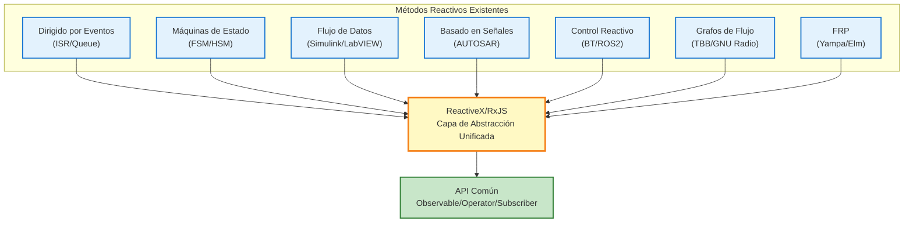

# Métodos Reactivos más allá de ReactiveX (Perspectiva de Sistemas Embebidos)

El pensamiento de la programación reactiva ha sido ampliamente practicado en los campos de sistemas embebidos e ingeniería de control, mucho antes de la aparición de ReactiveX (RxJS).

Esta página organiza sistemáticamente **métodos que realizan los principios de la programación reactiva sin usar ReactiveX** y aclara su relación con RxJS.

## Esencia de la Programación Reactiva

El núcleo de la programación reactiva reside en los siguientes 3 principios:

1. **Flujo de Datos (Data Flow)** - Los datos se tratan como flujos que cambian con el tiempo
2. **Dirigido por Eventos (Event-Driven)** - El procesamiento se ejecuta automáticamente cuando ocurre un evento
3. **Descripción Declarativa (Declarative)** - Se describe "qué hacer", abstrayendo "cuándo y cómo"

Estos principios también se realizan en muchos métodos más allá de ReactiveX.

::: info Esencia de ReactiveX
ReactiveX no **inventó** la reactividad, sino que **estandarizó las prácticas existentes en una capa de abstracción unificada**.
:::

## Métodos Reactivos más allá de ReactiveX

Presentamos 7 métodos reactivos representativos utilizados en sistemas embebidos e ingeniería de control.

| # | Método | Resumen | Herramientas/Frameworks Representativos |
|---|------|------|--------------------------|
| 1 | **Arquitectura Dirigida por Eventos** | Procesamiento asíncrono de eventos con ISR/colas | RTOS (FreeRTOS, Zephyr) |
| 2 | **Máquinas de Estado (FSM/HSM)** | Transición de estados según eventos | QPC, SCXML, Yakindu |
| 3 | **Programación de Flujo de Datos** | Nodos impulsados por flujo de datos | Simulink, LabVIEW, SCADE |
| 4 | **Control Basado en Señales** | Propagación de actualizaciones de valores en todo el sistema | AUTOSAR COM Stack, Simulink |
| 5 | **Sistemas de Control Reactivo** | Selección de comportamiento según cambios del entorno | Behavior Trees, ROS2 |
| 6 | **Bibliotecas de Grafos de Flujo** | Procesamiento paralelo explícito de dependencias de datos | Intel TBB, GNU Radio, StreamIt |
| 7 | **Programación Reactiva Funcional** | Tratamiento funcional de valores que cambian con el tiempo | Haskell Yampa, Elm, Dunai |

## 1. Arquitectura Dirigida por Eventos (Event-Driven Architecture)

Estructura donde rutinas de servicio de interrupción (ISR) capturan eventos y los notifican a tareas mediante colas de mensajes.

### Ejemplo de Implementación en C

```c
// Cola de eventos (global)
typedef struct {
    EventType type;
    void* data;
} Event;

Event eventQueue[EVENT_QUEUE_SIZE];
int queueHead = 0;
int queueTail = 0;

// Rutina de Servicio de Interrupción (ISR)
void ISR_SensorUpdate() {
    // Leer datos del sensor
    SensorData* data = readSensor();

    // Push a la cola de eventos
    Event e = { EVENT_SENSOR_NEW_DATA, data };
    EventQueue_push(e);
}

// Tarea principal
void Task_MainLoop() {
    Event e;
    while (1) {
        if (EventQueue_pop(&e)) {
            switch (e.type) {
                case EVENT_SENSOR_NEW_DATA:
                    processSensorData((SensorData*)e.data);
                    break;
                case EVENT_TIMER_EXPIRED:
                    handleTimeout();
                    break;
                // ... Otros eventos
            }
        }
    }
}
```

### Correspondencia con RxJS

| Modelo Dirigido por Eventos | RxJS |
|-----------------|------|
| `EventQueue` | `Observable` |
| `Task_MainLoop` | `subscribe()` |
| `ISR_SensorUpdate` | `next()` |
| Tipo de evento | Tipo de valor del flujo |

::: tip Características del Dirigido por Eventos
- Ampliamente adoptado en RTOS (Real-Time Operating System)
- Separación clara entre procesamiento de interrupciones y tareas
- Procesamiento asíncrono mediante encolado
:::

## 2. Máquinas de Estado (State Machine / FSM / HSM)

Máquinas de Estado Finito (FSM: Finite State Machine) o Máquinas de Estado Jerárquicas (HSM: Hierarchical State Machine) que transicionan estados basándose en entradas de eventos.

### Ejemplo de Máquina de Estados (C)

```c
typedef enum {
    STATE_IDLE,
    STATE_RUNNING,
    STATE_ERROR,
    STATE_SHUTDOWN
} State;

typedef enum {
    EVENT_START,
    EVENT_STOP,
    EVENT_ERROR_DETECTED,
    EVENT_RESET
} Event;

State currentState = STATE_IDLE;

void stateMachine(Event event) {
    switch (currentState) {
        case STATE_IDLE:
            if (event == EVENT_START) {
                currentState = STATE_RUNNING;
                startOperation();
            }
            break;

        case STATE_RUNNING:
            if (event == EVENT_STOP) {
                currentState = STATE_IDLE;
                stopOperation();
            } else if (event == EVENT_ERROR_DETECTED) {
                currentState = STATE_ERROR;
                handleError();
            }
            break;

        case STATE_ERROR:
            if (event == EVENT_RESET) {
                currentState = STATE_IDLE;
                resetSystem();
            }
            break;

        // ... Otros estados
    }
}
```

### Herramientas Representativas
- **QPC (Quantum Platform)** - Framework de máquinas de estado jerárquicas
- **SCXML (State Chart XML)** - Lenguaje de descripción de máquinas de estado estándar W3C
- **Yakindu Statechart Tools** - Herramienta de modelado de diagramas de estado

### Expresión Correspondiente en RxJS

```typescript
import { Subject, scan } from 'rxjs';

type State = 'IDLE' | 'RUNNING' | 'ERROR' | 'SHUTDOWN';
type Event = 'START' | 'STOP' | 'ERROR_DETECTED' | 'RESET';

const events$ = new Subject<Event>();

const state$ = events$.pipe(
  scan((state: State, event: Event): State => {
    switch (state) {
      case 'IDLE':
        return event === 'START' ? 'RUNNING' : state;
      case 'RUNNING':
        if (event === 'STOP') return 'IDLE';
        if (event === 'ERROR_DETECTED') return 'ERROR';
        return state;
      case 'ERROR':
        return event === 'RESET' ? 'IDLE' : state;
      default:
        return state;
    }
  }, 'IDLE' as State)
);

state$.subscribe(state => console.log('Estado actual:', state));

// Disparar eventos
events$.next('START');   // → RUNNING
events$.next('STOP');    // → IDLE
```

::: info Ventajas de Máquinas de Estado Jerárquicas (HSM)
HSM puede agrupar múltiples estados, teniendo una estructura similar a `share` y `shareReplay` de RxJS que agrupan múltiples suscripciones.
:::

## 3. Programación de Flujo de Datos (Dataflow Programming)

Método de programación visual que impulsa nodos según el flujo de datos.

### Herramientas Representativas
- **MATLAB Simulink** - Diseño y simulación de sistemas de control
- **LabVIEW (National Instruments)** - Desarrollo de sistemas de medición y control
- **SCADE (Esterel Technologies)** - Sistemas de seguridad crítica (aeroespacial, ferroviario)

### Imagen de Flujo de Datos de Simulink

```
[Sensor] → [Filtro Paso Bajo] → [Umbral] → [Condición] → [Actuador]
   ↓              ↓                 ↓              ↓             ↓
  Crudo       Suavizado          Decisión       True/False     Salida
```

### Expresión Correspondiente en RxJS

```typescript
import { interval } from 'rxjs';
import { map, filter, tap } from 'rxjs';

// Flujo de sensor
const sensor$ = interval(100).pipe(
  map(() => Math.random() * 100) // Simulación de valor de sensor
);

// Pipeline de flujo de datos
sensor$
  .pipe(
    map(value => lowPassFilter(value)),        // Filtro paso bajo
    map(value => value > 50 ? value : 0),      // Procesamiento de umbral
    filter(value => value > 0),                // Decisión de condición
    tap(value => actuate(value))               // Impulsar actuador
  )
  .subscribe();

function lowPassFilter(value: number): number {
  // Filtro paso bajo simple (promedio móvil)
  return value * 0.3 + previousValue * 0.7;
}

function actuate(value: number): void {
  console.log('Salida del actuador:', value);
}
```

::: tip Características de la Programación de Flujo de Datos
- Comprensión visual del flujo de datos
- Ampliamente adoptada en ingeniería de control y procesamiento de señales
- Estructura muy similar al pipeline de RxJS (`.pipe()`)
:::

## 4. Control Basado en Señales (Signal-Based Control)

Patrón que propaga actualizaciones de valores en todo el sistema. El AUTOSAR COM Stack, estándar de la industria automotriz, y Simulink son ejemplos representativos.

### Imagen del AUTOSAR COM Stack

```c
// Definición de señales
typedef struct {
    uint16_t speed;        // Velocidad [km/h]
    uint8_t temperature;   // Temperatura [℃]
    bool doorOpen;         // Estado puerta abierta/cerrada
} VehicleSignals;

VehicleSignals currentSignals;

// Actualización de señal
void updateSpeed(uint16_t newSpeed) {
    currentSignals.speed = newSpeed;
    // COM Stack notifica a suscriptores
    Com_SendSignal(SIGNAL_ID_SPEED, &currentSignals.speed);
}

// Suscripción a señal
void speedMonitor() {
    uint16_t speed;
    Com_ReceiveSignal(SIGNAL_ID_SPEED, &speed);

    if (speed > 120) {
        triggerSpeedWarning();
    }
}
```

### Correspondencia en RxJS (BehaviorSubject)

```typescript
import { BehaviorSubject } from 'rxjs';

interface VehicleSignals {
  speed: number;
  temperature: number;
  doorOpen: boolean;
}

// BehaviorSubject - Mantiene el valor actual
const vehicleSignals$ = new BehaviorSubject<VehicleSignals>({
  speed: 0,
  temperature: 20,
  doorOpen: false
});

// Actualización de señal
function updateSpeed(newSpeed: number) {
  const current = vehicleSignals$.value;
  vehicleSignals$.next({ ...current, speed: newSpeed });
}

// Suscripción a señal
vehicleSignals$.subscribe(signals => {
  if (signals.speed > 120) {
    console.log('⚠️ Advertencia de exceso de velocidad');
  }
});

updateSpeed(130); // → Se activa advertencia
```

::: info Características del Control Basado en Señales
- **Siempre mantiene valor actual** - Misma característica que BehaviorSubject
- Ampliamente adoptado en AUTOSAR (estándar de industria automotriz)
- Usado en comunicación entre ECU (Electronic Control Unit)
:::

## 5. Sistemas de Control Reactivo (Reactive Control Systems)

Métodos para implementar selección de comportamiento según cambios del entorno, para robótica y conducción autónoma.

### Frameworks Representativos
- **Behavior Tree (BT)** - AI de juegos, control de robots
- **ROS2 (Robot Operating System 2)** - Plataforma de desarrollo de robots

### Estructura del Behavior Tree

```
Selector (OR)
├─ Sequence (AND)
│  ├─ Condition: Nivel de batería > 20%
│  └─ Action: Moverse al destino
└─ Action: Moverse a estación de carga
```

### Patrón Reactivo de ROS2 (Python)

```python
import rclpy
from rclpy.node import Node
from sensor_msgs.msg import LaserScan

class ObstacleDetector(Node):
    def __init__(self):
        super().__init__('obstacle_detector')
        # Suscribirse a datos del sensor LiDAR
        self.subscription = self.create_subscription(
            LaserScan,
            '/scan',
            self.laser_callback,
            10
        )

    def laser_callback(self, msg):
        # Obtener distancia mínima
        min_distance = min(msg.ranges)

        # Reacción a detección de obstáculo
        if min_distance < 0.5:  # Dentro de 50cm
            self.get_logger().warn('¡Obstáculo detectado! Deteniendo')
            self.stop_robot()
```

### Expresión Correspondiente en RxJS

```typescript
import { fromEvent } from 'rxjs';
import { map, filter } from 'rxjs';

// Flujo de datos del sensor LiDAR
const lidarData$ = fromEvent<LaserScan>(lidarSensor, 'scan');

lidarData$
  .pipe(
    map(scan => Math.min(...scan.ranges)),  // Obtener distancia mínima
    filter(minDistance => minDistance < 0.5) // Dentro de 50cm
  )
  .subscribe(() => {
    console.warn('⚠️ ¡Obstáculo detectado! Deteniendo');
    stopRobot();
  });
```

::: tip Campos de Aplicación del Control Reactivo
- Evitación de obstáculos en vehículos autónomos
- Vuelo autónomo de drones
- Control de seguridad de robots industriales
:::

## 6. Bibliotecas de Grafos de Flujo (Flow Graph Libraries)

Bibliotecas que procesan explícitamente dependencias de datos en entornos multihilo.

### Bibliotecas Representativas
- **Intel TBB (Threading Building Blocks) Flow Graph**
- **GNU Radio** - Radio definida por software (SDR)
- **StreamIt (MIT)** - Lenguaje de procesamiento de flujos

### Ejemplo de Intel TBB Flow Graph (C++)

```cpp
#include <tbb/flow_graph.h>
#include <iostream>

int main() {
    tbb::flow::graph g;

    // Nodo broadcast (rol similar a Observable)
    tbb::flow::broadcast_node<int> source(g);

    // Nodo de transformación (rol similar a map)
    tbb::flow::function_node<int, int> multiply(
        g,
        tbb::flow::unlimited,
        [](int x) { return x * 2; }
    );

    tbb::flow::function_node<int, int> add(
        g,
        tbb::flow::unlimited,
        [](int x) { return x + 10; }
    );

    // Nodo de salida (rol similar a subscribe)
    tbb::flow::function_node<int> output(
        g,
        tbb::flow::unlimited,
        [](int x) { std::cout << "Resultado: " << x << std::endl; }
    );

    // Conexión de edges
    tbb::flow::make_edge(source, multiply);
    tbb::flow::make_edge(multiply, add);
    tbb::flow::make_edge(add, output);

    // Inyectar datos
    source.try_put(5);  // → Resultado: 20 (5 * 2 + 10)
    g.wait_for_all();

    return 0;
}
```

### Expresión Correspondiente en RxJS

```typescript
import { of } from 'rxjs';
import { map } from 'rxjs';

of(5)
  .pipe(
    map(x => x * 2),      // multiply
    map(x => x + 10)      // add
  )
  .subscribe(result => {
    console.log('Resultado:', result); // → Resultado: 20
  });
```

::: info Características de los Grafos de Flujo
- **Optimización de ejecución paralela** - Gestión explícita de dependencias de datos
- Utilización eficiente de múltiples núcleos de CPU
- Ampliamente adoptado en procesamiento de señales, procesamiento de imágenes y sistemas de comunicación
:::

## 7. Programación Reactiva Funcional (FRP)

Functional Reactive Programming (FRP) es la base teórica de la programación reactiva.

### Lenguajes/Bibliotecas Representativos
- **Haskell Yampa** - Desarrollo de juegos, robótica
- **Elm** - Frontend web (framework tipo React con seguridad de tipos)
- **Dunai** - Biblioteca FRP de propósito general

### Ejemplo de Haskell Yampa

```haskell
import FRP.Yampa

-- Definición de Signal Function
-- Transformación dependiente del tiempo de Input → Output
simpleSF :: SF Double Double
simpleSF = arr (\x -> x * 2)       -- Multiplicar valor por 2
       >>> integral                -- Integral (acumulación en el tiempo)
       >>> arr (\x -> x + 10)      -- Añadir 10

-- Ejemplo de ejecución
-- Entrada: Valor que cambia con el tiempo (ej: valor de sensor)
-- Salida: Flujo de valores transformados
```

### Expresión Correspondiente en RxJS

```typescript
import { interval } from 'rxjs';
import { map, scan } from 'rxjs';

const simpleSF$ = interval(100).pipe(
  map(x => x * 2),                         // arr (\x -> x * 2)
  scan((acc, value) => acc + value, 0),    // integral (integral = acumulación)
  map(x => x + 10)                         // arr (\x -> x + 10)
);

simpleSF$.subscribe(result => console.log(result));
```

### Conceptos Principales de FRP

| Concepto FRP | Explicación | Correspondencia RxJS |
|--------|------|----------|
| **Signal** | Valor que cambia con el tiempo | `Observable` |
| **Event** | Ocurrencia discreta | `Subject` |
| **Signal Function (SF)** | Función de transformación de señal | `pipe()` + operadores |
| **Behavior** | Cambio temporal que siempre tiene valor | `BehaviorSubject` |

::: info Importancia de FRP
FRP es la **base teórica** de ReactiveX. Los conceptos cultivados en lenguajes funcionales puros como Haskell han sido heredados por RxJS y ReactiveX.
:::

## Posicionamiento de ReactiveX

Basándose en los 7 métodos vistos hasta ahora, la esencia de ReactiveX se vuelve clara.

### Rol que Desempeña ReactiveX



ReactiveX funciona como **lenguaje común** que puede tratar estos métodos existentes de manera transversal.

### Ventajas de ReactiveX

| Aspecto | Métodos Tradicionales | ReactiveX/RxJS |
|------|-----------|---------------|
| **Costo de aprendizaje** | Conceptos y herramientas diferentes según campo | API unificada (Observable/Operator) |
| **Portabilidad** | Fuerte dependencia de plataforma | Conceptos comunes entre lenguajes (RxJava, RxSwift, etc.) |
| **Composabilidad** | Difícil combinar métodos | Composición flexible con operadores |
| **Depuración** | Requiere herramientas específicas del campo | Herramientas comunes como RxJS DevTools, tap |
| **Pruebas** | Pruebas de procesamiento asíncrono complejas | TestScheduler, Marble Testing |

::: tip Esencia de ReactiveX
ReactiveX es **integración, no invención**. Es importante aprender los métodos reactivos existentes y comprenderlo como una capa de abstracción que los trata de manera unificada.
:::

## Uso Adecuado en la Práctica

Cada método tiene áreas de aplicación adecuadas.

### Comparación de Áreas de Aplicación

| Método | Uso Óptimo | Costo de Aprendizaje | Portabilidad |
|------|----------|-----------|--------|
| **Dirigido por Eventos (ISR/Queue)** | Control embebido basado en RTOS | Bajo | Baja (dependiente de plataforma) |
| **Máquinas de Estado (FSM/HSM)** | Control que requiere transiciones de estado complejas | Medio | Media (abstractable con QPC, etc.) |
| **Flujo de Datos (Simulink)** | Diseño y simulación de sistemas de control | Alto | Baja (dependiente de herramienta) |
| **Basado en Señales (AUTOSAR)** | Comunicación entre ECU automotrices | Alto | Baja (especializada pero estándar industrial) |
| **Control Reactivo (ROS2)** | Robótica, conducción autónoma | Medio | Media (ecosistema ROS2) |
| **Grafos de Flujo (TBB)** | Procesamiento paralelo, procesamiento de señales | Medio | Media (entorno C++) |
| **FRP (Haskell)** | Énfasis en seguridad de tipos, investigación académica | Alto | Baja (lenguajes funcionales) |
| **ReactiveX (RxJS)** | Aplicaciones web, procesamiento edge IoT, propósito general | Medio | **Alta (soporte multilenguaje)** |

### Guía de Selección

::: warning Control en Tiempo Real Duro (orden de microsegundos)
→ **Dirigido por Eventos (ISR/Queue)** o **RTOS dedicado**

ReactiveX no es adecuado (gran overhead)
:::

::: tip Control en Tiempo Real Blando (orden de milisegundos)
→ **ReactiveX/RxJS** es óptimo

Integración de sensores, detección de correlación de eventos, detección de anomalías, etc.
:::

::: info Cuando hay toolchain existente
→ **Priorizar herramientas estándar del campo**

Ej: Industria automotriz → AUTOSAR, Robótica → ROS2
:::

## Resumen

El pensamiento de la programación reactiva ha sido practicado en muchos campos antes de la aparición de ReactiveX.

### Puntos Importantes

1. **ReactiveX es un integrador** - Lenguaje común que trata métodos existentes de manera transversal
2. **Solución óptima por campo** - Cada método tiene áreas de aplicación adecuadas
3. **Conceptos comunes** - Dirigido por eventos, flujo de datos, descripción declarativa son comunes
4. **Efecto sinérgico del aprendizaje** - Una vez comprendido profundamente un método, otros métodos son más fáciles de entender

### Significado de Aprender ReactiveX

::: info Qué se Obtiene al Aprender ReactiveX

1. **Comprensión transversal** - Conceptos comunes en embebidos, web y móvil
2. **Habilidades de alta portabilidad** - Soporte multilenguaje como RxJava, RxSwift, RxKotlin
3. **Métodos unificados de depuración y prueba** - RxJS DevTools, Marble Testing
4. **Comprensión de la esencia de métodos existentes** - Base teórica de dirigido por eventos, máquinas de estado, etc.

:::

En sistemas embebidos y aplicaciones web, **la esencia de la programación reactiva no cambia**. ReactiveX es una herramienta poderosa que integra estos conocimientos y proporciona abstracción moderna.

## Páginas Relacionadas

- [Desarrollo Embebido y Programación Reactiva](/es/guide/appendix/embedded-reactive-programming) - Utilización de RxJS en sistemas embebidos
- [Introducción a RxJS](/es/guide/introduction) - Conceptos básicos de RxJS
- [¿Qué es Observable?](/es/guide/observables/what-is-observable) - Fundamentos de Observable
- [¿Qué es Subject?](/es/guide/subjects/what-is-subject) - Detalles de BehaviorSubject, etc.
- [Resumen de Operadores](/es/guide/operators/) - Transformación y filtrado de datos

## Referencias

- [GitHub Discussions - Métodos Reactivos más allá de ReactiveX (Perspectiva de Sistemas Embebidos)](https://github.com/shuji-bonji/RxJS-with-TypeScript/discussions/14)
- [QPC (Quantum Platform)](https://www.state-machine.com/qpc/) - Framework de máquinas de estado jerárquicas
- [Intel TBB Flow Graph](https://www.intel.com/content/www/us/en/docs/onetbb/developer-guide-api-reference/2021-14/flow-graph.html)
- [Documentación de ROS2](https://docs.ros.org/en/rolling/)
- [Plataforma Clásica AUTOSAR](https://www.autosar.org/standards/classic-platform/)
- [Functional Reactive Programming (FRP)](https://wiki.haskell.org/Functional_Reactive_Programming)
