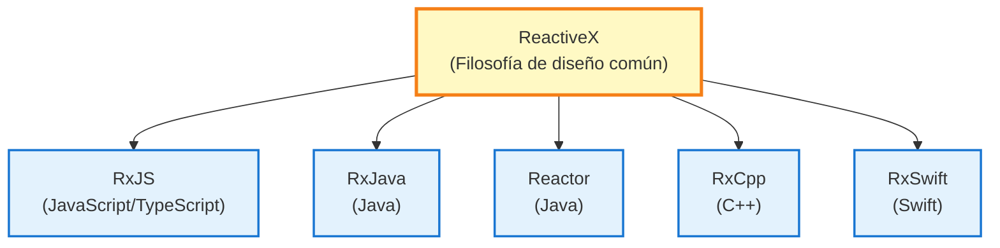
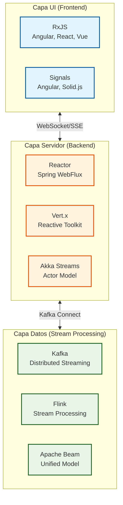
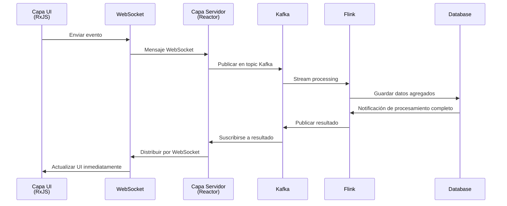

# RxJS y el Ecosistema Reactive Streams

Cuando se aprende RxJS, muchos desarrolladores tienen la pregunta: "¿Cómo se posiciona RxJS dentro de la visión general de Reactive Programming?"

Esta página explica las **diferencias entre RxJS y el estándar Reactive Streams**, la **visión general del stack tecnológico desde la capa UI hasta la capa de datos**, y **métodos de cooperación entre diferentes tecnologías**.

## Posicionamiento de RxJS

### ¿Qué es RxJS?

**RxJS** (Reactive Extensions for JavaScript) es la principal implementación de Reactive Programming en **entornos de navegador y Node.js**.



::: info Características de RxJS
- Opera en navegador y Node.js
- Prioriza la capacidad de respuesta de la UI
- Ligero y rápido
- Backpressure es implícito
:::


## RxJS vs Estándar Reactive Streams

En Reactive Programming hay dos grandes flujos: **RxJS** y el **estándar Reactive Streams**.

### ¿Qué es el Estándar Reactive Streams?

[Reactive Streams](https://www.reactive-streams.org/) es una especificación estándar para procesamiento de flujos en JVM.

**Principales implementaciones:**
- **Project Reactor** (Spring WebFlux)
- **RxJava 3**
- **Akka Streams**
- **Mutiny** (Quarkus)

**4 interfaces estandarizadas:**
```java
public interface Publisher<T> {
    void subscribe(Subscriber<? super T> s);
}

public interface Subscriber<T> {
    void onSubscribe(Subscription s);
    void onNext(T t);
    void onError(Throwable t);
    void onComplete();
}

public interface Subscription {
    void request(long n);  // Control de backpressure
    void cancel();
}

public interface Processor<T, R> extends Subscriber<T>, Publisher<R> {}
```

### Diferencia Principal: Control de Backpressure

| Aspecto | RxJS | Estándar Reactive Streams |
|------|------|---------------------|
| **Plataforma** | JavaScript/TypeScript (navegador, Node.js) | JVM (Java, Scala, Kotlin) |
| **Backpressure** | Implícito (nivel de operador) | Explícito (método `request(n)`) |
| **Prioridad** | Capacidad de respuesta de UI | Throughput del servidor |
| **Estandarización** | API común ReactiveX | Especificación Reactive Streams |

#### Backpressure de RxJS (Implícito)

```typescript
import { interval } from 'rxjs';
import { bufferTime, take } from 'rxjs';

// Backpressure controlado por operadores
interval(10)  // Emitir valor cada 10ms
  .pipe(
    bufferTime(1000),  // Bufferizar cada segundo (control implícito)
    take(5)
  )
  .subscribe(batch => console.log('Lote:', batch.length));
```

#### Backpressure de Reactive Streams (Explícito)

```java
// Project Reactor (Java)
Flux.range(1, 1000)
    .subscribe(new BaseSubscriber<Integer>() {
        @Override
        protected void hookOnSubscribe(Subscription subscription) {
            request(10);  // Solicitar primeros 10 (explícito)
        }

        @Override
        protected void hookOnNext(Integer value) {
            System.out.println("Procesando: " + value);
            request(1);  // Solicitar siguiente 1 después de procesar (explícito)
        }
    });
```

> [!IMPORTANT]
> **Diferencia en Backpressure**
>
> - **RxJS**: Control implícito con operadores (`bufferTime`, `throttleTime`, `debounceTime`)
> - **Reactive Streams**: Control explícito con método `request(n)`
>
> Esta diferencia refleja las diferentes necesidades de UI (RxJS) y servidor (Reactive Streams).

## Stack Tecnológico por Capa

Reactive Programming forma un stack tecnológico que abarca desde la capa UI hasta la capa de datos.

### Arquitectura General



### 1. Capa UI (Frontend)

**Tecnologías principales: RxJS, Signals**

```typescript
// RxJS (estándar de capa UI)
import { fromEvent } from 'rxjs';
import { debounceTime, distinctUntilChanged, switchMap } from 'rxjs';

const searchInput$ = fromEvent(input, 'input').pipe(
  map(event => (event.target as HTMLInputElement).value),
  debounceTime(300),
  distinctUntilChanged(),
  switchMap(query => fetch(`/api/search?q=${query}`).then(r => r.json()))
);

searchInput$.subscribe(results => updateUI(results));
```

::: info Características:
- Opera en entorno navegador
- Prioriza capacidad de respuesta de UI
- Maneja entrada de usuario, eventos DOM, comunicación HTTP de manera unificada
:::

### 2. Capa Servidor (Backend)

**Tecnologías principales: Project Reactor, Vert.x, Akka Streams**

#### Project Reactor (Spring WebFlux)

```java
// Project Reactor (estándar de capa servidor)
@RestController
public class UserController {

    @GetMapping("/users")
    public Flux<User> getUsers() {
        return userRepository.findAll()  // Reactive Repository
            .filter(user -> user.isActive())
            .map(user -> enrichUserData(user))
            .onErrorResume(error -> Flux.empty());
    }

    @GetMapping("/users/{id}")
    public Mono<User> getUser(@PathVariable String id) {
        return userRepository.findById(id)
            .switchIfEmpty(Mono.error(new UserNotFoundException(id)));
    }
}
```


::: info Características:
- Cumple con estándar Reactive Streams
- I/O no bloqueante
- Alto throughput
- Control de backpressure explícito
:::

#### Akka Streams (Modelo Actor)

```scala
// Akka Streams (para sistemas distribuidos)
val source = Source(1 to 100)
val flow = Flow[Int].map(_ * 2)
val sink = Sink.foreach[Int](println)

source.via(flow).to(sink).run()
```


::: info Características:
- Basado en modelo Actor
- Óptimo para sistemas distribuidos
- Aislamiento y recuperación de fallos
:::

### 3. Capa Datos (Stream Processing)

**Tecnologías principales: Kafka, Flink, Apache Beam**

#### Apache Kafka (Event Streaming)

```java
// Kafka Streams (pipeline de datos)
StreamsBuilder builder = new StreamsBuilder();

KStream<String, String> source = builder.stream("input-topic");

source
    .filter((key, value) -> value.length() > 10)
    .mapValues(value -> value.toUpperCase())
    .to("output-topic");

KafkaStreams streams = new KafkaStreams(builder.build(), config);
streams.start();
```


::: info Características:
- Plataforma de streaming de eventos distribuida
- Alto throughput, baja latencia
- Base para Event Sourcing y patrones CQRS
:::

#### Apache Flink (Stream Processing)

```java
// Flink (procesamiento de flujos en tiempo real)
StreamExecutionEnvironment env = StreamExecutionEnvironment.getExecutionEnvironment();

DataStream<Event> events = env.addSource(new KafkaSource<>());

events
    .filter(event -> event.getValue() > threshold)
    .keyBy(Event::getSensorId)
    .timeWindow(Time.seconds(10))
    .reduce((e1, e2) -> new Event(e1.getSensorId(), e1.getValue() + e2.getValue()))
    .addSink(new DatabaseSink());

env.execute("Stream Processing Job");
```


::: info Características:
- Motor de procesamiento de flujos en tiempo real
- Garantía exactamente una vez (Exactly-once)
- Procesamiento de tiempo de evento y watermarks
:::

## Tecnologías de Puente: Cooperación entre Capas

¿Cómo cooperar entre diferentes stacks tecnológicos?

### 1. Capa UI ⇄ Capa Servidor: WebSocket / SSE

#### WebSocket (Comunicación Bidireccional)

**Frontend (RxJS):**
```typescript
import { webSocket } from 'rxjs/webSocket';

const socket$ = webSocket<Message>('wss://example.com/ws');

// Recepción
socket$.subscribe(message => console.log('Recibido:', message));

// Envío
socket$.next({ type: 'subscribe', channel: 'notifications' });
```

**Backend (Spring WebFlux):**
```java
@Configuration
@EnableWebSocketMessageBroker
public class WebSocketConfig implements WebSocketMessageBrokerConfigurer {

    @Override
    public void configureMessageBroker(MessageBrokerRegistry config) {
        config.enableSimpleBroker("/topic");
        config.setApplicationDestinationPrefixes("/app");
    }

    @Override
    public void registerStompEndpoints(StompEndpointRegistry registry) {
        registry.addEndpoint("/ws").withSockJS();
    }
}

@Controller
public class NotificationController {

    @MessageMapping("/subscribe")
    public Flux<Notification> subscribe(@Payload SubscribeRequest request) {
        return notificationService.getNotificationStream(request.getChannel());
    }
}
```

#### Server-Sent Events (Servidor → Cliente)

**Frontend (RxJS):**
```typescript
import { Observable } from 'rxjs';

function fromSSE<T>(url: string): Observable<T> {
  return new Observable(subscriber => {
    const eventSource = new EventSource(url);

    eventSource.onmessage = event => {
      subscriber.next(JSON.parse(event.data));
    };

    eventSource.onerror = error => {
      subscriber.error(error);
    };

    return () => eventSource.close();
  });
}

const notifications$ = fromSSE<Notification>('/api/notifications/stream');
notifications$.subscribe(n => console.log('Notificación:', n));
```

**Backend (Spring WebFlux):**
```java
@GetMapping(value = "/notifications/stream", produces = MediaType.TEXT_EVENT_STREAM_VALUE)
public Flux<Notification> streamNotifications() {
    return notificationService.getNotificationStream()
        .delayElements(Duration.ofSeconds(1));
}
```

### 2. Capa Servidor ⇄ Capa Datos: Kafka Connect

**Capa Servidor (Reactor) a Kafka:**
```java
// Spring WebFlux + Kafka
@Service
public class EventPublisher {

    private final KafkaTemplate<String, Event> kafkaTemplate;

    public Mono<Void> publishEvent(Event event) {
        return Mono.fromFuture(
            kafkaTemplate.send("events-topic", event.getId(), event)
                .completable()
        ).then();
    }
}
```

**Kafka a Capa Servidor (Reactor):**
```java
// Kafka Consumer (Reactive)
@Service
public class EventConsumer {

    @KafkaListener(topics = "events-topic")
    public Mono<Void> consume(Event event) {
        return processEvent(event)
            .then();
    }

    private Mono<Void> processEvent(Event event) {
        return Mono.fromRunnable(() -> {
            System.out.println("Procesando evento: " + event);
        });
    }
}
```

### 3. Pipeline Reactivo End-to-End



## Guía de Selección de Tecnología

¿Qué tecnología usar en qué capa?

### Selección de Capa UI (Frontend)

| Requisito | Tecnología Recomendada | Razón |
|------|---------|------|
| Flujo asíncrono complejo | **RxJS** | Operadores ricos, API unificada |
| Reactividad simple | **Angular Signals** / **Solid.js** | Bajo costo de aprendizaje, intuitivo |
| Estándar de framework | **React Hooks** / **Vue Composition API** | Integración con framework |

```typescript
// Elegir RxJS: flujo asíncrono complejo
combineLatest([
  userInput$,
  apiStatus$,
  validation$
]).pipe(
  debounceTime(300),
  distinctUntilChanged(),
  switchMap(([input, status, isValid]) =>
    isValid ? submitData(input) : of(null)
  )
).subscribe(/*...*/);

// Elegir Signals: gestión de estado simple
const count = signal(0);
const doubled = computed(() => count() * 2);
```

### Selección de Capa Servidor (Backend)

| Requisito | Tecnología Recomendada | Razón |
|------|---------|------|
| API de alto throughput | **Spring WebFlux** (Reactor) | Ecosistema JVM, bibliotecas ricas |
| Microservicios | **Vert.x** / **Quarkus** (Mutiny) | Ligero, inicio rápido |
| Sistemas distribuidos | **Akka Streams** | Modelo Actor, aislamiento de fallos |
| Entorno Node.js | **RxJS** / **Node.js Streams** | JavaScript unificado |

```java
// Spring WebFlux (API de alto throughput)
@GetMapping("/users")
public Flux<User> getUsers() {
    return userRepository.findAll()
        .filter(User::isActive)
        .map(this::enrichData);
}
```

### Selección de Capa Datos (Stream Processing)

| Requisito | Tecnología Recomendada | Razón |
|------|---------|------|
| Event streaming | **Apache Kafka** | Alto throughput, distribuido, persistencia |
| Procesamiento en tiempo real | **Apache Flink** | Baja latencia, gestión de estado |
| Integración batch+stream | **Apache Beam** | Modelo API unificado |
| Procesamiento de datos IoT | **Kafka + Flink** | Escalabilidad, confiabilidad |

```java
// Kafka + Flink (procesamiento de datos IoT)
StreamExecutionEnvironment env = StreamExecutionEnvironment.getExecutionEnvironment();

DataStream<SensorReading> sensorData = env
    .addSource(new FlinkKafkaConsumer<>("sensors", deserializer, properties));

sensorData
    .keyBy(SensorReading::getSensorId)
    .timeWindow(Time.minutes(5))
    .aggregate(new AverageAggregator())
    .addSink(new FlinkKafkaProducer<>("aggregated-data", serializer, properties));
```

## Similitudes y Diferencias en Sintaxis de Operadores

RxJS, Reactor, Kafka Streams tienen **sintaxis similar** pero **semántica diferente**.

### Similitudes: Pipeline Declarativo

**RxJS (Capa UI):**
```typescript
source$
  .pipe(
    filter(x => x > 10),
    map(x => x * 2),
    take(5)
  )
  .subscribe(console.log);
```

**Reactor (Capa Servidor):**
```java
source
    .filter(x -> x > 10)
    .map(x -> x * 2)
    .take(5)
    .subscribe(System.out::println);
```

**Kafka Streams (Capa Datos):**
```java
stream
    .filter((key, value) -> value > 10)
    .mapValues(value -> value * 2)
    .to("output-topic");
```

### Diferencias: Modelo de Ejecución y Semántica

| Aspecto | RxJS | Reactor | Kafka Streams |
|------|------|---------|---------------|
| **Entorno de ejecución** | Single-threaded (event loop) | Multi-threaded posible | Procesamiento distribuido |
| **Scheduling** | Implícito (sync por defecto) | Explícito (Schedulers) | Distribución automática |
| **Manejo de errores** | `catchError` | `onErrorResume` | Garantía Exactly-once |
| **Backpressure** | Nivel de operador | `request(n)` | Control automático |

> [!WARNING]
> **Solo porque la sintaxis de operadores sea similar no significa que funcionen igual.** Es importante comprender el modelo de ejecución y semántica de cada tecnología.

## Fortalezas y Áreas de Aplicación de RxJS

### Áreas Donde RxJS es Más Fuerte

1. **Procesamiento UI del Navegador**
   - Procesamiento unificado de entrada de usuario, eventos DOM, comunicación HTTP

2. **I/O Asíncrono de Node.js**
   - Streaming de operaciones de archivos, comunicación de red

3. **Integración de Múltiples Procesos Asíncronos**
   - Flujos complejos con `combineLatest`, `merge`, `switchMap`

### Limitaciones de RxJS

1. **Procesamiento de Servidor de Alto Throughput**
   - Reactor basado en JVM, Akka Streams son más ventajosos

2. **Procesamiento de Flujos Distribuidos**
   - Kafka, Flink son más adecuados

3. **Control Estricto de Backpressure**
   - Se necesita `request(n)` explícito del estándar Reactive Streams

> [!TIP]
> **RxJS es más fuerte en la capa UI, pero puede haber otras tecnologías más adecuadas en las capas servidor y datos.** No es necesario usar RxJS en todas las capas.

## Resumen

### Posicionamiento de RxJS

> [!IMPORTANT]
> RxJS es la principal implementación de Reactive Programming en **entornos navegador y Node.js**. Prioriza la capacidad de respuesta de la UI y adopta control de backpressure implícito.

### Visión General del Ecosistema Reactive Streams

```
Capa UI         : RxJS, Signals
Capa Comunicación: WebSocket, SSE
Capa Servidor   : Reactor, Vert.x, Akka Streams
Capa Datos      : Kafka, Flink, Apache Beam
```

### Guía de Selección de Tecnología

| Capa | Tecnología Recomendada | Razón |
|----|---------|------|
| **Capa UI** | RxJS, Signals | Capacidad de respuesta UI, operadores ricos |
| **Capa Servidor** | Reactor, Vert.x | Alto throughput, estándar Reactive Streams |
| **Capa Datos** | Kafka, Flink | Procesamiento distribuido, escalabilidad |

### Tecnologías de Puente

- **UI ⇄ Servidor**: WebSocket, SSE
- **Servidor ⇄ Datos**: Kafka Connect, Reactive Kafka

### Similitudes en Sintaxis de Operadores

RxJS, Reactor, Kafka Streams tienen sintaxis similar pero **modelo de ejecución y semántica diferente**. Es importante comprender las características de cada tecnología y usarlas adecuadamente.

> [!TIP]
> **No es necesario unificar todas las capas con RxJS.** Seleccionando la tecnología óptima para cada capa y cooperándolas con tecnologías de puente, se puede construir un sistema reactivo end-to-end.

## Páginas Relacionadas

- [Mapa General de Arquitectura Reactiva](/es/guide/appendix/reactive-architecture-map) - Detalles de las 7 capas
- [Reactive Programming Reconsidered](/es/guide/appendix/reactive-programming-reconsidered) - Fortalezas y limitaciones de RP
- [Operadores de Combinación](/es/guide/operators/combination/) - Integración de múltiples flujos
- [Manejo de Errores](/es/guide/error-handling/strategies) - Procesamiento de errores en RxJS

## Referencias

- [GitHub Discussion #16 - Reactive Streams Ecosystem and RxJS Positioning](https://github.com/shuji-bonji/RxJS-with-TypeScript/discussions/16)
- [Sitio oficial de Reactive Streams](https://www.reactive-streams.org/)
- [Documentación oficial de Project Reactor](https://projectreactor.io/docs)
- [Documentación oficial de Apache Kafka](https://kafka.apache.org/documentation/)
- [Documentación oficial de Apache Flink](https://flink.apache.org/docs/)
- [Documentación oficial de RxJS](https://rxjs.dev/)
