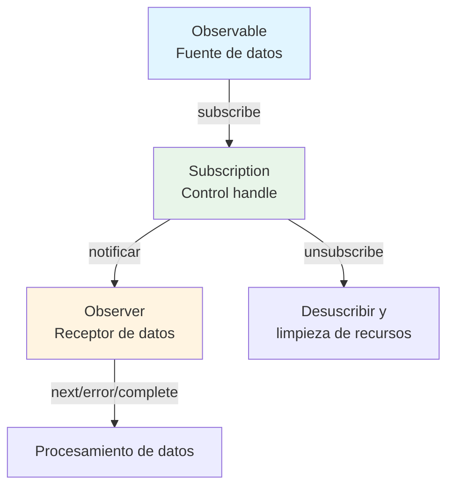

# ¿Qué es un Stream?

## Definición de Stream

Un "stream" se refiere a **un flujo de datos que ocurre secuencialmente a lo largo del tiempo**. Puede verse como una colección de datos que aparecen uno tras otro en cierto orden.

### Ejemplos de Streams Típicos en Programación Tradicional
- Datos de lecturas de archivos (ej., ReadableStream en Node.js)
- Comunicaciones de red (ej., respuestas HTTP)
- Entrada de usuario y eventos (movimientos del ratón, clics, entradas de teclado)

## Streams en RxJS

RxJS usa **Observable** para manejar tales datos que ocurren a lo largo del tiempo como un stream. Observable es un mecanismo para abstraer datos asincrónicos, datos sincrónicos, eventos y procesamiento basado en tiempo como "streams".

### Ventajas de Observable
- Puede describirse de manera type-safe (afinidad con TypeScript)
- Expresión declarativa del flujo de datos
- Cadena de operaciones mediante `pipe()` es posible
- Puede suscribirse explícitamente mediante `subscribe()`
- Cancelable mediante `unsubscribe()`

## Comparación con Streams Convencionales

| Característica | Streams Convencionales | RxJS Observable |
|------|------------------|-------------------|
| Objetivo | Tiende a limitarse a archivos/redes, etc. | Asíncrono/evento/cambio de estado arbitrario |
| Manejo de eventos | Manejado por event listeners caso por caso | Streaming con `fromEvent` |
| Cancelar | Diferentes métodos | Gestión unificada con `unsubscribe()` |
| Composición/Conversión | Implementación separada con código procedimental | Descripción concisa con operadores (`map`, `filter`, etc.) |

## Relación con Observer y Subscription

- **Observable**: Fuente de datos (fuente del stream)
- **Observer**: Receptor de datos (con next, error, complete)
- **Subscription**: Control handle para suscripción (suscribir, desuscribir, gestión de recursos)

Observable y Observer se conectan a través de callbacks y se controlan mediante Subscription.

### Diagrama de Relación Básica

## Resumen

El concepto de "streams", que está en el núcleo de RxJS, es un arma poderosa cuando se trata de procesamiento asíncrono. Observable te permite manejar diversas fuentes de datos de manera unificada y describir flujos de datos de manera declarativa y flexible.

## Relación con el Procesamiento de Eventos

En RxJS, los eventos DOM también pueden manejarse como streams usando `fromEvent`.
El concepto de stream se vuelve más claro al comparar las diferencias con los event listeners convencionales.

> [!TIP]
> Ver [Eventos de Streaming](/es/guide/observables/events.md#comparison-between-traditional-event-processing-and-rxjs) para una comparación del procesamiento de eventos tradicional y RxJS con código real.
