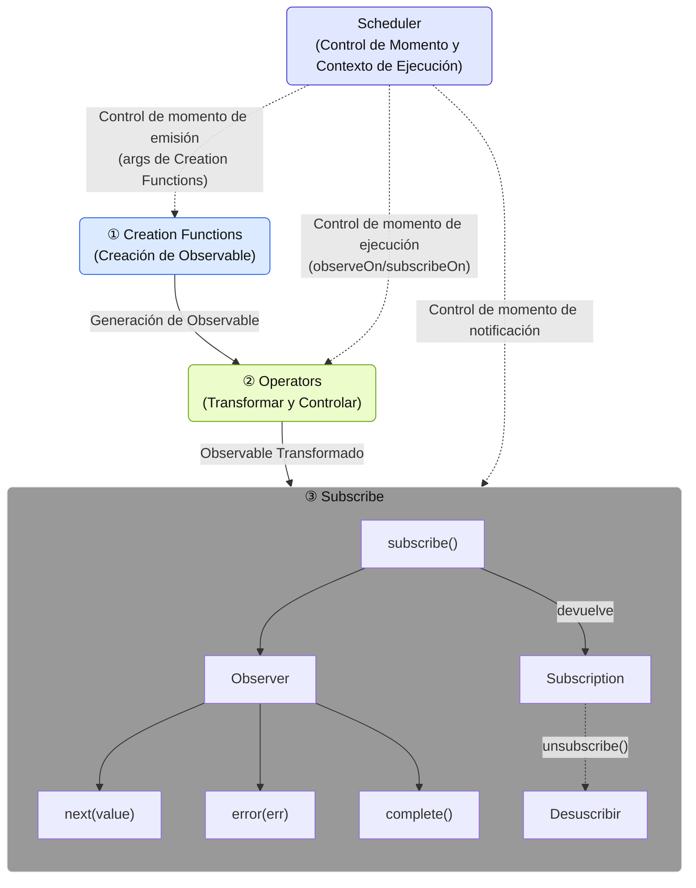
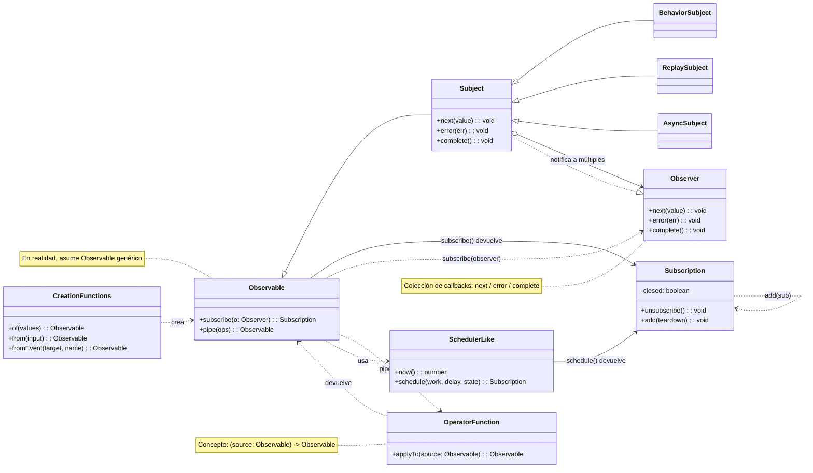

# ¿Qué es RxJS?

## Resumen
[RxJS (Reactive Extensions for JavaScript)](https://rxjs.dev) es una biblioteca para "programación reactiva" en JavaScript.

> ### ¿Qué es la programación reactiva?
> La programación reactiva es un método para crear programas que se actualizan automáticamente en respuesta a cambios en los datos.
> Es un tipo de programación basada en eventos, con un enfoque particular en el manejo de flujos de datos asincrónicos. Se centra en el flujo (stream) de datos y construye programas que reaccionan a ese flujo.

En otras palabras, RxJS es una biblioteca para manejar eventos y flujos de datos asincrónicos en un estilo funcional, proporcionando herramientas poderosas para manejar flujos de datos asincrónicos usando el patrón Observable.

> Observable es el bloque de construcción central de RxJS para representar eventos y flujos de datos asincrónicos. Es una fuente de valores que "fluyen" y se pueden recibir mediante suscripción. Un Observable es un "flujo de datos" que publica valores a lo largo del tiempo, y puedes recibir esos valores suscribiéndote a él.


> [!TIP]
> Si te preguntas "¿Qué es un stream de todos modos?" Por favor consulta [¿Qué es un Stream?](/es/guide/basics/what-is-a-stream).


## Ejemplo de Uso Simple

```ts
import { fromEvent } from 'rxjs';

fromEvent(document, 'click').subscribe(event => {
  console.log('Click:', event);
});
```

## Componentes Básicos de RxJS

Para dominar RxJS, es importante entender los siguientes componentes centrales.

| Componente | Resumen |
|------|------|
| [`Observable`](../observables/what-is-observable.md) | La fuente del stream, que representa datos que ocurren asincrónicamente o a lo largo del tiempo. |
| [`Observer`](../observables/observable-lifecycle.md#observer)[^observer]| La entidad que se suscribe y recibe datos del Observable. |
| [`Subscription`](../observables/observable-lifecycle.md#subscription) | Gestiona la suscripción y desuscripción del Observable. |
| [`Creation Functions`](../creation-functions/index.md) | Un conjunto de funciones para crear y combinar Observables. |
| [`Operator`](../operators/index.md) | Un conjunto de funciones para convertir y controlar un Observable. |
| [`Subject`](../subjects/what-is-subject.md)[^1] | Es un relé que tiene las propiedades tanto de Observable como de Observer. |
| [`Scheduler`](../schedulers/async-control.md)[^2]| Un mecanismo para controlar el momento de ejecución del Observable. |

[^observer]: La clase Subscriber se usa como implementación. Para más detalles, ver [Diferencia entre Observer y Subscriber](../observables/observer-vs-subscriber.md).
[^1]: Un Subject es una entidad especial que puede actuar tanto como Observable que emite valores como Observer que recibe valores.
[^2]: Scheduler se usa para controlar el momento de ejecución y el contexto del procesamiento asíncrono y también es útil para depuración y gestión del rendimiento.

Tienen sus propias funciones independientes, pero trabajan juntos.
Por ejemplo, las Creation Functions crean y combinan Observables, los Operators los transforman y controlan, los Observers se suscriben a ellos, y los Schedulers controlan el momento de ejecución, constituyendo así el procesamiento de stream en su conjunto.

#### Componentes de RxJS y Flujo de Datos


※ El uso detallado y los ejemplos de cada componente se explican por separado en sus propios capítulos dedicados.

### Diagrama de Clases de Componentes



## Ventajas de RxJS

| Ventaja | Contenido |
|---|---|
| Código declarativo[^3] | Describe "lo que quieres hacer" con `map`, `filter`, etc. y evita descripciones procedimentales como bucles for |
| Simplificar procesamiento asíncrono | Evita `Promise` anidados y callbacks, y escribe en un flujo intuitivo |
| Manejo de errores | Manejo uniforme de errores en streams con `.pipe(catchError(...))`, etc. |
| Cancelable | El stream puede ser suspendido por `Subscription.unsubscribe()` |
| Diversos operadores | Muchos operadores como `debounceTime`, `mergeMap`, `combineLatest`, etc. pueden usarse para conversión y composición |

[^3]: > - Código declarativo: código directo que dice "¿qué tipo de resultado quieres?"
      > - Código procedimental: código que describe "qué tipo de cálculo debe realizarse para obtener el resultado deseado"


## Casos de Uso

RxJS puede usarse en cualquier situación donde estés tratando con "datos que cambian con el tiempo". A continuación se muestran algunos de los casos de uso clave.

### Comunicación en Tiempo Real y Streaming

RxJS es especialmente poderoso cuando se trata de comunicaciones en tiempo real como WebSockets y Server-Sent Events (SSE).

| Caso de Uso | Descripción | Operadores Principales |
|------|------|-------------------|
| Comunicación WebSocket | Chat, notificaciones, actualizaciones de precios de acciones, etc. | [`webSocket`](../observables/creation.md#websocket), [`filter`](../operators/filtering/filter.md), [`map`](../operators/transformation/map.md) |
| Server-Sent Events | Notificaciones push desde servidores | [`fromEvent`](../observables/events.md), [`retry`](../operators/utility/retry.md) |
| Monitoreo de Sensores IoT | Procesamiento continuo de datos de sensores | [`debounceTime`](../operators/filtering/debounceTime.md), [`distinctUntilChanged`](../operators/filtering/distinctUntilChanged.md) |

#### Ejemplo Simple
```ts
import { webSocket } from 'rxjs/webSocket';
import { filter } from 'rxjs';

const socket$ = webSocket('wss://example.com/chat');

socket$.pipe(
  filter(msg => msg.type === 'message')
).subscribe(msg => console.log('Nuevo mensaje:', msg.text));
```

### Gestión de UI/Estado y Control de Formularios

Manejo reactivo de entrada de usuario y cambios de estado.

> [!NOTE] Relación con frameworks
> Los frameworks frontend modernos (Angular Signals, React hooks, Vue Composition API, Svelte Runes, etc.) proporcionan cada uno sus propios sistemas reactivos. RxJS es una biblioteca independiente del framework que puede usarse junto con o separada de estos. La integración de RxJS con mecanismos específicos del framework se discutirá en detalle en el Capítulo 15, "Integración con Frameworks" (en preparación).

| Caso de Uso | Descripción | Operadores Principales |
|------|------|-------------------|
| Control de formularios de entrada | Autocompletado de búsqueda, validación en tiempo real | [`debounceTime`](../operators/filtering/debounceTime.md), [`distinctUntilChanged`](../operators/filtering/distinctUntilChanged.md), [`switchMap`](../operators/transformation/switchMap.md) |
| Enlace de múltiples elementos de formulario | Actualización de elementos de entrada dependientes | [`combineLatest`](../creation-functions/combination/combineLatest.md), [`withLatestFrom`](../operators/combination/withLatestFrom.md) |
| Comunicación entre componentes | Bus de eventos y gestión de estado personalizada | [`Subject`](../subjects/what-is-subject.md), [`share`](../operators/multicasting/share.md) |
| Procesamiento de eventos UI | Click, scroll, arrastrar y soltar | [`fromEvent`](../observables/events.md), [`takeUntil`](../operators/utility/takeUntil.md) |

#### Ejemplo Simple
```ts
import { fromEvent, combineLatest } from 'rxjs';
import { debounceTime, map, switchMap } from 'rxjs';

const searchInput = document.querySelector('#search') as HTMLInputElement;
const sortSelect = document.querySelector('#sort') as HTMLInputElement;

const search$ = fromEvent(searchInput, 'input').pipe(
  map(e => (e.target as HTMLInputElement).value)
);

const sort$ = fromEvent(sortSelect, 'change').pipe(
  map(e => (e.target as HTMLSelectElement).value)
);

combineLatest([search$, sort$]).pipe(
  debounceTime(300),
  switchMap(([query, order]) =>
    fetch(`/api/search?q=${query}&sort=${order}`).then(r => r.json())
  )
).subscribe(results => console.log(results));
```

### Soporte Offline y PWA

Puede usarse para soporte offline y gestión del estado de red en Progressive Web App (PWA).

| Caso de Uso | Descripción | Operadores Principales |
|------|------|-------------------|
| Monitoreo de Condiciones de Red | Detección online/offline | [`fromEvent`](../observables/events.md), [`merge`](../creation-functions/combination/merge.md) |
| Reintento cuando está offline | Resincronización automática cuando se restaura la conexión | [`retry`](../operators/utility/retry.md), [`retryWhen`](../error-handling/retry-catch.md) |
| Control de caché | Integración con Service Worker | [`switchMap`](../operators/transformation/switchMap.md), [`catchError`](../error-handling/retry-catch.md) |

#### Ejemplo Simple
```ts
import { fromEvent, merge } from 'rxjs';
import { map, startWith } from 'rxjs';

const online$ = fromEvent(window, 'online').pipe(map(() => true));
const offline$ = fromEvent(window, 'offline').pipe(map(() => false));

merge(online$, offline$).pipe(
  startWith(navigator.onLine)
).subscribe(isOnline => {
  console.log(isOnline ? 'Online' : 'Offline');
});
```

### AI/API de Streaming

También es ideal para manejar respuestas de API de streaming como OpenAI.

| Caso de Uso | Descripción | Operadores Principales |
|------|------|-------------------|
| Salida secuencial de tokens | Visualización en tiempo real de respuestas de IA | [`concatMap`](../operators/transformation/concatMap.md), [`scan`](../operators/transformation/scan.md) |
| Procesamiento de streaming | Procesamiento de Server-Sent Events | [`fromEvent`](../observables/events.md), [`map`](../operators/transformation/map.md) |
| Integración con back-end | Uso con NestJS (RxJS estándar) | Diversos operadores |

### Comunicación HTTP y Manejo de Errores

La comunicación HTTP asíncrona puede manejarse elegantemente.

| Caso de Uso | Descripción | Operadores Principales |
|------|------|-------------------|
| Solicitudes API | Comunicación con APIs RESTful | [`switchMap`](../operators/transformation/switchMap.md), [`mergeMap`](../operators/transformation/mergeMap.md) |
| Manejo de errores | Reintentos y fallbacks | [`catchError`](../error-handling/retry-catch.md), [`retry`](../operators/utility/retry.md) |
| Control de timeout | Límites de tiempo de respuesta | [`timeout`](../operators/utility/timeout.md) |
| Cancelación | Abortar solicitudes innecesarias | [`takeUntil`](../operators/utility/takeUntil.md), `unsubscribe()` |

### Gestión de Estado y Arquitectura

También puede usarse para diseñar la arquitectura general de la aplicación.

| Caso de Uso | Descripción | Operadores Principales |
|------|------|-------------------|
| Bibliotecas de Gestión de Estado | NgRx, Redux-Observable, etc. | [`scan`](../operators/transformation/scan.md), [`share`](../operators/multicasting/share.md) |
| Gestión de flujo de eventos | Utilización en DDD (Diseño Dirigido por Dominio) | [`Subject`](../subjects/what-is-subject.md), [`shareReplay`](../operators/multicasting/shareReplay.md) |
| Separación de capa de datos | Arquitectura limpia | Diversos operadores |

---

> [!TIP]
> Ver también [la diferencia entre Promise y RxJS](./promise-vs-rxjs.md) para más información sobre el uso de Promise y RxJS.

## Resumen

RxJS ofrece un enfoque poderoso para la programación asíncrona y basada en eventos, y su filosofía de flujo de datos centrada en Observable es particularmente útil cuando se trata de procesamiento asíncrono complejo.
