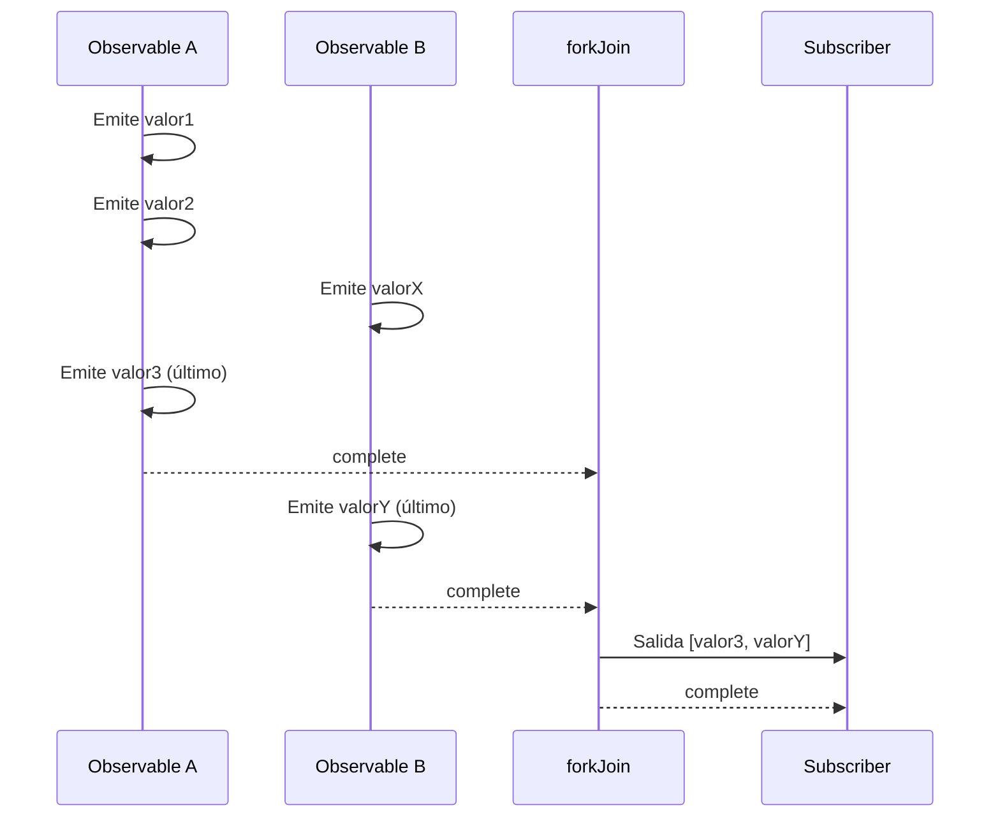
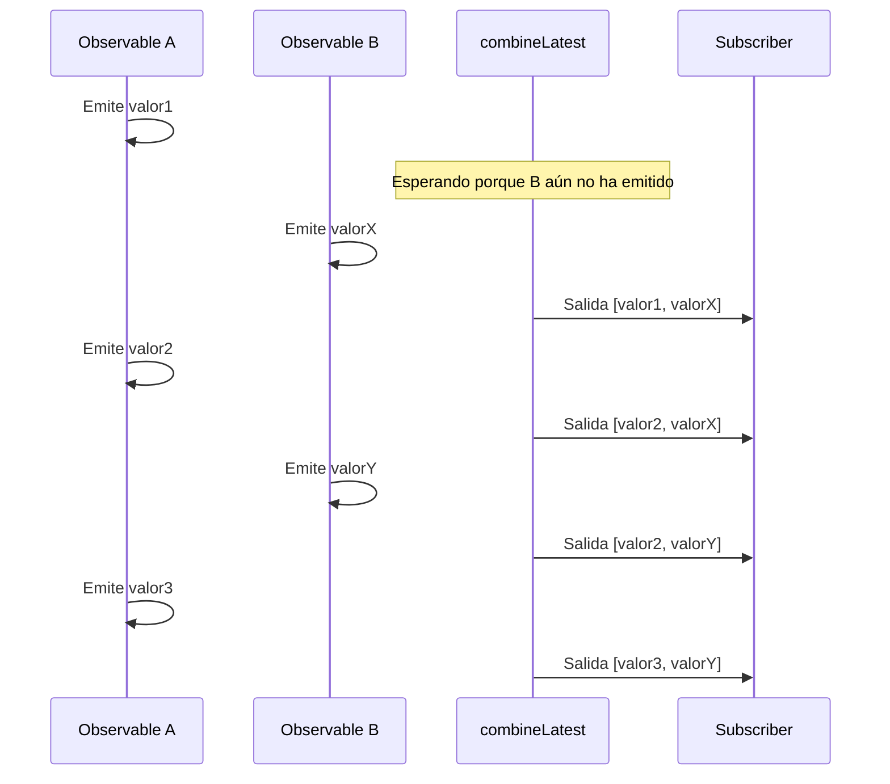

# Diferencia entre forkJoin y combineLatest

Al combinar múltiples Observables en RxJS, `forkJoin` y `combineLatest` son las Creation Functions más comúnmente utilizadas. Sin embargo, estas dos tienen **comportamientos significativamente diferentes**, y usarlas incorrectamente no producirá los resultados esperados.

Esta página compara exhaustivamente ambas usando diagramas y ejemplos prácticos, dejando claro "cuál usar."

## Conclusión: Diferencia entre forkJoin y combineLatest

| Característica | forkJoin | combineLatest |
|----------------|----------|---------------|
| **Timing de salida** | **Una vez** después de que todos completen | **Cada vez** que se actualiza un valor |
| **Valor de salida** | **Último valor** de cada Observable | **Valor más reciente** de cada Observable |
| **Condición de completación** | Todos los Observables completan | Todos los Observables completan |
| **Casos de uso principales** | Llamadas API paralelas, carga de datos inicial | Monitoreo de formularios, sync en tiempo real |
| **Streams infinitos** | ❌ No puede usar | ✅ Puede usar (emite valores incluso sin completar) |

> [!TIP]
> **Forma fácil de recordar**
> - `forkJoin` = "Una vez que todos estén listos, **partir una vez**" (similar a Promise.all)
> - `combineLatest` = "**Reportar el último estado** cada vez que alguien se mueve"

## Entender las diferencias de comportamiento con diagramas

### Comportamiento de forkJoin

### Comportamiento de combineLatest

## Cuándo usar cuál (Guía caso por caso)

### Casos para usar forkJoin

- **Llamadas API paralelas**: Cuando quieres procesar solo después de que todos los datos estén listos
- **Carga de datos inicial**: Obtener todos los datos maestros necesarios al inicio de la app

> [!WARNING]
> `forkJoin` no puede usarse con **Observables que nunca completan** (`interval`, WebSocket, streams de eventos, etc.).

### Casos para usar combineLatest

- **Monitoreo de entrada de formulario en tiempo real**: Combinar múltiples valores de entrada para validación
- **Sync en tiempo real de múltiples streams**: Visualización integrada de datos de sensores
- **Combinación de condiciones de filtro**: Ejecutar búsqueda cuando cambia una condición

## Resumen

| Criterio de selección | forkJoin | combineLatest |
|----------------------|----------|---------------|
| Procesar una vez cuando todo esté listo | ✅ | ❌ |
| Procesar en cada cambio de valor | ❌ | ✅ |
| Streams que no completan | ❌ | ✅ |
| Uso tipo Promise.all | ✅ | ❌ |
| Sincronización en tiempo real | ❌ | ✅ |

## Páginas relacionadas

- **[forkJoin](/es/guide/creation-functions/combination/forkJoin)** - Explicación detallada de forkJoin
- **[combineLatest](/es/guide/creation-functions/combination/combineLatest)** - Explicación detallada de combineLatest
- **[zip](/es/guide/creation-functions/combination/zip)** - Emparejar valores correspondientes
- **[merge](/es/guide/creation-functions/combination/merge)** - Ejecutar múltiples Observables en paralelo
