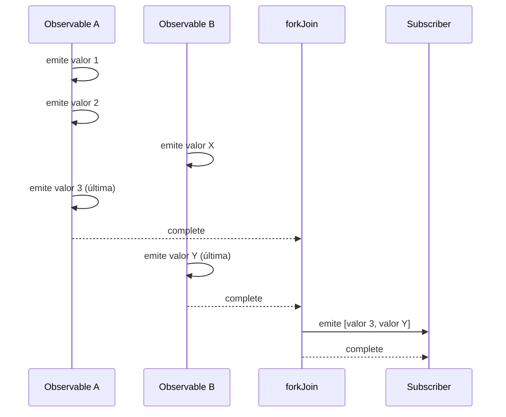
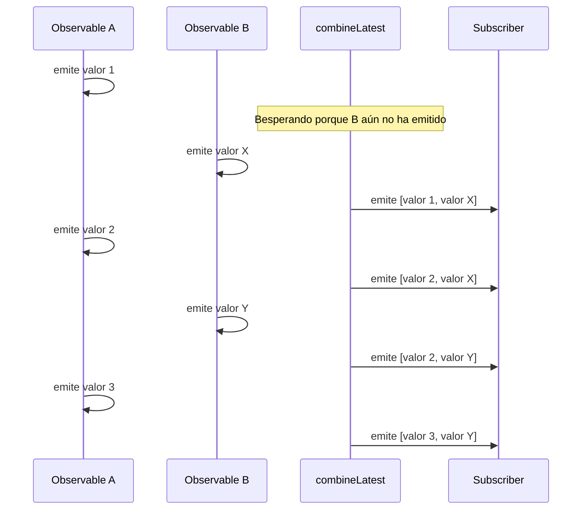
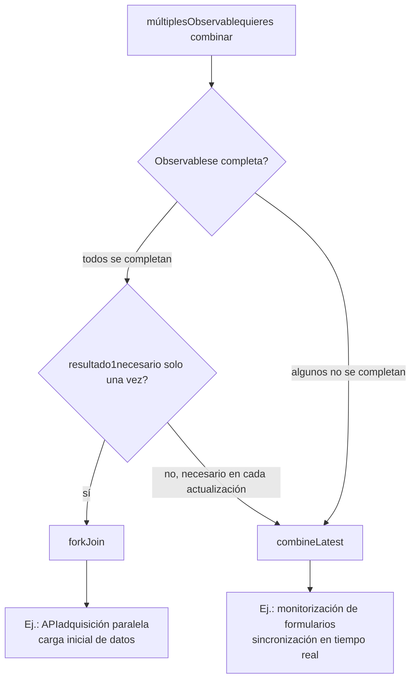

# Diferencia entre forkJoin y combineLatest

Cuando se combinan múltiples Observables en RxJS, `forkJoin` y `combineLatest` son las Creation Functions más utilizadas. Sin embargo, estas dos **se comportan de manera muy diferente** y si no se utilizan correctamente, no producirán los resultados esperados.

Esta página compara a fondo las diferencias entre ellas con ilustraciones y ejemplos prácticos para que quede claro cuál debes usar.

## Conclusión: la diferencia entre forkJoin y combineLatest

| Característica | forkJoin | combineLatest |
|---|---|---|
| **Tiempo de emisión** | **Solo una vez** tras completarse todos | **Cada vez** que se actualice un valor |
| **Valor emitido** | El **último valor** de cada Observable | El **valor más reciente** de cada Observable |
| **Condición de finalización** | Todos los Observables completados | Todos los Observables completados |
| **Uso principal** | Adquisición paralela de APIs, carga inicial | Monitorización de formularios, sincronización en tiempo real |
| **Stream infinito** | ❌ No utilizable (no se completa) | ✅ Utilizable (emite valores sin completarse) |

> [!TIP]

> **Fácil de recordar**
> - `forkJoin` = «salir **una sola vez** cuando todos están presentes» (similar a Promise.all)
> - `combineLatest` = «**reportar el último estado** cada vez que alguien se mueva»

## Entender las diferencias de comportamiento con las ilustraciones

### Comportamiento de forkJoin


```mermaid
sequenceDiagram
    participant A as Observable A
    participant B as Observable B
    participant F as forkJoin
    participant S as Subscriber

    A->>A: emite valor 1
    A->>A: emite valor 2
    B->>B: emite valor X
    A->>A: emite valor 3 (última)
    A-->>F: complete
    B->>B: emite valor Y (última)
    B-->>F: complete
    F->>S: emite [valor 3, valor Y]
    F-->>S: complete
```

**Punto**: esperar hasta que todos los Observables estén `complete` y emitir **solo el último valor** una vez.

### Comportamiento de combineLatest


```mermaid
sequenceDiagram
    participant A as Observable A
    participant B as Observable B
    participant C as combineLatest
    participant S as Subscriber

    A->>A: emite valor 1
    Note over C: Besperando porque B aún no ha emitido
    B->>B: emite valor X
    C->>S: emite [valor 1, valor X]
    A->>A: emite valor 2
    C->>S: emite [valor 2, valor X]
    B->>B: emite valor Y
    C->>S: emite [valor 2, valor Y]
    A->>A: emite valor 3
    C->>S: emite [valor 3, valor Y]
```

**Punto**: después de que todos los Observables hayan emitido su primer valor, seguirán emitiendo la última combinación **cada vez que se actualice cualquiera de ellos**.

## Diferencias en la línea de tiempo


```mermaid
gantt
    title forkJoin vs Tiempo de emisión de combineLatest
    dateFormat X
    axisFormat %s

    section Observable A
    valor1 :a1, 0, 1
    valor2 :a2, 2, 1
    valor3 :a3, 4, 1
    complete :milestone, a_done, 5, 0

    section Observable B
    valorX :b1, 1, 1
    valorY :b2, 3, 1
    complete :milestone, b_done, 4, 0

    section forkJoinemisión
    [valor3,valorY] :crit, fork_out, 5, 1

    section combineLatestemisión
    [valor1,valorX] :c1, 1, 1
    [valor2,valorX] :c2, 2, 1
    [valor2,valorY] :c3, 3, 1
    [valor3,valorY] :c4, 4, 1
```

## Comparación práctica: verificar el comportamiento con la misma fuente de datos

Apliquemos `forkJoin` y `combineLatest` al mismo Observable y verifiquemos las diferencias en la salida.

```ts
import { forkJoin, combineLatest, interval, take, map } from 'rxjs';

// crear área de salida
const output = document.createElement('div');
output.innerHTML = '<h3>Comparación forkJoin vs combineLatest:</h3>';
document.body.appendChild(output);

// Crear 2 Observables
const obs1$ = interval(1000).pipe(
  take(3),
  map(i => `A${i}`)
);

const obs2$ = interval(1500).pipe(
  take(2),
  map(i => `B${i}`)
);

// Área de visualización del resultado de forkJoin
const forkJoinResult = document.createElement('div');
forkJoinResult.innerHTML = '<h4>forkJoin:</h4><div id="forkjoin-output">esperando...</div>';
output.appendChild(forkJoinResult);

// Área de visualización del resultado de combineLatest
const combineLatestResult = document.createElement('div');
combineLatestResult.innerHTML = '<h4>combineLatest:</h4><div id="combinelatest-output"></div>';
output.appendChild(combineLatestResult);

// forkJoin：tras completarse todos1emite una sola vez
forkJoin([obs1$, obs2$]).subscribe(result => {
  const el = document.getElementById('forkjoin-output');
  if (el) {
    el.textContent = `emisión: [${result.join(', ')}]`;
    el.style.color = 'green';
    el.style.fontWeight = 'bold';
  }
});

// combineLatest：emite cada vez que se actualiza un valor
const combineOutput = document.getElementById('combinelatest-output');
combineLatest([obs1$, obs2$]).subscribe(result => {
  if (combineOutput) {
    const item = document.createElement('div');
    item.textContent = `emisión: [${result.join(', ')}]`;
    combineOutput.appendChild(item);
  }
});
```

**Resultado de la ejecución**:
- `forkJoin`: emite `[A2, B1]` **solo una vez** después de aproximadamente 3 segundos
- `combineLatest`: emite **4 veces** a partir de aprox. 1,5 s (ej. `[A0, B0]` → `[A1, B0]` → `[A2, B0]` → `[A2, B1]`)

> [!NOTE]

> El orden de emisión de `combineLatest` depende de la programación del temporizador y puede variar según el entorno. Lo importante es que «un valor se emite cada vez que uno de ellos se actualiza». En el ejemplo anterior la emisión se produce 4 veces, pero el orden puede cambiar, por ejemplo `[A1, B0]` → `[A1, B1]`.

## Cuál usar (guía por caso)

### Casos en los que usar forkJoin

#### 1. Adquisición paralela de múltiples APIs

Cuando quieres procesar los datos después de que todos los datos estén disponibles.

```ts
import { forkJoin } from 'rxjs';
import { ajax } from 'rxjs/ajax';

// obtener info de usuario y configuración simultáneamente
forkJoin({
  user: ajax.getJSON('/api/user/123'),
  settings: ajax.getJSON('/api/settings'),
  notifications: ajax.getJSON('/api/notifications')
}).subscribe(({ user, settings, notifications }) => {
  // renderizar la pantalla tras tener todos los datos
  renderDashboard(user, settings, notifications);
});
```

#### 2. Adquisición de datos por lotes durante la carga inicial

Adquirir en bloque los datos maestros necesarios al iniciar la aplicación.

```ts
import { forkJoin } from 'rxjs';
import { ajax } from 'rxjs/ajax';

function loadInitialData() {
  return forkJoin({
    categories: ajax.getJSON('/api/categories'),
    countries: ajax.getJSON('/api/countries'),
    currencies: ajax.getJSON('/api/currencies')
  });
}
```

> [!WARNING]

> `forkJoin` no puede usarse con **Observables que no se completan** (por ejemplo, `interval`, WebSocket, flujos de eventos). Si no se completa, seguirá esperando indefinidamente.

### Casos en los que usar combineLatest

#### 1. Monitorización en tiempo real de la entrada del formulario

Combinar múltiples valores de entrada para actualizar la validación y la visualización.

```ts
import { combineLatest, fromEvent } from 'rxjs';
import { map, startWith } from 'rxjs';

const name$ = fromEvent(nameInput, 'input').pipe(
  map(e => (e.target as HTMLInputElement).value),
  startWith('')
);

const email$ = fromEvent(emailInput, 'input').pipe(
  map(e => (e.target as HTMLInputElement).value),
  startWith('')
);

const age$ = fromEvent(ageInput, 'input').pipe(
  map(e => parseInt((e.target as HTMLInputElement).value) || 0),
  startWith(0)
);

// ejecutar validación cada vez que cambia una entrada
combineLatest([name$, email$, age$]).subscribe(([name, email, age]) => {
  const isValid = name.length > 0 && email.includes('@') && age >= 18;
  submitButton.disabled = !isValid;
});
```

#### 2. Sincronización en tiempo real de múltiples streams

Visualización integrada de datos y estado de sensores.

```ts
import { combineLatest, interval } from 'rxjs';
import { map } from 'rxjs';

const temperature$ = interval(2000).pipe(map(() => 20 + Math.random() * 10));
const humidity$ = interval(3000).pipe(map(() => 40 + Math.random() * 30));
const pressure$ = interval(2500).pipe(map(() => 1000 + Math.random() * 50));

combineLatest([temperature$, humidity$, pressure$]).subscribe(
  ([temp, humidity, pressure]) => {
    updateDashboard({ temp, humidity, pressure });
  }
);
```

#### 3. Combinación de condiciones de filtrado

Realizar una búsqueda cada vez que cambien varias condiciones de filtro.

```ts
import { combineLatest, BehaviorSubject } from 'rxjs';
import { debounceTime, switchMap } from 'rxjs';

const searchText$ = new BehaviorSubject('');
const category$ = new BehaviorSubject('all');
const sortOrder$ = new BehaviorSubject('asc');

combineLatest([searchText$, category$, sortOrder$]).pipe(
  debounceTime(300),
  switchMap(([text, category, sort]) =>
    fetchProducts({ text, category, sort })
  )
).subscribe(products => {
  renderProductList(products);
});
```

## Diagrama de flujo de uso


```mermaid
flowchart TD
    A[múltiplesObservablequieres combinar] --> B{Observablese completa?}
    B -->|todos se completan| C{resultado1necesario solo una vez?}
    B -->|algunos no se completan| D[combineLatest]
    C -->|sí| E[forkJoin]
    C -->|no, necesario en cada actualización| D

    E --> E1[Ej.: APIadquisición paralela<br>carga inicial de datos]
    D --> D1[Ej.: monitorización de formularios<br>sincronización en tiempo real]
```

## Errores comunes y soluciones

### Error 1: usar forkJoin con un Observable que no se completa

```ts
// ❌ esto nunca se emitirá
forkJoin([
  interval(1000),  // no se completa
  ajax.getJSON('/api/data')
]).subscribe(console.log);

// ✅ takecompletar con combineLatestusar
forkJoin([
  interval(1000).pipe(take(5)),  // 5se completa en
  ajax.getJSON('/api/data')
]).subscribe(console.log);
```

### Error 2: sin valor inicial en combineLatest

```ts
// ❌ name$hasta la primera emisión de Bemail$aunque haya valores, nada se emite
combineLatest([name$, email$]).subscribe(console.log);

// ✅ startWithestablecer valor inicial con
combineLatest([
  name$.pipe(startWith('')),
  email$.pipe(startWith(''))
]).subscribe(console.log);
```

## Resumen

| Criterio de selección | forkJoin | combineLatest |
|---|---|---|
| Procesar una sola vez cuando todos estén listos | ✅ | ❌ |
| Procesar cada vez que cambia un valor | ❌ | ✅ |
| Stream que no se completa | ❌ | ✅ |
| Uso similar a Promise.all | ✅ | ❌ |
| Sincronización en tiempo real | ❌ | ✅ |

> [!IMPORTANT]

> **Principio de uso**
> - **forkJoin**: «una sola vez cuando todos están presentes» → adquisición paralela de APIs, carga inicial
> - **combineLatest**: «actualizar cada vez que alguien se mueva» → monitorización de formularios, UI en tiempo real

## Páginas relacionadas

- **[forkJoin](/es/guide/creation-functions/combination/forkJoin)** - Explicación detallada de forkJoin
- **[combineLatest](/es/guide/creation-functions/combination/combineLatest)** - Explicación detallada de combineLatest
- **[zip](/es/guide/creation-functions/combination/zip)** - Emparejar valores correspondientes
- **[merge](/es/guide/creation-functions/combination/merge)** - Ejecutar múltiples Observables en paralelo
- **[withLatestFrom](/es/guide/operators/combination/withLatestFrom)** - Solo el flujo principal es trigger
