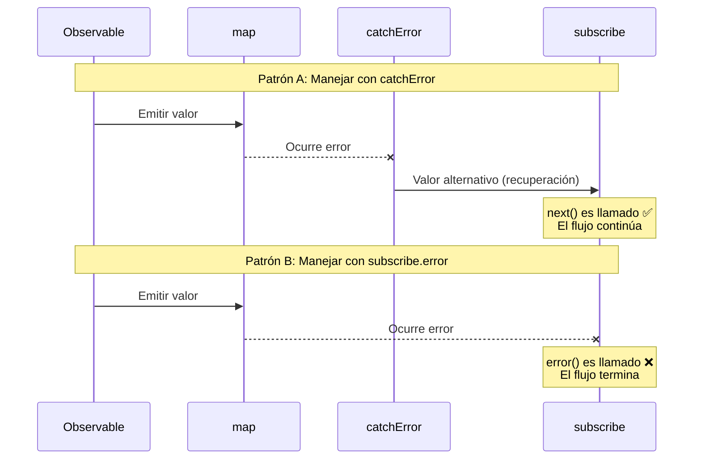
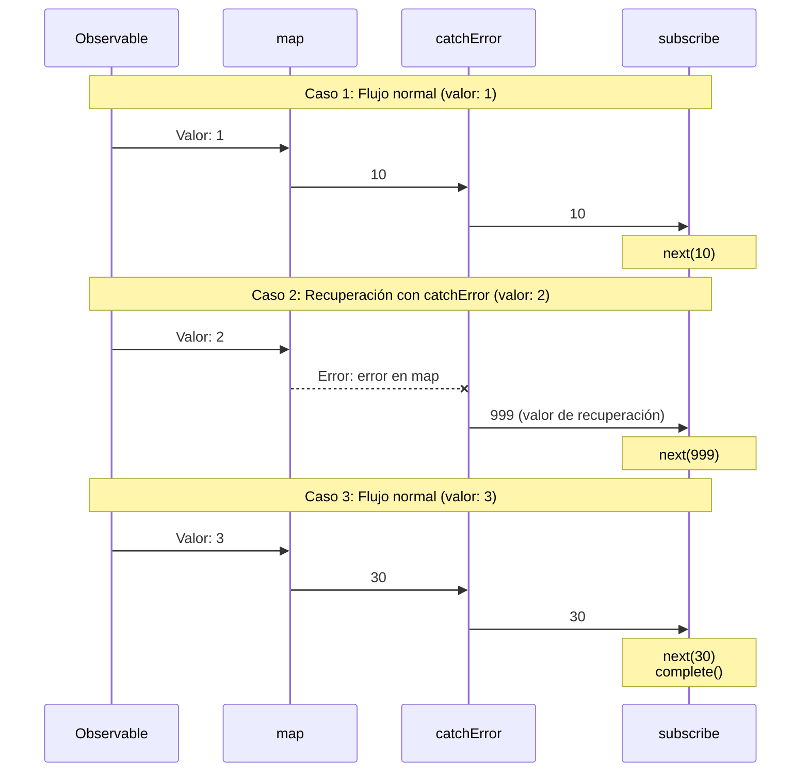
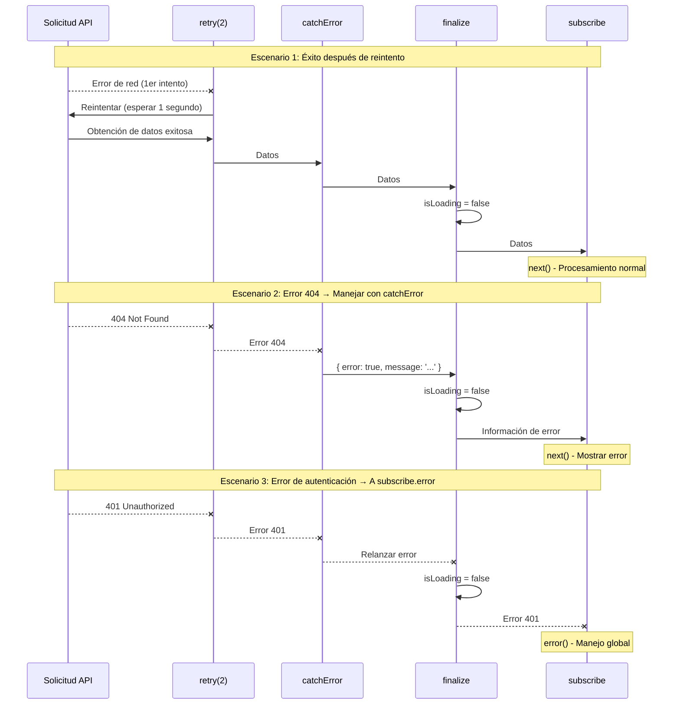
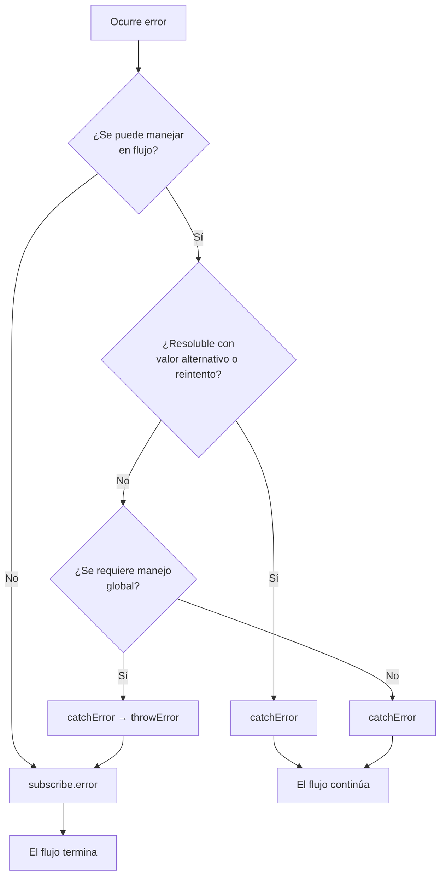

# Dos Lugares para el Manejo de Errores

Al manejar errores en RxJS, "dónde" capturar errores es una decisión de diseño importante. RxJS tiene dos lugares principales para el manejo de errores: el operador `catchError` en el pipeline y el callback `error` en el `subscribe` final. Esta página explica la diferencia entre los dos y el uso adecuado de ambos.

## Dos Lugares para el Manejo de Errores

Hay dos lugares principales para el manejo de errores en RxJS:

1. **En el pipeline** - `.pipe(catchError(...))`
2. **En la suscripción** - `subscribe({ error: ... })`

Entender esta diferencia le ayudará a construir una estrategia de manejo de errores robusta y mantenible.

## Tabla de Comparación: catchError vs subscribe.error

La siguiente tabla resume las diferencias clave entre los dos enfoques.

| Elemento | `.pipe(catchError(...))` | `subscribe({ error: ... })` |
|------|-------------------------|----------------------------|
| **Temporización de Procesamiento** | En pipeline (procesamiento intermedio) | Suscripción final (punto final) |
| **Tipo de Error** | Errores que ocurren en el flujo | Errores no capturados |
| **Uso Principal** | Recuperación de errores, conversión, reintento | Notificación final de error, registro |
| **Continuación del Flujo** | Puede continuar con Observable alternativo | El flujo termina (no más valores) |
| **Recuperabilidad** | ✅ Posible (valores alternativos o reintento) | ❌ No posible (terminación) |
| **Colocación Múltiple** | ✅ Posible (múltiple en pipeline) | ⚠️ Uno por subscribe |
| **Tipo de Retorno** | Debe retornar `Observable<T>` | `void` (no retorna nada) |

### Diagrama de Secuencia: Diferencia Entre catchError y subscribe.error

El siguiente diagrama ilustra visualmente la diferencia entre el manejo con `catchError` y el manejo con `subscribe.error`.



#### Puntos Importantes de Este Diagrama

**Patrón A (usando catchError):**
- Si ocurre un error, se llama a `next()` de `subscribe` porque `catchError` retorna un valor alternativo
- El flujo continúa y se pueden procesar valores posteriores
- Los errores son "recuperados" y devueltos al flujo normal

**Patrón B (usando subscribe.error):**
- Cuando el error llega a `subscribe`, se llama al callback `error()`
- El flujo se termina y no fluyen más valores
- "Notifica" el error y termina el flujo

## Comprender el Flujo de Errores

Veamos un ejemplo de código real para ver cómo fluyen los errores.

```typescript
import { of, map, catchError } from 'rxjs';
of(1, 2, 3).pipe(
  map(x => {
    if (x === 2) throw new Error('Error en map');  // ①
    return x * 10;
  }),
  catchError(err => {
    console.log('Capturado por catchError:', err.message);  // ②
    return of(999); // Recuperación
  })
).subscribe({
  next: val => console.log('Valor:', val),
  error: err => console.log('Capturado por subscribe.error:', err), // ③
  complete: () => console.log('Completado')
});

// Salida:
// Valor: 10
// Capturado por catchError: Error en map (← Procesado en ②)
// Valor: 999 (← Recuperación exitosa)
// Valor: 30
// Completado
```

En este ejemplo:
1. Ocurre un error en `map` (①)
2. `catchError` captura el error y lo recupera (②)
3. `subscribe.error` no se llama (porque el error fue manejado)

> [!TIP] Flujo de Errores
> Los errores manejados por `catchError` no llegan a `subscribe.error`. `catchError` tiene el papel de "manejar errores y retornar al flujo normal".

### Diagrama de Secuencia: Flujo de Errores (3 Casos)

El siguiente diagrama muestra cómo se propagan los errores en tres casos.



#### Como Puede Ver en Este Diagrama
- **Casos 1 y 3**: Cuando no hay errores, los valores fluyen en orden: `map` → `catchError` → `subscribe`
- **Caso 2**: Cuando ocurre un error en `map`, `catchError` lo captura y retorna valor de recuperación (999)
- Los errores manejados por `catchError` no llegan a `subscribe.error`

## Errores Capturados por catchError

El `catchError` en el pipeline puede capturar los siguientes tipos de errores:

| Fuente de Error | Ejemplo | Procesable por catchError |
|----------------|-----|---------------------|
| throw en operador | `map(x => { throw new Error() })` | ✅ |
| Errores HTTP | `ajax.get('/api').pipe(catchError(...))` | ✅ |
| Errores en switchMap | `switchMap(() => throwError(...))` | ✅ |
| Observable personalizado | `new Observable(sub => sub.error(...))` | ✅ |
| Promise reject | `from(Promise.reject(...))` | ✅ |

### Ejemplo: Procesamiento por Etapas de Errores de API

```typescript
import { of, throwError, catchError, switchMap } from 'rxjs';
import { ajax } from 'rxjs/ajax';

// Manejar errores de API con catchError
ajax.get('/api/user/123').pipe(
  catchError(err => {
    if (err.status === 404) {
      // Error 404 → retornar usuario predeterminado
      return of({ id: 123, name: 'Usuario Predeterminado' });
    }
    // Relanzar otros errores (a subscribe.error)
    return throwError(() => err);
  }),
  switchMap(user => {
    // Después de obtener usuario, obtener perfil
    return ajax.get(`/api/profile/${user.id}`);
  }),
  catchError(err => {
    console.log('Error al obtener perfil:', err);
    // Continuar sin perfil
    return of(null);
  })
).subscribe({
  next: profile => console.log('Perfil:', profile),
  error: err => console.log('Error final:', err) // Solo errores no manejados por catchError
});
```

> [!IMPORTANT] Colocar Múltiples Operadores catchError
> Al colocar múltiples operadores `catchError` en el pipeline, puede manejar errores en diferentes etapas individualmente. Esto permite un manejo de errores de grano fino.

## Errores Capturados por subscribe.error

El callback `error` de `subscribe` captura los siguientes errores:

| Tipo de Error | Descripción | Ejemplo |
|------------|------|-----|
| **No manejado por catchError** | Errores no manejados en pipeline | Error propagado tal cual |
| **Relanzado después de catchError** | Errores explícitamente relanzados en catchError | `catchError(e => throwError(() => e))` |

### Ejemplo: Procesamiento por Etapas de Errores y Relanzamiento

```typescript
import { of, throwError, map, catchError } from 'rxjs';
// Patrón 1: Error no manejado por catchError
throwError(() => new Error('Error no manejado')).subscribe({
  next: val => console.log('Valor:', val),
  error: err => console.log('subscribe.error:', err.message)
  // Salida: subscribe.error: Error no manejado
});

// Patrón 2: Relanzar en catchError
of(1).pipe(
  map(() => { throw new Error('Error en map'); }),
  catchError(err => {
    console.log('Capturado por catchError:', err.message);
    // Registrar, luego relanzar error
    return throwError(() => new Error('Error relanzado'));
  })
).subscribe({
  next: val => console.log('Valor:', val),
  error: err => console.log('subscribe.error:', err.message)
  // Salida:
  // Capturado por catchError: Error en map
  // subscribe.error: Error relanzado
});
```

> [!WARNING] Errores Dentro de subscribe
> `throw` dentro de los callbacks `next` o `complete` de `subscribe` **no se recomienda**. El manejo de errores siempre debe hacerse en el pipeline (`catchError`). Lanzar en subscribe puede llevar a comportamientos indefinidos.

## Criterios para Determinar el Uso

Cuál usar depende de "dónde desea manejar los errores".

### Casos en los que Debe Usarse catchError

Use `catchError` si se aplica alguna de las siguientes condiciones:

- ✅ **Desea completar el proceso en el flujo**
- ✅ **Se puede proporcionar un valor alternativo o datos de fallback**
- ✅ **Puede resolverse con reintentos**
- ✅ **Desea convertir errores y cambiar a otro Observable**
- ✅ **Desea continuar el procesamiento posterior**

#### Patrón 1: Formato Unificado para Casos de Éxito y Error

```typescript
import { of, throwError, catchError, map } from 'rxjs';
interface User {
  id: number;
  name: string;
}

interface ApiResult {
  success: boolean;
  data?: User[];
  error?: string;
}

// Simular llamada de API (ejemplo que genera error)
function fetchUsers(shouldFail: boolean) {
  if (shouldFail) {
    return throwError(() => new Error('Error de red'));
  }
  return of<User[]>([
    { id: 1, name: 'Taro Yamada' },
    { id: 2, name: 'Hanako Sato' }
  ]);
}

fetchUsers(true).pipe(
  // En éxito: convertir a { success: true, data: [...] }
  map(users => ({ success: true, data: users } as ApiResult)),
  // En error: convertir a { success: false, error: '...' }
  catchError(err => {
    return of<ApiResult>({
      success: false,
      error: 'Falló la obtención de usuario'
    });
  })
).subscribe(result => {
  // Manejar tanto éxito como error en el mismo formato
  if (result.success) {
    console.log('Usuario:', result.data);
  } else {
    console.log('Ocurrió un error:', result.error);
  }
});

// Salida: Ocurrió un error: Falló la obtención de usuario
```

#### Patrón 2: Simplemente Retornar Valor Predeterminado

```typescript
import { of, throwError, catchError } from 'rxjs';
interface User {
  id: number;
  name: string;
}

// Simular llamada de API (ejemplo que genera error)
function fetchUsers(shouldFail: boolean) {
  if (shouldFail) {
    return throwError(() => new Error('Error de red'));
  }
  return of<User[]>([
    { id: 1, name: 'Taro Yamada' },
    { id: 2, name: 'Hanako Sato' }
  ]);
}

fetchUsers(true).pipe(
  catchError(err => {
    console.error('Ha ocurrido un error:', err.message);
    // Retornar array vacío como valor predeterminado
    return of<User[]>([]);
  })
).subscribe(users => {
  if (users.length === 0) {
    console.log('No se encontraron usuarios');
  } else {
    console.log('Usuarios:', users);
  }
});

// Salida:
// Ha ocurrido un error: Error de red
// No se encontraron usuarios
```

### Casos Donde Debe Usarse subscribe.error

Use `subscribe.error` si se aplica alguna de las siguientes condiciones:

- ✅ **Desea usar un manejador de errores global**
- ✅ **Necesita procesamiento que afecte a toda la aplicación**
- ✅ **Deseo enviar registros de error al servidor**
- ✅ **Deseo terminar el flujo**
- ✅ **Manejo de errores como última línea de defensa**

```typescript
import { throwError, catchError, retry } from 'rxjs';
import { ajax } from 'rxjs/ajax';

ajax.getJSON('/api/critical-data').pipe(
  retry(2),
  catchError(err => {
    if (err.status === 401) {
      // Relanzar errores de autenticación (manejar globalmente)
      return throwError(() => err);
    }
    // Manejar otros
    return throwError(() => new Error('Falló la obtención de datos'));
  })
).subscribe({
  next: data => console.log('Datos:', data),
  error: err => {
    // Manejador de errores global
    globalErrorHandler.handle(err);
    // Navegar a página de error
    router.navigate(['/error']);
  }
});
```

## Patrón de Práctica: Manejo de Errores Jerárquico

En la práctica, el manejo de errores jerárquico que combina `catchError` y `subscribe.error` es efectivo.

```typescript
import { of, throwError, catchError, retry, finalize } from 'rxjs';
import { ajax } from 'rxjs/ajax';

function fetchUserData(userId: string) {
  let isLoading = true;

  return ajax.getJSON(`/api/users/${userId}`).pipe(
    // Nivel 1: Errores de red que se pueden reintentar
    retry({ count: 2, delay: 1000 }),

    // Nivel 2: Errores recuperables
    catchError((error) => {
      if (error.status === 404) {
        // 404 → continuar con datos predeterminados
        return of({
          error: true,
          message: 'Usuario no encontrado',
          data: null
        });
      } else if (error.status >= 500) {
        // 500s → continuar con mensaje de error
        return of({
          error: true,
          message: 'Ha ocurrido un error en el servidor',
          data: null
        });
      }
      // Relanzar otros errores (a subscribe.error)
      return throwError(() => error);
    }),

    // Nivel 3: Siempre ejecutar limpieza
    finalize(() => {
      isLoading = false;
      console.log('Carga completada');
    })
  );
}

// Ejemplo de uso
fetchUserData('123').subscribe({
  next: (result) => {
    if (result.error) {
      // Errores manejados por catchError (mostrar en UI)
      console.error('Error de usuario:', result.message);
      showUserFriendlyError(result.message);
    } else {
      // Datos normales
      console.log('Datos de usuario:', result.data);
      displayUserData(result.data);
    }
  },
  error: (err) => {
    // Errores fatales no manejados por catchError
    console.error('Error fatal:', err);
    // Notificar al manejador de errores global
    globalErrorHandler.handle(err);
    // Navegar a página de error
    navigateToErrorPage();
  },
  complete: () => console.log('Procesamiento completado')
});

// Funciones auxiliares
function showUserFriendlyError(message: string) {
  console.log('Mostrar error en UI:', message);
}
function displayUserData(data: any) {
  console.log('Mostrar datos en UI:', data);
}
function navigateToErrorPage() {
  console.log('Navegar a página de error');
}

// Manejador de errores global
const globalErrorHandler = {
  handle(err: any) {
    console.error('Error global:', err);
    // Enviar registro de error al servidor
    // sendErrorLog(err);
  }
};
```

> [!TIP] Beneficios del Manejo de Errores Jerárquico
> - **Nivel 1 (retry)**: Recuperarse automáticamente de errores de red temporales
> - **Nivel 2 (catchError)**: Proporcionar mensajes de error amigables para el usuario
> - **Nivel 3 (subscribe.error)**: Manejar errores inesperados como última línea de defensa
> - **finalize**: Siempre limpiar recursos

### Diagrama de Secuencia: Flujo de Manejo de Errores Jerárquico

El siguiente diagrama muestra el flujo de manejo de errores jerárquico: retry → catchError → finalize → subscribe.



#### Como Puede Ver en Este Diagrama
- **Escenario 1**: Los errores temporales se recuperan con `retry` y los datos se obtienen normalmente
- **Escenario 2**: Los errores 404 son capturados por `catchError` y convertidos a mensajes amigables para el usuario
- **Escenario 3**: Los errores de autenticación se relanzan con `catchError` y se gestionan centralmente con `subscribe.error`
- **Todos los escenarios**: `finalize` siempre se ejecuta para restablecer el estado de carga

## Guía de Selección Basada en Escenarios

Directrices sobre cuál usar para escenarios reales.

| Escenario | Recomendado | Razón |
|---------|------|------|
| 404 Not Found → Mostrar valor predeterminado | `catchError` | Puede retornar valor alternativo en flujo |
| Error de red temporal → Reintentar | `catchError` | Continuar procesamiento después de reintento |
| Error de autenticación (401) → Pantalla de inicio de sesión | Ambos posibles | Redirigir con catchError o centralizar con subscribe.error |
| Error 500 del servidor → Página de error | Ambos posibles | catchError para reintento, subscribe.error para terminación inmediata |
| Error de validación → Mostrar en formulario | `catchError` | Pasar información de error a UI para mostrar |
| Error inesperado → Enviar registro | `subscribe.error` | Registrar como última línea de defensa |

### Ejemplo Flexible de Manejo de Errores de Autenticación

Los errores de autenticación (401) pueden usar ambos enfoques dependiendo del diseño.

```typescript
import { throwError, EMPTY, catchError } from 'rxjs';
import { ajax } from 'rxjs/ajax';

// Enfoque 1: Redirigir con catchError (completar en flujo)
ajax.getJSON('/api/protected-data').pipe(
  catchError(err => {
    if (err.status === 401) {
      // Manejar error de autenticación con catchError
      router.navigate(['/login']);
      return EMPTY; // Flujo vacío y completar
    }
    return throwError(() => err);
  })
).subscribe({
  next: data => console.log('Datos:', data)
});

// Enfoque 2: Centralizar con subscribe.error
ajax.getJSON('/api/protected-data').pipe(
  catchError(err => {
    // Relanzar errores de autenticación (manejar globalmente)
    if (err.status === 401) {
      return throwError(() => err);
    }
    // Manejar otros
    return throwError(() => err);
  })
).subscribe({
  next: data => console.log('Datos:', data),
  error: err => {
    if (err.status === 401) {
      // Manejador de autenticación global
      authService.handleUnauthorized();
    }
  }
});
```

> [!NOTE] Opciones de Diseño
> Para errores a nivel de aplicación como errores de autenticación, decida la ubicación de manejo según la política de diseño del proyecto.
> - **Procesamiento distribuido**: Manejar individualmente en cada llamada de API (catchError)
> - **Gestión centralizada**: Manejo unificado con manejador de errores global (subscribe.error)

## Diagrama de Flujo: Selección de Manejo de Errores



## Mejores Prácticas

### 1. Capturar Errores Temprano, Relanzar Tarde

```typescript
import { throwError, catchError, map } from 'rxjs';
import { ajax } from 'rxjs/ajax';

ajax.getJSON('/api/data').pipe(
  // Capturar temprano
  catchError(err => {
    console.log('Registrar error:', err);
    // Relanzar si no se puede manejar
    return throwError(() => err);
  }),
  map(data => transformData(data)),
  // Capturar errores de transformación también
  catchError(err => {
    console.log('Error de transformación:', err);
    return throwError(() => err);
  })
).subscribe({
  next: data => console.log('Datos:', data),
  error: err => {
    // Manejador de errores final
    globalErrorHandler.handle(err);
  }
});

function transformData(data: any) {
  return data;
}
```

### 2. Distinguir Claramente los Tipos de Error

```typescript
import { of, throwError, catchError } from 'rxjs';
import { ajax } from 'rxjs/ajax';

// Tipos de error personalizados
class RecoverableError extends Error {
  constructor(message: string) {
    super(message);
    this.name = 'RecoverableError';
  }
}

class FatalError extends Error {
  constructor(message: string) {
    super(message);
    this.name = 'FatalError';
  }
}

ajax.getJSON('/api/data').pipe(
  catchError(err => {
    if (err.status === 404 || err.status === 500) {
      // Recuperable
      return throwError(() => new RecoverableError(err.message));
    }
    // Error fatal
    return throwError(() => new FatalError(err.message));
  })
).subscribe({
  next: data => console.log('Datos:', data),
  error: err => {
    if (err instanceof RecoverableError) {
      // Procesamiento de recuperación
      console.log('Error recuperable:', err.message);
    } else if (err instanceof FatalError) {
      // Procesamiento de error fatal
      console.error('Error fatal:', err.message);
    }
  }
});
```

### 3. Asegurar la Limpieza con finalize

```typescript
import { of, catchError, finalize } from 'rxjs';
import { ajax } from 'rxjs/ajax';

let isLoading = true;
let resourceHandle: any = null;

ajax.getJSON('/api/data').pipe(
  catchError(err => {
    console.log('Manejo de errores:', err);
    return of(null);
  }),
  finalize(() => {
    // Siempre ejecutado independientemente del éxito o fracaso
    isLoading = false;
    if (resourceHandle) {
      resourceHandle.release();
      resourceHandle = null;
    }
    console.log('Limpieza completa');
  })
).subscribe({
  next: data => console.log('Datos:', data),
  error: err => console.error('Error:', err)
});
```

## Preguntas Frecuentes

::: info **P: ¿Necesito escribir tanto catchError como subscribe.error?**
R: Sí, se recomienda escribir ambos.
`catchError` maneja "errores manejables",
`subscribe.error` actúa como "última línea de defensa para errores inesperados".
:::

::: info **P: ¿Si hago throwError() en catchError, a dónde va?**
R: Si hay un `catchError` posterior, será capturado allí; de lo contrario, llega a `subscribe.error`.
:::

::: info **P: ¿Puedo colocar múltiples operadores catchError?**
R: Sí, puede colocar múltiples en el pipeline. Se pueden manejar diferentes errores en cada etapa.
:::

::: info **P: ¿Qué sucede si omito subscribe.error?**
R: Si ocurre un error, se mostrará `"Unhandled error"` en la consola y la aplicación puede comportarse de manera inesperada. Se recomienda escribirlo siempre.
:::

::: info **P: ¿Qué sucede si catchError retorna EMPTY?**
R: El flujo se completa inmediatamente. Se llama a `complete()` sin emitir valores. Use cuando desee ignorar errores.
```typescript
import { EMPTY, catchError } from 'rxjs';
source$.pipe(
  catchError(() => EMPTY) // Ignorar error y completar
).subscribe({
  next: val => console.log(val),
  complete: () => console.log('Completado') // Esto es llamado
});
```
:::

::: info **P: ¿El flujo siempre termina si ocurre un error?**
R: No. Si se maneja con `catchError`, el flujo continúa. Solo termina cuando llega a `subscribe.error`.
:::

::: info **P: ¿Debe colocarse finalize antes o después de catchError?**
R: Normalmente **después de catchError**. Esto asegura que la limpieza se ejecute incluso después del manejo de errores.
```typescript
source$.pipe(
  retry(2),
  catchError(err => of(defaultValue)),
  finalize(() => cleanup()) // Después de catchError
)
```
:::

::: info **P: ¿Cuál es la diferencia entre catchError y try-catch?**
R: `try-catch` captura solo **errores síncronos**, pero `catchError` captura todos los errores en el flujo, incluidos **errores asíncronos** (solicitudes HTTP, temporizadores, etc.).
:::

## Resumen

Comprender los dos lugares en el manejo de errores de RxJS le ayudará a construir una estrategia efectiva de manejo de errores.

### Puntos Clave

- **catchError**: Recupera errores en el flujo y continúa el procesamiento
- **subscribe.error**: Captura errores no manejados como última línea de defensa
- **Procesamiento jerárquico**: La combinación retry → catchError → finalize → subscribe.error es efectiva
- **Demarcación clara**: Determinar si se puede completar en el flujo

> [!IMPORTANT] Principios de Diseño de Manejo de Errores
> 1. **Capturar errores temprano, relanzar según sea necesario**
> 2. **Manejar errores recuperables con catchError**
> 3. **Manejar errores a nivel de aplicación con subscribe.error**
> 4. **Asegurar la limpieza de recursos con finalize**
> 5. **Distinguir claramente y manejar tipos de error**

## Secciones Relacionadas

- **[Estrategias de Manejo de Errores](/es/guide/error-handling/strategies)** - Estrategias integrales de manejo de errores en RxJS
- **[retry y catchError](/es/guide/error-handling/retry-catch)** - Detalles sobre reintento y captura de errores
- **[finalize y complete](/es/guide/error-handling/finalize)** - Liberación de recursos y procesamiento de finalización de flujo
- **[Errores Comunes y Soluciones](/es/guide/anti-patterns/common-mistakes#9-error-suppression)** - Anti-patrones de manejo de errores

## Recursos de Referencia

- [Documentación Oficial de RxJS - catchError](https://rxjs.dev/api/index/function/catchError)
- [Documentación Oficial de RxJS - retry](https://rxjs.dev/api/index/function/retry)
- [Learn RxJS - Error Handling](https://www.learnrxjs.io/learn-rxjs/operators/error_handling)
