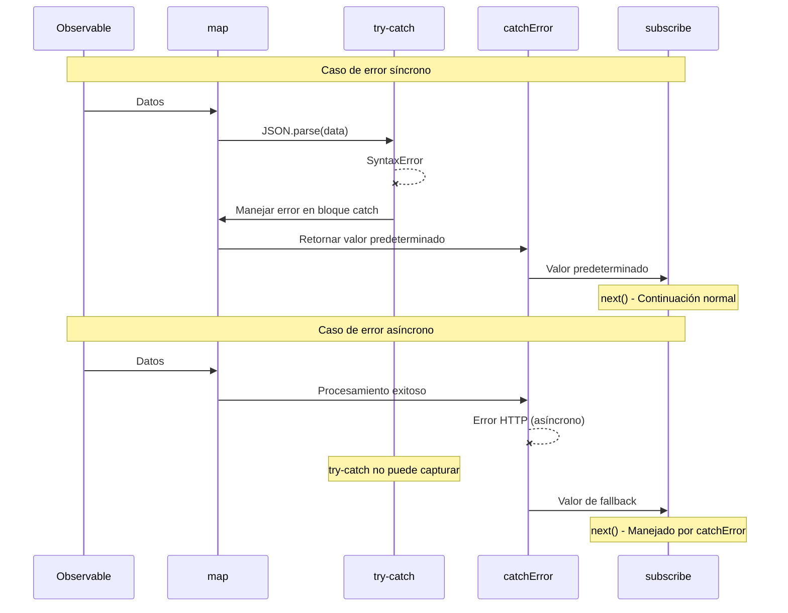

# Integración de try-catch y RxJS

JavaScript tiene `try-catch` como su manejo de errores estándar, mientras que RxJS tiene sus propios mecanismos de manejo de errores como `catchError` y `subscribe.error`. Esta página explica la diferencia entre ellos y cómo usarlos juntos apropiadamente.

## try-catch vs Manejo de Errores de RxJS

### Diferencias Básicas

| Elemento | try-catch | catchError / subscribe.error |
|------|-----------|------------------------------|
| **Se Aplica A** | Código síncrono | Flujos asíncronos |
| **Tipo de Error** | Excepciones de JavaScript | Todos los errores en Observable |
| **Alcance** | Solo dentro del bloque try-catch | Pipeline completo |
| **Soporte Asíncrono** | ❌ No puede capturar errores asíncronos | ✅ Puede capturar errores asíncronos |
| **Continuación del Flujo** | - | ✅ Puede continuar con catchError |

### Errores Que try-catch No Puede Capturar

Errores asíncronos como los siguientes no pueden ser capturados por `try-catch`.

```typescript
import { timer, throwError, mergeMap, catchError } from 'rxjs';
// ❌ try-catch no puede capturar errores asíncronos
try {
  setTimeout(() => {
    throw new Error('Error asíncrono');
  }, 1000);
} catch (error) {
  // Esto no se ejecutará
  console.error('Capturado:', error);
}

// ✅ RxJS puede capturar errores asíncronos

timer(1000).pipe(
  mergeMap(() => throwError(() => new Error('Error asíncrono'))),
  catchError(error => {
    console.error('Capturado:', error.message); // ✅ Ejecutado
    return of('Valor predeterminado');
  })
).subscribe();
```

> [!IMPORTANT] Limitaciones de try-catch
> `try-catch` solo se dirige a **código síncrono**. No puede capturar errores que ocurren en procesamiento asíncrono como setTimeout, solicitudes HTTP, Promises, Observables, etc.

## Casos Donde Debe Usarse try-catch

Incluso si usa RxJS, necesita usar `try-catch` en los siguientes casos.

### 1. Manejo de Errores Durante la Limpieza de Recursos

Use `try-catch` para capturar errores al liberar recursos en `finalize` o `using`.

```typescript
import { interval, take, finalize } from 'rxjs';
let ws: WebSocket | null = null;

interval(1000).pipe(
  take(5),
  finalize(() => {
    // Manejar errores durante la liberación de recursos con try-catch
    try {
      if (ws) {
        ws.close();
        console.log('WebSocket cerrado exitosamente');
      }
    } catch (error) {
      // Continuar aplicación incluso si close falla
      console.error('Error al cerrar WebSocket:', error);
    }
  })
).subscribe({
  next: val => console.log('Valor:', val)
});
```

**Razón**: En muchos casos, desea continuar la aplicación incluso si el proceso de liberación de recursos en sí falla.

### 2. Manejo de Errores Síncronos en Observable Personalizado

Al convertir errores síncronos a errores de RxJS dentro de `new Observable()`.

```typescript
import { Observable } from 'rxjs';

interface User {
  id: number;
  name: string;
}

function parseUserData(json: string): Observable<User> {
  return new Observable<User>(subscriber => {
    try {
      // JSON.parse es síncrono, así que capturar con try-catch
      const data = JSON.parse(json);

      // Validación
      if (!data.id || !data.name) {
        throw new Error('Datos de usuario inválidos');
      }

      subscriber.next(data);
      subscriber.complete();
    } catch (error) {
      // Convertir error síncrono a error de RxJS
      subscriber.error(error);
    }
  });
}

// Ejemplo de uso
parseUserData('{"id": 1, "name": "Taro"}').subscribe({
  next: user => console.log('Usuario:', user),
  error: err => console.error('Error:', err.message)
});

// JSON inválido
parseUserData('invalid json').subscribe({
  next: user => console.log('Usuario:', user),
  error: err => console.error('Error:', err.message) // Capturar error de JSON.parse
});
```

**Razón**: Para propagar errores que ocurren en procesamiento síncrono (JSON.parse, validación, etc.) como errores de Observable.

### 3. Interfaz con Bibliotecas Externas

Manejo de errores al usar bibliotecas externas que no usan RxJS.

```typescript
import { of, map, catchError } from 'rxjs';
// Biblioteca externa (por ejemplo, biblioteca de procesamiento de imágenes)
declare const ExternalImageLib: {
  process(data: string): string;
};

of('image-data-1', 'image-data-2', 'invalid-data').pipe(
  map(imageData => {
    try {
      // La biblioteca externa puede lanzar excepciones
      const processed = ExternalImageLib.process(imageData);
      return { success: true, data: processed };
    } catch (error) {
      // Capturar error síncrono y retornar como valor con información de error
      console.error('Error en procesamiento de imagen:', error);
      return { success: false, error: (error as Error).message };
    }
  })
).subscribe({
  next: result => {
    if (result.success) {
      console.log('Procesamiento exitoso:', result.data);
    } else {
      console.log('Procesamiento fallido:', result.error);
    }
  }
});
```

**Razón**: Para manejar de manera segura errores de bibliotecas externas dentro del flujo y continuar el flujo.

### 4. Procesamiento Síncrono Dentro de Operadores

Al realizar procesamiento síncrono dentro de operadores como `map` y `tap`.

```typescript
import { of, map } from 'rxjs';
interface Config {
  apiUrl: string;
  timeout: number;
}

of('{"apiUrl": "https://api.example.com", "timeout": 5000}').pipe(
  map(jsonString => {
    try {
      const config: Config = JSON.parse(jsonString);

      // Validar valores de configuración
      if (config.timeout < 0) {
        throw new Error('El timeout debe ser un número positivo');
      }

      return config;
    } catch (error) {
      console.error('Error al analizar configuración:', error);
      // Retornar configuración predeterminada
      return { apiUrl: 'https://default.example.com', timeout: 3000 };
    }
  })
).subscribe({
  next: config => console.log('Configuración:', config)
});
```

**Razón**: Para manejar errores síncronos dentro de operadores y retornar valores predeterminados sin interrumpir el flujo.

## Patrones Combinados Prácticos

### Patrón 1: Manejo de Errores Jerárquico

Un enfoque jerárquico donde los errores síncronos son manejados por `try-catch` y los errores asíncronos son manejados por `catchError`.

```typescript
import { of, map, catchError, finalize } from 'rxjs';
import { ajax } from 'rxjs/ajax';

interface ApiResponse {
  data: string;
  timestamp: number;
}

let connection: any = null;

ajax.getJSON<ApiResponse>('https://api.example.com/data').pipe(
  // Nivel 1: Manejar errores de procesamiento síncrono con try-catch
  map(response => {
    try {
      // Transformación de datos (procesamiento síncrono)
      const decoded = atob(response.data);
      return { decoded, timestamp: response.timestamp };
    } catch (error) {
      console.error('Error de decodificación:', error);
      throw new Error('Falló la transformación de datos');
    }
  }),
  // Nivel 2: Manejar errores asíncronos con catchError
  catchError(error => {
    console.error('Error en llamada de API:', error);
    return of({ decoded: '', timestamp: Date.now() });
  }),
  // Nivel 3: Proteger limpieza de recursos con try-catch
  finalize(() => {
    try {
      if (connection) {
        connection.close();
        console.log('Conexión cerrada');
      }
    } catch (error) {
      console.error('Error al cerrar:', error);
    }
  })
).subscribe({
  next: result => console.log('Resultado:', result),
  error: err => console.error('Error final:', err)
});
```

### Patrón 2: Gestión de Recursos con using()

```typescript
import { using, interval, take } from 'rxjs';
interface ManagedResource {
  id: string;
  close: () => void;
}

function createManagedStream(resource: ManagedResource) {
  return using(
    // Fábrica de recursos
    () => {
      console.log('Recurso creado:', resource.id);

      return {
        unsubscribe: () => {
          // Manejar errores durante la liberación de recursos con try-catch
          try {
            resource.close();
            console.log('Recurso liberado exitosamente:', resource.id);
          } catch (error) {
            console.error('Error en liberación de recurso:', resource.id, error);
            // Continuar aplicación incluso si ocurre error
          }
        }
      };
    },
    // Fábrica de Observable
    () => interval(1000).pipe(take(3))
  );
}

// Ejemplo de uso
const resource: ManagedResource = {
  id: 'resource-1',
  close: () => {
    // El proceso de cierre puede fallar
    if (Math.random() > 0.5) {
      throw new Error('Cierre falló');
    }
  }
};

createManagedStream(resource).subscribe({
  next: val => console.log('Valor:', val),
  complete: () => console.log('Completado')
});
```

### Patrón 3: Transformación de Errores Personalizada

Convertir errores de API externa a errores específicos de aplicación.

```typescript
import { Observable, throwError, catchError, map } from 'rxjs';
import { ajax } from 'rxjs/ajax';

// Clases de error personalizadas
class ValidationError extends Error {
  constructor(message: string, public field: string) {
    super(message);
    this.name = 'ValidationError';
  }
}

class NetworkError extends Error {
  constructor(message: string, public statusCode: number) {
    super(message);
    this.name = 'NetworkError';
  }
}

interface UserData {
  email: string;
  age: number;
}

function validateAndFetchUser(userId: string): Observable<UserData> {
  return ajax.getJSON<UserData>(`https://api.example.com/users/${userId}`).pipe(
    map(user => {
      try {
        // Validación síncrona
        if (!user.email || !user.email.includes('@')) {
          throw new ValidationError('Dirección de correo electrónico inválida', 'email');
        }
        if (user.age < 0 || user.age > 150) {
          throw new ValidationError('Edad inválida', 'age');
        }
        return user;
      } catch (error) {
        if (error instanceof ValidationError) {
          // Relanzar error de validación como error de RxJS
          throw error;
        }
        throw new Error('Error en validación de datos');
      }
    }),
    catchError(error => {
      // Manejar errores asíncronos (errores HTTP, etc.)
      if (error.status) {
        const networkError = new NetworkError(
          `HTTP ${error.status}: ${error.message}`,
          error.status
        );
        return throwError(() => networkError);
      }
      return throwError(() => error);
    })
  );
}

// Ejemplo de uso
validateAndFetchUser('123').subscribe({
  next: user => console.log('Usuario:', user),
  error: err => {
    if (err instanceof ValidationError) {
      console.error(`Error de validación (${err.field}):`, err.message);
    } else if (err instanceof NetworkError) {
      console.error(`Error de red (${err.statusCode}):`, err.message);
    } else {
      console.error('Error inesperado:', err);
    }
  }
});
```

## Diagrama de Secuencia: Operación Cooperativa de try-catch y catchError



#### Como Puede Ver en Este Diagrama
- **Errores síncronos**: Capturados por `try-catch` → Manejados → El flujo continúa
- **Errores asíncronos**: Saltar `try-catch` → Capturados por `catchError`

## Anti-patrones

### ❌ Anti-patrón 1: Intentar Capturar Errores Asíncronos con try-catch

```typescript
// ❌ Mal ejemplo: Los errores asíncronos no pueden ser capturados
import { ajax } from 'rxjs/ajax';

try {
  ajax.getJSON('https://api.example.com/data').subscribe({
    next: data => console.log(data)
  });
} catch (error) {
  // Los errores HTTP no se capturan aquí
  console.error('Error:', error);
}
```

```typescript
import { of, catchError } from 'rxjs';
// ✅ Buen ejemplo: Manejar con catchError o subscribe.error
import { ajax } from 'rxjs/ajax';

ajax.getJSON('https://api.example.com/data').pipe(
  catchError(error => {
    console.error('Error HTTP:', error);
    return of(null);
  })
).subscribe({
  next: data => console.log(data)
});
```

### ❌ Anti-patrón 2: Silenciar Errores con try-catch

```typescript
import { of, map } from 'rxjs';
// ❌ Mal ejemplo: Solo registrar error y silenciarlo

of('invalid-json').pipe(
  map(json => {
    try {
      return JSON.parse(json);
    } catch (error) {
      console.error('Error:', error);
      return null; // Se pierde información de error
    }
  })
).subscribe({
  next: data => {
    // No se notará que data es null
    console.log(data);
  }
});
```

```typescript
import { of, map } from 'rxjs';
// ✅ Buen ejemplo: Preservar información de error

interface ParseResult {
  success: boolean;
  data?: any;
  error?: string;
}

of('invalid-json').pipe(
  map(json => {
    try {
      const data = JSON.parse(json);
      return { success: true, data } as ParseResult;
    } catch (error) {
      return {
        success: false,
        error: (error as Error).message
      } as ParseResult;
    }
  })
).subscribe({
  next: result => {
    if (result.success) {
      console.log('Datos:', result.data);
    } else {
      console.error('Error de análisis:', result.error);
    }
  }
});
```

### ❌ Anti-patrón 3: Uso Excesivo de try-catch Innecesario

```typescript
import { of, map } from 'rxjs';
// ❌ Mal ejemplo: Envolver errores que RxJS puede manejar con try-catch

of(1, 2, 3).pipe(
  map(x => {
    try {
      return x * 10;
    } catch (error) {
      // Este código no lanza errores, así que es innecesario
      return 0;
    }
  })
).subscribe();
```

```typescript
import { of, map } from 'rxjs';
// ✅ Buen ejemplo: Usar try-catch solo donde sea necesario

of('{"value": 1}', 'invalid', '{"value": 2}').pipe(
  map(json => {
    try {
      // JSON.parse puede lanzar excepciones, así que try-catch es necesario
      return JSON.parse(json);
    } catch (error) {
      console.error('Error de análisis JSON:', error);
      return { value: 0 };
    }
  })
).subscribe({
  next: data => console.log('Datos:', data)
});
```

## Mejores Prácticas

### 1. Usar Diferentes Enfoques Basados en el Tipo de Error

```typescript
import { of, map, catchError, finalize } from 'rxjs';
import { ajax } from 'rxjs/ajax';

// Distinción clara de uso
ajax.getJSON<{ data: string }>('https://api.example.com/data').pipe(
  // Errores de procesamiento síncrono → try-catch
  map(response => {
    try {
      return JSON.parse(response.data);
    } catch (error) {
      console.error('Error de análisis:', error);
      return {};
    }
  }),
  // Errores asíncronos → catchError
  catchError(error => {
    console.error('Error de API:', error);
    return of({});
  }),
  // Errores durante la limpieza → try-catch
  finalize(() => {
    try {
      // Procesamiento de liberación de recursos
    } catch (error) {
      console.error('Error de limpieza:', error);
    }
  })
).subscribe();
```

### 2. Preservar Información de Error

```typescript
import { of, map } from 'rxjs';
interface Result<T> {
  success: boolean;
  value?: T;
  error?: string;
}

function safeParse<T>(json: string): Result<T> {
  try {
    const value = JSON.parse(json);
    return { success: true, value };
  } catch (error) {
    return {
      success: false,
      error: error instanceof Error ? error.message : String(error)
    };
  }
}

of('{"name": "Taro"}', 'invalid').pipe(
  map(json => safeParse(json))
).subscribe({
  next: result => {
    if (result.success) {
      console.log('Éxito:', result.value);
    } else {
      console.error('Fallido:', result.error);
    }
  }
});
```

### 3. Proporcionar Información Detallada con Errores Personalizados

```typescript
import { of, map } from 'rxjs';
// Clase de error personalizada
class DataProcessingError extends Error {
  constructor(
    message: string,
    public readonly data: unknown,
    public readonly step: string
  ) {
    super(message);
    this.name = 'DataProcessingError';
  }
}


of({ raw: 'some-data' }).pipe(
  map(input => {
    try {
      // Procesamiento complejo
      const processed = processData(input.raw);
      return processed;
    } catch (error) {
      throw new DataProcessingError(
        'Falló el procesamiento de datos',
        input,
        'processing'
      );
    }
  })
).subscribe({
  next: data => console.log('Procesado:', data),
  error: (err: DataProcessingError) => {
    console.error(`Error (${err.step}):`, err.message);
    console.error('Datos de entrada:', err.data);
  }
});

function processData(raw: string): any {
  return raw;
}
```

### 4. Registro y Monitoreo

```typescript
import { of, map, catchError, tap } from 'rxjs';
import { ajax } from 'rxjs/ajax';

// Función de monitoreo de errores
function logError(context: string, error: Error): void {
  console.error(`[${context}]`, error.message);
  // Enviar al servicio de monitoreo de errores en producción
  // errorMonitoringService.captureException(error, { context });
}

ajax.getJSON('https://api.example.com/data').pipe(
  tap(data => console.log('Recibido:', data)),
  map(data => {
    try {
      // Transformación de datos
      return transformData(data);
    } catch (error) {
      logError('Transformación de Datos', error as Error);
      throw error; // Propagar a catchError
    }
  }),
  catchError(error => {
    logError('Solicitud de API', error);
    return of(null);
  })
).subscribe();

function transformData(data: any): any {
  return data;
}
```

## Preguntas Frecuentes

::: info **P: ¿Necesito usar tanto try-catch como catchError?**
R: Sí, necesita usarlos por separado.
- **try-catch**: Errores de procesamiento síncrono (JSON.parse, validación, etc.)
- **catchError**: Errores asíncronos (HTTP, temporizadores, Promises, etc.)
:::

::: info **P: ¿Es mejor lanzar en map o manejar con try-catch?**
R: Depende de la situación.
- **throw**: Cuando desea propagar errores a todo el flujo
- **Manejar con try-catch**: Cuando desea recuperarse en el lugar y continuar el flujo
```typescript
// Ejemplo de lanzar
map(x => {
  if (x < 0) throw new Error('Número negativo');
  return x;
})

// Ejemplo de manejar con try-catch
map(x => {
  try {
    return riskyOperation(x);
  } catch (error) {
    return defaultValue; // Recuperarse en el lugar
  }
})
```
:::

::: info **P: ¿Qué sucede si ocurre un error en finalize?**
R: Si ocurre un error en `finalize`, el error no se propaga a `subscribe.error` y se muestra como `Uncaught Error` en la consola. Por lo tanto, siempre debe capturar errores con `try-catch` en `finalize`.
:::

::: info **P: ¿Puedo usar la combinación de async/await y try-catch?**
R: Sí, es efectivo al tratar con Promises.
```typescript
import { from, mergeMap } from 'rxjs';
async function fetchData(id: string): Promise<any> {
  try {
    const response = await fetch(`/api/data/${id}`);
    return await response.json();
  } catch (error) {
    console.error('Error de obtención:', error);
    throw error;
  }
}

from([1, 2, 3]).pipe(
  mergeMap(id => from(fetchData(String(id))))
).subscribe({
  next: data => console.log('Datos:', data),
  error: err => console.error('Error:', err)
});
```
:::

::: info **P: ¿Debo llamar a subscriber.error() o lanzar en un Observable personalizado?**
R: Dentro de `new Observable()`, **use subscriber.error()**.
```typescript
// ✅ Correcto
new Observable(subscriber => {
  try {
    const data = riskyOperation();
    subscriber.next(data);
  } catch (error) {
    subscriber.error(error); // Propagar como error de RxJS
  }
})

// ❌ Incorrecto (lanzar en el constructor de Observable puede llevar a comportamientos inesperados)
new Observable(subscriber => {
  const data = riskyOperation(); // El error puede no ser capturado
  subscriber.next(data);
})
```
:::

## Resumen

`try-catch` y el manejo de errores de RxJS tienen roles diferentes, y usarlos juntos permite un manejo robusto de errores.

### Principios de Uso

| Escenario | Recomendado | Razón |
|---------|------|------|
| Procesamiento síncrono (JSON.parse, validación) | try-catch | Capturar errores síncronos inmediatamente |
| Procesamiento asíncrono (HTTP, temporizadores) | catchError | Capturar errores asíncronos |
| Liberación de recursos (finalize, using) | try-catch | Manejar de manera segura fallos de liberación |
| Dentro de Observable personalizado | try-catch + subscriber.error() | Convertir errores síncronos a errores de RxJS |
| Integración con biblioteca externa | try-catch | Manejar de manera segura errores de biblioteca |

> [!IMPORTANT] Principios Importantes
> 1. **El procesamiento síncrono usa try-catch, el procesamiento asíncrono usa catchError/subscribe.error**
> 2. **Siempre capturar errores con try-catch en finalize**
> 3. **No silenciar información de error, propagar o registrar apropiadamente**
> 4. **Proporcionar información detallada con clases de error personalizadas**
> 5. **No usar try-catch innecesario (el código se vuelve complejo)**

## Secciones Relacionadas

- **[Dos Lugares para el Manejo de Errores](/es/guide/error-handling/error-handling-locations)** - Diferencia entre catchError y subscribe.error
- **[Estrategias de Manejo de Errores](/es/guide/error-handling/strategies)** - Estrategias integrales de manejo de errores en RxJS
- **[using()](/es/guide/creation-functions/control/using)** - Ejemplo de uso de gestión de recursos con try-catch
- **[finalize y complete](/es/guide/error-handling/finalize)** - Manejo de errores durante la liberación de recursos

## Recursos de Referencia

- [Documentación Oficial de RxJS - catchError](https://rxjs.dev/api/index/function/catchError)
- [MDN - try...catch](https://developer.mozilla.org/es/docs/Web/JavaScript/Reference/Statements/try...catch)
- [Documentación Oficial de RxJS - Error Handling](https://rxjs.dev/guide/error-handling)
