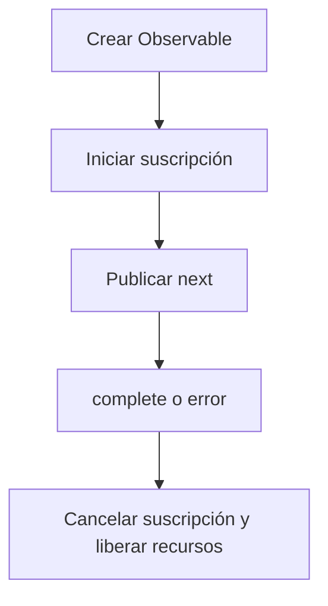

# Ciclo de Vida de Observable

Esta sección proporciona una descripción paso a paso del ciclo de vida de Observable en RxJS, desde la creación, suscripción, publicación de datos, notificación de finalización y error, cancelación de suscripción y gestión de recursos.
Entender este ciclo de vida es la base para el uso efectivo de RxJS.

## Descripción General del Ciclo de Vida de Observable

El ciclo de vida de Observable se refiere a la secuencia de cómo se crea un Observable, cuándo publica datos, cómo se termina o notifica de errores, y finalmente cuándo se liberan recursos. Al entender esto, es posible entender correctamente el comportamiento de RxJS, cancelar suscripción en el momento previsto, controlar efectos secundarios y manejar errores apropiadamente.

### 🔄 Diagrama del Ciclo de Vida de Observable (Transiciones de Estado)



## Estructura del Ciclo de Vida de Observable

El ciclo de vida de Observable consiste en las siguientes fases:

| Orden | Fase | Contenido |
|---|---|---|
| 1 | Creación | Crear una instancia de Observable |
| 2 | Suscripción | Iniciar suscripción con el método `subscribe()` |
| 3 | Ejecución | <li>`next()`: Publicar datos</li><li>`error()`: Notificación de error</li><li>`complete()`: Notificación de finalización</li> |
| 4 | Disposición | Cancelación de suscripción con el método `unsubscribe()` |

Observable es "perezoso", lo que significa que no se emite ningún flujo hasta que se llame a `subscribe()`. Además, el flujo termina cuando se llama a `complete()` o `error()`, y cualquier llamada posterior a `next()` se ignora.

> [!CAUTION]
> No se realiza ningún "procesamiento" de ningún tipo directamente por `subscribe()`.
> La expresión "No se ejecutará hasta que llame a `subscribe()`" se usa a menudo,
> pero para ser precisos, "la lógica interna de Observable (proceso de notificación)" se activa por primera vez mediante `subscribe()`.
>
> Los operadores como `pipe()` solo construyen la cadena de evaluación; la ejecución es iniciada por los callbacks de Observer.

### Ejemplo de Ciclo de Vida de Observable

```ts
import { Observable } from 'rxjs';

// 1. Creación de Observable
const observable$ = new Observable<number>(subscriber => {
  console.log('Ejecución de Observable iniciada');

  // 3. Ejecución: Publicación de datos
  subscriber.next(1);
  subscriber.next(2);

  // Configuración de temporizador
  const timerId = setTimeout(() => {
    subscriber.next(3);
    subscriber.complete(); // 3. Ejecución: Notificación de finalización
    console.log('Observable completado');
  }, 1000);

  // Devolver función de limpieza (llamada al cancelar suscripción)
  return () => {
    console.log('Limpieza ejecutada');
    clearTimeout(timerId);
  };
});

// 2. Suscripción
const subscription = observable$.subscribe({
  next: value => console.log('Siguiente valor:', value),
  error: err => console.error('Error:', err),
  complete: () => console.log('Notificación de finalización recibida')
});

// 4. Cancelación de suscripción (manual o al completarse)
setTimeout(() => {
  console.log('Cancelación manual de suscripción');
  subscription.unsubscribe();
}, 500); // Cancelar suscripción a 500ms (antes de la notificación de finalización)

// Salida:
// Ejecución de Observable iniciada
// Siguiente valor: 1
// Siguiente valor: 2
// Cancelación manual de suscripción
// Limpieza ejecutada
```

## Observer {#observer}

Observer es un objeto que actúa como receptor de notificaciones de Observable. Al suscribirse a un Observable, pasa un Observer para procesar los datos emitidos, errores y notificaciones de finalización.

### Tres Funciones de Callback de Observer

Observer es una interfaz para recibir notificaciones de Observable.
Tiene tres funciones de callback:
- `next`: Publicación de datos
- `error`: Notificación de error
- `complete`: Notificación de finalización

#### Ejemplo

```ts
import { Observer, of } from 'rxjs';

// Objeto Observer completo
const observer: Observer<number> = {
  next: value => console.log('Valor:', value), // Publicación de datos
  error: err => console.error('Error:', err),  // Notificación de error
  complete: () => console.log('Completo')      // Notificación de finalización
};

const observable$ = of(1, 2, 3); // Crear Observable fácilmente

// Usar objeto Observer
observable$.subscribe(observer);

// Observer parcial también es posible
observable$.subscribe({
  next: value => console.log('Solo valor:', value)
});

// Formato de objeto (recomendado)
observable$.subscribe({
  next: value => console.log('Valor::', value),
  error: err => console.error('Error:', err),
  complete: () => console.log('Completo::')
});

// Salida:
// Valor: 1
// Valor: 2
// Valor: 3
// Completo
// Solo valor: 1
// Solo valor: 2
// Solo valor: 3
// Valor:: 1
// Valor:: 2
// Valor:: 3
// Completo::
```

## Subscription {#subscription}

Subscription representa la ejecución de Observable y se usa principalmente para cancelar suscripción con `unsubscribe()`.

#### Ejemplo

```ts
import { interval } from 'rxjs';
import { take } from 'rxjs';

const numbers$ = interval(1000).pipe(take(5));

// Mantener suscripción
const subscription = numbers$.subscribe({
  next: value => console.log('Valor:', value),
  complete: () => console.log('Completo')
});

// Cancelación manual de suscripción después de 3 segundos
setTimeout(() => {
  subscription.unsubscribe(); // Cancelar suscripción
  console.log('Suscripción cancelada');
}, 3000);

// Salida:
// Valor: 0
// Valor: 1
// Valor: 2
// Suscripción cancelada
```

## Manejo de Errores

En el ciclo de vida de Observable, llamar a `error()` termina inmediatamente el flujo, y `complete()` no se llama. Por eso el uso de `catchError` y el diseño de `retry` son importantes.

#### Ejemplo

```ts
import { Observable, of } from 'rxjs';
import { catchError, retry } from 'rxjs';

// Observable que genera un error
const failingObservable$ = new Observable<number>(subscriber => {
  subscriber.next(1);
  subscriber.next(2);
  subscriber.error(new Error('Error intencional'));
  // Tenga en cuenta que complete no se llama después del error
});

// Ejemplo de manejo de errores
failingObservable$.pipe(
  // Reintentar 3 veces cuando ocurra un error
  retry(3),
  // Si aún ocurre un error, cambiar a Observable alternativo
  catchError(error => {
    console.error('Error capturado:', error.message);
    return of('Valor alternativo después del error');
  })
).subscribe({
  next: value => console.log('Valor:', value),
  error: err => console.error('Error no manejado:', err),
  complete: () => console.log('Completo')
});

// Salida:
// Valor: 1
// Valor: 2
// Valor: 1
// Valor: 2
// Valor: 1
// Valor: 2
// Valor: 1
// Valor: 2
// Error capturado: Error intencional
// Valor: Valor alternativo después del error
// Completo
```

## Ciclo de Vida de Finalización

La finalización de un Observable ocurre cuando se llama explícitamente a `complete()` o cuando un flujo finito termina.

#### Ejemplo

```ts
import { of, interval, Observable } from 'rxjs';
import { take } from 'rxjs';

// Observable finito (se completa automáticamente)
const finite$ = of(1, 2, 3);
finite$.subscribe({
  next: value => console.log('Valor finito:', value),
  complete: () => console.log('Observable finito completado')
});

// Convertir Observable infinito a finito
const limited$ = interval(1000).pipe(take(3));
limited$.subscribe({
  next: value => console.log('Valor limitado:', value),
  complete: () => console.log('Observable limitado completado')
});

// Observable completado manualmente
const manual$ = new Observable<number>(subscriber => {
  subscriber.next(1);

  setTimeout(() => {
    subscriber.next(2);
    subscriber.complete(); // Completar explícitamente
  }, 2000);
});

manual$.subscribe({
  next: value => console.log('Valor manual:', value),
  complete: () => console.log('Observable manual completado')
});

// Salida:
// Valor finito: 1
// Valor finito: 2
// Valor finito: 3
// Observable finito completado
// Valor manual: 1
// Valor limitado: 0
// Valor limitado: 1
// Valor manual: 2
// Observable manual completado
// Valor limitado: 2
// Observable limitado completado
```

## Gestión de Recursos y Prevención de Fugas de Memoria

La cancelación de suscripción en el momento apropiado es importante para prevenir fugas de memoria.

#### Ejemplo

```ts
import { interval, Subject } from 'rxjs';
import { takeUntil } from 'rxjs';

// Imitando ciclo de vida de componente
class Component {
  private destroy$ = new Subject<void>();

  constructor() {
    // Intervalo cada 1 segundo (causa potencial de fuga de memoria)
    interval(1000).pipe(
      // Cancelar suscripción automáticamente cuando se destruye el componente
      takeUntil(this.destroy$)
    ).subscribe(value => {
      console.log('Valor en componente:', value);
    });
  }

  // Destrucción de componente
  ngOnDestroy() {
    console.log('Componente destruido');
    this.destroy$.next();
    this.destroy$.complete();
  }
}

// Ejemplo de uso
const component = new Component();

// Destruir componente después de 5 segundos
setTimeout(() => {
  (component as any).ngOnDestroy();
}, 5000);

// Salida:
// Valor en componente: 0
// Valor en componente: 1
// Valor en componente: 2
// Valor en componente: 3
// Valor en componente: 4
// Componente destruido
```

## Resumen

Entender el ciclo de vida de Observable le permite:

- Liberar recursos en el momento apropiado
- Implementar estrategias de manejo de errores y recuperación
- Diferenciar entre Observables cold y hot
- Gestionar efectos secundarios

En particular, los frameworks basados en componentes como Angular y React requieren gestión de suscripciones junto con el ciclo de vida, aprovechando `takeUntil`, `unsubscribe`, `finalize`, etc.
