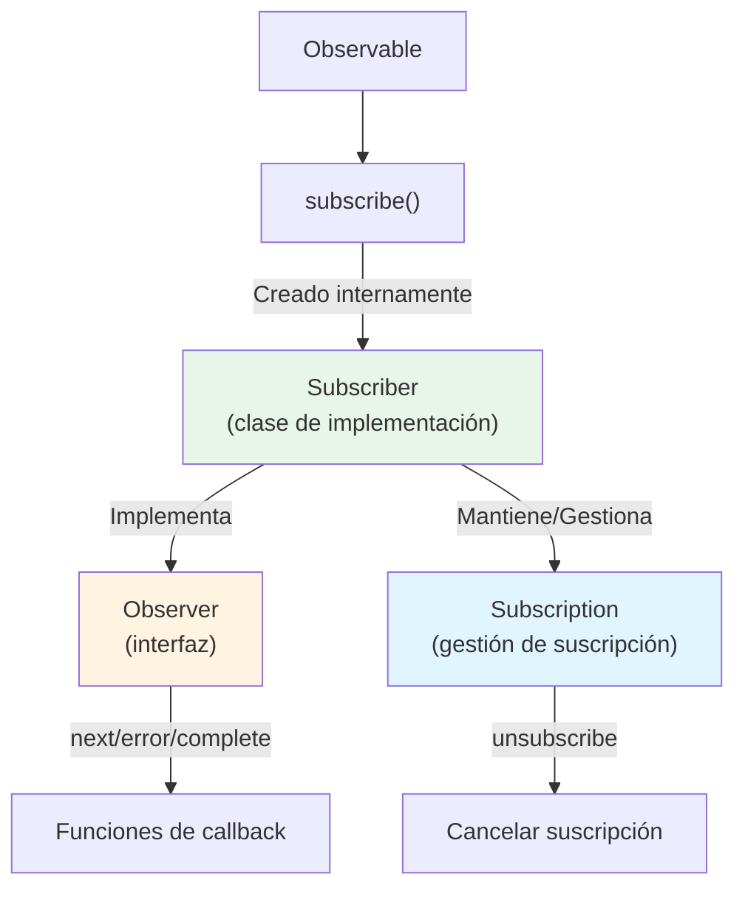
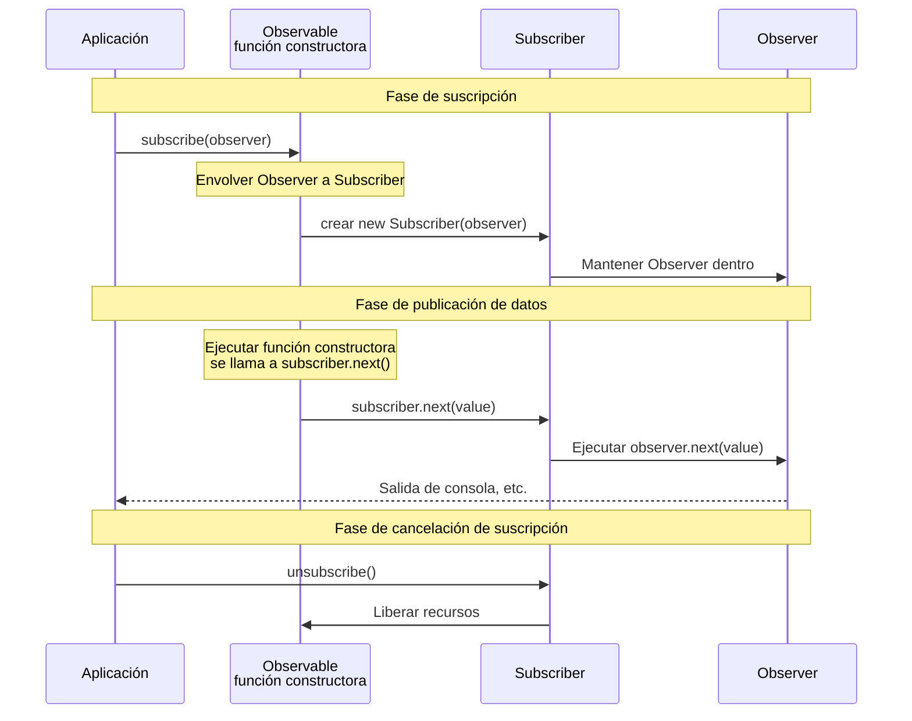

# Diferencia Entre Observer y Subscriber

## Por Qué se Confunden

Al aprender RxJS, los términos "Observer" y "Subscriber" aparecen y pueden ser confusos. Estos dos están estrechamente relacionados, pero tienen roles claramente diferentes.

## ¿Qué es un Observer?

Un **Observer** es una **interfaz** para recibir datos.

### Definición de Observer

```typescript
interface Observer<T> {
  next: (value: T) => void;       // Recibir un valor
  error?: (err: any) => void;     // Recibir un error
  complete?: () => void;          // Recibir finalización
}
```

### Rol de Observer
- Define "cómo" recibir datos
- Tiene 3 funciones de callback
- Describe **qué** hacer

## ¿Qué es un Subscriber?

**Subscriber** es una **clase** que implementa Observer y realiza el proceso de suscripción real.

### Rol de Subscriber
- Ejecuta los callbacks de Observer
- Mantiene Subscription (gestión de suscripción)
- Gestiona proceso de cancelación de suscripción
- Controla **cómo** ejecutar

## Dos Situaciones Donde Aparece Subscriber

Subscriber en realidad aparece en **dos situaciones diferentes**. Sin embargo, **ambos son el mismo objeto Subscriber**. Entender esta diferencia es la clave para evitar confusión.

### Situación 1: Al Crear un Observable (Recibido como Parámetro)

Al crear un Observable con `new Observable()`, `subscriber` se pasa como parámetro a la función constructora.

```typescript
import { Observable } from 'rxjs';

// Usar subscriber para publicar valores (el tipo es Subscriber<number>)
const observable$ = new Observable<number>(subscriber => {
  subscriber.next(1);      // Publicar un valor
  subscriber.next(2);
  subscriber.complete();   // Notificar finalización
});
```

::: tip Tipo de subscriber en esta situación
- Tipo: `Subscriber<number>`
- Rol: Usado para publicar datos dentro del Observable
- Los desarrolladores lo usan directamente (llaman a `next()`, `error()`, `complete()`)
:::

### Situación 2: Al Llamar a subscribe() (Observer → Convertido a Subscriber)

Cuando llama a `subscribe()` en un Observable, **el Observer pasado por el desarrollador se convierte internamente a un Subscriber**.

```typescript
// El desarrollador pasa una interfaz Observer
observable$.subscribe({
  next: value => console.log('Siguiente valor:', value),
  error: err => console.error('Error:', err),
  complete: () => console.log('Completo')
});

// ↑ RxJS crea internamente un Subscriber de la siguiente manera
// const subscriber = new Subscriber(observer);
// Y este subscriber se pasa como parámetro en la situación 1
```

::: tip Procesamiento en esta situación
1. El desarrollador pasa una interfaz `Observer`
2. RxJS envuelve internamente el `Observer` en un `Subscriber`
3. Ese `Subscriber` se pasa a la función constructora del Observable (= `subscriber` en la situación 1)
:::

### Importante: Ambos son el Mismo Objeto Subscriber

> [!IMPORTANT] El `Subscriber` en las situaciones 1 y 2 es el mismo objeto
>
> ```typescript
> const observable$ = new Observable(subscriber => {
>   // Este subscriber es el objeto Subscriber en sí
>   // creado cuando se llamó a subscribe()
>   subscriber.next(1);
> });
>
> observable$.subscribe({
>   // Este Observer se envuelve en un Subscriber,
>   // y se pasa a la función constructora anterior
>   next: v => console.log(v)
> });
> ```
>
> **En otras palabras:**
> - El desarrollador llama a `subscribe(observer)`
> - RxJS crea `new Subscriber(observer)`
> - Ese Subscriber se convierte en el argumento de la función constructora del Observable
> - Por lo tanto, `subscriber` en la situación 1 = `Subscriber` creado en la situación 2

## Ilustración de Relaciones



## Diferencias Vistas en Código

### Ejemplo Completo: Desde la Creación de Observable hasta la Suscripción

```typescript
import { Observable } from 'rxjs';

// 1. Al crear Observable: usar subscriber para publicar valores
const observable$ = new Observable<number>(subscriber => {
  console.log('Suscripción iniciada');
  subscriber.next(1);
  subscriber.next(2);
  subscriber.next(3);
  subscriber.complete();
});

// 2. Al suscribirse: pasar Observer (Subscriber se crea internamente)
observable$.subscribe({
  next: value => console.log('Siguiente valor:', value),
  error: err => console.error('Error:', err),
  complete: () => console.log('Completo')
});

// Salida:
// Suscripción iniciada
// Siguiente valor: 1
// Siguiente valor: 2
// Siguiente valor: 3
// Completo
```

#### En Este Ejemplo
- **`subscriber` al momento de creación**: Usado para publicar datos dentro del Observable
- **`Observer` al momento de suscripción**: Define el proceso para recibir los datos publicados

### Al Pasar un Observer

```typescript
import { interval } from 'rxjs';

const observer = {
  next: (value: number) => console.log(value),
  error: (err: any) => console.error(err),
  complete: () => console.log('Completo')
};

// Pasar Observer a subscribe
const subscription = interval(1000).subscribe(observer);
// Internamente, se crea Subscriber y ejecuta los callbacks del observer
```

### Al Pasar Callbacks Directamente (Notación Simplificada)

```typescript
// Esto también crea un Subscriber internamente
const subscription = interval(1000).subscribe(
  value => console.log(value),  // next
  err => console.error(err),    // error
  () => console.log('Completo')     // complete
);
```

## Flujo de Operación Real

El siguiente diagrama de secuencia muestra el flujo desde la creación de Observable hasta la suscripción y publicación de datos.



**Puntos Importantes de Este Flujo:**
1. Cuando se llama a `subscribe(observer)`, se crea un `new Subscriber(observer)`
2. Ese Subscriber se pasa como parámetro a la función constructora del Observable
3. Cuando se llama a `subscriber.next()` en la función constructora, se ejecuta el `observer.next()` interno
4. En otras palabras, **`subscriber` en la situación 1 = `Subscriber` creado en la situación 2**

## Puntos Importantes

> [!IMPORTANT] Observer es el "plano", Subscriber es el "ejecutor"
> - **Observer**: Una interfaz que **define** cómo recibir datos
> - **Subscriber**: Una clase que **implementa** el Observer y realmente **ejecuta** la suscripción
> - Subscriber aparece en dos situaciones

> [!TIP] Entender cuándo usar Subscriber
> - **Al crear Observable**: Use el parámetro `subscriber` en `new Observable(subscriber => {...})` directamente
> - **Al suscribirse**: Al llamar a `subscribe(observer)`, se crea automáticamente un Subscriber internamente
>
> En ambas situaciones, Subscriber es el mismo objeto con métodos `next()`, `error()`, `complete()`.

## Patrones de Confusión Comunes

### ❌ Entendimiento Incorrecto #1

"El `subscriber` al crear un Observable y el `observer` al suscribirse son cosas diferentes"

### ❌ Entendimiento Incorrecto #2

"Subscriber es una implementación interna, por lo que los desarrolladores no lo tocan"

### ✅ Entendimiento Correcto

**Hechos Importantes:**
- El **Observer** que el desarrollador pasa en `subscribe(observer)` se envuelve internamente en un **Subscriber**
- Ese **Subscriber** se pasa como parámetro a la función constructora al crear el Observable
- En otras palabras, **`subscriber` en la situación 1 = `Subscriber` creado en la situación 2 (mismo objeto)**

### Entendimiento con Ejemplo Completo

```typescript
import { Observable } from 'rxjs';

// 1. Crear Observable (nada se ejecuta en este punto)
const observable$ = new Observable<number>(subscriber => {
  console.log('¡Se ejecutó la función constructora!');
  subscriber.next(1);
  subscriber.next(2);
  subscriber.complete();
});

// 2. Suscribirse (la función constructora se ejecuta por primera vez en este momento)
observable$.subscribe({
  next: v => console.log('Recibido:', v),
  complete: () => console.log('Completo')
});

// Salida:
// ¡Se ejecutó la función constructora!
// Recibido: 1
// Recibido: 2
// Completo
```

**Flujo en Este Ejemplo:**
1. Se llama a `observable$.subscribe({...})`
2. RxJS crea `new Subscriber({next: ..., complete: ...})`
3. La función constructora `(subscriber => {...})` se ejecuta con ese `Subscriber` como parámetro
4. Se llama a `subscriber.next(1)` en la función constructora
5. Internamente, se ejecuta `observer.next(1)` y se muestra "Recibido: 1"

**En Otras Palabras:**
- `subscriber` en la situación 1 ← esto
- `Subscriber` creado en la situación 2 ← esto
- **¡Mismo objeto!**

## Resumen

### Comparación de Observer y Subscriber

| | Observer | Subscriber |
|---|----------|------------|
| **Tipo** | Interfaz | Clase (implementa Observer) |
| **Rol** | Define cómo recibir datos | Ejecuta proceso de suscripción real |
| **Contenido** | callbacks next/error/complete | Observer + gestión de Subscription |
| **Cuándo aparece** | Solo al momento de suscripción | Al crear Observable y al suscribirse |

### Importante: Relación en Dos Situaciones

| Situación | Lo que maneja el desarrollador | Tipo real | Relación |
|------|------------------|----------|--------|
| **Al crear Observable** | Parámetro en `new Observable(subscriber => {...})` | `Subscriber<T>` | El desarrollador lo usa directamente |
| **Al suscribirse** | Objeto pasado a `subscribe(observer)` | `Observer<T>` → Convertido internamente a `Subscriber<T>` | RxJS convierte automáticamente |

> [!IMPORTANT] Punto Central
> - El `Observer` que el desarrollador pasa en `subscribe(observer)` se envuelve en un `Subscriber` internamente
> - Ese `Subscriber` se pasa como parámetro a la función constructora del Observable
> - Por lo tanto, **el `Subscriber` usado en ambas situaciones es el mismo objeto**

## Próximos Pasos

Ahora que entiende la diferencia entre Observer y Subscriber, aprendamos sobre la gestión de suscripciones real.

- [Ciclo de Vida de Observable](/es/guide/observables/observable-lifecycle) - Flujo desde el inicio de suscripción hasta el final
- [Gestión de Subscription](/es/guide/observables/observable-lifecycle#subscription-management) - Cancelación de suscripción y gestión de recursos

## Recursos de Referencia

- [Documentación Oficial de RxJS - Observer](https://rxjs.dev/guide/observer) - Especificación detallada de Observer
- [Documentación Oficial de RxJS - Subscription](https://rxjs.dev/guide/subscription) - Especificación detallada de Subscription
- [Understanding the Difference Between Observer and Subscriber in RxJS](https://www.codingscenes.com/posts/92/Understanding-the-Difference-Between-Observer-and-Subscriber-in-RxJS) - Funcionalidad extendida de Subscriber y ejemplos prácticos
