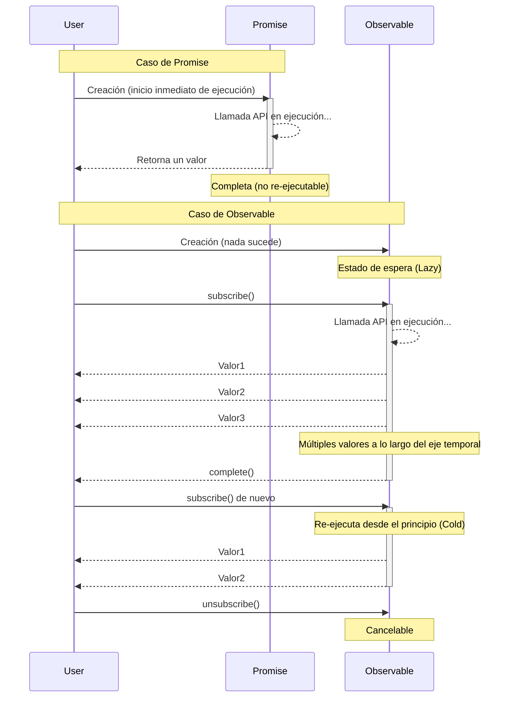

# El Muro de la Comprensión Conceptual

El primer muro de RxJS es **la comprensión de conceptos**. Especialmente para desarrolladores acostumbrados a Promises, el comportamiento de Observable puede ser contraintuitivo.

## Diferencias Esenciales entre Observable vs Promise

### Promise: Procesamiento Asíncrono de Una Sola Vez

```typescript
// Promise: retorna un valor solo una vez
const userPromise = fetch('/api/user/1').then(res => res.json());

userPromise.then(user => console.log(user)); // Obtiene información del usuario solo una vez
userPromise.then(user => console.log(user)); // Mismo resultado en caché
```

> [!TIP] Características
> - **Eager (ejecución inmediata)** - El procesamiento comienza en el momento de creación de Promise
> - **Completa solo una vez** - Éxito o fallo, solo una vez
> - **No cancelable** - Una vez iniciado, no se puede detener
> - **Siempre Hot** - Múltiples then comparten el mismo resultado

### Observable: Stream (Flujo de Datos con Eje Temporal)

```typescript
import { Observable } from 'rxjs';

// Observable: fluye múltiples valores a lo largo del eje temporal
const user$ = new Observable<User>(subscriber => {
  console.log('¡Inicio de ejecución de Observable!');
  fetch('/api/user/1')
    .then(res => res.json())
    .then(user => {
      subscriber.next(user);
      subscriber.complete();
    });
});

// L Nada sucede aún en este punto (Lazy)
console.log('Creación de Observable completada');

//  Se ejecuta solo cuando se suscribe
user$.subscribe(user => console.log('Suscripción1:', user));
user$.subscribe(user => console.log('Suscripción2:', user));
// ’ La llamada API se ejecuta 2 veces (Cold Observable)
```

#### Salida
```
Creación de Observable completada
¡Inicio de ejecución de Observable!
Suscripción1: { id: 1, name: 'Alice' }
¡Inicio de ejecución de Observable!
Suscripción2: { id: 1, name: 'Alice' }
```

> [!TIP] Características
> - **Lazy (ejecución diferida)** - Nada sucede hasta que se suscribe
> - **Puede fluir múltiples valores** - Se puede llamar next() múltiples veces
> - **Cancelable** - Se puede detener con unsubscribe
> - **Cold o Hot** - Se puede elegir si ejecutar por suscripción o compartir

### Tabla de Comparación

| Característica | Promise | Observable |
|---|---|---|
| **Momento de ejecución** | Inmediato (Eager) | Al suscribirse (Lazy) |
| **Número de valores** | Solo 1 vez | 0 o más veces (múltiples posibles) |
| **Cancelación** | No posible | Posible (unsubscribe) |
| **Reutilización** | Resultado en caché | Re-ejecución por suscripción (Cold) |
| **Después de error** | Termina | Termina (retry posible) |

### Visualización de las Diferencias de Comportamiento

El siguiente diagrama de secuencia muestra las diferencias en el flujo de ejecución entre Promise y Observable.



### Malentendidos Comunes

#### L Malentendido 1: "Observable es solo para asincronía"

```typescript
// Observable también puede manejar procesamiento síncrono
import { of } from 'rxjs';

const sync$ = of(1, 2, 3);

console.log('Before subscribe');
sync$.subscribe(value => console.log(value));
console.log('After subscribe');

// Salida (se ejecuta síncronamente):
// Before subscribe
// 1
// 2
// 3
// After subscribe
```

#### L Malentendido 2: "subscribe retorna el valor"

```typescript
import { map, of } from "rxjs";

const observable$ = of(1, 2, 3);

// L Ejemplo malo: Pensamiento tipo Promise
const value = observable$.subscribe(x => x); // value es un objeto Subscription
console.log(value); // Subscription { ... } � No es el valor esperado

//  Ejemplo bueno: Pensamiento tipo Observable
observable$.pipe(
  map(x => x * 2)
).subscribe(value => {
  console.log(value); // Usar el valor aquí
});
```

## Comprensión Intuitiva de Cold vs Hot

### Cold Observable: Stream Independiente por Suscripción

```typescript
import { interval } from 'rxjs';
import { take } from 'rxjs';

// Cold: cada suscriptor tiene su propio temporizador independiente
const cold$ = interval(1000).pipe(take(3));

console.log('Inicio Suscripción1');
cold$.subscribe(x => console.log('Suscripción1:', x));

setTimeout(() => {
  console.log('Inicio Suscripción2 (después de 2s)');
  cold$.subscribe(x => console.log('Suscripción2:', x));
}, 2000);

// Salida:
// Inicio Suscripción1
// Suscripción1: 0        (después de 1s)
// Suscripción1: 1        (después de 2s)
// Inicio Suscripción2 (después de 2s)
// Suscripción1: 2        (después de 3s)
// Suscripción2: 0        (después de 3s) � Suscripción2 comienza desde el principio
// Suscripción2: 1        (después de 4s)
// Suscripción2: 2        (después de 5s)
```

> [!TIP] Características de Cold
> - **Ejecución independiente** por suscripción
> - Mantiene el "plano" de los datos
> - Ejemplos: Llamadas HTTP API, temporizadores, lectura de archivos

### Hot Observable: Todos los Suscriptores Comparten el Mismo Stream

```typescript
import { interval } from 'rxjs';
import { take, share } from 'rxjs';

// Hot: compartido con share()
const hot$ = interval(1000).pipe(
  take(3),
  share() // Esto lo hace Hot
);

console.log('Inicio Suscripción1');
hot$.subscribe(x => console.log('Suscripción1:', x));

setTimeout(() => {
  console.log('Inicio Suscripción2 (después de 2s)');
  hot$.subscribe(x => console.log('Suscripción2:', x));
}, 2000);

// Salida:
// Inicio Suscripción1
// Suscripción1: 0        (después de 1s)
// Suscripción1: 1        (después de 2s)
// Inicio Suscripción2 (después de 2s)
// Suscripción1: 2        (después de 3s)
// Suscripción2: 2        (después de 3s) � Suscripción2 se une a mitad de camino
```

> [!TIP] Características de Hot
> - Todos los suscriptores **comparten la misma ejecución**
> - Los datos están siendo "transmitidos"
> - Ejemplos: Eventos de clic, WebSocket, Subject

### Cómo Distinguir Cold/Hot

```typescript
import { fromEvent, interval, of, Subject } from 'rxjs';
import { share } from 'rxjs';

// Cold (ejecución independiente por suscripción)
const cold1$ = of(1, 2, 3);
const cold2$ = interval(1000);
const cold3$ = ajax('/api/data');
const cold4$ = fromEvent(button, 'click'); // Cold pero especial

// Hot (compartido entre suscriptores)
const hot1$ = new Subject<number>();
const hot2$ = interval(1000).pipe(share()); // Convierte Cold a Hot
```

> [!IMPORTANT] Cómo Distinguirlos
> - **Creation Functions (of, from, fromEvent, interval, ajax, etc.)** ’ Cold
> - **Familia Subject** ’ Hot
> - **Uso de share(), shareReplay()** ’ Convierte Cold a Hot

## Cambio de Pensamiento hacia Programación Declarativa

### Imperativo vs Declarativo

RxJS es un paradigma de **programación declarativa**.

#### L Pensamiento Imperativo (Promise/async-await)

```typescript
// Imperativo: describe "cómo" procesar
async function processUsers() {
  const response = await fetch('/api/users');
  const users = await response.json();

  const activeUsers = [];
  for (const user of users) {
    if (user.isActive) {
      activeUsers.push(user);
    }
  }

  const userNames = [];
  for (const user of activeUsers) {
    userNames.push(user.name.toUpperCase());
  }

  return userNames;
}
```

####  Pensamiento Declarativo (RxJS)

```typescript
import { from } from 'rxjs';
import { mergeMap, filter, map, toArray } from 'rxjs';

// Declarativo: describe "qué" transformar
const processUsers$ = from(fetch('/api/users')).pipe(
  mergeMap(res => res.json()),
  mergeMap(users => users), // Expande el array
  filter(user => user.isActive),
  map(user => user.name.toUpperCase()),
  toArray()
);

processUsers$.subscribe(userNames => console.log(userNames));
```


::: tip Diferencia
- **Imperativo**: Describe procedimientos (bucles, condicionales, asignación de variables)
- **Declarativo**: Describe pipeline de transformación (flujo de datos)
:::

### Puntos Clave para el Cambio de Pensamiento

#### Punto 1: No procesar datos dentro de subscribe

Las transformaciones de datos dentro de pipe, subscribe solo para efectos secundarios.

```typescript
import { filter, map, of } from "rxjs";

const observable$ = of(1, 2, 3);
// L Ejemplo malo: procesar dentro de subscribe
observable$.subscribe(value => {
  const doubled = value * 2;           // =H Cálculo dentro de subscribe
  const filtered = doubled > 4 ? doubled : null;  // =H Condicional dentro de subscribe
  if (filtered) {                      // =H Sentencia if dentro de subscribe
    console.log(filtered);
  }
});

//  Ejemplo bueno: transformar dentro de pipe
observable$.pipe(
  map(value => value * 2),       // Cálculo dentro de pipe
  filter(value => value > 4)     // Filtrado también dentro de pipe
).subscribe(value => console.log(value));  // subscribe solo para efectos secundarios
```

#### Punto 2: No usar variables intermedias

```typescript
import { filter, map, Observable, of } from "rxjs";

const source$ = of(1, 2, 3, 4, 5);

// L Ejemplo malo: guardar en variables intermedias
let doubled$: Observable<number>;      // =H Declarar variable intermedia
let filtered$: Observable<number>;     // =H Declarar variable intermedia

doubled$ = source$.pipe(map(x => x * 2));    // =H Asignar a variable intermedia
filtered$ = doubled$.pipe(filter(x => x > 5)); // =H Asignar a variable intermedia
filtered$.subscribe(console.log);

//  Ejemplo bueno: conectar con pipeline
source$.pipe(
  map(x => x * 2),      // Conectar directamente en pipeline
  filter(x => x > 5)    // Conectar directamente en pipeline
).subscribe(console.log);
```

#### Punto 3: Evitar subscribe anidados

```typescript
// L Ejemplo malo: subscribe anidado
getUser$(userId).subscribe(user => {
  getOrders$(user.id).subscribe(orders => {  // =H subscribe adicional dentro de subscribe (anidado)
    console.log(user, orders);
  });  // =H La cancelación de suscripción se vuelve compleja
});

//  Ejemplo bueno: aplanar con mergeMap
getUser$(userId).pipe(
  mergeMap(user =>                // mergeMap aplana el Observable interno
    getOrders$(user.id).pipe(
      map(orders => ({ user, orders }))
    )
  )
).subscribe(({ user, orders }) => console.log(user, orders));  // Solo una suscripción
```

#### Punto 4: Organizar con sintaxis de separación en 3 etapas

Una técnica importante para mejorar drásticamente la legibilidad y mantenibilidad del código RxJS es la **sintaxis de separación por etapas**.

```typescript
// L Ejemplo malo: one-liner con todo mezclado
fromEvent(document, 'click').pipe(
  map(event => (event as MouseEvent).clientX),
  filter(x => x > 100),
  throttleTime(200)
).subscribe({
  next: x => console.log('Posición del clic:', x),
  error: err => console.error(err)
});
```

> [!IMPORTANT] Problemas
> - Definición de stream, transformación y suscripción mezcladas
> - Depuración difícil (no se sabe dónde ocurre el problema)
> - Difícil de probar
> - No reutilizable

```typescript
//  Ejemplo bueno: separado en 3 etapas

import { filter, fromEvent, map, throttleTime } from "rxjs";

// 1. Definición de Observable (fuente del stream)
const clicks$ = fromEvent(document, 'click');

// 2. Definición de pipeline (procesamiento de transformación de datos)
const processed$ = clicks$.pipe(
  map(event => (event as MouseEvent).clientX),
  filter(x => x > 100),
  throttleTime(200)
);

// 3. Procesamiento de suscripción (ejecución de efectos secundarios)
const subscription = processed$.subscribe({
  next: x => console.log('Posición del clic:', x),
  error: err => console.error(err),
  complete: () => console.log('Completado')
});
```

#### Beneficios
- **Depuración fácil** - Se puede insertar `console.log` o `tap` en cada etapa
- **Testeable** - `processed$` se puede probar independientemente
- **Reutilizable** - `clicks$` y `processed$` se pueden usar en otros lugares
- **Mejora la legibilidad** - La intención del código se vuelve clara

**La sintaxis de separación por etapas es una de las técnicas más prácticas para superar las dificultades de RxJS.**

Para más detalles, consulta **[Capítulo 10: Infierno de One-liners y Sintaxis de Separación por Etapas](/es/guide/anti-patterns/one-liner-hell)**.

## Experimentar para Comprender (Utilizar Starter Kit)

### Experimento 1: Diferencia entre Lazy y Eager

```typescript
import { Observable } from 'rxjs';

console.log('=== Promise (Eager) ===');
const promise = new Promise((resolve) => {
  console.log('¡Ejecución de Promise!');
  resolve(42);
});
console.log('Creación de Promise completada');
promise.then(value => console.log('Resultado de Promise:', value));

console.log('\n=== Observable (Lazy) ===');
const observable$ = new Observable(subscriber => {
  console.log('¡Ejecución de Observable!');
  subscriber.next(42);
  subscriber.complete();
});
console.log('Creación de Observable completada');
observable$.subscribe(value => console.log('Resultado de Observable:', value));

// Salida:
// === Promise (Eager) ===
// ¡Ejecución de Promise!
// Creación de Promise completada
// Resultado de Promise: 42
//
// === Observable (Lazy) ===
// Creación de Observable completada
// ¡Ejecución de Observable!
// Resultado de Observable: 42
```

### Experimento 2: Diferencia entre Cold y Hot

```typescript
import { interval } from 'rxjs';
import { take, share } from 'rxjs';

// Cold: independiente por suscripción
const cold$ = interval(1000).pipe(take(3));

console.log('Cold Observable:');
cold$.subscribe(x => console.log('Cold Suscripción1:', x));
setTimeout(() => {
  cold$.subscribe(x => console.log('Cold Suscripción2:', x));
}, 2000);

// Hot: compartido
const hot$ = interval(1000).pipe(take(3), share());

setTimeout(() => {
  console.log('\nHot Observable:');
  hot$.subscribe(x => console.log('Hot Suscripción1:', x));
  setTimeout(() => {
    hot$.subscribe(x => console.log('Hot Suscripción2:', x));
  }, 2000);
}, 6000);
```

**Ejecuta esto en el [entorno de ejecución de aprendizaje](/es/guide/starter-kid) para experimentar la diferencia.**

### Experimento 3: Declarativo vs Imperativo

```typescript
import { of } from 'rxjs';
import { map, filter } from 'rxjs';

const numbers = [1, 2, 3, 4, 5, 6, 7, 8, 9, 10];

// Imperativo
console.log('=== Imperativo ===');
const result1: number[] = [];
for (const num of numbers) {
  const doubled = num * 2;
  if (doubled > 10) {
    result1.push(doubled);
  }
}
console.log(result1);

// Declarativo
console.log('\n=== Declarativo ===');
of(...numbers).pipe(
  map(num => num * 2),
  filter(num => num > 10)
).subscribe(num => console.log(num));
```

## Verificación de Comprensión

Verifica si puedes responder las siguientes preguntas.

```markdown
## Conceptos Básicos
- [ ] Puedes enumerar 3 diferencias entre Promise y Observable
- [ ] Puedes explicar la diferencia entre Lazy y Eager
- [ ] Puedes explicar la diferencia entre Cold y Hot con ejemplos

## Práctica
- [ ] Puedes explicar por qué no se debe completar el procesamiento dentro de subscribe
- [ ] Sabes cómo corregir subscribe anidados
- [ ] Conoces cómo convertir un Cold Observable a Hot

## Depuración
- [ ] Puedes identificar la causa cuando un Observable no se ejecuta
- [ ] Comprendes la causa de que la suscripción se ejecute múltiples veces
```

## Siguientes Pasos

Una vez que comprendas los conceptos, avanza a los muros más prácticos.

- **El Muro de la Gestión del Ciclo de Vida** (En preparación) - Cuándo hacer subscribe/unsubscribe
- **La Indecisión de Selección de Operadores** (En preparación) - Criterios para elegir entre más de 100 operadores

## Secciones Relacionadas

- **[¿Qué es RxJS?](/es/guide/basics/what-is-rxjs)** - Conceptos básicos de RxJS
- **[Diferencias entre Promise y RxJS](/es/guide/basics/promise-vs-rxjs)** - Promise vs Observable
- **[Cold and Hot Observables](/es/guide/observables/cold-and-hot-observables)** - Explicación detallada de Cold/Hot
