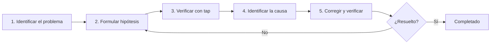

# La barrera de la depuración

Cuando te enfrentas a problemas en RxJS como **"los valores no fluyen"**, **"aparecen valores diferentes a los esperados"** o **"podría haber una fuga de memoria"**, resolverlos puede llevar mucho tiempo si no conoces los métodos de depuración adecuados. Esta página explica de manera integral las técnicas de depuración específicas de RxJS.

## Estrategia básica de depuración en RxJS

### Los 5 pasos de la depuración



### Paso 1: Identificar el problema

Primero, **clarifica qué es el problema**.

| Síntoma | Posibles causas |
|---|---|
| No fluyen valores | Olvidaste subscribe, termina antes de complete, excluido por filter |
| No aparece el primer valor | combineLatest no cumple condición inicial, BehaviorSubject no configurado |
| El orden es extraño | Uso de mergeMap, timing asíncrono |
| Aparecen valores duplicados | Múltiples subscribe sin share, mal uso de shareReplay |
| Hay fuga de memoria | Olvidaste unsubscribe, shareReplay con refCount: false |
| Los valores se retrasan | debounceTime, throttleTime, procesamiento asíncrono |

### Paso 2: Formular hipótesis

**Supón** la causa del problema.

```typescript
// Ejemplo: Problema de "no aparecen valores"
// Hipótesis 1: ¿No hay subscribe?
// Hipótesis 2: ¿complete/error demasiado temprano?
// Hipótesis 3: ¿Excluido por filter?
// Hipótesis 4: ¿Demora por procesamiento asíncrono?
```

### Paso 3: Verificar con tap

Inserta `tap` en cada etapa para confirmar **qué está ocurriendo realmente**.

```typescript
import { of } from 'rxjs';
import { map, filter, tap } from 'rxjs';

of(1, 2, 3, 4, 5).pipe(
  tap(v => console.log('=5 Entrada:', v)),
  filter(x => x > 10), // L Todos son excluidos
  tap(v => console.log(' Pasó filter:', v)),
  map(x => x * 10),
  tap(v => console.log('=â Después de map:', v))
).subscribe(result => {
  console.log('=æ Resultado:', result);
});

// Salida:
// =5 Entrada: 1
// =5 Entrada: 2
// =5 Entrada: 3
// =5 Entrada: 4
// =5 Entrada: 5
// (Ninguno pasó filter ’ filter es la causa)
```

## Escenarios comunes de depuración

### Escenario 1: Los valores no fluyen

#### Problema 1-1: Olvidaste subscribe

#### L Mal ejemplo: No hay subscribe
```typescript
import { of } from 'rxjs';
import { map } from 'rxjs';

const result$ = of(1, 2, 3).pipe(
  map(x => x * 10)
);

console.log('Completado'); // Se imprime inmediatamente
// No fluyen valores a result$ (porque no hay subscribe)
```

####  Buen ejemplo: Hacer subscribe
```typescript
import { of } from 'rxjs';
import { map } from 'rxjs';

const result$ = of(1, 2, 3).pipe(
  map(x => x * 10)
);

result$.subscribe(value => {
  console.log('Valor:', value);
});

console.log('Completado');

// Salida:
// Valor: 10
// Valor: 20
// Valor: 30
// Completado
```

> [!IMPORTANT] Puntos de verificación
> - Definir un Observable no hace nada
> - **Debes hacer subscribe obligatoriamente**
> - Si usas async pipe, subscribe no es necesario (Angular, etc.)

#### Problema 1-2: complete/error llega demasiado pronto

#### L Mal ejemplo: complete llega primero
```typescript
import { EMPTY } from 'rxjs';
import { map } from 'rxjs';

EMPTY.pipe( // L complete inmediatamente
  map(x => x * 10)
).subscribe({
  next: value => console.log('Valor:', value),
  complete: () => console.log('Completado')
});

// Salida:
// Completado
// (No fluye ningún valor)
```

####  Buen ejemplo: Verificar con tap
```typescript
import { EMPTY } from 'rxjs';
import { map, tap } from 'rxjs';

EMPTY.pipe(
  tap(() => console.log('=A Llegó valor')), // Esto no se imprime
  map(x => x * 10)
).subscribe({
  next: value => console.log('Valor:', value),
  complete: () => console.log('Completado')
});

// Salida:
// Completado
// (tap tampoco se ejecuta ’ EMPTY es la causa)
```

#### Problema 1-3: Excluido por filter

#### L Mal ejemplo: Excluir todo sin darse cuenta
```typescript
import { of } from 'rxjs';
import { filter } from 'rxjs';

of(1, 2, 3, 4, 5).pipe(
  filter(x => x > 100) // L Todos excluidos
).subscribe(value => {
  console.log('Valor:', value); // No se imprime nada
});
```

####  Buen ejemplo: Verificar con tap
```typescript
import { of } from 'rxjs';
import { filter, tap } from 'rxjs';

of(1, 2, 3, 4, 5).pipe(
  tap(v => console.log('Antes de filter:', v)),
  filter(x => x > 100),
  tap(v => console.log('Después de filter:', v)) // No se imprime ninguno
).subscribe(value => {
  console.log('Valor:', value);
});

// Salida:
// Antes de filter: 1
// Antes de filter: 2
// Antes de filter: 3
// Antes de filter: 4
// Antes de filter: 5
// (No hay ninguno después de filter ’ filter es demasiado estricto)
```

### Escenario 2: Aparecen valores diferentes a los esperados

#### Problema 2-1: Error de conversión de tipo

#### L Mal ejemplo: Confusión entre string y número
```typescript
import { of } from 'rxjs';
import { map } from 'rxjs';

const input = '5'; // string

of(input).pipe(
  map(x => x + 10) // L '5' + 10 = '510' (concatenación de strings)
).subscribe(result => {
  console.log('Resultado:', result); // Resultado: 510
  console.log('Tipo:', typeof result); // Tipo: string
});
```

####  Buen ejemplo: Verificar tipo con tap
```typescript
import { of } from 'rxjs';
import { map, tap } from 'rxjs';

const input = '5';

of(input).pipe(
  tap(x => console.log('Entrada:', x, typeof x)),
  map(x => Number(x)), // Convertir a número
  tap(x => console.log('Después de conversión:', x, typeof x)),
  map(x => x + 10)
).subscribe(result => {
  console.log('Resultado:', result); // Resultado: 15
});
```

#### Problema 2-2: Orden asíncrono

#### L Mal ejemplo: El orden se desordena con mergeMap
```typescript
import { of } from 'rxjs';
import { mergeMap, delay } from 'rxjs';

of(1, 2, 3).pipe(
  mergeMap(x =>
    of(x * 10).pipe(
      delay(Math.random() * 1000) // Retraso aleatorio
    )
  )
).subscribe(value => {
  console.log('Valor:', value);
});

// Ejemplo de salida (el orden no está garantizado):
// Valor: 20
// Valor: 10
// Valor: 30
```

####  Buen ejemplo: Garantizar el orden con concatMap
```typescript
import { of } from 'rxjs';
import { concatMap, delay, tap } from 'rxjs';

of(1, 2, 3).pipe(
  tap(x => console.log('Entrada:', x)),
  concatMap(x =>
    of(x * 10).pipe(
      delay(Math.random() * 1000),
      tap(v => console.log('Completado:', v))
    )
  )
).subscribe(value => {
  console.log('Valor:', value);
});

// Salida (siempre en este orden):
// Entrada: 1
// Completado: 10
// Valor: 10
// Entrada: 2
// Completado: 20
// Valor: 20
// Entrada: 3
// Completado: 30
// Valor: 30
```

### Escenario 3: Detección de fugas de memoria

#### Problema 3-1: Olvidaste unsubscribe

#### L Mal ejemplo: No hacer unsubscribe
```typescript
import { interval } from 'rxjs';

class Component {
  ngOnInit() {
    interval(1000).subscribe(n => {
      console.log('Valor:', n); // Se ejecuta eternamente
    });
  }

  ngOnDestroy() {
    // No hay unsubscribe ’ Fuga de memoria
  }
}
```

####  Buen ejemplo: Cancelación automática con takeUntil
```typescript
import { interval, Subject } from 'rxjs';
import { takeUntil } from 'rxjs';

class Component {
  private destroy$ = new Subject<void>();

  ngOnInit() {
    interval(1000).pipe(
      takeUntil(this.destroy$)
    ).subscribe(n => {
      console.log('Valor:', n);
    });
  }

  ngOnDestroy() {
    this.destroy$.next();
    this.destroy$.complete();
    console.log('Unsubscribe completado');
  }
}
```

#### Problema 3-2: Fuga de memoria con shareReplay

#### L Mal ejemplo: Fuga con refCount: false
```typescript
import { interval } from 'rxjs';
import { shareReplay, take, tap } from 'rxjs';

const data$ = interval(1000).pipe(
  take(100),
  tap(n => console.log('Generando:', n)),
  shareReplay({ bufferSize: 1, refCount: false })
  // L refCount: false ’ Continúa ejecutándose eternamente
);

const sub = data$.subscribe(n => console.log('Suscripción 1:', n));

setTimeout(() => {
  sub.unsubscribe();
  console.log('Unsubscribe hecho, pero continúa ejecutándose internamente');
}, 5000);
```

####  Buen ejemplo: Detención automática con refCount: true
```typescript
import { interval } from 'rxjs';
import { shareReplay, take, tap } from 'rxjs';

const data$ = interval(1000).pipe(
  take(100),
  tap(n => console.log('Generando:', n)),
  shareReplay({ bufferSize: 1, refCount: true })
  //  refCount: true ’ Se detiene al cancelar todas las suscripciones
);

const sub = data$.subscribe(n => console.log('Suscripción 1:', n));

setTimeout(() => {
  sub.unsubscribe();
  console.log('Unsubscribe ’ El stream también se detiene');
}, 5000);
```

## Herramientas y técnicas de depuración

### 1. Depuración gradual con tap

```typescript
import { of } from 'rxjs';
import { map, filter, tap } from 'rxjs';

const debugTap = <T>(label: string, color: string = '=5') =>
  tap<T>({
    next: value => console.log(`${color} [${label}] next:`, value),
    error: error => console.error(`L [${label}] error:`, error),
    complete: () => console.log(` [${label}] complete`)
  });

of(1, 2, 3, 4, 5).pipe(
  debugTap('Entrada'),
  filter(x => x % 2 === 0),
  debugTap('Después de filter', '=â'),
  map(x => x * 10),
  debugTap('Después de map', '=á')
).subscribe({
  next: value => console.log('=æ Resultado final:', value),
  complete: () => console.log('<Á Completado')
});
```

### 2. Operador de depuración personalizado

```typescript
import { tap, timestamp, map } from 'rxjs';
import { MonoTypeOperatorFunction } from 'rxjs';

interface DebugOptions {
  label: string;
  showTimestamp?: boolean;
  showDiff?: boolean;
}

let lastTimestamp = 0;

function debug<T>(options: DebugOptions): MonoTypeOperatorFunction<T> {
  const { label, showTimestamp = true, showDiff = true } = options;

  return source => source.pipe(
    timestamp(),
    tap(({ value, timestamp }) => {
      const parts = [`[${label}]`, value];

      if (showTimestamp) {
        parts.push(`@${new Date(timestamp).toISOString()}`);
      }

      if (showDiff && lastTimestamp > 0) {
        const diff = timestamp - lastTimestamp;
        parts.push(`(+${diff}ms)`);
      }

      console.log(...parts);
      lastTimestamp = timestamp;
    }),
    map(({ value }) => value)
  );
}

// Uso
import { interval } from 'rxjs';
import { take } from 'rxjs';

interval(500).pipe(
  take(5),
  debug({ label: 'Temporizador' }),
  map(x => x * 10),
  debug({ label: 'Después de transformación', showDiff: false })
).subscribe();
```

### 3. RxJS DevTools (extensión de navegador)

**Método de instalación:**
1. Busca "RxJS DevTools" en Chrome/Edge Web Store
2. Añade la extensión
3. Abre DevTools y haz clic en la pestaña "RxJS"

**Funciones principales:**
- Monitoreo en tiempo real de todos los Observables
- Visualización con diagramas de mármol
- Seguimiento de subscribe/unsubscribe
- Análisis de rendimiento

**Ejemplo de uso:**
```typescript
import { interval } from 'rxjs';
import { map, take } from 'rxjs';

// Se detecta automáticamente en DevTools
const timer$ = interval(1000).pipe(
  take(10),
  map(x => x * 2)
);

timer$.subscribe(value => console.log(value));
```

### 4. Depuración de errores

#### Identificar dónde ocurre el error

```typescript
import { of, throwError } from 'rxjs';
import { map, catchError, tap } from 'rxjs';

of(1, 2, 3).pipe(
  tap(v => console.log('1. Entrada:', v)),
  map(x => {
    if (x === 2) {
      throw new Error('No se puede usar 2');
    }
    return x * 10;
  }),
  tap(v => console.log('2. Después de map:', v)), // No se ejecuta en caso de error
  catchError(error => {
    console.error('3. Error capturado:', error.message);
    return of(-1); // Devolver valor por defecto
  }),
  tap(v => console.log('4. Después de catchError:', v))
).subscribe({
  next: value => console.log('5. Resultado:', value),
  error: error => console.error('Error de suscripción:', error),
  complete: () => console.log('6. Completado')
});

// Salida:
// 1. Entrada: 1
// 2. Después de map: 10
// 5. Resultado: 10
// 1. Entrada: 2
// 3. Error capturado: No se puede usar 2
// 4. Después de catchError: -1
// 5. Resultado: -1
// 6. Completado
```

## Depuración de rendimiento

### Problema 1: Recalculación excesiva

#### L Mal ejemplo: Recalculación frecuente con combineLatest
```typescript
import { BehaviorSubject, combineLatest } from 'rxjs';
import { map } from 'rxjs';

const a$ = new BehaviorSubject(1);
const b$ = new BehaviorSubject(2);
const c$ = new BehaviorSubject(3);

combineLatest([a$, b$, c$]).pipe(
  map(([a, b, c]) => {
    console.log('Ejecutando cálculo pesado'); // Se ejecuta frecuentemente
    return a + b + c;
  })
).subscribe(result => console.log('Resultado:', result));

// Actualización frecuente
setInterval(() => {
  a$.next(Math.random());
}, 100);
```

####  Buen ejemplo: Excluir duplicados con distinctUntilChanged
```typescript
import { BehaviorSubject, combineLatest } from 'rxjs';
import { map, distinctUntilChanged } from 'rxjs';

const a$ = new BehaviorSubject(1);
const b$ = new BehaviorSubject(2);
const c$ = new BehaviorSubject(3);

combineLatest([a$, b$, c$]).pipe(
  map(([a, b, c]) => Math.floor(a) + Math.floor(b) + Math.floor(c)),
  distinctUntilChanged(), // Pasa solo cuando el valor cambia
  map(sum => {
    console.log('Ejecutando cálculo pesado'); // Solo cuando el valor cambia
    return sum * 2;
  })
).subscribe(result => console.log('Resultado:', result));

setInterval(() => {
  a$.next(Math.random());
}, 100);
```

### Problema 2: Monitoreo del uso de memoria

```typescript
import { interval } from 'rxjs';
import { scan, tap } from 'rxjs';

let itemCount = 0;

interval(100).pipe(
  scan((acc, val) => {
    acc.push(val);
    itemCount = acc.length;
    return acc;
  }, [] as number[]),
  tap(() => {
    if (itemCount % 100 === 0) {
      console.log(`Número de elementos: ${itemCount}`);
      if (itemCount > 10000) {
        console.warn('  Uso de memoria demasiado alto');
      }
    }
  })
).subscribe();
```

### Problema 3: Monitoreo del número de suscripciones

```typescript
import { Observable, Subject } from 'rxjs';

class MonitoredSubject<T> extends Subject<T> {
  private subscriptionCount = 0;

  subscribe(...args: any[]): any {
    this.subscriptionCount++;
    console.log(`Número de suscripciones: ${this.subscriptionCount}`);

    const subscription = super.subscribe(...args);

    const originalUnsubscribe = subscription.unsubscribe.bind(subscription);
    subscription.unsubscribe = () => {
      this.subscriptionCount--;
      console.log(`Número de suscripciones: ${this.subscriptionCount}`);
      originalUnsubscribe();
    };

    return subscription;
  }
}

// Uso
const data$ = new MonitoredSubject<number>();

const sub1 = data$.subscribe(v => console.log('Suscripción 1:', v));
const sub2 = data$.subscribe(v => console.log('Suscripción 2:', v));

sub1.unsubscribe();
sub2.unsubscribe();

// Salida:
// Número de suscripciones: 1
// Número de suscripciones: 2
// Número de suscripciones: 1
// Número de suscripciones: 0
```

## Lista de verificación de depuración

Si surge un problema, verifica lo siguiente en orden.

```markdown
## Verificación básica
- [ ] ¿Estás llamando a `subscribe()`?
- [ ] ¿`complete` o `error` no llegan demasiado pronto?
- [ ] ¿Los valores no están siendo excluidos por `filter` o `take`?
- [ ] ¿Estás esperando la finalización del procesamiento asíncrono?

## Verificación de timing
- [ ] ¿Entiendes sincronía/asincronía?
- [ ] ¿Verificaste el impacto de `delay`, `debounceTime`, `throttleTime`?
- [ ] ¿Se cumple la condición de primera emisión de `combineLatest`?

## Verificación de memoria
- [ ] ¿Estás usando `unsubscribe` o `takeUntil`?
- [ ] ¿Configuraste `refCount: true` en `shareReplay`?
- [ ] ¿Estás delimitando adecuadamente los Observables infinitos?

## Verificación de rendimiento
- [ ] ¿No hay recalculación excesiva? (considera `distinctUntilChanged`)
- [ ] ¿El número de suscripciones no aumenta demasiado?
- [ ] ¿Asincronizan los procesos pesados con `observeOn(asyncScheduler)`?
```

## Lista de verificación de comprensión

Verifica si puedes responder a las siguientes preguntas.

```markdown
## Depuración básica
- [ ] Puedo depurar el flujo de valores usando tap
- [ ] Puedo identificar dónde ocurren los errores
- [ ] Puedo verificar el timing de complete/error

## Uso de herramientas
- [ ] Conozco el uso básico de RxJS DevTools
- [ ] Puedo crear operadores de depuración personalizados
- [ ] Puedo medir el timing usando timestamp

## Resolución de problemas
- [ ] Puedo identificar la causa cuando no fluyen valores
- [ ] Puedo encontrar señales de fugas de memoria
- [ ] Puedo identificar problemas de rendimiento

## Prevención
- [ ] Tengo el hábito de depuración gradual usando tap
- [ ] Implemento manejo de errores adecuadamente
- [ ] Conozco medidas contra fugas de memoria
```

## Próximos pasos

Una vez que entiendas las técnicas de depuración, integra todo el conocimiento aprendido hasta ahora y aprende **patrones prácticos**.

’ **Chapter 13: Colección de patrones prácticos** (en preparación) - Colección de patrones utilizables en el trabajo

## Páginas relacionadas

- **[Chapter 8: Técnicas de depuración de RxJS](/es/guide/debugging/)** - Visión general de técnicas de depuración
- **[Chapter 9: Pruebas de mármol](/es/guide/testing/marble-testing)** - Depuración con TestScheduler
- **[Comprensión del timing y orden](/es/guide/overcoming-difficulties/timing-and-order)** - Depuración usando tap
- **[Chapter 10: Errores comunes y soluciones](/es/guide/anti-patterns/common-mistakes)** - Evitar antipatrones

## <¯ Ejercicios de práctica

### Problema 1: Identificar la causa cuando no fluyen valores

En el siguiente código, identifica por qué no se imprimen valores.

```typescript
import { Subject, combineLatest } from 'rxjs';

const a$ = new Subject<number>();
const b$ = new Subject<number>();

combineLatest([a$, b$]).subscribe(([a, b]) => {
  console.log('Valores:', a, b);
});

a$.next(1);
console.log('Completado');
```

<details>
<summary>Respuesta</summary>

> [!NOTE] Causa
> `combineLatest` no emite hasta que todos los streams emitan al menos un valor
>
> Como `b$` aún no ha emitido un valor, solo `a$.next(1)` no provoca la emisión.

#### Método de corrección 1: Emitir valor también en b$
```typescript
import { Subject, combineLatest } from 'rxjs';

const a$ = new Subject<number>();
const b$ = new Subject<number>();

combineLatest([a$, b$]).subscribe(([a, b]) => {
  console.log('Valores:', a, b);
});

a$.next(1);
b$.next(2); // � Aquí se emite
console.log('Completado');

// Salida:
// Valores: 1 2
// Completado
```

#### Método de corrección 2: Usar BehaviorSubject
```typescript
import { BehaviorSubject, combineLatest } from 'rxjs';

const a$ = new BehaviorSubject<number>(0); // Valor inicial
const b$ = new BehaviorSubject<number>(0);

combineLatest([a$, b$]).subscribe(([a, b]) => {
  console.log('Valores:', a, b);
});

// Salida: Valores: 0 0 (emite inmediatamente)

a$.next(1);
// Salida: Valores: 1 0
```

> [!NOTE] Técnica de depuración
> Usando tap para verificar los valores de cada stream, puedes saber dónde se detiene.
> ```typescript
> a$.pipe(tap(v => console.log('a$:', v)))
> b$.pipe(tap(v => console.log('b$:', v)))
> ```

</details>

### Problema 2: Corregir la fuga de memoria

El siguiente código tiene una fuga de memoria. Corrígelo.

```typescript
import { interval } from 'rxjs';
import { Component } from '@angular/core';

class MyComponent implements Component {
  ngOnInit() {
    interval(1000).subscribe(n => {
      console.log('Temporizador:', n);
    });
  }

  ngOnDestroy() {
    console.log('Destruido');
  }
}
```

<details>
<summary>Ejemplo de respuesta</summary>

> [!NOTE] Problema
> Al no hacer unsubscribe en `ngOnDestroy`, interval continúa ejecutándose incluso después de destruir el componente**

#### Método de corrección 1: Guardar Subscription y hacer unsubscribe
```typescript
import { interval, Subscription } from 'rxjs';

class MyComponent {
  private subscription!: Subscription;

  ngOnInit() {
    this.subscription = interval(1000).subscribe(n => {
      console.log('Temporizador:', n);
    });
  }

  ngOnDestroy() {
    this.subscription.unsubscribe();
    console.log('Destruido y unsubscribe');
  }
}
```

#### Método de corrección 2: Usar takeUntil (recomendado)
```typescript
import { interval, Subject } from 'rxjs';
import { takeUntil } from 'rxjs';

class MyComponent {
  private destroy$ = new Subject<void>();

  ngOnInit() {
    interval(1000).pipe(
      takeUntil(this.destroy$)
    ).subscribe(n => {
      console.log('Temporizador:', n);
    });
  }

  ngOnDestroy() {
    this.destroy$.next();
    this.destroy$.complete();
    console.log('Destruido y unsubscribe');
  }
}
```

> [!IMPORTANT] Puntos
> - Los Observables infinitos como interval requieren unsubscribe obligatoriamente
> - Se recomienda el patrón takeUntil (permite gestionar múltiples suscripciones de forma unificada)
> - En Angular, si usas async pipe, unsubscribe se hace automáticamente

</details>

### Problema 3: Problema de orden

En el siguiente código, explica por qué el orden no está garantizado y corrígelo.

```typescript
import { from, of } from 'rxjs';
import { mergeMap, delay } from 'rxjs';

from([1, 2, 3]).pipe(
  mergeMap(x =>
    of(x).pipe(
      delay(Math.random() * 1000)
    )
  )
).subscribe(value => console.log(value));

// Ejemplo de salida: 2, 1, 3 (el orden no está garantizado)
```

<details>
<summary>Respuesta</summary>

> [!NOTE] Problema
> `mergeMap` ejecuta en paralelo, por lo que el orden de finalización depende del tiempo de ejecución**

#### Método de corrección: Usar concatMap
```typescript
import { from, of } from 'rxjs';
import { concatMap, delay, tap } from 'rxjs';

from([1, 2, 3]).pipe(
  tap(x => console.log('Inicio:', x)),
  concatMap(x =>
    of(x).pipe(
      delay(Math.random() * 1000),
      tap(v => console.log('Completado:', v))
    )
  )
).subscribe(value => console.log('Resultado:', value));

// Salida (siempre en este orden):
// Inicio: 1
// Completado: 1
// Resultado: 1
// Inicio: 2
// Completado: 2
// Resultado: 2
// Inicio: 3
// Completado: 3
// Resultado: 3
```

> [!NOTE] Razón
> - **mergeMap**: Ejecución paralela, el orden de finalización no está garantizado
> - **concatMap**: Ejecución secuencial, siempre emite en el mismo orden que la entrada
> - **switchMap**: Solo el más reciente, procesos antiguos se cancelan
> - **exhaustMap**: Ignora nuevos procesos durante la ejecución

#### Comparación con diagramas de mármol
```
Entrada:  --1--2--3----|

mergeMap: --2--1--3--|  (orden de finalización)
concatMap: --1--2--3-| (orden de entrada)
```

</details>

### Problema 4: Mejora de rendimiento

El siguiente código recalcula frecuentemente. Mejora el rendimiento.

```typescript
import { fromEvent } from 'rxjs';
import { map } from 'rxjs';

const input = document.querySelector('input')!;

fromEvent(input, 'input').pipe(
  map(e => (e.target as HTMLInputElement).value),
  map(value => {
    console.log('Ejecutando cálculo pesado');
    return value.toUpperCase();
  })
).subscribe(result => console.log(result));

// Usuario escribe "hello"
// Ejecutando cálculo pesado (h)
// Ejecutando cálculo pesado (he)
// Ejecutando cálculo pesado (hel)
// Ejecutando cálculo pesado (hell)
// Ejecutando cálculo pesado (hello)
```

<details>
<summary>Respuesta</summary>

#### Método de mejora 1: Esperar finalización de entrada con debounceTime
```typescript
import { fromEvent } from 'rxjs';
import { map, debounceTime } from 'rxjs';

const input = document.querySelector('input')!;

fromEvent(input, 'input').pipe(
  debounceTime(300), // Ejecuta si no hay entrada durante 300ms
  map(e => (e.target as HTMLInputElement).value),
  map(value => {
    console.log('Ejecutando cálculo pesado');
    return value.toUpperCase();
  })
).subscribe(result => console.log(result));

// Se ejecuta solo una vez después de escribir "hello" y esperar 300ms
```

#### Método de mejora 2: Excluir duplicados con distinctUntilChanged
```typescript
import { fromEvent } from 'rxjs';
import { map, debounceTime, distinctUntilChanged } from 'rxjs';

const input = document.querySelector('input')!;

fromEvent(input, 'input').pipe(
  debounceTime(300),
  map(e => (e.target as HTMLInputElement).value),
  distinctUntilChanged(), // Ignorar si es el mismo valor que la vez anterior
  map(value => {
    console.log('Ejecutando cálculo pesado');
    return value.toUpperCase();
  })
).subscribe(result => console.log(result));
```

> [!TIP] Técnicas de mejora de rendimiento
> - **debounceTime**: Esperar finalización de entrada
> - **throttleTime**: Reducir a intervalos regulares
> - **distinctUntilChanged**: Excluir duplicados
> - **observeOn(asyncScheduler)**: Asincronizar procesos pesados
> - **shareReplay**: Cachear resultados

</details>
