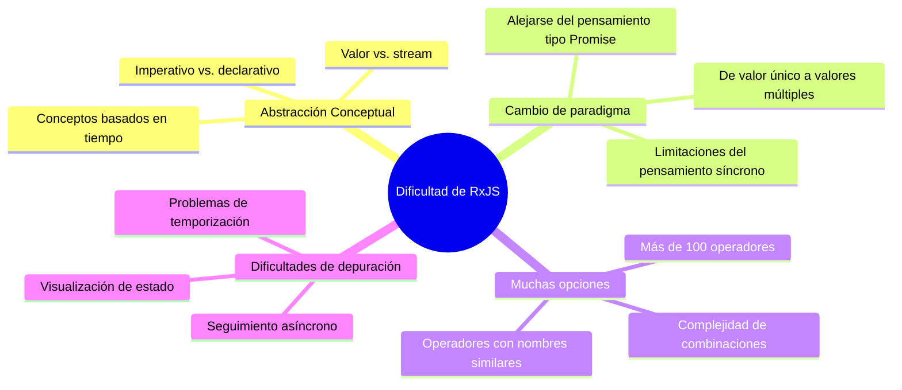
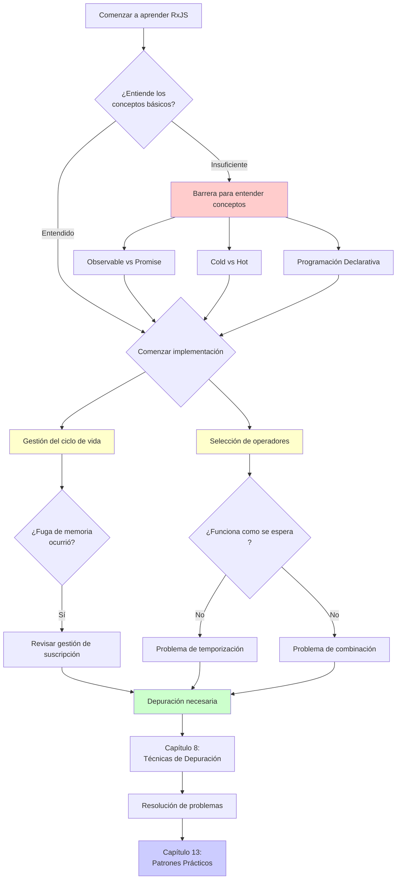
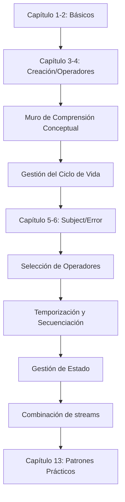
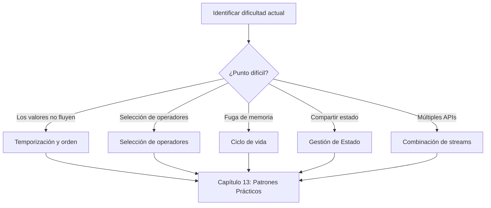
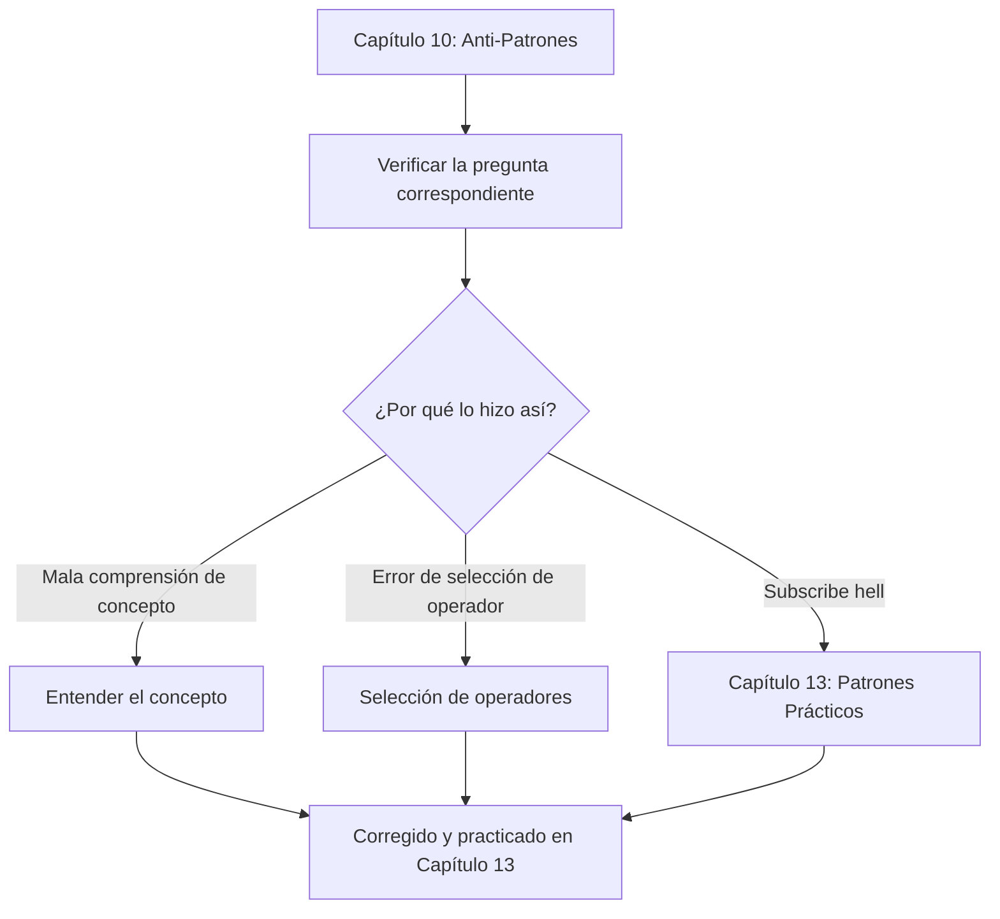

# Superando las Dificultades de RxJS

Incluso los desarrolladores con experiencia en TypeScript y negocios enfrentan muchas dificultades en la práctica de RxJS. Esta sección explica sistemáticamente las dificultades específicas de RxJS y cómo superarlas.

## ¿Por qué es Difícil RxJS?

La dificultad de RxJS radica en el **alto nivel de abstracción de conceptos** y la **necesidad de un cambio de paradigma**. Incluso los desarrolladores experimentados se confunden al descubrir que su conocimiento y patrones de pensamiento no funcionan. Veamos a continuación los puntos de dificultad específicos.

### El conocimiento existente no funciona

Los desarrolladores acostumbrados a Promise y Async/Await se confunden cuando intentan usar RxJS de la misma manera.

```typescript
// ❌ Pensamiento tipo Promise: Quiero obtener el valor directamente
observable.subscribe(value => {
  const result = value * 2;
  return result; // Esto no devuelve nada
});

// ✅ Pensamiento tipo RxJS: transformar el stream
const doubled$ = observable.pipe(
  map(value => value * 2)
);
```

> [!IMPORTANT] Problemas
> - El pensamiento de programación imperativa (then/await de Promise) no funciona
> - Necesita pensar en "transformación de stream" en lugar de valores
> - Intentar completar el proceso en subscribe es un anti-patrón

### Agregar el concepto de eje temporal

La característica más significativa de RxJS es el concepto de "línea de tiempo". Promise devuelve un valor solo una vez, pero Observable puede fluir múltiples valores a lo largo del tiempo.

```typescript
// Promise: devuelve un valor solo una vez
const promise = fetch('/api/data');

// Observable: múltiples valores fluyen a lo largo del eje temporal
const clicks$ = fromEvent(button, 'click');
//                     eje temporal
// clicks$:  ------click----click--click---------->
```

> [!IMPORTANT] Problemas
> - Necesita estar constantemente consciente de "cuándo fluyen los valores"
> - Las diferencias síncrono/asíncrono afectan el comportamiento
> - Leer Marble Diagrams es esencial

### Elegir entre más de 100 operadores

RxJS tiene más de 100 operadores, y los principiantes dudan al elegir entre ellos. Hay muchos operadores con nombres similares, por lo que es difícil determinar cuál usar.

> [!IMPORTANT] Preocupaciones comunes
> - "map, mergeMap, switchMap, concatMap... No entiendo la diferencia"
> - "debounceTime y throttleTime, ¿cuál debería usar?"
> - "combineLatest y zip, ¿cuál es la diferencia?"

→ El Capítulo 11 proporciona **criterios de selección prácticos**.

### La imagen general de la dificultad de RxJS

El siguiente diagrama muestra qué elementos conforman la dificultad de RxJS.



## Lista de Dificultades Principales

Hemos categorizado las principales dificultades encontradas en el aprendizaje y práctica de RxJS en siete categorías. Cada dificultad tiene una página dedicada con soluciones detalladas. Primero, identifique la dificultad que enfrenta en la tabla a continuación.

| Dificultades | Contenidos | Síntomas Comunes |
|---|---|---|
| **[Barrera de Comprensión Conceptual](/es/guide/overcoming-difficulties/conceptual-understanding)** | Observable vs Promise, Cold vs Hot | "¿Cuál es la diferencia con Promise?" |
| **[Gestión del Ciclo de Vida](/es/guide/overcoming-difficulties/lifecycle-management)** | subscribe/unsubscribe, fugas de memoria | "¿Cuándo debo unsubscribe?" |
| **[Selección de Operadores](/es/guide/overcoming-difficulties/operator-selection)** | Criterios para elegir entre más de 100 operadores | "¿Qué operador debería usar?" |
| **[Temporización y Orden](/es/guide/overcoming-difficulties/timing-and-order)** | Cuándo fluyen los valores, síncrono vs. asíncrono | "¿Por qué no hay valores?" |
| **[Gestión de Estado](/es/guide/overcoming-difficulties/state-and-sharing)** | Subject, share/shareReplay | "Quiero compartir el estado" |
| **[Combinación de Múltiples Streams](/es/guide/overcoming-difficulties/stream-combination)** | combineLatest, zip, withLatestFrom | "Quiero combinar resultados de dos APIs" |
| **[Depuración](/es/guide/overcoming-difficulties/debugging-guide)** | Los valores no fluyen, valor diferente al esperado | "No sé qué está pasando" |

### Relación de Dificultades

Las dificultades de RxJS no son independientes sino interrelacionadas. El siguiente diagrama de flujo muestra en qué orden se encuentran las dificultades en el proceso de aprendizaje y cómo se encadenan. Verifique dónde se encuentra actualmente.



## Cómo Usar Cada Sección

Cada artículo en este Capítulo puede leerse de forma independiente. Comience a leer desde la sección que necesite, dependiendo de lo que le esté causando problemas. A continuación se explica cómo usarlo de manera efectiva.

### 1. Identificar Sus Dificultades

Desde la tabla anterior, seleccione la sección que corresponda a **la dificultad que enfrenta actualmente**. También puede hacer referencia inversa desde los síntomas de la dificultad.

#### Ejemplo
- Las llamadas API no toman valores → [Temporización y Orden](/es/guide/overcoming-difficulties/timing-and-order)
- Preocupado por fugas de memoria → [Gestión del Ciclo de Vida](/es/guide/overcoming-difficulties/lifecycle-management)
- Confundido entre mergeMap y switchMap → [Selección de Operadores](/es/guide/overcoming-difficulties/operator-selection)
- Quiere compartir estado entre múltiples componentes → [Gestión de Estado](/es/guide/overcoming-difficulties/state-and-sharing)
- Quiere combinar resultados de dos APIs → [Combinación de Múltiples Streams](/es/guide/overcoming-difficulties/stream-combination)
- No sabe cómo depurar → [Depuración](/es/guide/overcoming-difficulties/debugging-guide)

### 2. Entender con Ejemplo Malo → Ejemplo Bueno

Cada sección tiene la siguiente estructura:

```
❌ Ejemplo malo (patrón común al que caer)
↓
✅ Ejemplo bueno (patrón recomendado)
↓
💡 Explicación (por qué es malo, por qué es bueno)
↓
🎯 Preguntas prácticas (verificación de comprensión)
```

### 3. Experimentar con Starter Kit

Todos los ejemplos de código pueden ejecutarse en un entorno de desarrollo local.
<!-- TODO: Agregar enlace al starter kit cuando esté disponible: [entorno de ejecución de aprendizaje](/es/guide/starter-kit) -->

#### Flujo de Aprendizaje Recomendado
1. Copiar y ejecutar ejemplo malo → Experimentar el problema
2. Copiar y ejecutar ejemplo bueno → Sentir la diferencia
3. Aplicar a su propio código → Establecer

## Hoja de Ruta de Aprendizaje

El enfoque de aprendizaje depende de su nivel de habilidad actual y objetivos. Elija una hoja de ruta que se ajuste a usted de los tres patrones a continuación.

### Si Está Aprendiendo RxJS por Primera Vez

Este es un enfoque sistemático donde aprende en orden desde los conceptos básicos y supera las dificultades encontradas en cada capítulo.



### Si Entiende los Básicos pero Tiene Problemas en la Práctica

Si tiene conocimientos básicos pero enfrenta problemas en proyectos reales, es más eficiente abordar directamente desde el punto de dificultad.



### Si Ha Caído en Anti-Patrones

Si ya está escribiendo código RxJS pero sospecha que ha caído en anti-patrones, comience identificando el problema en el Capítulo 10 y comprendiendo la dificultad que lo causó.



## Secciones Relacionadas

El Capítulo 11 (Superando las Dificultades de RxJS) mejora la efectividad del aprendizaje en conjunto con otros Capítulos. En particular, está estrechamente relacionado con los siguientes tres Capítulos, y leerlos juntos profundizará su comprensión.

- **[Capítulo 10: Anti-Patrones de RxJS](/es/guide/anti-patterns/)** - Aprender "qué está mal"
- **[Capítulo 13: Patrones Prácticos](/es/guide/)** - Aprender "cómo escribir" (en preparación)
- **[Capítulo 8: Técnicas de Depuración de RxJS](/es/guide/debugging/)** - Aprender "cómo encontrar problemas"

#### Flujo de Aprendizaje
1. **Capítulo 11 (este capítulo)** - Entender las dificultades de RxJS
2. **Capítulo 10** - Conocer anti-patrones específicos
3. **Capítulo 13** - Dominar patrones de implementación correctos

## Lista de Verificación de Comprensión

Esta es una lista de verificación para comprobar su nivel de comprensión después de estudiar cada sección. Si marca todas las casillas, ha alcanzado un nivel donde puede aplicar el contenido de esa sección en la práctica.

```markdown
## Comprensión de Conceptos
- [ ] Explicar la diferencia entre Observable y Promise
- [ ] Explicar la diferencia entre Cold y Hot con ejemplos
- [ ] Entender los beneficios de la programación declarativa

## Habilidades Prácticas
- [ ] Puede subscribe/unsubscribe en el momento apropiado
- [ ] Puede seleccionar operadores que se ajusten al propósito
- [ ] Puede leer Marble Diagrams y predecir comportamiento

## Depuración
- [ ] Puede depurar streams usando tap
- [ ] Puede identificar la causa de que no fluyan valores
- [ ] Puede encontrar señales de fugas de memoria
```

## Próximos Pasos

Una vez que tenga una imagen general de las dificultades con RxJS en esta página, pasemos a los detalles del aprendizaje.

**Primera página a leer:**

→ **[Barrera de Comprensión Conceptual](/es/guide/overcoming-difficulties/conceptual-understanding)** - Comprender las ideas esenciales de RxJS

Esta página se enfoca en "comprensión conceptual" que está en la raíz de todas las dificultades. Comenzar aquí le ayudará a entender otros puntos de dificultad sin problemas. Después de entender los conceptos, proceda a la página sobre la dificultad específica que enfrenta.
