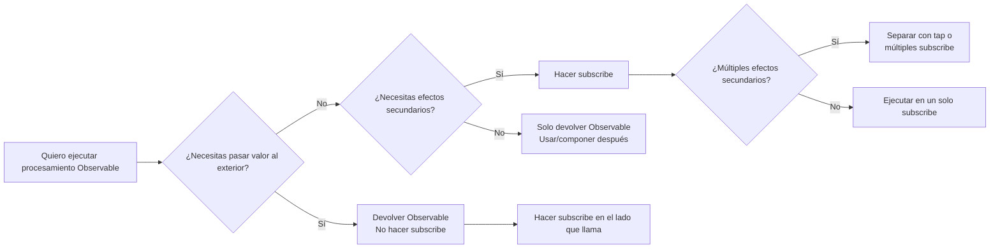
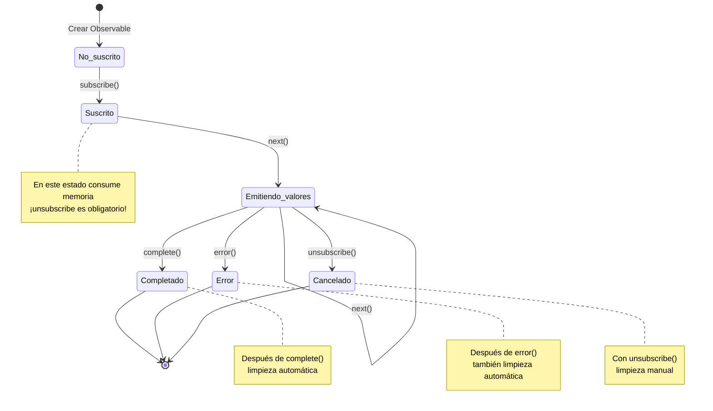
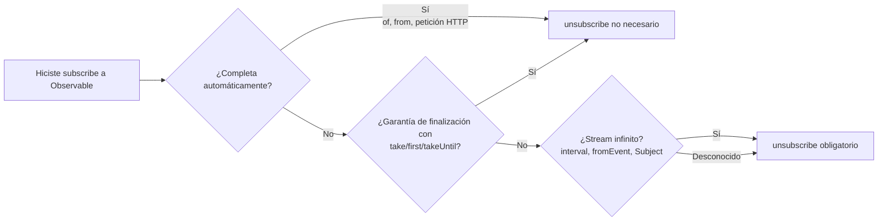

# La barrera de la gestión del ciclo de vida

Una de las mayores trampas de RxJS es la **gestión del ciclo de vida**. Equivocarse en "cuándo hacer subscribe" y "cuándo hacer unsubscribe" puede causar fugas de memoria y bugs.

## ¿Cuándo se debe hacer subscribe?

### Principio básico: No hacer subscribe hasta el último momento

#### L Mal ejemplo: Hacer subscribe en el medio
```typescript
import { interval } from 'rxjs';

function getEvenNumbers() {
  const numbers$ = interval(1000);

  // Hacer subscribe dentro de esto
  numbers$.subscribe(n => {
    if (n % 2 === 0) {
      console.log(n); // ¿Cómo pasar esto al exterior?
    }
  });
}
```

####  Buen ejemplo: Devolver Observable, hacer subscribe en el lado que llama
```typescript
import { interval } from 'rxjs';
import { filter, take } from 'rxjs';

function getEvenNumbers() {
  return interval(1000).pipe(
    filter(n => n % 2 === 0),
    take(5)
  );
}

// Hacer subscribe en el lado de uso
const subscription = getEvenNumbers().subscribe(n => {
  console.log(n);
});
```

::: tip =¡ Explicación
- **Mal ejemplo**: Al hacer subscribe dentro de la función, se pierde el control (no se puede cancelar, no se puede componer)
- **Buen ejemplo**: Al devolver un Observable, el lado que llama puede controlarlo
:::

### subscribe es el disparador de "efectos secundarios"

#### L Mal ejemplo: Ejecutar múltiples efectos secundarios dentro de subscribe
```typescript
import { fromEvent } from 'rxjs';
import { map } from 'rxjs';

const button = document.querySelector('button')!;

fromEvent(button, 'click')
  .pipe(map(() => Math.random()))
  .subscribe(randomValue => {
    // Efecto secundario 1: Operación DOM
    document.querySelector('#result')!.textContent = randomValue.toString();

    // Efecto secundario 2: Llamada a API
    fetch('/api/log', {
      method: 'POST',
      body: JSON.stringify({ value: randomValue })
    });

    // Efecto secundario 3: LocalStorage
    localStorage.setItem('lastValue', randomValue.toString());
  });
```

####  Buen ejemplo: Separar efectos secundarios, subscribe solo los necesarios
```typescript
import { fromEvent } from 'rxjs';
import { map } from 'rxjs';

const button = document.querySelector('button')!;

const randomClicks$ = fromEvent(button, 'click').pipe(
  map(() => Math.random())
);

// Si solo necesitas actualización DOM
randomClicks$.subscribe(value => {
  document.querySelector('#result')!.textContent = value.toString();
});

// Si solo necesitas logging
randomClicks$.subscribe(value => {
  fetch('/api/log', {
    method: 'POST',
    body: JSON.stringify({ value })
  });
});
```

::: tip =¡ Explicación
- **subscribe = punto de ejecución de efectos secundarios**
- **Si los efectos secundarios son independientes**: Separar en múltiples subscribe (se puede controlar individualmente)
- **Si los efectos secundarios siempre se ejecutan juntos**: OK agruparlos en un solo subscribe
- **Si se necesitan efectos secundarios dentro del pipeline**: Usar el operador `tap`
:::

### ¿Cuándo se debe hacer subscribe?: Diagrama de flujo de decisión



### Visión general del ciclo de vida de suscripción

El siguiente diagrama de transición de estados muestra qué estados atraviesa una suscripción a Observable antes de terminar.



> [!IMPORTANT] Puntos de gestión del ciclo de vida
> - **Suscrito**: Estado con peligro de fuga de memoria
> - **complete/error**: Se limpia automáticamente (no necesita unsubscribe)
> - **unsubscribe**: Necesita limpieza manual (especialmente streams infinitos)

## ¿Cuándo se debe hacer unsubscribe?

### Principio básico: Si te suscribes, siempre cancela

#### L Mal ejemplo: No hacer unsubscribe ’ Fuga de memoria
```typescript
import { interval } from 'rxjs';

const button = document.querySelector('button')!;

function startTimer() {
  interval(1000).subscribe(n => {
    console.log(n);
  });
  // ¡Esta suscripción continúa eternamente!
}

// Se añade una nueva suscripción con cada clic del botón
button.addEventListener('click', startTimer);
// 10 clics = ¡10 suscripciones funcionando simultáneamente!
```

####  Buen ejemplo: Cancelar con unsubscribe
```typescript
import { interval } from 'rxjs';

function startTimer() {
  const subscription = interval(1000).subscribe(n => {
    console.log(n);
  });

  // Cancelar después de 5 segundos
  setTimeout(() => {
    subscription.unsubscribe();
    console.log('Suscripción cancelada');
  }, 5000);
}
```

::: tip =¡ Explicación
- Los **streams infinitos** (interval, fromEvent, etc.) siempre necesitan unsubscribe
- Sin unsubscribe, fuga de memoria + procesamiento innecesario continúa
:::

### Casos donde unsubscribe no es necesario


####  Observables que completan automáticamente

```typescript
of(1, 2, 3).subscribe(n => console.log(n));
// Después de complete, se limpia automáticamente

from([1, 2, 3]).subscribe(n => console.log(n));
// Después de complete, se limpia automáticamente
```

####  Cuando la finalización está garantizada con take, etc.
```typescript
interval(1000).pipe(
  take(5) // complete automáticamente después de 5 veces
).subscribe(n => console.log(n));
```

####  Finaliza con error
```typescript
throwError(() => new Error('Error')).subscribe({
  error: err => console.error(err)
});
```

####  EMPTY (complete inmediatamente)
```typescript
EMPTY.subscribe(() => console.log('No se ejecuta'));
```

> [!TIP] =¡ Explicación
> unsubscribe no es necesario en los siguientes casos
> 1. **Observables que llaman a complete()** - Se limpian automáticamente
> 2. **Cuando se llama a error()** - También limpieza automática
> 3. **Cuando la finalización está garantizada con take(n), etc.** - Se completa explícitamente
> > [!IMPORTANT] Importante
> > ¡Streams infinitos (interval, fromEvent, Subject, etc.) siempre necesitan unsubscribe!

### Diagrama de flujo para decidir si unsubscribe es necesario



**¡Si tienes dudas, hacer unsubscribe es seguro!**

## Patrones para prevenir fugas de memoria

### Patrón 1: Gestión con objeto Subscription

```typescript
import { interval, fromEvent } from 'rxjs';
import { Subscription } from 'rxjs';

class MyComponent {
  private subscription = new Subscription();

  ngOnInit() {
    // Añadir múltiples suscripciones a un solo Subscription
    this.subscription.add(
      interval(1000).subscribe(n => console.log('Timer:', n))
    );

    this.subscription.add(
      fromEvent(document, 'click').subscribe(() => console.log('Click!'))
    );

    this.subscription.add(
      fromEvent(window, 'resize').subscribe(() => console.log('Resize!'))
    );
  }

  ngOnDestroy() {
    // Cancelar todas las suscripciones de una vez
    this.subscription.unsubscribe();
  }
}
```

#### =¡ Ventajas

- Gestionar múltiples suscripciones con un solo objeto
- Cancelación en lote en `ngOnDestroy`
- Fácil añadir y eliminar

### Patrón 2: Gestión con array

```typescript
import { interval, fromEvent } from 'rxjs';
import { Subscription } from 'rxjs';

class MyComponent {
  private subscriptions: Subscription[] = [];

  ngOnInit() {
    this.subscriptions.push(
      interval(1000).subscribe(n => console.log('Timer:', n))
    );

    this.subscriptions.push(
      fromEvent(document, 'click').subscribe(() => console.log('Click!'))
    );
  }

  ngOnDestroy() {
    this.subscriptions.forEach(sub => sub.unsubscribe());
    this.subscriptions = [];
  }
}
```

#### =¡ Ventajas

- Gestión flexible con operaciones de array
- También se puede cancelar individualmente
- Fácil de depurar (verificar array con console.log)

### Patrón 3: Patrón takeUntil (recomendado)

```typescript
import { interval, fromEvent, Subject } from 'rxjs';
import { takeUntil } from 'rxjs';

class MyComponent {
  private destroy$ = new Subject<void>();

  ngOnInit() {
    // Añadir takeUntil(this.destroy$) a todas las suscripciones
    interval(1000).pipe(
      takeUntil(this.destroy$)
    ).subscribe(n => console.log('Timer:', n));

    fromEvent(document, 'click').pipe(
      takeUntil(this.destroy$)
    ).subscribe(() => console.log('Click!'));

    fromEvent(window, 'resize').pipe(
      takeUntil(this.destroy$)
    ).subscribe(() => console.log('Resize!'));
  }

  ngOnDestroy() {
    // Cancelar todas las suscripciones con un solo next()
    this.destroy$.next();
    this.destroy$.complete();
  }
}
```

#### =¡ Ventajas

- **Más declarativo** - Especifica explícitamente la condición de finalización en el pipeline
- **No necesita objeto Subscription** - Eficiente en memoria
- **Fácil de leer** - Al ver el código, se entiende "completa con destroy$"

## Guía completa del patrón takeUntil

### Patrón básico

```typescript
import { interval, Subject } from 'rxjs';
import { takeUntil } from 'rxjs';

const destroy$ = new Subject<void>();

// Esta suscripción continúa hasta que destroy$ haga next()
interval(1000).pipe(
  takeUntil(destroy$)
).subscribe(n => console.log(n));

// Detener todas las suscripciones después de 5 segundos
setTimeout(() => {
  destroy$.next();
  destroy$.complete();
}, 5000);
```

#### Diagrama de mármol

```
interval(1000):  --0--1--2--3--4--5--6--7-->
destroy$:        ----------X
                          ‘
                       llamada a next()

Resultado takeUntil:   --0--1--2|
                          ‘
                       complete
```

### Aplicar a múltiples Observables

```typescript
import { interval, fromEvent, timer, Subject } from 'rxjs';
import { takeUntil, map } from 'rxjs';

const destroy$ = new Subject<void>();

// Patrón: usar el mismo destroy$ para todos los streams
interval(1000).pipe(
  takeUntil(destroy$),
  map(n => `Timer: ${n}`)
).subscribe(console.log);

fromEvent(document, 'click').pipe(
  takeUntil(destroy$),
  map(() => 'Click!')
).subscribe(console.log);

timer(2000).pipe(
  takeUntil(destroy$),
  map(() => 'Timer finished')
).subscribe(console.log);

// Detener todo
function cleanup() {
  destroy$.next();
  destroy$.complete();
}

// Ejemplo: llamar cleanup() en la transición de página
window.addEventListener('beforeunload', cleanup);
```

## Errores comunes del patrón takeUntil

### Error 1: La posición de takeUntil es incorrecta

#### L Mal ejemplo: map antes de takeUntil
```typescript
import { interval, Subject } from 'rxjs';
import { map, takeUntil } from 'rxjs';

const destroy$ = new Subject<void>();

interval(1000).pipe(
  takeUntil(destroy$),  // Aunque complete aquí...
  map(n => n * 2)       // map puede ejecutarse
).subscribe(console.log);
```

####  Buen ejemplo: takeUntil al final
```typescript
import { interval, Subject } from 'rxjs';
import { map, takeUntil } from 'rxjs';

const destroy$ = new Subject<void>();

interval(1000).pipe(
  map(n => n * 2),
  takeUntil(destroy$)  // Después de todos los operadores
).subscribe(console.log);
```

> [!TIP]=¡ Explicación
> - **takeUntil se coloca al final** en la medida de lo posible
> - Excepción: A veces se coloca antes de operadores multicast como shareReplay

### Error 2: No completar destroy$

#### L Mal ejemplo: No llamar a complete()
```typescript
import { Subject } from 'rxjs';

const destroy$ = new Subject<void>();

function cleanup() {
  destroy$.next();
  // L No se llama a complete()
}

// Problema: destroy$ mismo se convierte en causa de fuga de memoria
```

####  Buen ejemplo: Llamar tanto a next() como a complete()
```typescript
import { Subject } from 'rxjs';

const destroy$ = new Subject<void>();

function cleanup() {
  destroy$.next();
  destroy$.complete();
}
```

> [!TIP]=¡ Explicación
> - Solo con `next()`, destroy$ permanece suscrito
> - **Siempre llamar también a `complete()`**

### Error 3: Intentar reutilizar

#### L Mal ejemplo: Reutilizar Subject completado
```typescript
import { interval, Subject } from 'rxjs';
import { takeUntil } from 'rxjs';

const destroy$ = new Subject<void>();

function start() {
  interval(1000).pipe(
    takeUntil(destroy$)
  ).subscribe(console.log);
}

function stop() {
  destroy$.next();
  destroy$.complete();
}

start();
setTimeout(stop, 3000);

// L Problema: destroy$ ya está completado, por lo que si haces start() de nuevo, termina inmediatamente
setTimeout(start, 5000); // Esto no funciona
```

####  Buen ejemplo: Regenerar destroy$
```typescript
import { interval, Subject } from 'rxjs';
import { takeUntil } from 'rxjs';

class MyComponent {
  private destroy$ = new Subject<void>();

  start() {
    // Si ya está completado, regenerar
    if (this.destroy$.closed) {
      this.destroy$ = new Subject<void>();
    }

    interval(1000).pipe(
      takeUntil(this.destroy$)
    ).subscribe(console.log);
  }

  stop() {
    this.destroy$.next();
    this.destroy$.complete();
  }
}
```

> [!TIP] =¡ Explicación
> - **Un Subject no se puede reutilizar una vez completado**
> - Si necesitas reiniciar, crear un nuevo Subject

## Mejores prácticas de gestión de Subscription

### Mejor práctica 1: Tener destroy$ por unidad de componente/clase

```typescript
import { Subject } from 'rxjs';
import { takeUntil } from 'rxjs';

class UserProfileComponent {
  private destroy$ = new Subject<void>();

  constructor(private userService: UserService) {}

  ngOnInit() {
    this.userService.getUser().pipe(
      takeUntil(this.destroy$)
    ).subscribe(user => {
      console.log(user);
    });

    this.userService.getUserPosts().pipe(
      takeUntil(this.destroy$)
    ).subscribe(posts => {
      console.log(posts);
    });
  }

  ngOnDestroy() {
    this.destroy$.next();
    this.destroy$.complete();
  }
}
```

#### =¡ Ventajas

- **Consistencia** - Mismo patrón en todos los componentes
- **Mantenibilidad** - Al añadir nuevas suscripciones, no hay cambios en ngOnDestroy
- **Seguridad** - No hay olvidos de unsubscribe

### Mejor práctica 2: Utilizar AsyncPipe (en caso de Angular)

```typescript
import { Component } from '@angular/core';
import { Observable } from 'rxjs';

@Component({
  selector: 'app-user-profile',
  template: `
    <!-- AsyncPipe hace subscribe/unsubscribe automáticamente -->
    <div *ngIf="user$ | async as user">
      <h1>{{ user.name }}</h1>
      <p>{{ user.email }}</p>
    </div>

    <ul>
      <li *ngFor="let post of posts$ | async">
        {{ post.title }}
      </li>
    </ul>
  `
})
export class UserProfileComponent {
  user$: Observable<User>;
  posts$: Observable<Post[]>;

  constructor(private userService: UserService) {
    // Pasar Observable directamente al template
    this.user$ = this.userService.getUser();
    this.posts$ = this.userService.getUserPosts();

    // ¡No necesita ngOnDestroy! AsyncPipe cancela automáticamente
  }
}
```

#### =¡ Ventajas

- **unsubscribe automático** - Cancelación automática al destruir el componente
- **Compatibilidad OnPush** - Detección de cambios optimizada
- **Código conciso** - No necesita boilerplate de subscribe/unsubscribe

### Mejor práctica 3: Cambiar estrategia según larga vida vs corta vida

```typescript
import { Injectable } from '@angular/core';
import { BehaviorSubject, interval, fromEvent } from 'rxjs';
import { takeUntil } from 'rxjs';

@Injectable({ providedIn: 'root' })
export class DataService {
  //  Estado compartido en todo el servicio (larga vida)
  // ’ Mantener suscripción hasta finalización de aplicación
  private userState$ = new BehaviorSubject<User | null>(null);

  getUser() {
    return this.userState$.asObservable();
  }

  // L No hacer subscribe directamente en componente
  //  Suscribir con AsyncPipe o takeUntil
}

class MyComponent {
  private destroy$ = new Subject<void>();

  ngOnInit() {
    //  Suscripción vinculada al ciclo de vida del componente (corta vida)
    // ’ Cancelar siempre en ngOnDestroy
    interval(1000).pipe(
      takeUntil(this.destroy$)
    ).subscribe(n => console.log(n));

    fromEvent(window, 'resize').pipe(
      takeUntil(this.destroy$)
    ).subscribe(() => console.log('Resize'));
  }

  ngOnDestroy() {
    this.destroy$.next();
    this.destroy$.complete();
  }
}
```

> [!IMPORTANT] =¡ Principios
> | Tipo de suscripción | Ciclo de vida | Método de gestión |
> |---|---|---|
> | **Estado global** | Toda la aplicación | BehaviorSubject + AsyncPipe |
> | **Específico de página/ruta** | Mientras la ruta es válida | takeUntil(routeDestroy$) |
> | **Específico de componente** | Mientras existe el componente | takeUntil(destroy$) or AsyncPipe |
> | **Llamada API única** | Hasta completar | take(1) or first() |

### Mejor práctica 4: Establecer condiciones de finalización explícitas

#### L Mal ejemplo: No está claro cuándo termina
```typescript
import { fromEvent } from 'rxjs';

fromEvent(document, 'click').subscribe(() => {
  console.log('Click');
});
```

####  Buen ejemplo 1: Límite de veces
```typescript
import { fromEvent } from 'rxjs';
import { take } from 'rxjs';

fromEvent(document, 'click').pipe(
  take(5) // Termina automáticamente después de 5 veces
).subscribe(() => {
  console.log('Click (máximo 5 veces)');
});
```

####  Buen ejemplo 2: Límite de tiempo
```typescript
import { fromEvent, timer } from 'rxjs';
import { takeUntil } from 'rxjs';

const timeout$ = timer(10000); // Después de 10 segundos
fromEvent(document, 'click').pipe(
  takeUntil(timeout$)
).subscribe(() => {
  console.log('Click (dentro de 10 segundos)');
});
```

####  Buen ejemplo 3: Múltiples condiciones de finalización
```typescript
import { fromEvent, Subject, merge } from 'rxjs';
import { takeUntil, take } from 'rxjs';

const destroy$ = new Subject<void>();
const maxClicks$ = fromEvent(document, 'click').pipe(take(10));

fromEvent(document, 'mousemove').pipe(
  takeUntil(merge(destroy$, maxClicks$)) // Termina con cualquiera
).subscribe(() => {
  console.log('Mouse move');
});
```

> [!IMPORTANT] =¡ Principios
> - **Especificar "cuándo termina" explícitamente** - Evitar streams infinitos
> - Establecer condiciones de finalización con take, first, takeWhile, takeUntil, etc.
> - Vincular al ciclo de vida (destroy$, timeout$, etc.)

## Lista de verificación de comprensión

Verifica si puedes responder a las siguientes preguntas.

```markdown
## Comprensión básica
- [ ] Puedo explicar qué sucede al hacer subscribe a un Observable
- [ ] Puedo distinguir casos donde unsubscribe es necesario y no necesario
- [ ] Puedo explicar las causas de fugas de memoria

## Aplicación de patrones
- [ ] Puedo gestionar múltiples suscripciones con objeto Subscription
- [ ] Puedo implementar el patrón takeUntil
- [ ] Puedo colocar destroy$ adecuadamente (último operador)

## Mejores prácticas
- [ ] Sé cuándo usar AsyncPipe
- [ ] Puedo distinguir y gestionar suscripciones de larga y corta vida
- [ ] Puedo establecer condiciones de finalización explícitas

## Depuración
- [ ] Conozco métodos para detectar fugas de memoria
- [ ] Puedo encontrar olvidos de unsubscribe
- [ ] Puedo verificar el número de suscripciones con DevTools del navegador
```

## Próximos pasos

Una vez que entiendas la gestión del ciclo de vida, aprende sobre **selección de operadores**.

’ **[La confusión de selección de operadores](/es/guide/overcoming-difficulties/operator-selection)** - Criterios para elegir el apropiado entre más de 100 operadores

## Páginas relacionadas

- **[Chapter 2: Ciclo de vida de Observable](/es/guide/observables/observable-lifecycle)** - Fundamentos de subscribe/unsubscribe
- **[Chapter 10: Errores comunes y soluciones](/es/guide/anti-patterns/common-mistakes)** - Subscribe anidado, fugas de memoria, etc.
- **[Chapter 13: Patrones de manejo de formularios](/es/guide/)** - Aplicación práctica (en preparación)
- **[Chapter 8: Depuración de fugas de memoria](/es/guide/debugging/)** - Métodos de depuración

## <¯ Ejercicios de práctica

### Problema 1: Corregir fuga de memoria

El siguiente código tiene una fuga de memoria. Corrígelo.

```typescript
class ChatComponent {
  ngOnInit() {
    interval(5000).subscribe(() => {
      this.chatService.checkNewMessages().subscribe(messages => {
        console.log('Nuevos mensajes:', messages);
      });
    });
  }
}
```

<details>
<summary>Ejemplo de respuesta</summary>

```typescript
class ChatComponent {
  private destroy$ = new Subject<void>();

  ngOnInit() {
    interval(5000).pipe(
      takeUntil(this.destroy$),
      switchMap(() => this.chatService.checkNewMessages())
    ).subscribe(messages => {
      console.log('Nuevos mensajes:', messages);
    });
  }

  ngOnDestroy() {
    this.destroy$.next();
    this.destroy$.complete();
  }
}
```

> [!NOTE] Puntos de corrección
> 1. Añadir Subject `destroy$`
> 2. Detener interval con `takeUntil(this.destroy$)`
> 3. Resolver subscribe anidado con `switchMap`
> 4. Hacer cleanup en `ngOnDestroy`

</details>

### Problema 2: Selección de patrón adecuado

Para los siguientes escenarios, elige el patrón de gestión de suscripción más óptimo.

1. Petición HTTP (solo una vez)
2. Conexión WebSocket (durante la existencia del componente)
3. Estado global de usuario (toda la aplicación)

<details>
<summary>Ejemplo de respuesta</summary>

**1. Petición HTTP (solo una vez)**
```typescript
//  take(1) o first() - complete automático después de una vez
this.http.get('/api/user').pipe(
  take(1)
).subscribe(user => console.log(user));

// O AsyncPipe (en caso de Angular)
user$ = this.http.get('/api/user');
```

**2. Conexión WebSocket (durante la existencia del componente)**
```typescript
//  Patrón takeUntil - Desconectar al destruir componente
private destroy$ = new Subject<void>();

ngOnInit() {
  this.websocket.connect().pipe(
    takeUntil(this.destroy$)
  ).subscribe(message => console.log(message));
}

ngOnDestroy() {
  this.destroy$.next();
  this.destroy$.complete();
}
```

**3. Estado global de usuario (toda la aplicación)**
```typescript
//  BehaviorSubject + AsyncPipe - No necesita unsubscribe
@Injectable({ providedIn: 'root' })
class AuthService {
  private userState$ = new BehaviorSubject<User | null>(null);

  getUser() {
    return this.userState$.asObservable();
  }
}

// Uso en componente
user$ = this.authService.getUser(); // Suscribir con AsyncPipe
```

</details>
