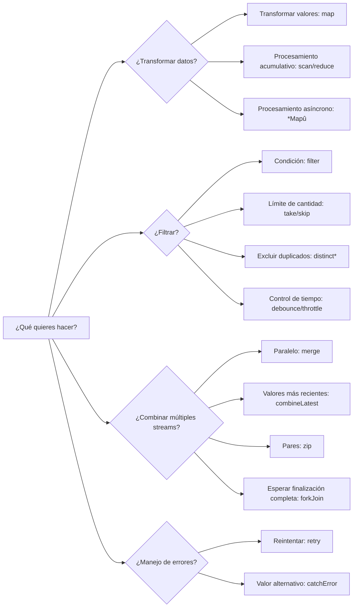
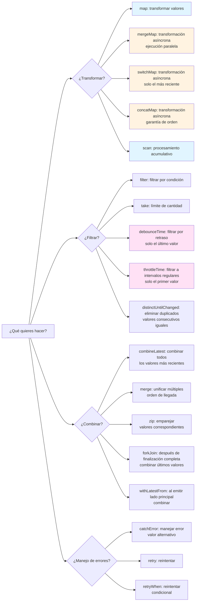
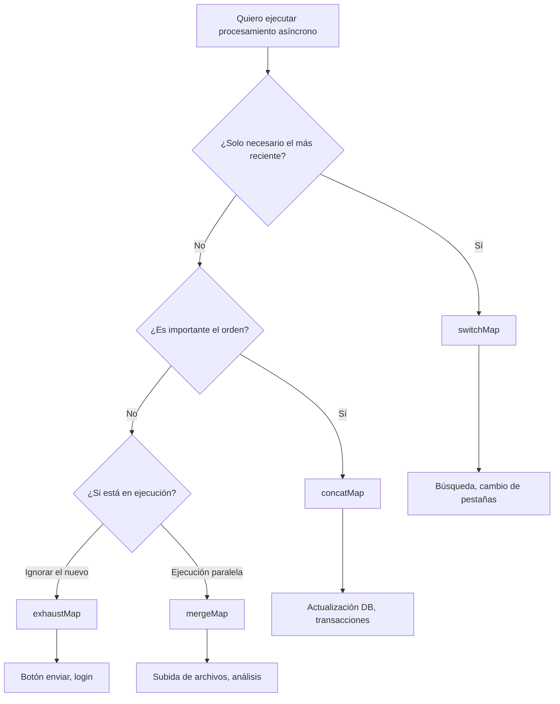

<style scoped>
.comparison-cards {
  display: grid;
  grid-template-columns: 1fr 1fr;
  gap: 1rem;
  margin-bottom: 2rem;
}

@media (max-width: 768px) {
  .comparison-cards {
    grid-template-columns: 1fr;
  }
}

/* Aumentar el tamaño de fuente de la parte del título */
.comparison-cards .tip .custom-block-title {
  font-size: 1.1rem;
  font-weight: 600;
}
</style>

# La confusión de selección de operadores

RxJS tiene más de 100 tipos de operadores, y **dudar sobre cuál usar** es una dificultad que todos experimentan. Esta página proporciona criterios de selección prácticos y diagramas de flujo.

## Criterios para elegir entre más de 100 operadores

### Problema: Demasiadas opciones

```typescript
// Quiero transformar un array... ¿map? ¿scan? ¿reduce? ¿toArray?
// Quiero llamar múltiples APIs... ¿mergeMap? ¿switchMap? ¿concatMap? ¿exhaustMap?
// Quiero filtrar valores... ¿filter? ¿take? ¿first? ¿distinctUntilChanged?
// Quiero combinar múltiples streams... ¿merge? ¿combineLatest? ¿zip? ¿forkJoin?
```

### Solución: Acotar por categoría + propósito



### Diagrama de flujo de selección más detallado

El siguiente diagrama de flujo muestra el procedimiento para elegir operadores según propósitos específicos.



## 1. Operadores de transformación (Transformation)

**¿Cuándo usar?** Cuando quieres cambiar la forma de los datos, llamar procesamiento asíncrono

| Operador | Propósito | Casos de uso comunes |
|---|---|---|
| **map** | Transformación 1:1 de valores | Obtener propiedades, cálculos, conversión de tipos |
| **scan** | Procesamiento acumulativo (fluye valores intermedios) | Contador, suma, historial |
| **reduce** | Procesamiento acumulativo (solo valor final) | Suma de array, valor máximo |
| **mergeMap** | Ejecución paralela de procesamiento asíncrono | Llamadas paralelas a múltiples APIs |
| **switchMap** | Cambiar procesamiento asíncrono | API de búsqueda (solo el más reciente) |
| **concatMap** | Ejecución secuencial de procesamiento asíncrono | Procesamiento donde el orden es importante |
| **exhaustMap** | Ignorar nuevo procesamiento durante ejecución | Prevención de clics múltiples (botón enviar) |

### Ejemplo práctico: Selección por caso de uso

#### Caso de uso 1: Obtener propiedad
```typescript
import { of } from 'rxjs';
import { map } from 'rxjs';

interface User { id: number; name: string; }

of({ id: 1, name: 'Alice' }).pipe(
  map(user => user.name) // Transformación 1:1 de valor ’ map
).subscribe(name => console.log(name)); // 'Alice'
```

#### Caso de uso 2: Contador
```typescript
import { fromEvent } from 'rxjs';
import { scan } from 'rxjs';

const button = document.querySelector('button')!;

fromEvent(button, 'click').pipe(
  scan(count => count + 1, 0) // Procesamiento acumulativo ’ scan
).subscribe(count => console.log(`Número de clics: ${count}`));
```

#### Caso de uso 3: Llamada a API de búsqueda
```typescript
import { fromEvent } from 'rxjs';
import { debounceTime, map, switchMap } from 'rxjs';

const searchInput = document.querySelector('input')!;

fromEvent(searchInput, 'input').pipe(
  debounceTime(300),
  map(e => (e.target as HTMLInputElement).value),
  switchMap(query => searchAPI(query)) // Solo el más reciente ’ switchMap
).subscribe(results => console.log(results));
```

## 2. Operadores de filtrado (Filtering)

### ¿Cuándo usar?
Cuando quieres seleccionar valores, controlar el timing

| Operador | Propósito | Casos de uso comunes |
|---|---|---|
| **filter** | Pasar solo valores que cumplen condición | Solo números pares, solo valores no nulos |
| **take** | Solo los primeros N | Obtener primeros 5 elementos |
| **first** | Solo el primero | Obtener valor inicial |
| **distinctUntilChanged** | Solo valores diferentes del anterior | Excluir duplicados |
| **debounceTime** | Emitir después de tiempo transcurrido | Entrada de búsqueda (después de completar entrada) |
| **throttleTime** | Reducir a intervalos regulares | Evento de scroll |

### Ejemplo práctico: Selección por caso de uso

#### Caso de uso 1: Obtener solo números pares
```typescript
import { of } from 'rxjs';
import { filter } from 'rxjs';

of(1, 2, 3, 4, 5).pipe(
  filter(n => n % 2 === 0) // Solo valores que cumplen condición ’ filter
).subscribe(console.log); // 2, 4
```

#### Caso de uso 2: Optimización de entrada de búsqueda
```typescript
import { fromEvent } from 'rxjs';
import { debounceTime, distinctUntilChanged, map } from 'rxjs';

const input = document.querySelector('input')!;

fromEvent(input, 'input').pipe(
  debounceTime(300),              // Esperar finalización de entrada ’ debounceTime
  map(e => (e.target as HTMLInputElement).value),
  distinctUntilChanged()          // Excluir duplicados ’ distinctUntilChanged
).subscribe(query => console.log('Búsqueda:', query));
```

#### Caso de uso 3: Reducción de eventos de scroll
```typescript
import { fromEvent } from 'rxjs';
import { throttleTime } from 'rxjs';

fromEvent(window, 'scroll').pipe(
  throttleTime(200) // Solo una vez cada 200ms ’ throttleTime
).subscribe(() => console.log('Posición de scroll:', window.scrollY));
```

## 3. Operadores de combinación (Combination)

### ¿Cuándo usar?
Cuando quieres combinar múltiples streams

| Operador | Propósito | Casos de uso comunes |
|---|---|---|
| **merge** | Múltiples streams en paralelo | Monitoreo de múltiples eventos |
| **combineLatest** | Combinar todos los valores más recientes | Validación de formularios |
| **zip** | Emparejar valores correspondientes | Relacionar resultados de 2 APIs |
| **forkJoin** | Resultados en array después de finalización completa | Ejecución paralela de múltiples APIs |
| **withLatestFrom** | Stream principal + valor auxiliar | Evento + estado actual |

### Ejemplo práctico: Selección por caso de uso

#### Caso de uso 1: Monitorear múltiples eventos
```typescript
import { fromEvent, merge } from 'rxjs';

const clicks$ = fromEvent(document, 'click');
const keypresses$ = fromEvent(document, 'keypress');

merge(clicks$, keypresses$).pipe() // Monitoreo paralelo ’ merge
  .subscribe(() => console.log('Ocurrió algún evento'));
```

#### Caso de uso 2: Validación de formularios
```typescript
import { combineLatest } from 'rxjs';
import { map } from 'rxjs';

const email$ = getFormControl('email');
const password$ = getFormControl('password');

combineLatest([email$, password$]).pipe( // Todos los valores más recientes ’ combineLatest
  map(([email, password]) => email.length > 0 && password.length > 7)
).subscribe(isValid => console.log('Formulario válido:', isValid));
```

#### Caso de uso 3: Ejecución paralela de múltiples APIs
```typescript
import { forkJoin } from 'rxjs';

forkJoin({
  user: getUserAPI(),
  posts: getPostsAPI(),
  comments: getCommentsAPI()
}).subscribe(({ user, posts, comments }) => { // Espera finalización completa ’ forkJoin
  console.log('Obtención completa de todos los datos', { user, posts, comments });
});
```

## Los 20 operadores más usados

Los siguientes son los operadores **más utilizados frecuentemente** en el trabajo. Primero domina estos 20.

<div class="comparison-cards">

::: tip >G Más frecuentes (obligatorios)
1. **map** - Transformar valores
2. **filter** - Filtrar por condición
3. **switchMap** - Búsqueda, etc., solo necesario el más reciente
4. **tap** - Depuración, efectos secundarios
5. **take** - Primeros N
6. **first** - Primero 1
7. **catchError** - Manejo de errores
8. **takeUntil** - Cancelar suscripción
:::

::: tip >H Frecuentes (uso común)
9. **mergeMap** - Procesamiento asíncrono paralelo
10. **debounceTime** - Esperar finalización de entrada
11. **distinctUntilChanged** - Excluir duplicados
12. **combineLatest** - Combinar múltiples valores
13. **startWith** - Establecer valor inicial
14. **scan** - Procesamiento acumulativo
15. **shareReplay** - Cachear resultados
:::

::: tip >I Uso común (deberías conocer)
16. **concatMap** - Procesamiento secuencial
17. **throttleTime** - Reducción de eventos
18. **withLatestFrom** - Obtener valor auxiliar
19. **forkJoin** - Espera de múltiples APIs
20. **retry** - Procesamiento de reintento
:::

</div>


## switchMap vs mergeMap vs concatMap vs exhaustMap

Estos 4 son los operadores **más confundidos**. Entendamos claramente sus diferencias.

### Tabla comparativa

| Operador | Método de ejecución | Procesamiento anterior | Nuevo procesamiento | Dónde usar |
|---|---|---|---|---|
| **switchMap** | Cambiar | **Cancelar** | Iniciar inmediatamente | Búsqueda, autocompletar |
| **mergeMap** | Ejecución paralela | Continuar | Iniciar inmediatamente | Subida de archivos, análisis |
| **concatMap** | Ejecución secuencial | Esperar finalización | **Iniciar después de esperar** | Procesamiento donde el orden es importante |
| **exhaustMap** | Ignorar durante ejecución | Continuar | **Ignorar** | Prevención de clics múltiples en botón |

### Comparación con diagramas de mármol

```
Exterior: ----A----B----C----|

Interior: A ’ --1--2|
      B ’ --3--4|
      C ’ --5--6|

switchMap:  ----1--3--5--6|  (A se cancela antes de 2, B se cancela antes de 4)
mergeMap:   ----1-23-45-6|   (todo ejecución paralela)
concatMap:  ----1--2--3--4--5--6|  (ejecución secuencial)
exhaustMap: ----1--2|            (B, C se ignoran)
```

### Ejemplo práctico: Diferencia de los 4 en el mismo procesamiento

**Situación**: Llamar API (tarda 1 segundo) con cada clic del botón. Usuario hace clic cada 0.5 segundos.

#### switchMap - Óptimo para búsqueda

```typescript
import { fromEvent } from 'rxjs';
import { switchMap } from 'rxjs';

fromEvent(button, 'click').pipe(
  switchMap(() => searchAPI()) // Solo ejecutar el más reciente, cancelar solicitudes antiguas
).subscribe(result => console.log(result));

// 0.0 seg: Clic1 ’ Inicio API1
// 0.5 seg: Clic2 ’ Cancelar API1, Inicio API2
// 1.0 seg: Clic3 ’ Cancelar API2, Inicio API3
// 2.0 seg: Completar API3 ’ Mostrar resultado (solo API3)
```

::: tip =¡ Dónde usar
- **Búsqueda/autocompletar**: Solo necesario el valor de entrada más reciente
- **Cambio de pestañas**: Solo necesarios datos de la pestaña mostrada
- **Paginación**: Solo mostrar la página más reciente
:::

#### mergeMap - Óptimo para procesamiento paralelo

```typescript
import { fromEvent } from 'rxjs';
import { mergeMap } from 'rxjs';

fromEvent(button, 'click').pipe(
  mergeMap(() => uploadFileAPI()) // Todo ejecución paralela
).subscribe(result => console.log(result));

// 0.0 seg: Clic1 ’ Inicio API1
// 0.5 seg: Clic2 ’ Inicio API2 (API1 continúa)
// 1.0 seg: Clic3 ’ Inicio API3 (API1, API2 continúan)
// 1.0 seg: Completar API1 ’ Mostrar resultado
// 1.5 seg: Completar API2 ’ Mostrar resultado
// 2.0 seg: Completar API3 ’ Mostrar resultado
```

::: tip =¡ Dónde usar
- **Subida de archivos**: Subir múltiples archivos simultáneamente
- **Análisis/envío de logs**: Ejecutar procesamientos independientes en paralelo
- **Sistema de notificaciones**: Procesar múltiples notificaciones simultáneamente
:::

#### concatMap - Óptimo para procesamiento donde el orden es importante

```typescript
import { fromEvent } from 'rxjs';
import { concatMap } from 'rxjs';

fromEvent(button, 'click').pipe(
  concatMap(() => updateDatabaseAPI()) // Ejecución secuencial (esperar finalización anterior)
).subscribe(result => console.log(result));

// 0.0 seg: Clic1 ’ Inicio API1
// 0.5 seg: Clic2 ’ Esperar (añadir a cola)
// 1.0 seg: Clic3 ’ Esperar (añadir a cola)
// 1.0 seg: Completar API1 ’ Mostrar resultado, Inicio API2
// 2.0 seg: Completar API2 ’ Mostrar resultado, Inicio API3
// 3.0 seg: Completar API3 ’ Mostrar resultado
```

::: tip =¡ Dónde usar
- **Actualización de base de datos**: Procesamiento de escritura donde el orden es importante
- **Transacciones**: Usar resultado del procesamiento anterior en el siguiente
- **Animaciones**: Procesos que quieres ejecutar en orden
:::

#### exhaustMap - Óptimo para prevención de clics múltiples

```typescript
import { fromEvent } from 'rxjs';
import { exhaustMap } from 'rxjs';

fromEvent(button, 'click').pipe(
  exhaustMap(() => submitFormAPI()) // Ignorar nuevas solicitudes durante ejecución
).subscribe(result => console.log(result));

// 0.0 seg: Clic1 ’ Inicio API1
// 0.5 seg: Clic2 ’ Ignorar (API1 en ejecución)
// 1.0 seg: Clic3 ’ Ignorar (API1 en ejecución)
// 1.0 seg: Completar API1 ’ Mostrar resultado
// 1.5 seg: Clic4 ’ Inicio API4 (anterior ya completado)
```

::: tip =¡ Dónde usar
- **Botón enviar**: Prevención de envío doble
- **Procesamiento de login**: Prevenir errores por clics múltiples
- **Procesamiento de pago**: Prevenir ejecución duplicada
:::

### Diagrama de flujo de selección



## Criterios de decisión en la práctica

### Paso 1: Clarificar qué quieres lograr

```typescript
// L Mal ejemplo: Usar mergeMap sin más
observable$.pipe(
  mergeMap(value => someAPI(value))
);

//  Buen ejemplo: Elegir después de clarificar el propósito
// Propósito: Para la entrada de búsqueda del usuario, quiero mostrar solo el resultado más reciente
// ’ Debería cancelar solicitudes antiguas ’ switchMap
searchInput$.pipe(
  switchMap(query => searchAPI(query))
);
```

### Paso 2: Considerar el rendimiento

#### Elección de debounceTime vs throttleTime

```typescript
// Entrada de búsqueda: Ejecutar después de que el usuario "complete" la entrada
searchInput$.pipe(
  debounceTime(300), // Ejecutar si no hay entrada durante 300ms
  switchMap(query => searchAPI(query))
);

// Scroll: Ejecutar a intervalos regulares (prevenir alta frecuencia)
scroll$.pipe(
  throttleTime(200), // Solo ejecutar una vez cada 200ms
  tap(() => loadMoreItems())
);
```

### Paso 3: Incorporar manejo de errores

```typescript
import { of } from 'rxjs';
import { catchError, retry, switchMap } from 'rxjs';

searchInput$.pipe(
  debounceTime(300),
  switchMap(query =>
    searchAPI(query).pipe(
      retry(2),                          // Reintentar hasta 2 veces
      catchError(err => {
        console.error('Error de búsqueda:', err);
        return of([]);                   // Devolver array vacío
      })
    )
  )
).subscribe(results => console.log(results));
```

### Paso 4: Prevenir fugas de memoria

```typescript
import { Subject } from 'rxjs';
import { switchMap, takeUntil } from 'rxjs';

class SearchComponent {
  private destroy$ = new Subject<void>();

  ngOnInit() {
    searchInput$.pipe(
      debounceTime(300),
      switchMap(query => searchAPI(query)),
      takeUntil(this.destroy$)           // Cancelar al destruir componente
    ).subscribe(results => console.log(results));
  }

  ngOnDestroy() {
    this.destroy$.next();
    this.destroy$.complete();
  }
}
```

## Lista de verificación de comprensión

Verifica si puedes responder a las siguientes preguntas.

```markdown
## Comprensión básica
- [ ] Puedo clasificar operadores por categoría (transformación, filtrado, combinación)
- [ ] Puedo explicar más de 10 de los 20 operadores más usados
- [ ] Puedo explicar las diferencias entre switchMap, mergeMap, concatMap, exhaustMap

## Selección práctica
- [ ] Puedo elegir operadores adecuados para función de búsqueda (switchMap + debounceTime)
- [ ] Puedo elegir operadores adecuados para llamadas paralelas a múltiples APIs (forkJoin or mergeMap)
- [ ] Puedo elegir operadores adecuados para validación de formularios (combineLatest)

## Rendimiento
- [ ] Puedo diferenciar el uso de debounceTime y throttleTime
- [ ] Conozco métodos de optimización para eventos de alta frecuencia
- [ ] Puedo implementar patrones para prevenir fugas de memoria

## Manejo de errores
- [ ] Puedo usar catchError y retry en combinación
- [ ] Puedo implementar procesamiento de fallback en caso de error
- [ ] Puedo dar feedback de errores al usuario
```

## Próximos pasos

Una vez que entiendas la selección de operadores, aprende sobre **timing y orden**.

’ **Comprensión de timing y orden** (en preparación) - Cuándo fluyen los valores, comprensión de sincronía vs asincronía

## Páginas relacionadas

- **[Chapter 4: Comprensión de operadores](/es/guide/operators/)** - Detalles de todos los operadores
- **[Chapter 13: Colección de patrones prácticos](/es/guide/)** - Casos de uso reales (en preparación)
- **[Chapter 10: Errores comunes y soluciones](/es/guide/anti-patterns/common-mistakes)** - Antipatrones de selección inadecuada de operadores

## <¯ Ejercicios de práctica

### Problema 1: Seleccionar operador adecuado

Elige el operador más óptimo para los siguientes escenarios.

1. Usuario ingresa en caja de búsqueda ’ Llamada a API
2. Clic de botón para subir múltiples archivos
3. Determinar si todos los campos del formulario son válidos
4. Prevenir clics múltiples en botón enviar

<details>
<summary>Ejemplo de respuesta</summary>

**1. Caja de búsqueda ’ Llamada a API**
```typescript
searchInput$.pipe(
  debounceTime(300),      // Esperar finalización de entrada
  distinctUntilChanged(), // Excluir duplicados
  switchMap(query => searchAPI(query)) // Solo el más reciente
).subscribe(results => displayResults(results));
```
> [!NOTE]Razón
> La búsqueda solo necesita el resultado más reciente, por lo que `switchMap`. Espera finalización de entrada con `debounceTime`.

---

**2. Subir múltiples archivos**
```typescript
fromEvent(uploadButton, 'click').pipe(
  mergeMap(() => {
    const files = getSelectedFiles();
    return forkJoin(files.map(file => uploadFileAPI(file)));
  })
).subscribe(results => console.log('Subida completa de todos los archivos', results));
```
> [!NOTE]Razón
> Para subir múltiples archivos en paralelo, `forkJoin`. También es posible `mergeMap` para procesamientos independientes.

---

**3. Validez de todos los campos del formulario**
```typescript
combineLatest([
  emailField$,
  passwordField$,
  agreeTerms$
]).pipe(
  map(([email, password, agreed]) =>
    email.valid && password.valid && agreed
  )
).subscribe(isValid => submitButton.disabled = !isValid);
```

> [!NOTE]Razón
> Para combinar los valores más recientes de todos los campos, `combineLatest`.

---

**4. Prevención de clics múltiples en botón enviar**
```typescript
fromEvent(submitButton, 'click').pipe(
  exhaustMap(() => submitFormAPI())
).subscribe(result => console.log('Envío completado', result));
```
> [!NOTE]Razón
> Para proteger el procesamiento en ejecución e ignorar nuevos clics, `exhaustMap`.

</details>

### Problema 2: Elección de switchMap y mergeMap

El siguiente código usa `mergeMap`, pero hay un problema. Corrígelo.

```typescript
searchInput$.pipe(
  debounceTime(300),
  mergeMap(query => searchAPI(query))
).subscribe(results => displayResults(results));
```

<details>
<summary>Ejemplo de respuesta</summary>

```typescript
searchInput$.pipe(
  debounceTime(300),
  switchMap(query => searchAPI(query)) // mergeMap ’ switchMap
).subscribe(results => displayResults(results));
```

> [!IMPORTANT] Problema
> - Con `mergeMap`, todas las solicitudes de búsqueda se ejecutan en paralelo
> - Si el usuario ingresa "a"’"ab"’"abc", se ejecutan las 3 solicitudes
> - Solicitudes antiguas (resultado de "a") pueden regresar después y sobrescribir el resultado más reciente

> [!NOTE] Razón de corrección
> - Usando `switchMap`, cuando comienza una nueva búsqueda, se cancelan las solicitudes antiguas
> - Siempre se muestra solo el resultado de búsqueda más reciente

</details>

### Problema 3: Escenario práctico

Escribe código que cumpla los siguientes requisitos.

> [!NOTE] Puntos clave
> - Usuario hace clic en botón
> - Obtener en paralelo 3 APIs (información de usuario, lista de posts, lista de comentarios)
> - Mostrar datos cuando todo esté completo
> - Si ocurre error, devolver datos vacíos
> - Cancelar suscripción al destruir componente

<details>
<summary>Ejemplo de respuesta</summary>

```typescript
import { fromEvent, forkJoin, of, Subject } from 'rxjs';
import { switchMap, catchError, takeUntil } from 'rxjs';

class DataComponent {
  private destroy$ = new Subject<void>();
  private button = document.querySelector('button')!;

  ngOnInit() {
    fromEvent(this.button, 'click').pipe(
      switchMap(() =>
        forkJoin({
          user: this.getUserAPI().pipe(
            catchError(() => of(null))
          ),
          posts: this.getPostsAPI().pipe(
            catchError(() => of([]))
          ),
          comments: this.getCommentsAPI().pipe(
            catchError(() => of([]))
          )
        })
      ),
      takeUntil(this.destroy$)
    ).subscribe(({ user, posts, comments }) => {
      console.log('Obtención de datos completada', { user, posts, comments });
    });
  }

  ngOnDestroy() {
    this.destroy$.next();
    this.destroy$.complete();
  }

  private getUserAPI() { /* ... */ }
  private getPostsAPI() { /* ... */ }
  private getCommentsAPI() { /* ... */ }
}
```

> [!NOTE] Puntos
> - `forkJoin` ejecuta 3 APIs en paralelo y espera finalización completa
> - Establecer valor de fallback en caso de error con `catchError` en cada API
> - `switchMap` cambia a nueva solicitud con cada clic del botón
> - Cancelación automática al destruir componente con `takeUntil`

</details>
