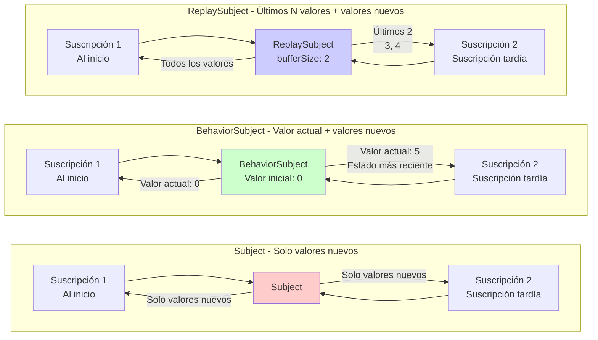

# Dificultad de la gestión de estado

En RxJS, requisitos como **"compartir estado entre múltiples componentes" o "cachear resultados de API"** son muy comunes, pero elegir el método adecuado es difícil. Esta página explica patrones prácticos para la gestión de estado y compartición de streams.

## Subject vs BehaviorSubject vs ReplaySubject

### Tipos y características de Subject

| Subject | Valor inicial | Comportamiento al suscribirse | Casos de uso comunes |
|---|---|---|---|
| **Subject** | Ninguno | Solo recibe valores posteriores a la suscripción | Event bus, sistema de notificaciones |
| **BehaviorSubject** | Requerido | Recibe el último valor inmediatamente | Estado actual (estado de login, item seleccionado) |
| **ReplaySubject** | Ninguno | Recibe los últimos N valores | Historial, logs, registro de operaciones |
| **AsyncSubject** | Ninguno | Solo recibe el valor final al completarse | Resultado asíncrono único (raramente usado) |

### Visualización de las diferencias de comportamiento de cada Subject

El siguiente diagrama muestra qué valores recibe cada Subject al suscribirse.



> [!TIP] Criterios de selección
> - **Subject**: Notificación de eventos (no se necesita el pasado)
> - **BehaviorSubject**: Gestión de estado (se necesita el valor actual)
> - **ReplaySubject**: Gestión de historial (se necesitan los últimos N valores)

### Ejemplo práctico 1: Subject (Event bus)

#### L Mal ejemplo: No se pueden recibir valores anteriores a la suscripción
```typescript
import { Subject } from 'rxjs';

const notifications$ = new Subject<string>();

notifications$.next('Notificación 1'); // Nadie está suscrito aún

notifications$.subscribe(msg => {
  console.log('Recibido:', msg);
});

notifications$.next('Notificación 2');
notifications$.next('Notificación 3');

// Salida:
// Recibido: Notificación 2
// Recibido: Notificación 3
// ('Notificación 1' no se recibe)
```

####  Buen ejemplo: Usar como event bus (solo procesar eventos después de la suscripción)
```typescript
import { filter, map, Subject } from 'rxjs';

class EventBus {
  private events$ = new Subject<{ type: string; payload: any }>();

  emit(type: string, payload: any) {
    this.events$.next({ type, payload });
  }

  on(type: string) {
    return this.events$.pipe(
      filter(event => event.type === type),
      map(event => event.payload)
    );
  }
}

const bus = new EventBus();

// Iniciar suscripción
bus.on('userLogin').subscribe(user => {
  console.log('Login:', user);
});

// Emitir evento
bus.emit('userLogin', { id: 1, name: 'Alice' }); //  Se recibe
// Login: {id: 1, name: 'Alice'}
```

> [!TIP] Cuándo usar Subject
> - **Arquitectura basada en eventos**: Comunicación desacoplada entre componentes
> - **Sistema de notificaciones**: Entrega de notificaciones en tiempo real
> - **Cuando no se necesitan valores pasados**: Solo procesar eventos después de la suscripción

### Ejemplo práctico 2: BehaviorSubject (Gestión de estado)

#### L Mal ejemplo: Con Subject no se conoce el estado actual
```typescript
import { Subject } from 'rxjs';

const isLoggedIn$ = new Subject<boolean>();

// Usuario inicia sesión
isLoggedIn$.next(true);

// Componente suscrito posteriormente
isLoggedIn$.subscribe(status => {
  console.log('Estado de login:', status); // No se imprime nada
});
```

####  Buen ejemplo: Obtener estado actual inmediatamente con BehaviorSubject
```typescript
import { BehaviorSubject } from 'rxjs';

class AuthService {
  private isLoggedIn$ = new BehaviorSubject<boolean>(false); // Valor inicial: false

  login(username: string, password: string) {
    // Proceso de login...
    this.isLoggedIn$.next(true);
  }

  logout() {
    this.isLoggedIn$.next(false);
  }

  // Exponer como solo lectura externamente
  get isLoggedIn() {
    return this.isLoggedIn$.asObservable();
  }

  // Obtener valor actual sincrónicamente (solo en casos especiales)
  get currentStatus(): boolean {
    return this.isLoggedIn$.value;
  }
}

const auth = new AuthService();

auth.login('user', 'pass');

// Aunque se suscriba después, puede obtener el estado actual (true) inmediatamente
auth.isLoggedIn.subscribe(status => {
  console.log('Estado de login:', status); // Estado de login: true
});
```

> [!TIP] Cuándo usar BehaviorSubject
> - **Mantener estado actual**: Estado de login, item seleccionado, valores de configuración
> - **Necesitar valor inmediatamente al suscribirse**: Cuando se necesita el estado actual para la visualización inicial de UI
> - **Monitorear cambios de estado**: Actualizar reactivamente cuando cambia el estado

### Ejemplo práctico 3: ReplaySubject (Gestión de historial)

####  Buen ejemplo: Reproducir los últimos N valores
```typescript
import { ReplaySubject } from 'rxjs';

class SearchHistoryService {
  // Mantener las últimas 5 búsquedas
  private history$ = new ReplaySubject<string>(5);

  addSearch(query: string) {
    this.history$.next(query);
  }

  getHistory() {
    return this.history$.asObservable();
  }
}

const searchHistory = new SearchHistoryService();

// Ejecutar búsquedas
searchHistory.addSearch('TypeScript');
searchHistory.addSearch('RxJS');
searchHistory.addSearch('Angular');

// Aunque se suscriba después, puede obtener las últimas 3 búsquedas inmediatamente
searchHistory.getHistory().subscribe(query => {
  console.log('Historial de búsqueda:', query);
});

// Salida:
// Historial de búsqueda: TypeScript
// Historial de búsqueda: RxJS
// Historial de búsqueda: Angular
```

> [!TIP] Cuándo usar ReplaySubject
> - **Historial de operaciones**: Historial de búsqueda, edición, navegación
> - **Logs y trazas de auditoría**: Registrar operaciones pasadas
> - **Soporte para suscripción tardía**: Cuando se quiere recibir valores pasados aunque la suscripción se retrase

## Diferencias entre share y shareReplay

### Problema: Ejecución duplicada de Observable Cold

#### L Mal ejemplo: API llamada múltiples veces con múltiples suscripciones
```typescript
import { ajax } from 'rxjs/ajax';

const users$ = ajax.getJSON('/api/users');

// Suscripción 1
users$.subscribe(users => {
  console.log('Componente A:', users);
});

// Suscripción 2
users$.subscribe(users => {
  console.log('Componente B:', users);
});

// Problema: API llamada 2 veces
// GET /api/users (1ª vez)
// GET /api/users (2ª vez)
```

####  Buen ejemplo: Convertir a Hot con share (compartir ejecución)
```typescript
import { ajax } from 'rxjs/ajax';
import { share } from 'rxjs';

const users$ = ajax.getJSON('/api/users').pipe(
  share() // Compartir ejecución
);

// Suscripción 1
users$.subscribe(users => {
  console.log('Componente A:', users);
});

// Suscripción 2 (si se suscribe inmediatamente)
users$.subscribe(users => {
  console.log('Componente B:', users);
});

//  API llamada solo 1 vez
// GET /api/users (solo una vez)
```

> [!WARNING] Trampa de share
> `share()` **resetea el stream cuando se cancela la última suscripción**. Se ejecutará de nuevo la próxima vez que se suscriba.
>
> ```typescript
> const data$ = fetchData().pipe(share());
>
> // Suscripción 1
> const sub1 = data$.subscribe();
>
> // Suscripción 2
> const sub2 = data$.subscribe();
>
> sub1.unsubscribe();
> sub2.unsubscribe(); // Todos cancelados ’ Reset
>
> // Re-suscripción ’ fetchData() se ejecuta de nuevo
> data$.subscribe();
> ```

### shareReplay: Cachear y reutilizar resultados

####  Buen ejemplo: Cachear con shareReplay
```typescript
import { ajax } from 'rxjs/ajax';
import { shareReplay } from 'rxjs';

const users$ = ajax.getJSON('/api/users').pipe(
  shareReplay({ bufferSize: 1, refCount: true })
  // bufferSize: 1 ’ Cachear el último valor
  // refCount: true ’ Limpiar caché cuando se cancelen todas las suscripciones
);

// Suscripción 1
users$.subscribe(users => {
  console.log('Componente A:', users);
});

// Suscripción 2 después de 1 segundo (aunque se suscriba tarde, obtiene desde caché)
setTimeout(() => {
  users$.subscribe(users => {
    console.log('Componente B:', users); // Obtiene inmediatamente desde caché
  });
}, 1000);

//  API llamada solo 1 vez, resultado cacheado
```

### Comparación entre share y shareReplay

| Característica | share() | shareReplay(1) |
|---|---|---|
| **Nueva suscripción durante suscripciones activas** | Comparte el mismo stream | Comparte el mismo stream |
| **Suscripción tardía** | Solo recibe nuevos valores | Recibe el último valor cacheado |
| **Después de cancelar todas las suscripciones** | Reset del stream | Mantiene caché (si refCount: false) |
| **Memoria** | No mantiene | Mantiene caché |
| **Caso de uso** | Compartir datos en tiempo real | Cachear resultados de API |

####  Buen ejemplo: Configuración apropiada de shareReplay
```typescript
import { shareReplay } from 'rxjs';

// Patrón 1: Caché persistente (no recomendado)
const data1$ = fetchData().pipe(
  shareReplay({ bufferSize: 1, refCount: false })
  // refCount: false ’ Cuidado con memory leaks
);

// Patrón 2: Caché con limpieza automática (recomendado)
const data2$ = fetchData().pipe(
  shareReplay({ bufferSize: 1, refCount: true })
  // refCount: true ’ Limpiar caché cuando se cancelen todas las suscripciones
);

// Patrón 3: Caché con TTL (RxJS 7.4+)
const data3$ = fetchData().pipe(
  shareReplay({
    bufferSize: 1,
    refCount: true,
    windowTime: 5000 // Descartar caché después de 5 segundos
  })
);
```

> [!IMPORTANT] Advertencia sobre memory leaks
> Usar `shareReplay({ refCount: false })` deja la caché persistente, causando memory leaks. Básicamente **use refCount: true**.

## Uso práctico de Hot vs Cold

### Características de Cold: Ejecución por cada suscripción

```typescript
import { Observable } from 'rxjs';

const cold$ = new Observable<number>(subscriber => {
  console.log('=5 Inicio de ejecución');
  subscriber.next(Math.random());
  subscriber.complete();
});

cold$.subscribe(v => console.log('Suscripción 1:', v));
cold$.subscribe(v => console.log('Suscripción 2:', v));

// Salida:
// =5 Inicio de ejecución
// Suscripción 1: 0.123
// =5 Inicio de ejecución
// Suscripción 2: 0.456
// (Se ejecuta 2 veces, valores diferentes)
```

### Características de Hot: Ejecución compartida

```typescript
import { Subject } from 'rxjs';

const hot$ = new Subject<number>();

hot$.subscribe(v => console.log('Suscripción 1:', v));
hot$.subscribe(v => console.log('Suscripción 2:', v));

hot$.next(Math.random());

// Salida:
// Suscripción 1: 0.789
// Suscripción 2: 0.789
// (Mismo valor compartido)
```

### Criterios de selección

| Requisito | Cold | Hot |
|---|---|---|
| **Necesitar ejecución independiente** |  | L |
| **Compartir ejecución** | L |  |
| **Valores diferentes por suscriptor** |  | L |
| **Entrega de datos en tiempo real** | L |  |
| **Compartir llamadas API** | L (convertir con share) |  |

####  Buen ejemplo: Conversión apropiada
```typescript
import { interval, fromEvent } from 'rxjs';
import { share, shareReplay } from 'rxjs';

// Cold: Cada suscriptor tiene temporizador independiente
const coldTimer$ = interval(1000);

// Cold’Hot: Compartir temporizador
const hotTimer$ = interval(1000).pipe(share());

// Cold: Eventos de clic (registro de listener independiente por suscripción)
const clicks$ = fromEvent(document, 'click');

// Cold’Hot: Cachear resultados de API
const cachedData$ = ajax.getJSON('/api/data').pipe(
  shareReplay({ bufferSize: 1, refCount: true })
);
```

## Patrón de gestión centralizada de estado

### Patrón 1: Gestión de estado con clase Service

```typescript
import { BehaviorSubject, Observable } from 'rxjs';
import { map } from 'rxjs';

interface User {
  id: number;
  name: string;
  email: string;
}

class UserStore {
  // BehaviorSubject privado
  private users$ = new BehaviorSubject<User[]>([]);

  // Observable público de solo lectura
  get users(): Observable<User[]> {
    return this.users$.asObservable();
  }

  // Obtener usuario específico
  getUser(id: number): Observable<User | undefined> {
    return this.users.pipe(
      map(users => users.find(u => u.id === id))
    );
  }

  // Actualizar estado
  addUser(user: User) {
    const currentUsers = this.users$.value;
    this.users$.next([...currentUsers, user]);
  }

  updateUser(id: number, updates: Partial<User>) {
    const currentUsers = this.users$.value;
    const updatedUsers = currentUsers.map(u =>
      u.id === id ? { ...u, ...updates } : u
    );
    this.users$.next(updatedUsers);
  }

  removeUser(id: number) {
    const currentUsers = this.users$.value;
    this.users$.next(currentUsers.filter(u => u.id !== id));
  }
}

// Uso
const store = new UserStore();

// Suscripción
store.users.subscribe(users => {
  console.log('Lista de usuarios:', users);
});

// Actualización de estado
store.addUser({ id: 1, name: 'Alice', email: 'alice@example.com' });
store.updateUser(1, { name: 'Alice Smith' });
```

### Patrón 2: Gestión de estado con Scan

```typescript
import { Subject } from 'rxjs';
import { scan, startWith } from 'rxjs';

interface State {
  count: number;
  items: string[];
}

type Action =
  | { type: 'INCREMENT' }
  | { type: 'DECREMENT' }
  | { type: 'ADD_ITEM'; payload: string }
  | { type: 'RESET' };

const actions$ = new Subject<Action>();

const initialState: State = {
  count: 0,
  items: []
};

const state$ = actions$.pipe(
  scan((state, action) => {
    switch (action.type) {
      case 'INCREMENT':
        return { ...state, count: state.count + 1 };
      case 'DECREMENT':
        return { ...state, count: state.count - 1 };
      case 'ADD_ITEM':
        return { ...state, items: [...state.items, action.payload] };
      case 'RESET':
        return initialState;
      default:
        return state;
    }
  }, initialState),
  startWith(initialState)
);

// Suscripción
state$.subscribe(state => {
  console.log('Estado actual:', state);
});

// Emitir acciones
actions$.next({ type: 'INCREMENT' });
actions$.next({ type: 'ADD_ITEM', payload: 'manzana' });
actions$.next({ type: 'INCREMENT' });

// Salida:
// Estado actual: { count: 0, items: [] }
// Estado actual: { count: 1, items: [] }
// Estado actual: { count: 1, items: ['manzana'] }
// Estado actual: { count: 2, items: ['manzana'] }
```

## Trampas comunes

### Trampa 1: Exponer Subject externamente

#### L Mal ejemplo: Exponer Subject directamente
```typescript
import { BehaviorSubject } from 'rxjs';

class BadService {
  // L Se puede modificar directamente desde fuera
  public state$ = new BehaviorSubject<number>(0);
}

const service = new BadService();

// Se puede modificar desde fuera
service.state$.next(999); // L Encapsulación rota
```

####  Buen ejemplo: Proteger con asObservable()
```typescript
import { BehaviorSubject } from 'rxjs';

class GoodService {
  private _state$ = new BehaviorSubject<number>(0);

  // Exponer como solo lectura
  get state() {
    return this._state$.asObservable();
  }

  // Solo modificable a través de métodos dedicados
  increment() {
    this._state$.next(this._state$.value + 1);
  }

  decrement() {
    this._state$.next(this._state$.value - 1);
  }
}

const service = new GoodService();

//  Solo lectura posible
service.state.subscribe(value => console.log(value));

//  Modificación a través de métodos dedicados
service.increment();

// L No se puede modificar directamente (error de compilación)
// service.state.next(999); // Error: Property 'next' does not exist
```

### Trampa 2: Memory leak con shareReplay

#### L Mal ejemplo: Memory leak con refCount: false
```typescript
import { interval } from 'rxjs';
import { shareReplay, take } from 'rxjs';

const data$ = interval(1000).pipe(
  take(100),
  shareReplay({ bufferSize: 1, refCount: false })
  // L refCount: false ’ Caché permanece para siempre
);

// Aunque se cancele la suscripción, el stream continúa internamente
const sub = data$.subscribe();
sub.unsubscribe();

// Caché permanece ’ Memory leak
```

####  Buen ejemplo: Limpieza automática con refCount: true
```typescript
import { interval } from 'rxjs';
import { shareReplay, take } from 'rxjs';

const data$ = interval(1000).pipe(
  take(100),
  shareReplay({ bufferSize: 1, refCount: true })
  //  refCount: true ’ Limpieza automática al cancelar todas las suscripciones
);

const sub1 = data$.subscribe();
const sub2 = data$.subscribe();

sub1.unsubscribe();
sub2.unsubscribe(); // Todas las suscripciones canceladas ’ Stream detenido, caché limpiado
```

### Trampa 3: Obtención síncrona de valores

#### L Mal ejemplo: Depender demasiado de value
```typescript
import { BehaviorSubject } from 'rxjs';

class CounterService {
  private count$ = new BehaviorSubject(0);

  increment() {
    // L Depender demasiado de value
    const current = this.count$.value;
    this.count$.next(current + 1);
  }

  // L Exponer obtención síncrona
  getCurrentCount(): number {
    return this.count$.value;
  }
}
```

####  Buen ejemplo: Mantener reactivo
```typescript
import { BehaviorSubject } from 'rxjs';
import { map } from 'rxjs';

class CounterService {
  private count$ = new BehaviorSubject(0);

  get count() {
    return this.count$.asObservable();
  }

  increment() {
    //  Usar value internamente está bien
    this.count$.next(this.count$.value + 1);
  }

  //  Devolver Observable
  isPositive() {
    return this.count$.pipe(
      map(count => count > 0)
    );
  }
}
```

## Lista de verificación de comprensión

Verifique si puede responder las siguientes preguntas.

```markdown
## Comprensión básica
- [ ] Explicar las diferencias entre Subject, BehaviorSubject y ReplaySubject
- [ ] Entender por qué BehaviorSubject requiere un valor inicial
- [ ] Entender el significado del bufferSize de ReplaySubject

## Hot/Cold
- [ ] Explicar las diferencias entre Observable Cold y Hot
- [ ] Explicar las diferencias entre share y shareReplay
- [ ] Entender el rol de la opción refCount de shareReplay

## Gestión de estado
- [ ] Proteger Subject sin exponerlo externamente usando asObservable()
- [ ] Implementar patrón de gestión de estado con BehaviorSubject
- [ ] Entender el patrón de gestión de estado con scan

## Gestión de memoria
- [ ] Saber cómo prevenir memory leaks de shareReplay
- [ ] Explicar las diferencias entre refCount: true y false
- [ ] Limpiar caché en el momento apropiado
```

## Siguientes pasos

Después de entender la gestión y compartición de estado, aprenda sobre **combinación de múltiples streams**.

’ **[Combinación de múltiples streams](/es/guide/overcoming-difficulties/stream-combination)** - Diferencias entre combineLatest, zip y withLatestFrom

## Páginas relacionadas

- **[Chapter 5: ¿Qué es Subject?](/es/guide/subjects/what-is-subject)** - Fundamentos de Subject
- **[Chapter 5: Tipos de Subject](/es/guide/subjects/types-of-subject)** - Detalles de BehaviorSubject y ReplaySubject
- **[Operador share()](/es/guide/operators/multicasting/share)** - Explicación detallada de share
- **[Mal uso de shareReplay](/es/guide/anti-patterns/common-mistakes#4-sharereplay-n¤()** - Errores comunes
- **[Cold vs Hot Observable](/es/guide/observables/cold-and-hot-observables)** - Detalles de Cold/Hot

## <¯ Ejercicios prácticos

### Problema 1: Selección apropiada de Subject

Elija el Subject más adecuado para los siguientes escenarios.

1. **Gestionar estado de login de usuario** (Estado inicial: desconectado)
2. **Entrega de mensajes de notificación** (Solo mostrar mensajes después de la suscripción)
3. **Mantener las últimas 5 operaciones del historial** (Ver las últimas 5 aunque se suscriba tarde)

<details>
<summary>Ejemplo de respuesta</summary>

**1. Estado de login de usuario**
```typescript
import { BehaviorSubject } from 'rxjs';

class AuthService {
  private isLoggedIn$ = new BehaviorSubject<boolean>(false);

  get loginStatus() {
    return this.isLoggedIn$.asObservable();
  }

  login() {
    this.isLoggedIn$.next(true);
  }

  logout() {
    this.isLoggedIn$.next(false);
  }
}
```

> [!NOTE] Razón
> Como se necesita el estado actual inmediatamente al suscribirse, **BehaviorSubject** es óptimo.

---

**2. Entrega de mensajes de notificación**
```typescript
import { Subject } from 'rxjs';

class NotificationService {
  private notifications$ = new Subject<string>();

  get messages() {
    return this.notifications$.asObservable();
  }

  notify(message: string) {
    this.notifications$.next(message);
  }
}
```

> [!NOTE] Razón
> Como solo se necesitan mostrar mensajes después de la suscripción, **Subject** es suficiente.

---

**3. Últimas 5 operaciones del historial**
```typescript
import { ReplaySubject } from 'rxjs';

class HistoryService {
  private actions$ = new ReplaySubject<string>(5); // Mantener 5

  get history() {
    return this.actions$.asObservable();
  }

  addAction(action: string) {
    this.actions$.next(action);
  }
}
```

> [!NOTE] Razón
> Para mantener las últimas 5 y poder obtenerlas aunque se suscriba tarde, **ReplaySubject(5)** es óptimo.

</details>

### Problema 2: Selección de share o shareReplay

Elija el operador apropiado para los siguientes códigos.

```typescript
import { ajax } from 'rxjs/ajax';

// Escenario 1: Datos en tiempo real desde WebSocket
const realTimeData$ = webSocket('ws://example.com/stream');

// Escenario 2: Llamada API de información de usuario (quiere cachear resultado)
const user$ = ajax.getJSON('/api/user/me');

// ¿Qué usar para cada uno?
```

<details>
<summary>Ejemplo de respuesta</summary>

**Escenario 1: Datos en tiempo real desde WebSocket**
```typescript
import { share } from 'rxjs';

const realTimeData$ = webSocket('ws://example.com/stream').pipe(
  share() // Datos en tiempo real no necesitan caché
);
```

> [!NOTE] Razón
> Los datos en tiempo real como WebSocket no necesitan cachear valores pasados, por lo que se usa **share()**. Si se suscribe tarde, recibirá nuevos datos desde ese punto.

---

**Escenario 2: Llamada API de información de usuario**
```typescript
import { shareReplay } from 'rxjs';

const user$ = ajax.getJSON('/api/user/me').pipe(
  shareReplay({ bufferSize: 1, refCount: true })
);
```

> [!NOTE] Razón
> Como se quiere cachear el resultado de la API y compartirlo entre múltiples componentes, se usa **shareReplay()**. `refCount: true` previene memory leaks.

</details>

### Problema 3: Corrección de memory leak

El siguiente código tiene un problema de memory leak. Corríjalo.

```typescript
import { interval } from 'rxjs';
import { shareReplay } from 'rxjs';

const data$ = interval(1000).pipe(
  shareReplay(1) // Problema: esto es igual a shareReplay({ bufferSize: 1, refCount: false })
);

const sub = data$.subscribe(v => console.log(v));
sub.unsubscribe();

// Después de esto, interval sigue ejecutándose ’ Memory leak
```

<details>
<summary>Ejemplo de respuesta</summary>

**Código corregido:**
```typescript
import { interval } from 'rxjs';
import { shareReplay } from 'rxjs';

const data$ = interval(1000).pipe(
  shareReplay({ bufferSize: 1, refCount: true })
  // refCount: true ’ Stream se detiene al cancelar todas las suscripciones
);

const sub = data$.subscribe(v => console.log(v));
sub.unsubscribe(); // Stream se detiene
```

> [!IMPORTANT] Problema
> - `shareReplay(1)` es la forma abreviada de `shareReplay({ bufferSize: 1, refCount: false })`
> - Con `refCount: false`, el stream continúa ejecutándose después de cancelar todas las suscripciones
> - interval sigue ejecutándose eternamente, causando memory leak

> [!NOTE] Razón de la corrección
> Especificando `refCount: true`, el stream también se detiene cuando se cancela la última suscripción, y se limpia la caché.

</details>

### Problema 4: Implementación de gestión de estado

Implemente un TodoStore que cumpla los siguientes requisitos.

> [!NOTE] Requisitos
> - Poder agregar, completar y eliminar items Todo
> - Obtener lista de Todos como solo lectura externamente
> - Obtener número de Todos completados

<details>
<summary>Ejemplo de respuesta</summary>

```typescript
import { BehaviorSubject, Observable } from 'rxjs';
import { map } from 'rxjs';

interface Todo {
  id: number;
  text: string;
  completed: boolean;
}

class TodoStore {
  private todos$ = new BehaviorSubject<Todo[]>([]);
  private nextId = 1;

  // Exponer como solo lectura
  get todos(): Observable<Todo[]> {
    return this.todos$.asObservable();
  }

  // Número de Todos completados
  get completedCount(): Observable<number> {
    return this.todos$.pipe(
      map(todos => todos.filter(t => t.completed).length)
    );
  }

  // Agregar Todo
  addTodo(text: string) {
    const currentTodos = this.todos$.value;
    const newTodo: Todo = {
      id: this.nextId++,
      text,
      completed: false
    };
    this.todos$.next([...currentTodos, newTodo]);
  }

  // Completar Todo
  toggleTodo(id: number) {
    const currentTodos = this.todos$.value;
    const updatedTodos = currentTodos.map(todo =>
      todo.id === id ? { ...todo, completed: !todo.completed } : todo
    );
    this.todos$.next(updatedTodos);
  }

  // Eliminar Todo
  removeTodo(id: number) {
    const currentTodos = this.todos$.value;
    this.todos$.next(currentTodos.filter(todo => todo.id !== id));
  }
}

// Uso
const store = new TodoStore();

store.todos.subscribe(todos => {
  console.log('Lista de Todos:', todos);
});

store.completedCount.subscribe(count => {
  console.log('Completados:', count);
});

store.addTodo('Aprender RxJS');
store.addTodo('Leer documentación');
store.toggleTodo(1);
```

> [!NOTE] Puntos clave
> - Mantener estado con `BehaviorSubject`
> - Exponer externamente como solo lectura con `asObservable()`
> - Usar `value` para obtener y actualizar el estado actual
> - Usar `map` para calcular estado derivado (completedCount)

</details>
