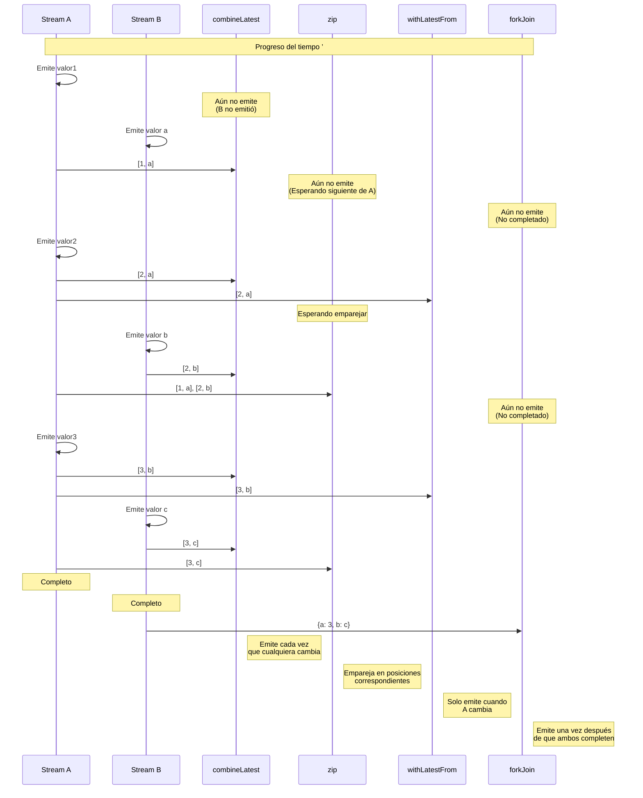
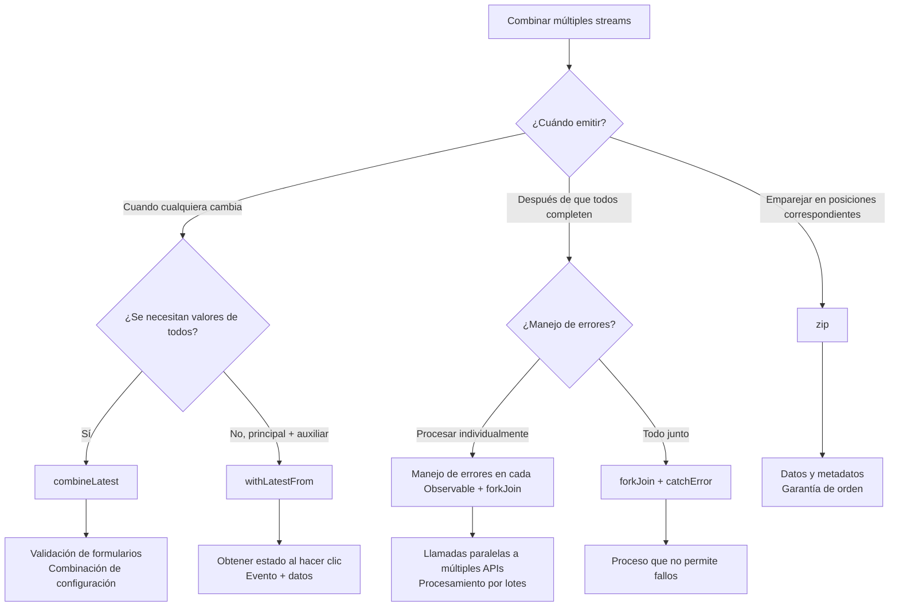

# Combinación de múltiples streams

En RxJS, requisitos como **"combinar resultados de 2 APIs" o "monitorear todos los campos de un formulario"** son muy comunes, pero elegir el operador apropiado es difícil. Esta página explica patrones prácticos para combinar múltiples streams.

## combineLatest vs zip vs withLatestFrom vs forkJoin

### Comparación de los 4 operadores de combinación principales

| Operador | Momento de emisión | Cómo combina valores | Condición de completado | Casos de uso comunes |
|---|---|---|---|---|
| **combineLatest** | Cuando cualquiera cambia | Últimos valores de cada stream | Todos los streams completan | Validación de formularios, combinación de configuración |
| **zip** | Cuando todos los streams emiten valor | Emparejar valores en posiciones correspondientes | Cualquiera completa | Paginación, sincronización de procesamiento paralelo |
| **withLatestFrom** | Cuando el stream principal cambia | Principal + último valor auxiliar | Stream principal completa | Evento + estado actual |
| **forkJoin** | Todos los streams completan | Valores finales de cada stream | Todos los streams completan | Llamadas paralelas a múltiples APIs |

### Comparación con Marble Diagrams

```
A:  --1--2--------3----|
B:  ----a----b------c----|

combineLatest(A, B):
    ----[1,a]-[2,a]-[2,b]-[3,b]-[3,c]|
    (Emite cada vez que cualquiera cambia)

zip(A, B):
    ----[1,a]----[2,b]----[3,c]|
    (Empareja en posiciones correspondientes)

A.pipe(withLatestFrom(B)):
    ----[1,a]----[2,b]----[3,c]|
    (Solo emite cuando A cambia)

forkJoin({ a: A, b: B }):
    ---------------------------{ a: 3, b: c }|
    (Emite después de que ambos completen)
```

### Visualización del momento de emisión

El siguiente diagrama muestra cuándo cada operador de combinación emite valores.



> [!TIP] Criterios de selección
> - **combineLatest**: Combinación reactiva de estados (formularios, configuración)
> - **zip**: Emparejar valores correspondientes (paginación, procesamiento paralelo)
> - **withLatestFrom**: Evento + estado actual (obtener configuración al hacer clic)
> - **forkJoin**: Ejecutar múltiples procesos asíncronos en paralelo y obtener todos los resultados (múltiples APIs)

## combineLatest: Combinación de últimos valores

### Características
- **Después de que todos los streams emitan al menos una vez**, emite cada vez que cualquiera cambia
- Combina los **últimos valores** de cada stream
- Continúa hasta que todos los streams completen

### Ejemplo práctico 1: Validación de formularios

#### L Mal ejemplo: Suscribirse individualmente y combinar manualmente
```typescript
import { BehaviorSubject } from 'rxjs';

const email$ = new BehaviorSubject('');
const password$ = new BehaviorSubject('');
let isValid = false;

email$.subscribe(email => {
  // Se necesita el valor de password$ pero no se puede obtener
  // Necesita gestionarse con variables globales, etc.
});

password$.subscribe(password => {
  // Mismo problema
});
```

####  Buen ejemplo: Combinación automática con combineLatest
```typescript
import { BehaviorSubject, combineLatest } from 'rxjs';
import { map } from 'rxjs';

const email$ = new BehaviorSubject('');
const password$ = new BehaviorSubject('');

const isFormValid$ = combineLatest([email$, password$]).pipe(
  map(([email, password]) => {
    const emailValid = email.includes('@') && email.length > 3;
    const passwordValid = password.length >= 8;
    return emailValid && passwordValid;
  })
);

isFormValid$.subscribe(isValid => {
  console.log('Formulario válido:', isValid);
});

// Cambio de valores
email$.next('user@example.com');  // Formulario válido: false (contraseña corta)
password$.next('pass1234');       // Formulario válido: true
```

### Ejemplo práctico 2: Combinación de múltiples valores de configuración

```typescript
import { BehaviorSubject, combineLatest } from 'rxjs';
import { map } from 'rxjs';

interface Config {
  theme: 'light' | 'dark';
  language: 'ja' | 'en';
  fontSize: number;
}

const theme$ = new BehaviorSubject<'light' | 'dark'>('light');
const language$ = new BehaviorSubject<'ja' | 'en'>('ja');
const fontSize$ = new BehaviorSubject<number>(14);

const config$ = combineLatest([theme$, language$, fontSize$]).pipe(
  map(([theme, language, fontSize]): Config => ({
    theme,
    language,
    fontSize
  }))
);

config$.subscribe(config => {
  console.log('Configuración actualizada:', config);
  // Proceso para actualizar UI
});

theme$.next('dark');      // Configuración actualizada: { theme: 'dark', language: 'ja', fontSize: 14 }
fontSize$.next(16);       // Configuración actualizada: { theme: 'dark', language: 'ja', fontSize: 16 }
```

> [!TIP] Cuándo usar combineLatest
> - **Validación de formularios**: Combinar últimos valores de todos los campos
> - **Monitoreo de configuración**: Reaccionar cuando cambian múltiples configuraciones
> - **Visualización dependiente**: Actualizar UI según múltiples estados
> - **Filtrado**: Combinar múltiples condiciones

## zip: Emparejar en posiciones correspondientes

### Características
- Empareja **valores en posiciones correspondientes** de cada stream
- Espera hasta que valores de todos los streams estén listos
- Completa cuando cualquier stream completa

### Ejemplo práctico 1: Emparejar datos y metadatos en paginación

#### L Mal ejemplo: El timing se desincroniza
```typescript
import { interval } from 'rxjs';
import { map, take } from 'rxjs';

// Obtención de datos de página (lento)
const pages$ = interval(1000).pipe(
  map(i => `Datos de página ${i + 1}`),
  take(3)
);

// Obtención de metadatos (rápido)
const metadata$ = interval(100).pipe(
  map(i => `Metadatos ${i + 1}`),
  take(3)
);

// Suscribirse individualmente rompe la correspondencia
pages$.subscribe(page => console.log('Página:', page));
metadata$.subscribe(meta => console.log('Meta:', meta));

// Salida:
// Meta: Metadatos 1
// Meta: Metadatos 2
// Meta: Metadatos 3
// Página: Datos de página 1
// Página: Datos de página 2
// Página: Datos de página 3
// (Correspondencia desordenada)
```

####  Buen ejemplo: Emparejar posiciones correspondientes con zip
```typescript
import { interval, zip } from 'rxjs';
import { map, take } from 'rxjs';

const pages$ = interval(1000).pipe(
  map(i => `Datos de página ${i + 1}`),
  take(3)
);

const metadata$ = interval(100).pipe(
  map(i => `Metadatos ${i + 1}`),
  take(3)
);

zip(pages$, metadata$).subscribe(([page, meta]) => {
  console.log(`${page} - ${meta}`);
});

// Salida (cada segundo):
// Datos de página 1 - Metadatos 1
// Datos de página 2 - Metadatos 2
// Datos de página 3 - Metadatos 3
```

### Ejemplo práctico 2: Obtener resultados de procesamiento paralelo en orden

```typescript
import { of, zip } from 'rxjs';
import { delay, map } from 'rxjs';

// Llamar 3 APIs en paralelo, pero tiempos de completado varían
const api1$ = of('Resultado 1').pipe(delay(300));
const api2$ = of('Resultado 2').pipe(delay(100)); // Más rápido
const api3$ = of('Resultado 3').pipe(delay(200));

zip(api1$, api2$, api3$).pipe(
  map(([r1, r2, r3]) => ({ r1, r2, r3 }))
).subscribe(results => {
  console.log('Todos los resultados:', results);
});

// Salida (después de 300ms, cuando todos estén listos):
// Todos los resultados: { r1: 'Resultado 1', r2: 'Resultado 2', r3: 'Resultado 3' }
```

> [!TIP] Cuándo usar zip
> - **El orden es importante**: Emparejar 1º con 1º, 2º con 2º
> - **Emparejar datos y metadatos**: Datos de página con número de página
> - **Sincronización de procesamiento paralelo**: Ejecutar múltiples procesos en paralelo garantizando el orden

> [!WARNING] Advertencia sobre zip
> - Espera al stream más lento, por lo que **puede acumular búfer**
> - Con streams infinitos, puede causar memory leaks al arrastrarse por el más lento

## withLatestFrom: Obtener valor principal + auxiliar

### Características
- Solo emite **cuando el stream principal emite un valor**
- Obtiene el **último valor** del stream auxiliar y lo combina
- Completa cuando el stream principal completa

### Ejemplo práctico 1: Evento de clic + estado actual

#### L Mal ejemplo: combineLatest emite innecesariamente
```typescript
import { fromEvent, BehaviorSubject, combineLatest } from 'rxjs';

const button = document.querySelector('button')!;
const clicks$ = fromEvent(button, 'click');
const counter$ = new BehaviorSubject(0);

// L combineLatest también emite cada vez que counter$ cambia
combineLatest([clicks$, counter$]).subscribe(([event, count]) => {
  console.log('Contador al hacer clic:', count);
});

// Emite cada vez que counter$ cambia
setInterval(() => {
  counter$.next(counter$.value + 1); // Emisión innecesaria
}, 1000);
```

####  Buen ejemplo: Solo emitir al hacer clic con withLatestFrom
```typescript
import { fromEvent, BehaviorSubject } from 'rxjs';
import { withLatestFrom } from 'rxjs';

const button = document.querySelector('button')!;
const clicks$ = fromEvent(button, 'click');
const counter$ = new BehaviorSubject(0);

clicks$.pipe(
  withLatestFrom(counter$)
).subscribe(([event, count]) => {
  console.log('Contador al hacer clic:', count);
});

// No emite cuando counter$ cambia
setInterval(() => {
  counter$.next(counter$.value + 1); //  No emite
}, 1000);
```

### Ejemplo práctico 2: Envío de formulario + información de usuario actual

```typescript
import { fromEvent, BehaviorSubject } from 'rxjs';
import { withLatestFrom, map } from 'rxjs';

const submitButton = document.querySelector('#submit')!;
const submit$ = fromEvent(submitButton, 'click');

const currentUser$ = new BehaviorSubject({ id: 1, name: 'Alice' });
const formData$ = new BehaviorSubject({ title: '', content: '' });

submit$.pipe(
  withLatestFrom(currentUser$, formData$),
  map(([event, user, data]) => ({
    ...data,
    authorId: user.id,
    authorName: user.name,
    timestamp: Date.now()
  }))
).subscribe(payload => {
  console.log('Datos de envío:', payload);
  // Enviar a API...
});
```

> [!TIP] Cuándo usar withLatestFrom
> - **Evento + estado**: Obtener estado actual al hacer clic
> - **Proceso principal + datos auxiliares**: Información de usuario al enviar formulario
> - **Trigger + configuración**: Valores de configuración actuales al hacer clic en botón

## forkJoin: Esperar completado de todos

### Características
- Espera hasta que **todos los streams completen**
- Obtiene el **valor final** de cada stream
- Equivalente a `Promise.all()` de Promise

### Ejemplo práctico 1: Llamadas paralelas a múltiples APIs

#### L Mal ejemplo: Ejecución secuencial lenta
```typescript
import { ajax } from 'rxjs/ajax';

ajax.getJSON('/api/user').subscribe(user => {
  console.log('Usuario obtenido:', user);

  ajax.getJSON('/api/posts').subscribe(posts => {
    console.log('Posts obtenidos:', posts);

    ajax.getJSON('/api/comments').subscribe(comments => {
      console.log('Comentarios obtenidos:', comments);
      // Anidamiento profundo
    });
  });
});
```

####  Buen ejemplo: Ejecución paralela con forkJoin
```typescript
import { forkJoin } from 'rxjs';
import { ajax } from 'rxjs/ajax';

forkJoin({
  user: ajax.getJSON('/api/user'),
  posts: ajax.getJSON('/api/posts'),
  comments: ajax.getJSON('/api/comments')
}).subscribe(({ user, posts, comments }) => {
  console.log('Todos los datos obtenidos:', { user, posts, comments });
  // 3 APIs ejecutadas en paralelo
});
```

### Ejemplo práctico 2: Subida de múltiples archivos

```typescript
import { forkJoin, Observable, of } from 'rxjs';
import { delay } from 'rxjs';

function uploadFile(file: File): Observable<string> {
  return of(`${file.name} subida completa`).pipe(
    delay(Math.random() * 2000)
  );
}

const files = [
  new File([''], 'archivo1.txt'),
  new File([''], 'archivo2.txt'),
  new File([''], 'archivo3.txt')
];

forkJoin(files.map(file => uploadFile(file))).subscribe(results => {
  console.log('Subida de todos los archivos completa:', results);
  // Se muestra después de que todas las subidas completen
});
```

> [!TIP] Cuándo usar forkJoin
> - **Llamadas paralelas a múltiples APIs**: Obtención masiva de datos iniciales
> - **Procesamiento por lotes**: Completar todas las tareas
> - **Ejecución paralela de procesos independientes**: Cuando cada proceso es independiente

> [!WARNING] Advertencia sobre forkJoin
> - **No se puede usar con streams que no completan** (como interval)
> - Si uno falla, todo falla
> - No se pueden obtener valores intermedios (solo valores finales)

## Diagrama de flujo de selección



## Patrones prácticos

### Patrón 1: Validación de formularios

```typescript
import { BehaviorSubject, combineLatest } from 'rxjs';
import { map } from 'rxjs';

interface FormState {
  email: string;
  password: string;
  agreeToTerms: boolean;
}

class RegistrationForm {
  private email$ = new BehaviorSubject('');
  private password$ = new BehaviorSubject('');
  private agreeToTerms$ = new BehaviorSubject(false);

  readonly isValid$ = combineLatest([
    this.email$,
    this.password$,
    this.agreeToTerms$
  ]).pipe(
    map(([email, password, agreed]) => {
      const emailValid = /^[^\s@]+@[^\s@]+\.[^\s@]+$/.test(email);
      const passwordValid = password.length >= 8;
      return emailValid && passwordValid && agreed;
    })
  );

  readonly formState$ = combineLatest([
    this.email$,
    this.password$,
    this.agreeToTerms$
  ]).pipe(
    map(([email, password, agreeToTerms]): FormState => ({
      email,
      password,
      agreeToTerms
    }))
  );

  updateEmail(email: string) {
    this.email$.next(email);
  }

  updatePassword(password: string) {
    this.password$.next(password);
  }

  toggleTerms() {
    this.agreeToTerms$.next(!this.agreeToTerms$.value);
  }
}

// Uso
const form = new RegistrationForm();

form.isValid$.subscribe(isValid => {
  console.log('Formulario válido:', isValid);
});

form.updateEmail('user@example.com');
form.updatePassword('password123');
form.toggleTerms();
```

### Patrón 2: Llamadas API con dependencias

```typescript
import { forkJoin, of } from 'rxjs';
import { switchMap, map, catchError } from 'rxjs';
import { ajax } from 'rxjs/ajax';

interface User {
  id: number;
  name: string;
}

interface Post {
  id: number;
  userId: number;
  title: string;
}

interface Comment {
  id: number;
  postId: number;
  text: string;
}

// Obtener posts y comentarios del usuario en paralelo
function getUserData(userId: number) {
  return ajax.getJSON<User>(`/api/users/${userId}`).pipe(
    switchMap(user =>
      forkJoin({
        user: of(user),
        posts: ajax.getJSON<Post[]>(`/api/users/${userId}/posts`),
        comments: ajax.getJSON<Comment[]>(`/api/users/${userId}/comments`)
      })
    ),
    catchError(error => {
      console.error('Error:', error);
      return of({
        user: null,
        posts: [],
        comments: []
      });
    })
  );
}

// Uso
getUserData(1).subscribe(({ user, posts, comments }) => {
  console.log('Datos de usuario:', { user, posts, comments });
});
```

### Patrón 3: Filtrado en tiempo real

```typescript
import { BehaviorSubject, combineLatest } from 'rxjs';
import { map } from 'rxjs';

interface Product {
  id: number;
  name: string;
  category: string;
  price: number;
}

class ProductFilter {
  private products$ = new BehaviorSubject<Product[]>([
    { id: 1, name: 'Portátil', category: 'electronics', price: 100000 },
    { id: 2, name: 'Mouse', category: 'electronics', price: 2000 },
    { id: 3, name: 'Libro', category: 'books', price: 1500 }
  ]);

  private searchQuery$ = new BehaviorSubject('');
  private categoryFilter$ = new BehaviorSubject<string | null>(null);
  private maxPrice$ = new BehaviorSubject<number>(Infinity);

  readonly filteredProducts$ = combineLatest([
    this.products$,
    this.searchQuery$,
    this.categoryFilter$,
    this.maxPrice$
  ]).pipe(
    map(([products, query, category, maxPrice]) => {
      return products.filter(p => {
        const matchesQuery = p.name.toLowerCase().includes(query.toLowerCase());
        const matchesCategory = !category || p.category === category;
        const matchesPrice = p.price <= maxPrice;
        return matchesQuery && matchesCategory && matchesPrice;
      });
    })
  );

  updateSearch(query: string) {
    this.searchQuery$.next(query);
  }

  updateCategory(category: string | null) {
    this.categoryFilter$.next(category);
  }

  updateMaxPrice(price: number) {
    this.maxPrice$.next(price);
  }
}

// Uso
const filter = new ProductFilter();

filter.filteredProducts$.subscribe(products => {
  console.log('Productos filtrados:', products);
});

filter.updateSearch('Mouse');
filter.updateCategory('electronics');
filter.updateMaxPrice(50000);
```

## Trampas comunes

### Trampa 1: Primera emisión de combineLatest

#### L Mal ejemplo: Stream sin valor inicial
```typescript
import { Subject, combineLatest } from 'rxjs';

const a$ = new Subject<number>();
const b$ = new Subject<number>();

combineLatest([a$, b$]).subscribe(([a, b]) => {
  console.log('Valores:', a, b);
});

a$.next(1); // No se imprime nada (b$ aún no emitió valor)
b$.next(2); // Aquí se imprime por primera vez: Valores: 1 2
```

####  Buen ejemplo: Configurar valor inicial con BehaviorSubject
```typescript
import { BehaviorSubject, combineLatest } from 'rxjs';

const a$ = new BehaviorSubject<number>(0); // Valor inicial
const b$ = new BehaviorSubject<number>(0);

combineLatest([a$, b$]).subscribe(([a, b]) => {
  console.log('Valores:', a, b);
});

// Salida: Valores: 0 0 (emite inmediatamente)

a$.next(1); // Salida: Valores: 1 0
b$.next(2); // Salida: Valores: 1 2
```

### Trampa 2: Acumulación de búfer con zip

#### L Mal ejemplo: Búfer se acumula con stream lento
```typescript
import { interval, zip } from 'rxjs';
import { take } from 'rxjs';

const fast$ = interval(100).pipe(take(100));  // Rápido
const slow$ = interval(1000).pipe(take(10));  // Lento

zip(fast$, slow$).subscribe(([f, s]) => {
  console.log('Par:', f, s);
});

// Problema: valores de fast$ se acumulan en el búfer
// Hasta que slow$ emita 10, fast$ consume 100 espacios de memoria
```

####  Buen ejemplo: Ajustar velocidad
```typescript
import { interval, combineLatest } from 'rxjs';
import { take } from 'rxjs';

const fast$ = interval(100).pipe(take(100));
const slow$ = interval(1000).pipe(take(10));

// Usar combineLatest en lugar de zip
combineLatest([fast$, slow$]).subscribe(([f, s]) => {
  console.log('Última combinación:', f, s);
});

// O ajustar fast$ con throttleTime
```

### Trampa 3: Stream infinito con forkJoin

#### L Mal ejemplo: Stream que no completa
```typescript
import { interval, forkJoin } from 'rxjs';
import { ajax } from 'rxjs/ajax';

forkJoin({
  timer: interval(1000),  // L No completa
  user: ajax.getJSON('/api/user')
}).subscribe(result => {
  console.log(result); // Nunca se ejecuta
});
```

####  Buen ejemplo: Delimitar con take
```typescript
import { interval, forkJoin } from 'rxjs';
import { ajax } from 'rxjs/ajax';
import { take } from 'rxjs';

forkJoin({
  timer: interval(1000).pipe(take(5)), //  Completa después de 5
  user: ajax.getJSON('/api/user')
}).subscribe(result => {
  console.log('Resultado:', result); // Se ejecuta después de 5 segundos
});
```

## Lista de verificación de comprensión

Verifique si puede responder las siguientes preguntas.

```markdown
## Comprensión básica
- [ ] Explicar las diferencias entre combineLatest, zip, withLatestFrom y forkJoin
- [ ] Entender el momento de emisión de cada uno
- [ ] Explicar cuándo completa cada operador

## Selección
- [ ] Elegir el operador apropiado para validación de formularios
- [ ] Elegir el operador apropiado para llamadas paralelas a múltiples APIs
- [ ] Elegir el operador apropiado para combinación de evento + estado

## Advertencias
- [ ] Entender condiciones de primera emisión de combineLatest
- [ ] Explicar el problema de acumulación de búfer con zip
- [ ] Entender por qué no se puede usar forkJoin con streams infinitos

## Práctica
- [ ] Implementar patrón de validación de formularios
- [ ] Implementar llamadas paralelas a múltiples APIs
- [ ] Implementar filtrado en tiempo real
```

## Siguientes pasos

Después de entender la combinación de múltiples streams, aprenda sobre **técnicas de depuración**.

’ **[Técnicas de depuración](/es/guide/overcoming-difficulties/debugging-guide)** - Cómo depurar streams complejos

## Páginas relacionadas

- **[Chapter 3: combineLatest](/es/guide/creation-functions/combination/combineLatest)** - Detalles de combineLatest
- **[Chapter 3: zip](/es/guide/creation-functions/combination/zip)** - Detalles de zip
- **[Chapter 3: forkJoin](/es/guide/creation-functions/combination/forkJoin)** - Detalles de forkJoin
- **[withLatestFrom](/es/guide/operators/combination/withLatestFrom)** - Detalles de withLatestFrom
- **[Chapter 4: Selección de operadores](/es/guide/overcoming-difficulties/operator-selection)** - Criterios de selección de operadores

## <¯ Ejercicios prácticos

### Problema 1: Selección apropiada de operador

Elija el operador más adecuado para los siguientes escenarios.

1. **Habilitar botón submit cuando se ingresen nombre de usuario y correo electrónico**
2. **Enviar contenido actual del carrito al hacer clic en botón**
3. **Llamar 3 APIs en paralelo y mostrar datos cuando todas completen**
4. **Emparejar número de página con items por página**

<details>
<summary>Ejemplo de respuesta</summary>

**1. Habilitar botón submit cuando se ingresen nombre de usuario y correo electrónico**
```typescript
import { BehaviorSubject, combineLatest } from 'rxjs';
import { map } from 'rxjs';

const username$ = new BehaviorSubject('');
const email$ = new BehaviorSubject('');

const isSubmitEnabled$ = combineLatest([username$, email$]).pipe(
  map(([username, email]) => username.length > 0 && email.length > 0)
);

isSubmitEnabled$.subscribe(enabled => {
  console.log('Submit habilitado:', enabled);
});
```

> [!NOTE] Razón
> Como se necesita re-evaluar cuando cualquiera cambia, **combineLatest** es óptimo.

---

**2. Enviar contenido actual del carrito al hacer clic en botón**
```typescript
import { fromEvent, BehaviorSubject } from 'rxjs';
import { withLatestFrom } from 'rxjs';

const submitButton = document.querySelector('#checkout')!;
const submit$ = fromEvent(submitButton, 'click');
const cart$ = new BehaviorSubject<string[]>([]);

submit$.pipe(
  withLatestFrom(cart$)
).subscribe(([event, cart]) => {
  console.log('Compra:', cart);
  // Enviar a API...
});
```

> [!NOTE] Razón
> Como solo se emite al hacer clic (stream principal) y se quiere obtener el último valor del carrito, **withLatestFrom** es óptimo.

---

**3. Llamar 3 APIs en paralelo y mostrar datos cuando todas completen**
```typescript
import { forkJoin } from 'rxjs';
import { ajax } from 'rxjs/ajax';

forkJoin({
  users: ajax.getJSON('/api/users'),
  products: ajax.getJSON('/api/products'),
  orders: ajax.getJSON('/api/orders')
}).subscribe(({ users, products, orders }) => {
  console.log('Todos los datos obtenidos:', { users, products, orders });
});
```

> [!NOTE] Razón
> Para ejecutar múltiples llamadas API en paralelo y esperar hasta que todas completen, **forkJoin** es óptimo.

---

**4. Emparejar número de página con items por página**
```typescript
import { BehaviorSubject, zip } from 'rxjs';

const pageNumber$ = new BehaviorSubject(1);
const itemsPerPage$ = new BehaviorSubject(10);

zip(pageNumber$, itemsPerPage$).subscribe(([page, items]) => {
  console.log(`Página ${page}: ${items} items/página`);
});

pageNumber$.next(2);
itemsPerPage$.next(20);
```

> [!NOTE] Razón
> Para emparejar número de página con items en posiciones correspondientes, **zip** es óptimo.

</details>

### Problema 2: Primera emisión de combineLatest

¿Cuándo se imprime el primer valor en el siguiente código?

```typescript
import { Subject, BehaviorSubject, combineLatest } from 'rxjs';

const a$ = new Subject<number>();
const b$ = new BehaviorSubject<number>(0);
const c$ = new Subject<number>();

combineLatest([a$, b$, c$]).subscribe(([a, b, c]) => {
  console.log('Valores:', a, b, c);
});

a$.next(1);
c$.next(3);
```

<details>
<summary>Respuesta</summary>

**Respuesta: Cuando se ejecuta `c$.next(3);`**

Salida: `Valores: 1 0 3`

> [!NOTE] Razón
> `combineLatest` emite **después de que todos los streams emitan al menos una vez**.
> - `a$` es `Subject` sin valor inicial ’ valor sale con `a$.next(1)`
> - `b$` es `BehaviorSubject` con valor inicial `0` ’ ya tiene valor
> - `c$` es `Subject` sin valor inicial ’ valor sale con `c$.next(3)`
>
> Cuando se ejecuta `c$.next(3)`, todos los streams tienen valores, por lo que emite ahí.

</details>

### Problema 3: Diferencias entre zip y combineLatest

Prediga la salida de zip y combineLatest en el siguiente Marble Diagram.

```
A:  --1--2----3----|
B:  ----a----b-----|

¿Salida de zip(A, B)?
¿Salida de combineLatest(A, B)?
```

<details>
<summary>Respuesta</summary>

**Salida de zip(A, B):**
```
----[1,a]----[2,b]-|
```

**Salida de combineLatest(A, B):**
```
----[1,a]-[2,a]-[2,b]-[3,b]|
```

> [!NOTE] Razón
> - **zip**: Empareja en posiciones correspondientes
>   - 1 con a, 2 con b, 3 no tiene par, completa
> - **combineLatest**: Emite última combinación cada vez que cualquiera cambia
>   - Sale a ’ [1,a]
>   - Sale 2 ’ [2,a]
>   - Sale b ’ [2,b]
>   - Sale 3 ’ [3,b]

</details>

### Problema 4: forkJoin con manejo de errores

Escriba código para cuando, en múltiples llamadas API, algunas fallen pero se quieran obtener otros datos.

<details>
<summary>Ejemplo de respuesta</summary>

```typescript
import { forkJoin, of } from 'rxjs';
import { catchError } from 'rxjs';
import { ajax } from 'rxjs/ajax';

forkJoin({
  users: ajax.getJSON('/api/users').pipe(
    catchError(error => {
      console.error('Fallo al obtener usuarios:', error);
      return of([]); // Devolver array vacío
    })
  ),
  products: ajax.getJSON('/api/products').pipe(
    catchError(error => {
      console.error('Fallo al obtener productos:', error);
      return of([]);
    })
  ),
  orders: ajax.getJSON('/api/orders').pipe(
    catchError(error => {
      console.error('Fallo al obtener órdenes:', error);
      return of([]);
    })
  )
}).subscribe(({ users, products, orders }) => {
  console.log('Datos obtenidos:', { users, products, orders });
  // API fallida será array vacío, pero otros datos se obtienen
});
```

> [!IMPORTANT] Puntos clave
> - Agregar `catchError` a cada Observable
> - Devolver valor por defecto (array vacío, etc.) en caso de error
> - Con esto, aunque algunos fallen, el total completa
> - Posible imprimir error en log y notificar al usuario

</details>
