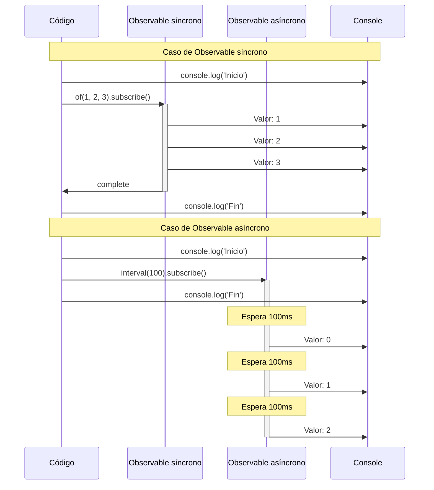
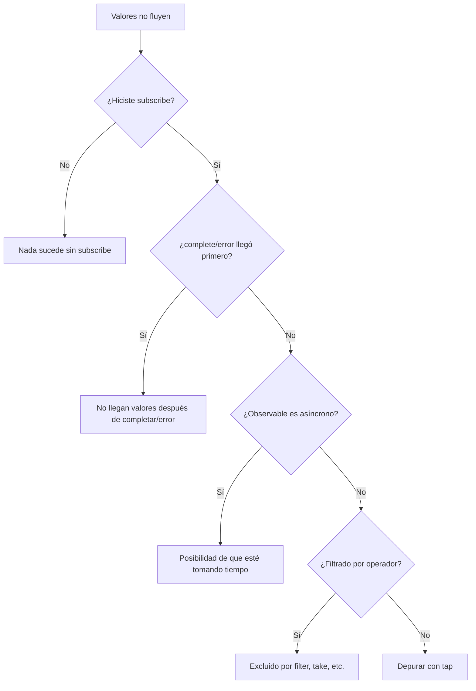

# Comprensión de timing y orden

En RxJS, enfrentarse a problemas como **"¿Por qué no sale el valor?" o "¿El orden está mal?"** es muy común. Esta página explica conocimientos fundamentales y técnicas prácticas de depuración para entender correctamente el timing y el orden.

## Cuándo fluyen los valores

### Problema: Pensar que los valores salen inmediatamente después de subscribe

Un error común de los principiantes es pensar que "si hago subscribe, puedo obtener el valor inmediatamente".

#### L Mal ejemplo: Esperar que el valor esté disponible inmediatamente
```typescript
import { of } from 'rxjs';
import { delay } from 'rxjs';

let result: number | undefined;

of(42).pipe(
  delay(100)
).subscribe(value => {
  result = value;
});

console.log(result); // undefined (el valor aún no llegó)
```

####  Buen ejemplo: Procesar dentro de subscribe
```typescript
import { of } from 'rxjs';
import { delay } from 'rxjs';

of(42).pipe(
  delay(100)
).subscribe(value => {
  console.log(value); // 42 se imprime después de 100ms
});
```

> [!IMPORTANT] Principio importante
> - Observable puede ser **asíncrono**
> - El procesamiento que usa valores debe hacerse **dentro de subscribe**
> - No esperar valores fuera de subscribe

## Comprensión de síncrono vs asíncrono

### Observable síncrono vs Observable asíncrono

En RxJS hay **Observables que fluyen valores síncronamente** y **Observables que fluyen valores asíncronamente**.

#### Ejemplo de Observable síncrono

```typescript
import { of } from 'rxjs';

console.log('Inicio');

of(1, 2, 3).subscribe(value => {
  console.log('Valor:', value);
});

console.log('Fin');

// Salida:
// Inicio
// Valor: 1
// Valor: 2
// Valor: 3
// Fin
```

#### Ejemplo de Observable asíncrono

```typescript
import { interval } from 'rxjs';
import { take } from 'rxjs';

console.log('Inicio');

interval(100).pipe(
  take(3)
).subscribe(value => {
  console.log('Valor:', value);
});

console.log('Fin');

// Salida:
// Inicio
// Fin
// Valor: 0  (después de 100ms)
// Valor: 1  (después de 200ms)
// Valor: 2  (después de 300ms)
```

### Visualización del flujo de ejecución síncrono vs asíncrono

El siguiente diagrama de secuencia muestra las diferencias de timing de ejecución entre Observable síncrono y asíncrono.



> [!TIP] Diferencias de timing
> - **Observable síncrono**: Avanza a la siguiente línea después de completar el procesamiento dentro de subscribe
> - **Observable asíncrono**: subscribe retorna inmediatamente, valores fluyen después

### Criterios de juicio síncrono/asíncrono

| Observable | Síncrono/Asíncrono | Razón |
|---|---|---|
| `of(1, 2, 3)` | Síncrono | Valores determinados inmediatamente |
| `from([1, 2, 3])` | Síncrono | Se puede obtener inmediatamente del array |
| `interval(1000)` | Asíncrono | Toma tiempo con temporizador |
| `fromEvent(button, 'click')` | Asíncrono | Espera acción del usuario |
| `ajax('/api/data')` | Asíncrono | Espera petición HTTP |
| `timer(1000)` | Asíncrono | Emite después de 1 segundo |
| `of(1).pipe(delay(100))` | Asíncrono | Se retrasa con delay |

### Problema común: Mezcla de síncrono y asíncrono

#### L Mal ejemplo: Orden no garantizado
```typescript
import { of } from 'rxjs';
import { delay } from 'rxjs';

console.log('1: Inicio');

of('Síncrono').subscribe(value => {
  console.log('2:', value);
});

of('Asíncrono').pipe(
  delay(0) // Incluso con 0ms se vuelve asíncrono
).subscribe(value => {
  console.log('3:', value);
});

console.log('4: Fin');

// Salida:
// 1: Inicio
// 2: Síncrono
// 4: Fin
// 3: Asíncrono  � Incluso delay(0) entra en cola asíncrona
```

####  Buen ejemplo: Aclarar intención
```typescript
import { of, concat } from 'rxjs';
import { delay } from 'rxjs';

// Si se quiere garantizar el orden, usar concat
concat(
  of('Primero'),
  of('Siguiente').pipe(delay(100)),
  of('Último')
).subscribe(value => {
  console.log(value);
});

// Salida:
// Primero
// Siguiente    (después de 100ms)
// Último  (después de 100ms)
```

## Cómo leer Marble Diagrams

Un Marble Diagram es una figura que visualiza el comportamiento de Observable en el **eje temporal**.

### Notación básica

```
Eje temporal:  ------a----b----c----|
               ‘     ‘    ‘    ‘    ‘
               Inicio  Valor a  Valor b  Valor c  Completo

Significado de símbolos:
-  : Paso del tiempo (aprox. 10ms)
a  : Emisión de valor (next)
|  : Completado (complete)
#  : Error (error)
() : Emisión simultánea (a,b)
```

### Ejemplo práctico 1: Operador map

```
Entrada:  ----1----2----3----|
          map(x => x * 10)
Salida:   ----10---20---30---|
```

```typescript
import { of } from 'rxjs';
import { map, delay, concatMap } from 'rxjs';

of(1, 2, 3).pipe(
  concatMap(v => of(v).pipe(delay(100))), // Fluir cada 100ms
  map(x => x * 10)
).subscribe(value => console.log(value));

// 100ms: 10
// 200ms: 20
// 300ms: 30
```

### Ejemplo práctico 2: merge

```
A:     ----a----b----|
B:     --c----d----e----|
       merge(A, B)
Salida:  --c-a--d-b--e----|
```

```typescript
import { interval, merge } from 'rxjs';
import { map, take } from 'rxjs';

const a$ = interval(200).pipe(
  map(i => `A${i}`),
  take(2)
);

const b$ = interval(150).pipe(
  map(i => `B${i}`),
  take(3)
);

merge(a$, b$).subscribe(value => console.log(value));

// 150ms: B0
// 200ms: A0
// 300ms: B1
// 400ms: A1
// 450ms: B2
```

### Ejemplo práctico 3: switchMap (cancelación)

```
Externo:  ----A------B----C----|
          switchMap(x => interno)
Interno A: ----1--2|  (cancelado por B)
Interno B:        ----3--4|  (cancelado por C)
Interno C:             ----5--6|
Salida:   ----1------3----5--6|
```

```typescript
import { fromEvent, interval } from 'rxjs';
import { switchMap, map, take } from 'rxjs';

const button = document.querySelector('button')!;

fromEvent(button, 'click').pipe(
  switchMap(() =>
    interval(100).pipe(
      map(i => `Valor${i}`),
      take(3)
    )
  )
).subscribe(value => console.log(value));

// Clic1 ’ Valor0 ’ Valor1 ’ (siguiente cancelado por Clic2)
// Clic2 ’ Valor0 ’ Valor1 ’ Valor2 ’ Completo
```

## Rol del Scheduler

El Scheduler controla **cuándo y cómo emite valores** el Observable.

### Tipos de Scheduler

| Scheduler | Uso | Explicación |
|---|---|---|
| **queueScheduler** | Procesamiento síncrono | Ejecuta inmediatamente en el event loop actual |
| **asapScheduler** | Microtarea | Mismo timing que Promise.then() |
| **asyncScheduler** | Macrotarea | Mismo timing que setTimeout() |
| **animationFrameScheduler** | Animación | Mismo timing que requestAnimationFrame() |

### Ejemplo práctico: Controlar timing con observeOn

#### L Mal ejemplo: Procesamiento síncrono bloquea UI
```typescript
import { range } from 'rxjs';
import { map } from 'rxjs';

console.log('Inicio');

range(1, 1000000).pipe(
  map(x => x * x)
).subscribe(value => {
  // 1 millón de cálculos ejecutados síncronamente ’ UI congelada
});

console.log('Fin'); // Se imprime después de terminar el cálculo
```

####  Buen ejemplo: Hacerlo asíncrono con asyncScheduler
```typescript
import { range, asyncScheduler } from 'rxjs';
import { map, observeOn } from 'rxjs';

console.log('Inicio');

range(1, 1000000).pipe(
  map(x => x * x),
  observeOn(asyncScheduler) // Poner en cola asíncrona
).subscribe(value => {
  // Se ejecuta asíncronamente ’ UI no se bloquea
});

console.log('Fin'); // Se imprime inmediatamente
```

> [!TIP] Cuándo usar Scheduler
> - **Cálculos pesados**: Hacerlo asíncrono con asyncScheduler para no bloquear UI
> - **Animaciones**: Renderizado suave con animationFrameScheduler
> - **Tests**: Virtualizar tiempo con TestScheduler

Ver detalles en **[Chapter 7: Uso de Schedulers](/es/guide/schedulers/async-control)**.

## Problemas comunes y métodos de depuración

### Problema 1: Valores no fluyen

#### Lista de verificación



#### Técnica de depuración: Usar tap

```typescript
import { of } from 'rxjs';
import { map, filter, tap } from 'rxjs';

console.log('Inicio');

of(1, 2, 3, 4, 5).pipe(
  tap(v => console.log('=A Valor original:', v)),
  filter(x => x % 2 === 0),
  tap(v => console.log(' Pasó filter:', v)),
  map(x => x * 10),
  tap(v => console.log('= Después de map:', v))
).subscribe(result => {
  console.log('=æ Resultado final:', result);
});

console.log('Fin');

// Salida:
// Inicio
// =A Valor original: 1
// =A Valor original: 2
//  Pasó filter: 2
// = Después de map: 20
// =æ Resultado final: 20
// =A Valor original: 3
// =A Valor original: 4
//  Pasó filter: 4
// = Después de map: 40
// =æ Resultado final: 40
// =A Valor original: 5
// Fin
```

> [!NOTE] Punto clave
> Como `of()` es Observable síncrono, "Fin" se imprime después de completar todo el procesamiento dentro de subscribe. Intercalando tap en cada etapa, se puede rastrear el flujo de valores.

### Problema 2: Orden diferente al esperado

#### L Mal ejemplo: Orden se desordena con mergeMap
```typescript
import { of } from 'rxjs';
import { mergeMap, delay } from 'rxjs';

of(1, 2, 3).pipe(
  mergeMap(x =>
    of(x * 10).pipe(
      delay(Math.random() * 100) // Retraso aleatorio
    )
  )
).subscribe(value => console.log(value));

// Ejemplo de salida: 20, 10, 30 (orden no garantizado)
```

####  Buen ejemplo: Garantizar orden con concatMap
```typescript
import { of } from 'rxjs';
import { concatMap, delay } from 'rxjs';

of(1, 2, 3).pipe(
  concatMap(x =>
    of(x * 10).pipe(
      delay(Math.random() * 100)
    )
  )
).subscribe(value => console.log(value));

// Salida: 10, 20, 30 (siempre este orden)
```

### Problema 3: No completa (stream infinito)

#### L Mal ejemplo: Se atasca con operador que espera completado
```typescript
import { interval } from 'rxjs';
import { reduce } from 'rxjs';

interval(1000).pipe(
  reduce((acc, val) => acc + val, 0) // Nunca completa
).subscribe(total => {
  console.log(total); // Esta línea no se ejecuta
});
```

####  Buen ejemplo: Delimitar con take
```typescript
import { interval } from 'rxjs';
import { reduce, take } from 'rxjs';

interval(1000).pipe(
  take(5),                            // Obtener solo 5
  reduce((acc, val) => acc + val, 0) // Sumar después de completar
).subscribe(total => {
  console.log('Total:', total); // "Total: 10" se imprime después de 5 segundos
});
```

## Herramientas y técnicas de depuración

### 1. Salida de logs con tap

```typescript
import { of } from 'rxjs';
import { map, filter, tap } from 'rxjs';

const debug = <T>(label: string) => tap<T>(value =>
  console.log(`[${label}]`, value)
);

of(1, 2, 3, 4, 5).pipe(
  debug('=5 Entrada'),
  filter(x => x > 2),
  debug('=â Después de filter'),
  map(x => x * 10),
  debug('=á Después de map')
).subscribe();

// [=5 Entrada] 1
// [=5 Entrada] 2
// [=5 Entrada] 3
// [=â Después de filter] 3
// [=á Después de map] 30
// [=5 Entrada] 4
// [=â Después de filter] 4
// [=á Después de map] 40
// [=5 Entrada] 5
// [=â Después de filter] 5
// [=á Después de map] 50
```

### 2. RxJS DevTools (extensión de navegador)

Con la extensión de Chrome/Edge "RxJS DevTools", se puede:

- Monitorear todos los Observables en tiempo real
- Visualización con Marble Diagram
- Rastreo de subscribe/unsubscribe

#### Método de instalación
1. Buscar "RxJS DevTools" en Chrome Web Store
2. Agregar extensión
3. Abrir pestaña "RxJS" de DevTools

### 3. Operador de depuración personalizado

```typescript
import { interval, map, take, tap, timestamp } from "rxjs";
import { MonoTypeOperatorFunction } from 'rxjs';


function debugWithTime<T>(label: string): MonoTypeOperatorFunction<T> {
  return source => source.pipe(
    timestamp(),
    tap(({ value, timestamp }) => {
      console.log(`[${label}] ${new Date(timestamp).toISOString()}:`, value);
    }),
    map(({ value }) => value)
  );
}

// Uso
interval(500).pipe(
  take(3),
  debugWithTime('ð Temporizador'),
  map(x => x * 10),
  debugWithTime('= Después de conversión')
).subscribe();

// [ð Temporizador] 2025-10-19T10:20:59.467Z: 0
// [= Después de conversión] 2025-10-19T10:20:59.467Z: 0
// [ð Temporizador] 2025-10-19T10:20:59.967Z: 1
// [= Después de conversión] 2025-10-19T10:20:59.967Z: 10
// [ð Temporizador] 2025-10-19T10:21:00.467Z: 2
// [= Después de conversión] 2025-10-19T10:21:00.468Z: 20
```

### 4. Marble Testing (verificación en tests)

```typescript
import { TestScheduler } from 'rxjs/testing';
import { map } from 'rxjs';

describe('Test de timing', () => {
  let scheduler: TestScheduler;

  beforeEach(() => {
    scheduler = new TestScheduler((actual, expected) => {
      expect(actual).toEqual(expected);
    });
  });

  it('map transforma valores', () => {
    scheduler.run(({ cold, expectObservable }) => {
      const input$  = cold('--a--b--c--|', { a: 1, b: 2, c: 3 });
      const expected =     '--x--y--z--|';
      const result$ = input$.pipe(map(v => v * 10));

      expectObservable(result$).toBe(expected, { x: 10, y: 20, z: 30 });
    });
  });
});
```

Ver detalles en **[Chapter 9: Marble Testing](/es/guide/testing/marble-testing)**.

## Lista de verificación de comprensión

Verifique si puede responder las siguientes preguntas.

```markdown
## Comprensión básica
- [ ] Explicar las diferencias entre Observable síncrono y asíncrono
- [ ] Leer notación básica de Marble Diagram (-, a, |, #)
- [ ] Entender que valores no fluyen sin subscribe

## Control de timing
- [ ] Explicar las diferencias entre delay, debounceTime y throttleTime
- [ ] Entender el rol del Scheduler
- [ ] Explicar las diferencias entre observeOn y subscribeOn

## Depuración
- [ ] Depurar flujo de valores con tap
- [ ] Identificar causas de valores que no fluyen
- [ ] Saber cómo manejar orden diferente al esperado

## Práctica
- [ ] Delimitar Observable infinito con take
- [ ] Implementar diferencias de orden entre mergeMap y concatMap
- [ ] Controlar timing de error con catchError
```

## Siguientes pasos

Después de entender timing y orden, aprenda sobre **gestión de estado y compartición**.

’ **[Dificultad de gestión de estado](/es/guide/overcoming-difficulties/state-and-sharing)** - Diferencias entre Subject, share/shareReplay

## Páginas relacionadas

- **[Chapter 7: Uso de Schedulers](/es/guide/schedulers/async-control)** - Detalles del Scheduler
- **[Chapter 9: Marble Testing](/es/guide/testing/marble-testing)** - Probar timing con TestScheduler
- **[Chapter 8: Técnicas de depuración de RxJS](/es/guide/debugging/)** - Vista general de depuración
- **[Selección de operadores](/es/guide/overcoming-difficulties/operator-selection)** - Cómo elegir el operador apropiado

## <¯ Ejercicios prácticos

### Problema 1: Identificación de síncrono y asíncrono

¿Los siguientes Observables son síncronos o asíncronos?

```typescript
// A
of(1, 2, 3)

// B
from([1, 2, 3])

// C
of(1, 2, 3).pipe(delay(0))

// D
Promise.resolve(42)

// E
interval(1000).pipe(take(3))
```

<details>
<summary>Respuesta</summary>

- **A: Síncrono** - `of` emite valores inmediatamente
- **B: Síncrono** - `from` expande array inmediatamente
- **C: Asíncrono** - Incluso `delay(0)` entra en cola asíncrona
- **D: Asíncrono** - Promise siempre es asíncrono
- **E: Asíncrono** - `interval` es basado en temporizador

> [!NOTE] Punto clave
> `delay(0)` y `Promise`, aunque el retraso sea 0 milisegundos, se tratan como asíncronos.

</details>

### Problema 2: Lectura de Marble Diagram

Prediga la salida del siguiente Marble Diagram.

```typescript
import { of, zip } from 'rxjs';
import { delay } from 'rxjs';

const a$ = of(1, 2, 3);
const b$ = of('A', 'B', 'C').pipe(delay(100));

zip(a$, b$).subscribe(console.log);
```

```
Marble Diagram:
a$:  (123)|
b$:  -----(ABC)|
     zip(a$, b$)
Salida: ?
```

<details>
<summary>Respuesta</summary>

```typescript
// Después de 100ms, se imprime todo a la vez:
[1, 'A']
[2, 'B']
[3, 'C']
```

> [!NOTE] Razón
> Como `zip` espera hasta que valores de ambos streams estén listos, no se imprime hasta que se libere el delay(100) de `b$`. `a$` emite valores síncronamente, pero espera a `b$` para formar pares.

</details>

### Problema 3: Garantía de orden

¿Qué operador usar si se quiere garantizar el orden de salida en el siguiente código?

```typescript
import { of } from 'rxjs';
import { mergeMap, delay } from 'rxjs';

of('A', 'B', 'C').pipe(
  mergeMap(letter =>
    of(`${letter}Completo`).pipe(
      delay(Math.random() * 100)
    )
  )
).subscribe(console.log);

// Salida actual: Orden aleatorio (ej: BCompleto, ACompleto, CCompleto)
// Salida esperada: ACompleto, BCompleto, CCompleto
```

<details>
<summary>Respuesta</summary>

**Código corregido:**
```typescript
import { of } from 'rxjs';
import { concatMap, delay } from 'rxjs';

of('A', 'B', 'C').pipe(
  concatMap(letter =>  // mergeMap ’ concatMap
    of(`${letter}Completo`).pipe(
      delay(Math.random() * 100)
    )
  )
).subscribe(console.log);

// Salida: ACompleto, BCompleto, CCompleto (siempre este orden)
```

> [!NOTE] Razón
> - `mergeMap`: Ejecuta en paralelo, orden de completado no garantizado
> - `concatMap`: Ejecuta secuencialmente, salida en el mismo orden que entrada

</details>

### Problema 4: Manejo de stream infinito

Señale el problema del siguiente código y corríjalo.

```typescript
import { interval } from 'rxjs';
import { map, toArray } from 'rxjs';

interval(1000).pipe(
  map(x => x * 2),
  toArray()
).subscribe(arr => {
  console.log('Array:', arr); // ¿Se ejecuta esta línea?
});
```

<details>
<summary>Respuesta</summary>

**Problema:**
- `interval` emite valores infinitamente, por lo que no completa
- `toArray()` espera señal de completado, por lo que nunca sale el valor

**Código corregido:**
```typescript
import { interval } from 'rxjs';
import { map, take, toArray } from 'rxjs';

interval(1000).pipe(
  take(5),          // Obtener solo 5 y completar
  map(x => x * 2),
  toArray()
).subscribe(arr => {
  console.log('Array:', arr); // [0, 2, 4, 6, 8]
});
```

> [!IMPORTANT] Punto clave
> Al usar "operadores que esperan completado" como `reduce`, `toArray`, `last` en streams infinitos, es necesario delimitarlos con `take`, `first`, `takeUntil`, etc.

</details>
