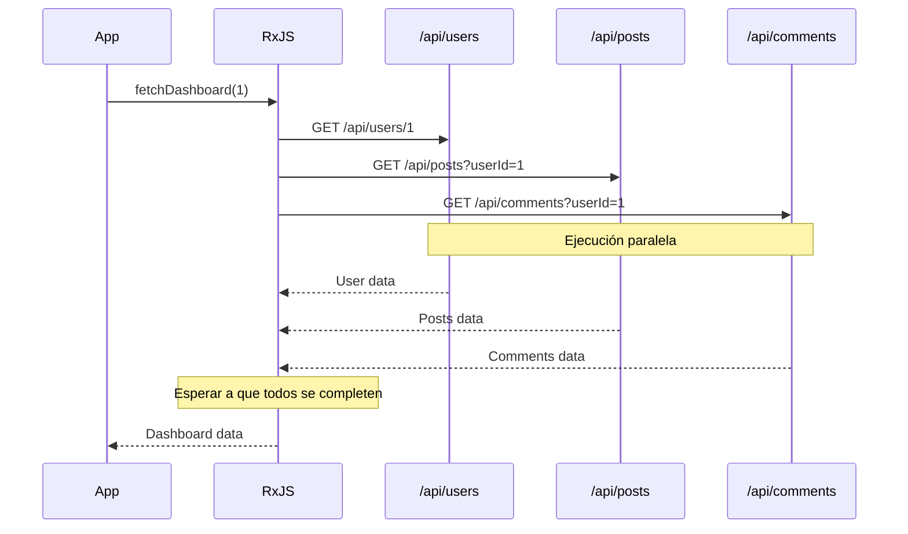
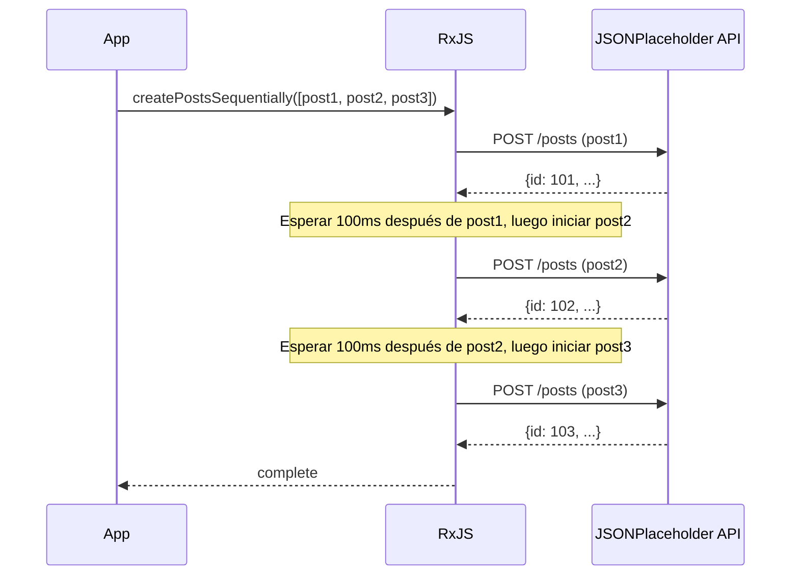
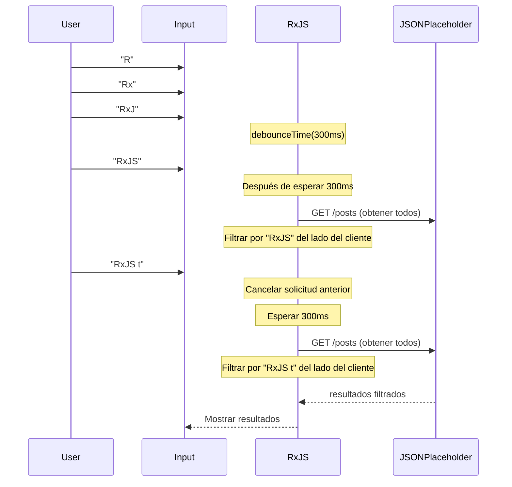

# Patrones de Llamadas a API

Las llamadas a API son una de las operaciones más frecuentes en el desarrollo web. Usando RxJS, podemos implementar llamadas a API asíncronas complejas de manera declarativa y robusta.

Este artículo explica patrones de implementación concretos para varios escenarios de llamadas a API que encontrarás en el trabajo real, incluyendo manejo de errores y procesamiento de cancelación.

## Lo que Aprenderás en este Artículo

- Implementación básica de solicitudes GET/POST
- Llamadas a API paralelas múltiples (forkJoin)
- Solicitudes en serie que requieren ejecución secuencial (concatMap)
- Encadenamiento de solicitudes con dependencias (switchMap)
- Reintentos y manejo de errores
- Manejo de timeouts
- Procesamiento de cancelación de solicitudes

> [!TIP] Conocimientos Previos
> Este artículo asume conocimientos de [Capítulo 4: Operadores](../operators/index.md) y [Capítulo 6: Manejo de Errores](../error-handling/strategies.md).

## Llamadas a API Básicas

### Problema: Solicitud GET Simple

Como el caso más básico, implementaremos una solicitud GET única.

### Ejemplo de Implementación

```typescript
import { from, Observable, map, catchError, timeout } from 'rxjs';

// Tipo User de la API JSONPlaceholder
// https://jsonplaceholder.typicode.com/users
interface User {
  id: number;
  name: string;
  username: string;
  email: string;
  address: {
    street: string;
    suite: string;
    city: string;
    zipcode: string;
    geo: {
      lat: string;
      lng: string;
    };
  };
  phone: string;
  website: string;
  company: {
    name: string;
    catchPhrase: string;
    bs: string;
  };
}

// Obtener lista de usuarios
function fetchUsers(): Observable<User[]> {
  return from(
    fetch('https://jsonplaceholder.typicode.com/users')
      .then(response => {
        if (!response.ok) {
          throw new Error(`HTTP error! status: ${response.status}`);
        }
        return response.json();
      })
  ).pipe(
    timeout(5000), // Timeout después de 5 segundos
    catchError(err => {
      console.error('Error al obtener usuarios:', err);
      throw err;
    })
  );
}

// Ejemplo de uso
fetchUsers().subscribe({
  next: users => {
    console.log('Lista de usuarios:', users);
    console.log('Primer usuario:', users[0].name); // Ejemplo: "Leanne Graham"
  },
  error: err => console.error('Error:', err)
});
```

> [!NOTE] from() vs ajax()
> Este ejemplo envuelve `fetch` estándar con `from()`, pero también puedes usar `ajax()` oficial de RxJS. `ajax()` tiene más funciones y soporta cancelación de solicitudes y monitoreo de progreso.

### Solicitud POST

Un patrón para crear nuevos datos.

```typescript
import { from, Observable, catchError } from 'rxjs';

// Tipo Post de la API JSONPlaceholder
// https://jsonplaceholder.typicode.com/posts
interface Post {
  id: number;
  userId: number;
  title: string;
  body: string;
}

interface CreatePostRequest {
  userId: number;
  title: string;
  body: string;
}

function createPost(postData: CreatePostRequest): Observable<Post> {
  return from(
    fetch('https://jsonplaceholder.typicode.com/posts', {
      method: 'POST',
      headers: {
        'Content-Type': 'application/json',
      },
      body: JSON.stringify(postData)
    }).then(response => {
      if (!response.ok) {
        throw new Error(`HTTP error! status: ${response.status}`);
      }
      return response.json();
    })
  ).pipe(
    catchError(err => {
      console.error('Error al crear publicación:', err);
      throw err;
    })
  );
}

// Ejemplo de uso
createPost({
  userId: 1,
  title: 'Aprendiendo RxJS',
  body: 'Estoy aprendiendo patrones de llamadas a API con RxJS.'
}).subscribe({
  next: post => {
    console.log('Publicación creada:', post);
    console.log('ID de publicación:', post.id); // JSONPlaceholder asigna automáticamente un ID (ej: 101)
  },
  error: err => console.error('Error:', err)
});
```

> [!TIP] Consejos Prácticos
> - **Type Safety**: Define claramente los tipos de respuesta
> - **Manejo de Errores**: Verifica apropiadamente los códigos de estado HTTP
> - **Timeout**: Previene esperas prolongadas

## Solicitudes Paralelas (forkJoin)

### Problema: Quiero Llamar Múltiples APIs Simultáneamente

Hay casos donde quieres llamar múltiples APIs independientes en paralelo y continuar el procesamiento después de que todas las respuestas estén listas.

### Solución: Usar forkJoin

`forkJoin` espera hasta que todos los Observables se completen y devuelve todos los resultados en un array (equivalente a Promise.all).

```typescript
import { forkJoin, from, Observable, map } from 'rxjs';

// Tipo Comment de la API JSONPlaceholder
// https://jsonplaceholder.typicode.com/comments
interface Comment {
  postId: number;
  id: number;
  name: string;
  email: string;
  body: string;
}
interface Post {
  id: number;
  userId: number;
  title: string;
  body: string;
}
interface User {
  id: number;
  name: string;
  username: string;
  email: string;
  address: {
    street: string;
    suite: string;
    city: string;
    zipcode: string;
    geo: {
      lat: string;
      lng: string;
    };
  };
  phone: string;
  website: string;
  company: {
    name: string;
    catchPhrase: string;
    bs: string;
  };
}
interface Dashboard {
  user: User;
  posts: Post[];
  comments: Comment[];
}

function fetchUserById(id: number): Observable<User> {
  return from(
    fetch(`https://jsonplaceholder.typicode.com/users/${id}`).then(r => r.json())
  );
}

function fetchPostsByUserId(userId: number): Observable<Post[]> {
  return from(
    fetch(`https://jsonplaceholder.typicode.com/posts?userId=${userId}`).then(r => r.json())
  );
}

function fetchCommentsByPostId(postId: number): Observable<Comment[]> {
  return from(
    fetch(`https://jsonplaceholder.typicode.com/comments?postId=${postId}`).then(r => r.json())
  );
}

// Obtener datos del dashboard en paralelo
function fetchDashboard(userId: number): Observable<Dashboard> {
  return forkJoin({
    user: fetchUserById(userId),
    posts: fetchPostsByUserId(userId),
    comments: fetchCommentsByPostId(1) // Obtener comentarios para postId=1
  }).pipe(
    map(({ user, posts, comments }) => ({
      user,
      posts,
      comments
    }))
  );
}

// Ejemplo de uso
fetchDashboard(1).subscribe({
  next: dashboard => {
    console.log('Usuario:', dashboard.user.name); // Ejemplo: "Leanne Graham"
    console.log('Número de publicaciones:', dashboard.posts.length); // Ejemplo: 10
    console.log('Número de comentarios:', dashboard.comments.length); // Ejemplo: 5
  },
  error: err => console.error('Error al obtener dashboard:', err)
});
```

#### Flujo de Ejecución



> [!IMPORTANT] Características de forkJoin
> - Espera hasta que todos los Observables se completen
> - **Si alguno falla, toda la operación falla**
> - Todos los Observables deben emitir al menos un valor

### Mejorar el Manejo de Errores

En solicitudes paralelas, puede haber casos donde quieras obtener otros resultados incluso si uno falla.

```typescript
import { forkJoin, of, catchError } from 'rxjs';

function fetchDashboardWithFallback(userId: number): Observable<Dashboard> {
  return forkJoin({
    user: fetchUserById(userId).pipe(
      catchError(err => {
        console.error('Error al obtener usuario:', err);
        return of(null); // Devolver null en caso de error
      })
    ),
    posts: fetchPostsByUserId(userId).pipe(
      catchError(err => {
        console.error('Error al obtener publicaciones:', err);
        return of([]); // Devolver array vacío en caso de error
      })
    ),
    comments: fetchCommentsByUserId(userId).pipe(
      catchError(err => {
        console.error('Error al obtener comentarios:', err);
        return of([]); // Devolver array vacío en caso de error
      })
    )
  }).pipe(
    map(({ user, posts, comments }) => ({
      user: user || { id: userId, name: 'Unknown', email: '' },
      posts,
      comments
    }))
  );
}
```

> [!TIP] Manejo de Errores Parcial
> Aplicando `catchError` a cada Observable, puedes continuar el procesamiento completo incluso si uno falla.

## Solicitudes en Serie (concatMap)

### Problema: Quiero Ejecutar APIs en Orden

Cuando quieres ejecutar la siguiente solicitud después de que la anterior se complete (por ejemplo, ejecutar múltiples cargas de archivos en orden).

### Solución: Usar concatMap

`concatMap` ejecuta el siguiente Observable después de que el anterior se complete.

```typescript
import { from, Observable, concatMap, tap, delay, catchError } from 'rxjs';

// Tipo Post de la API JSONPlaceholder
// https://jsonplaceholder.typicode.com/posts
interface Post {
  id: number;
  userId: number;
  title: string;
  body: string;
}

interface CreatePostRequest {
  userId: number;
  title: string;
  body: string;
}

function createPost(postData: CreatePostRequest): Observable<Post> {
  return from(
    fetch('https://jsonplaceholder.typicode.com/posts', {
      method: 'POST',
      headers: {
        'Content-Type': 'application/json',
      },
      body: JSON.stringify(postData)
    }).then(response => {
      if (!response.ok) {
        throw new Error(`HTTP error! status: ${response.status}`);
      }
      return response.json();
    })
  ).pipe(
    catchError(err => {
      console.error('Error al crear publicación:', err);
      throw err;
    })
  );
}

// Crear múltiples publicaciones en orden (considerando límites de tasa de API)
function createPostsSequentially(posts: CreatePostRequest[]): Observable<Post> {
  return from(posts).pipe(
    concatMap((postData, index) =>
      createPost(postData).pipe(
        tap(result => console.log(`Publicación ${index + 1} creada:`, result.title)),
        delay(100) // Esperar 100ms considerando límites de tasa de API
      )
    )
  );
}

// Ejemplo de uso
const postsToCreate: CreatePostRequest[] = [
  {
    userId: 1,
    title: 'Primera publicación',
    body: 'Esta es la primera publicación.'
  },
  {
    userId: 1,
    title: 'Segunda publicación',
    body: 'Esta es la segunda publicación.'
  },
  {
    userId: 1,
    title: 'Tercera publicación',
    body: 'Esta es la tercera publicación.'
  }
];

const results: Post[] = [];

createPostsSequentially(postsToCreate).subscribe({
  next: post => {
    results.push(post);
    console.log(`Progreso: ${results.length}/${postsToCreate.length}`);
  },
  complete: () => {
    console.log('Todas las publicaciones creadas:', results.length, 'items');
  },
  error: err => console.error('Error al crear publicación:', err)
});
```

#### Flujo de Ejecución



> [!NOTE] concatMap vs mergeMap
> - **concatMap**: Ejecutar en orden (siguiente después de que anterior se complete)
> - **mergeMap**: Ejecución paralela (múltiples pueden ejecutarse simultáneamente)
>
> Usa `concatMap` cuando el orden es importante, `mergeMap` cuando el orden no importa y la velocidad es prioritaria.

## Solicitudes con Dependencias (switchMap)

### Problema: Quiero Llamar la Siguiente API Usando la Respuesta de la API Anterior

Uno de los patrones más comunes, usar el resultado de la primera respuesta de API para llamar la siguiente API.

### Solución: Usar switchMap

`switchMap` recibe el valor del Observable anterior y lo transforma en un nuevo Observable.

```typescript
import { from, Observable, switchMap, map } from 'rxjs';

interface UserProfile {
  user: User;
  posts: Post[];
}
interface Post {
  id: number;
  userId: number;
  title: string;
  body: string;
}
interface User {
  id: number;
  name: string;
  username: string;
  email: string;
  address: {
    street: string;
    suite: string;
    city: string;
    zipcode: string;
    geo: {
      lat: string;
      lng: string;
    };
  };
  phone: string;
  website: string;
  company: {
    name: string;
    catchPhrase: string;
    bs: string;
  };
}

function fetchUserById(id: number): Observable<User> {
  return from(
    fetch(`https://jsonplaceholder.typicode.com/users/${id}`).then(r => r.json())
  );
}

function fetchPostsByUserId(userId: number): Observable<Post[]> {
  return from(
    fetch(`https://jsonplaceholder.typicode.com/posts?userId=${userId}`).then(r => r.json())
  );
}

// Obtener detalles del usuario y sus publicaciones
function fetchUserProfile(userId: number): Observable<UserProfile> {
  return fetchUserById(userId).pipe(
    switchMap(user =>
      // Después de obtener información del usuario, obtener sus publicaciones
      fetchPostsByUserId(user.id).pipe(
        map(posts => ({
          user,
          posts
        }))
      )
    )
  );
}

// Ejemplo de uso
fetchUserProfile(1).subscribe({
  next: profile => {
    console.log('Usuario:', profile.user.name);
    console.log('Publicaciones:', profile.posts);
  },
  error: err => console.error('Error:', err)
});
```

### Ejemplo Práctico: Implementar Función de Búsqueda

Un patrón que aparece frecuentemente en el trabajo real, llamando a una API según la entrada de búsqueda del usuario.

```typescript
import { from, fromEvent, Observable, of, map, debounceTime, distinctUntilChanged, switchMap, catchError } from 'rxjs';

// Usar Post de JSONPlaceholder como resultado de búsqueda
interface SearchResult {
  id: number;
  userId: number;
  title: string;
  body: string;
}

function searchAPI(query: string): Observable<SearchResult[]> {
  return from(
    fetch('https://jsonplaceholder.typicode.com/posts')
      .then(response => {
        if (!response.ok) {
          throw new Error(`HTTP error! status: ${response.status}`);
        }
        return response.json();
      })
  ).pipe(
    // Filtrado del lado del cliente por título
    map((posts: SearchResult[]) =>
      posts.filter(post =>
        post.title.toLowerCase().includes(query.toLowerCase())
      )
    )
  );
}

// Enfoque tradicional (comentado para referencia)
// const searchInput = document.querySelector<HTMLInputElement>('#search');

// Auto-contenido: crea input de búsqueda y contenedor de resultados dinámicamente
const searchInput = document.createElement('input');
searchInput.id = 'search';
searchInput.type = 'text';
searchInput.placeholder = 'Ingresa palabras clave de búsqueda (2 o más caracteres)';
searchInput.style.padding = '10px';
searchInput.style.margin = '10px';
searchInput.style.width = '400px';
searchInput.style.fontSize = '16px';
searchInput.style.border = '2px solid #ccc';
searchInput.style.borderRadius = '4px';
searchInput.style.display = 'block';
document.body.appendChild(searchInput);

const resultsContainer = document.createElement('div');
resultsContainer.id = 'results';
resultsContainer.style.padding = '10px';
resultsContainer.style.margin = '10px';
resultsContainer.style.minHeight = '100px';
resultsContainer.style.border = '1px solid #ddd';
resultsContainer.style.borderRadius = '4px';
resultsContainer.style.backgroundColor = '#f9f9f9';
document.body.appendChild(resultsContainer);

const search$ = fromEvent(searchInput, 'input').pipe(
  map(event => (event.target as HTMLInputElement).value),
  debounceTime(300),           // Esperar 300ms después de la entrada
  distinctUntilChanged(),      // Ignorar si el valor es igual al anterior
  switchMap(query => {
    if (query.length < 2) {
      return of([]); // Array vacío si menos de 2 caracteres
    }
    return searchAPI(query).pipe(
      catchError(err => {
        console.error('Error de búsqueda:', err);
        return of([]); // Array vacío en caso de error
      })
    );
  })
);

search$.subscribe(results => {
  console.log('Resultados de búsqueda:', results);
  // Mostrar resultados en UI
  displayResults(results, resultsContainer);
});

function displayResults(results: SearchResult[], container: HTMLElement): void {
  // Mostrar resultados en DOM
  container.innerHTML = results
    .map(r => `<div style="padding: 8px; margin: 4px; border-bottom: 1px solid #eee;">${r.title}</div>`)
    .join('');

  if (results.length === 0) {
    container.innerHTML = '<div style="padding: 8px; color: #999;">No hay resultados de búsqueda</div>';
  }
}
```

> [!TIP] Filtrado del Lado del Cliente
> Como la API JSONPlaceholder no tiene endpoint de búsqueda, obtenemos todas las publicaciones y filtramos del lado del cliente. En trabajo real, usa este patrón cuando no hay función de búsqueda en el backend o cuando la cantidad de datos es pequeña.
>
> **Ejemplos de búsqueda**:
> - Buscar "sunt" → Múltiples publicaciones encontradas
> - Buscar "qui est esse" → Títulos que contienen "qui est esse" encontrados
> - Buscar "zzz" → No hay resultados de búsqueda (no hay coincidencias)

#### Flujo de Ejecución



> [!IMPORTANT] Característica Importante de switchMap
> **Cancela automáticamente el Observable anterior cuando llega un nuevo valor.**
> Esto ignora las respuestas de solicitudes API antiguas que llegan más tarde (evitar Race Condition).

### switchMap vs mergeMap vs concatMap

Cómo elegir operadores de mapeo de orden superior.

| Operador | Comportamiento | Caso de Uso |
|------------|------|-----------|
| `switchMap` | Cancelar anterior cuando llega nuevo valor | **Búsqueda, autocompletado** (solo necesita resultado más reciente) |
| `mergeMap` | Ejecutar todo en paralelo | **Procesamiento paralelo** (orden no importa, se necesitan todos los resultados) |
| `concatMap` | Ejecutar en orden (siguiente después de anterior) | **Procesamiento donde orden importa** (carga de archivos, etc.) |
| `exhaustMap` | Ignorar nuevos valores hasta que anterior se complete | **Prevenir doble envío** (prevenir clics múltiples en botón) |

```typescript
// switchMap: Mostrar solo resultados de búsqueda más recientes
searchInput$.pipe(
  switchMap(query => searchAPI(query))
);

// mergeMap: Cargar todos los archivos en paralelo
from(files).pipe(
  mergeMap(file => uploadFile(file))
);

// concatMap: Cargar archivos en orden
from(files).pipe(
  concatMap(file => uploadFile(file))
);

// exhaustMap: Prevenir doble envío de formulario
submitButton$.pipe(
  exhaustMap(() => submitForm())
);
```

## Reintentos y Manejo de Errores

### Problema: Quiero Manejar Errores Temporales de Red

Cuando ocurren errores de red o timeouts, puede haber casos donde quieras reintentar automáticamente.

### Solución: Usar retry y retryWhen

```typescript
import { from, Observable, timer } from 'rxjs';
import { retry, retryWhen, mergeMap, catchError, of, timeout } from 'rxjs';

// Tipo User de la API JSONPlaceholder
// https://jsonplaceholder.typicode.com/users
interface User {
  id: number;
  name: string;
  username: string;
  email: string;
  address: {
    street: string;
    suite: string;
    city: string;
    zipcode: string;
    geo: {
      lat: string;
      lng: string;
    };
  };
  phone: string;
  website: string;
  company: {
    name: string;
    catchPhrase: string;
    bs: string;
  };
}

function fetchUsers(): Observable<User[]> {
  return from(
    fetch('https://jsonplaceholder.typicode.com/users')
      .then(response => {
        if (!response.ok) {
          throw new Error(`HTTP error! status: ${response.status}`);
        }
        return response.json();
      })
  ).pipe(
    timeout(5000), // Timeout después de 5 segundos
    catchError(err => {
      console.error('Error al obtener usuarios:', err);
      throw err;
    })
  );
}

// Reintento simple (hasta 3 veces inmediatamente)
function fetchWithSimpleRetry(): Observable<User[]> {
  return fetchUsers().pipe(
    retry(3), // Reintentar hasta 3 veces en caso de error
    catchError(err => {
      console.error('Error incluso después de reintentos:', err);
      return of([]); // Devolver array vacío en último error
    })
  );
}

// Reintentar con backoff exponencial
function fetchWithExponentialBackoff(): Observable<User[]> {
  return fetchUsers().pipe(
    retryWhen(errors =>
      errors.pipe(
        mergeMap((error, index) => {
          const retryAttempt = index + 1;

          // Reintentar hasta 3 veces
          if (retryAttempt > 3) {
            throw error;
          }

          // Backoff exponencial: 1 segundo, 2 segundos, 4 segundos
          const delayMs = Math.pow(2, index) * 1000;
          console.log(`Reintento ${retryAttempt}/3 (después de ${delayMs}ms)`);

          return timer(delayMs);
        })
      )
    ),
    catchError(err => {
      console.error('Error incluso después de reintentos:', err);
      return of([]);
    })
  );
}

// Ejemplo de uso
fetchWithExponentialBackoff().subscribe({
  next: users => console.log('Usuarios obtenidos exitosamente:', users),
  error: err => console.error('Error final:', err)
});
```

**Ejemplo de ejecución de backoff exponencial:**

```
1er intento: Ejecutar inmediatamente
↓ Error
2do intento: Ejecutar después de esperar 1 segundo
↓ Error
3er intento: Ejecutar después de esperar 2 segundos
↓ Error
4to intento: Ejecutar después de esperar 4 segundos
↓ Éxito o Error final
```

> [!TIP] Elegir Estrategia de Reintento
> - **Reintento inmediato**: `retry(3)` - Simple, efectivo para cortes de red momentáneos
> - **Intervalo fijo**: `retryWhen` + `delay(1000)` - Considerando carga del servidor
> - **Backoff exponencial**: `retryWhen` + `timer` - Mejor práctica de AWS, etc.

### Reintentar Solo Errores Específicos

No todos los errores deben reintentarse (por ejemplo, 401 Unauthorized no requiere reintento).

```typescript
import { throwError } from 'rxjs';

interface HttpError {
  status: number;
  message: string;
}

function shouldRetry(error: HttpError): boolean {
  // Códigos de estado que deben reintentarse
  const retryableStatuses = [408, 429, 500, 502, 503, 504];
  return retryableStatuses.includes(error.status);
}

function fetchWithConditionalRetry(): Observable<User[]> {
  return fetchUsers().pipe(
    retryWhen(errors =>
      errors.pipe(
        mergeMap((error: HttpError, index) => {
          const retryAttempt = index + 1;

          // Errores que no deben reintentarse
          if (!shouldRetry(error)) {
            console.error('Error que no debe reintentarse:', error);
            return throwError(() => error);
          }

          // Hasta 3 veces
          if (retryAttempt > 3) {
            return throwError(() => error);
          }

          const delayMs = Math.pow(2, index) * 1000;
          console.log(`Reintento ${retryAttempt}/3 (status: ${error.status})`);

          return timer(delayMs);
        })
      )
    ),
    catchError(err => {
      console.error('Error final:', err);
      return of([]);
    })
  );
}
```

> [!WARNING] Precauciones con Reintentos
> - **Solicitudes POST**: Riesgo de creación duplicada si no hay idempotencia al reintentar
> - **Errores de autenticación**: No reintentar 401/403, solicitar re-login
> - **Errores de validación**: 400 no requiere reintento, solicitar corrección al usuario

## Manejo de Timeouts

### Problema: Quiero Manejar Cuando las Respuestas de API Son Lentas

Cuando la red es lenta o el servidor no responde, quiero hacer timeout después de cierto tiempo.

### Solución: Usar el operador timeout

```typescript
import { timeout, catchError, of, from, Observable, throwError } from 'rxjs';

// Tipo User de la API JSONPlaceholder
// https://jsonplaceholder.typicode.com/users
interface User {
  id: number;
  name: string;
  username: string;
  email: string;
  address: {
    street: string;
    suite: string;
    city: string;
    zipcode: string;
    geo: {
      lat: string;
      lng: string;
    };
  };
  phone: string;
  website: string;
  company: {
    name: string;
    catchPhrase: string;
    bs: string;
  };
}

function fetchUsers(): Observable<User[]> {
  return from(
    fetch('https://jsonplaceholder.typicode.com/users')
      .then(response => {
        if (!response.ok) {
          throw new Error(`HTTP error! status: ${response.status}`);
        }
        return response.json();
      })
  ).pipe(
    timeout(5000), // Timeout después de 5 segundos
    catchError(err => {
      console.error('Error al obtener usuarios:', err);
      throw err;
    })
  );
}

// Timeout después de 5 segundos
function fetchWithTimeout(): Observable<User[]> {
  return fetchUsers().pipe(
    timeout(5000), // Error si no hay respuesta en 5 segundos
    catchError(err => {
      if (err.name === 'TimeoutError') {
        console.error('La solicitud ha expirado');
        // Procesamiento de respaldo en timeout
        return of([]); // Devolver array vacío
      }
      throw err; // Re-throw otros errores
    })
  );
}

// Mensaje de timeout personalizado
function fetchWithCustomTimeout(): Observable<User[]> {
  return fetchUsers().pipe(
    timeout({
      each: 5000,
      with: () => throwError(() => new Error('Error de timeout personalizado'))
    }),
    catchError(err => {
      console.error('Error:', err.message);
      return of([]);
    })
  );
}
```

### Combinación de Reintento y Timeout

En práctica, usarás timeout y reintentos combinados.

```typescript
function fetchWithTimeoutAndRetry(): Observable<User[]> {
  return fetchUsers().pipe(
    timeout(5000),           // Timeout de 5 segundos en cada intento
    retry(3),                // Reintentar 3 veces si timeout
    catchError(err => {
      console.error('Error incluso después de timeout y reintentos:', err);
      return of([]);
    })
  );
}
```

> [!TIP] Configuración de Valores de Timeout
> - **API normal**: 5 - 10 segundos
> - **API rápida**: 2 - 3 segundos
> - **Carga de archivos**: 30 - 60 segundos
> - **Procesamiento en segundo plano**: Más de 60 segundos
>
> Configurar considerando el balance entre experiencia del usuario y carga del servidor.

## Procesamiento de Cancelación de Solicitudes

### Problema: Quiero Cancelar Solicitudes API Innecesarias

Quiero cancelar solicitudes API en ejecución cuando hay navegación de página o destrucción de componentes.

### Solución: Usar takeUntil

```typescript
import { Subject, takeUntil, from, timeout, catchError } from 'rxjs';

// Tipo User de la API JSONPlaceholder
// https://jsonplaceholder.typicode.com/users
interface User {
  id: number;
  name: string;
  username: string;
  email: string;
  address: {
    street: string;
    suite: string;
    city: string;
    zipcode: string;
    geo: {
      lat: string;
      lng: string;
    };
  };
  phone: string;
  website: string;
  company: {
    name: string;
    catchPhrase: string;
    bs: string;
  };
}

class UserListManager {
  private destroy$ = new Subject<void>();
  private users: User[] = [];


   fetchUsers(): Observable<User[]> {
    return from(
      fetch('https://jsonplaceholder.typicode.com/users')
        .then(response => {
          if (!response.ok) {
            throw new Error(`HTTP error! status: ${response.status}`);
          }
          return response.json();
        })
    ).pipe(
      timeout(5000), // Timeout después de 5 segundos
      catchError(err => {
        console.error('Error al obtener usuarios:', err);
        throw err;
      })
    );
  }

  init(): void {
    // Obtener lista de usuarios al inicializar
    this.fetchUsers().pipe(
      takeUntil(this.destroy$) // Cancelación automática al destruir instancia
    ).subscribe({
      next: (users: User[]) => {
        this.users = users;
        console.log('Usuarios obtenidos:', users);
      },
      error: (err: any) => console.error('Error:', err)
    });
  }

  destroy(): void {
    // Activar al destruir instancia
    this.destroy$.next();
    this.destroy$.complete();
  }
}

// Ejemplo de uso
const userList = new UserListManager();
userList.init();

// Cuando se necesita limpieza
// userList.destroy();
```

### Cancelación por Acción del Usuario

Un ejemplo de implementar un botón de cancelación explícito.

```typescript
// Enfoque tradicional (comentado para referencia)
// const cancelButton = document.querySelector<HTMLButtonElement>('#cancel');
// const loadButton = document.querySelector<HTMLButtonElement>('#load');

// Auto-contenido: crea botones de carga y cancelación dinámicamente
const loadButton = document.createElement('button');
loadButton.id = 'load';
loadButton.textContent = 'Cargar usuarios';
loadButton.style.padding = '10px 20px';
loadButton.style.margin = '10px';
loadButton.style.fontSize = '16px';
loadButton.style.fontWeight = 'bold';
loadButton.style.color = '#fff';
loadButton.style.backgroundColor = '#4CAF50';
loadButton.style.border = 'none';
loadButton.style.borderRadius = '4px';
loadButton.style.cursor = 'pointer';
document.body.appendChild(loadButton);

const cancelButton = document.createElement('button');
cancelButton.id = 'cancel';
cancelButton.textContent = 'Cancelar';
cancelButton.style.padding = '10px 20px';
cancelButton.style.margin = '10px';
cancelButton.style.fontSize = '16px';
cancelButton.style.fontWeight = 'bold';
cancelButton.style.color = '#fff';
cancelButton.style.backgroundColor = '#f44336';
cancelButton.style.border = 'none';
cancelButton.style.borderRadius = '4px';
cancelButton.style.cursor = 'pointer';
document.body.appendChild(cancelButton);

const statusDisplay = document.createElement('div');
statusDisplay.id = 'status';
statusDisplay.style.padding = '10px';
statusDisplay.style.margin = '10px';
statusDisplay.style.fontSize = '14px';
statusDisplay.style.minHeight = '20px';
document.body.appendChild(statusDisplay);

const cancel$ = fromEvent(cancelButton, 'click');

fromEvent(loadButton, 'click').pipe(
  switchMap(() => {
    statusDisplay.textContent = 'Cargando...';
    statusDisplay.style.color = '#FF9800';
    return fetchUsers().pipe(
      takeUntil(cancel$) // Interrumpir al hacer clic en el botón de cancelar
    );
  })
).subscribe({
  next: users => {
    console.log('Usuarios obtenidos:', users);
    statusDisplay.textContent = `Usuarios obtenidos: ${users.length} items`;
    statusDisplay.style.color = '#4CAF50';
  },
  error: err => {
    if (err.name === 'AbortError') {
      console.log('La solicitud ha sido cancelada');
      statusDisplay.textContent = 'La solicitud ha sido cancelada';
      statusDisplay.style.color = '#999';
    } else {
      console.error('Error:', err);
      statusDisplay.textContent = `Error: ${err.message}`;
      statusDisplay.style.color = '#f44336';
    }
  }
});
```

> [!IMPORTANT] Mejores Prácticas de Cancelación
> - **Implementar siempre procesamiento de cancelación** - Prevenir fugas de memoria y desperdicio de red
> - **Usar takeUntil** - Más declarativo y difícil de olvidar que unsubscribe()
> - **Al destruir componente** - Activar destroy$ para desuscribirse de todas las suscripciones

## Ejemplo de Clase de Servicio Práctica

Un ejemplo de clase de servicio completa utilizable en trabajo real que resume estos patrones.

```typescript
import { Observable, Subject, throwError, timer, catchError, retryWhen, mergeMap, timeout, shareReplay, takeUntil, from } from 'rxjs';

// Tipo User de la API JSONPlaceholder
// https://jsonplaceholder.typicode.com/users
interface User {
  id: number;
  name: string;
  username: string;
  email: string;
  address: {
    street: string;
    suite: string;
    city: string;
    zipcode: string;
    geo: {
      lat: string;
      lng: string;
    };
  };
  phone: string;
  website: string;
  company: {
    name: string;
    catchPhrase: string;
    bs: string;
  };
}
interface Post {
  id: number;
  userId: number;
  title: string;
  body: string;
}

export class ApiService {
  private destroy$ = new Subject<void>();
  private cache = new Map<string, Observable<any>>();

  /**
   * Solicitud GET básica
   */
  get<T>(url: string, options?: RequestOptions): Observable<T> {
    return this.request<T>('GET', url, options);
  }

  /**
   * Solicitud POST
   */
  post<T>(url: string, body: any, options?: RequestOptions): Observable<T> {
    return this.request<T>('POST', url, { ...options, body });
  }

  /**
   * Solicitud GET con caché
   */
  getWithCache<T>(url: string, options?: RequestOptions): Observable<T> {
    const cacheKey = url;

    if (this.cache.has(cacheKey)) {
      return this.cache.get(cacheKey) as Observable<T>;
    }

    const request$ = this.get<T>(url, options).pipe(
      shareReplay(1) // Cachear resultado
    );

    this.cache.set(cacheKey, request$);
    return request$;
  }

  /**
   * Limpiar caché
   */
  clearCache(url?: string): void {
    if (url) {
      this.cache.delete(url);
    } else {
      this.cache.clear();
    }
  }

  /**
   * Procesamiento de solicitud básica
   */
  private request<T>(
    method: string,
    url: string,
    options?: RequestOptions
  ): Observable<T> {
    const config: RequestInit = {
      method,
      headers: {
        'Content-Type': 'application/json',
        ...options?.headers
      },
      body: options?.body ? JSON.stringify(options.body) : undefined
    };

    return from(
      fetch(url, config).then(response => {
        if (!response.ok) {
          throw {
            status: response.status,
            message: response.statusText
          };
        }
        return response.json();
      })
    ).pipe(
      timeout(options?.timeout || 10000), // Timeout por defecto de 10 segundos
      this.retryStrategy(options?.retry),
      // APIs públicas como JSONPlaceholder devuelven datos directamente,
      // no se necesita desenvolver response.data
      catchError(err => this.handleError(err)),
      takeUntil(this.destroy$) // Cancelación automática al destruir servicio
    );
  }

  /**
   * Estrategia de reintento
   */
  private retryStrategy(retryConfig?: RetryConfig) {
    return retryWhen<any>(errors =>
      errors.pipe(
        mergeMap((error, index) => {
          const retryAttempt = index + 1;
          const maxRetries = retryConfig?.maxRetries || 3;

          // Verificar si se puede reintentar
          if (!this.shouldRetry(error) || retryAttempt > maxRetries) {
            return throwError(() => error);
          }

          // Backoff exponencial
          const delayMs = retryConfig?.useExponentialBackoff
            ? Math.pow(2, index) * 1000
            : (retryConfig?.delayMs || 1000);

          console.log(`Reintento ${retryAttempt}/${maxRetries} (después de ${delayMs}ms)`);
          return timer(delayMs);
        })
      )
    );
  }

  /**
   * Determinar si debe reintentar error
   */
  private shouldRetry(error: any): boolean {
    if (error.name === 'TimeoutError') {
      return true; // Reintentar timeout
    }

    // Códigos de estado HTTP que deben reintentarse
    const retryableStatuses = [408, 429, 500, 502, 503, 504];
    return retryableStatuses.includes(error.status);
  }

  /**
   * Manejo de errores
   */
  private handleError(error: any): Observable<never> {
    let errorMessage = 'Ocurrió un error de API';

    if (error.name === 'TimeoutError') {
      errorMessage = 'La solicitud ha expirado';
    } else if (error.status) {
      errorMessage = `HTTP ${error.status}: ${error.message}`;
    }

    console.error(errorMessage, error);
    return throwError(() => new Error(errorMessage));
  }

  /**
   * Procesamiento al destruir servicio
   */
  destroy(): void {
    this.destroy$.next();
    this.destroy$.complete();
    this.cache.clear();
  }
}

// Definiciones de tipos
interface RequestOptions {
  headers?: Record<string, string>;
  body?: any;
  timeout?: number;
  retry?: RetryConfig;
}

interface RetryConfig {
  maxRetries?: number;
  delayMs?: number;
  useExponentialBackoff?: boolean;
}

// Nota: El tipo ApiResponse se usa cuando la respuesta de API está envuelta
// APIs públicas como JSONPlaceholder devuelven datos directamente, por lo que este tipo no es necesario
// Úsalo cuando tu API personalizada use el formato { data: T, status: number }
interface ApiResponse<T> {
  data: T;
  status: number;
}

// Ejemplo de uso
const apiService = new ApiService();

// GET simple (usando API JSONPlaceholder)
apiService.get<User[]>('https://jsonplaceholder.typicode.com/users').subscribe({
  next: users => console.log('Usuarios:', users),
  error: err => console.error('Error:', err)
});

// POST con configuración personalizada (usando API JSONPlaceholder)
apiService.post<Post>(
  'https://jsonplaceholder.typicode.com/posts',
  { userId: 1, title: 'Publicación de prueba', body: 'Esta es una publicación de prueba.' },
  {
    timeout: 5000,
    retry: {
      maxRetries: 3,
      useExponentialBackoff: true
    }
  }
).subscribe({
  next: post => console.log('Publicación creada:', post),
  error: err => console.error('Error:', err)
});

// GET con caché
apiService.getWithCache<User[]>('https://jsonplaceholder.typicode.com/users').subscribe({
  next: users => console.log('Usuarios (caché):', users)
});

// Al destruir servicio
// apiService.destroy();
```

> [!TIP] Diseño de Servicio Práctico
> - **Configurable**: Configurar flexiblemente timeout, número de reintentos, etc.
> - **Función de caché**: Prevenir solicitudes duplicadas
> - **Manejo de errores**: Procesamiento de errores unificado
> - **Limpieza automática**: Liberar recursos de manera confiable con destroy()

## Código de Prueba

Ejemplo de prueba de patrones de llamadas a API.

```typescript
import { TestScheduler } from 'rxjs/testing';
import { of, throwError } from 'rxjs';

describe('ApiService', () => {
  let testScheduler: TestScheduler;
  let apiService: ApiService;

  beforeEach(() => {
    testScheduler = new TestScheduler((actual, expected) => {
      expect(actual).toEqual(expected);
    });
    apiService = new ApiService();
  });

  afterEach(() => {
    apiService.destroy();
  });

  it('should fetch users successfully', () => {
    testScheduler.run(({ expectObservable, cold }) => {
      const mockResponse = { data: [{ id: 1, name: 'Test User', email: 'test@example.com' }] };

      // Mock fetch
      spyOn(window, 'fetch').and.returnValue(
        Promise.resolve({
          ok: true,
          json: () => Promise.resolve(mockResponse)
        } as Response)
      );

      const result$ = apiService.get<User[]>('/api/users');

      expectObservable(result$).toBe('(a|)', {
        a: mockResponse.data
      });
    });
  });

  it('should retry on timeout', () => {
    testScheduler.run(({ expectObservable, cold, flush }) => {
      let callCount = 0;

      spyOn(window, 'fetch').and.callFake(() => {
        callCount++;
        if (callCount < 3) {
          // Timeout en los primeros 2 intentos
          return new Promise(() => {}); // Promise que no se resuelve
        }
        // Éxito en el tercer intento
        return Promise.resolve({
          ok: true,
          json: () => Promise.resolve({ data: [] })
        } as Response);
      });

      const result$ = apiService.get<User[]>('/api/users', {
        timeout: 100,
        retry: { maxRetries: 3, delayMs: 100 }
      });

      // Confirmar que se ejecuta el reintento
      flush();
      expect(callCount).toBeGreaterThan(1);
    });
  });
});
```

## Resumen

Dominar los patrones de llamadas a API usando RxJS te permite construir aplicaciones robustas y mantenibles.

> [!IMPORTANT] Puntos Importantes
> - **forkJoin**: Ejecutar múltiples APIs en paralelo, esperar a que todas se completen
> - **concatMap**: Ejecutar APIs en orden (siguiente después de anterior)
> - **switchMap**: Solicitudes con dependencias, óptimo para funciones de búsqueda
> - **retry/retryWhen**: Reintento automático en error, backoff exponencial recomendado
> - **timeout**: Siempre configurar timeout
> - **takeUntil**: Cancelación automática al destruir componente

> [!TIP] Mejores Prácticas
> - **Type Safety**: Definir tipos para todas las respuestas de API
> - **Manejo de errores**: Implementar `catchError` en todas las solicitudes
> - **Procesamiento de cancelación**: Limpieza confiable con `takeUntil`
> - **Estrategia de reintento**: Reintentar apropiadamente según código de estado
> - **Caché**: Prevenir solicitudes duplicadas con `shareReplay`

## Próximos Pasos

Después de dominar los patrones de llamadas a API, avanza a los siguientes patrones.

- [Manejo de Formularios](./form-handling.md) - Validación en tiempo real, guardado automático
- [Manejo de Eventos UI](./ui-events.md) - Integración de eventos UI con llamadas a API
- [Procesamiento de Datos en Tiempo Real](./real-time-data.md) - WebSocket, SSE
- [Estrategias de Caché](./caching-strategies.md) - Caché de respuestas de API
- Manejo de Errores Práctico (en preparación) - Estrategias de manejo de errores más avanzadas

## Secciones Relacionadas

- [Capítulo 4: Operadores](../operators/index.md) - Detalles de switchMap, mergeMap, concatMap
- [Capítulo 6: Manejo de Errores](../error-handling/strategies.md) - Fundamentos de catchError, retry
- [Capítulo 2: Cold/Hot Observable](../observables/cold-and-hot-observables.md) - Comprensión de shareReplay

## Recursos de Referencia

- [RxJS oficial: ajax](https://rxjs.dev/api/ajax/ajax) - Detalles de ajax()
- [MDN: Fetch API](https://developer.mozilla.org/es/docs/Web/API/Fetch_API) - Cómo usar fetch()
- [Learn RxJS: Higher-order Observables](https://www.learnrxjs.io/learn-rxjs/operators) - Comparación de switchMap, etc.
