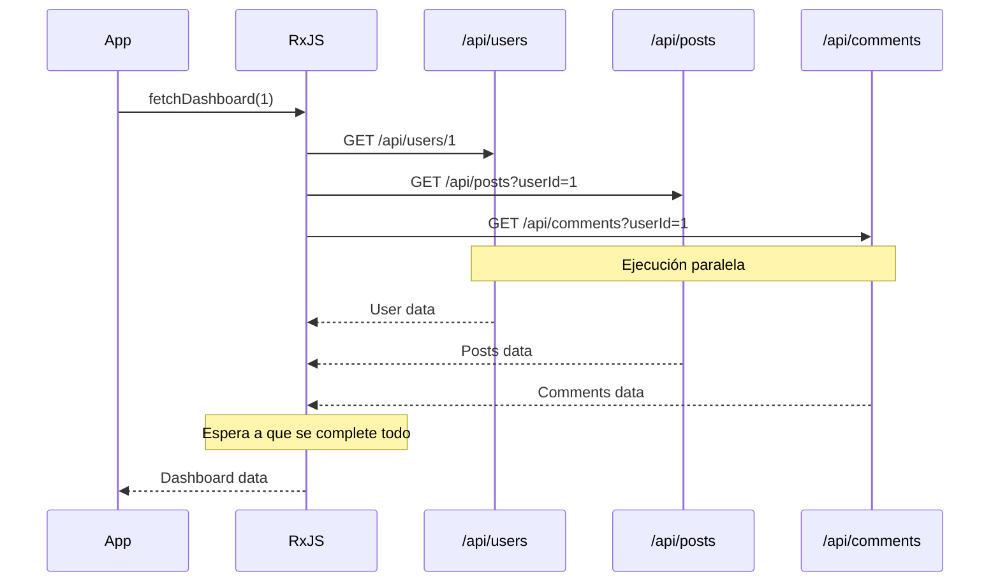
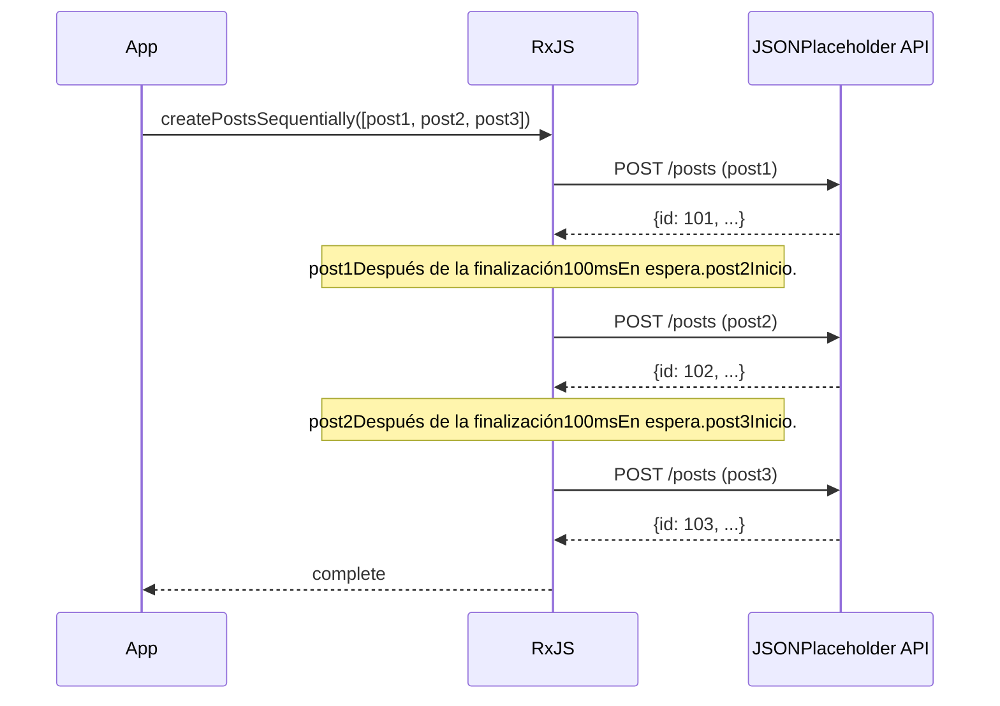

# Patrón de llamada API.

Las llamadas API son uno de los procesos más frecuentemente implementados en el desarrollo web, y RxJS permite implementar complejas llamadas API asíncronas de forma declarativa y robusta.

Este artículo describe patrones de implementación concretos para varios escenarios de llamadas a la API que se encuentran en la práctica, incluyendo la gestión de errores y la gestión de cancelaciones.

## Qué aprenderás en este artículo.

- Implementación básica de peticiones GET/POST
- Invocación paralela de múltiples APIs (forkJoin)
- Peticiones en serie que requieren ejecución secuencial (concatMap)
- Encadenamiento de peticiones con dependencias (switchMap)
- Reintentos y gestión de errores
- Gestión del tiempo de espera
- Cancelación de solicitudes

```typescript
import { from, Observable, catchError } from 'rxjs';

// JSONPlaceholder API(después de un sustantivo) basándose en ...Posttipo
// https://jsonplaceholder.typicode.com/posts
interface Post {
  id: number;
  userId: number;
  title: string;
  body: string;
}

interface CreatePostRequest {
  userId: number;
  title: string;
  body: string;
}

function createPost(postData: CreatePostRequest): Observable<Post> {
  return from(
    fetch('https://jsonplaceholder.typicode.com/posts', {
      method: 'POST',
      headers: {
        'Content-Type': 'application/json',
      },
      body: JSON.stringify(postData)
    }).then(response => {
      if (!response.ok) {
        throw new Error(`HTTP error! status: ${response.status}`);
      }
      return response.json();
    })
  ).pipe(
    catchError((err: unknown) => {
      console.error('Error al crear una entrada:', err);
      throw err;
    })
  );
}

// Ejemplo de uso
createPost({
  userId: 1,
  title: 'RxJSAprendiendo de',
  body: 'RxJSutilizando elAPIAprendizaje del patrón de llamadas a'
}).subscribe({
  next: post => {
    console.log('Mensajes creados:', post);
    console.log('Un postID:', post.id); // JSONPlaceholderseIDles asigna (por ejemplo: 101)
  },
  error: err => console.error('Error:', err)
});
```

> Este artículo forma parte del [Capítulo 4: Operadores](. /operators/index.md) y [Capítulo 6: Tratamiento de errores](. /manejo de errores/estrategias.md).

## Llamadas básicas a la API.

### Problema: Petición GET simple.

El caso más básico implementa una simple petición GET.

### Ejemplo de implementación.


```typescript
import { from, Observable, map, catchError, timeout } from 'rxjs';

// JSONPlaceholder API(después de un sustantivo) basándose en ...Usertipo
// https://jsonplaceholder.typicode.com/users
interface User {
  id: number;
  name: string;
  username: string;
  email: string;
  address: {
    street: string;
    suite: string;
    city: string;
    zipcode: string;
    geo: {
      lat: string;
      lng: string;
    };
  };
  phone: string;
  website: string;
  company: {
    name: string;
    catchPhrase: string;
    bs: string;
  };
}

// Recuperar lista de usuarios
function fetchUsers(): Observable<User[]> {
  return from(
    fetch('https://jsonplaceholder.typicode.com/users')
      .then(response => {
        if (!response.ok) {
          throw new Error(`HTTP error! status: ${response.status}`);
        }
        return response.json();
      })
  ).pipe(
    timeout(5000), // 5Tiempo de espera en segundos
    catchError((err: unknown) => {
      console.error('Error de adquisición de usuario:', err);
      throw err;
    })
  );
}

// Ejemplo de uso
fetchUsers().subscribe({
  next: users => {
    console.log('Lista de usuarios:', users);
    console.log('Primer usuario:', users[0].name); // Ejemplo: "Leanne Graham"
  },
  error: err => console.error('Error:', err)
});
```

```typescript
import { from, Observable, catchError } from 'rxjs';

// JSONPlaceholder API(después de un sustantivo) basándose en ...Posttipo
// https://jsonplaceholder.typicode.com/posts
interface Post {
  id: number;
  userId: number;
  title: string;
  body: string;
}

interface CreatePostRequest {
  userId: number;
  title: string;
  body: string;
}

function createPost(postData: CreatePostRequest): Observable<Post> {
  return from(
    fetch('https://jsonplaceholder.typicode.com/posts', {
      method: 'POST',
      headers: {
        'Content-Type': 'application/json',
      },
      body: JSON.stringify(postData)
    }).then(response => {
      if (!response.ok) {
        throw new Error(`HTTP error! status: ${response.status}`);
      }
      return response.json();
    })
  ).pipe(
    catchError((err: unknown) => {
      console.error('Error al crear una entrada:', err);
      throw err;
    })
  );
}

// Ejemplo de uso
createPost({
  userId: 1,
  title: 'RxJSAprendiendo de',
  body: 'RxJSutilizando elAPIAprendizaje del patrón de llamadas a'
}).subscribe({
  next: post => {
    console.log('Mensajes creados:', post);
    console.log('Un postID:', post.id); // JSONPlaceholderseIDles asigna (por ejemplo: 101)
  },
  error: err => console.error('Error:', err)
});
```

> Este ejemplo utiliza el método estándar `fetch` con `from()`, pero también puedes utilizar el método oficial de RxJS `ajax()`. ajax()` es más sofisticado y soporta cancelación de peticiones y monitorización del progreso.

### Petición POST.

Patrón para crear nuevos datos.


```typescript
import { from, Observable, catchError } from 'rxjs';

// JSONPlaceholder API(después de un sustantivo) basándose en ...Posttipo
// https://jsonplaceholder.typicode.com/posts
interface Post {
  id: number;
  userId: number;
  title: string;
  body: string;
}

interface CreatePostRequest {
  userId: number;
  title: string;
  body: string;
}

function createPost(postData: CreatePostRequest): Observable<Post> {
  return from(
    fetch('https://jsonplaceholder.typicode.com/posts', {
      method: 'POST',
      headers: {
        'Content-Type': 'application/json',
      },
      body: JSON.stringify(postData)
    }).then(response => {
      if (!response.ok) {
        throw new Error(`HTTP error! status: ${response.status}`);
      }
      return response.json();
    })
  ).pipe(
    catchError((err: unknown) => {
      console.error('Error al crear una entrada:', err);
      throw err;
    })
  );
}

// Ejemplo de uso
createPost({
  userId: 1,
  title: 'RxJSAprendiendo de',
  body: 'RxJSutilizando elAPIAprendizaje del patrón de llamadas a'
}).subscribe({
  next: post => {
    console.log('Mensajes creados:', post);
    console.log('Un postID:', post.id); // JSONPlaceholderseIDles asigna (por ejemplo: 101)
  },
  error: err => console.error('Error:', err)
});
```

> [!TIP] Consejos prácticos

> - **Seguridad de tipo**: definir claramente el tipo de respuesta
> - **Manejo de errores**: comprobar adecuadamente los códigos de estado HTTP
> - **Timeouts**: evitar largas esperas

## Peticiones paralelas (forkJoin)

### Problema: Quiero llamar a múltiples APIs al mismo tiempo.

Es posible que desee llamar a varias API independientes en paralelo y proceder sólo después de haber recibido todas las respuestas.

### Solución: utilice forkJoin.

forkJoin` espera a que se completen múltiples Observable y devuelve todos los resultados en un array (equivalente a Promise.all).

```typescript
import { forkJoin, from, Observable, map } from 'rxjs';

// JSONPlaceholder API(después de un sustantivo) basándose en ...Commenttipo
// https://jsonplaceholder.typicode.com/comments
interface Comment {
  postId: number;
  id: number;
  name: string;
  email: string;
  body: string;
}
interface Post {
  id: number;
  userId: number;
  title: string;
  body: string;
}
interface User {
  id: number;
  name: string;
  username: string;
  email: string;
  address: {
    street: string;
    suite: string;
    city: string;
    zipcode: string;
    geo: {
      lat: string;
      lng: string;
    };
  };
  phone: string;
  website: string;
  company: {
    name: string;
    catchPhrase: string;
    bs: string;
  };
}
interface Dashboard {
  user: User;
  posts: Post[];
  comments: Comment[];
}

function fetchUserById(id: number): Observable<User> {
  return from(
    fetch(`https://jsonplaceholder.typicode.com/users/${id}`).then(r => r.json())
  );
}

function fetchPostsByUserId(userId: number): Observable<Post[]> {
  return from(
    fetch(`https://jsonplaceholder.typicode.com/posts?userId=${userId}`).then(r => r.json())
  );
}

function fetchCommentsByPostId(postId: number): Observable<Comment[]> {
  return from(
    fetch(`https://jsonplaceholder.typicode.com/comments?postId=${postId}`).then(r => r.json())
  );
}

// Recuperación paralela de los datos del tablero
function fetchDashboard(userId: number): Observable<Dashboard> {
  return forkJoin({
    user: fetchUserById(userId),
    posts: fetchPostsByUserId(userId),
    comments: fetchCommentsByPostId(1) // Un postID=1Recuperar comentarios de
  }).pipe(
    map(({ user, posts, comments }) => ({
      user,
      posts,
      comments
    }))
  );
}

// Ejemplo de uso
fetchDashboard(1).subscribe({
  next: dashboard => {
    console.log('Usuario:', dashboard.user.name); // Ejemplo: "Leanne Graham"
    console.log('Número de entradas:', dashboard.posts.length); // Ejemplo: 10Número de entradas
    console.log('Número de comentarios:', dashboard.comments.length); // Ejemplo: 5Número de entradas
  },
  error: err => console.error('Error de adquisición del panel:', err)
});
```

#### Flujo de ejecución


```mermaid
sequenceDiagram
    participant App
    participant RxJS
    participant API1 as /api/users
    participant API2 as /api/posts
    participant API3 as /api/comments

    App->>RxJS: fetchDashboard(1)
    RxJS->>API1: GET /api/users/1
    RxJS->>API2: GET /api/posts?userId=1
    RxJS->>API3: GET /api/comments?userId=1

    Note over API1,API3: Ejecución paralela

    API1-->>RxJS: User data
    API2-->>RxJS: Posts data
    API3-->>RxJS: Comments data

    Note over RxJS: Espera a que se complete todo

    RxJS-->>App: Dashboard data
```

```typescript
import { from, Observable, catchError } from 'rxjs';

// JSONPlaceholder API(después de un sustantivo) basándose en ...Posttipo
// https://jsonplaceholder.typicode.com/posts
interface Post {
  id: number;
  userId: number;
  title: string;
  body: string;
}

interface CreatePostRequest {
  userId: number;
  title: string;
  body: string;
}

function createPost(postData: CreatePostRequest): Observable<Post> {
  return from(
    fetch('https://jsonplaceholder.typicode.com/posts', {
      method: 'POST',
      headers: {
        'Content-Type': 'application/json',
      },
      body: JSON.stringify(postData)
    }).then(response => {
      if (!response.ok) {
        throw new Error(`HTTP error! status: ${response.status}`);
      }
      return response.json();
    })
  ).pipe(
    catchError((err: unknown) => {
      console.error('Error al crear una entrada:', err);
      throw err;
    })
  );
}

// Ejemplo de uso
createPost({
  userId: 1,
  title: 'RxJSAprendiendo de',
  body: 'RxJSutilizando elAPIAprendizaje del patrón de llamadas a'
}).subscribe({
  next: post => {
    console.log('Mensajes creados:', post);
    console.log('Un postID:', post.id); // JSONPlaceholderseIDles asigna (por ejemplo: 101)
  },
  error: err => console.error('Error:', err)
});
```

> - Esperar hasta que todos los Observable se hayan completado.
> - **Si alguno de ellos falla, fallará el conjunto**
> - Todos los Observable deben emitir al menos un valor

### Gestión de errores mejorada

En peticiones paralelas, es posible que desee recuperar otros resultados incluso si algunos de ellos fallan.


```typescript
import { forkJoin, of, catchError } from 'rxjs';

function fetchDashboardWithFallback(userId: number): Observable<Dashboard> {
  return forkJoin({
    user: fetchUserById(userId).pipe(
      catchError((err: unknown) => {
        console.error('Error de adquisición de usuario:', err);
        return of(null); // En caso de error, devuelvenullDevuelve
      })
    ),
    posts: fetchPostsByUserId(userId).pipe(
      catchError((err: unknown) => {
        console.error('Post error de adquisición:', err);
        return of([]); // En caso de error, devuelve un array vacío
      })
    ),
    comments: fetchCommentsByUserId(userId).pipe(
      catchError((err: unknown) => {
        console.error('Error al recuperar comentario:', err);
        return of([]); // En caso de error, devuelve un array vacío
      })
    )
  }).pipe(
    map(({ user, posts, comments }) => ({
      user: user || { id: userId, name: 'Unknown', email: '' },
      posts,
      comments
    }))
  );
}
```

> [!TIP] 部分的なエラーハンドリング

> Aplicando `catchError` a cada Observable, todo el proceso puede continuar aunque alguno de ellos falle.

## Solicitud de serie (concatMap)

### Problema: Quiero ejecutar las APIs en orden.

Desea ejecutar la siguiente solicitud después de que la anterior se haya completado (por ejemplo, varias cargas de archivos en secuencia).

### Solución: utilizar concatMap.

concatMap` ejecuta el siguiente Observable después de que el anterior se haya completado.

```typescript
import { from, Observable, concatMap, tap, delay, catchError } from 'rxjs';

// JSONPlaceholder API(después de un sustantivo) basándose en ...Posttipo
// https://jsonplaceholder.typicode.com/posts
interface Post {
  id: number;
  userId: number;
  title: string;
  body: string;
}

interface CreatePostRequest {
  userId: number;
  title: string;
  body: string;
}

function createPost(postData: CreatePostRequest): Observable<Post> {
  return from(
    fetch('https://jsonplaceholder.typicode.com/posts', {
      method: 'POST',
      headers: {
        'Content-Type': 'application/json',
      },
      body: JSON.stringify(postData)
    }).then(response => {
      if (!response.ok) {
        throw new Error(`HTTP error! status: ${response.status}`);
      }
      return response.json();
    })
  ).pipe(
    catchError((err: unknown) => {
      console.error('Error al crear una entrada:', err);
      throw err;
    })
  );
}

// Crear varios posts en secuencia (enAPISe tiene en cuenta la limitación de velocidad)
function createPostsSequentially(posts: CreatePostRequest[]): Observable<Post> {
  return from(posts).pipe(
    concatMap((postData, index) =>
      createPost(postData).pipe(
        tap(result => console.log(`Un post${index + 1}Creación completada:`, result.title)),
        delay(100) // APITeniendo en cuenta la limitación de velocidad100msEn espera
      )
    )
  );
}

// Ejemplo de uso
const postsToCreate: CreatePostRequest[] = [
  {
    userId: 1,
    title: '1Segundo mensaje',
    body: 'Este es el1El segundo puesto.'
  },
  {
    userId: 1,
    title: '2Segundo mensaje',
    body: 'Este es el2El segundo puesto.'
  },
  {
    userId: 1,
    title: '3Segundo mensaje',
    body: 'Este es el3El segundo puesto.'
  }
];

const results: Post[] = [];

createPostsSequentially(postsToCreate).subscribe({
  next: post => {
    results.push(post);
    console.log(`Progreso: ${results.length}/${postsToCreate.length}`);
  },
  complete: () => {
    console.log('Todos los posts creados Completados:', results.length, 'Número de entradas');
  },
  error: err => console.error('Error al crear una entrada:', err)
});
```

#### Flujo de ejecución


```mermaid
sequenceDiagram
    participant App
    participant RxJS
    participant API as JSONPlaceholder API

    App->>RxJS: createPostsSequentially([post1, post2, post3])

    RxJS->>API: POST /posts (post1)
    API-->>RxJS: {id: 101, ...}
    Note over RxJS: post1Después de la finalización100msEn espera.post2Inicio.

    RxJS->>API: POST /posts (post2)
    API-->>RxJS: {id: 102, ...}
    Note over RxJS: post2Después de la finalización100msEn espera.post3Inicio.

    RxJS->>API: POST /posts (post3)
    API-->>RxJS: {id: 103, ...}

    RxJS-->>App: complete
```

```typescript
import { from, Observable, catchError } from 'rxjs';

// JSONPlaceholder API(después de un sustantivo) basándose en ...Posttipo
// https://jsonplaceholder.typicode.com/posts
interface Post {
  id: number;
  userId: number;
  title: string;
  body: string;
}

interface CreatePostRequest {
  userId: number;
  title: string;
  body: string;
}

function createPost(postData: CreatePostRequest): Observable<Post> {
  return from(
    fetch('https://jsonplaceholder.typicode.com/posts', {
      method: 'POST',
      headers: {
        'Content-Type': 'application/json',
      },
      body: JSON.stringify(postData)
    }).then(response => {
      if (!response.ok) {
        throw new Error(`HTTP error! status: ${response.status}`);
      }
      return response.json();
    })
  ).pipe(
    catchError((err: unknown) => {
      console.error('Error al crear una entrada:', err);
      throw err;
    })
  );
}

// Ejemplo de uso
createPost({
  userId: 1,
  title: 'RxJSAprendiendo de',
  body: 'RxJSutilizando elAPIAprendizaje del patrón de llamadas a'
}).subscribe({
  next: post => {
    console.log('Mensajes creados:', post);
    console.log('Un postID:', post.id); // JSONPlaceholderseIDles asigna (por ejemplo: 101)
  },
  error: err => console.error('Error:', err)
});
```

> - **concatMap**: ejecución secuencial (se completa la anterior, luego la siguiente)
> - **mergeMap**: ejecución paralela (múltiples ejecuciones simultáneas posibles).
>
> - `concatMap` si el orden es importante, `mergeMap` si el orden no es necesario y la velocidad es una prioridad.

## Solicitudes de dependencia (switchMap)

### Problema: llamar a la siguiente API utilizando la respuesta de la API anterior.

Uno de los patrones más comunes, utilizar el resultado de la respuesta de la primera API para llamar a la siguiente API.

### Solución: usar switchMap.

El switchMap` toma el valor del Observable anterior y lo convierte en un nuevo Observable.


```typescript
import { from, Observable, switchMap, map } from 'rxjs';

interface UserProfile {
  user: User;
  posts: Post[];
}
interface Post {
  id: number;
  userId: number;
  title: string;
  body: string;
}
interface User {
  id: number;
  name: string;
  username: string;
  email: string;
  address: {
    street: string;
    suite: string;
    city: string;
    zipcode: string;
    geo: {
      lat: string;
      lng: string;
    };
  };
  phone: string;
  website: string;
  company: {
    name: string;
    catchPhrase: string;
    bs: string;
  };
}

function fetchUserById(id: number): Observable<User> {
  return from(
    fetch(`https://jsonplaceholder.typicode.com/users/${id}`).then(r => r.json())
  );
}

function fetchPostsByUserId(userId: number): Observable<Post[]> {
  return from(
    fetch(`https://jsonplaceholder.typicode.com/posts?userId=${userId}`).then(r => r.json())
  );
}

// Recuperar los datos de los usuarios y sus mensajes
function fetchUserProfile(userId: number): Observable<UserProfile> {
  return fetchUserById(userId).pipe(
    switchMap(user =>
      // Después de recuperar los detalles del usuario y sus mensajes
      fetchPostsByUserId(user.id).pipe(
        map(posts => ({
          user,
          posts
        }))
      )
    )
  );
}

// Ejemplo de uso
fetchUserProfile(1).subscribe({
  next: profile => {
    console.log('Usuario:', profile.user.name);
    console.log('Un post:', profile.posts);
  },
  error: err => console.error('Error:', err)
});
```

### Ejemplo práctico: implementación de una función de búsqueda

Se trata de un patrón utilizado con frecuencia en la práctica, en el que se llama a la API en respuesta a la entrada de búsqueda del usuario.

```typescript
import { from, fromEvent, Observable, of, map, debounceTime, distinctUntilChanged, switchMap, catchError } from 'rxjs';

// JSONPlaceholder (después de un sustantivo) basándose en ... Post como resultados de búsqueda.
interface SearchResult {
  id: number;
  userId: number;
  title: string;
  body: string;
}

function searchAPI(query: string): Observable<SearchResult[]> {
  return from(
    fetch('https://jsonplaceholder.typicode.com/posts')
      .then(response => {
        if (!response.ok) {
          throw new Error(`HTTP error! status: ${response.status}`);
        }
        return response.json();
      })
  ).pipe(
    // Filtrado del lado del cliente por título
    map((posts: SearchResult[]) =>
      posts.filter(post =>
        post.title.toLowerCase().includes(query.toLowerCase())
      )
    )
  );
}

// Traditional approach (commented for reference)
// const searchInput = document.querySelector<HTMLInputElement>('#search');

// Self-contained: creates search input and results container dynamically
const searchInput = document.createElement('input');
searchInput.id = 'search';
searchInput.type = 'text';
searchInput.placeholder = 'Introduzca palabras clave de búsqueda (al menos2caracteres o más)';
searchInput.style.padding = '10px';
searchInput.style.margin = '10px';
searchInput.style.width = '400px';
searchInput.style.fontSize = '16px';
searchInput.style.border = '2px solid #ccc';
searchInput.style.borderRadius = '4px';
searchInput.style.display = 'block';
document.body.appendChild(searchInput);

const resultsContainer = document.createElement('div');
resultsContainer.id = 'results';
resultsContainer.style.padding = '10px';
resultsContainer.style.margin = '10px';
resultsContainer.style.minHeight = '100px';
resultsContainer.style.border = '1px solid #ddd';
resultsContainer.style.borderRadius = '4px';
resultsContainer.style.backgroundColor = '#f9f9f9';
document.body.appendChild(resultsContainer);

const search$ = fromEvent(searchInput, 'input').pipe(
  map(event => (event.target as HTMLInputElement).value),
  debounceTime(300),           // Después de introducirlas300msEsperar
  distinctUntilChanged(),      // Ignorado si el valor es el mismo que la última vez
  switchMap(query => {
    if (query.length < 2) {
      return of([]); // 2Si tiene menos de 1 carácter, matriz vacía
    }
    return searchAPI(query).pipe(
      catchError((err: unknown) => {
        console.error('Error de búsqueda:', err);
        return of([]); // Matriz vacía en caso de error
      })
    );
  })
);

search$.subscribe(results => {
  console.log('Buscar resultados:', results);
  // UIMostrar resultados en
  displayResults(results, resultsContainer);
});

function displayResults(results: SearchResult[], container: HTMLElement): void {
  // Muestra los resultados enDOMProceso que muestra los resultados en
  container.innerHTML = results
    .map(r => `<div style="padding: 8px; margin: 4px; border-bottom: 1px solid #eee;">${r.title}</div>`)
    .join('');

  if (results.length === 0) {
    container.innerHTML = '<div style="padding: 8px; color: #999;">Sin resultados de búsqueda</div>';
  }
}
```

> [!TIP] クライアントサイドフィルタリング

> La API de JSONPlaceholder no tiene un punto final de búsqueda, por lo que todas las entradas se recuperan y filtran en el lado del cliente. En la práctica, este patrón se utiliza cuando el back-end no tiene una función de búsqueda o cuando la cantidad de datos es pequeña.
>
> **Ejemplo de búsqueda**:
> - Búsqueda de "sunt" → varios mensajes encontrados.
> - Búsqueda con "qui est esse" → resultados con títulos que contienen "qui est esse"
> - Búsqueda con "zzz" → No hay resultados (no procede).

#### Flujo de ejecución

```typescript
import { from, Observable, map, catchError, timeout } from 'rxjs';

// JSONPlaceholder API(después de un sustantivo) basándose en ...Usertipo
// https://jsonplaceholder.typicode.com/users
interface User {
  id: number;
  name: string;
  username: string;
  email: string;
  address: {
    street: string;
    suite: string;
    city: string;
    zipcode: string;
    geo: {
      lat: string;
      lng: string;
    };
  };
  phone: string;
  website: string;
  company: {
    name: string;
    catchPhrase: string;
    bs: string;
  };
}

// Recuperar lista de usuarios
function fetchUsers(): Observable<User[]> {
  return from(
    fetch('https://jsonplaceholder.typicode.com/users')
      .then(response => {
        if (!response.ok) {
          throw new Error(`HTTP error! status: ${response.status}`);
        }
        return response.json();
      })
  ).pipe(
    timeout(5000), // 5Tiempo de espera en segundos
    catchError((err: unknown) => {
      console.error('Error de adquisición de usuario:', err);
      throw err;
    })
  );
}

// Ejemplo de uso
fetchUsers().subscribe({
  next: users => {
    console.log('Lista de usuarios:', users);
    console.log('Primer usuario:', users[0].name); // Ejemplo: "Leanne Graham"
  },
  error: err => console.error('Error:', err)
});
```


```typescript
import { from, Observable, catchError } from 'rxjs';

// JSONPlaceholder API(después de un sustantivo) basándose en ...Posttipo
// https://jsonplaceholder.typicode.com/posts
interface Post {
  id: number;
  userId: number;
  title: string;
  body: string;
}

interface CreatePostRequest {
  userId: number;
  title: string;
  body: string;
}

function createPost(postData: CreatePostRequest): Observable<Post> {
  return from(
    fetch('https://jsonplaceholder.typicode.com/posts', {
      method: 'POST',
      headers: {
        'Content-Type': 'application/json',
      },
      body: JSON.stringify(postData)
    }).then(response => {
      if (!response.ok) {
        throw new Error(`HTTP error! status: ${response.status}`);
      }
      return response.json();
    })
  ).pipe(
    catchError((err: unknown) => {
      console.error('Error al crear una entrada:', err);
      throw err;
    })
  );
}

// Ejemplo de uso
createPost({
  userId: 1,
  title: 'RxJSAprendiendo de',
  body: 'RxJSutilizando elAPIAprendizaje del patrón de llamadas a'
}).subscribe({
  next: post => {
    console.log('Mensajes creados:', post);
    console.log('Un postID:', post.id); // JSONPlaceholderseIDles asigna (por ejemplo: 101)
  },
  error: err => console.error('Error:', err)
});
```

> ** Cancela automáticamente el Observable anterior cuando llega un nuevo valor. **
> Esto asegura que las respuestas a peticiones API más antiguas sean ignoradas aunque lleguen más tarde (Race Condition avoidance).

### switchMap vs mergeMap vs concatMap

El uso de operadores de mapeo de orden superior.


```typescript
import { from, Observable, catchError } from 'rxjs';

// JSONPlaceholder API(después de un sustantivo) basándose en ...Posttipo
// https://jsonplaceholder.typicode.com/posts
interface Post {
  id: number;
  userId: number;
  title: string;
  body: string;
}

interface CreatePostRequest {
  userId: number;
  title: string;
  body: string;
}

function createPost(postData: CreatePostRequest): Observable<Post> {
  return from(
    fetch('https://jsonplaceholder.typicode.com/posts', {
      method: 'POST',
      headers: {
        'Content-Type': 'application/json',
      },
      body: JSON.stringify(postData)
    }).then(response => {
      if (!response.ok) {
        throw new Error(`HTTP error! status: ${response.status}`);
      }
      return response.json();
    })
  ).pipe(
    catchError((err: unknown) => {
      console.error('Error al crear una entrada:', err);
      throw err;
    })
  );
}

// Ejemplo de uso
createPost({
  userId: 1,
  title: 'RxJSAprendiendo de',
  body: 'RxJSutilizando elAPIAprendizaje del patrón de llamadas a'
}).subscribe({
  next: post => {
    console.log('Mensajes creados:', post);
    console.log('Un postID:', post.id); // JSONPlaceholderseIDles asigna (por ejemplo: 101)
  },
  error: err => console.error('Error:', err)
});
```


```typescript
import { from, Observable, map, catchError, timeout } from 'rxjs';

// JSONPlaceholder API(después de un sustantivo) basándose en ...Usertipo
// https://jsonplaceholder.typicode.com/users
interface User {
  id: number;
  name: string;
  username: string;
  email: string;
  address: {
    street: string;
    suite: string;
    city: string;
    zipcode: string;
    geo: {
      lat: string;
      lng: string;
    };
  };
  phone: string;
  website: string;
  company: {
    name: string;
    catchPhrase: string;
    bs: string;
  };
}

// Recuperar lista de usuarios
function fetchUsers(): Observable<User[]> {
  return from(
    fetch('https://jsonplaceholder.typicode.com/users')
      .then(response => {
        if (!response.ok) {
          throw new Error(`HTTP error! status: ${response.status}`);
        }
        return response.json();
      })
  ).pipe(
    timeout(5000), // 5Tiempo de espera en segundos
    catchError((err: unknown) => {
      console.error('Error de adquisición de usuario:', err);
      throw err;
    })
  );
}

// Ejemplo de uso
fetchUsers().subscribe({
  next: users => {
    console.log('Lista de usuarios:', users);
    console.log('Primer usuario:', users[0].name); // Ejemplo: "Leanne Graham"
  },
  error: err => console.error('Error:', err)
});
```

## Reintentos y gestión de errores

### Problema: Quiero manejar errores temporales de red

En caso de que se produzca un error de red o se agote el tiempo de espera, es posible que desee reintentarlo automáticamente.

### Solución: use retry y retryWhen.


```typescript
import { from, Observable, map, catchError, timeout } from 'rxjs';

// JSONPlaceholder API(después de un sustantivo) basándose en ...Usertipo
// https://jsonplaceholder.typicode.com/users
interface User {
  id: number;
  name: string;
  username: string;
  email: string;
  address: {
    street: string;
    suite: string;
    city: string;
    zipcode: string;
    geo: {
      lat: string;
      lng: string;
    };
  };
  phone: string;
  website: string;
  company: {
    name: string;
    catchPhrase: string;
    bs: string;
  };
}

// Recuperar lista de usuarios
function fetchUsers(): Observable<User[]> {
  return from(
    fetch('https://jsonplaceholder.typicode.com/users')
      .then(response => {
        if (!response.ok) {
          throw new Error(`HTTP error! status: ${response.status}`);
        }
        return response.json();
      })
  ).pipe(
    timeout(5000), // 5Tiempo de espera en segundos
    catchError((err: unknown) => {
      console.error('Error de adquisición de usuario:', err);
      throw err;
    })
  );
}

// Ejemplo de uso
fetchUsers().subscribe({
  next: users => {
    console.log('Lista de usuarios:', users);
    console.log('Primer usuario:', users[0].name); // Ejemplo: "Leanne Graham"
  },
  error: err => console.error('Error:', err)
});
```

**Ejemplo de backoff exponencial en acción:***


```typescript
import { from, Observable, map, catchError, timeout } from 'rxjs';

// JSONPlaceholder API(después de un sustantivo) basándose en ...Usertipo
// https://jsonplaceholder.typicode.com/users
interface User {
  id: number;
  name: string;
  username: string;
  email: string;
  address: {
    street: string;
    suite: string;
    city: string;
    zipcode: string;
    geo: {
      lat: string;
      lng: string;
    };
  };
  phone: string;
  website: string;
  company: {
    name: string;
    catchPhrase: string;
    bs: string;
  };
}

// Recuperar lista de usuarios
function fetchUsers(): Observable<User[]> {
  return from(
    fetch('https://jsonplaceholder.typicode.com/users')
      .then(response => {
        if (!response.ok) {
          throw new Error(`HTTP error! status: ${response.status}`);
        }
        return response.json();
      })
  ).pipe(
    timeout(5000), // 5Tiempo de espera en segundos
    catchError((err: unknown) => {
      console.error('Error de adquisición de usuario:', err);
      throw err;
    })
  );
}

// Ejemplo de uso
fetchUsers().subscribe({
  next: users => {
    console.log('Lista de usuarios:', users);
    console.log('Primer usuario:', users[0].name); // Ejemplo: "Leanne Graham"
  },
  error: err => console.error('Error:', err)
});
```

> [!TIP] リトライ戦略の選択

> - **Immediate retry**: `retry(3)` - simple, útil para caídas de red
> - **Intervalo fijo**: `retryWhen` + `delay(1000)` - tiene en cuenta la carga del servidor
> RetryWhen" + "timer" - la mejor práctica para AWS, etc.

### Reintentar sólo en errores específicos

No todos los errores deben ser reintentados (por ejemplo, 401 No autorizado no requiere un reintento).


```typescript
import { from, Observable, map, catchError, timeout } from 'rxjs';

// JSONPlaceholder API(después de un sustantivo) basándose en ...Usertipo
// https://jsonplaceholder.typicode.com/users
interface User {
  id: number;
  name: string;
  username: string;
  email: string;
  address: {
    street: string;
    suite: string;
    city: string;
    zipcode: string;
    geo: {
      lat: string;
      lng: string;
    };
  };
  phone: string;
  website: string;
  company: {
    name: string;
    catchPhrase: string;
    bs: string;
  };
}

// Recuperar lista de usuarios
function fetchUsers(): Observable<User[]> {
  return from(
    fetch('https://jsonplaceholder.typicode.com/users')
      .then(response => {
        if (!response.ok) {
          throw new Error(`HTTP error! status: ${response.status}`);
        }
        return response.json();
      })
  ).pipe(
    timeout(5000), // 5Tiempo de espera en segundos
    catchError((err: unknown) => {
      console.error('Error de adquisición de usuario:', err);
      throw err;
    })
  );
}

// Ejemplo de uso
fetchUsers().subscribe({
  next: users => {
    console.log('Lista de usuarios:', users);
    console.log('Primer usuario:', users[0].name); // Ejemplo: "Leanne Graham"
  },
  error: err => console.error('Error:', err)
});
```


```typescript
import { forkJoin, from, Observable, map } from 'rxjs';

// JSONPlaceholder API(después de un sustantivo) basándose en ...Commenttipo
// https://jsonplaceholder.typicode.com/comments
interface Comment {
  postId: number;
  id: number;
  name: string;
  email: string;
  body: string;
}
interface Post {
  id: number;
  userId: number;
  title: string;
  body: string;
}
interface User {
  id: number;
  name: string;
  username: string;
  email: string;
  address: {
    street: string;
    suite: string;
    city: string;
    zipcode: string;
    geo: {
      lat: string;
      lng: string;
    };
  };
  phone: string;
  website: string;
  company: {
    name: string;
    catchPhrase: string;
    bs: string;
  };
}
interface Dashboard {
  user: User;
  posts: Post[];
  comments: Comment[];
}

function fetchUserById(id: number): Observable<User> {
  return from(
    fetch(`https://jsonplaceholder.typicode.com/users/${id}`).then(r => r.json())
  );
}

function fetchPostsByUserId(userId: number): Observable<Post[]> {
  return from(
    fetch(`https://jsonplaceholder.typicode.com/posts?userId=${userId}`).then(r => r.json())
  );
}

function fetchCommentsByPostId(postId: number): Observable<Comment[]> {
  return from(
    fetch(`https://jsonplaceholder.typicode.com/comments?postId=${postId}`).then(r => r.json())
  );
}

// Recuperación paralela de los datos del tablero
function fetchDashboard(userId: number): Observable<Dashboard> {
  return forkJoin({
    user: fetchUserById(userId),
    posts: fetchPostsByUserId(userId),
    comments: fetchCommentsByPostId(1) // Un postID=1Recuperar comentarios de
  }).pipe(
    map(({ user, posts, comments }) => ({
      user,
      posts,
      comments
    }))
  );
}

// Ejemplo de uso
fetchDashboard(1).subscribe({
  next: dashboard => {
    console.log('Usuario:', dashboard.user.name); // Ejemplo: "Leanne Graham"
    console.log('Número de entradas:', dashboard.posts.length); // Ejemplo: 10Número de entradas
    console.log('Número de comentarios:', dashboard.comments.length); // Ejemplo: 5Número de entradas
  },
  error: err => console.error('Error de adquisición del panel:', err)
});
```

> - **Solicitud POST**: riesgo de creación de duplicados al reintentar si no hay igualdad
> - **Errores de autenticación**: 401/403 no reintentar, pedir re-inicio de sesión
> - **ERROR DE VALIDACIÓN**: 400 no reintentar, pedir al usuario que corrija

## Gestión del tiempo de espera

### Problema: Quiero hacer frente a la lenta respuesta de la API

Si la red es lenta o el servidor no responde, quieres que se agote el tiempo de espera después de un cierto periodo de tiempo.

### Solución: utilizar el operador timeout.


```typescript
import { from, Observable, map, catchError, timeout } from 'rxjs';

// JSONPlaceholder API(después de un sustantivo) basándose en ...Usertipo
// https://jsonplaceholder.typicode.com/users
interface User {
  id: number;
  name: string;
  username: string;
  email: string;
  address: {
    street: string;
    suite: string;
    city: string;
    zipcode: string;
    geo: {
      lat: string;
      lng: string;
    };
  };
  phone: string;
  website: string;
  company: {
    name: string;
    catchPhrase: string;
    bs: string;
  };
}

// Recuperar lista de usuarios
function fetchUsers(): Observable<User[]> {
  return from(
    fetch('https://jsonplaceholder.typicode.com/users')
      .then(response => {
        if (!response.ok) {
          throw new Error(`HTTP error! status: ${response.status}`);
        }
        return response.json();
      })
  ).pipe(
    timeout(5000), // 5Tiempo de espera en segundos
    catchError((err: unknown) => {
      console.error('Error de adquisición de usuario:', err);
      throw err;
    })
  );
}

// Ejemplo de uso
fetchUsers().subscribe({
  next: users => {
    console.log('Lista de usuarios:', users);
    console.log('Primer usuario:', users[0].name); // Ejemplo: "Leanne Graham"
  },
  error: err => console.error('Error:', err)
});
```

### Combinación de reintento y tiempo de espera

En la práctica, los tiempos de espera y los reintentos se utilizan de forma combinada.


```typescript
import { from, Observable, map, catchError, timeout } from 'rxjs';

// JSONPlaceholder API(después de un sustantivo) basándose en ...Usertipo
// https://jsonplaceholder.typicode.com/users
interface User {
  id: number;
  name: string;
  username: string;
  email: string;
  address: {
    street: string;
    suite: string;
    city: string;
    zipcode: string;
    geo: {
      lat: string;
      lng: string;
    };
  };
  phone: string;
  website: string;
  company: {
    name: string;
    catchPhrase: string;
    bs: string;
  };
}

// Recuperar lista de usuarios
function fetchUsers(): Observable<User[]> {
  return from(
    fetch('https://jsonplaceholder.typicode.com/users')
      .then(response => {
        if (!response.ok) {
          throw new Error(`HTTP error! status: ${response.status}`);
        }
        return response.json();
      })
  ).pipe(
    timeout(5000), // 5Tiempo de espera en segundos
    catchError((err: unknown) => {
      console.error('Error de adquisición de usuario:', err);
      throw err;
    })
  );
}

// Ejemplo de uso
fetchUsers().subscribe({
  next: users => {
    console.log('Lista de usuarios:', users);
    console.log('Primer usuario:', users[0].name); // Ejemplo: "Leanne Graham"
  },
  error: err => console.error('Error:', err)
});
```

> [!TIP] タイムアウト値の設定

> - **AIP normal**: 5 - 10 segundos
> API rápida**: 2 - 3 segundos
> - **Carga de archivos**: 30 - 60 segundos
> - **Procesamiento en segundo plano**: más de 60 segundos
>
> Establecido para equilibrar la experiencia del usuario y la carga del servidor.

## Proceso de cancelación de solicitud.

### Problema: Quiero cancelar las solicitudes de API que ya no son necesarias.

Quiero cancelar una solicitud de API en ejecución cuando se destruye una transición de página o un componente.

### Solución: utilizar takeUntil.


```typescript
import { from, Observable, map, catchError, timeout } from 'rxjs';

// JSONPlaceholder API(después de un sustantivo) basándose en ...Usertipo
// https://jsonplaceholder.typicode.com/users
interface User {
  id: number;
  name: string;
  username: string;
  email: string;
  address: {
    street: string;
    suite: string;
    city: string;
    zipcode: string;
    geo: {
      lat: string;
      lng: string;
    };
  };
  phone: string;
  website: string;
  company: {
    name: string;
    catchPhrase: string;
    bs: string;
  };
}

// Recuperar lista de usuarios
function fetchUsers(): Observable<User[]> {
  return from(
    fetch('https://jsonplaceholder.typicode.com/users')
      .then(response => {
        if (!response.ok) {
          throw new Error(`HTTP error! status: ${response.status}`);
        }
        return response.json();
      })
  ).pipe(
    timeout(5000), // 5Tiempo de espera en segundos
    catchError((err: unknown) => {
      console.error('Error de adquisición de usuario:', err);
      throw err;
    })
  );
}

// Ejemplo de uso
fetchUsers().subscribe({
  next: users => {
    console.log('Lista de usuarios:', users);
    console.log('Primer usuario:', users[0].name); // Ejemplo: "Leanne Graham"
  },
  error: err => console.error('Error:', err)
});
```

### Cancelación controlada por el usuario

Este es un ejemplo de implementación de un botón de cancelación explícito.


```typescript
import { from, Observable, map, catchError, timeout } from 'rxjs';

// JSONPlaceholder API(después de un sustantivo) basándose en ...Usertipo
// https://jsonplaceholder.typicode.com/users
interface User {
  id: number;
  name: string;
  username: string;
  email: string;
  address: {
    street: string;
    suite: string;
    city: string;
    zipcode: string;
    geo: {
      lat: string;
      lng: string;
    };
  };
  phone: string;
  website: string;
  company: {
    name: string;
    catchPhrase: string;
    bs: string;
  };
}

// Recuperar lista de usuarios
function fetchUsers(): Observable<User[]> {
  return from(
    fetch('https://jsonplaceholder.typicode.com/users')
      .then(response => {
        if (!response.ok) {
          throw new Error(`HTTP error! status: ${response.status}`);
        }
        return response.json();
      })
  ).pipe(
    timeout(5000), // 5Tiempo de espera en segundos
    catchError((err: unknown) => {
      console.error('Error de adquisición de usuario:', err);
      throw err;
    })
  );
}

// Ejemplo de uso
fetchUsers().subscribe({
  next: users => {
    console.log('Lista de usuarios:', users);
    console.log('Primer usuario:', users[0].name); // Ejemplo: "Leanne Graham"
  },
  error: err => console.error('Error:', err)
});
```

> [!IMPORTANT] キャンセルのベストプラクティス

> - **Implemente siempre un proceso de cancelación** - evita fugas de memoria y desperdicio de red
> - **Utilizar takeUntil** - más declarativo y menos olvidable que unsubscribe()
> - **Al destruir componentes** - dispara destroy$ para desuscribir todo

## Ejemplos prácticos de clases de servicio

Este es un ejemplo de una clase de servicio completa que resume los patrones anteriores y puede utilizarse en la práctica.


```typescript
import { from, Observable, map, catchError, timeout } from 'rxjs';

// JSONPlaceholder API(después de un sustantivo) basándose en ...Usertipo
// https://jsonplaceholder.typicode.com/users
interface User {
  id: number;
  name: string;
  username: string;
  email: string;
  address: {
    street: string;
    suite: string;
    city: string;
    zipcode: string;
    geo: {
      lat: string;
      lng: string;
    };
  };
  phone: string;
  website: string;
  company: {
    name: string;
    catchPhrase: string;
    bs: string;
  };
}

// Recuperar lista de usuarios
function fetchUsers(): Observable<User[]> {
  return from(
    fetch('https://jsonplaceholder.typicode.com/users')
      .then(response => {
        if (!response.ok) {
          throw new Error(`HTTP error! status: ${response.status}`);
        }
        return response.json();
      })
  ).pipe(
    timeout(5000), // 5Tiempo de espera en segundos
    catchError((err: unknown) => {
      console.error('Error de adquisición de usuario:', err);
      throw err;
    })
  );
}

// Ejemplo de uso
fetchUsers().subscribe({
  next: users => {
    console.log('Lista de usuarios:', users);
    console.log('Primer usuario:', users[0].name); // Ejemplo: "Leanne Graham"
  },
  error: err => console.error('Error:', err)
});
```

> [!TIP] 実践的なサービス設計

> - **Configurable**: configuración flexible de tiempos de espera, recuentos de reintentos, etc.
> - **Funcionalidad de caché**: evita peticiones duplicadas
> - **Manejo de errores**: manejo uniforme de errores
> - **Limpieza automática**: destroy() asegura la liberación de recursos

## Código de prueba

Ejemplo de prueba para el patrón de invocación de la API.


```typescript
import { from, Observable, catchError } from 'rxjs';

// JSONPlaceholder API(después de un sustantivo) basándose en ...Posttipo
// https://jsonplaceholder.typicode.com/posts
interface Post {
  id: number;
  userId: number;
  title: string;
  body: string;
}

interface CreatePostRequest {
  userId: number;
  title: string;
  body: string;
}

function createPost(postData: CreatePostRequest): Observable<Post> {
  return from(
    fetch('https://jsonplaceholder.typicode.com/posts', {
      method: 'POST',
      headers: {
        'Content-Type': 'application/json',
      },
      body: JSON.stringify(postData)
    }).then(response => {
      if (!response.ok) {
        throw new Error(`HTTP error! status: ${response.status}`);
      }
      return response.json();
    })
  ).pipe(
    catchError((err: unknown) => {
      console.error('Error al crear una entrada:', err);
      throw err;
    })
  );
}

// Ejemplo de uso
createPost({
  userId: 1,
  title: 'RxJSAprendiendo de',
  body: 'RxJSutilizando elAPIAprendizaje del patrón de llamadas a'
}).subscribe({
  next: post => {
    console.log('Mensajes creados:', post);
    console.log('Un postID:', post.id); // JSONPlaceholderseIDles asigna (por ejemplo: 101)
  },
  error: err => console.error('Error:', err)
});
```

## Resumen.

Dominando el patrón de invocación API usando RxJS, se pueden construir aplicaciones robustas y mantenibles.


```typescript
import { forkJoin, from, Observable, map } from 'rxjs';

// JSONPlaceholder API(después de un sustantivo) basándose en ...Commenttipo
// https://jsonplaceholder.typicode.com/comments
interface Comment {
  postId: number;
  id: number;
  name: string;
  email: string;
  body: string;
}
interface Post {
  id: number;
  userId: number;
  title: string;
  body: string;
}
interface User {
  id: number;
  name: string;
  username: string;
  email: string;
  address: {
    street: string;
    suite: string;
    city: string;
    zipcode: string;
    geo: {
      lat: string;
      lng: string;
    };
  };
  phone: string;
  website: string;
  company: {
    name: string;
    catchPhrase: string;
    bs: string;
  };
}
interface Dashboard {
  user: User;
  posts: Post[];
  comments: Comment[];
}

function fetchUserById(id: number): Observable<User> {
  return from(
    fetch(`https://jsonplaceholder.typicode.com/users/${id}`).then(r => r.json())
  );
}

function fetchPostsByUserId(userId: number): Observable<Post[]> {
  return from(
    fetch(`https://jsonplaceholder.typicode.com/posts?userId=${userId}`).then(r => r.json())
  );
}

function fetchCommentsByPostId(postId: number): Observable<Comment[]> {
  return from(
    fetch(`https://jsonplaceholder.typicode.com/comments?postId=${postId}`).then(r => r.json())
  );
}

// Recuperación paralela de los datos del tablero
function fetchDashboard(userId: number): Observable<Dashboard> {
  return forkJoin({
    user: fetchUserById(userId),
    posts: fetchPostsByUserId(userId),
    comments: fetchCommentsByPostId(1) // Un postID=1Recuperar comentarios de
  }).pipe(
    map(({ user, posts, comments }) => ({
      user,
      posts,
      comments
    }))
  );
}

// Ejemplo de uso
fetchDashboard(1).subscribe({
  next: dashboard => {
    console.log('Usuario:', dashboard.user.name); // Ejemplo: "Leanne Graham"
    console.log('Número de entradas:', dashboard.posts.length); // Ejemplo: 10Número de entradas
    console.log('Número de comentarios:', dashboard.comments.length); // Ejemplo: 5Número de entradas
  },
  error: err => console.error('Error de adquisición del panel:', err)
});
```

> - **forkJoin**: ejecuta múltiples APIs en paralelo, todas a la espera de ser completadas
> - **concatMap**: ejecuta APIs en orden (la anterior completada, luego la siguiente)
> - **switchMap**: ideal para peticiones dependientes, funciones de búsqueda
> - **retry/retryWhen**: reintento automático en caso de error, se recomienda un backoff exponencial
> - **timeout**: establece siempre un timeout
> - **takeUntil**: cancelación automática en caso de destrucción del componente


```typescript
import { forkJoin, from, Observable, map } from 'rxjs';

// JSONPlaceholder API(después de un sustantivo) basándose en ...Commenttipo
// https://jsonplaceholder.typicode.com/comments
interface Comment {
  postId: number;
  id: number;
  name: string;
  email: string;
  body: string;
}
interface Post {
  id: number;
  userId: number;
  title: string;
  body: string;
}
interface User {
  id: number;
  name: string;
  username: string;
  email: string;
  address: {
    street: string;
    suite: string;
    city: string;
    zipcode: string;
    geo: {
      lat: string;
      lng: string;
    };
  };
  phone: string;
  website: string;
  company: {
    name: string;
    catchPhrase: string;
    bs: string;
  };
}
interface Dashboard {
  user: User;
  posts: Post[];
  comments: Comment[];
}

function fetchUserById(id: number): Observable<User> {
  return from(
    fetch(`https://jsonplaceholder.typicode.com/users/${id}`).then(r => r.json())
  );
}

function fetchPostsByUserId(userId: number): Observable<Post[]> {
  return from(
    fetch(`https://jsonplaceholder.typicode.com/posts?userId=${userId}`).then(r => r.json())
  );
}

function fetchCommentsByPostId(postId: number): Observable<Comment[]> {
  return from(
    fetch(`https://jsonplaceholder.typicode.com/comments?postId=${postId}`).then(r => r.json())
  );
}

// Recuperación paralela de los datos del tablero
function fetchDashboard(userId: number): Observable<Dashboard> {
  return forkJoin({
    user: fetchUserById(userId),
    posts: fetchPostsByUserId(userId),
    comments: fetchCommentsByPostId(1) // Un postID=1Recuperar comentarios de
  }).pipe(
    map(({ user, posts, comments }) => ({
      user,
      posts,
      comments
    }))
  );
}

// Ejemplo de uso
fetchDashboard(1).subscribe({
  next: dashboard => {
    console.log('Usuario:', dashboard.user.name); // Ejemplo: "Leanne Graham"
    console.log('Número de entradas:', dashboard.posts.length); // Ejemplo: 10Número de entradas
    console.log('Número de comentarios:', dashboard.comments.length); // Ejemplo: 5Número de entradas
  },
  error: err => console.error('Error de adquisición del panel:', err)
});
```

> - **Seguridad de tipos**: definir tipos para todas las respuestas de la API
> - **Manejo de errores**: implementar `catchError` para todas las peticiones
> - **Manejo de cancelaciones**: asegurar la limpieza con `takeUntil`.
> - **Estrategia de reintento**: reintentar apropiadamente según el código de estado
> - **Caching**: evitar peticiones duplicadas con `shareReplay`.

## Próximos pasos.

Una vez que domines el patrón de llamadas a la API, puedes pasar a los siguientes patrones.

- [form-handling](. /form-handling.md) - validación en tiempo real, autoguardado.
- [Manejo de eventos de interfaz de usuario](. /ui-events.md) - integración de eventos de interfaz de usuario y llamadas a la API.
- Procesamiento de datos en tiempo real](. /real-time-data.md)) - WebSocket, SSE.
- [estrategias de almacenamiento en caché] (. /caching-strategies.md) - Almacenamiento en caché de las respuestas de la API.
- Prácticas de gestión de errores (en preparación) - Estrategias más avanzadas de gestión de errores

## Secciones relacionadas.

- Capítulo 4: Operadores](. /operators/index.md) - más sobre switchMap, mergeMap y concatMap.
- Capítulo 6: Tratamiento de errores](. /error-handling/strategies.md)) - conceptos básicos de catchError, retry
- Capítulo 2: Cold/Hot Observable](. /observables/cold-and-hot-observables.md)) - Entendiendo shareReplay

## Recursos de referencia

- RxJS Official: ajax](https://rxjs.dev/api/ajax/ajax) - Más información sobre ajax().
- MDN: Fetch API](https://developer.mozilla.org/ja/docs/Web/API/Fetch_API) - Cómo usar fetch().
- Learn RxJS: Higher-order Observable](https://www.learnrxjs.io/learn-rxjs/operators) - Comparación de switchMap, etc.
