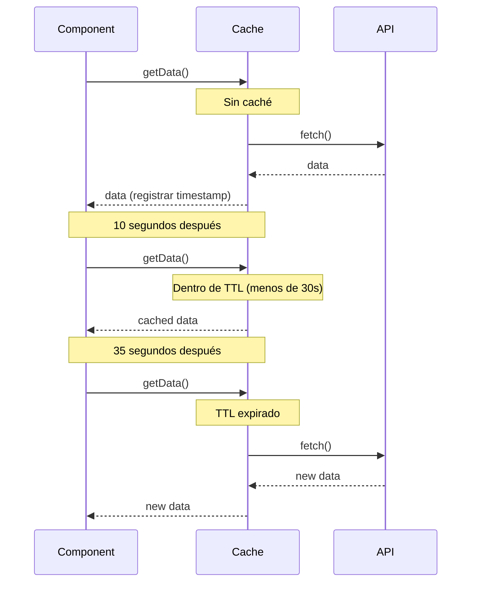
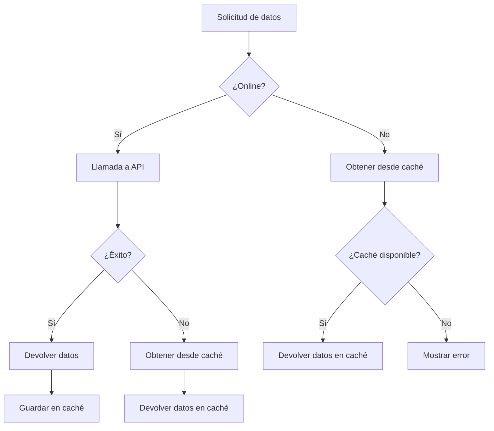

# Patrones de Estrategia de Caché

El caché es una de las técnicas más importantes en la optimización del rendimiento. Con RxJS, puedes implementar estrategias de caché declarativas y flexibles.

Este artículo explica patrones concretos de estrategias de caché necesarias para el trabajo práctico, desde el caché básico con shareReplay hasta caché con TTL, invalidación de caché e integración con localStorage.

## Lo que aprenderás en este artículo

- Caché básico con shareReplay
- Implementación de caché con TTL (tiempo de vida)
- Refrescamiento manual e invalidación de caché
- Integración con localStorage
- Respaldo offline y fallback de caché
- Monitoreo y depuración de caché

> [!TIP] Conocimientos previos
> Este artículo asume conocimientos de [Capítulo 2: Cold/Hot Observable](../observables/cold-and-hot-observables.md) y [Capítulo 4: Operadores](../operators/index.md). La comprensión de `shareReplay` y `share` es especialmente importante.

## Caché Básico (shareReplay)

### Problema: Evitar llamadas múltiples a la misma API

Cuando múltiples componentes necesitan los mismos datos de API, queremos evitar solicitudes duplicadas.

### Solución: Cachear con shareReplay

```typescript
import { Observable, of, shareReplay, catchError, tap } from 'rxjs';
interface User {
  id: number;
  name: string;
  email: string;
}

class UserService {
  private users$: Observable<User[]> | null = null;

  getUsers(): Observable<User[]> {
    // Si hay caché, devolverlo
    if (this.users$) {
      console.log('Devolviendo desde caché');
      return this.users$;
    }

    // Crear nueva solicitud y cachear
    console.log('Ejecutando nueva solicitud');
    this.users$ = this.fetchUsersFromAPI().pipe(
      tap(() => console.log('Llamada a API completada')),
      shareReplay(1), // Cachear el último valor
      catchError(err => {
        // Limpiar caché en caso de error
        this.users$ = null;
        throw err;
      })
    );

    return this.users$;
  }

  clearCache(): void {
    this.users$ = null;
    console.log('Caché limpiado');
  }

  private fetchUsersFromAPI(): Observable<User[]> {
    return of([
      { id: 1, name: 'Yamada Taro', email: 'yamada@example.com' },
      { id: 2, name: 'Sato Hanako', email: 'sato@example.com' }
    ]);
  }
}

// Ejemplo de uso
const userService = new UserService();

// Primera llamada (ejecución de API)
userService.getUsers().subscribe(users => {
  console.log('Componente1:', users);
});

// Segunda llamada (desde caché)
userService.getUsers().subscribe(users => {
  console.log('Componente2:', users);
});

// Salida:
// Ejecutando nueva solicitud
// Llamada a API completada
// Componente1: [...]
// Devolviendo desde caché
// Componente2: [...]
```

> [!IMPORTANT] Precauciones con shareReplay
> - **Fuga de memoria**: Mantiene el caché incluso cuando las suscripciones llegan a 0
> - **Compartir tipos de referencia**: Los objetos se comparten por referencia, los cambios afectan a todos los suscriptores
> - **Manejo de errores**: Se recomienda limpiar el caché cuando ocurra un error

### Opciones de configuración de shareReplay

```typescript
import { shareReplay } from 'rxjs';
// Uso básico
source$.pipe(
  shareReplay(1) // Cachear el último valor
);

// Configuración detallada
source$.pipe(
  shareReplay({
    bufferSize: 1,        // Número de valores a cachear
    refCount: true,       // Descartar caché cuando suscriptores llegan a 0
    windowTime: 5000      // Descartar caché después de 5 segundos (opcional)
  })
);
```

> [!TIP] Cuándo usar refCount
> - `refCount: true` - Descarta caché cuando suscriptores llegan a 0 (eficiencia de memoria◎)
> - `refCount: false` (predeterminado) - Caché persistente (rendimiento◎)
>
> Elige según el caso de uso.

## Caché con TTL (Tiempo de Vida)

### Problema: Invalidar automáticamente caché antiguo

Queremos descartar automáticamente el caché después de un cierto tiempo y obtener nuevos datos.

### Solución: Combinar timestamp y filter

```typescript
import { Observable, of, shareReplay, map, switchMap } from 'rxjs';
interface CachedData<T> {
  data: T;
  timestamp: number;
}

class TTLCacheService<T> {
  private cache$: Observable<CachedData<T>> | null = null;
  private ttl: number; // Time To Live (milisegundos)

  constructor(ttl: number = 60000) {
    this.ttl = ttl; // Predeterminado: 60 segundos
  }

  getData(fetchFn: () => Observable<T>): Observable<T> {
    if (this.cache$) {
      // Verificar si el caché es válido
      return this.cache$.pipe(
        switchMap(cached => {
          const age = Date.now() - cached.timestamp;
          if (age < this.ttl) {
            console.log(`Devolviendo desde caché (${(this.ttl - age) / 1000}s hasta expiración)`);
            return of(cached.data);
          } else {
            console.log('Caché expirado - obteniendo nuevos datos');
            this.cache$ = null;
            return this.getData(fetchFn);
          }
        })
      );
    }

    // Obtener nuevos datos y cachear
    console.log('Ejecutando nueva solicitud');
    this.cache$ = fetchFn().pipe(
      map(data => ({
        data,
        timestamp: Date.now()
      })),
      shareReplay(1)
    );

    return this.cache$.pipe(map(cached => cached.data));
  }

  clearCache(): void {
    this.cache$ = null;
    console.log('Caché limpiado');
  }

  getCacheAge(): number | null {
    // Obtener tiempo transcurrido del caché (para depuración)
    if (!this.cache$) return null;

    let timestamp = 0;
    this.cache$.subscribe(cached => {
      timestamp = cached.timestamp;
    });

    return Date.now() - timestamp;
  }
}

// Ejemplo de uso
interface Product {
  id: number;
  name: string;
  price: number;
}

const productCache = new TTLCacheService<Product[]>(30000); // 30 segundos TTL

function fetchProducts(): Observable<Product[]> {
  console.log('Llamada a API');
  return of([
    { id: 1, name: 'Producto A', price: 1000 },
    { id: 2, name: 'Producto B', price: 2000 }
  ]);
}

// Primera vez (nueva obtención)
productCache.getData(() => fetchProducts()).subscribe(products => {
  console.log('Obtenido:', products);
});

// 10 segundos después (desde caché)
setTimeout(() => {
  productCache.getData(() => fetchProducts()).subscribe(products => {
    console.log('10 segundos después:', products);
    console.log('Edad del caché:', productCache.getCacheAge(), 'ms');
  });
}, 10000);

// 35 segundos después (expirado, re-obtención)
setTimeout(() => {
  productCache.getData(() => fetchProducts()).subscribe(products => {
    console.log('35 segundos después (expirado):', products);
  });
}, 35000);
```

**Funcionamiento del caché con TTL:**



## Refrescamiento Manual e Invalidación de Caché

### Problema: Permitir al usuario actualizar datos a voluntad

Queremos descartar el caché y obtener los datos más recientes cuando se hace clic en el botón "Actualizar".

### Solución: Controlar con Subject y switch

```typescript
import { Observable, Subject, merge, of, switchMap, shareReplay, tap } from 'rxjs';
class RefreshableCacheService<T> {
  private refreshTrigger$ = new Subject<void>();
  private cache$: Observable<T>;

  constructor(fetchFn: () => Observable<T>) {
    this.cache$ = merge(
      this.refreshTrigger$.pipe(
        tap(() => console.log('Refrescamiento manual'))
      ),
      // Para ejecución inicial
      of(undefined).pipe(tap(() => console.log('Carga inicial')))
    ).pipe(
      switchMap(() => fetchFn()),
      tap(data => console.log('Obtención de datos completada:', data)),
      shareReplay(1)
    );
  }

  getData(): Observable<T> {
    return this.cache$;
  }

  refresh(): void {
    this.refreshTrigger$.next();
  }
}

const refreshButton = document.createElement('button');
refreshButton.id = 'refresh-button';
refreshButton.textContent = 'Actualizar noticias';
refreshButton.style.padding = '10px 20px';
refreshButton.style.margin = '10px';
refreshButton.style.fontSize = '16px';
refreshButton.style.fontWeight = 'bold';
refreshButton.style.color = '#fff';
refreshButton.style.backgroundColor = '#2196F3';
refreshButton.style.border = 'none';
refreshButton.style.borderRadius = '4px';
refreshButton.style.cursor = 'pointer';
document.body.appendChild(refreshButton);

const newsContainer = document.createElement('div');
newsContainer.id = 'news-container';
newsContainer.style.padding = '15px';
newsContainer.style.margin = '10px';
newsContainer.style.border = '2px solid #ccc';
newsContainer.style.borderRadius = '8px';
newsContainer.style.minHeight = '200px';
newsContainer.style.backgroundColor = '#f9f9f9';
document.body.appendChild(newsContainer);

const newsCache = new RefreshableCacheService<string[]>(() =>
  of(['Noticia 1', 'Noticia 2', 'Noticia 3'])
);

// Suscribirse a los datos
newsCache.getData().subscribe(news => {
  console.log('Lista de noticias:', news);
  displayNews(news, newsContainer);
});

// Clic en botón de actualización
refreshButton.addEventListener('click', () => {
  console.log('Usuario hizo clic en actualizar');
  refreshButton.textContent = 'Actualizando...';
  refreshButton.disabled = true;
  refreshButton.style.backgroundColor = '#999';
  newsCache.refresh();
  setTimeout(() => {
    refreshButton.textContent = 'Actualizar noticias';
    refreshButton.disabled = false;
    refreshButton.style.backgroundColor = '#2196F3';
  }, 1000);
});

function displayNews(news: string[], container: HTMLElement): void {
  container.innerHTML = news
    .map(item => `<div style="padding: 10px; margin: 5px 0; border-bottom: 1px solid #ddd; font-size: 14px;">${item}</div>`)
    .join('');

  if (news.length === 0) {
    container.innerHTML = '<div style="padding: 20px; text-align: center; color: #999;">No hay noticias</div>';
  }
}
```

### Invalidación Condicional de Caché

```typescript
import { BehaviorSubject, Observable, switchMap, shareReplay, distinctUntilChanged, of } from 'rxjs';
interface CacheOptions {
  forceRefresh: boolean;
  userId?: number;
}

class ConditionalCacheService {
  private options$ = new BehaviorSubject<CacheOptions>({
    forceRefresh: false
  });

  data$ = this.options$.pipe(
    distinctUntilChanged((prev, curr) => {
      // Re-obtener si forceRefresh o userId ha cambiado
      return !curr.forceRefresh && prev.userId === curr.userId;
    }),
    switchMap(options => {
      console.log('Obtención de datos:', options);
      return this.fetchData(options.userId);
    }),
    shareReplay(1)
  );

  getData(userId?: number): Observable<any> {
    this.options$.next({
      forceRefresh: false,
      userId
    });
    return this.data$;
  }

  refresh(userId?: number): void {
    this.options$.next({
      forceRefresh: true,
      userId
    });
  }

  private fetchData(userId?: number): Observable<any> {
    console.log('Llamada a API - userId:', userId);
    return of({ userId, data: 'sample data' });
  }
}

// Ejemplo de uso
const conditionalCache = new ConditionalCacheService();

// Obtener datos del usuario 1
conditionalCache.getData(1).subscribe(data => {
  console.log('Datos del usuario 1:', data);
});

// Mismo usuario, desde caché
conditionalCache.getData(1).subscribe(data => {
  console.log('Datos del usuario 1 (caché):', data);
});

// Diferente usuario, re-obtención
conditionalCache.getData(2).subscribe(data => {
  console.log('Datos del usuario 2:', data);
});

// Refrescamiento manual
conditionalCache.refresh(1);
```

## Integración con LocalStorage

### Problema: Mantener caché después de recargar la página

Queremos implementar caché persistente usando localStorage del navegador.

### Solución: Combinar con localStorage

```typescript
import { Observable, of, defer, tap, catchError } from 'rxjs';
interface StorageCacheOptions {
  key: string;
  ttl?: number; // milisegundos
}

interface CachedItem<T> {
  data: T;
  timestamp: number;
}

class LocalStorageCacheService {
  getOrFetch<T>(
    options: StorageCacheOptions,
    fetchFn: () => Observable<T>
  ): Observable<T> {
    return defer(() => {
      // Intentar obtener desde localStorage
      const cached = this.getFromStorage<T>(options.key, options.ttl);

      if (cached) {
        console.log('Obteniendo desde localStorage:', options.key);
        return of(cached);
      }

      // Sin caché, nueva obtención
      console.log('Nueva obtención:', options.key);
      return fetchFn().pipe(
        tap(data => {
          this.saveToStorage(options.key, data);
        }),
        catchError(err => {
          console.error('Error de obtención:', err);
          throw err;
        })
      );
    });
  }

  private getFromStorage<T>(key: string, ttl?: number): T | null {
    try {
      const item = localStorage.getItem(key);
      if (!item) return null;

      const cached: CachedItem<T> = JSON.parse(item);

      // Verificación de TTL
      if (ttl) {
        const age = Date.now() - cached.timestamp;
        if (age > ttl) {
          console.log('Caché expirado:', key);
          localStorage.removeItem(key);
          return null;
        }
      }

      return cached.data;
    } catch (error) {
      console.error('Error de lectura de localStorage:', error);
      return null;
    }
  }

  private saveToStorage<T>(key: string, data: T): void {
    try {
      const item: CachedItem<T> = {
        data,
        timestamp: Date.now()
      };
      localStorage.setItem(key, JSON.stringify(item));
      console.log('Guardado en localStorage:', key);
    } catch (error) {
      console.error('Error de guardado en localStorage:', error);
    }
  }

  clearCache(key?: string): void {
    if (key) {
      localStorage.removeItem(key);
      console.log('Caché limpiado:', key);
    } else {
      localStorage.clear();
      console.log('Todo el caché limpiado');
    }
  }

  getCacheSize(): number {
    let size = 0;
    for (const key in localStorage) {
      if (localStorage.hasOwnProperty(key)) {
        size += localStorage[key].length;
      }
    }
    return size;
  }
}

// Ejemplo de uso
interface Settings {
  theme: string;
  language: string;
  notifications: boolean;
}

const storageCache = new LocalStorageCacheService();

function fetchSettings(): Observable<Settings> {
  console.log('Obteniendo configuración desde API');
  return of({
    theme: 'dark',
    language: 'ja',
    notifications: true
  });
}

// Obtener configuración (localStorage o API)
storageCache.getOrFetch(
  { key: 'user-settings', ttl: 3600000 }, // 1 hora TTL
  fetchSettings
).subscribe(settings => {
  console.log('Configuración:', settings);
  applySettings(settings);
});

// Después de recargar la página, se obtienen los mismos datos (si está dentro del TTL)
// storageCache.getOrFetch(...) // Desde localStorage

function applySettings(settings: Settings): void {
  document.body.className = `theme-${settings.theme}`;
  console.log('Configuración aplicada:', settings);
}
```

### Gestión del Tamaño del Almacenamiento

```typescript
class ManagedStorageCacheService extends LocalStorageCacheService {
  private maxSize = 5 * 1024 * 1024; // 5MB

  saveWithLimit<T>(key: string, data: T): boolean {
    const item: CachedItem<T> = {
      data,
      timestamp: Date.now()
    };

    const itemString = JSON.stringify(item);
    const itemSize = new Blob([itemString]).size;

    // Si el tamaño actual + nuevo elemento excede el límite
    if (this.getCacheSize() + itemSize > this.maxSize) {
      console.log('Límite de capacidad de almacenamiento - eliminando elementos antiguos');
      this.removeOldestItem();
    }

    try {
      localStorage.setItem(key, itemString);
      return true;
    } catch (error) {
      console.error('Error al guardar:', error);
      return false;
    }
  }

  private removeOldestItem(): void {
    let oldestKey: string | null = null;
    let oldestTimestamp = Date.now();

    for (const key in localStorage) {
      if (localStorage.hasOwnProperty(key)) {
        try {
          const item = JSON.parse(localStorage[key]);
          if (item.timestamp < oldestTimestamp) {
            oldestTimestamp = item.timestamp;
            oldestKey = key;
          }
        } catch (error) {
          // Ignorar errores de análisis
        }
      }
    }

    if (oldestKey) {
      localStorage.removeItem(oldestKey);
      console.log('Elemento más antiguo eliminado:', oldestKey);
    }
  }
}
```

## Soporte Offline

### Problema: Mostrar datos en caché cuando esté offline

Queremos mejorar la UX mostrando datos en caché incluso cuando no hay conexión de red.

### Solución: Estrategia cache-first

```typescript
import { Observable, of, throwError, fromEvent, merge, map, startWith, distinctUntilChanged, switchMap, catchError, tap } from 'rxjs';
class OfflineFirstCacheService {
  private onlineStatus$ = merge(
    fromEvent(window, 'online').pipe(map(() => true)),
    fromEvent(window, 'offline').pipe(map(() => false))
  ).pipe(
    startWith(navigator.onLine),
    distinctUntilChanged(),
    tap(online => console.log('Estado online:', online))
  );

  getData<T>(
    cacheKey: string,
    fetchFn: () => Observable<T>
  ): Observable<T> {
    return this.onlineStatus$.pipe(
      switchMap(online => {
        if (online) {
          // Online: obtener desde API y cachear
          console.log('Online - obteniendo desde API');
          return fetchFn().pipe(
            tap(data => {
              this.saveToCache(cacheKey, data);
            }),
            catchError(err => {
              console.error('Error de obtención de API - fallback a caché');
              return this.getFromCache<T>(cacheKey);
            })
          );
        } else {
          // Offline: obtener desde caché
          console.log('Offline - obteniendo desde caché');
          return this.getFromCache<T>(cacheKey);
        }
      })
    );
  }

  private saveToCache<T>(key: string, data: T): void {
    try {
      localStorage.setItem(key, JSON.stringify(data));
      console.log('Caché guardado:', key);
    } catch (error) {
      console.error('Error al guardar caché:', error);
    }
  }

  private getFromCache<T>(key: string): Observable<T> {
    try {
      const cached = localStorage.getItem(key);
      if (cached) {
        const data = JSON.parse(cached);
        console.log('Obteniendo desde caché:', key);
        return of(data);
      }
    } catch (error) {
      console.error('Error de lectura de caché:', error);
    }

    return throwError(() => new Error('Caché no encontrado'));
  }
}

// Enfoque tradicional (comentado para referencia)
// const container = document.querySelector('#articles');
// const message = document.querySelector('#offline-message');

// Autocontenido: crea visualización de artículos dinámicamente
const articlesContainer = document.createElement('div');
articlesContainer.id = 'articles';
articlesContainer.style.padding = '15px';
articlesContainer.style.margin = '10px';
articlesContainer.style.border = '2px solid #ccc';
articlesContainer.style.borderRadius = '8px';
articlesContainer.style.backgroundColor = '#f9f9f9';
document.body.appendChild(articlesContainer);

const offlineMessage = document.createElement('div');
offlineMessage.id = 'offline-message';
offlineMessage.style.padding = '15px';
offlineMessage.style.margin = '10px';
offlineMessage.style.backgroundColor = '#f8d7da';
offlineMessage.style.color = '#721c24';
offlineMessage.style.border = '1px solid #f5c6cb';
offlineMessage.style.borderRadius = '4px';
offlineMessage.style.display = 'none';
offlineMessage.style.textAlign = 'center';
offlineMessage.style.fontWeight = 'bold';
document.body.appendChild(offlineMessage);

// Ejemplo de uso
const offlineCache = new OfflineFirstCacheService();

function fetchArticles(): Observable<any[]> {
  return of([
    { id: 1, title: 'Artículo 1', content: 'Contenido 1' },
    { id: 2, title: 'Artículo 2', content: 'Contenido 2' }
  ]);
}

offlineCache.getData('articles', fetchArticles).subscribe({
  next: articles => {
    console.log('Artículos:', articles);
    displayArticles(articles, articlesContainer);
    offlineMessage.style.display = 'none';
  },
  error: err => {
    console.error('Error al obtener datos:', err);
    showOfflineMessage(offlineMessage);
  }
});

function displayArticles(articles: any[], container: HTMLElement): void {
  container.innerHTML = articles
    .map(a => `
      <article style="padding: 15px; margin: 10px 0; border-bottom: 2px solid #ddd;">
        <h2 style="margin: 0 0 10px 0; font-size: 18px; color: #333;">${a.title}</h2>
        <p style="margin: 0; font-size: 14px; color: #666;">${a.content}</p>
      </article>
    `)
    .join('');

  if (articles.length === 0) {
    container.innerHTML = '<div style="padding: 20px; text-align: center; color: #999;">No hay artículos</div>';
  }
}

function showOfflineMessage(message: HTMLElement): void {
  message.textContent = 'Está offline. No hay datos en caché disponibles.';
  message.style.display = 'block';
}
```

**Estrategia de soporte offline:**



## Monitoreo y Depuración de Caché

### Visualización del Estado del Caché

```typescript
import { BehaviorSubject, Observable, map } from 'rxjs';
interface CacheEntry {
  key: string;
  size: number;
  timestamp: number;
  hits: number;
}

interface CacheStats {
  entries: CacheEntry[];
  totalSize: number;
  hitRate: number;
}

class ObservableCacheService {
  private cacheEntries$ = new BehaviorSubject<Map<string, CacheEntry>>(new Map());
  private totalRequests = 0;
  private cacheHits = 0;

  stats$: Observable<CacheStats> = this.cacheEntries$.pipe(
    map(entries => {
      const entriesArray = Array.from(entries.values());
      const totalSize = entriesArray.reduce((sum, entry) => sum + entry.size, 0);
      const hitRate = this.totalRequests > 0
        ? (this.cacheHits / this.totalRequests) * 100
        : 0;

      return {
        entries: entriesArray,
        totalSize,
        hitRate
      };
    })
  );

  getData<T>(key: string, fetchFn: () => Observable<T>): Observable<T> {
    this.totalRequests++;

    const entries = this.cacheEntries$.value;
    const entry = entries.get(key);

    if (entry) {
      // Cache hit
      this.cacheHits++;
      entry.hits++;
      this.cacheEntries$.next(new Map(entries));
      console.log(`Cache hit: ${key} (${entry.hits}ª vez)`);
      // Lógica de obtención de datos real
    } else {
      // Cache miss
      console.log(`Cache miss: ${key}`);
      // Nueva obtención y registro en caché
      const newEntry: CacheEntry = {
        key,
        size: 0, // Calcular tamaño de datos real
        timestamp: Date.now(),
        hits: 1
      };
      entries.set(key, newEntry);
      this.cacheEntries$.next(new Map(entries));
    }

    return fetchFn();
  }

  clearStats(): void {
    this.totalRequests = 0;
    this.cacheHits = 0;
    this.cacheEntries$.next(new Map());
  }
}

// Enfoque tradicional (comentado para referencia)
// const statsElement = document.querySelector('#cache-stats');

// Autocontenido: crea elemento de estadísticas de caché dinámicamente
const cacheStatsElement = document.createElement('div');
cacheStatsElement.id = 'cache-stats';
cacheStatsElement.style.padding = '20px';
cacheStatsElement.style.margin = '10px';
cacheStatsElement.style.border = '2px solid #ccc';
cacheStatsElement.style.borderRadius = '8px';
cacheStatsElement.style.backgroundColor = '#f9f9f9';
cacheStatsElement.style.fontFamily = 'monospace';
document.body.appendChild(cacheStatsElement);

// Ejemplo de uso
const observableCache = new ObservableCacheService();

// Monitorear estadísticas de caché
observableCache.stats$.subscribe(stats => {
  console.log('=== Estadísticas de Caché ===');
  console.log(`Número de entradas: ${stats.entries.length}`);
  console.log(`Tamaño total: ${(stats.totalSize / 1024).toFixed(2)} KB`);
  console.log(`Tasa de aciertos: ${stats.hitRate.toFixed(1)}%`);

  // Actualizar UI
  updateCacheStatsUI(stats, cacheStatsElement);
});

function updateCacheStatsUI(stats: CacheStats, element: HTMLElement): void {
  element.innerHTML = `
    <div style="margin-bottom: 15px;">
      <h3 style="margin: 0 0 10px 0; color: #333;">Estadísticas de Caché</h3>
      <div style="padding: 10px; background-color: #fff; border-radius: 4px; margin: 5px 0;">
        <strong>Número de entradas:</strong> ${stats.entries.length}
      </div>
      <div style="padding: 10px; background-color: #fff; border-radius: 4px; margin: 5px 0;">
        <strong>Tamaño total:</strong> ${(stats.totalSize / 1024).toFixed(2)} KB
      </div>
      <div style="padding: 10px; background-color: #fff; border-radius: 4px; margin: 5px 0;">
        <strong>Tasa de aciertos:</strong> ${stats.hitRate.toFixed(1)}%
      </div>
    </div>
    <div>
      <h4 style="margin: 10px 0; color: #666;">Lista de entradas:</h4>
      ${stats.entries.map(e => `
        <div style="display: flex; justify-content: space-between; padding: 8px; margin: 5px 0; background-color: #fff; border-radius: 4px; border-left: 3px solid #2196F3;">
          <span style="font-weight: bold;">${e.key}</span>
          <span style="color: #2196F3;">${e.hits} aciertos</span>
        </div>
      `).join('')}
    </div>
  `;

  if (stats.entries.length === 0) {
    element.innerHTML = '<div style="padding: 20px; text-align: center; color: #999;">No hay entradas en caché</div>';
  }
}
```

## Resumen

Dominar los patrones de estrategia de caché puede mejorar significativamente el rendimiento y la experiencia del usuario.

> [!IMPORTANT] Puntos clave
> - **shareReplay**: Óptimo para caché en memoria básico
> - **TTL**: Invalidación automática de datos antiguos
> - **Refrescamiento manual**: Actualización dirigida por el usuario
> - **localStorage**: Caché persistente
> - **Soporte offline**: Estrategia cache-first
> - **Monitoreo**: Visualización de tasa de aciertos y tamaño

> [!TIP] Mejores prácticas
> - **TTL apropiado**: Configurar tiempo de expiración según la naturaleza de los datos
> - **Limpiar en errores**: Descartar caché cuando ocurra un error
> - **Gestión de tamaño**: Establecer límite superior de capacidad de almacenamiento
> - **Usar refCount**: Prevenir fugas de memoria
> - **Claves de caché**: Usar claves únicas y claras

## Próximos Pasos

Después de dominar los patrones de estrategia de caché, continúa con los siguientes patrones.

- [Procesamiento de Datos en Tiempo Real](./real-time-data.md) - Caché de datos en tiempo real
- [Llamadas a API](./api-calls.md) - Caché de respuestas de API
- [Procesamiento de Eventos UI](./ui-events.md) - Caché de datos de eventos
- Manejo de Errores en la Práctica (en preparación) - Manejo de errores de caché

## Secciones Relacionadas

- [Capítulo 2: Cold/Hot Observable](../observables/cold-and-hot-observables.md) - Detalles de shareReplay
- [Capítulo 4: Operadores](../operators/multicasting/shareReplay.md) - Cómo usar shareReplay
- [Capítulo 10: Antipatrones](../anti-patterns/common-mistakes.md) - Uso incorrecto de shareReplay

## Recursos de Referencia

- [RxJS oficial: shareReplay](https://rxjs.dev/api/operators/shareReplay) - Detalles de shareReplay
- [MDN: Web Storage API](https://developer.mozilla.org/es/docs/Web/API/Web_Storage_API) - Cómo usar localStorage
- [Learn RxJS: Caching](https://www.learnrxjs.io/) - Ejemplos prácticos de patrones de caché
