# Patrones Prácticos de Manejo de Errores

En las aplicaciones RxJS, un manejo de errores apropiado es la base para construir sistemas confiables. En este artículo presentamos 7 patrones de manejo de errores que pueden usarse inmediatamente en el trabajo práctico.

## Por qué es importante el manejo de errores

En los streams Observable, cuando ocurre un error, el stream termina y los valores posteriores no fluyen. Si no se comprende esta característica y se descuida el manejo de errores, la aplicación puede detenerse inesperadamente o no proporcionar retroalimentación adecuada al usuario.

**Los 3 objetivos del manejo de errores**:
1. **Asegurar la continuidad** - Hacer posible que el stream continúe después de que ocurra un error
2. **Mejorar la experiencia del usuario** - Proporcionar mensajes de error apropiados y medios de recuperación
3. **Observabilidad del sistema** - Detectar problemas tempranamente mediante registro y monitoreo de errores

En este artículo explicamos cómo aplicar el conocimiento fundamental aprendido en el Capítulo 6 "[Manejo de Errores](/es/guide/error-handling/strategies.md)" a escenarios prácticos.

## Estructura de este artículo

```mermaid
graph TD
    A[Patrones Prácticos de Manejo de Errores] --> B[Errores de Llamadas API]
    A --> C[Errores de Conexión]
    A --> D[Errores de Timeout]
    A --> E[Errores de Validación]
    A --> F[Errores Globales]
    A --> G[Estrategias de Reintento]
    A --> H[Límites de Error]

    B --> B1[Procesamiento por Estado HTTP]
    B --> B2[Procesamiento de Errores de Red]

    C --> C1[Desconexión WebSocket]
    C --> C2[Reconexión Automática]

    D --> D1[Timeout de Solicitudes]
    D --> D2[Retroalimentación al Usuario]

    E --> E1[Validación de Formularios]
    E --> E2[Validación en Tiempo Real]

    F --> F1[Manejador de Errores Agregado]
    F --> F2[Servicio de Registro de Errores]

    G --> G1[Backoff Exponencial]
    G --> G2[Reintento Condicional]

    H --> H1[Unidad de Componente]
    H --> H2[Límites de Unidad Funcional]
```



## Manejo de Errores en Llamadas API

Las llamadas API son el área donde los errores ocurren con más frecuencia. Es necesario responder a varios escenarios de error como códigos de estado HTTP, errores de red y timeouts.

### Procesamiento de Errores según el Estado HTTP

Se realiza un manejo de errores apropiado según el código de estado HTTP.

```typescript
import { Observable, throwError, catchError, retry, tap } from 'rxjs';
import { ajax, AjaxError } from 'rxjs/ajax';

/**
 * Información detallada del error HTTP
 */
interface HttpErrorInfo {
  status: number;
  message: string;
  retryable: boolean;
  userMessage: string;
}

/**
 * Servicio de clasificación de errores HTTP
 */
class HttpErrorClassifier {
  /**
   * Genera información de error a partir del código de estado
   */
  classify(error: AjaxError): HttpErrorInfo {
    const status = error.status;

    // 4xx Errores de cliente
    if (status >= 400 && status < 500) {
      return this.handleClientError(status, error);
    }

    // 5xx Errores de servidor
    if (status >= 500) {
      return this.handleServerError(status, error);
    }

    // Error de red (status = 0)
    if (status === 0) {
      return {
        status: 0,
        message: 'Network error',
        retryable: true,
        userMessage: 'No se puede conectar a la red. Por favor, verifique su conexión.'
      };
    }

    // Otros errores
    return {
      status,
      message: 'Unknown error',
      retryable: false,
      userMessage: 'Ha ocurrido un error inesperado.'
    };
  }

  private handleClientError(status: number, error: AjaxError): HttpErrorInfo {
    switch (status) {
      case 400:
        return {
          status,
          message: 'Bad Request',
          retryable: false,
          userMessage: 'Hay un error en el contenido de entrada.'
        };

      case 401:
        return {
          status,
          message: 'Unauthorized',
          retryable: false,
          userMessage: 'Se requiere autenticación. Por favor, inicie sesión.'
        };

      case 403:
        return {
          status,
          message: 'Forbidden',
          retryable: false,
          userMessage: 'No tiene permisos para realizar esta operación.'
        };

      case 404:
        return {
          status,
          message: 'Not Found',
          retryable: false,
          userMessage: 'No se encontraron los datos.'
        };

      case 422:
        return {
          status,
          message: 'Unprocessable Entity',
          retryable: false,
          userMessage: 'No se pudieron procesar los datos de entrada.'
        };

      case 429:
        return {
          status,
          message: 'Too Many Requests',
          retryable: true, // Puede reintentarse (requiere tiempo de espera)
          userMessage: 'Demasiadas solicitudes. Por favor, espere un momento y vuelva a intentar.'
        };

      default:
        return {
          status,
          message: `Client Error ${status}`,
          retryable: false,
          userMessage: 'No se pudo procesar la solicitud.'
        };
    }
  }

  private handleServerError(status: number, error: AjaxError): HttpErrorInfo {
    switch (status) {
      case 500:
        return {
          status,
          message: 'Internal Server Error',
          retryable: true,
          userMessage: 'Ha ocurrido un error en el servidor. Por favor, espere un momento y vuelva a intentar.'
        };

      case 502:
      case 503:
      case 504:
        return {
          status,
          message: 'Service Unavailable',
          retryable: true,
          userMessage: 'El servidor no está disponible temporalmente. Por favor, espere un momento y vuelva a intentar.'
        };

      default:
        return {
          status,
          message: `Server Error ${status}`,
          retryable: true,
          userMessage: 'Ha ocurrido un error en el servidor.'
        };
    }
  }
}

/**
 * Servicio cliente HTTP
 */
class HttpClientService {
  private errorClassifier = new HttpErrorClassifier();

  /**
   * Solicitud GET (con manejo de errores)
   */
  get<T>(url: string): Observable<T> {
    return ajax.get<T>(url).pipe(
      tap(() => console.log(`GET ${url} - Success`)),
      catchError(error => this.handleError(error, url))
    );
  }

  /**
   * Solicitud POST (con manejo de errores)
   */
  post<T>(url: string, body: any): Observable<T> {
    return ajax.post<T>(url, body).pipe(
      tap(() => console.log(`POST ${url} - Success`)),
      catchError(error => this.handleError(error, url))
    );
  }

  /**
   * Manejador de errores unificado
   */
  private handleError(error: any, url: string): Observable<never> {
    console.error(`HTTP Error at ${url}:`, error);

    if (error instanceof AjaxError) {
      const errorInfo = this.errorClassifier.classify(error);

      // Registrar información de error en el log
      this.logError(errorInfo, url);

      // Lanzar error comprensible para el usuario
      return throwError(() => errorInfo);
    }

    // Errores que no son AjaxError (errores de programación, etc.)
    return throwError(() => ({
      status: -1,
      message: error.message || 'Unknown error',
      retryable: false,
      userMessage: 'Ha ocurrido un error inesperado.'
    }));
  }

  private logError(errorInfo: HttpErrorInfo, url: string): void {
    // Enviar al servicio de registro de errores (ver más adelante)
    console.error('HTTP Error:', {
      url,
      status: errorInfo.status,
      message: errorInfo.message,
      timestamp: new Date().toISOString()
    });
  }
}
```

> [!TIP] Criterios de clasificación de errores HTTP
> - **4xx Errores de cliente**: Normalmente no se puede reintentar (se requiere corrección de entrada)
> - **5xx Errores de servidor**: Puede reintentarse (problema temporal del lado del servidor)
> - **429 Too Many Requests**: Puede reintentarse pero requiere tiempo de espera
> - **0 (Error de red)**: Puede reintentarse (problema de conexión)

### Ejemplo de uso: Procesamiento de errores por estado

```typescript
import { Component, OnInit } from '@angular/core';
import { Subject, takeUntil } from 'rxjs';

interface User {
  id: number;
  name: string;
  email: string;
}

class UserDetailManager {
  private destroy$ = new Subject<void>();
  private httpClient = new HttpClientService();

  user: User | null = null;
  loading = false;
  errorMessage = '';
  canRetry = false;

  // Callback para actualización de UI (opcional)
  onStateChange?: (state: { user: User | null; loading: boolean; errorMessage: string; canRetry: boolean }) => void;

  init(): void {
    this.loadUser();
  }

  loadUser(): void {
    this.loading = true;
    this.errorMessage = '';
    this.canRetry = false;
    this.updateUI();

    this.httpClient.get<User>('/api/users/1')
      .pipe(takeUntil(this.destroy$))
      .subscribe({
        next: user => {
          this.user = user;
          this.loading = false;
          this.updateUI();
        },
        error: (errorInfo: HttpErrorInfo) => {
          this.loading = false;
          this.errorMessage = errorInfo.userMessage;
          this.canRetry = errorInfo.retryable;
          this.updateUI();

          // En caso de error de autenticación, redirigir a pantalla de inicio de sesión
          if (errorInfo.status === 401) {
            setTimeout(() => {
              window.location.href = '/login';
            }, 2000);
          }
        }
      });
  }

  private updateUI(): void {
    if (this.onStateChange) {
      this.onStateChange({
        user: this.user,
        loading: this.loading,
        errorMessage: this.errorMessage,
        canRetry: this.canRetry
      });
    }
  }

  destroy(): void {
    this.destroy$.next();
    this.destroy$.complete();
  }
}

// Ejemplo de uso
const userDetail = new UserDetailManager();
userDetail.onStateChange = (state) => {
  console.log('State updated:', state);
  // Escribir aquí el procesamiento de actualización de UI
};
userDetail.init();
```

> [!IMPORTANT] Consideración de la experiencia del usuario
> - Los mensajes de error deben indicar **qué debe hacer el usuario a continuación**, no detalles técnicos
> - Para errores que se pueden reintentar, mostrar **botón de reintento**
> - Para errores de autenticación, **guiar automáticamente a la pantalla de inicio de sesión**

## Procesamiento de Errores de Red

Los errores de red a menudo son problemas temporales, por lo que se implementa una estrategia de reintento apropiada.

```typescript
import { Observable, timer, throwError, retryWhen, mergeMap, tap } from 'rxjs';
/**
 * Configuración de reintento específica para errores de red
 */
interface NetworkRetryConfig {
  maxRetries: number;
  initialDelay: number;
  maxDelay: number;
  backoffMultiplier: number;
}

/**
 * Operador de reintento de red
 */
function retryWithBackoff(config: NetworkRetryConfig) {
  const {
    maxRetries = 3,
    initialDelay = 1000,
    maxDelay = 16000,
    backoffMultiplier = 2
  } = config;

  return <T>(source: Observable<T>) => source.pipe(
    retryWhen(errors => errors.pipe(
      mergeMap((error, index) => {
        const retryAttempt = index + 1;

        // Si se supera el número máximo de reintentos, lanzar error
        if (retryAttempt > maxRetries) {
          return throwError(() => ({
            ...error,
            message: `Error de red: Falló después de ${maxRetries} reintentos`,
            userMessage: 'No se puede conectar a la red. Por favor, espere un momento y vuelva a intentar.'
          }));
        }

        // Calcular tiempo de espera con backoff exponencial
        const delay = Math.min(
          initialDelay * Math.pow(backoffMultiplier, index),
          maxDelay
        );

        console.log(
          `Reintento ${retryAttempt}/${maxRetries} - reintentando después de ${delay}ms...`
        );

        // Reintentar después del delay
        return timer(delay).pipe(
          tap(() => console.log(`Ejecutando reintento ${retryAttempt}...`))
        );
      })
    ))
  );
}

/**
 * Cliente HTTP con conciencia de red
 */
class NetworkAwareHttpClient {
  private httpClient = new HttpClientService();
  private errorClassifier = new HttpErrorClassifier();

  /**
   * Solicitud GET con soporte para errores de red
   */
  get<T>(url: string, retryConfig?: Partial<NetworkRetryConfig>): Observable<T> {
    const defaultConfig: NetworkRetryConfig = {
      maxRetries: 3,
      initialDelay: 1000,
      maxDelay: 16000,
      backoffMultiplier: 2
    };

    const config = { ...defaultConfig, ...retryConfig };

    return this.httpClient.get<T>(url).pipe(
      catchError(error => {
        // Solo reintentar en caso de error de red (status = 0)
        if (error.status === 0) {
          return throwError(() => error);
        }
        // Para otros errores, fallar inmediatamente sin reintentar
        return throwError(() => error);
      }),
      retryWithBackoff(config)
    );
  }
}
```

### Ejemplo de uso: Soporte offline

```typescript
import { fromEvent, merge, map, startWith, switchMap, of } from 'rxjs';

/**
 * Gestión del estado online/offline
 */
class OnlineStatusService {
  /**
   * Observable del estado online
   */
  online$ = merge(
    fromEvent(window, 'online').pipe(map(() => true)),
    fromEvent(window, 'offline').pipe(map(() => false))
  ).pipe(
    startWith(navigator.onLine)
  );
}

/**
 * Visor de datos con soporte offline
 */
class DataViewerManager {
  private destroy$ = new Subject<void>();
  private networkClient = new NetworkAwareHttpClient();
  private onlineStatus = new OnlineStatusService();

  isOnline$ = this.onlineStatus.online$;
  data: any = null;
  loading = false;
  errorMessage = '';

  // Callback para actualización de UI (opcional)
  onStateChange?: (state: { isOnline: boolean; data: any; loading: boolean; errorMessage: string }) => void;

  init(): void {
    // Cargar datos automáticamente cuando se está online
    this.isOnline$.pipe(
      switchMap(isOnline => {
        this.updateUI(isOnline);
        if (isOnline) {
          return this.loadData();
        }
        return of(null);
      }),
      takeUntil(this.destroy$)
    ).subscribe({
      next: data => {
        if (data) {
          this.data = data;
          this.loading = false;
          this.errorMessage = '';
        }
      },
      error: error => {
        this.loading = false;
        this.errorMessage = error.userMessage;
      }
    });
  }

  private loadData(): Observable<any> {
    this.loading = true;

    return this.networkClient.get('/api/data', {
      maxRetries: 5,
      initialDelay: 2000
    });
  }

  private updateUI(isOnline: boolean): void {
    if (this.onStateChange) {
      this.onStateChange({
        isOnline,
        data: this.data,
        loading: this.loading,
        errorMessage: this.errorMessage
      });
    }
  }

  destroy(): void {
    this.destroy$.next();
    this.destroy$.complete();
  }
}

// Ejemplo de uso
const dataViewer = new DataViewerManager();
dataViewer.onStateChange = (state) => {
  if (!state.isOnline) {
    console.log('Está offline. Por favor, verifique su conexión a Internet.');
  }
  console.log('State updated:', state);
};
dataViewer.init();
```

> [!TIP] Mejores prácticas para soporte offline
> - **Monitorear el estado online** y reintentar automáticamente cuando se recupere la conexión
> - **Indicar claramente el estado offline al usuario** para reducir la frustración
> - Combinar con **caché local** para proporcionar funcionalidad parcial incluso offline

## Procesamiento de Errores de Timeout

Cuando no hay respuesta durante mucho tiempo, se genera un error de timeout y se maneja apropiadamente.

```typescript
import { timeout, catchError, throwError, Observable } from 'rxjs';

/**
 * Configuración de timeout
 */
interface TimeoutConfig {
  duration: number;
  message: string;
}

/**
 * Cliente HTTP con soporte de timeout
 */
class TimeoutAwareHttpClient {
  private networkClient = new NetworkAwareHttpClient();

  /**
   * Solicitud GET con timeout
   */
  get<T>(
    url: string,
    timeoutConfig: TimeoutConfig = {
      duration: 30000,
      message: 'La solicitud ha expirado'
    }
  ): Observable<T> {
    return this.networkClient.get<T>(url).pipe(
      timeout({
        each: timeoutConfig.duration,
        with: () => throwError(() => ({
          status: -2, // Estado personalizado para indicar timeout
          message: 'Timeout',
          retryable: true,
          userMessage: timeoutConfig.message
        }))
      }),
      catchError(error => {
        if (error.status === -2) {
          console.error(`Timeout: ${url} (${timeoutConfig.duration}ms)`);
        }
        return throwError(() => error);
      })
    );
  }

  /**
   * Configuración de timeout apropiada según el tipo de operación
   */
  getWithOperationType<T>(
    url: string,
    operationType: 'fast' | 'normal' | 'slow'
  ): Observable<T> {
    const timeoutConfigs = {
      fast: {
        duration: 5000,
        message: 'La solicitud ha expirado (5 segundos)'
      },
      normal: {
        duration: 30000,
        message: 'La solicitud ha expirado (30 segundos)'
      },
      slow: {
        duration: 60000,
        message: 'La solicitud ha expirado (60 segundos)'
      }
    };

    return this.get<T>(url, timeoutConfigs[operationType]);
  }
}
```

### Ejemplo de uso: Timeout con retroalimentación al usuario

```typescript
import { Subject, interval, takeUntil, map, startWith } from 'rxjs';

/**
 * Gestor que maneja operaciones que toman tiempo
 */
class SlowOperationManager {
  private destroy$ = new Subject<void>();
  private timeoutClient = new TimeoutAwareHttpClient();

  loading = false;
  elapsedTime = 0;
  errorMessage = '';
  result: any = null;

  // Callback para actualización de UI (opcional)
  onStateChange?: (state: {
    loading: boolean;
    elapsedTime: number;
    errorMessage: string;
    result: any;
  }) => void;

  startOperation(): void {
    this.loading = true;
    this.errorMessage = '';
    this.result = null;
    this.updateUI();

    // Contador de tiempo transcurrido
    const timer$ = interval(1000).pipe(
      map(count => count + 1),
      startWith(0),
      takeUntil(this.destroy$)
    );

    timer$.subscribe(elapsed => {
      this.elapsedTime = elapsed;
      this.updateUI();
    });

    // Operación que toma tiempo (timeout de 60 segundos)
    this.timeoutClient.getWithOperationType('/api/slow-operation', 'slow')
      .pipe(takeUntil(this.destroy$))
      .subscribe({
        next: result => {
          this.result = result;
          this.loading = false;
          this.destroy$.next(); // Detener temporizador
          this.updateUI();
        },
        error: error => {
          this.errorMessage = error.userMessage;
          this.loading = false;
          this.destroy$.next(); // Detener temporizador

          // Si es timeout, mostrar sugerencia adicional
          if (error.status === -2) {
            this.errorMessage += ' Es posible que la carga del servidor sea alta.';
          }
          this.updateUI();
        }
      });
  }

  retryOperation(): void {
    this.startOperation();
  }

  private updateUI(): void {
    if (this.onStateChange) {
      this.onStateChange({
        loading: this.loading,
        elapsedTime: this.elapsedTime,
        errorMessage: this.errorMessage,
        result: this.result
      });
    }
  }

  destroy(): void {
    this.destroy$.next();
    this.destroy$.complete();
  }
}

// Ejemplo de uso
const slowOp = new SlowOperationManager();
slowOp.onStateChange = (state) => {
  if (state.loading) {
    console.log(`Procesando... (${state.elapsedTime} segundos transcurridos)`);
    if (state.elapsedTime > 10) {
      console.log('El procesamiento está tomando tiempo. Por favor, espere.');
    }
  }
  if (state.errorMessage) {
    console.error(state.errorMessage);
  }
  if (state.result) {
    console.log('Procesamiento completado:', state.result);
  }
};
slowOp.startOperation();
```

> [!WARNING] Configuración de valores de timeout
> - **Timeout demasiado corto**: Hace fallar incluso procesamiento normal
> - **Timeout demasiado largo**: Hace esperar al usuario durante mucho tiempo
> - Establecer **valores apropiados según la naturaleza de la operación** y mostrar el tiempo transcurrido al usuario

## Manejo Global de Errores

Gestionar centralizadamente los errores que ocurren en toda la aplicación, y realizar registro y monitoreo.

```typescript
import { Subject, Observable, share } from 'rxjs';
/**
 * Gravedad del error
 */
enum ErrorSeverity {
  Info = 'info',
  Warning = 'warning',
  Error = 'error',
  Critical = 'critical'
}

/**
 * Información de error de aplicación
 */
interface AppError {
  id: string;
  timestamp: Date;
  severity: ErrorSeverity;
  message: string;
  userMessage: string;
  context?: any;
  stack?: string;
}

/**
 * Servicio manejador global de errores
 */
class GlobalErrorHandler {
  private errorSubject = new Subject<AppError>();

  /**
   * Stream de todos los errores
   */
  errors$: Observable<AppError> = this.errorSubject.asObservable().pipe(
    share()
  );

  /**
   * Registrar error
   */
  handleError(
    error: any,
    severity: ErrorSeverity = ErrorSeverity.Error,
    context?: any
  ): void {
    const appError: AppError = {
      id: this.generateErrorId(),
      timestamp: new Date(),
      severity,
      message: error.message || 'Unknown error',
      userMessage: error.userMessage || 'Ha ocurrido un error',
      context,
      stack: error.stack
    };

    // Fluir el error al stream
    this.errorSubject.next(appError);

    // Salida de log a consola
    this.logToConsole(appError);

    // Si es un error grave, enviar al servicio de registro externo
    if (severity === ErrorSeverity.Critical || severity === ErrorSeverity.Error) {
      this.sendToLogService(appError);
    }
  }

  private generateErrorId(): string {
    return `err_${Date.now()}_${Math.random().toString(36).substr(2, 9)}`;
  }

  private logToConsole(error: AppError): void {
    const style = this.getConsoleStyle(error.severity);
    console.error(
      `%c[${error.severity.toUpperCase()}] ${error.message}`,
      style,
      {
        id: error.id,
        timestamp: error.timestamp.toISOString(),
        context: error.context,
        stack: error.stack
      }
    );
  }

  private getConsoleStyle(severity: ErrorSeverity): string {
    const styles = {
      [ErrorSeverity.Info]: 'color: #3498db',
      [ErrorSeverity.Warning]: 'color: #f39c12',
      [ErrorSeverity.Error]: 'color: #e74c3c',
      [ErrorSeverity.Critical]: 'color: #fff; background: #c0392b; font-weight: bold'
    };
    return styles[severity];
  }

  private sendToLogService(error: AppError): void {
    // Enviar a servicio de registro externo (Sentry, LogRocket, etc.)
    // Ejemplo de implementación:
    // Sentry.captureException(error);

    console.log('Enviando error al servicio de registro externo:', error.id);
  }
}

/**
 * Servicio de notificación de errores
 */
class ErrorNotificationService {
  private notificationSubject = new Subject<{
    message: string;
    type: 'info' | 'warning' | 'error'
  }>();

  notifications$ = this.notificationSubject.asObservable();

  constructor(private globalErrorHandler: GlobalErrorHandler) {
    // Suscribirse a errores globales y mostrar notificaciones
    this.globalErrorHandler.errors$.subscribe(error => {
      this.showNotification(error.userMessage, this.mapSeverityToType(error.severity));
    });
  }

  showNotification(
    message: string,
    type: 'info' | 'warning' | 'error' = 'info'
  ): void {
    this.notificationSubject.next({ message, type });
  }

  private mapSeverityToType(severity: ErrorSeverity): 'info' | 'warning' | 'error' {
    if (severity === ErrorSeverity.Info) return 'info';
    if (severity === ErrorSeverity.Warning) return 'warning';
    return 'error';
  }
}
```

### Ejemplo de uso: Gestión de errores en toda la aplicación

```typescript
import { Subject, Observable, of, switchMap, delay, startWith, catchError, throwError } from 'rxjs';

/**
 * Gestor que realiza la gestión de errores de toda la aplicación
 */
class AppErrorManager {
  private destroy$ = new Subject<void>();
  currentNotification$: Observable<any>;

  constructor(
    private errorNotificationService: ErrorNotificationService,
    private globalErrorHandler: GlobalErrorHandler
  ) {
    this.currentNotification$ = this.errorNotificationService.notifications$.pipe(
      switchMap(notification =>
        // Desaparece automáticamente después de 5 segundos
        of(notification).pipe(
          delay(5000),
          startWith(notification)
        )
      )
    );
  }

  init(): void {
    // Capturar Promise rejections no manejados
    window.addEventListener('unhandledrejection', event => {
      this.globalErrorHandler.handleError(
        { message: event.reason, userMessage: 'Ha ocurrido un error inesperado' },
        ErrorSeverity.Error,
        { type: 'unhandledRejection' }
      );
    });

    // Capturar errores de JavaScript
    window.addEventListener('error', event => {
      this.globalErrorHandler.handleError(
        { message: event.message, stack: event.error?.stack },
        ErrorSeverity.Critical,
        { filename: event.filename, lineno: event.lineno }
      );
    });

    // Suscribirse a notificaciones y actualizar UI
    this.currentNotification$.subscribe(notification => {
      if (notification) {
        console.log(`[${notification.type}] ${notification.message}`);
      }
    });
  }

  dismissNotification(): void {
    // Cerrar notificación (implementación simplificada)
  }

  destroy(): void {
    this.destroy$.next();
    this.destroy$.complete();
  }
}

/**
 * Servicio que gestiona datos de usuario
 */
class UserService {
  constructor(
    private httpClient: HttpClientService,
    private globalErrorHandler: GlobalErrorHandler
  ) {}

  loadUser(userId: number): Observable<User> {
    return this.httpClient.get<User>(`/api/users/${userId}`).pipe(
      catchError(error => {
        // Registrar en manejador global de errores
        this.globalErrorHandler.handleError(
          error,
          ErrorSeverity.Error,
          { userId, operation: 'loadUser' }
        );

        // Relanzar error (para que el llamador también pueda procesarlo)
        return throwError(() => error);
      })
    );
  }
}

// Ejemplo de uso
const globalErrorHandler = new GlobalErrorHandler();
const errorNotificationService = new ErrorNotificationService(globalErrorHandler);
const appErrorManager = new AppErrorManager(errorNotificationService, globalErrorHandler);
appErrorManager.init();

const userService = new UserService(new HttpClientService(), globalErrorHandler);
```

> [!IMPORTANT] Ventajas del manejo global de errores
> - **Gestión centralizada**: Registrar y monitorear todos los errores en un solo lugar
> - **Mejora de la observabilidad**: Suscribirse al stream de errores para crear estadísticas y dashboards
> - **Unificación de la experiencia del usuario**: UI de notificación de errores consistente
> - **Facilita la depuración**: Registrar ID de error, contexto y stack trace

## Implementación de Estrategias de Reintento

Implementar estrategias de reintento flexibles según el tipo y situación del error.

```typescript
import { Observable, throwError, timer, range, retryWhen, mergeMap, tap, finalize } from 'rxjs';
/**
 * Tipos de estrategias de reintento
 */
enum RetryStrategy {
  Immediate = 'immediate',      // Reintentar inmediatamente
  FixedDelay = 'fixed',        // Intervalo fijo
  ExponentialBackoff = 'exponential', // Backoff exponencial
  LinearBackoff = 'linear'     // Backoff lineal
}

/**
 * Configuración de reintento
 */
interface RetryConfig {
  strategy: RetryStrategy;
  maxRetries: number;
  initialDelay?: number;
  maxDelay?: number;
  shouldRetry?: (error: any) => boolean;
}

/**
 * Operador de reintento avanzado
 */
function advancedRetry(config: RetryConfig) {
  const {
    strategy,
    maxRetries,
    initialDelay = 1000,
    maxDelay = 32000,
    shouldRetry = () => true
  } = config;

  return <T>(source: Observable<T>) => source.pipe(
    retryWhen(errors => errors.pipe(
      mergeMap((error, index) => {
        const retryAttempt = index + 1;

        // Verificar si se puede reintentar
        if (!shouldRetry(error)) {
          console.log('Error no reintentar:', error.message);
          return throwError(() => error);
        }

        // Verificar número máximo de reintentos
        if (retryAttempt > maxRetries) {
          console.error(`Fallo de reintento: Falló después de ${maxRetries} intentos`);
          return throwError(() => ({
            ...error,
            message: `${error.message} (Falló después de ${maxRetries} reintentos)`,
            retriesExhausted: true
          }));
        }

        // Calcular tiempo de espera según estrategia de reintento
        const delay = calculateDelay(strategy, index, initialDelay, maxDelay);

        console.log(
          `Estrategia de reintento: ${strategy} | ` +
          `Intento ${retryAttempt}/${maxRetries} | ` +
          `reintentando después de ${delay}ms...`
        );

        return timer(delay);
      })
    ))
  );
}

/**
 * Cálculo de tiempo de espera por estrategia
 */
function calculateDelay(
  strategy: RetryStrategy,
  attemptIndex: number,
  initialDelay: number,
  maxDelay: number
): number {
  switch (strategy) {
    case RetryStrategy.Immediate:
      return 0;

    case RetryStrategy.FixedDelay:
      return initialDelay;

    case RetryStrategy.ExponentialBackoff:
      return Math.min(
        initialDelay * Math.pow(2, attemptIndex),
        maxDelay
      );

    case RetryStrategy.LinearBackoff:
      return Math.min(
        initialDelay * (attemptIndex + 1),
        maxDelay
      );

    default:
      return initialDelay;
  }
}

/**
 * Ejemplo de reintento condicional
 */
class SmartRetryHttpClient {
  private httpClient = new HttpClientService();

  /**
   * Reintento según el tipo de error
   */
  getWithSmartRetry<T>(url: string): Observable<T> {
    return this.httpClient.get<T>(url).pipe(
      advancedRetry({
        strategy: RetryStrategy.ExponentialBackoff,
        maxRetries: 3,
        initialDelay: 1000,
        maxDelay: 16000,
        shouldRetry: (error) => {
          // Determinar si se debe reintentar el error

          // Error de red -> Reintentar
          if (error.status === 0) return true;

          // 5xx Error de servidor -> Reintentar
          if (error.status >= 500) return true;

          // 429 Too Many Requests -> Reintentar
          if (error.status === 429) return true;

          // 4xx Error de cliente -> No reintentar
          if (error.status >= 400 && error.status < 500) return false;

          // Otros -> No reintentar
          return false;
        }
      }),
      tap({
        next: () => console.log('Solicitud exitosa'),
        error: error => {
          if (error.retriesExhausted) {
            console.error('Todos los reintentos fallaron');
          }
        }
      })
    );
  }
}
```

### Ejemplo de uso: Comparación de reintentos por estrategia

```typescript
import { Observable, finalize } from 'rxjs';

/**
 * Gestor para probar estrategias de reintento
 */
class RetryTestManager {
  strategies = [
    { type: RetryStrategy.Immediate, name: 'Reintentar inmediatamente' },
    { type: RetryStrategy.FixedDelay, name: 'Reintento a intervalo fijo' },
    { type: RetryStrategy.ExponentialBackoff, name: 'Backoff exponencial' },
    { type: RetryStrategy.LinearBackoff, name: 'Backoff lineal' }
  ];

  log = '';

  // Callback para actualización de log (opcional)
  onLogUpdate?: (log: string) => void;

  testStrategy(strategy: RetryStrategy): void {
    this.log = `Iniciando prueba de estrategia ${strategy}...\n`;
    this.updateLog();

    // Observable que siempre falla (para prueba)
    const failingRequest$ = new Observable(subscriber => {
      this.log += `Ejecutando solicitud...\n`;
      this.updateLog();
      setTimeout(() => {
        subscriber.error({ status: 500, message: 'Test error' });
      }, 100);
    });

    const startTime = Date.now();

    failingRequest$.pipe(
      advancedRetry({
        strategy,
        maxRetries: 3,
        initialDelay: 1000,
        maxDelay: 8000
      }),
      finalize(() => {
        const elapsed = Date.now() - startTime;
        this.log += `Completado (tiempo transcurrido: ${elapsed}ms)\n`;
        this.updateLog();
      })
    ).subscribe({
      error: () => {
        this.log += 'Todos los reintentos fallaron\n';
        this.updateLog();
      }
    });
  }

  private updateLog(): void {
    if (this.onLogUpdate) {
      this.onLogUpdate(this.log);
    }
  }
}

// Ejemplo de uso
const retryTest = new RetryTestManager();
retryTest.onLogUpdate = (log) => {
  console.log('Log:');
  console.log(log);
};
retryTest.testStrategy(RetryStrategy.ExponentialBackoff);
```

> [!TIP] Guía de selección de estrategia de reintento
> - **Immediate**: Entorno de prueba o contención de bloqueo temporal
> - **FixedDelay**: Limitación de tasa (429) o carga del servidor
> - **ExponentialBackoff**: Error de red o error temporal del servidor (recomendado)
> - **LinearBackoff**: Cuando se espera recuperación gradual

## Diseño de Límites de Error

Aislar errores a nivel de componente o módulo para que las fallas parciales no se propaguen a toda la aplicación.

```typescript
import { Subject } from 'rxjs';

/**
 * Gestor de límites de error
 *
 * Captura errores a nivel de sección y
 * realiza procesamiento de fallback
 */
class ErrorBoundaryManager {
  fallbackTitle = 'Ha ocurrido un error';
  fallbackMessage = 'No se pudo cargar esta sección. Por favor, vuelva a intentar.';

  hasError = false;
  private destroy$ = new Subject<void>();
  private globalErrorHandler: GlobalErrorHandler;

  // Callback para actualización de UI (opcional)
  onStateChange?: (state: { hasError: boolean; fallbackTitle: string; fallbackMessage: string }) => void;
  onErrorOccurred?: (error: any) => void;

  constructor(globalErrorHandler: GlobalErrorHandler, options?: { fallbackTitle?: string; fallbackMessage?: string }) {
    this.globalErrorHandler = globalErrorHandler;
    if (options?.fallbackTitle) this.fallbackTitle = options.fallbackTitle;
    if (options?.fallbackMessage) this.fallbackMessage = options.fallbackMessage;
  }

  /**
   * Capturar error
   */
  catchError(error: any, context?: any): void {
    this.hasError = true;

    // Registrar en manejador global de errores
    this.globalErrorHandler.handleError(
      error,
      ErrorSeverity.Warning,
      { ...context, boundaryLocation: 'ErrorBoundaryManager' }
    );

    // Notificar al padre
    if (this.onErrorOccurred) {
      this.onErrorOccurred(error);
    }

    this.updateUI();
  }

  /**
   * Restablecer estado de error
   */
  retry(): void {
    this.hasError = false;
    this.updateUI();
  }

  private updateUI(): void {
    if (this.onStateChange) {
      this.onStateChange({
        hasError: this.hasError,
        fallbackTitle: this.fallbackTitle,
        fallbackMessage: this.fallbackMessage
      });
    }
  }

  destroy(): void {
    this.destroy$.next();
    this.destroy$.complete();
  }
}

/**
 * Gestor que maneja secciones del dashboard
 */
class DashboardManager {
  private userBoundary: ErrorBoundaryManager;
  private statisticsBoundary: ErrorBoundaryManager;
  private notificationsBoundary: ErrorBoundaryManager;

  constructor(globalErrorHandler: GlobalErrorHandler) {
    this.userBoundary = new ErrorBoundaryManager(
      globalErrorHandler,
      { fallbackTitle: 'No se puede cargar información de usuario' }
    );
    this.statisticsBoundary = new ErrorBoundaryManager(
      globalErrorHandler,
      { fallbackTitle: 'No se puede cargar información estadística' }
    );
    this.notificationsBoundary = new ErrorBoundaryManager(
      globalErrorHandler,
      { fallbackTitle: 'No se pueden cargar notificaciones' }
    );

    // Manejo de errores de sección de usuario
    this.userBoundary.onErrorOccurred = (error) => {
      console.log('Ocurrió un error en la sección de usuario:', error);
      // Procesar según sea necesario, como cargar datos alternativos
    };
  }

  getUserBoundary(): ErrorBoundaryManager {
    return this.userBoundary;
  }

  getStatisticsBoundary(): ErrorBoundaryManager {
    return this.statisticsBoundary;
  }

  getNotificationsBoundary(): ErrorBoundaryManager {
    return this.notificationsBoundary;
  }
}

/**
 * Gestor que maneja información de usuario
 */
class UserInfoManager {
  private httpClient = new HttpClientService();
  private errorBoundary?: ErrorBoundaryManager;

  user: User | null = null;
  loading = false;

  // Callback para actualización de UI (opcional)
  onStateChange?: (state: { user: User | null; loading: boolean }) => void;

  constructor(errorBoundary?: ErrorBoundaryManager) {
    this.errorBoundary = errorBoundary;
  }

  init(): void {
    this.loadUser();
  }

  loadUser(): void {
    this.loading = true;
    this.updateUI();

    this.httpClient.get<User>('/api/user/me').subscribe({
      next: user => {
        this.user = user;
        this.loading = false;
        this.updateUI();
      },
      error: error => {
        this.loading = false;
        this.updateUI();

        // Propagar error al límite de error
        if (this.errorBoundary) {
          this.errorBoundary.catchError(error, {
            component: 'UserInfoManager',
            operation: 'loadUser'
          });
        }
      }
    });
  }

  private updateUI(): void {
    if (this.onStateChange) {
      this.onStateChange({
        user: this.user,
        loading: this.loading
      });
    }
  }
}

// Ejemplo de uso
const globalErrorHandler = new GlobalErrorHandler();
const dashboard = new DashboardManager(globalErrorHandler);

const userInfo = new UserInfoManager(dashboard.getUserBoundary());
userInfo.onStateChange = (state) => {
  if (state.loading) {
    console.log('Cargando...');
  } else if (state.user) {
    console.log(`Usuario: ${state.user.name} (${state.user.email})`);
  }
};
userInfo.init();
```

> [!IMPORTANT] Beneficios de los límites de error
> - **Localización de fallas**: El error en una sección no afecta otras secciones
> - **Mejora de la experiencia del usuario**: Proporcionar UI parcialmente funcional
> - **Facilita la depuración**: La ubicación de ocurrencia del error es clara
> - **Recuperación gradual**: Posibilidad de reintentar por sección

## Resumen

En este artículo hemos explicado 7 patrones prácticos de manejo de errores en aplicaciones RxJS.

### Puntos importantes

> [!TIP] Principios del manejo de errores
> 1. **Predecir errores**: Identificar de antemano escenarios de error posibles
> 2. **Clasificar apropiadamente**: Implementar procesamiento según el tipo de error
> 3. **Considerar al usuario**: Indicar la siguiente acción, no detalles técnicos
> 4. **Asegurar observabilidad**: Registrar todos los errores en el log
> 5. **Establecer límites**: Limitar el alcance del impacto del error

### Lista de verificación de aplicación de patrones

- [ ] Clasificar errores HTTP por código de estado
- [ ] Implementar estrategia de reintento apropiada para errores de red
- [ ] Establecer valor de timeout según la naturaleza de la operación
- [ ] Gestión centralizada con manejador global de errores
- [ ] Distinguir entre errores que se pueden reintentar y los que no
- [ ] Aislar fallas a nivel de componente con límites de error
- [ ] Mostrar mensajes de error comprensibles para el usuario

### Secciones relacionadas

- **[Manejo de Errores](/es/guide/error-handling/strategies.md)** - Estrategias básicas de procesamiento de errores
- **[Patrones de Llamadas API](/es/guide/practical-patterns/api-calls.md)** - Patrones básicos de comunicación API
- **[Procesamiento de Datos en Tiempo Real](/es/guide/practical-patterns/real-time-data.md)** - Procesamiento de errores de conexión WebSocket
- **[Colección de Anti-patrones](/es/guide/anti-patterns/)** - Errores comunes en el manejo de errores

## Código de Prueba

Ejemplos de código de prueba para verificar el comportamiento del manejo de errores.

```typescript
import { TestBed } from '@angular/core/testing';
import { of, throwError } from 'rxjs';

describe('HttpErrorClassifier', () => {
  let classifier: HttpErrorClassifier;

  beforeEach(() => {
    classifier = new HttpErrorClassifier();
  });

  it('should classify 404 as client error', () => {
    const error = { status: 404 } as AjaxError;
    const result = classifier.classify(error);

    expect(result.status).toBe(404);
    expect(result.retryable).toBe(false);
    expect(result.userMessage).toContain('encontraron');
  });

  it('should classify 500 as retryable server error', () => {
    const error = { status: 500 } as AjaxError;
    const result = classifier.classify(error);

    expect(result.status).toBe(500);
    expect(result.retryable).toBe(true);
    expect(result.userMessage).toContain('servidor');
  });

  it('should classify network error (status 0) as retryable', () => {
    const error = { status: 0 } as AjaxError;
    const result = classifier.classify(error);

    expect(result.status).toBe(0);
    expect(result.retryable).toBe(true);
    expect(result.userMessage).toContain('red');
  });
});

describe('SmartRetryHttpClient', () => {
  let client: SmartRetryHttpClient;
  let httpClientSpy: jasmine.SpyObj<HttpClientService>;

  beforeEach(() => {
    httpClientSpy = jasmine.createSpyObj('HttpClientService', ['get']);
    client = new SmartRetryHttpClient();
    (client as any).httpClient = httpClientSpy;
  });

  it('should retry on 500 error', (done) => {
    let attempts = 0;
    httpClientSpy.get.and.callFake(() => {
      attempts++;
      if (attempts < 3) {
        return throwError(() => ({ status: 500 }));
      }
      return of({ data: 'success' });
    });

    client.getWithSmartRetry('/api/test').subscribe({
      next: result => {
        expect(attempts).toBe(3);
        expect(result).toEqual({ data: 'success' });
        done();
      }
    });
  });

  it('should not retry on 404 error', (done) => {
    let attempts = 0;
    httpClientSpy.get.and.callFake(() => {
      attempts++;
      return throwError(() => ({ status: 404 }));
    });

    client.getWithSmartRetry('/api/test').subscribe({
      error: () => {
        expect(attempts).toBe(1);
        done();
      }
    });
  });
});

describe('GlobalErrorHandler', () => {
  let handler: GlobalErrorHandler;
  let receivedErrors: AppError[];

  beforeEach(() => {
    handler = new GlobalErrorHandler();
    receivedErrors = [];

    handler.errors$.subscribe(error => {
      receivedErrors.push(error);
    });
  });

  it('should emit error to stream', () => {
    handler.handleError(
      { message: 'Test error' },
      ErrorSeverity.Error
    );

    expect(receivedErrors.length).toBe(1);
    expect(receivedErrors[0].message).toBe('Test error');
    expect(receivedErrors[0].severity).toBe(ErrorSeverity.Error);
  });

  it('should generate unique error IDs', () => {
    handler.handleError({ message: 'Error 1' });
    handler.handleError({ message: 'Error 2' });

    expect(receivedErrors[0].id).not.toBe(receivedErrors[1].id);
  });
});
```

## Recursos de Referencia

Recursos para aprender más profundamente sobre el manejo de errores.

- [Documentación Oficial de RxJS - Error Handling](https://rxjs.dev/guide/error-handling) - Guía oficial de manejo de errores
- [Learn RxJS - catchError](https://www.learnrxjs.io/learn-rxjs/operators/error_handling/catch) - Detalles del operador catchError
- [Learn RxJS - retry / retryWhen](https://www.learnrxjs.io/learn-rxjs/operators/error_handling/retry) - Uso de operadores de reintento
- [Angular Error Handling Best Practices](https://angular.io/guide/http#error-handling) - Procesamiento de errores HTTP en Angular
