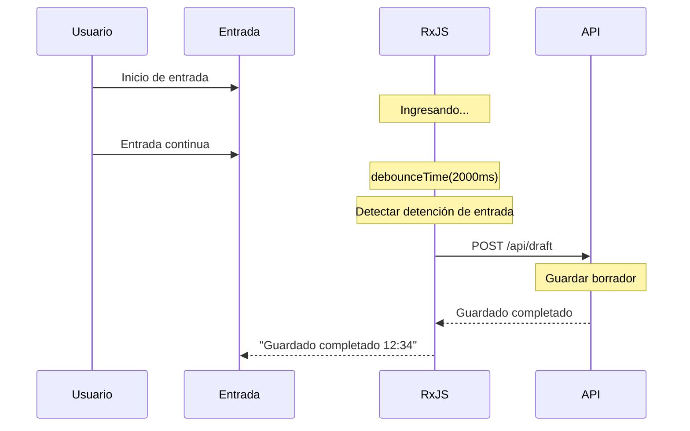

# Patrones de Procesamiento de Formularios

El procesamiento de formularios es una de las funcionalidades centrales en el desarrollo de aplicaciones web. Al usar RxJS, puedes implementar formularios reactivos y fáciles de usar de manera eficiente.

Este artículo explica patrones específicos de procesamiento de formularios necesarios en la práctica, como validación en tiempo real, autoguardado y vinculación de múltiples campos.

## Lo que aprenderás en este artículo

- Implementación de validación en tiempo real
- Función de autoguardado (debounceTime + distinctUntilChanged)
- Combinación de múltiples campos (combineLatest)
- Visualización de campos condicionales
- Procesamiento de envío y prevención de envío doble (exhaustMap)
- Visualización de errores y procesamiento de reinicio
- Gestión del estado del formulario

> [!TIP] Conocimientos previos
> Este artículo presupone conocimientos de [Chapter 3: Creation Functions](../creation-functions/index.md) y [Chapter 4: Operadores](../operators/index.md).

## Validación en Tiempo Real

### Problema: Quieres ejecutar validación cada vez que el usuario ingresa datos

Quieres ejecutar validación cada vez que el usuario ingresa datos y proporcionar retroalimentación inmediata.

### Solución: debounceTime + distinctUntilChanged

```typescript
import { fromEvent, map, debounceTime, distinctUntilChanged } from 'rxjs';
interface ValidationResult {
  valid: boolean;
  message: string;
}

const emailInput = document.createElement('input');
emailInput.id = 'email';
emailInput.type = 'email';
emailInput.placeholder = 'Ingresa tu dirección de correo';
emailInput.style.padding = '10px';
emailInput.style.margin = '10px';
emailInput.style.width = '300px';
emailInput.style.fontSize = '16px';
emailInput.style.border = '2px solid #ccc';
emailInput.style.borderRadius = '4px';
document.body.appendChild(emailInput);

const emailError = document.createElement('div');
emailError.id = 'email-error';
emailError.style.margin = '0 10px 10px 10px';
emailError.style.color = '#f44336';
emailError.style.fontSize = '14px';
emailError.style.minHeight = '20px';
document.body.appendChild(emailError);

fromEvent(emailInput, 'input').pipe(
  map(event => (event.target as HTMLInputElement).value.trim()),
  debounceTime(300),           // Espera 300ms después de que se detenga la entrada
  distinctUntilChanged()       // Ignora si el valor es el mismo que el anterior
).subscribe(email => {
  const result = validateEmail(email);

  if (result.valid) {
    emailInput.style.borderColor = '#4CAF50';
    emailError.textContent = '';
  } else {
    emailInput.style.borderColor = '#f44336';
    emailError.textContent = result.message;
  }
});

// Validación de dirección de correo electrónico
function validateEmail(email: string): ValidationResult {
  if (email.length === 0) {
    return { valid: false, message: 'Por favor ingresa tu dirección de correo electrónico' };
  }

  const emailRegex = /^[^\s@]+@[^\s@]+\.[^\s@]+$/;
  if (!emailRegex.test(email)) {
    return { valid: false, message: 'El formato de la dirección de correo electrónico es incorrecto' };
  }

  return { valid: true, message: '' };
}
```

> [!NOTE] Puntos clave de la validación en tiempo real
> - `debounceTime(300)` espera a que se detenga la entrada (previene procesamiento excesivo)
> - `distinctUntilChanged()` previene validación duplicada
> - Retroalimentación visual de los resultados de validación (clases CSS)

### Combinar múltiples reglas de verificación

```typescript
import { fromEvent, combineLatest, map, debounceTime, distinctUntilChanged, startWith } from 'rxjs';
interface PasswordValidation {
  minLength: boolean;
  hasUpperCase: boolean;
  hasLowerCase: boolean;
  hasNumber: boolean;
  hasSpecialChar: boolean;
}

const passwordInput = document.createElement('input');
passwordInput.id = 'password';
passwordInput.type = 'password';
passwordInput.placeholder = 'Contraseña';
passwordInput.style.padding = '10px';
passwordInput.style.margin = '10px';
passwordInput.style.width = '300px';
passwordInput.style.fontSize = '16px';
passwordInput.style.border = '2px solid #ccc';
passwordInput.style.borderRadius = '4px';
passwordInput.style.display = 'block';
document.body.appendChild(passwordInput);

const confirmPasswordInput = document.createElement('input');
confirmPasswordInput.id = 'confirm-password';
confirmPasswordInput.type = 'password';
confirmPasswordInput.placeholder = 'Confirmar contraseña';
confirmPasswordInput.style.padding = '10px';
confirmPasswordInput.style.margin = '10px';
confirmPasswordInput.style.width = '300px';
confirmPasswordInput.style.fontSize = '16px';
confirmPasswordInput.style.border = '2px solid #ccc';
confirmPasswordInput.style.borderRadius = '4px';
confirmPasswordInput.style.display = 'block';
document.body.appendChild(confirmPasswordInput);

const confirmError = document.createElement('div');
confirmError.id = 'confirm-error';
confirmError.style.margin = '0 10px 10px 10px';
confirmError.style.color = '#f44336';
confirmError.style.fontSize = '14px';
confirmError.style.minHeight = '20px';
document.body.appendChild(confirmError);

// Crear elementos de lista de verificación de validación
const validationContainer = document.createElement('div');
validationContainer.style.margin = '10px';
validationContainer.style.padding = '10px';
validationContainer.style.border = '1px solid #ddd';
validationContainer.style.borderRadius = '4px';
validationContainer.style.width = '300px';
document.body.appendChild(validationContainer);

const checkElements: Record<string, HTMLElement> = {};
const checks = [
  { id: 'check-length', label: '8 caracteres o más' },
  { id: 'check-uppercase', label: 'Contiene mayúsculas' },
  { id: 'check-lowercase', label: 'Contiene minúsculas' },
  { id: 'check-number', label: 'Contiene números' },
  { id: 'check-special', label: 'Contiene símbolos' }
];

checks.forEach(({ id, label }) => {
  const checkEl = document.createElement('div');
  checkEl.id = id;
  checkEl.textContent = `${label}`;
  checkEl.style.padding = '5px';
  checkEl.style.color = '#999';
  validationContainer.appendChild(checkEl);
  checkElements[id] = checkEl;
});

const password$ = fromEvent(passwordInput, 'input').pipe(
  map(event => (event.target as HTMLInputElement).value),
  debounceTime(300),
  distinctUntilChanged(),
  startWith('')
);

const confirmPassword$ = fromEvent(confirmPasswordInput, 'input').pipe(
  map(event => (event.target as HTMLInputElement).value),
  debounceTime(300),
  distinctUntilChanged(),
  startWith('')
);

// Validación de contraseña
password$.subscribe(password => {
  const validation = validatePassword(password);
  displayPasswordValidation(validation);
});

// Confirmación de coincidencia de contraseña
combineLatest([password$, confirmPassword$]).subscribe(
  ([password, confirmPassword]) => {
    if (confirmPassword.length === 0) {
      confirmError.textContent = '';
      confirmPasswordInput.style.borderColor = '#ccc';
      return;
    }

    if (password !== confirmPassword) {
      confirmError.textContent = 'Las contraseñas no coinciden';
      confirmPasswordInput.style.borderColor = '#f44336';
    } else {
      confirmError.textContent = '';
      confirmPasswordInput.style.borderColor = '#4CAF50';
    }
  }
);

function validatePassword(password: string): PasswordValidation {
  return {
    minLength: password.length >= 8,
    hasUpperCase: /[A-Z]/.test(password),
    hasLowerCase: /[a-z]/.test(password),
    hasNumber: /[0-9]/.test(password),
    hasSpecialChar: /[!@#$%^&*(),.?":{}|<>]/.test(password)
  };
}

function displayPasswordValidation(validation: PasswordValidation): void {
  const checkItems = [
    { id: 'check-length', valid: validation.minLength },
    { id: 'check-uppercase', valid: validation.hasUpperCase },
    { id: 'check-lowercase', valid: validation.hasLowerCase },
    { id: 'check-number', valid: validation.hasNumber },
    { id: 'check-special', valid: validation.hasSpecialChar }
  ];

  checkItems.forEach(({ id, valid }) => {
    const element = checkElements[id];
    if (element) {
      if (valid) {
        element.style.color = '#4CAF50';
        element.style.fontWeight = 'bold';
      } else {
        element.style.color = '#999';
        element.style.fontWeight = 'normal';
      }
    }
  });
}
```

> [!TIP] Uso de combineLatest
> Usar `combineLatest` te permite implementar fácilmente validaciones que combinan los valores de múltiples campos (confirmación de coincidencia de contraseña, etc.).

## Función de Autoguardado

### Problema: Quieres guardar automáticamente borradores

Quieres guardar automáticamente el contenido ingresado por el usuario periódicamente para prevenir la pérdida de datos.

### Solución: debounceTime + switchMap

```typescript
import { fromEvent, combineLatest, of, map, debounceTime, distinctUntilChanged, switchMap, catchError, tap, startWith } from 'rxjs';
interface DraftData {
  title: string;
  content: string;
  lastSaved?: Date;
}

const titleInput = document.createElement('input');
titleInput.id = 'title';
titleInput.type = 'text';
titleInput.placeholder = 'Ingresa el título';
titleInput.style.padding = '10px';
titleInput.style.margin = '10px';
titleInput.style.width = '500px';
titleInput.style.fontSize = '18px';
titleInput.style.border = '2px solid #ccc';
titleInput.style.borderRadius = '4px';
titleInput.style.display = 'block';
document.body.appendChild(titleInput);

const contentTextarea = document.createElement('textarea');
contentTextarea.id = 'content';
contentTextarea.placeholder = 'Ingresa el contenido';
contentTextarea.rows = 10;
contentTextarea.style.padding = '10px';
contentTextarea.style.margin = '10px';
contentTextarea.style.width = '500px';
contentTextarea.style.fontSize = '16px';
contentTextarea.style.border = '2px solid #ccc';
contentTextarea.style.borderRadius = '4px';
contentTextarea.style.display = 'block';
contentTextarea.style.resize = 'vertical';
document.body.appendChild(contentTextarea);

const saveStatus = document.createElement('div');
saveStatus.id = 'save-status';
saveStatus.style.margin = '10px';
saveStatus.style.fontSize = '14px';
saveStatus.style.color = '#666';
saveStatus.style.minHeight = '20px';
document.body.appendChild(saveStatus);

const title$ = fromEvent(titleInput, 'input').pipe(
  map(event => (event.target as HTMLInputElement).value),
  startWith('')
);

const content$ = fromEvent(contentTextarea, 'input').pipe(
  map(event => (event.target as HTMLTextAreaElement).value),
  startWith('')
);

// Monitorear cambios en el formulario
combineLatest([title$, content$]).pipe(
  map(([title, content]): DraftData => ({ title, content })),
  debounceTime(2000),          // Espera 2 segundos después de que se detenga la entrada
  distinctUntilChanged((prev, curr) =>
    prev.title === curr.title && prev.content === curr.content
  ),
  tap(() => {
    saveStatus.textContent = 'Guardando...';
    saveStatus.style.color = '#FF9800';
  }),
  switchMap(draft =>
    saveDraft(draft).pipe(
      map(savedDraft => ({ ...savedDraft, success: true })),
      catchError(err => {
        console.error('Error al guardar:', err);
        return of({ ...draft, success: false });
      })
    )
  )
).subscribe(result => {
  if (result.success) {
    saveStatus.textContent = `Guardado completado (${formatTime(result.lastSaved!)})`;
    saveStatus.style.color = '#4CAF50';
  } else {
    saveStatus.textContent = 'Error al guardar';
    saveStatus.style.color = '#f44336';
  }
});

// API de guardado de borrador (mock)
function saveDraft(draft: DraftData) {
  console.log('Guardando borrador:', draft);
  return of({
    ...draft,
    lastSaved: new Date()
  });
}

function formatTime(date: Date): string {
  const hours = date.getHours().toString().padStart(2, '0');
  const minutes = date.getMinutes().toString().padStart(2, '0');
  return `${hours}:${minutes}`;
}
```

#### Flujo de autoguardado



> [!IMPORTANT] Mejores prácticas de autoguardado
> - **debounceTime**: Establecer un tiempo de retraso apropiado (1-3 segundos)
> - **distinctUntilChanged**: No guardar si el contenido no ha cambiado
> - **switchMap**: Cancelar solicitudes antiguas
> - **Retroalimentación visual**: Mostrar el estado de guardado al usuario

## Vinculación de Múltiples Campos

### Problema: Quieres cambiar la visualización según el valor de otros campos

Por ejemplo: la lista de prefecturas cambia al seleccionar un país, la visualización de la entrada de dirección de entrega cambia según el método de entrega, etc.

### Solución: combineLatest y withLatestFrom

```typescript
import { fromEvent, of, map, startWith, switchMap } from 'rxjs';
interface Country {
  code: string;
  name: string;
}

interface Prefecture {
  code: string;
  name: string;
  countryCode: string;
}

const countrySelect = document.createElement('select');
countrySelect.id = 'country';
countrySelect.style.padding = '10px';
countrySelect.style.margin = '10px';
countrySelect.style.fontSize = '16px';
countrySelect.style.border = '2px solid #ccc';
countrySelect.style.borderRadius = '4px';
countrySelect.style.display = 'block';

// Agregar opciones de país
const countries: Country[] = [
  { code: '', name: 'Selecciona un país' },
  { code: 'JP', name: 'Japón' },
  { code: 'US', name: 'Estados Unidos' }
];
countries.forEach(country => {
  const option = document.createElement('option');
  option.value = country.code;
  option.textContent = country.name;
  countrySelect.appendChild(option);
});
document.body.appendChild(countrySelect);

const prefectureSelect = document.createElement('select');
prefectureSelect.id = 'prefecture';
prefectureSelect.style.padding = '10px';
prefectureSelect.style.margin = '10px';
prefectureSelect.style.fontSize = '16px';
prefectureSelect.style.border = '2px solid #ccc';
prefectureSelect.style.borderRadius = '4px';
prefectureSelect.style.display = 'block';

// Agregar opción vacía inicial
const emptyOption = document.createElement('option');
emptyOption.value = '';
emptyOption.textContent = 'Por favor selecciona';
prefectureSelect.appendChild(emptyOption);
document.body.appendChild(prefectureSelect);

const country$ = fromEvent(countrySelect, 'change').pipe(
  map(() => countrySelect.value),
  startWith(countrySelect.value)
);

// Actualizar lista de prefecturas cuando cambia el país
country$.pipe(
  switchMap(countryCode =>
    getPrefecturesByCountry(countryCode)
  )
).subscribe(prefectures => {
  updatePrefectureOptions(prefectureSelect, prefectures);
});

// Obtener lista de prefecturas por código de país (mock)
function getPrefecturesByCountry(countryCode: string) {
  const prefectures: Record<string, Prefecture[]> = {
    JP: [
      { code: '13', name: 'Tokio', countryCode: 'JP' },
      { code: '14', name: 'Kanagawa', countryCode: 'JP' },
      { code: '27', name: 'Osaka', countryCode: 'JP' }
    ],
    US: [
      { code: 'CA', name: 'California', countryCode: 'US' },
      { code: 'NY', name: 'Nueva York', countryCode: 'US' },
      { code: 'TX', name: 'Texas', countryCode: 'US' }
    ]
  };

  return of(prefectures[countryCode] || []);
}

function updatePrefectureOptions(
  select: HTMLSelectElement,
  prefectures: Prefecture[]
): void {
  select.innerHTML = '<option value="">Por favor selecciona</option>';

  prefectures.forEach(pref => {
    const option = document.createElement('option');
    option.value = pref.code;
    option.textContent = pref.name;
    select.appendChild(option);
  });
}
```

### Visualización de Campos Condicionales

```typescript
import { fromEvent, map, startWith } from 'rxjs';

const shippingMethodSelect = document.createElement('select');
shippingMethodSelect.id = 'shipping-method';
shippingMethodSelect.style.padding = '10px';
shippingMethodSelect.style.margin = '10px';
shippingMethodSelect.style.fontSize = '16px';
shippingMethodSelect.style.border = '2px solid #ccc';
shippingMethodSelect.style.borderRadius = '4px';
shippingMethodSelect.style.display = 'block';

const shippingOptions = [
  { value: '', label: 'Selecciona método de envío' },
  { value: 'home-delivery', label: 'Entrega a domicilio' },
  { value: 'store-pickup', label: 'Recogida en tienda' }
];
shippingOptions.forEach(option => {
  const optionEl = document.createElement('option');
  optionEl.value = option.value;
  optionEl.textContent = option.label;
  shippingMethodSelect.appendChild(optionEl);
});
document.body.appendChild(shippingMethodSelect);

const homeDeliverySection = document.createElement('div');
homeDeliverySection.id = 'home-delivery';
homeDeliverySection.style.padding = '15px';
homeDeliverySection.style.margin = '10px';
homeDeliverySection.style.border = '2px solid #4CAF50';
homeDeliverySection.style.borderRadius = '4px';
homeDeliverySection.style.backgroundColor = '#f1f8f4';
homeDeliverySection.style.display = 'none';
homeDeliverySection.innerHTML = '<h4 style="margin-top: 0;">Ingresa información de entrega a domicilio</h4><p>Ingresa dirección, número de teléfono, etc.</p>';
document.body.appendChild(homeDeliverySection);

const storePickupSection = document.createElement('div');
storePickupSection.id = 'store-pickup';
storePickupSection.style.padding = '15px';
storePickupSection.style.margin = '10px';
storePickupSection.style.border = '2px solid #2196F3';
storePickupSection.style.borderRadius = '4px';
storePickupSection.style.backgroundColor = '#e3f2fd';
storePickupSection.style.display = 'none';
storePickupSection.innerHTML = '<h4 style="margin-top: 0;">Ingresa información de recogida en tienda</h4><p>Selecciona la tienda de recogida</p>';
document.body.appendChild(storePickupSection);

fromEvent(shippingMethodSelect, 'change').pipe(
  map(() => shippingMethodSelect.value),
  startWith(shippingMethodSelect.value)
).subscribe(method => {
  if (method === 'home-delivery') {
    homeDeliverySection.style.display = 'block';
    storePickupSection.style.display = 'none';
  } else if (method === 'store-pickup') {
    homeDeliverySection.style.display = 'none';
    storePickupSection.style.display = 'block';
  } else {
    homeDeliverySection.style.display = 'none';
    storePickupSection.style.display = 'none';
  }
});
```

### Cálculo de Tarifa de Envío con Múltiples Condiciones

```typescript
import { combineLatest, fromEvent, map, startWith } from 'rxjs';
interface ShippingCalc {
  country: string;
  weight: number;
  shippingMethod: string;
}

const countrySelect = document.createElement('select');
countrySelect.id = 'country';
countrySelect.style.padding = '10px';
countrySelect.style.margin = '10px';
countrySelect.style.fontSize = '16px';
countrySelect.style.border = '2px solid #ccc';
countrySelect.style.borderRadius = '4px';
countrySelect.style.display = 'block';

const countryOptions = [
  { value: 'JP', label: 'Japón' },
  { value: 'US', label: 'Estados Unidos' },
  { value: 'OTHER', label: 'Otro' }
];
countryOptions.forEach(option => {
  const optionEl = document.createElement('option');
  optionEl.value = option.value;
  optionEl.textContent = option.label;
  countrySelect.appendChild(optionEl);
});
document.body.appendChild(countrySelect);

const weightInput = document.createElement('input');
weightInput.id = 'weight';
weightInput.type = 'number';
weightInput.placeholder = 'Peso (kg)';
weightInput.min = '0';
weightInput.step = '0.1';
weightInput.value = '1';
weightInput.style.padding = '10px';
weightInput.style.margin = '10px';
weightInput.style.width = '200px';
weightInput.style.fontSize = '16px';
weightInput.style.border = '2px solid #ccc';
weightInput.style.borderRadius = '4px';
weightInput.style.display = 'block';
document.body.appendChild(weightInput);

const shippingMethodSelect = document.createElement('select');
shippingMethodSelect.id = 'shipping-method';
shippingMethodSelect.style.padding = '10px';
shippingMethodSelect.style.margin = '10px';
shippingMethodSelect.style.fontSize = '16px';
shippingMethodSelect.style.border = '2px solid #ccc';
shippingMethodSelect.style.borderRadius = '4px';
shippingMethodSelect.style.display = 'block';

const methodOptions = [
  { value: 'standard', label: 'Envío estándar' },
  { value: 'express', label: 'Envío express' }
];
methodOptions.forEach(option => {
  const optionEl = document.createElement('option');
  optionEl.value = option.value;
  optionEl.textContent = option.label;
  shippingMethodSelect.appendChild(optionEl);
});
document.body.appendChild(shippingMethodSelect);

const shippingCostDisplay = document.createElement('div');
shippingCostDisplay.id = 'shipping-cost';
shippingCostDisplay.style.padding = '15px';
shippingCostDisplay.style.margin = '10px';
shippingCostDisplay.style.fontSize = '20px';
shippingCostDisplay.style.fontWeight = 'bold';
shippingCostDisplay.style.color = '#2196F3';
shippingCostDisplay.style.border = '2px solid #2196F3';
shippingCostDisplay.style.borderRadius = '4px';
shippingCostDisplay.style.backgroundColor = '#e3f2fd';
shippingCostDisplay.textContent = 'Tarifa de envío: ¥0';
document.body.appendChild(shippingCostDisplay);

const country$ = fromEvent(countrySelect, 'change').pipe(
  map(() => countrySelect.value),
  startWith(countrySelect.value)
);

const weight$ = fromEvent(weightInput, 'input').pipe(
  map(() => parseFloat(weightInput.value) || 0),
  startWith(parseFloat(weightInput.value) || 1)
);

const shippingMethod$ = fromEvent(shippingMethodSelect, 'change').pipe(
  map(() => shippingMethodSelect.value),
  startWith(shippingMethodSelect.value)
);

combineLatest([country$, weight$, shippingMethod$]).pipe(
  map(([country, weight, shippingMethod]): ShippingCalc => ({
    country,
    weight,
    shippingMethod
  })),
  map(calc => calculateShippingCost(calc))
).subscribe(cost => {
  shippingCostDisplay.textContent = `Tarifa de envío: ¥${cost.toLocaleString()}`;
});

function calculateShippingCost(calc: ShippingCalc): number {
  let baseCost = 0;

  // Tarifa base por país
  if (calc.country === 'JP') {
    baseCost = 500;
  } else if (calc.country === 'US') {
    baseCost = 2000;
  } else {
    baseCost = 3000;
  }

  // Cargo adicional por peso (se agrega ¥100/kg por cada kg adicional después de 1kg)
  if (calc.weight > 1) {
    baseCost += Math.ceil(calc.weight - 1) * 100;
  }

  // Multiplicador por método de envío
  if (calc.shippingMethod === 'express') {
    baseCost *= 2;
  }

  return baseCost;
}
```

> [!TIP] Cuándo usar combineLatest
> Es óptimo cuando necesitas combinar los valores de múltiples campos para calcular o mostrar.
> - Cálculo de tarifa de envío (país + peso + método de envío)
> - Cálculo de descuentos (producto + cupón + rango de membresía)
> - Filtros de búsqueda (categoría + rango de precios + calificación)

## Procesamiento de Envío y Prevención de Envío Doble

### Problema: Quieres prevenir el envío duplicado por clics repetidos en el botón

Si el botón de envío del formulario se hace clic repetidamente, los mismos datos se envían múltiples veces.

### Solución: Prevenir envío doble con exhaustMap

```typescript
import { fromEvent, of, exhaustMap, tap, catchError, finalize } from 'rxjs';
interface FormData {
  name: string;
  email: string;
  message: string;
}

const form = document.createElement('form');
form.id = 'contact-form';
form.style.padding = '20px';
form.style.margin = '10px';
form.style.border = '2px solid #ccc';
form.style.borderRadius = '8px';
form.style.maxWidth = '500px';
form.style.backgroundColor = '#f9f9f9';

const nameInput = document.createElement('input');
nameInput.type = 'text';
nameInput.name = 'name';
nameInput.placeholder = 'Nombre';
nameInput.required = true;
nameInput.style.padding = '10px';
nameInput.style.margin = '10px 0';
nameInput.style.width = '100%';
nameInput.style.fontSize = '16px';
nameInput.style.border = '1px solid #ccc';
nameInput.style.borderRadius = '4px';
nameInput.style.boxSizing = 'border-box';
form.appendChild(nameInput);

const emailInput = document.createElement('input');
emailInput.type = 'email';
emailInput.name = 'email';
emailInput.placeholder = 'Dirección de correo electrónico';
emailInput.required = true;
emailInput.style.padding = '10px';
emailInput.style.margin = '10px 0';
emailInput.style.width = '100%';
emailInput.style.fontSize = '16px';
emailInput.style.border = '1px solid #ccc';
emailInput.style.borderRadius = '4px';
emailInput.style.boxSizing = 'border-box';
form.appendChild(emailInput);

const messageTextarea = document.createElement('textarea');
messageTextarea.name = 'message';
messageTextarea.placeholder = 'Mensaje';
messageTextarea.required = true;
messageTextarea.rows = 5;
messageTextarea.style.padding = '10px';
messageTextarea.style.margin = '10px 0';
messageTextarea.style.width = '100%';
messageTextarea.style.fontSize = '16px';
messageTextarea.style.border = '1px solid #ccc';
messageTextarea.style.borderRadius = '4px';
messageTextarea.style.resize = 'vertical';
messageTextarea.style.boxSizing = 'border-box';
form.appendChild(messageTextarea);

const submitButton = document.createElement('button');
submitButton.id = 'submit-button';
submitButton.type = 'submit';
submitButton.textContent = 'Enviar';
submitButton.style.padding = '12px 30px';
submitButton.style.margin = '10px 0';
submitButton.style.fontSize = '16px';
submitButton.style.fontWeight = 'bold';
submitButton.style.color = '#fff';
submitButton.style.backgroundColor = '#2196F3';
submitButton.style.border = 'none';
submitButton.style.borderRadius = '4px';
submitButton.style.cursor = 'pointer';
form.appendChild(submitButton);

document.body.appendChild(form);

const statusMessage = document.createElement('div');
statusMessage.id = 'status-message';
statusMessage.style.padding = '10px';
statusMessage.style.margin = '10px';
statusMessage.style.fontSize = '16px';
statusMessage.style.borderRadius = '4px';
statusMessage.style.minHeight = '20px';
document.body.appendChild(statusMessage);

fromEvent(form, 'submit').pipe(
  tap(event => {
    event.preventDefault();
    submitButton.disabled = true;
    submitButton.textContent = 'Enviando...';
    submitButton.style.backgroundColor = '#999';
    statusMessage.textContent = '';
  }),
  exhaustMap(() => {
    // Recopilar datos del formulario
    const formData = new FormData(form);
    const data: FormData = {
      name: formData.get('name') as string,
      email: formData.get('email') as string,
      message: formData.get('message') as string
    };

    return submitForm(data).pipe(
      catchError(err => {
        console.error('Error de envío:', err);
        return of({ success: false, error: err.message });
      })
    );
  }),
  finalize(() => {
    submitButton.disabled = false;
    submitButton.textContent = 'Enviar';
    submitButton.style.backgroundColor = '#2196F3';
  })
).subscribe(result => {
  if (result.success) {
    statusMessage.textContent = '¡Envío exitoso!';
    statusMessage.style.backgroundColor = '#d4edda';
    statusMessage.style.color = '#155724';
    statusMessage.style.border = '1px solid #c3e6cb';
    form.reset();
  } else {
    const errorText = 'error' in result ? result.error : 'Error desconocido';
    statusMessage.textContent = `Error de envío: ${errorText}`;
    statusMessage.style.backgroundColor = '#f8d7da';
    statusMessage.style.color = '#721c24';
    statusMessage.style.border = '1px solid #f5c6cb';
  }
});

// API de envío de formulario (mock)
function submitForm(data: FormData) {
  console.log('Enviando formulario:', data);
  return of({ success: true });
}
```

**Funcionamiento de exhaustMap:**

```
Clics del usuario: ●    ●●●        ●
                    |    |          |
exhaustMap:         ●              ●
                    |              |
                 Envío API      Envío API
                  (después)     (después)

※ Los clics durante el envío se ignoran
```

> [!IMPORTANT] Importancia de exhaustMap
> **exhaustMap** ignora nuevos valores hasta que el Observable anterior se complete.
> Esto permite:
> - Prevenir envíos duplicados por clics repetidos en el botón
> - Bloquear solicitudes adicionales durante llamadas API
> - Prevenir operaciones erróneas del usuario

### Validación Antes del Envío

```typescript
import { fromEvent, combineLatest, map, startWith, exhaustMap, withLatestFrom, filter, tap, of } from 'rxjs';
interface FormData {
  name: string;
  email: string;
  message: string;
}

const form = document.createElement('form');
form.id = 'contact-form';
form.style.padding = '20px';
form.style.margin = '10px';
form.style.border = '2px solid #ccc';
form.style.borderRadius = '8px';
form.style.maxWidth = '500px';
form.style.backgroundColor = '#f9f9f9';

const nameInput = document.createElement('input');
nameInput.id = 'name';
nameInput.type = 'text';
nameInput.placeholder = 'Nombre';
nameInput.style.padding = '10px';
nameInput.style.margin = '10px 0';
nameInput.style.width = '100%';
nameInput.style.fontSize = '16px';
nameInput.style.border = '1px solid #ccc';
nameInput.style.borderRadius = '4px';
nameInput.style.boxSizing = 'border-box';
form.appendChild(nameInput);

const emailInput = document.createElement('input');
emailInput.id = 'email';
emailInput.type = 'email';
emailInput.placeholder = 'Dirección de correo electrónico';
emailInput.style.padding = '10px';
emailInput.style.margin = '10px 0';
emailInput.style.width = '100%';
emailInput.style.fontSize = '16px';
emailInput.style.border = '1px solid #ccc';
emailInput.style.borderRadius = '4px';
emailInput.style.boxSizing = 'border-box';
form.appendChild(emailInput);

const messageTextarea = document.createElement('textarea');
messageTextarea.id = 'message';
messageTextarea.placeholder = 'Mensaje (10 caracteres o más)';
messageTextarea.rows = 5;
messageTextarea.style.padding = '10px';
messageTextarea.style.margin = '10px 0';
messageTextarea.style.width = '100%';
messageTextarea.style.fontSize = '16px';
messageTextarea.style.border = '1px solid #ccc';
messageTextarea.style.borderRadius = '4px';
messageTextarea.style.resize = 'vertical';
messageTextarea.style.boxSizing = 'border-box';
form.appendChild(messageTextarea);

const submitButton = document.createElement('button');
submitButton.id = 'submit-button';
submitButton.type = 'submit';
submitButton.textContent = 'Enviar';
submitButton.disabled = true;
submitButton.style.padding = '12px 30px';
submitButton.style.margin = '10px 0';
submitButton.style.fontSize = '16px';
submitButton.style.fontWeight = 'bold';
submitButton.style.color = '#fff';
submitButton.style.backgroundColor = '#999';
submitButton.style.border = 'none';
submitButton.style.borderRadius = '4px';
submitButton.style.cursor = 'not-allowed';
form.appendChild(submitButton);

document.body.appendChild(form);

// Estado de validación de cada campo
const nameValid$ = fromEvent(nameInput, 'input').pipe(
  map(() => nameInput.value.trim().length > 0),
  startWith(false)
);

const emailValid$ = fromEvent(emailInput, 'input').pipe(
  map(() => /^[^\s@]+@[^\s@]+\.[^\s@]+$/.test(emailInput.value)),
  startWith(false)
);

const messageValid$ = fromEvent(messageTextarea, 'input').pipe(
  map(() => messageTextarea.value.trim().length >= 10),
  startWith(false)
);

// Verificar si todos los campos son válidos
const formValid$ = combineLatest([nameValid$, emailValid$, messageValid$]).pipe(
  map(([name, email, message]) => name && email && message)
);

// Alternar activación/desactivación del botón de envío
formValid$.subscribe(valid => {
  submitButton.disabled = !valid;
  if (valid) {
    submitButton.style.backgroundColor = '#2196F3';
    submitButton.style.cursor = 'pointer';
  } else {
    submitButton.style.backgroundColor = '#999';
    submitButton.style.cursor = 'not-allowed';
  }
});

// Procesamiento de envío de formulario
fromEvent(form, 'submit').pipe(
  tap(event => event.preventDefault()),
  withLatestFrom(formValid$),
  filter(([_, valid]) => valid), // Solo si pasa la validación
  exhaustMap(() => {
    const data = {
      name: nameInput.value,
      email: emailInput.value,
      message: messageTextarea.value
    };

    return submitForm(data);
  })
).subscribe(result => {
  console.log('Envío completado:', result);
  form.reset();
});

// API de envío de formulario (mock)
function submitForm(data: FormData) {
  console.log('Enviando formulario:', data);
  return of({ success: true });
}
```

> [!TIP] Uso de withLatestFrom
> Usar `withLatestFrom` te permite verificar el estado de validación más reciente al momento del envío.

## Visualización de Errores y Procesamiento de Reinicio

### Gestión Centralizada de Errores del Formulario

```typescript
import { BehaviorSubject} from 'rxjs';

class FormErrorManager {
  private errors$ = new BehaviorSubject<Map<string, string>>(new Map());
  private elementCache = new Map<string, { error: HTMLElement; input: HTMLElement }>();

  setError(field: string, message: string): void {
    const currentErrors = this.errors$.value;
    currentErrors.set(field, message);
    this.errors$.next(new Map(currentErrors));
    this.displayError(field, message);
  }

  clearError(field: string): void {
    const currentErrors = this.errors$.value;
    currentErrors.delete(field);
    this.errors$.next(new Map(currentErrors));
    this.hideError(field);
  }

  clearAllErrors(): void {
    this.errors$.next(new Map());
    this.hideAllErrors();
  }

  hasErrors(): boolean {
    return this.errors$.value.size > 0;
  }

  getErrors() {
    return this.errors$.asObservable();
  }

  // Registrar elementos para un campo (debe llamarse antes de usar setError/clearError)
  registerField(field: string, inputElement: HTMLElement, errorElement: HTMLElement): void {
    this.elementCache.set(field, { input: inputElement, error: errorElement });
  }

  private displayError(field: string, message: string): void {
    const elements = this.elementCache.get(field);
    if (!elements) {
      console.warn(`Campo "${field}" no registrado. Llama a registerField() primero.`);
      return;
    }

    elements.error.textContent = message;
    elements.error.style.display = 'block';
    elements.input.style.borderColor = '#f44336';
    elements.input.style.backgroundColor = '#ffebee';
  }

  private hideError(field: string): void {
    const elements = this.elementCache.get(field);
    if (!elements) {
      return;
    }

    elements.error.textContent = '';
    elements.error.style.display = 'none';
    elements.input.style.borderColor = '#ccc';
    elements.input.style.backgroundColor = '#fff';
  }

  private hideAllErrors(): void {
    this.elementCache.forEach((elements) => {
      elements.error.style.display = 'none';
      elements.error.textContent = '';
      elements.input.style.borderColor = '#ccc';
      elements.input.style.backgroundColor = '#fff';
    });
  }
}

// Ejemplo de uso (autocontenido: crea elementos de formulario dinámicamente)
const errorManager = new FormErrorManager();

// Crear elementos de entrada de correo electrónico y error
const emailInput = document.createElement('input');
emailInput.id = 'email';
emailInput.type = 'email';
emailInput.placeholder = 'Dirección de correo electrónico';
emailInput.style.padding = '10px';
emailInput.style.margin = '10px';
emailInput.style.width = '300px';
emailInput.style.fontSize = '16px';
emailInput.style.border = '2px solid #ccc';
emailInput.style.borderRadius = '4px';
emailInput.style.display = 'block';
document.body.appendChild(emailInput);

const emailError = document.createElement('div');
emailError.id = 'email-error';
emailError.style.margin = '0 10px 10px 10px';
emailError.style.color = '#f44336';
emailError.style.fontSize = '14px';
emailError.style.display = 'none';
document.body.appendChild(emailError);

// Crear elementos de entrada de contraseña y error
const passwordInput = document.createElement('input');
passwordInput.id = 'password';
passwordInput.type = 'password';
passwordInput.placeholder = 'Contraseña';
passwordInput.style.padding = '10px';
passwordInput.style.margin = '10px';
passwordInput.style.width = '300px';
passwordInput.style.fontSize = '16px';
passwordInput.style.border = '2px solid #ccc';
passwordInput.style.borderRadius = '4px';
passwordInput.style.display = 'block';
document.body.appendChild(passwordInput);

const passwordError = document.createElement('div');
passwordError.id = 'password-error';
passwordError.style.margin = '0 10px 10px 10px';
passwordError.style.color = '#f44336';
passwordError.style.fontSize = '14px';
passwordError.style.display = 'none';
document.body.appendChild(passwordError);

// Registrar campos con el gestor de errores
errorManager.registerField('email', emailInput, emailError);
errorManager.registerField('password', passwordInput, passwordError);

// Establecer errores
errorManager.setError('email', 'El formato de la dirección de correo electrónico es incorrecto');
errorManager.setError('password', 'La contraseña debe tener 8 caracteres o más');

// Limpiar error
setTimeout(() => {
  errorManager.clearError('email');
}, 2000);

// Limpiar todos los errores
setTimeout(() => {
  errorManager.clearAllErrors();
}, 4000);

// Monitorear errores
errorManager.getErrors().subscribe(errors => {
  console.log('Número de errores actual:', errors.size);
});
```

## Gestión del Estado del Formulario

### Clase Completa de Gestión del Estado del Formulario

```typescript
import { BehaviorSubject, Observable } from 'rxjs';
interface FormState<T> {
  value: T;
  valid: boolean;
  dirty: boolean;
  touched: boolean;
  submitting: boolean;
}

class ReactiveForm<T extends Record<string, any>> {
  private state$: BehaviorSubject<FormState<T>>;
  private validators: Map<keyof T, ((value: any) => boolean)[]> = new Map();

  constructor(initialValue: T) {
    this.state$ = new BehaviorSubject<FormState<T>>({
      value: initialValue,
      valid: false,
      dirty: false,
      touched: false,
      submitting: false
    });
  }

  // Actualizar valor del campo
  setValue(field: keyof T, value: any): void {
    const currentState = this.state$.value;
    const newValue = { ...currentState.value, [field]: value };

    this.state$.next({
      ...currentState,
      value: newValue,
      valid: this.validateForm(newValue),
      dirty: true
    });
  }

  // Agregar validador
  addValidator(field: keyof T, validator: (value: any) => boolean): void {
    const validators = this.validators.get(field) || [];
    validators.push(validator);
    this.validators.set(field, validators);
  }

  // Validación de todo el formulario
  private validateForm(value: T): boolean {
    for (const [field, validators] of this.validators.entries()) {
      const fieldValue = value[field];
      const isValid = validators.every(validator => validator(fieldValue));
      if (!isValid) return false;
    }
    return true;
  }

  // Establecer bandera touched
  setTouched(field: keyof T): void {
    const currentState = this.state$.value;
    this.state$.next({
      ...currentState,
      touched: true
    });
  }

  // Establecer estado de envío
  setSubmitting(submitting: boolean): void {
    const currentState = this.state$.value;
    this.state$.next({
      ...currentState,
      submitting
    });
  }

  // Reiniciar formulario
  reset(initialValue?: T): void {
    const resetValue = initialValue || this.state$.value.value;
    this.state$.next({
      value: resetValue,
      valid: false,
      dirty: false,
      touched: false,
      submitting: false
    });
  }

  // Obtener estado
  getState(): Observable<FormState<T>> {
    return this.state$.asObservable();
  }

  getValue(): T {
    return this.state$.value.value;
  }

  isValid(): boolean {
    return this.state$.value.valid;
  }

  isDirty(): boolean {
    return this.state$.value.dirty;
  }
}

// Ejemplo de uso
interface UserForm {
  name: string;
  email: string;
  age: number;
}

const userForm = new ReactiveForm<UserForm>({
  name: '',
  email: '',
  age: 0
});

// Agregar validadores
userForm.addValidator('name', value => value.length > 0);
userForm.addValidator('email', value => /^[^\s@]+@[^\s@]+\.[^\s@]+$/.test(value));
userForm.addValidator('age', value => value >= 18);

// Actualizar valores
userForm.setValue('name', 'Taro Yamada');
userForm.setValue('email', 'yamada@example.com');
userForm.setValue('age', 25);

// Monitorear estado
userForm.getState().subscribe(state => {
  console.log('Estado del formulario:', state);
  console.log('Válido:', state.valid);
  console.log('Con cambios:', state.dirty);
});

// Envío de formulario
if (userForm.isValid()) {
  userForm.setSubmitting(true);
  const formData = userForm.getValue();
  console.log('Datos de envío:', formData);

  // Después de llamar a la API
  userForm.setSubmitting(false);
  userForm.reset();
}
```

> [!TIP] Ventajas de una clase de formulario personalizada
> - **Gestión centralizada del estado**: Gestionar todo el estado del formulario en un solo lugar
> - **Validación integrada**: Establecer reglas de verificación flexibles para cada campo
> - **Actualización reactiva**: Notificar automáticamente los cambios de estado
> - **Reutilizabilidad**: Reutilizar la misma lógica en múltiples formularios

## Código de Prueba

Ejemplo de prueba para procesamiento de formularios.

```typescript
import { debounceTime, map } from 'rxjs';
import { TestScheduler } from 'rxjs/testing';

describe('Procesamiento de formularios', () => {
  let testScheduler: TestScheduler;

  beforeEach(() => {
    testScheduler = new TestScheduler((actual, expected) => {
      expect(actual).toEqual(expected);
    });
  });

  it('should validate email with debounce', () => {
    testScheduler.run(({ cold, expectObservable }) => {
      const input$ = cold('a-b-c----|', {
        a: 'test',
        b: 'test@',
        c: 'test@example.com'
      });

      const result$ = input$.pipe(
        debounceTime(300, testScheduler),
        map(email => /^[^\s@]+@[^\s@]+\.[^\s@]+$/.test(email))
      );

      expectObservable(result$).toBe('-----c----|', { c: true });
    });
  });

  it('should prevent double submit with exhaustMap', () => {
    testScheduler.run(({ cold, hot, expectObservable }) => {
      const submit$ = hot('a--b-c----d|');

      const result$ = submit$.pipe(
        exhaustMap(() => cold('---x|', { x: 'submitted' }))
      );

      // Solo se procesan el primer y último envío
      expectObservable(result$).toBe('---x-----x|', { x: 'submitted' });
    });
  });
});
```

## Resumen

Dominar los patrones de procesamiento de formularios te permite implementar formularios amigables para el usuario y robustos.

> [!IMPORTANT] Puntos importantes
> - **Validación en tiempo real**: debounceTime + distinctUntilChanged
> - **Autoguardado**: debounceTime + switchMap para prevenir guardado excesivo
> - **Vinculación de múltiples campos**: combineLatest para combinar valores
> - **Prevención de envío doble**: exhaustMap para bloquear solicitudes adicionales durante el envío
> - **Gestión del estado**: BehaviorSubject para gestión centralizada del estado del formulario

> [!TIP] Mejores prácticas
> - **Retroalimentación inmediata**: Mejorar UX con validación en tiempo real
> - **Retraso apropiado**: Configuración de debounceTime (300ms-2000ms)
> - **Retroalimentación visual**: Mostrar claramente errores y estado de guardado
> - **Accesibilidad**: Atributos aria apropiados, ubicación adecuada de mensajes de error
> - **Pruebas**: Probar siempre la lógica de validación

## Próximos Pasos

Una vez que domines los patrones de procesamiento de formularios, avanza a los siguientes patrones.

- [Llamadas API](./api-calls.md) - Envío de formularios e integración con API
- [Procesamiento de eventos UI](./ui-events.md) - Eventos UI dentro de formularios
- [Procesamiento de datos en tiempo real](./real-time-data.md) - Validación en tiempo real, validación del lado del servidor
- [Estrategias de caché](./caching-strategies.md) - Caché de datos del formulario

## Secciones Relacionadas

- [Chapter 3: Creation Functions](../creation-functions/index.md) - Detalles de combineLatest, withLatestFrom
- [Chapter 4: Operadores](../operators/index.md) - Detalles de debounceTime, exhaustMap
- [Chapter 5: Subject](../subjects/what-is-subject.md) - Uso de BehaviorSubject

## Recursos de Referencia

- [RxJS oficial: combineLatest](https://rxjs.dev/api/index/function/combineLatest) - Detalles de combineLatest
- [RxJS oficial: exhaustMap](https://rxjs.dev/api/operators/exhaustMap) - Detalles de exhaustMap
- [Learn RxJS: Form Handling](https://www.learnrxjs.io/) - Ejemplos prácticos de procesamiento de formularios
