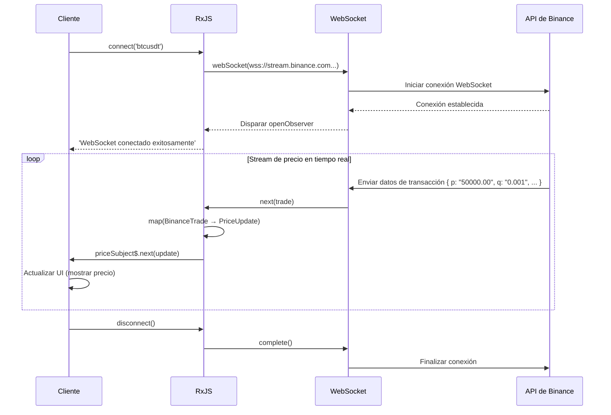

# Patrones de Procesamiento de Datos en Tiempo Real

El procesamiento de datos en tiempo real es una función crítica en aplicaciones web modernas como chat, notificaciones, actualizaciones de precios de acciones y monitoreo de sensores IoT. Al usar RxJS, puede implementar comunicaciones en tiempo real complejas de manera declarativa y robusta.

En este artículo, explicamos patrones concretos de procesamiento de datos en tiempo real necesarios en la práctica, incluyendo WebSocket, Server-Sent Events (SSE) y Polling.

## Lo que aprenderás en este artículo

- Implementación y gestión de comunicación WebSocket
- Uso de Server-Sent Events (SSE)
- Actualización en tiempo real mediante Polling
- Gestión de conexiones y reconexión automática
- Fusión y actualización de datos
- Construcción de sistemas de notificación en tiempo real
- Manejo de errores y gestión del estado de conexión

> [!TIP] Conocimientos previos
> Este artículo presupone conocimientos de [Chapter 5: Subject](../subjects/what-is-subject.md) y [Chapter 4: Operadores](../operators/index.md). Es especialmente importante comprender `Subject`, `shareReplay`, `retry` y `retryWhen`.

## Comunicación WebSocket

### Problema: Implementar comunicación bidireccional en tiempo real

Se necesita comunicación bidireccional en tiempo real entre servidor y cliente para criptomonedas, actualizaciones de precios de acciones, aplicaciones de chat, etc. En este ejemplo, usamos una API WebSocket pública real para monitorear precios de criptomonedas en tiempo real.

### Solución: Usar webSocket de RxJS

Usamos la **API WebSocket pública de Binance** para obtener datos de transacciones de Bitcoin en tiempo real. Este código es ejecutable tal como está y transmite datos de precios reales.

```typescript
import { EMPTY, Subject, retry, catchError, tap, map } from 'rxjs';
import { webSocket, WebSocketSubject } from 'rxjs/webSocket';

// Tipo de datos de transacción de la API WebSocket de Binance
// https://binance-docs.github.io/apidocs/spot/en/#trade-streams
interface BinanceTrade {
  e: string;      // Tipo de evento "trade"
  E: number;      // Hora del evento
  s: string;      // Símbolo "BTCUSDT"
  t: number;      // ID de transacción
  p: string;      // Precio
  q: string;      // Cantidad
  T: number;      // Hora de transacción
  m: boolean;     // Si el comprador es market maker
}

// Tipo conciso para visualización
interface PriceUpdate {
  symbol: string;
  price: number;
  quantity: number;
  time: Date;
  isBuyerMaker: boolean;
}

class CryptoPriceService {
  private socket$: WebSocketSubject<BinanceTrade> | null = null;
  private priceSubject$ = new Subject<PriceUpdate>();

  public prices$ = this.priceSubject$.asObservable();

  /**
   * Conectar a la API WebSocket pública de Binance
   * @param symbol Par de criptomonedas (ej: "btcusdt", "ethusdt")
   */
  connect(symbol: string = 'btcusdt'): void {
    if (!this.socket$ || this.socket$.closed) {
      // API WebSocket pública de Binance (sin autenticación)
      const url = `wss://stream.binance.com:9443/ws/${symbol}@trade`;

      this.socket$ = webSocket<BinanceTrade>({
        url,
        openObserver: {
          next: () => {
            console.log(`WebSocket conectado exitosamente: ${symbol.toUpperCase()}`);
          }
        },
        closeObserver: {
          next: () => {
            console.log('Conexión WebSocket finalizada');
          }
        }
      });

      this.socket$.pipe(
        // Convertir datos de Binance para visualización
        map(trade => ({
          symbol: trade.s,
          price: parseFloat(trade.p),
          quantity: parseFloat(trade.q),
          time: new Date(trade.T),
          isBuyerMaker: trade.m
        })),
        tap(update => console.log('Actualización de precio:', update.price)),
        retry({
          count: 5,
          delay: 1000
        }),
        catchError(err => {
          console.error('Error de WebSocket:', err);
          return EMPTY;
        })
      ).subscribe(priceUpdate => {
        this.priceSubject$.next(priceUpdate);
      });
    }
  }

  disconnect(): void {
    if (this.socket$) {
      this.socket$.complete();
      this.socket$ = null;
    }
  }
}

// Crear elementos UI dinámicamente
const priceContainer = document.createElement('div');
priceContainer.id = 'price-display';
priceContainer.style.padding = '20px';
priceContainer.style.margin = '10px';
priceContainer.style.border = '2px solid #f0b90b'; // Color de Binance
priceContainer.style.borderRadius = '8px';
priceContainer.style.backgroundColor = '#1e2329';
priceContainer.style.color = '#eaecef';
priceContainer.style.fontFamily = 'monospace';
document.body.appendChild(priceContainer);

const latestPriceDisplay = document.createElement('div');
latestPriceDisplay.style.fontSize = '32px';
latestPriceDisplay.style.fontWeight = 'bold';
latestPriceDisplay.style.marginBottom = '10px';
priceContainer.appendChild(latestPriceDisplay);

const tradesContainer = document.createElement('div');
tradesContainer.style.maxHeight = '400px';
tradesContainer.style.overflowY = 'auto';
tradesContainer.style.fontSize = '14px';
priceContainer.appendChild(tradesContainer);

// Ejemplo de uso
const priceService = new CryptoPriceService();
priceService.connect('btcusdt'); // Datos de transacción de Bitcoin/USDT

// Recibir actualizaciones de precio
priceService.prices$.subscribe(update => {
  // Mostrar el último precio en grande
  latestPriceDisplay.textContent = `${update.symbol}: $${update.price.toLocaleString('en-US', { minimumFractionDigits: 2 })}`;
  latestPriceDisplay.style.color = update.isBuyerMaker ? '#f6465d' : '#0ecb81'; // Color por venta/compra

  // Mostrar historial de transacciones
  displayTrade(update, tradesContainer);
});

function displayTrade(update: PriceUpdate, container: HTMLElement): void {
  const tradeElement = document.createElement('div');
  tradeElement.style.padding = '5px';
  tradeElement.style.margin = '3px 0';
  tradeElement.style.borderBottom = '1px solid #2b3139';
  tradeElement.style.color = update.isBuyerMaker ? '#f6465d' : '#0ecb81';

  const timeStr = update.time.toLocaleTimeString('es-ES');
  const side = update.isBuyerMaker ? 'Venta' : 'Compra';
  tradeElement.textContent = `[${timeStr}] ${side} $${update.price.toFixed(2)} × ${update.quantity.toFixed(4)}`;

  container.insertBefore(tradeElement, container.firstChild);

  // Mantener hasta 50 registros
  while (container.children.length > 50) {
    container.removeChild(container.lastChild!);
  }
}

// Ejemplo de limpieza
// priceService.disconnect();
```

> [!TIP] API WebSocket pública que puedes probar
> **Este código funciona tal como está al copiar y pegar**. La API WebSocket pública de Binance no requiere autenticación y proporciona datos de transacciones de criptomonedas en tiempo real.
>
> **También puedes probar otros pares de criptomonedas**:
> - `priceService.connect('ethusdt')` - Ethereum/USDT
> - `priceService.connect('bnbusdt')` - BNB/USDT
> - `priceService.connect('adausdt')` - Cardano/USDT
>
> Detalles: [Binance WebSocket API Docs](https://binance-docs.github.io/apidocs/spot/en/#websocket-market-streams)

**Flujo de comunicación WebSocket:**



> [!IMPORTANT] Características de WebSocket
> - **Comunicación bidireccional**: Puede enviar desde servidor y cliente (este ejemplo solo recibe)
> - **Tiempo real**: Menor latencia que HTTP, actualización de precios en milisegundos
> - **Gestión de estado**: Necesidad de gestionar adecuadamente conexión y desconexión
> - **Subject**: WebSocketSubject tiene propiedades tanto de Subject como de Observable
> - **Reconexión**: La reconexión automática en caso de desconexión de red es importante (explicado en la siguiente sección)

### Implementación de reconexión automática

Las conexiones WebSocket pueden desconectarse debido a fallos de red o reinicios del servidor. Implementar reconexión automática mejora la experiencia del usuario.

**Importancia de la reconexión**:
- Las desconexiones temporales de red ocurren frecuentemente en entornos móviles
- Recuperación automática durante mantenimiento del servidor
- Elimina la necesidad de que los usuarios reconecten manualmente

A continuación se muestra un ejemplo de implementación de reconexión automática usando estrategia de backoff exponencial.

```typescript
import { retryWhen, delay, tap, take } from 'rxjs';
import { webSocket, WebSocketSubject } from 'rxjs/webSocket';

class ReconnectingWebSocketService {
  private socket$: WebSocketSubject<any> | null = null;
  private reconnectAttempts = 0;
  private maxReconnectAttempts = 5;

  connect(url: string): WebSocketSubject<any> {
    if (!this.socket$ || this.socket$.closed) {
      this.socket$ = webSocket({
        url,
        openObserver: {
          next: () => {
            console.log('WebSocket conectado exitosamente');
            this.reconnectAttempts = 0; // Reiniciar contador en conexión exitosa
          }
        },
        closeObserver: {
          next: (event) => {
            console.log('WebSocket desconectado:', event);
            this.socket$ = null;
          }
        }
      });

      // Reconexión automática
      this.socket$.pipe(
        retryWhen(errors =>
          errors.pipe(
            tap(() => {
              this.reconnectAttempts++;
              console.log(`Intento de reconexión ${this.reconnectAttempts}/${this.maxReconnectAttempts}`);
            }),
            delay(this.getReconnectDelay()),
            take(this.maxReconnectAttempts)
          )
        )
      ).subscribe({
        next: message => console.log('Recibido:', message),
        error: err => console.error('Se alcanzó el número máximo de intentos de reconexión:', err)
      });
    }

    return this.socket$;
  }

  private getReconnectDelay(): number {
    // Backoff exponencial: 1 seg, 2 seg, 4 seg, 8 seg, 16 seg
    return Math.min(1000 * Math.pow(2, this.reconnectAttempts), 16000);
  }

  disconnect(): void {
    if (this.socket$) {
      this.socket$.complete();
      this.socket$ = null;
    }
  }
}
```

> [!TIP] Estrategia de reconexión
> - **Backoff exponencial**: Aumentar gradualmente el intervalo de reconexión (1seg→2seg→4seg...)
> - **Número máximo de intentos**: Prevenir bucles infinitos
> - **Reiniciar en conexión exitosa**: Reiniciar contador a 0
> - **Notificación al usuario**: Mostrar estado de conexión en UI

### Gestión del estado de conexión

Al **gestionar explícitamente el estado de conexión**, puede proporcionar retroalimentación adecuada en la UI. Los usuarios pueden conocer constantemente el estado de conexión actual (conectando, conectado, reconectando, error, etc.).

**Ventajas de la gestión del estado de conexión**:
- Control de visualización de carga (mostrar spinner durante conexión)
- Mostrar mensajes de error (en caso de fallo de conexión)
- Retroalimentación adecuada al usuario (como "Reconectando...")
- Facilitar depuración (posible rastrear transiciones de estado)

En el siguiente ejemplo, usamos `BehaviorSubject` para gestionar el estado de conexión de manera reactiva.

```typescript
import { BehaviorSubject, Observable } from 'rxjs';
import { webSocket, WebSocketSubject } from 'rxjs/webSocket';

enum ConnectionState {
  CONNECTING = 'connecting',
  CONNECTED = 'connected',
  DISCONNECTED = 'disconnected',
  RECONNECTING = 'reconnecting',
  FAILED = 'failed'
}

class WebSocketManager {
  private socket$: WebSocketSubject<any> | null = null;
  private connectionState$ = new BehaviorSubject<ConnectionState>(
    ConnectionState.DISCONNECTED
  );

  getConnectionState(): Observable<ConnectionState> {
    return this.connectionState$.asObservable();
  }

  connect(url: string): void {
    this.connectionState$.next(ConnectionState.CONNECTING);

    this.socket$ = webSocket({
      url,
      openObserver: {
        next: () => {
          console.log('Conexión exitosa');
          this.connectionState$.next(ConnectionState.CONNECTED);
        }
      },
      closeObserver: {
        next: () => {
          console.log('Conexión finalizada');
          this.connectionState$.next(ConnectionState.DISCONNECTED);
        }
      }
    });

    this.socket$.subscribe({
      next: message => this.handleMessage(message),
      error: err => {
        console.error('Error:', err);
        this.connectionState$.next(ConnectionState.FAILED);
      }
    });
  }

  private handleMessage(message: any): void {
    console.log('Mensaje recibido:', message);
  }

  disconnect(): void {
    if (this.socket$) {
      this.socket$.complete();
      this.socket$ = null;
    }
  }
}

const statusElement = document.createElement('div');
statusElement.id = 'connection-status';
statusElement.style.padding = '10px 20px';
statusElement.style.margin = '10px';
statusElement.style.fontSize = '16px';
statusElement.style.fontWeight = 'bold';
statusElement.style.textAlign = 'center';
statusElement.style.borderRadius = '4px';
document.body.appendChild(statusElement);

// Ejemplo de uso
const wsManager = new WebSocketManager();

// Monitorear estado de conexión
wsManager.getConnectionState().subscribe(state => {
  console.log('Estado de conexión:', state);
  updateConnectionStatusUI(state, statusElement);
});

wsManager.connect('ws://localhost:8080');

function updateConnectionStatusUI(state: ConnectionState, element: HTMLElement): void {
  element.textContent = state;

  // Estilo basado en el estado de conexión
  switch (state) {
    case ConnectionState.CONNECTED:
      element.style.backgroundColor = '#d4edda';
      element.style.color = '#155724';
      element.style.border = '1px solid #c3e6cb';
      break;
    case ConnectionState.CONNECTING:
      element.style.backgroundColor = '#fff3cd';
      element.style.color = '#856404';
      element.style.border = '1px solid #ffeeba';
      break;
    case ConnectionState.DISCONNECTED:
      element.style.backgroundColor = '#f8d7da';
      element.style.color = '#721c24';
      element.style.border = '1px solid #f5c6cb';
      break;
    case ConnectionState.FAILED:
      element.style.backgroundColor = '#f8d7da';
      element.style.color = '#721c24';
      element.style.border = '2px solid #f44336';
      break;
  }
}
```

## Server-Sent Events (SSE)

### Problema: Se necesita notificación push unidireccional desde el servidor

Se desea implementar notificaciones unidireccionales desde el servidor al cliente (actualizaciones de noticias, precios de acciones, actualizaciones de dashboard, etc.).

#### Características de SSE
- **Comunicación unidireccional**: Solo servidor→cliente (usar WebSocket si se necesita bidireccional)
- **Basado en HTTP/HTTPS**: Funciona con infraestructura existente, compatible con proxy/firewall
- **Reconexión automática**: El navegador reconecta automáticamente en caso de desconexión
- **Clasificación de eventos**: Puede enviar múltiples tipos de eventos (`message`, `notification`, `update`, etc.)
- **Datos de texto**: No soporta binario (enviar como cadena JSON)

### Solución: Combinar EventSource con RxJS

> [!NOTE] Sobre APIs SSE públicas
> Desafortunadamente, hay muy pocas APIs SSE públicas de uso gratuito. Comprenda los siguientes ejemplos de código como **patrones de implementación**.
>
> **Cómo probarlos realmente**:
> 1. **Servidor local**: Montar un servidor SSE simple con Node.js, etc. (descrito más adelante)
> 2. **Servicios SSE**: Algunos servicios en la nube proporcionan funcionalidad SSE
> 3. **Sitios demo**: Construir entorno frontend + servidor mock en StackBlitz, etc.

```typescript
import { Observable, Subject, retry, share } from 'rxjs';
interface ServerEvent {
  type: string;
  data: any;
  timestamp: Date;
}

class SSEService {
  createEventSource(url: string): Observable<ServerEvent> {
    return new Observable<ServerEvent>(observer => {
      const eventSource = new EventSource(url);

      eventSource.onmessage = (event) => {
        observer.next({
          type: 'message',
          data: JSON.parse(event.data),
          timestamp: new Date()
        });
      };

      eventSource.onerror = (error) => {
        console.error('Error de SSE:', error);
        observer.error(error);
      };

      eventSource.onopen = () => {
        console.log('Conexión SSE exitosa');
      };

      // Limpieza
      return () => {
        console.log('Conexión SSE finalizada');
        eventSource.close();
      };
    }).pipe(
      retry({
        count: 3,
        delay: 1000
      }),
      share() // Compartir conexión entre múltiples suscriptores
    );
  }
}

const stockPriceContainer = document.createElement('div');
stockPriceContainer.id = 'stock-prices';
stockPriceContainer.style.padding = '15px';
stockPriceContainer.style.margin = '10px';
stockPriceContainer.style.border = '2px solid #ccc';
stockPriceContainer.style.borderRadius = '8px';
stockPriceContainer.style.backgroundColor = '#f9f9f9';
document.body.appendChild(stockPriceContainer);

const stockElementsMap = new Map<string, HTMLElement>();

// Crear elementos de precio de acciones iniciales (acciones de ejemplo)
const initialStocks = ['AAPL', 'GOOGL', 'MSFT', 'AMZN'];
initialStocks.forEach(symbol => {
  const stockRow = document.createElement('div');
  stockRow.id = `stock-${symbol}`;
  stockRow.style.padding = '10px';
  stockRow.style.margin = '5px 0';
  stockRow.style.display = 'flex';
  stockRow.style.justifyContent = 'space-between';
  stockRow.style.borderBottom = '1px solid #ddd';

  const symbolLabel = document.createElement('span');
  symbolLabel.textContent = symbol;
  symbolLabel.style.fontWeight = 'bold';
  symbolLabel.style.fontSize = '16px';

  const priceValue = document.createElement('span');
  priceValue.textContent = '$0';
  priceValue.style.fontSize = '16px';
  priceValue.style.color = '#2196F3';

  stockRow.appendChild(symbolLabel);
  stockRow.appendChild(priceValue);
  stockPriceContainer.appendChild(stockRow);

  stockElementsMap.set(symbol, priceValue);
});

// Ejemplo de uso
const sseService = new SSEService();
const stockPrices$ = sseService.createEventSource('/api/stock-prices');

stockPrices$.subscribe({
  next: event => {
    console.log('Actualización de precio de acciones:', event.data);
    updateStockPriceUI(event.data, stockElementsMap);
  },
  error: err => console.error('Error:', err)
});

function updateStockPriceUI(data: any, elementsMap: Map<string, HTMLElement>): void {
  const priceElement = elementsMap.get(data.symbol);
  if (priceElement) {
    priceElement.textContent = `$${data.price}`;
    // Agregar animación para actualización de precio
    priceElement.style.fontWeight = 'bold';
    priceElement.style.color = data.change > 0 ? '#4CAF50' : '#f44336';
  }
}
```

### Procesamiento de eventos personalizados

En SSE, además del evento `message` predeterminado, puede definir **tipos de eventos personalizados**. Esto le permite implementar diferentes procesamientos para cada tipo de evento.

**Ventajas de eventos personalizados**:
- Puede bifucar el procesamiento según el tipo de evento
- Definir eventos según el propósito, como `message`, `notification`, `error`
- Los suscriptores pueden monitorear solo los eventos necesarios
- Mejora la legibilidad y mantenibilidad del código

En el lado del servidor, especifique el nombre del evento con el campo `event:`:
```
event: notification
data: {"title": "Nuevo mensaje", "count": 3}
```

En el siguiente ejemplo, proporcionamos múltiples tipos de eventos como streams Observable individuales.

```typescript
class AdvancedSSEService {
  createEventSource(url: string): {
    messages$: Observable<any>;
    notifications$: Observable<any>;
    errors$: Observable<any>;
  } {
    const messagesSubject = new Subject<any>();
    const notificationsSubject = new Subject<any>();
    const errorsSubject = new Subject<any>();

    const eventSource = new EventSource(url);

    // Mensajes normales
    eventSource.addEventListener('message', (event) => {
      messagesSubject.next(JSON.parse(event.data));
    });

    // Evento personalizado: notificación
    eventSource.addEventListener('notification', (event) => {
      notificationsSubject.next(JSON.parse(event.data));
    });

    // Evento personalizado: error
    eventSource.addEventListener('error-event', (event) => {
      errorsSubject.next(JSON.parse(event.data));
    });

    // Error de conexión
    eventSource.onerror = (error) => {
      console.error('Error de conexión SSE:', error);
      if (eventSource.readyState === EventSource.CLOSED) {
        console.log('Conexión SSE finalizada');
      }
    };

    return {
      messages$: messagesSubject.asObservable(),
      notifications$: notificationsSubject.asObservable(),
      errors$: errorsSubject.asObservable()
    };
  }
}

// Ejemplo de uso
const advancedSSE = new AdvancedSSEService();
const streams = advancedSSE.createEventSource('/api/events');

streams.messages$.subscribe(msg => {
  console.log('Mensaje:', msg);
});

streams.notifications$.subscribe(notification => {
  console.log('Notificación:', notification);
  showNotification(notification);
});

streams.errors$.subscribe(error => {
  console.error('Error del servidor:', error);
  showErrorMessage(error);
});

function showNotification(notification: any): void {
  // Mostrar notificación
  console.log('Mostrar notificación:', notification.message);
}

function showErrorMessage(error: any): void {
  // Mostrar mensaje de error
  console.error('Mostrar error:', error.message);
}
```

> [!NOTE] WebSocket vs SSE
> | Característica | WebSocket | Server-Sent Events |
> |------|-----------|-------------------|
> | **Dirección de comunicación** | Bidireccional | Unidireccional (servidor→cliente) |
> | **Protocolo** | Protocolo propio | HTTP |
> | **Soporte de navegador** | Amplio | Amplio (excepto IE) |
> | **Reconexión automática** | No (requiere implementación) | Sí (el navegador lo maneja automáticamente) |
> | **Casos de uso** | Chat, juegos | Notificaciones, actualizaciones de dashboard |
> | **Dificultad de implementación** | Algo alta | Baja (basado en HTTP) |
> | **Formato de datos** | Texto/binario | Solo texto |

### Ejemplo de servidor SSE simple (Node.js)

Para aprendizaje, un ejemplo de implementación de un servidor SSE simple.

**server.js** (usando Express):
```javascript
const express = require('express');
const app = express();

// Soporte CORS
app.use((req, res, next) => {
  res.header('Access-Control-Allow-Origin', '*');
  res.header('Access-Control-Allow-Headers', 'Origin, X-Requested-With, Content-Type, Accept');
  next();
});

// Endpoint SSE
app.get('/api/events', (req, res) => {
  // Configurar encabezados SSE
  res.writeHead(200, {
    'Content-Type': 'text/event-stream',
    'Cache-Control': 'no-cache',
    'Connection': 'keep-alive'
  });

  // Enviar mensaje cada 1 segundo
  const intervalId = setInterval(() => {
    const data = {
      timestamp: new Date().toISOString(),
      value: Math.random() * 100
    };

    res.write(`data: ${JSON.stringify(data)}\n\n`);
  }, 1000);

  // Limpieza al desconectarse el cliente
  req.on('close', () => {
    clearInterval(intervalId);
    res.end();
  });
});

app.listen(3000, () => {
  console.log('Servidor SSE iniciado: http://localhost:3000');
});
```

**Cómo iniciar**:
```bash
npm install express
node server.js
```

Ahora puede recibir SSE desde `http://localhost:3000/api/events`.

## Patrones de Polling

### Problema: Actualizar en tiempo real en entornos sin WebSocket/SSE

En navegadores antiguos, entornos con firewall o servidores que no soportan WebSocket/SSE, se desea actualizar datos llamando periódicamente a la API.

### Solución: Combinar interval con switchMap

Usamos la **API JSONPlaceholder** para hacer polling periódicamente de datos de publicaciones. Este código es ejecutable tal como está y puede experimentar la obtención de datos reales.

```typescript
import { interval, from, of, switchMap, retry, catchError, startWith, tap } from 'rxjs';

// Tipo de publicación de la API JSONPlaceholder
// https://jsonplaceholder.typicode.com/posts
interface Post {
  userId: number;
  id: number;
  title: string;
  body: string;
}

interface PollingResponse {
  posts: Post[];
  count: number;
  timestamp: Date;
  updatedAt: string;
}

/**
 * Implementación básica de Polling
 * @param fetchFn Función de obtención de datos
 * @param intervalMs Intervalo de polling (milisegundos)
 */
function createPolling<T>(
  fetchFn: () => Promise<T>,
  intervalMs: number = 5000
) {
  return interval(intervalMs).pipe(
    startWith(0), // Ejecutar inmediatamente la primera solicitud
    switchMap(() =>
      from(fetchFn()).pipe(
        retry(3), // Reintentar 3 veces en caso de error
        catchError(err => {
          console.error('Error de Polling:', err);
          throw err; // Relanzar error
        })
      )
    ),
    tap(() => console.log('Datos obtenidos'))
  );
}

// Crear elementos UI dinámicamente
const pollingContainer = document.createElement('div');
pollingContainer.id = 'polling-container';
pollingContainer.style.padding = '15px';
pollingContainer.style.margin = '10px';
pollingContainer.style.border = '2px solid #4CAF50';
pollingContainer.style.borderRadius = '8px';
pollingContainer.style.backgroundColor = '#f9f9f9';
document.body.appendChild(pollingContainer);

const statusDisplay = document.createElement('div');
statusDisplay.style.padding = '10px';
statusDisplay.style.marginBottom = '10px';
statusDisplay.style.fontWeight = 'bold';
statusDisplay.style.color = '#4CAF50';
pollingContainer.appendChild(statusDisplay);

const postsDisplay = document.createElement('div');
postsDisplay.style.maxHeight = '400px';
postsDisplay.style.overflowY = 'auto';
pollingContainer.appendChild(postsDisplay);

// Ejemplo de uso: Polling de la API JSONPlaceholder
const polling$ = createPolling<Post[]>(
  () => fetch('https://jsonplaceholder.typicode.com/posts')
    .then(response => {
      if (!response.ok) {
        throw new Error(`¡Error HTTP! estado: ${response.status}`);
      }
      return response.json();
    }),
  10000 // Polling cada 10 segundos
);

polling$.subscribe({
  next: (posts) => {
    const now = new Date();
    statusDisplay.textContent = `Última actualización: ${now.toLocaleTimeString('es-ES')} | Publicaciones: ${posts.length}`;

    // Mostrar solo las últimas 10
    updatePostsUI(posts.slice(0, 10), postsDisplay);
  },
  error: (err) => {
    statusDisplay.textContent = `Error: ${err.message}`;
    statusDisplay.style.color = '#f44336';
  }
});

function updatePostsUI(posts: Post[], container: HTMLElement): void {
  container.innerHTML = posts
    .map(post => `
      <div style="padding: 10px; margin: 5px 0; border-bottom: 1px solid #ddd; background: white; border-radius: 4px;">
        <div style="font-weight: bold; color: #333;">${post.title}</div>
        <div style="font-size: 12px; color: #666; margin-top: 4px;">ID de publicación: ${post.id} | ID de usuario: ${post.userId}</div>
      </div>
    `)
    .join('');

  if (posts.length === 0) {
    container.innerHTML = '<div style="padding: 20px; text-align: center; color: #999;">No hay datos</div>';
  }
}
```

> [!TIP] Practicidad del Polling
> Incluso en entornos donde WebSocket o SSE no están disponibles, el Polling funciona de manera confiable.
>
> **Guía de intervalos de polling**:
> - **Tiempo real crítico**: 1-3 segundos (dashboard, pantalla de monitoreo)
> - **Actualización de datos general**: 5-10 segundos (feeds de noticias, notificaciones)
> - **Actualización en segundo plano**: 30-60 segundos (verificación de recepción de correo)
>
> **Precaución**: Considere la carga del servidor y evite intervalos innecesariamente cortos

### Polling Adaptativo (Smart Polling)

**Cuando hay pocos cambios en los datos, puede reducir la carga del servidor aumentando gradualmente el intervalo de polling.**

Implementamos "polling inteligente" que usa estrategia de backoff para aumentar gradualmente el intervalo de polling cuando no hay cambios en los datos, y reinicia el intervalo cuando hay cambios.

```typescript
import { timer, defer, switchMap, expand, EMPTY, from } from 'rxjs';
/**
 * Configuración de Polling Adaptativo
 */
interface PollingConfig {
  initialDelay: number;      // Intervalo de polling inicial (milisegundos)
  maxDelay: number;          // Intervalo de polling máximo (milisegundos)
  backoffMultiplier: number; // Coeficiente de backoff (tasa de aumento del intervalo)
}

/**
 * Servicio de Polling Adaptativo
 * Aumenta gradualmente el intervalo de polling cuando hay pocos cambios en los datos
 */
class AdaptivePollingService {
  private config: PollingConfig = {
    initialDelay: 1000,    // Comenzar desde 1 segundo
    maxDelay: 60000,       // Extender hasta máximo 60 segundos
    backoffMultiplier: 1.5 // Hacer más lento 1.5 veces
  };

  /**
   * Iniciar Polling Adaptativo
   * @param fetchFn Función de obtención de datos
   * @param shouldContinue Condición de continuación (detener polling si devuelve false)
   */
  startPolling<T>(
    fetchFn: () => Promise<T>,
    shouldContinue: (data: T) => boolean
  ) {
    let currentDelay = this.config.initialDelay;

    return defer(() => from(fetchFn())).pipe(
      expand((data) => {
        // Verificar condición de continuación
        if (!shouldContinue(data)) {
          console.log('Se cumplió la condición de finalización del polling');
          return EMPTY; // Detener polling
        }

        // Calcular el siguiente intervalo de polling (backoff exponencial)
        currentDelay = Math.min(
          currentDelay * this.config.backoffMultiplier,
          this.config.maxDelay
        );

        console.log(`Siguiente polling: en ${(currentDelay / 1000).toFixed(1)} segundos`);

        // Ejecutar la siguiente solicitud después del retraso especificado
        return timer(currentDelay).pipe(
          switchMap(() => from(fetchFn()))
        );
      })
    );
  }
}

// Ejemplo de uso: Polling esperando la finalización de un trabajo
interface JobStatus {
  id: string;
  status: 'pending' | 'processing' | 'completed' | 'failed';
  progress: number;
}

const pollingService = new AdaptivePollingService();

// Polling del estado del trabajo (continuar hasta completado o fallido)
pollingService.startPolling<JobStatus>(
  () => fetch('/api/job/123').then(r => r.json()),
  (job) => job.status !== 'completed' && job.status !== 'failed'
).subscribe({
  next: job => {
    console.log(`Estado del trabajo: ${job.status} (${job.progress}%)`);
    // Actualizar UI (barra de progreso, etc.)
  },
  complete: () => {
    console.log('¡Trabajo completado! Polling finalizado');
  },
  error: err => {
    console.error('Error de polling:', err);
  }
});
```

**Imagen de funcionamiento del Polling Adaptativo:**

La estrategia de backoff exponencial hace que el intervalo de polling cambie de la siguiente manera:

| Vez | Intervalo (seg) | Tiempo transcurrido | Descripción |
|------|-----------|----------|------|
| 1ª vez | Inmediato | 0 seg | La primera vez se ejecuta inmediatamente |
| 2ª vez | 1.0 seg | 1 seg | initialDelay |
| 3ª vez | 1.5 seg | 2.5 seg | 1.0 × 1.5 |
| 4ª vez | 2.25 seg | 4.75 seg | 1.5 × 1.5 |
| 5ª vez | 3.375 seg | 8.125 seg | 2.25 × 1.5 |
| ... | ... | ... | El intervalo aumenta gradualmente |
| Máximo | 60 seg | - | Alcanza maxDelay |

**Ventajas**:
- La carga del servidor **disminuye exponencialmente** cuando no hay cambios en los datos
- Óptimo para esperar finalización de trabajos
- Detiene automáticamente el polling cuando se cumple la condición de finalización

> [!TIP] Mejores prácticas de Polling
> **Diferencia entre Polling básico y Adaptativo**:
> - **Polling básico**: Cuando se necesita obtener datos a intervalos constantes (dashboard, feeds de noticias)
> - **Polling adaptativo**: Al esperar finalización de eventos (finalización de trabajos, procesamiento de cargas)
>
> **Precauciones comunes**:
> - **Configurar límites**: Configurar intervalo máximo de polling para mantener experiencia del usuario
> - **Manejo de errores**: Implementar estrategia de reintento en caso de error de red
> - **Cancelar suscripción**: unsubscribe cuando no sea necesario para liberar recursos
> - **Carga del servidor**: Polling con la frecuencia mínima necesaria

## Fusión y actualización de datos

### Problema: Integrar datos de múltiples fuentes en tiempo real

En aplicaciones reales, a menudo recibe información de **múltiples fuentes de datos** como WebSocket, SSE, Polling, etc. Puede haber casos en los que desee integrarlos y mostrarlos en un solo dashboard.

**Ejemplos de integración de múltiples fuentes**:
- Dashboard: Precio en tiempo real con WebSocket + Inventario con Polling
- Sistema de monitoreo: Alertas con SSE + Estado del sistema con Polling
- Aplicación de chat: Mensajes con WebSocket + Estado de usuario con Polling

### Solución: Usar merge y scan

Use `merge` para combinar múltiples streams en uno, y `scan` para acumular estado y mantener el conjunto de datos más reciente.

**Flujo de operación**:
1. Integrar múltiples fuentes de datos con `merge`
2. Gestionar estado acumulativo con `scan` (sobrescribir mismo ID, agregar nuevo)
3. Ordenar por timestamp
4. Mostrar en UI

```typescript
import { merge, Subject, scan, map } from 'rxjs';
interface DataItem {
  id: string;
  value: number;
  source: 'websocket' | 'sse' | 'polling';
  timestamp: Date;
}

class DataAggregator {
  private websocketData$ = new Subject<DataItem>();
  private sseData$ = new Subject<DataItem>();
  private pollingData$ = new Subject<DataItem>();

  // Integrar datos de todas las fuentes
  aggregatedData$ = merge(
    this.websocketData$,
    this.sseData$,
    this.pollingData$
  ).pipe(
    scan((acc, item) => {
      // Actualizar datos existentes o agregar nuevos
      const index = acc.findIndex(i => i.id === item.id);
      if (index >= 0) {
        acc[index] = item;
      } else {
        acc.push(item);
      }
      return [...acc]; // Devolver nuevo array (Inmutable)
    }, [] as DataItem[]),
    map(items => items.sort((a, b) => b.timestamp.getTime() - a.timestamp.getTime()))
  );

  addWebSocketData(data: DataItem): void {
    this.websocketData$.next(data);
  }

  addSSEData(data: DataItem): void {
    this.sseData$.next(data);
  }

  addPollingData(data: DataItem): void {
    this.pollingData$.next(data);
  }
}

// Enfoque tradicional (comentado para referencia)
// const dashboard = document.querySelector('#dashboard');

// Independiente: crea elemento dashboard dinámicamente
const dashboard = document.createElement('div');
dashboard.id = 'dashboard';
dashboard.style.padding = '15px';
dashboard.style.margin = '10px';
dashboard.style.border = '2px solid #ccc';
dashboard.style.borderRadius = '8px';
dashboard.style.backgroundColor = '#f9f9f9';
document.body.appendChild(dashboard);

// Ejemplo de uso
const aggregator = new DataAggregator();

aggregator.aggregatedData$.subscribe(items => {
  console.log('Datos integrados:', items);
  updateDashboard(items, dashboard);
});

// Recibir datos desde WebSocket
aggregator.addWebSocketData({
  id: '1',
  value: 100,
  source: 'websocket',
  timestamp: new Date()
});

// Recibir datos desde SSE
aggregator.addSSEData({
  id: '2',
  value: 200,
  source: 'sse',
  timestamp: new Date()
});

function updateDashboard(items: DataItem[], container: HTMLElement): void {
  container.innerHTML = items
    .map(item => {
      const sourceColors: Record<string, string> = {
        websocket: '#4CAF50',
        sse: '#2196F3',
        polling: '#FF9800'
      };
      return `
        <div style="display: flex; justify-content: space-between; padding: 10px; margin: 5px 0; border-bottom: 1px solid #ddd;">
          <span style="font-weight: bold;">${item.id}</span>
          <span>${item.value}</span>
          <span style="color: ${sourceColors[item.source]}; font-weight: bold;">${item.source}</span>
        </div>
      `;
    })
    .join('');

  if (items.length === 0) {
    container.innerHTML = '<div style="padding: 20px; text-align: center; color: #999;">No hay datos</div>';
  }
}
```

### Eliminación de datos duplicados

```typescript
import { merge, Subject, scan, distinctUntilChanged, map } from 'rxjs';
interface Message {
  id: string;
  content: string;
  timestamp: number;
}

class DeduplicatedMessageStream {
  private sources = {
    primary$: new Subject<Message>(),
    fallback$: new Subject<Message>()
  };

  messages$ = merge(
    this.sources.primary$,
    this.sources.fallback$
  ).pipe(
    // Eliminar duplicados por ID de mensaje
    scan((seenIds, message) => {
      if (seenIds.has(message.id)) {
        return seenIds; // Ya recibido
      }
      seenIds.add(message.id);
      return seenIds;
    }, new Set<string>()),
    // Notificar solo nuevos IDs
    distinctUntilChanged((prev, curr) => prev.size === curr.size),
    map(seenIds => Array.from(seenIds))
  );

  addPrimaryMessage(message: Message): void {
    this.sources.primary$.next(message);
  }

  addFallbackMessage(message: Message): void {
    this.sources.fallback$.next(message);
  }
}
```

## Sistema de notificación en tiempo real

### Implementación completa de sistema de notificación

Las notificaciones en tiempo real son una función esencial para transmitir información importante al usuario de manera oportuna. Se usan en diversas situaciones como nuevos mensajes, alertas del sistema, notificaciones de inventario, etc.

**Requisitos del sistema de notificación**:
- Visualización de notificaciones por prioridad (urgente, alta, media, baja)
- Gestión de estado leído/no leído
- Agregar notificación, marcar como leído, limpiar todo
- Integración con API de notificación del navegador (opcional)
- Persistencia de notificaciones (localStorage, etc.)

**Puntos de implementación**:
- Gestionar estado de lista de notificaciones con `scan`
- Actualización de estado estilo Redux con patrón de acción
- Visualización con código de colores según prioridad

A continuación se muestra un ejemplo de implementación de sistema de notificación completo utilizable en la práctica.

```typescript
import { Subject, merge, scan, map } from 'rxjs';
enum NotificationPriority {
  LOW = 'low',
  MEDIUM = 'medium',
  HIGH = 'high',
  URGENT = 'urgent'
}

interface Notification {
  id: string;
  title: string;
  message: string;
  priority: NotificationPriority;
  timestamp: Date;
  read: boolean;
}

class NotificationSystem {
  private notificationSubject$ = new Subject<Notification>();
  private readNotification$ = new Subject<string>(); // ID de notificación
  private clearAll$ = new Subject<void>();

  // Gestión del estado de notificaciones
  notifications$ = merge(
    this.notificationSubject$.pipe(
      map(notification => ({ type: 'add' as const, notification }))
    ),
    this.readNotification$.pipe(
      map(id => ({ type: 'read' as const, id }))
    ),
    this.clearAll$.pipe(
      map(() => ({ type: 'clear' as const }))
    )
  ).pipe(
    scan((notifications, action) => {
      switch (action.type) {
        case 'add':
          return [action.notification, ...notifications];
        case 'read':
          return notifications.map(n =>
            n.id === action.id ? { ...n, read: true } : n
          );
        case 'clear':
          return [];
        default:
          return notifications;
      }
    }, [] as Notification[])
  );

  // Número de notificaciones no leídas
  unreadCount$ = this.notifications$.pipe(
    map(notifications => notifications.filter(n => !n.read).length)
  );

  // Filtro por prioridad
  urgentNotifications$ = this.notifications$.pipe(
    map(notifications =>
      notifications.filter(n => n.priority === NotificationPriority.URGENT && !n.read)
    )
  );

  addNotification(notification: Omit<Notification, 'id' | 'timestamp' | 'read'>): void {
    const fullNotification: Notification = {
      ...notification,
      id: `notif-${Date.now()}-${Math.random()}`,
      timestamp: new Date(),
      read: false
    };

    this.notificationSubject$.next(fullNotification);

    // Mostrar también alerta para notificaciones urgentes
    if (notification.priority === NotificationPriority.URGENT) {
      this.showAlert(fullNotification);
    }
  }

  markAsRead(notificationId: string): void {
    this.readNotification$.next(notificationId);
  }

  clearAllNotifications(): void {
    this.clearAll$.next();
  }

  private showAlert(notification: Notification): void {
    // Mostrar notificación del navegador
    if ('Notification' in window && Notification.permission === 'granted') {
      new Notification(notification.title, {
        body: notification.message,
        icon: '/notification-icon.png'
      });
    }
  }
}

const notificationContainer = document.createElement('div');
notificationContainer.id = 'notifications';
notificationContainer.style.padding = '15px';
notificationContainer.style.margin = '10px';
notificationContainer.style.border = '2px solid #ccc';
notificationContainer.style.borderRadius = '8px';
notificationContainer.style.minHeight = '200px';
notificationContainer.style.maxHeight = '400px';
notificationContainer.style.overflowY = 'auto';
notificationContainer.style.backgroundColor = '#f9f9f9';
document.body.appendChild(notificationContainer);

const badgeContainer = document.createElement('div');
badgeContainer.style.position = 'fixed';
badgeContainer.style.top = '20px';
badgeContainer.style.right = '20px';
document.body.appendChild(badgeContainer);

const notificationBadge = document.createElement('span');
notificationBadge.id = 'notification-badge';
notificationBadge.style.display = 'none';
notificationBadge.style.padding = '5px 10px';
notificationBadge.style.backgroundColor = '#f44336';
notificationBadge.style.color = '#fff';
notificationBadge.style.borderRadius = '50%';
notificationBadge.style.fontSize = '14px';
notificationBadge.style.fontWeight = 'bold';
badgeContainer.appendChild(notificationBadge);

const urgentAlertContainer = document.createElement('div');
urgentAlertContainer.id = 'urgent-alert';
urgentAlertContainer.style.display = 'none';
urgentAlertContainer.style.position = 'fixed';
urgentAlertContainer.style.top = '60px';
urgentAlertContainer.style.right = '20px';
urgentAlertContainer.style.padding = '15px';
urgentAlertContainer.style.backgroundColor = '#f44336';
urgentAlertContainer.style.color = '#fff';
urgentAlertContainer.style.borderRadius = '8px';
urgentAlertContainer.style.maxWidth = '300px';
urgentAlertContainer.style.boxShadow = '0 4px 6px rgba(0,0,0,0.3)';
urgentAlertContainer.style.zIndex = '1000';
document.body.appendChild(urgentAlertContainer);

// Ejemplo de uso
const notificationSystem = new NotificationSystem();

// Monitorear notificaciones
notificationSystem.notifications$.subscribe(notifications => {
  console.log('Todas las notificaciones:', notifications);
  updateNotificationUI(notifications, notificationContainer);
});

// Monitorear número de no leídas
notificationSystem.unreadCount$.subscribe(count => {
  console.log('Número de no leídas:', count);
  updateBadge(count, notificationBadge);
});

// Monitorear notificaciones urgentes
notificationSystem.urgentNotifications$.subscribe(urgent => {
  if (urgent.length > 0) {
    console.log('Hay notificaciones urgentes:', urgent);
    showUrgentAlert(urgent, urgentAlertContainer);
  } else {
    urgentAlertContainer.style.display = 'none';
  }
});

// Agregar notificación
notificationSystem.addNotification({
  title: 'Nuevo mensaje',
  message: 'Ha llegado un mensaje del Sr. Yamada',
  priority: NotificationPriority.MEDIUM
});

// Notificación urgente
notificationSystem.addNotification({
  title: 'Alerta de seguridad',
  message: 'Se detectó un intento de inicio de sesión no autorizado',
  priority: NotificationPriority.URGENT
});

function updateNotificationUI(notifications: Notification[], container: HTMLElement): void {
  const priorityColors: Record<NotificationPriority, string> = {
    [NotificationPriority.LOW]: '#9E9E9E',
    [NotificationPriority.MEDIUM]: '#2196F3',
    [NotificationPriority.HIGH]: '#FF9800',
    [NotificationPriority.URGENT]: '#f44336'
  };

  container.innerHTML = notifications
    .map(n => {
      const bgColor = n.read ? '#f5f5f5' : '#fff';
      const borderColor = priorityColors[n.priority];
      return `
        <div style="padding: 10px; margin: 5px 0; background-color: ${bgColor}; border-left: 4px solid ${borderColor}; border-radius: 4px;">
          <h4 style="margin: 0 0 5px 0; font-size: 16px;">${n.title}</h4>
          <p style="margin: 0 0 5px 0; font-size: 14px;">${n.message}</p>
          <small style="color: #666;">${n.timestamp.toLocaleTimeString()}</small>
        </div>
      `;
    })
    .join('');

  if (notifications.length === 0) {
    container.innerHTML = '<div style="padding: 20px; text-align: center; color: #999;">No hay notificaciones</div>';
  }
}

function updateBadge(count: number, badge: HTMLElement): void {
  badge.textContent = count > 0 ? count.toString() : '';
  badge.style.display = count > 0 ? 'inline-block' : 'none';
}

function showUrgentAlert(notifications: Notification[], container: HTMLElement): void {
  container.style.display = 'block';
  container.innerHTML = notifications
    .map(n => `<div style="padding: 8px; border-bottom: 1px solid rgba(255,255,255,0.3);"><strong>${n.title}</strong>: ${n.message}</div>`)
    .join('');
}
```

## Verificación de salud de la conexión

### Implementación de Heartbeat

Al mantener conexiones WebSocket durante largos períodos, es necesario verificar periódicamente **si la conexión está realmente viva**. Puede detectar tempranamente el tiempo de espera de equipos de red o la desconexión del lado del servidor.

**Propósito del Heartbeat (Heartbeat / Ping-Pong)**:
- Verificar que la conexión es realmente válida
- Prevenir tiempo de espera de equipos de red (Keep-Alive)
- Detección temprana de desconexión del lado del servidor
- Usar como disparador para reconexión automática

**Mecanismo**:
1. El cliente envía `ping` periódicamente (ej: cada 30 segundos)
2. El servidor responde con `pong`
3. Si `pong` no regresa dentro de cierto tiempo, juzgar conexión anormal
4. Ejecutar procesamiento de reconexión

A continuación se muestra un ejemplo de monitoreo de conexión con implementación de heartbeat.

```typescript
import { interval, switchMap, timeout, catchError, retry } from 'rxjs';
import { webSocket } from 'rxjs/webSocket';

interface HeartbeatMessage {
  type: 'ping' | 'pong';
  timestamp: number;
}

class HealthCheckWebSocket {
  private socket$ = webSocket<any>('ws://localhost:8080');
  private heartbeatInterval = 30000; // 30 segundos
  private timeoutMs = 5000; // 5 segundos

  connect(): void {
    // Enviar ping periódicamente
    const heartbeat$ = interval(this.heartbeatInterval).pipe(
      switchMap(() => {
        console.log('Enviando Ping');
        this.socket$.next({ type: 'ping', timestamp: Date.now() });

        // Esperar recepción de pong (con timeout)
        return this.socket$.pipe(
          timeout(this.timeoutMs),
          catchError(err => {
            console.error('Timeout de Pong - Conexión anormal', err);
            throw err;
          })
        );
      }),
      retry({
        count: 3,
        delay: 1000
      })
    );

    heartbeat$.subscribe({
      next: message => {
        if (message.type === 'pong') {
          console.log('Pong recibido - Conexión normal');
        }
      },
      error: err => {
        console.error('Error de heartbeat:', err);
        // Procesamiento de reconexión
        this.reconnect();
      }
    });
  }

  private reconnect(): void {
    console.log('Intentando reconectar...');
    // Lógica de reconexión
  }
}
```

## Código de prueba

Aunque el procesamiento de datos en tiempo real es difícil de probar, al usar `TestScheduler` de RxJS, puede probar de manera confiable procesamientos que dependen del tiempo.

**Desafíos de pruebas**:
- Difícil reproducir conexiones WebSocket
- Procesamientos que dependen del tiempo (reconexión, heartbeat, etc.)
- Verificación de procesamientos asíncronos

**Ventajas de TestScheduler**:
- Ejecuta en tiempo virtual (pruebas sin esperar realmente)
- Descripción intuitiva de pruebas con diagramas de canicas
- Verificación confiable de comportamientos como reconexión y reintentos

A continuación se muestran ejemplos de pruebas de reconexión WebSocket y polling.

```typescript
import { retry } from 'rxjs';
import { TestScheduler } from 'rxjs/testing';
import { webSocket } from 'rxjs/webSocket';

describe('Procesamiento de datos en tiempo real', () => {
  let testScheduler: TestScheduler;

  beforeEach(() => {
    testScheduler = new TestScheduler((actual, expected) => {
      expect(actual).toEqual(expected);
    });
  });

  it('debería manejar la reconexión de WebSocket', () => {
    testScheduler.run(({ cold, expectObservable }) => {
      // Mock de WebSocket (error primero, luego éxito)
      const source$ = cold('--#--a-b-|', {
        a: { type: 'message', data: 'test1' },
        b: { type: 'message', data: 'test2' }
      });

      const result$ = source$.pipe(retry(1));

      expectObservable(result$).toBe('--#--a-b-|', {
        a: { type: 'message', data: 'test1' },
        b: { type: 'message', data: 'test2' }
      });
    });
  });
});
```

## Resumen

Al dominar los patrones de procesamiento de datos en tiempo real, puede construir aplicaciones reactivas y altamente responsivas.

> [!IMPORTANT] Puntos importantes
> - **WebSocket**: Óptimo para comunicación bidireccional en tiempo real
> - **SSE**: Óptimo para notificaciones unidireccionales servidor→cliente
> - **Polling**: Respaldo para entornos legacy
> - **Reconexión automática**: Gestión de conexión robusta con backoff exponencial
> - **Gestión de estado**: Monitorear estado de conexión con BehaviorSubject
> - **Integración de datos**: Integrar múltiples fuentes con merge y scan

> [!TIP] Mejores prácticas
> - **Visualización del estado de conexión**: Mostrar estado de conexión explícitamente al usuario
> - **Manejo de errores**: Respaldo adecuado en caso de fallo de conexión
> - **Gestión de recursos**: Cerrar conexiones innecesarias de manera confiable
> - **Polling adaptativo**: Ajustar intervalos según la situación
> - **Eliminación de duplicados**: Prevenir recepción duplicada de los mismos datos

## Próximos pasos

Después de dominar los patrones de procesamiento de datos en tiempo real, avance a los siguientes patrones.

- [Estrategias de caché](./caching-strategies.md) - Caché de datos en tiempo real
- [Llamadas a API](./api-calls.md) - Integración de datos en tiempo real con API
- [Manejo de formularios](./form-handling.md) - Validación en tiempo real
- Manejo de errores práctico (en preparación) - Procesamiento avanzado de errores de conexión

## Secciones relacionadas

- [Chapter 5: Subject](../subjects/what-is-subject.md) - Detalles de Subject, BehaviorSubject
- [Chapter 4: Operadores](../operators/index.md) - Detalles de retry, retryWhen, switchMap
- [Chapter 6: Manejo de errores](../error-handling/strategies.md) - Estrategias de manejo de errores

## Recursos de referencia

- [RxJS Oficial: webSocket](https://rxjs.dev/api/webSocket/webSocket) - Detalles de webSocket()
- [MDN: EventSource](https://developer.mozilla.org/es/docs/Web/API/EventSource) - Cómo usar SSE
- [MDN: WebSocket](https://developer.mozilla.org/es/docs/Web/API/WebSocket) - Fundamentos de WebSocket
