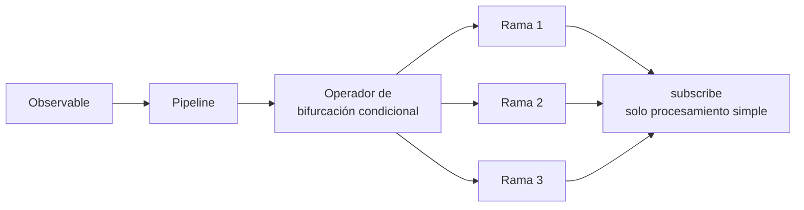
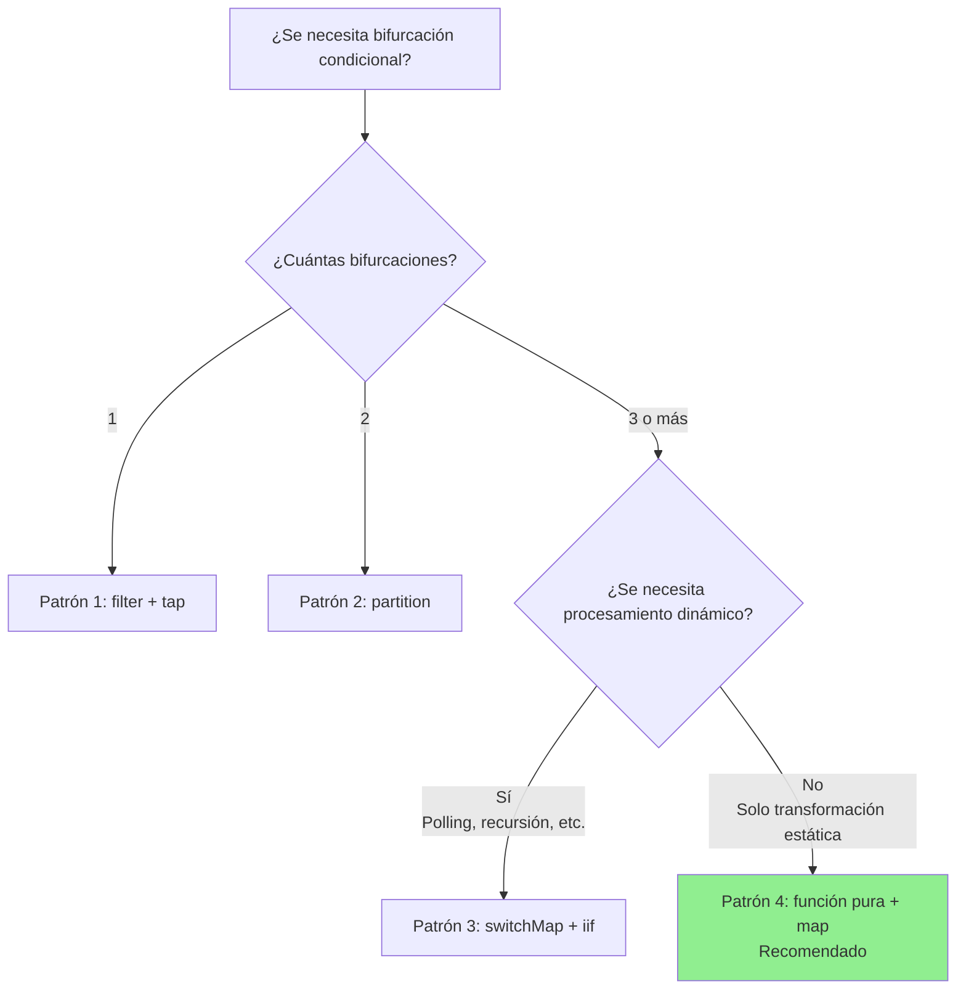

# Patrones de bifurcación condicional dentro de subscribe

Uno de los problemas comunes en los que caen los desarrolladores que comienzan a usar RxJS es realizar bifurcaciones condicionales complejas dentro del callback de `subscribe()`. Este artículo explica por qué esto es problemático y cómo se debe mejorar, junto con patrones prácticos.

> [!NOTE] API pública utilizada en este artículo
> Este artículo utiliza [JSONPlaceholder](https://jsonplaceholder.typicode.com/), una API REST gratuita. El código es completamente funcional, por lo que puede copiarlo y pegarlo para probarlo en su navegador.
>
> También se muestran patrones de conversión a tipos de respuesta API personalizados (que incluyen `status`, `errorCode`, etc.), lo que puede servir como referencia al convertir respuestas de API externas a tipos internos en proyectos reales.

## Problema: Bifurcaciones condicionales complejas dentro de subscribe

Realizar bifurcaciones condicionales dentro de subscribe reduce la legibilidad del código y dificulta las pruebas. Veamos el siguiente ejemplo.

### Preparación: Función auxiliar que envuelve la API de JSONPlaceholder

Primero, definimos una función auxiliar que convierte las respuestas de la API JSONPlaceholder a un tipo personalizado. Este patrón también se puede usar al convertir API externas a tipos internos en proyectos reales.

```typescript
import { Observable, from, of, map, catchError } from 'rxjs';

/**
 * Tipo de respuesta de la API JSONPlaceholder
 */
interface Post {
  userId: number;
  id: number;
  title: string;
  body: string;
}

/**
 * Tipo de respuesta API personalizado
 */
interface ApiResponse<T = any> {
  status: 'success' | 'error' | 'pending';
  data?: T;
  errorCode?: string;
  message?: string;
}

/**
 * Envuelve la API JSONPlaceholder y la convierte al tipo de respuesta API personalizado
 *
 * En proyectos reales, el patrón de conversión de respuestas de API externas a tipos internos
 * se usa con frecuencia. Esto permite localizar el impacto de cambios en la API y usar
 * tipos consistentes dentro de la aplicación.
 */
function fetchPost(postId: number = 1): Observable<ApiResponse<Post>> {
  return from(
    fetch(`https://jsonplaceholder.typicode.com/posts/${postId}`)
      .then(response => {
        if (!response.ok) {
          throw new Error(`HTTP error! status: ${response.status}`);
        }
        return response.json();
      })
  ).pipe(
    map((data: Post) => ({
      status: 'success' as const,
      data
    })),
    catchError(err => {
      // Convertir error al tipo de respuesta personalizado
      let errorCode = 'UNKNOWN_ERROR';

      if (err.message.includes('404')) {
        errorCode = 'NOT_FOUND';
      } else if (err.message.includes('500')) {
        errorCode = 'SERVER_ERROR';
      } else if (err.message.includes('Failed to fetch')) {
        errorCode = 'NETWORK_ERROR';
      }

      return of({
        status: 'error' as const,
        errorCode,
        message: err.message
      });
    })
  );
}
```

### Ejemplo de antipatrón

El siguiente ejemplo usa la función auxiliar anterior (`fetchPost`), pero realiza bifurcaciones condicionales complejas dentro de `subscribe()`.

```typescript
/**
 * ❌ Ejemplo de código problemático
 * Realiza bifurcaciones condicionales complejas dentro de subscribe
 */
class BadExampleManager {
  loading = false;
  data: Post | null = null;
  errorMessage = '';
  successMessage = '';

  // Callback para actualizar UI (opcional)
  onStateChange?: (state: { loading: boolean; data: Post | null; errorMessage: string; successMessage: string }) => void;

  init(): void {
    this.fetchData();
  }

  fetchData(): void {
    this.loading = true;
    this.updateUI();

    // Obtener datos de post desde la API JSONPlaceholder
    fetchPost(1).subscribe({
      next: response => {
        this.loading = false;

        // ❌ Problema: bifurcación condicional compleja dentro de subscribe
        if (response.status === 'success') {
          if (response.data) {
            // Validación de datos
            if (response.data.title && response.data.body) {
              this.data = response.data;
              this.successMessage = `Post "${response.data.title}" cargado`;
            } else {
              this.errorMessage = 'Formato de datos inválido';
            }
          } else {
            this.errorMessage = 'No hay datos disponibles';
          }
        } else if (response.status === 'error') {
          if (response.errorCode === 'NOT_FOUND') {
            this.errorMessage = 'Datos no encontrados (ID de post inexistente)';
          } else if (response.errorCode === 'NETWORK_ERROR') {
            this.errorMessage = 'Error de red. Verifique su conexión.';
            // Reintentar
            setTimeout(() => this.fetchData(), 5000);
          } else if (response.errorCode === 'SERVER_ERROR') {
            this.errorMessage = 'Se produjo un error del servidor';
          } else {
            this.errorMessage = 'Se produjo un error';
          }
        } else if (response.status === 'pending') {
          this.errorMessage = 'Procesando. Espere un momento.';
          // Polling
          setTimeout(() => this.fetchData(), 3000);
        }
        this.updateUI();
      }
    });
  }

  private updateUI(): void {
    if (this.onStateChange) {
      this.onStateChange({
        loading: this.loading,
        data: this.data,
        errorMessage: this.errorMessage,
        successMessage: this.successMessage
      });
    }
  }
}

// Ejemplo de uso (puede ejecutarlo en la consola del navegador)
const badExample = new BadExampleManager();
badExample.onStateChange = (state) => {
  if (state.loading) console.log('Cargando...');
  if (state.errorMessage) console.error(state.errorMessage);
  if (state.successMessage) console.log(state.successMessage);
  if (state.data) console.log('Datos:', state.data);
};
badExample.init();

// Salida de ejemplo:
// Cargando...
// Post "sunt aut facere repellat provident occaecati excepturi optio reprehenderit" cargado
// Datos: {userId: 1, id: 1, title: "...", body: "..."}
```

### Problemas de esta implementación

> [!WARNING] Problemas causados por bifurcaciones condicionales dentro de subscribe
> 1. **Reducción de legibilidad** - Anidamiento profundo, flujo de procesamiento difícil de seguir
> 2. **Dificultad para probar** - La lógica dentro de subscribe es difícil de probar unitariamente
> 3. **Falta de reutilización** - No se puede usar la misma lógica en otros lugares
> 4. **No declarativo** - Se desvía del estilo declarativo de RxJS
> 5. **Gestión de efectos secundarios** - Múltiples cambios de estado dispersos, difíciles de rastrear

## Resumen de soluciones

Procese las bifurcaciones condicionales dentro del pipeline usando operadores de RxJS en lugar de dentro de subscribe. Esto hace que el código sea declarativo y facilita las pruebas.



Este artículo explica los siguientes 4 patrones:

1. **Patrón 1**: Bifurcación con filter + tap
2. **Patrón 2**: Bifurcación con partition
3. **Patrón 3**: Bifurcación dinámica con switchMap + iif
4. **Patrón 4**: Funcionalización + transformación con map (recomendado)

## Patrón 1: Bifurcación con filter + tap

La forma más simple es usar `filter` para pasar solo valores que cumplen la condición y `tap` para ejecutar efectos secundarios.

### Ejemplo de implementación

Este ejemplo usa la función `fetchPost()` definida anteriormente para obtener datos desde la API JSONPlaceholder.

```typescript
class Pattern1Manager {
  private destroy$ = new Subject<void>();

  loading = false;
  data: Post | null = null;
  errorMessage = '';

  // Callback para actualizar UI (opcional)
  onStateChange?: (state: { loading: boolean; data: Post | null; errorMessage: string }) => void;

  init(): void {
    this.fetchData();
  }

  fetchData(): void {
    this.loading = true;
    this.updateUI();

    fetchPost(1).pipe(
      // ✅ Pasar solo respuestas exitosas
      filter(response => response.status === 'success'),

      // ✅ Validación de datos
      filter(response => response.data !== undefined),

      // ✅ Salida de log (efecto secundario)
      tap(response => console.log('Datos obtenidos exitosamente:', response.data)),

      // Manejo de errores
      catchError(err => {
        console.error('Error:', err);
        this.errorMessage = 'Fallo al obtener datos';
        this.loading = false;
        this.updateUI();
        return of(null);
      }),

      takeUntil(this.destroy$)
    ).subscribe({
      next: response => {
        this.loading = false;

        // ✅ Solo asignación simple
        if (response) {
          this.data = response.data;
        }
        this.updateUI();
      }
    });
  }

  private updateUI(): void {
    if (this.onStateChange) {
      this.onStateChange({
        loading: this.loading,
        data: this.data,
        errorMessage: this.errorMessage
      });
    }
  }

  destroy(): void {
    this.destroy$.next();
    this.destroy$.complete();
  }
}

// Ejemplo de uso (puede ejecutarlo en la consola del navegador)
const pattern1 = new Pattern1Manager();
pattern1.onStateChange = (state) => {
  if (state.loading) console.log('Cargando...');
  if (state.errorMessage) console.error(state.errorMessage);
  if (state.data) console.log('Datos de post:', state.data);
};
pattern1.init();

// Salida de ejemplo:
// Cargando...
// Datos obtenidos exitosamente: {userId: 1, id: 1, title: "...", body: "..."}
// Datos de post: {userId: 1, id: 1, title: "...", body: "..."}
```

### Ventajas y desventajas

> [!TIP] Características del Patrón 1
> **Ventajas:**
> - Simple y fácil de entender
> - Permite filtrado gradual
> - Cada paso es claro
>
> **Desventajas:**
> - No adecuado para múltiples bifurcaciones (se necesita crear un flujo para cada bifurcación)
> - Los valores filtrados no se pueden usar posteriormente

## Patrón 2: Bifurcación con partition

Usando `partition`, puede dividir un Observable en dos flujos basándose en una condición.

### Ejemplo de implementación

Este ejemplo también usa la función `fetchPost()` para obtener datos desde la API JSONPlaceholder.

```typescript
/**
 * Definición de tipo para resultado procesado
 */
interface ProcessedResult {
  type: 'success' | 'error';
  data?: Post;
  message: string;
}

class Pattern2Manager {
  private destroy$ = new Subject<void>();

  loading = false;
  result: ProcessedResult | null = null;

  // Callback para actualizar UI (opcional)
  onStateChange?: (state: { loading: boolean; result: ProcessedResult | null }) => void;

  init(): void {
    this.fetchData();
  }

  fetchData(): void {
    this.loading = true;
    this.updateUI();

    const response$ = fetchPost(1).pipe(
      catchError(err => {
        console.error('HTTP Error:', err);
        return EMPTY;
      })
    );

    // ✅ Dividir entre éxito y error
    const [success$, error$] = partition(
      response$,
      response => response.status === 'success'
    );

    // Procesamiento del flujo de éxito
    const successStream$ = success$.pipe(
      map(response => ({
        type: 'success' as const,
        data: response.data,
        message: 'Datos obtenidos'
      })),
      tap(() => console.log('Procesamiento de éxito completado'))
    );

    // Procesamiento del flujo de error
    const errorStream$ = error$.pipe(
      map(response => ({
        type: 'error' as const,
        message: this.getErrorMessage(response.errorCode)
      })),
      tap(result => console.log('Procesamiento de error completado:', result.message))
    );

    // ✅ Fusionar los dos flujos y suscribirse
    merge(successStream$, errorStream$).pipe(
      takeUntil(this.destroy$)
    ).subscribe({
      next: result => {
        this.loading = false;
        this.result = result;

        // Procesamiento adicional según código de error específico
        if (result.type === 'error') {
          this.handleError(result);
        }
        this.updateUI();
      }
    });
  }

  private getErrorMessage(errorCode?: string): string {
    const messages: Record<string, string> = {
      'NOT_FOUND': 'Datos no encontrados (ID de post inexistente)',
      'NETWORK_ERROR': 'Error de red. Verifique su conexión.',
      'SERVER_ERROR': 'Se produjo un error del servidor'
    };

    return messages[errorCode || ''] || 'Se produjo un error';
  }

  private handleError(result: ProcessedResult): void {
    // Procesamiento adicional según tipo de error (redirección a pantalla de inicio de sesión, etc.)
  }

  private updateUI(): void {
    if (this.onStateChange) {
      this.onStateChange({
        loading: this.loading,
        result: this.result
      });
    }
  }

  destroy(): void {
    this.destroy$.next();
    this.destroy$.complete();
  }
}

// Ejemplo de uso (puede ejecutarlo en la consola del navegador)
const pattern2 = new Pattern2Manager();
pattern2.onStateChange = (state) => {
  if (state.loading) console.log('Cargando...');
  if (state.result) {
    console.log(`[${state.result.type}] ${state.result.message}`);
    if (state.result.data) console.log('Datos de post:', state.result.data);
  }
};
pattern2.init();

// Salida de ejemplo:
// Cargando...
// Procesamiento de éxito completado
// [success] Datos obtenidos
// Datos de post: {userId: 1, id: 1, title: "...", body: "..."}
```

### Ventajas y desventajas

> [!TIP] Características del Patrón 2
> **Ventajas:**
> - Puede separar claramente dos bifurcaciones
> - Procesamiento independiente posible en cada flujo
> - Fácil de probar
>
> **Desventajas:**
> - Limitado a 2 bifurcaciones (no adecuado para 3 o más bifurcaciones)
> - Necesita suscribirse a ambos flujos

## Patrón 3: Bifurcación dinámica con switchMap + iif

Usando `iif`, puede cambiar a diferentes Observables según condiciones.

### Ejemplo de implementación

Este ejemplo intenta con un ID de post inexistente (999) para mostrar el procesamiento de errores.

```typescript
class Pattern3Manager {
  private destroy$ = new Subject<void>();

  loading = false;
  data: Post | null = null;
  statusMessage = '';

  // Callback para actualizar UI (opcional)
  onStateChange?: (state: { loading: boolean; data: Post | null; statusMessage: string }) => void;

  init(): void {
    // Intentar con ID de post inexistente (999)
    this.fetchData(999);
  }

  fetchData(postId: number = 1): void {
    this.loading = true;
    this.updateUI();

    fetchPost(postId).pipe(
      // ✅ Bifurcación según el status de la respuesta
      switchMap(response =>
        iif(
          // Condición 1: éxito
          () => response.status === 'success',
          // Procesamiento en caso de éxito
          of(response).pipe(
            map(r => ({ type: 'success' as const, data: r.data })),
            tap(() => console.log('Datos obtenidos exitosamente'))
          ),
          // Condición 2: error
          // En caso de error, convertir a flujo de error con throwError
          throwError(() => ({
            message: this.getErrorMessage(response.errorCode),
            errorCode: response.errorCode
          }))
        )
      ),
      retry({
        count: 2,
        delay: 1000 // Esperar 1 segundo y reintentar
      }),
      catchError(err => {
        console.error('Error:', err);
        this.statusMessage = err.message || 'Se produjo un error';
        this.loading = false;
        this.updateUI();
        return EMPTY;
      }),
      takeUntil(this.destroy$)
    ).subscribe({
      next: result => {
        this.loading = false;

        if (result.type === 'success') {
          this.data = result.data;
          this.statusMessage = '';
        }
        this.updateUI();
      }
    });
  }

  private getErrorMessage(errorCode?: string): string {
    const messages: Record<string, string> = {
      'NOT_FOUND': 'Datos no encontrados (ID de post inexistente)',
      'NETWORK_ERROR': 'Error de red. Verifique su conexión.',
      'SERVER_ERROR': 'Se produjo un error del servidor'
    };
    return messages[errorCode || ''] || 'Se produjo un error';
  }

  private updateUI(): void {
    if (this.onStateChange) {
      this.onStateChange({
        loading: this.loading,
        data: this.data,
        statusMessage: this.statusMessage
      });
    }
  }

  destroy(): void {
    this.destroy$.next();
    this.destroy$.complete();
  }
}

// Ejemplo de uso (puede ejecutarlo en la consola del navegador)
const pattern3 = new Pattern3Manager();
pattern3.onStateChange = (state) => {
  if (state.loading) console.log('Cargando...');
  if (state.statusMessage) console.log(state.statusMessage);
  if (state.data) console.log('Datos de post:', state.data);
};
pattern3.init();

// Salida de ejemplo (cuando se intenta con ID de post inexistente 999):
// Cargando...
// Error: {...}
// Datos no encontrados (ID de post inexistente)
//
// Cuando se especifica un ID de post válido (1):
// pattern3.fetchData(1);
// Cargando...
// Datos obtenidos exitosamente
// Datos de post: {userId: 1, id: 1, title: "...", body: "..."}
```

### Ventajas y desventajas

> [!TIP] Características del Patrón 3
> **Ventajas:**
> - Puede cambiar a diferentes Observables según condiciones
> - Fácil de combinar con procesamiento de reintento
> - Adecuado para procesamiento dinámico (polling, llamadas recursivas, etc.)
>
> **Desventajas:**
> - La legibilidad puede disminuir si el anidamiento se vuelve profundo
> - Difícil de depurar
> - Difícil de entender para principiantes
>
> **Nota:** Este ejemplo muestra una bifurcación simple de éxito/error, pero en realidad también puede manejar procesamiento dinámico más complejo como polling de procesamiento asíncrono que incluye estado pending.

## Patrón 4: Funcionalización + transformación con map (recomendado)

El patrón más recomendado es extraer la lógica de bifurcación condicional como una función pura y transformarla con el operador `map`.

### Ejemplo de implementación

Este ejemplo define una función pura que convierte las respuestas API devueltas por `fetchPost()` en un ViewModel para visualización en UI.

```typescript
/**
 * ViewModel para visualización en UI
 */
interface ViewModel {
  loading: boolean;
  displayData: Post | null;
  messageType: 'success' | 'error' | 'info' | null;
  message: string;
  showRetryButton: boolean;
}

/**
 * ✅ Función pura: Convierte respuesta API a ViewModel
 * Fácil de probar y reutilizable
 */
function mapResponseToViewModel(response: ApiResponse<Post>): ViewModel {
  // Procesamiento de respuesta exitosa
  if (response.status === 'success') {
    return {
      loading: false,
      displayData: response.data || null,
      messageType: 'success',
      message: `Post "${response.data?.title}" cargado`,
      showRetryButton: false
    };
  }

  // Procesamiento de respuesta de error
  if (response.status === 'error') {
    const errorMessages: Record<string, string> = {
      'NOT_FOUND': 'Datos no encontrados (ID de post inexistente)',
      'NETWORK_ERROR': 'Error de red. Verifique su conexión.',
      'SERVER_ERROR': 'Se produjo un error del servidor. Espere un momento y reintente.'
    };

    const message = errorMessages[response.errorCode || ''] ||
                    response.message ||
                    'Se produjo un error';

    return {
      loading: false,
      displayData: null,
      messageType: 'error',
      message,
      showRetryButton: isRetryableError(response.errorCode)
    };
  }

  // Procesamiento de respuesta Pending (no ocurre en API JSONPlaceholder, pero para extensión futura)
  if (response.status === 'pending') {
    return {
      loading: true,
      displayData: null,
      messageType: 'info',
      message: 'Procesando. Espere un momento.',
      showRetryButton: false
    };
  }

  // Fallback
  return {
    loading: false,
    displayData: null,
    messageType: 'error',
    message: 'Respuesta desconocida',
    showRetryButton: false
  };
}

/**
 * ✅ Función pura: Determina si el error es reintentable
 */
function isRetryableError(errorCode?: string): boolean {
  const retryableErrors = ['NETWORK_ERROR', 'SERVER_ERROR'];
  return retryableErrors.includes(errorCode || '');
}

/**
 * ✅ Función pura: Devuelve efecto secundario según error específico
 */
function getErrorSideEffect(errorCode?: string): (() => void) | null {
  const sideEffects: Record<string, () => void> = {
    'NETWORK_ERROR': () => {
      console.log('Error de red: Verifique su conexión');
    },
    'SERVER_ERROR': () => {
      console.log('Error del servidor: Espere un momento y reintente');
    }
  };

  return sideEffects[errorCode || ''] || null;
}

class Pattern4Manager {
  private destroy$ = new Subject<void>();

  viewModel: ViewModel = {
    loading: false,
    displayData: null,
    messageType: null,
    message: '',
    showRetryButton: false
  };

  // Callback para actualizar UI (opcional)
  onStateChange?: (viewModel: ViewModel) => void;

  init(): void {
    this.fetchData();
  }

  fetchData(postId: number = 1): void {
    // Establecer estado de carga inicial
    this.viewModel = {
      loading: true,
      displayData: null,
      messageType: null,
      message: '',
      showRetryButton: false
    };
    this.updateUI();

    fetchPost(postId).pipe(
      // ✅ Transformar usando función pura dentro del pipeline
      map(response => mapResponseToViewModel(response)),

      // ✅ Ejecutar efectos secundarios con tap (separados de función pura)
      tap(viewModel => {
        console.log('ViewModel:', viewModel);
      }),

      // Manejo de errores
      catchError(err => {
        console.error('HTTP Error:', err);

        const errorViewModel: ViewModel = {
          loading: false,
          displayData: null,
          messageType: 'error',
          message: 'Se produjo un error de red',
          showRetryButton: true
        };

        return of(errorViewModel);
      }),

      takeUntil(this.destroy$)
    ).subscribe({
      next: viewModel => {
        // ✅ Solo asignación simple dentro de subscribe
        this.viewModel = viewModel;

        // Ejecutar efecto secundario según error específico
        if (viewModel.messageType === 'error') {
          const sideEffect = getErrorSideEffect(
            // Aquí no se retiene el errorCode original,
            // por lo que necesita agregarse al ViewModel
          );
          sideEffect?.();
        }
        this.updateUI();
      }
    });
  }

  private updateUI(): void {
    if (this.onStateChange) {
      this.onStateChange(this.viewModel);
    }
  }

  destroy(): void {
    this.destroy$.next();
    this.destroy$.complete();
  }
}

// Ejemplo de uso (puede ejecutarlo en la consola del navegador)
const pattern4 = new Pattern4Manager();
pattern4.onStateChange = (viewModel) => {
  if (viewModel.loading) console.log('Cargando...');
  if (viewModel.message) console.log(`[${viewModel.messageType}] ${viewModel.message}`);
  if (viewModel.displayData) console.log('Datos de post:', viewModel.displayData);
  if (viewModel.showRetryButton) console.log('Mostrar botón de reintento');
};
pattern4.init();

// Salida de ejemplo:
// Cargando...
// ViewModel: {loading: false, displayData: {...}, messageType: "success", message: "Post \"...\" cargado", showRetryButton: false}
// [success] Post "sunt aut facere repellat provident occaecati excepturi optio reprehenderit" cargado
// Datos de post: {userId: 1, id: 1, title: "...", body: "..."}
```

### Mejora adicional: Retener errorCode

En el ejemplo anterior, `errorCode` no está incluido en el ViewModel, por lo que no se puede determinar el efecto secundario. Mostramos una versión mejorada.

```typescript
/**
 * ViewModel mejorado (retiene errorCode)
 */
interface ImprovedViewModel {
  loading: boolean;
  displayData: Post | null;
  messageType: 'success' | 'error' | 'info' | null;
  message: string;
  showRetryButton: boolean;
  errorCode?: string; // ✅ Retener código de error
}

/**
 * Función de mapeo mejorada
 */
function mapResponseToImprovedViewModel(response: ApiResponse<Post>): ImprovedViewModel {
  if (response.status === 'success') {
    return {
      loading: false,
      displayData: response.data || null,
      messageType: 'success',
      message: `Post "${response.data?.title}" cargado`,
      showRetryButton: false
    };
  }

  if (response.status === 'error') {
    const errorMessages: Record<string, string> = {
      'NOT_FOUND': 'Datos no encontrados (ID de post inexistente)',
      'NETWORK_ERROR': 'Error de red. Verifique su conexión.',
      'SERVER_ERROR': 'Se produjo un error del servidor'
    };

    return {
      loading: false,
      displayData: null,
      messageType: 'error',
      message: errorMessages[response.errorCode || ''] || 'Se produjo un error',
      showRetryButton: isRetryableError(response.errorCode),
      errorCode: response.errorCode // ✅ Retener código de error
    };
  }

  if (response.status === 'pending') {
    return {
      loading: true,
      displayData: null,
      messageType: 'info',
      message: 'Procesando',
      showRetryButton: false
    };
  }

  return {
    loading: false,
    displayData: null,
    messageType: 'error',
    message: 'Respuesta desconocida',
    showRetryButton: false
  };
}

class ImprovedPattern4Manager {
  private destroy$ = new Subject<void>();
  viewModel: ImprovedViewModel = {
    loading: false,
    displayData: null,
    messageType: null,
    message: '',
    showRetryButton: false
  };

  // Callback para actualizar UI (opcional)
  onStateChange?: (viewModel: ImprovedViewModel) => void;

  init(): void {
    this.fetchData();
  }

  fetchData(postId: number = 1): void {
    fetchPost(postId).pipe(
      map(response => mapResponseToImprovedViewModel(response)),
      tap(viewModel => console.log('ViewModel:', viewModel)),
      catchError(err => {
        console.error('HTTP Error:', err);
        return of({
          loading: false,
          displayData: null,
          messageType: 'error' as const,
          message: 'Error de red',
          showRetryButton: true
        });
      }),
      takeUntil(this.destroy$)
    ).subscribe({
      next: viewModel => {
        this.viewModel = viewModel;

        // ✅ Ejecutar efecto secundario según código de error
        if (viewModel.errorCode) {
          const sideEffect = getErrorSideEffect(viewModel.errorCode);
          sideEffect?.();
        }
        this.updateUI();
      }
    });
  }

  private updateUI(): void {
    if (this.onStateChange) {
      this.onStateChange(this.viewModel);
    }
  }

  destroy(): void {
    this.destroy$.next();
    this.destroy$.complete();
  }
}

// Ejemplo de uso (puede ejecutarlo en la consola del navegador)
const improvedPattern4 = new ImprovedPattern4Manager();
improvedPattern4.onStateChange = (viewModel) => {
  if (viewModel.loading) console.log('Cargando...');
  if (viewModel.message) console.log(`[${viewModel.messageType}] ${viewModel.message}`);
  if (viewModel.displayData) console.log('Datos de post:', viewModel.displayData);
};
improvedPattern4.init();

// Salida de ejemplo:
// ViewModel: {loading: false, displayData: {...}, messageType: "success", message: "...", showRetryButton: false}
// [success] Post "sunt aut facere repellat provident occaecati excepturi optio reprehenderit" cargado
// Datos de post: {userId: 1, id: 1, title: "...", body: "..."}
```

### Ventajas y desventajas

> [!TIP] Características del Patrón 4 (recomendado)
> **Ventajas:**
> - **Fácil de probar**: Las funciones puras son fáciles de probar unitariamente
> - **Reutilizable**: La misma lógica se puede usar en otros componentes
> - **Alta legibilidad**: La lógica de transformación está claramente separada
> - **Seguridad de tipos**: Funciona la inferencia de tipos de TypeScript
> - **Alta mantenibilidad**: El alcance del impacto de cambios de lógica es claro
>
> **Desventajas:**
> - Aumenta la cantidad de código (pero es un compromiso por claridad)

## Ejemplo práctico: Implementación completa de procesamiento de respuestas API

Mostramos un ejemplo de implementación práctica que combina los patrones presentados hasta ahora. Implementación usando la API JSONPlaceholder.

```typescript
/**
 * Definición de tipo ViewModel
 */
interface DataViewModel<T = any> {
  loading: boolean;
  data: T | null;
  error: {
    message: string;
    code?: string;
    retryable: boolean;
  } | null;
  info: string | null;
}

/**
 * Servicio de obtención de datos
 */
class DataService {

  /**
   * Obtención de datos (con reintento automático)
   */
  fetchData<T>(postId: number = 1): Observable<DataViewModel<T>> {
    return fetchPost(postId).pipe(

      // Convertir respuesta a ViewModel
      map(response => this.mapToViewModel<T>(response)),

      // Manejo de errores HTTP
      catchError((err: Error) =>
        of(this.createErrorViewModel<T>(err))
      ),

      // Reintento automático para errores reintentables
      retry({
        count: 2,
        delay: 1000 // Esperar 1 segundo y reintentar
      })
    );
  }

  /**
   * Convertir respuesta API a ViewModel (función pura)
   */
  private mapToViewModel<T>(response: ApiResponse<T>): DataViewModel<T> {
    if (response.status === 'success') {
      return {
        loading: false,
        data: response.data || null,
        error: null,
        info: null
      };
    }

    if (response.status === 'error') {
      return {
        loading: false,
        data: null,
        error: {
          message: this.getErrorMessage(response.errorCode, response.message),
          code: response.errorCode,
          retryable: this.isRetryableError(response.errorCode)
        },
        info: null
      };
    }

    // Pending (no ocurre en API JSONPlaceholder, pero para extensión futura)
    return {
      loading: true,
      data: null,
      error: null,
      info: 'Procesando...'
    };
  }

  /**
   * Crear ViewModel desde error HTTP
   */
  private createErrorViewModel<T>(err: Error): DataViewModel<T> {
    return {
      loading: false,
      data: null,
      error: {
        message: err.message || 'Se produjo un error',
        code: 'FETCH_ERROR',
        retryable: true
      },
      info: null
    };
  }

  /**
   * Obtener mensaje de error
   */
  private getErrorMessage(errorCode?: string, fallbackMessage?: string): string {
    const messages: Record<string, string> = {
      'NOT_FOUND': 'Datos no encontrados (ID de post inexistente)',
      'NETWORK_ERROR': 'Error de red. Verifique su conexión.',
      'SERVER_ERROR': 'Se produjo un error del servidor'
    };

    return messages[errorCode || ''] || fallbackMessage || 'Se produjo un error';
  }

  /**
   * Determinar si el error es reintentable
   */
  private isRetryableError(errorCode?: string): boolean {
    const retryable = ['NETWORK_ERROR', 'SERVER_ERROR'];
    return retryable.includes(errorCode || '');
  }
}

/**
 * Gestor de visualización de datos
 */
class DataDisplayManager {
  private destroy$ = new Subject<void>();
  private dataService = new DataService();

  viewModel: DataViewModel = {
    loading: false,
    data: null,
    error: null,
    info: null
  };

  // Callback para actualizar UI (opcional)
  onStateChange?: (viewModel: DataViewModel) => void;

  init(): void {
    this.loadData();
  }

  loadData(postId: number = 1): void {
    this.viewModel = {
      loading: true,
      data: null,
      error: null,
      info: null
    };
    this.updateUI();

    this.dataService.fetchData(postId).pipe(
      takeUntil(this.destroy$)
    ).subscribe({
      next: viewModel => {
        // ✅ Solo asignación simple dentro de subscribe
        this.viewModel = viewModel;
        this.updateUI();
      }
    });
  }

  private updateUI(): void {
    if (this.onStateChange) {
      this.onStateChange(this.viewModel);
    }
  }

  destroy(): void {
    this.destroy$.next();
    this.destroy$.complete();
  }
}

// Ejemplo de uso (puede ejecutarlo en la consola del navegador)
const dataDisplay = new DataDisplayManager();
dataDisplay.onStateChange = (viewModel) => {
  if (viewModel.loading) console.log('Cargando...');
  if (viewModel.error) {
    console.error(viewModel.error.message);
    if (viewModel.error.retryable) console.log('Reintentable');
  }
  if (viewModel.info) console.log(viewModel.info);
  if (viewModel.data) console.log('Datos de post:', viewModel.data);
};
dataDisplay.init();

// Salida de ejemplo:
// Cargando...
// Datos de post: {userId: 1, id: 1, title: "...", body: "..."}
//
// Ejemplo en caso de error (especificar ID de post inexistente 999):
// dataDisplay.loadData(999);
// Cargando...
// Datos no encontrados (ID de post inexistente)
// Reintentable
```

> [!IMPORTANT] Puntos del patrón práctico
> 1. **Transformar en capa de servicio**: Realizar conversión de respuesta API a ViewModel en la capa de servicio
> 2. **Usar funciones puras**: Extraer lógica de bifurcación condicional como funciones puras
> 3. **Mantener subscribe simple**: Solo realizar asignación al suscribirse
> 4. **Centralizar manejo de errores**: Completar procesamiento de errores dentro del pipeline
> 5. **Garantizar seguridad de tipos**: Garantizar seguridad con definición de tipo ViewModel

## Guía de selección

Presentamos una guía según escenarios sobre qué patrón elegir.



### Criterios de selección de patrones

| Escenario | Patrón recomendado | Razón |
|---------|------------|------|
| Filtrado simple | Patrón 1 (filter + tap) | Simple y fácil de entender |
| Bifurcación de 2 vías éxito/fallo | Patrón 2 (partition) | Separación clara posible |
| Polling/reintento | Patrón 3 (switchMap + iif) | Maneja procesamiento dinámico |
| Bifurcaciones condicionales complejas | Patrón 4 (función pura + map) | Testeable, reutilizable |
| Se necesita gestión de estado | Patrón 4 (función pura + map) | Adecuado para patrón ViewModel |

> [!TIP] En caso de duda, elija el **Patrón 4 (función pura + map)**
> - Mayor mantenibilidad
> - Fácil de probar
> - Adecuado para desarrollo en equipo
> - Buena compatibilidad con el sistema de tipos de TypeScript

## Resumen

Realizar bifurcaciones condicionales complejas dentro de subscribe es uno de los antipatrones de RxJS. Usando los 4 patrones presentados en este artículo, puede escribir código declarativo y de alta mantenibilidad.

### Principios importantes

> [!IMPORTANT] Principios para evitar bifurcaciones condicionales dentro de subscribe
> 1. **Procesar lógica dentro del pipeline** - Completar transformación antes de subscribe
> 2. **Usar funciones puras** - Extraer lógica de bifurcación condicional como funciones
> 3. **Adoptar patrón ViewModel** - Convertir a modelo para visualización en UI
> 4. **Separar efectos secundarios con tap** - Separar claramente transformación pura de efectos secundarios
> 5. **Garantizar seguridad de tipos** - Maximizar uso del sistema de tipos de TypeScript

### Comparación Before / After

**Before (antipatrón):**
```typescript
observable$.subscribe(value => {
  if (value.status === 'success') {
    if (value.data) {
      this.data = value.data;
    }
  } else if (value.status === 'error') {
    if (value.errorCode === 'AUTH_ERROR') {
      // ...
    } else if (value.errorCode === 'NOT_FOUND') {
      // ...
    }
  }
});
```

**After (patrón recomendado):**
```typescript
observable$.pipe(
  map(response => mapToViewModel(response)),
  tap(viewModel => console.log('Procesado:', viewModel))
).subscribe(viewModel => {
  this.viewModel = viewModel;
});
```

### Secciones relacionadas

- **[Colección de antipatrones de RxJS](/es/guide/anti-patterns/)** - Errores comunes y soluciones
- **[Manejo de errores](/es/guide/error-handling/strategies.md)** - Fundamentos de procesamiento de errores
- **[Patrones de llamadas API](/es/guide/practical-patterns/api-calls.md)** - Patrones prácticos de comunicación API
- **[Patrones de procesamiento de formularios](/es/guide/practical-patterns/form-handling.md)** - Bifurcaciones condicionales en formularios

## Código de prueba

Mostramos un ejemplo de prueba del Patrón 4 (función pura + map).

```typescript
describe('mapResponseToViewModel', () => {
  it('should map success response correctly', () => {
    const response: ApiResponse = {
      status: 'success',
      data: { id: 1, name: 'Test' }
    };

    const result = mapResponseToViewModel(response);

    expect(result.loading).toBe(false);
    expect(result.displayData).toEqual({ id: 1, name: 'Test' });
    expect(result.messageType).toBe('success');
    expect(result.showRetryButton).toBe(false);
  });

  it('should map error response with retryable error', () => {
    const response: ApiResponse = {
      status: 'error',
      errorCode: 'RATE_LIMIT'
    };

    const result = mapResponseToViewModel(response);

    expect(result.loading).toBe(false);
    expect(result.displayData).toBeNull();
    expect(result.messageType).toBe('error');
    expect(result.showRetryButton).toBe(true); // RATE_LIMIT es reintentable
  });

  it('should map error response with non-retryable error', () => {
    const response: ApiResponse = {
      status: 'error',
      errorCode: 'NOT_FOUND'
    };

    const result = mapResponseToViewModel(response);

    expect(result.showRetryButton).toBe(false); // NOT_FOUND no es reintentable
  });

  it('should map pending response', () => {
    const response: ApiResponse = {
      status: 'pending'
    };

    const result = mapResponseToViewModel(response);

    expect(result.loading).toBe(true);
    expect(result.messageType).toBe('info');
  });
});

describe('isRetryableError', () => {
  it('should identify retryable errors', () => {
    expect(isRetryableError('RATE_LIMIT')).toBe(true);
    expect(isRetryableError('TIMEOUT')).toBe(true);
    expect(isRetryableError('SERVER_ERROR')).toBe(true);
  });

  it('should identify non-retryable errors', () => {
    expect(isRetryableError('NOT_FOUND')).toBe(false);
    expect(isRetryableError('AUTH_ERROR')).toBe(false);
    expect(isRetryableError('VALIDATION_ERROR')).toBe(false);
  });
});
```

> [!TIP] Por qué las pruebas de funciones puras son fáciles
> - No dependen de estado externo
> - La misma entrada siempre devuelve la misma salida
> - No hay efectos secundarios
> - No se necesitan mocks o espías

## Recursos de referencia

Recursos de aprendizaje adicionales para evitar bifurcaciones condicionales dentro de subscribe.

- [Documentación oficial de RxJS - Operators](https://rxjs.dev/guide/operators) - Cómo usar operadores
- [Learn RxJS - Transformation Operators](https://www.learnrxjs.io/learn-rxjs/operators/transformation) - Detalles de operadores de transformación
- [Learn RxJS - partition](https://www.learnrxjs.io/learn-rxjs/operators/transformation/partition) - Ejemplos de uso de partition
- [RxJS Best Practices](https://blog.angular-university.io/rxjs-best-practices/) - Mejores prácticas de RxJS
