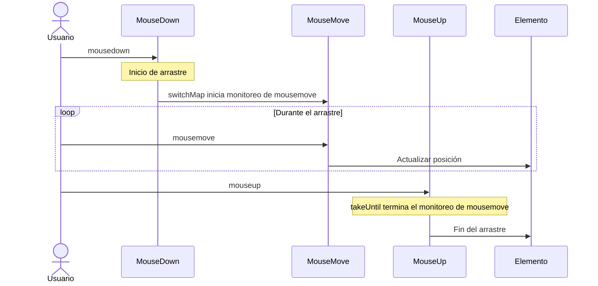
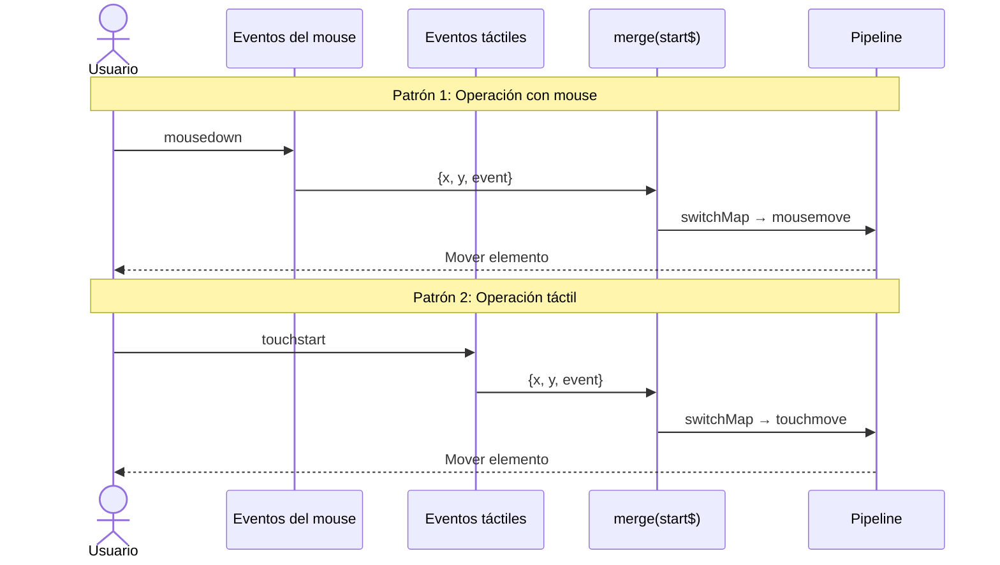

# Patrones de Procesamiento de Eventos de UI

El procesamiento de eventos de UI es uno de los desafíos más frecuentes en el desarrollo frontend. Usar RxJS permite implementar procesamiento de eventos complejos de manera declarativa e intuitiva.

En este artículo, explicaremos patrones específicos de procesamiento de eventos de UI necesarios en el trabajo práctico, como clics, desplazamiento, arrastrar y soltar, entrada de teclado, etc.

## Lo que aprenderás en este artículo

- Control de eventos de clic (throttle, debounce, distinct)
- Procesamiento eficiente de eventos de desplazamiento
- Implementación de arrastrar y soltar
- Entrada de teclado y autocompletado
- Soporte multitáctil
- Combinación de eventos compuestos

> [!TIP] Conocimientos previos
> Este artículo asume conocimientos de [Capítulo 4: Operadores](../operators/index.md). Especialmente importante es la comprensión de `debounceTime`, `throttleTime` y `distinctUntilChanged`.

## Procesamiento de Eventos de Clic

### Problema: Ejecución excesiva de procesamiento por clics consecutivos

Si el botón se presiona consecutivamente, el procesamiento se ejecuta varias veces, lo que puede causar problemas de rendimiento y errores.

### Solución 1: Controlar con throttleTime

Procesa solo el primer clic dentro de un período de tiempo determinado.

```typescript
import { fromEvent, throttleTime } from 'rxjs';
const button = document.createElement('button');
button.id = 'submit-button';
button.innerText = 'enviar';
document.body.appendChild(button);

if (button) {
  fromEvent(button, 'click').pipe(
    throttleTime(1000) // Procesa solo una vez por segundo
  ).subscribe(() => {
    console.log('Ejecutando procesamiento de envío');
    submitForm();
  });
}

function submitForm(): void {
  console.log('Enviando formulario...');
  // Llamada a API, etc.
}
```

#### Flujo de ejecución

```
Clics del usuario: ●    ●●●        ●  ●●
                    |    |          |  |
throttleTime(1000): ●              ●
                    |              |
                 Procesar       Procesar
```

> [!NOTE] Características de throttleTime
> - Procesa el **primer evento** e ignora eventos posteriores durante un período de tiempo
> - Adecuado cuando la respuesta en tiempo real es importante (desplazamiento, redimensionamiento, etc.)

### Solución 2: Controlar con debounceTime

Procesa después de un cierto tiempo después de que los eventos se detengan.

```typescript
import { fromEvent, debounceTime } from 'rxjs';
// Enfoque tradicional (comentado como referencia)
// const searchInput = document.querySelector<HTMLInputElement>('#search');

// Autónomo: crea input dinámicamente
const searchInput = document.createElement('input');
searchInput.id = 'search';
searchInput.type = 'text';
searchInput.placeholder = 'Ingrese palabra clave de búsqueda...';
searchInput.style.padding = '8px';
searchInput.style.margin = '10px';
searchInput.style.width = '300px';
document.body.appendChild(searchInput);

fromEvent(searchInput, 'input').pipe(
  debounceTime(300) // Espera 300ms después de que la entrada se detenga
).subscribe((event) => {
  const value = (event.target as HTMLInputElement).value;
  console.log('Ejecutar búsqueda:', value);
  performSearch(value);
});

function performSearch(query: string): void {
  console.log('Buscando...', query);
  // Llamada a API de búsqueda
}
```

#### Flujo de ejecución

```
Entrada del usuario:  ●●●●●     ●●        ●●●●
                      |            |      |
debounceTime(300):   300ms       300ms  300ms espera
                      |            |      |
                   Procesar      Procesar Ejecutar
```

> [!NOTE] Características de debounceTime
> - Espera un cierto tiempo desde el **último evento** antes de procesar
> - Adecuado para búsqueda, autocompletado y validación en tiempo real

### Cuándo usar throttleTime vs debounceTime

| Uso | Operador a usar | Razón |
|-----|-------------------|------|
| **Entrada de búsqueda** | `debounceTime` | Quieres buscar después de que la entrada se detenga |
| **Autocompletado** | `debounceTime` | Mostrar candidatos después de que la entrada se detenga |
| **Eventos de desplazamiento** | `throttleTime` | Quieres procesar periódicamente durante el desplazamiento |
| **Redimensionamiento de ventana** | `throttleTime` o `debounceTime` | Según los requisitos |
| **Prevenir clics múltiples de botón** | `throttleTime` o `exhaustMap` | Procesar el primer clic inmediatamente |

### Solución 3: Eliminar duplicados con distinctUntilChanged

Compara con el valor anterior y omite el procesamiento si el mismo valor es consecutivo.

```typescript
import { fromEvent, map, debounceTime, distinctUntilChanged } from 'rxjs';
const searchInput = document.createElement('input');
searchInput.id = 'search';
searchInput.type = 'text';
searchInput.placeholder = 'Ingrese palabra clave de búsqueda...';
searchInput.style.padding = '8px';
searchInput.style.margin = '10px';
searchInput.style.width = '300px';
document.body.appendChild(searchInput);

fromEvent(searchInput, 'input').pipe(
  map(event => (event.target as HTMLInputElement).value.trim()),
  debounceTime(300),
  distinctUntilChanged() // Ignora si es el mismo valor que la vez anterior
).subscribe(query => {
  console.log('Ejecutar búsqueda:', query);
  performSearch(query);
});
```

#### Ejemplo de ejecución

```typescript
// Entrada del usuario: "RxJS" → Retroceso → "RxJS"
// Sin distinctUntilChanged: Ejecuta búsqueda 2 veces
// Con distinctUntilChanged: Ejecuta búsqueda 1 vez (omite la segunda vez porque es el mismo valor)
```

> [!TIP] Mejores prácticas
> Para implementar búsqueda o autocompletado, se recomienda usar los siguientes tres en conjunto:
> 1. `debounceTime()` - Espera a que la entrada se detenga
> 2. `distinctUntilChanged()` - Elimina duplicados
> 3. `switchMap()` - Cancela solicitudes antiguas

## Procesamiento de Eventos de Desplazamiento

### Problema: Activación excesiva de eventos de desplazamiento

Los eventos de desplazamiento se activan con mucha frecuencia, por lo que procesarlos tal cual puede causar problemas de rendimiento.

### Solución: Reducir con throttleTime

```typescript
import { fromEvent, throttleTime, map } from 'rxjs';
const scrollContainer = document.createElement('div');
scrollContainer.id = 'scroll-container';
scrollContainer.style.width = '400px';
scrollContainer.style.height = '300px';
scrollContainer.style.overflow = 'auto';
scrollContainer.style.border = '1px solid #ccc';
scrollContainer.style.margin = '10px';
scrollContainer.style.padding = '10px';

// Agregar contenido para hacerlo desplazable
scrollContainer.innerHTML = Array.from({ length: 100 }, (_, i) =>
  `<p>Elemento ${i + 1}</p>`
).join('');

document.body.appendChild(scrollContainer);

fromEvent(scrollContainer, 'scroll').pipe(
  throttleTime(100), // Procesa solo una vez cada 100ms
  map(() => ({
    scrollTop: scrollContainer.scrollTop,
    scrollHeight: scrollContainer.scrollHeight,
    clientHeight: scrollContainer.clientHeight
  }))
).subscribe(({ scrollTop, scrollHeight, clientHeight }) => {
  // Cálculo de la posición de desplazamiento
  const scrollPercentage = (scrollTop / (scrollHeight - clientHeight)) * 100;
  console.log(`Posición de desplazamiento: ${scrollPercentage.toFixed(1)}%`);

  // Desplazamiento infinito: Carga la siguiente página si se ha desplazado más del 90%
  if (scrollPercentage > 90) {
    console.log('Cargando la siguiente página...');
    loadMoreItems();
  }
});

function loadMoreItems(): void {
  console.log('Obteniendo datos adicionales');
}
```

### Ejemplo práctico: Detección de dirección de desplazamiento

```typescript
import { fromEvent, BehaviorSubject, throttleTime, map, pairwise, distinctUntilChanged } from 'rxjs';
type ScrollDirection = 'up' | 'down' | 'none';

const scrollDirection$ = new BehaviorSubject<ScrollDirection>('none');

// Crear elemento de encabezado dinámicamente
const header = document.createElement('div');
header.id = 'header';
header.innerText = 'Encabezado (mostrar/ocultar al desplazarse)';
header.style.position = 'fixed';
header.style.top = '0';
header.style.left = '0';
header.style.width = '100%';
header.style.padding = '20px';
header.style.background = '#333';
header.style.color = '#fff';
header.style.transition = 'transform 0.3s';
document.body.appendChild(header);

// Agregar contenido de desplazamiento
const scrollContent = document.createElement('div');
scrollContent.style.marginTop = '80px';
scrollContent.innerHTML = Array.from({ length: 100 }, (_, i) =>
  `<p>Contenido ${i + 1}</p>`
).join('');
document.body.appendChild(scrollContent);

fromEvent(window, 'scroll').pipe(
  throttleTime(100),
  map(() => window.scrollY),
  pairwise(), // Obtiene el par de valores anterior y actual
  map(([prev, curr]) => {
    if (curr > prev) return 'down';
    if (curr < prev) return 'up';
    return 'none';
  }),
  distinctUntilChanged() // Notifica solo cuando la dirección cambia
).subscribe(direction => {
  scrollDirection$.next(direction);
  console.log('Dirección de desplazamiento:', direction);

  // Alternar mostrar/ocultar encabezado
  if (direction === 'down') {
    header.style.transform = 'translateY(-100%)';
  } else if (direction === 'up') {
    header.style.transform = 'translateY(0)';
  }
});
```

> [!TIP] Uso de pairwise
> `pairwise()` es un operador útil que obtiene pares de valores anterior y actual. Se puede usar para detectar dirección de desplazamiento, determinar aumento/disminución de valores, cálculo de diferencias, etc.

## Implementación de Arrastrar y Soltar

### Problema: Combinación compleja de eventos del mouse

Arrastrar y soltar es una combinación compleja de eventos: mousedown → mousemove → mouseup.

### Solución: Combinar múltiples Observables

```typescript
import { fromEvent, merge, map, switchMap, takeUntil, tap } from 'rxjs';
interface Position {
  x: number;
  y: number;
}

const draggableElement = document.createElement('div');
draggableElement.id = 'draggable';
draggableElement.innerText = 'Arrástralo';
draggableElement.style.position = 'absolute';
draggableElement.style.left = '100px';
draggableElement.style.top = '100px';
draggableElement.style.width = '150px';
draggableElement.style.height = '150px';
draggableElement.style.padding = '20px';
draggableElement.style.background = '#4CAF50';
draggableElement.style.color = '#fff';
draggableElement.style.cursor = 'move';
draggableElement.style.userSelect = 'none';
draggableElement.style.display = 'flex';
draggableElement.style.alignItems = 'center';
draggableElement.style.justifyContent = 'center';
document.body.appendChild(draggableElement);

const mouseDown$ = fromEvent<MouseEvent>(draggableElement, 'mousedown');
const mouseMove$ = fromEvent<MouseEvent>(document, 'mousemove');
const mouseUp$ = fromEvent<MouseEvent>(document, 'mouseup');

// Obtener la posición del elemento al inicio del arrastre
let initialX = 0;
let initialY = 0;

mouseDown$.pipe(
  tap((event: MouseEvent) => {
    event.preventDefault();
    // Registrar la posición actual del elemento
    const rect = draggableElement.getBoundingClientRect();
    initialX = rect.left;
    initialY = rect.top;

    // Diferencia con la posición del mouse al inicio del arrastre
    initialX = rect.left - event.clientX;
    initialY = rect.top - event.clientY;

    draggableElement.style.opacity = '0.7';
  }),
  switchMap(() =>
    // Cuando ocurre mousedown, comienza a monitorear mousemove
    mouseMove$.pipe(
      map((event: MouseEvent): Position => ({
        x: event.clientX + initialX,
        y: event.clientY + initialY
      })),
      // Termina el monitoreo al mouseup o mouseleave
      takeUntil(
        merge(
          mouseUp$,
          fromEvent(document, 'mouseleave')
        ).pipe(
          tap(() => {
            draggableElement.style.opacity = '1';
          })
        )
      )
    )
  )
).subscribe((position: Position) => {
  // Mover el elemento
  draggableElement.style.left = `${position.x}px`;
  draggableElement.style.top = `${position.y}px`;
});
```

#### Flujo de eventos



> [!IMPORTANT] Puntos importantes de arrastrar y soltar
> - `switchMap` para iniciar monitoreo de mousedown → mousemove
> - `takeUntil` para terminar el monitoreo al mouseup
> - `preventDefault()` para deshabilitar el comportamiento de arrastre predeterminado
> - `classList.add/remove` para retroalimentación visual

### Soporte para dispositivos táctiles

```typescript
import { fromEvent, merge, map, switchMap, takeUntil, tap } from 'rxjs';
const draggableElement = document.createElement('div');
draggableElement.id = 'draggable';
draggableElement.innerText = 'Arrástralo\n(Soporte para mouse y táctil)';
draggableElement.style.position = 'absolute';
draggableElement.style.left = '100px';
draggableElement.style.top = '100px';
draggableElement.style.width = '150px';
draggableElement.style.height = '150px';
draggableElement.style.padding = '20px';
draggableElement.style.background = '#2196F3';
draggableElement.style.color = '#fff';
draggableElement.style.cursor = 'move';
draggableElement.style.userSelect = 'none';
draggableElement.style.display = 'flex';
draggableElement.style.alignItems = 'center';
draggableElement.style.justifyContent = 'center';
draggableElement.style.textAlign = 'center';
draggableElement.style.whiteSpace = 'pre-line';
document.body.appendChild(draggableElement);

// Integrar eventos del mouse y eventos táctiles
const start$ = merge(
  fromEvent<MouseEvent>(draggableElement, 'mousedown').pipe(
    map(e => ({ x: e.clientX, y: e.clientY, event: e }))
  ),
  fromEvent<TouchEvent>(draggableElement, 'touchstart').pipe(
    map(e => ({
      x: e.touches[0].clientX,
      y: e.touches[0].clientY,
      event: e
    }))
  )
);

const move$ = merge(
  fromEvent<MouseEvent>(document, 'mousemove').pipe(
    map(e => ({ x: e.clientX, y: e.clientY }))
  ),
  fromEvent<TouchEvent>(document, 'touchmove').pipe(
    map(e => ({
      x: e.touches[0].clientX,
      y: e.touches[0].clientY
    }))
  )
);

const end$ = merge(
  fromEvent(document, 'mouseup'),
  fromEvent(document, 'touchend')
);

let initialOffsetX = 0;
let initialOffsetY = 0;

start$.pipe(
  tap(({ x, y, event }) => {
    event.preventDefault();
    const rect = draggableElement.getBoundingClientRect();
    initialOffsetX = rect.left - x;
    initialOffsetY = rect.top - y;
    draggableElement.style.opacity = '0.7';
  }),
  switchMap(() =>
    move$.pipe(
      map(({ x, y }) => ({
        x: x + initialOffsetX,
        y: y + initialOffsetY
      })),
      takeUntil(
        end$.pipe(
          tap(() => {
            draggableElement.style.opacity = '1';
          })
        )
      )
    )
  )
).subscribe(({ x, y }) => {
  draggableElement.style.left = `${x}px`;
  draggableElement.style.top = `${y}px`;
});
```

> [!TIP] Soporte multidispositivo
> Usar `merge` para integrar eventos del mouse y eventos táctiles permite implementar arrastrar y soltar que funcione en PC/tablet/smartphone.

#### Comparación del flujo de eventos



Este diagrama de secuencia muestra que los eventos del mouse y los eventos táctiles se integran en el mismo pipeline y funcionan de la misma manera en cualquier dispositivo.

## Entrada de Teclado y Autocompletado

### Problema: Llamadas excesivas a la API durante la entrada

Cuando se realiza una llamada a la API en respuesta a la entrada del teclado, como en un cuadro de búsqueda, llamar cada vez puede causar problemas de rendimiento.

Por ejemplo, cuando el usuario ingresa "RxJS",
- `R` → Llamada a API
- `Rx` → Llamada a API
- `RxJ` → Llamada a API
- `RxJS` → Llamada a API

Se llama a la API 4 veces por 4 caracteres de entrada. Esto es muy ineficiente y también carga el servidor.

### Solución: debounceTime + switchMap

Para implementar el autocompletado de manera eficiente, combina los siguientes tres operadores:

1. **debounceTime(300)** - Espera 300ms después de que el usuario detenga la entrada
2. **distinctUntilChanged()** - Ignora si es el mismo valor que la vez anterior (previene solicitudes innecesarias)
3. **switchMap()** - Cancela solicitudes antiguas si hay una nueva entrada

Con esta combinación, incluso si el usuario escribe "RxJS" rápidamente, la API se llama solo una vez después de que la entrada se detenga.

```typescript
import { fromEvent, of, map, debounceTime, distinctUntilChanged, switchMap, catchError } from 'rxjs';
interface SearchResult {
  id: number;
  title: string;
  description: string;
}

const searchInput = document.createElement('input');
searchInput.id = 'search';
searchInput.type = 'text';
searchInput.placeholder = 'Búsqueda con autocompletado...';
searchInput.style.padding = '10px';
searchInput.style.margin = '10px';
searchInput.style.width = '400px';
searchInput.style.fontSize = '16px';
document.body.appendChild(searchInput);

const resultsContainer = document.createElement('div');
resultsContainer.id = 'results';
resultsContainer.style.margin = '10px';
resultsContainer.style.padding = '10px';
resultsContainer.style.border = '1px solid #ddd';
resultsContainer.style.width = '400px';
resultsContainer.style.minHeight = '100px';
document.body.appendChild(resultsContainer);

fromEvent(searchInput, 'input').pipe(
  map(event => (event.target as HTMLInputElement).value.trim()),
  debounceTime(300),           // Espera 300ms después de que la entrada se detenga
  distinctUntilChanged(),      // Ignora si es el mismo valor que la vez anterior
  switchMap(query => {
    if (query.length < 2) {
      return of([]); // Matriz vacía si es menos de 2 caracteres
    }

    console.log('Ejecutar búsqueda:', query);
    return searchAPI(query).pipe(
      catchError(err => {
        console.error('Error de búsqueda:', err);
        return of([]);
      })
    );
  })
).subscribe(results => {
  displayResults(results);
});

// API de búsqueda (mock)
function searchAPI(query: string) {
  return of([
    { id: 1, title: `Resultado 1: ${query}`, description: 'Descripción 1' },
    { id: 2, title: `Resultado 2: ${query}`, description: 'Descripción 2' },
    { id: 3, title: `Resultado 3: ${query}`, description: 'Descripción 3' }
  ]);
}

function displayResults(results: SearchResult[]): void {
  if (results.length === 0) {
    resultsContainer.innerHTML = '<p>No se encontraron resultados</p>';
    return;
  }

  resultsContainer.innerHTML = results
    .map(
      r => `
      <div class="result-item" style="padding: 10px; border-bottom: 1px solid #eee;">
        <h3 style="margin: 0 0 5px 0;">${r.title}</h3>
        <p style="margin: 0; color: #666;">${r.description}</p>
      </div>
    `
    )
    .join('');
}
```

#### Explicación detallada del funcionamiento

Expliquemos cómo funciona cada paso de este código con un ejemplo específico.

**Línea de tiempo cuando el usuario ingresa "RxJS" rápidamente:**

```
Tiempo | Evento                | Procesamiento del pipeline
------|------------------------|---------------------------
0ms   | Entrada 'R'            | Inicio de espera de debounceTime
50ms  | Entrada 'Rx'           | Cancelar espera anterior, iniciar nueva espera
100ms | Entrada 'RxJ'          | Cancelar espera anterior, iniciar nueva espera
150ms | Entrada 'RxJS'         | Cancelar espera anterior, iniciar nueva espera
450ms | (300ms desde la parada)| distinctUntilChanged → switchMap → Llamada a API
```

#### Función de cada operador

1. **debounceTime(300)**
   - Sigue esperando mientras los eventos de entrada son consecutivos
   - Pasa el valor después de 300ms desde que la entrada se detuvo
   - Resultado: No se producen llamadas a la API durante la escritura rápida

2. **distinctUntilChanged()**
   - Compara con el valor anterior e ignora si es el mismo
   - Ejemplo: Si el usuario ingresa "abc" → (eliminar) → "abc", el segundo "abc" no se procesa
   - Resultado: Previene llamadas innecesarias a la API

3. **switchMap()**
   - Si llega una nueva consulta de búsqueda, cancela la solicitud antigua en ejecución
   - Ejemplo: Si llega una búsqueda de "RxJS" mientras se busca "Rx", se interrumpe la solicitud de "Rx"
   - Resultado: Solo se muestra el resultado de búsqueda más reciente

> [!IMPORTANT] Importancia de switchMap
> Si usas `mergeMap` en lugar de `switchMap`, las solicitudes antiguas continúan ejecutándose. Como resultado, los resultados de solicitudes lentas se muestran después, causando una interfaz de usuario poco natural.
>
> - ❌ **mergeMap**: "Rx" (lento) → "RxJS" (rápido) → Resultado de "RxJS" → Resultado de "Rx" (sobrescrito con resultado antiguo)
> - ✅ **switchMap**: "Rx" (cancelado) → "RxJS" (ejecutado) → Solo se muestra el resultado de "RxJS"

#### Ejemplo de ejecución

```typescript
// Entrada del usuario: "R" → "Rx" → "RxJ" → "RxJS" (intervalos de 50ms cada uno)
//
// Salida (consola):
// (después de 450ms)
// Ejecutar búsqueda: RxJS
//
// Llamadas a API: Solo 1 vez (¡solo 1 vez a pesar de ingresar 4 caracteres!)
```

### Ejemplo práctico: Atajos de teclado

```typescript
import { fromEvent, filter, map } from 'rxjs';
// Ctrl+S para guardar
fromEvent<KeyboardEvent>(document, 'keydown').pipe(
  filter(event => event.ctrlKey && event.key === 's'),
  map(event => {
    event.preventDefault();
    return event;
  })
).subscribe(() => {
  console.log('Ejecutar proceso de guardado');
  saveDocument();
});

// Ctrl+K para mostrar paleta de comandos
fromEvent<KeyboardEvent>(document, 'keydown').pipe(
  filter(event => event.ctrlKey && event.key === 'k'),
  map(event => {
    event.preventDefault();
    return event;
  })
).subscribe(() => {
  console.log('Mostrar paleta de comandos');
  showCommandPalette();
});

function saveDocument(): void {
  console.log('Guardando documento...');
}

function showCommandPalette(): void {
  console.log('Mostrar paleta de comandos');
}
```

### Combinación de múltiples teclas

```typescript
import { fromEvent, buffer, debounceTime, map, filter } from 'rxjs';
// Doble Escape para cerrar modal
const keydown$ = fromEvent<KeyboardEvent>(document, 'keydown');

keydown$.pipe(
  filter(event => event.key === 'Escape'),
  buffer(keydown$.pipe(debounceTime(300))), // Agrupa entradas consecutivas dentro de 300ms
  filter(events => events.length >= 2), // Presionado 2 o más veces
  map(() => true)
).subscribe(() => {
  console.log('Cerrar modal (Doble Escape)');
  closeAllModals();
});

function closeAllModals(): void {
  console.log('Cerrar todos los modales');
}
```

> [!TIP] Mejores prácticas para atajos de teclado
> - Prevenir comportamiento predeterminado con `preventDefault()`
> - Determinar teclas modificadoras con `event.ctrlKey`, `event.shiftKey`, `event.altKey`
> - Procesar solo teclas específicas con `filter`
> - Priorizar atajos fáciles de entender para el usuario (Ctrl+S, etc.)

## Soporte Multitáctil

### Problema: Gestos de pellizcar para hacer zoom y multitáctiles

Quieres implementar pellizcar para hacer zoom y gestos multitáctiles en tablets y smartphones.

### Solución: Monitoreo de eventos táctiles

```typescript
import { fromEvent, map, pairwise } from 'rxjs';
const imageElement = document.createElement('img');
imageElement.id = 'zoomable-image';
imageElement.src = 'data:image/svg+xml,%3Csvg xmlns="http://www.w3.org/2000/svg" width="300" height="300"%3E%3Crect width="300" height="300" fill="%234CAF50"/%3E%3Ctext x="50%25" y="50%25" text-anchor="middle" dy=".3em" fill="white" font-size="20"%3EPellizcar zoom%3C/text%3E%3C/svg%3E';
imageElement.style.width = '300px';
imageElement.style.height = '300px';
imageElement.style.margin = '20px';
imageElement.style.touchAction = 'none';
imageElement.style.userSelect = 'none';
imageElement.style.transition = 'transform 0.1s';
document.body.appendChild(imageElement);

let initialDistance = 0;
let currentScale = 1;

fromEvent<TouchEvent>(imageElement, 'touchstart').pipe(
  map(event => {
    if (event.touches.length === 2) {
      // Calcular distancia entre dos puntos
      const touch1 = event.touches[0];
      const touch2 = event.touches[1];
      return getDistance(touch1, touch2);
    }
    return 0;
  })
).subscribe(distance => {
  initialDistance = distance;
});

fromEvent<TouchEvent>(imageElement, 'touchmove').pipe(
  map(event => {
    event.preventDefault();
    if (event.touches.length === 2) {
      const touch1 = event.touches[0];
      const touch2 = event.touches[1];
      return getDistance(touch1, touch2);
    }
    return 0;
  }),
  pairwise()
).subscribe(([prev, curr]) => {
  if (initialDistance > 0 && curr > 0) {
    // Cambiar escala según la cantidad de pellizco
    const scaleDelta = curr / initialDistance;
    const newScale = currentScale * scaleDelta;

    // Limitar el rango de escala (0.5x a 3x)
    const clampedScale = Math.max(0.5, Math.min(3, newScale));

    imageElement.style.transform = `scale(${clampedScale})`;
  }
});

fromEvent<TouchEvent>(imageElement, 'touchend').subscribe(() => {
  // Registrar la escala actual
  const transform = imageElement.style.transform;
  const match = transform.match(/scale\(([^)]+)\)/);
  if (match) {
    currentScale = parseFloat(match[1]);
  }
});

// Calcular distancia entre dos puntos
function getDistance(touch1: Touch, touch2: Touch): number {
  const dx = touch2.clientX - touch1.clientX;
  const dy = touch2.clientY - touch1.clientY;
  return Math.sqrt(dx * dx + dy * dy);
}
```

> [!NOTE] Puntos de implementación de pellizcar para hacer zoom
> - Determinar toque de dos dedos con `touches.length === 2`
> - Registrar distancia inicial en `touchstart`
> - Calcular distancia actual en `touchmove` y actualizar escala
> - Calcular diferencia con la vez anterior con `pairwise()`
> - Limitar rango de escala para mejorar usabilidad

## Patrones de Eventos Compuestos

### Ejemplo práctico: Detección de pulsación larga

```typescript
import { fromEvent, race, timer, switchMap, takeUntil, tap } from 'rxjs';
const button = document.createElement('button');
button.id = 'long-press-button';
button.innerText = 'Mantén presionado';
button.style.padding = '15px 30px';
button.style.margin = '10px';
button.style.fontSize = '16px';
button.style.cursor = 'pointer';
document.body.appendChild(button);

const mouseDown$ = fromEvent(button, 'mousedown');
const mouseUp$ = fromEvent(document, 'mouseup');

mouseDown$.pipe(
  switchMap(() =>
    // Carrera entre esperar 500ms o mouseup
    race(
      timer(500).pipe(
        tap(() => console.log('¡Pulsación larga detectada!'))
      ),
      mouseUp$.pipe(
        tap(() => console.log('Clic normal'))
      )
    ).pipe(
      takeUntil(mouseUp$)
    )
  )
).subscribe(() => {
  console.log('Evento completado');
});
```

### Ejemplo práctico: Detección de doble clic

```typescript
import { fromEvent, buffer, debounceTime, map, filter } from 'rxjs';
const element = document.createElement('div');
element.id = 'double-click-target';
element.innerText = 'Haz doble clic';
element.style.padding = '40px';
element.style.margin = '10px';
element.style.background = '#FF9800';
element.style.color = '#fff';
element.style.cursor = 'pointer';
element.style.userSelect = 'none';
element.style.display = 'inline-block';
document.body.appendChild(element);

const click$ = fromEvent(element, 'click');

click$.pipe(
  buffer(click$.pipe(debounceTime(250))), // Agrupa clics dentro de 250ms
  map(clicks => clicks.length),
  filter(count => count === 2) // Solo doble clic
).subscribe(() => {
  console.log('¡Doble clic detectado!');
  handleDoubleClick();
});

function handleDoubleClick(): void {
  console.log('Procesamiento de doble clic');
}
```

### Ejemplo práctico: Visualización con retraso al pasar el mouse

```typescript
import { fromEvent, timer, switchMap, takeUntil, mapTo } from 'rxjs';
// Enfoque tradicional (comentado como referencia)
// const tooltip = document.querySelector<HTMLElement>('#tooltip');
// const target = document.querySelector<HTMLElement>('#hover-target');

// Autónomo: crea tooltip y target dinámicamente
const target = document.createElement('div');
target.id = 'hover-target';
target.innerText = 'Pasa el mouse sobre mí';
target.style.padding = '20px';
target.style.margin = '10px';
target.style.background = '#9C27B0';
target.style.color = '#fff';
target.style.display = 'inline-block';
target.style.cursor = 'pointer';
target.style.userSelect = 'none';
document.body.appendChild(target);

const tooltip = document.createElement('div');
tooltip.id = 'tooltip';
tooltip.innerText = 'Tooltip';
tooltip.style.position = 'absolute';
tooltip.style.padding = '10px';
tooltip.style.background = '#333';
tooltip.style.color = '#fff';
tooltip.style.borderRadius = '4px';
tooltip.style.display = 'none';
tooltip.style.pointerEvents = 'none';
tooltip.style.marginTop = '50px';
tooltip.style.marginLeft = '10px';
document.body.appendChild(tooltip);

const mouseEnter$ = fromEvent(target, 'mouseenter');
const mouseLeave$ = fromEvent(target, 'mouseleave');

mouseEnter$.pipe(
  switchMap(() =>
    // Mostrar tooltip después de esperar 500ms
    timer(500).pipe(
      mapTo(true),
      takeUntil(mouseLeave$) // Cancelar si el mouse se va
    )
  )
).subscribe(() => {
  tooltip.style.display = 'block';
  console.log('Mostrar tooltip');
});

mouseLeave$.subscribe(() => {
  tooltip.style.display = 'none';
  console.log('Ocultar tooltip');
});
```

## Limpieza de Eventos

### Problema: Prevenir fugas de memoria

Si no cancelas adecuadamente la suscripción de event listeners, puede causar fugas de memoria.

### Solución: Limpiar con takeUntil

```typescript
import { fromEvent, Subject, throttleTime, takeUntil } from 'rxjs';
class ScrollTracker {
  private destroy$ = new Subject<void>();

  init(): void {
    fromEvent(window, 'scroll').pipe(
      throttleTime(100),
      takeUntil(this.destroy$) // Cancelar automáticamente al destruir el componente
    ).subscribe(() => {
      console.log('Posición de desplazamiento:', window.scrollY);
    });

    fromEvent(window, 'resize').pipe(
      throttleTime(100),
      takeUntil(this.destroy$)
    ).subscribe(() => {
      console.log('Tamaño de ventana:', window.innerWidth, window.innerHeight);
    });
  }

  destroy(): void {
    this.destroy$.next();
    this.destroy$.complete();
    console.log('Cancelar todos los event listeners');
  }
}

// Ejemplo de uso
const tracker = new ScrollTracker();
tracker.init();

// Al navegar a otra página o destruir componente
// tracker.destroy();
```

> [!IMPORTANT] Medidas contra fugas de memoria
> - **Aplicar `takeUntil` a todas las suscripciones de eventos**
> - **Activar `destroy$` al destruir el componente**
> - **Tener especial cuidado con eventos globales (window, document)**
> - **No olvidar `unsubscribe()` al gestionar Subscription explícitamente**

## Ejemplo Práctico de Componente de UI

### Implementación de desplazamiento infinito

```typescript
import { fromEvent, of, throttleTime, map, filter, exhaustMap, catchError } from 'rxjs';
interface Item {
  id: number;
  title: string;
  content: string;
}

class InfiniteScroll {
  private page = 1;
  private loading = false;
  private hasMore = true;

  init(container: HTMLElement, itemsContainer: HTMLElement): void {
    fromEvent(container, 'scroll').pipe(
      throttleTime(200),
      map(() => {
        const scrollTop = container.scrollTop;
        const scrollHeight = container.scrollHeight;
        const clientHeight = container.clientHeight;
        return (scrollTop + clientHeight) / scrollHeight;
      }),
      filter(ratio => ratio > 0.9 && !this.loading && this.hasMore),
      exhaustMap(() => {
        this.loading = true;
        console.log(`Cargando página ${this.page}...`);

        return this.loadMoreItems(this.page).pipe(
          catchError(err => {
            console.error('Error de carga:', err);
            return of([]);
          })
        );
      })
    ).subscribe(items => {
      this.loading = false;

      if (items.length === 0) {
        this.hasMore = false;
        console.log('Se completó la carga de todos los elementos');
        return;
      }

      this.page++;
      this.appendItems(itemsContainer, items);
    });
  }

  private loadMoreItems(page: number) {
    // Simular llamada a API
    return of(
      Array.from({ length: 10 }, (_, i) => ({
        id: (page - 1) * 10 + i + 1,
        title: `Elemento ${(page - 1) * 10 + i + 1}`,
        content: `Este es el contenido del elemento ${(page - 1) * 10 + i + 1}`
      }))
    );
  }

  private appendItems(container: HTMLElement, items: Item[]): void {
    const html = items
      .map(
        item => `
        <div class="item">
          <h3>${item.title}</h3>
          <p>${item.content}</p>
        </div>
      `
      )
      .join('');

    container.insertAdjacentHTML('beforeend', html);
  }
}

// Ejemplo de uso
// Enfoque tradicional (comentado como referencia)
// const scrollContainer = document.querySelector<HTMLElement>('#scroll-container');
// const itemsContainer = document.querySelector<HTMLElement>('#items');

// Autónomo: crea scroll container e items container dinámicamente
const scrollContainer = document.createElement('div');
scrollContainer.id = 'scroll-container';
scrollContainer.style.width = '500px';
scrollContainer.style.height = '400px';
scrollContainer.style.overflow = 'auto';
scrollContainer.style.border = '2px solid #333';
scrollContainer.style.margin = '10px';
scrollContainer.style.padding = '10px';
document.body.appendChild(scrollContainer);

const itemsContainer = document.createElement('div');
itemsContainer.id = 'items';
scrollContainer.appendChild(itemsContainer);

// Agregar elementos iniciales
itemsContainer.innerHTML = Array.from({ length: 10 }, (_, i) => `
  <div class="item" style="padding: 15px; border-bottom: 1px solid #eee;">
    <h3 style="margin: 0 0 5px 0;">Elemento ${i + 1}</h3>
    <p style="margin: 0; color: #666;">Este es el contenido del elemento ${i + 1}</p>
  </div>
`).join('');

const infiniteScroll = new InfiniteScroll();
infiniteScroll.init(scrollContainer, itemsContainer);
```

> [!TIP] Uso de exhaustMap
> Usar `exhaustMap` permite ignorar nuevas solicitudes hasta que la solicitud anterior se complete. Esto previene solicitudes duplicadas por desplazamiento rápido consecutivo.

## Código de Prueba

Ejemplo de prueba de procesamiento de eventos de UI.

```typescript
import { debounceTime, map } from 'rxjs';
import { TestScheduler } from 'rxjs/testing';

describe('Procesamiento de eventos de UI', () => {
  let testScheduler: TestScheduler;

  beforeEach(() => {
    testScheduler = new TestScheduler((actual, expected) => {
      expect(actual).toEqual(expected);
    });
  });

  it('debounceTime should delay events', () => {
    testScheduler.run(({ cold, expectObservable }) => {
      const input$ = cold('a-b-c----|', {
        a: 'A',
        b: 'B',
        c: 'C'
      });

      const result$ = input$.pipe(debounceTime(20, testScheduler));

      expectObservable(result$).toBe('-----c----|', { c: 'C' });
    });
  });

  it('should handle search input with debounce', () => {
    testScheduler.run(({ cold, expectObservable }) => {
      const input$ = cold('a-bc---d--|', {
        a: 'R',
        b: 'Rx',
        c: 'RxJ',
        d: 'RxJS'
      });

      const result$ = input$.pipe(
        debounceTime(20, testScheduler),
        map(query => `Search: ${query}`)
      );

      expectObservable(result$).toBe('------c---(d|)', {
        c: 'Search: RxJ',
        d: 'Search: RxJS'
      });
    });
  });
});
```

## Resumen

Dominar los patrones de procesamiento de eventos de UI permite proporcionar una experiencia de usuario interactiva y cómoda.

> [!IMPORTANT] Puntos importantes
> - **throttleTime**: Procesa solo una vez en un período de tiempo (desplazamiento, redimensionamiento)
> - **debounceTime**: Procesa después de que los eventos se detengan (búsqueda, autocompletado)
> - **distinctUntilChanged**: Elimina duplicados (ignora el mismo valor)
> - **switchMap**: Cadenas complejas de eventos (arrastrar y soltar)
> - **takeUntil**: Limpieza segura (prevención de fugas de memoria)

> [!TIP] Mejores prácticas
> - **Rendimiento**: Previene procesamiento excesivo con throttle/debounce
> - **Usabilidad**: Establece tiempos de retraso apropiados (300ms, etc.)
> - **Accesibilidad**: Soporte también para operación con teclado
> - **Multidispositivo**: Soporte tanto para táctil como para mouse
> - **Limpieza**: Libera memoria de manera segura con `takeUntil`

## Próximos Pasos

Después de dominar los patrones de procesamiento de eventos de UI, procede a los siguientes patrones.

- [Procesamiento de formularios](./form-handling.md) - Validación en tiempo real, colaboración de múltiples campos
- [Llamadas a API](./api-calls.md) - Integración de eventos de UI y llamadas a API
- [Procesamiento de datos en tiempo real](./real-time-data.md) - WebSocket, SSE
- [Estrategias de caché](./caching-strategies.md) - Caché de datos de eventos

## Secciones Relacionadas

- [Capítulo 4: Operadores de filtrado](../operators/filtering/) - Detalles de debounceTime, throttleTime
- [Capítulo 4: Operadores de transformación](../operators/transformation/) - Detalles de switchMap, exhaustMap
- [Capítulo 2: Observable](../observables/what-is-observable.md) - Fundamentos de fromEvent

## Recursos de Referencia

- [RxJS oficial: fromEvent](https://rxjs.dev/api/index/function/fromEvent) - Detalles de fromEvent()
- [MDN: Touch events](https://developer.mozilla.org/es/docs/Web/API/Touch_events) - Cómo usar eventos táctiles
- [Learn RxJS: debounceTime](https://www.learnrxjs.io/learn-rxjs/operators/filtering/debouncetime) - Ejemplos prácticos de debounceTime
