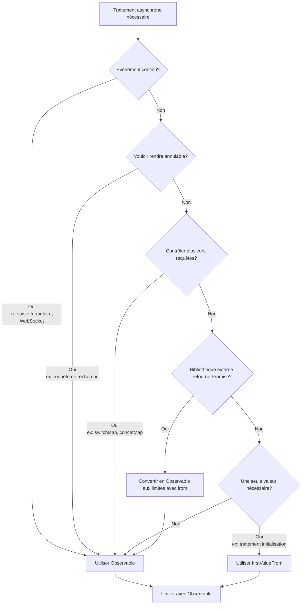

# Anti-pattern de mélange Promise et Observable

Promise et Observable sont tous deux des mécanismes pour gérer le traitement asynchrone, mais **mélanger sans définir clairement les limites de conception provoque divers problèmes**. Cette page explique en détail les anti-patterns dus au mélange et les méthodes d'unification appropriées.

## Pourquoi l'unification est importante

Mélanger Promise et Observable provoque les problèmes suivants.

### 1. Non-annulable

Observable peut interrompre le traitement avec `unsubscribe` / `takeUntil`, mais **Promise ne peut pas être interrompue une fois démarrée**.

```ts
import { interval, Subject } from 'rxjs';
import { takeUntil } from 'rxjs';

const destroy$ = new Subject<void>();

// ✅ Observable: annulable
interval(1000).pipe(
  takeUntil(destroy$)
).subscribe(n => console.log(n));

// Annuler quand l'utilisateur quitte l'écran
destroy$.next();
destroy$.complete();
```

```ts
// ❌ Promise: non-annulable
async function fetchData() {
  const response = await fetch('/api/data');
  // fetch ne s'arrête pas même si l'utilisateur quitte l'écran
  return response.json();
}
```

**Impact :** Requêtes inutiles lors de transitions de route, exécution d'effets de bord non nécessaires

### 2. Difficulté de contrôle de multiples occurrences

Observable peut sérialiser, annuler et prévenir la réentrée de plusieurs requêtes avec `switchMap`/`concatMap`/`exhaustMap`.

```ts
import { fromEvent } from 'rxjs';
import { switchMap, debounceTime } from 'rxjs';

const searchInput = document.getElementById('serch-input')!;

// ✅ Observable: traiter uniquement la dernière requête
fromEvent(searchInput, 'input').pipe(
  debounceTime(300),
  switchMap(event => searchAPI((event.target as HTMLInputElement).value))
  // Les anciennes requêtes sont automatiquement annulées
).subscribe(results => displayResults(results));
function searchAPI(query: string) {
  return fetch(`/api/search?q=${query}`).then(r => r.json());
}

function displayResults(results: unknown) {
  console.log(results);
}
```

Avec Promise, il faut implémenter manuellement ce contrôle, ce qui devient complexe.

### 3. Correspondance à plusieurs événements

Observable est puissant pour **les traitements où les valeurs coulent en continu** comme la saisie de formulaire, WebSocket, événements.

```ts
import { fromEvent } from 'rxjs';
import { map } from 'rxjs';

// ✅ Observable: traiter les événements continus
fromEvent(document, 'mousemove').pipe(
  map(event => ({ x: (event as MouseEvent).clientX, y: (event as MouseEvent).clientY }))
).subscribe(position => {
  console.log('Mouse position:', position);
});
```

Promise est spécialisée pour un traitement "une seule fois" et inadaptée aux événements continus.

### 4. Facilité de test

Observable peut garantir le temps et la concurrence avec des tests marble.

```ts
import { TestScheduler } from 'rxjs/testing';

// ✅ Observable: contrôle du temps possible avec tests marble
// ※ Ce code s'exécute dans un framework de test (Jasmine/Jest)
describe('Observable Test', () => {
  let scheduler: TestScheduler;

  beforeEach(() => {
    scheduler = new TestScheduler((actual, expected) => {
      expect(actual).toEqual(expected); // Utilise expect du framework de test
    });
  });

  it('should emit values over time', () => {
    scheduler.run(({ cold, expectObservable }) => {
      const source$ = cold('a-b-c|');
      expectObservable(source$).toBe('a-b-c|');
    });
  });
});
```

Le code basé sur Promise a tendance à compliquer les tests asynchrones. Voir [Méthodes de test](/fr/guide/testing/unit-tests) pour plus de détails.


## Patterns typiques "problématiques" de mélange (à éviter)

Voici les patterns problématiques fréquemment rencontrés dans les projets réels.

### ❌ Anti-pattern 1: mélange async/await et pipe()

Si on utilise `await` au milieu du traitement Observable ou que Promise et Observable se mélangent, cela devient non-annulable.

```ts
import { ajax } from 'rxjs/ajax';
import { firstValueFrom } from 'rxjs';

// ❌ Mauvais exemple: mélange Observable → Promise → Promise
async function fetchUserData() {
  const user = await firstValueFrom(ajax.getJSON('/api/user'));

  // Après conversion en Promise, devient non-annulable
  return fetch('/api/profile').then(response => response.json());
}
```

```ts
import { of } from 'rxjs';
import { map } from 'rxjs';

// ❌ Mauvais exemple: essayer d'utiliser await dans pipe() (ne fonctionne pas vraiment)
async function processData() {
  return of(1, 2, 3).pipe(
    map(async (value) => {
      const result = await someAsyncOperation(value);
      return result; // Devient Observable<Promise<T>>
    })
  );
}

async function someAsyncOperation(value: number): Promise<number> {
  return value * 2;
}
```

#### Problèmes
- Devient non-annulable
- Canaux d'erreur séparés (vers `unhandledrejection` au lieu de `error`)
- Responsabilités de Promise et Observable deviennent ambiguës
- Le type devient `Observable<Promise<T>>`

### ❌ Anti-pattern 2: utilisation de `toPromise()` (obsolète)

```ts
import { interval } from 'rxjs';

// ❌ Mauvais exemple: toPromise() supprimé dans RxJS v8
interval(1000).toPromise().then(value => {
  console.log(value);
});
```

**Solution :** Utiliser `firstValueFrom` / `lastValueFrom` (expliqué plus loin)

### ❌ Anti-pattern 3: `await` dans `subscribe`

```ts
import { fromEvent } from 'rxjs';

const button = document.getElementById('btn') as HTMLButtonElement;

// ❌ Mauvais exemple
fromEvent(button, 'click').subscribe(async () => {
  const data = await fetch('/api/data').then(r => r.json());
  console.log(data);
  // Flux illisible, gestion d'erreurs difficile
});
```

#### Problèmes
- Flux illisible
- Source de requêtes en double
- Possibilité de fuites mémoire

### ❌ Anti-pattern 4: imbrication de subscribe

```ts
import { ajax } from 'rxjs/ajax';

// ❌ Mauvais exemple
ajax.getJSON('/api/users').subscribe(users => {
  ajax.getJSON('/api/settings').subscribe(settings => {
    console.log(users, settings);
    // Callback hell
  });
});
```

#### Problèmes
- Complexification de la gestion d'erreurs
- Gestion de désinscription difficile

### ❌ Anti-pattern 5: récupération parallèle de mêmes données avec Promise et Observable

```ts
import { ajax } from 'rxjs/ajax';

// ❌ Mauvais exemple
async function loadData() {
  const userPromise = fetch('/api/user').then(r => r.json());
  const user$ = ajax.getJSON('/api/user');

  // Récupère les mêmes données deux fois
}
```

#### Problèmes
- Double exécution
- Compétition d'ordre

### ❌ Anti-pattern 6: retourner Promise dans Observable

Utiliser `async/await` dans le constructeur Observable rend la gestion d'erreurs difficile.

```ts
import { Observable } from 'rxjs';

// ❌ Mauvais exemple: utiliser async function dans Observable
const data$ = new Observable(subscriber => {
  async function fetchData() {
    const response = await fetch('/api/data');
    const data = await response.json();
    subscriber.next(data);
    subscriber.complete();
  }

  fetchData(); // Retourne Promise mais ne peut capturer les erreurs
  // Si fetchData() est rejetée, subscriber.error() n'est pas appelé
});
```

```ts
import { Observable } from 'rxjs';

// ❌ Mauvais exemple: passer Promise à subscriber.next()
const data$ = new Observable(subscriber => {
  const promise = fetch('/api/data').then(r => r.json());
  subscriber.next(promise); // L'objet Promise coule
  subscriber.complete();
});

// Côté souscription reçoit Promise
data$.subscribe(value => {
  console.log(value); // Affiche Promise { <pending> }
});
```

#### Problèmes
- Les erreurs de Promise ne coulent pas dans le canal d'erreur d'Observable
- Peut devenir `unhandledrejection`
- L'objet Promise est passé à subscriber.next()
- Les souscripteurs doivent unwrap la Promise

#### Solution

```ts
import { from, defer } from 'rxjs';

// ✅ Bon exemple: convertir Promise en Observable avec from()
const data$ = from(fetch('/api/data').then(r => r.json()));

// ✅ Bon exemple: évaluation différée avec defer()
const data$ = defer(() => fetch('/api/data').then(r => r.json()));
```


## Guide pratique : conversion propre aux limites

Il est difficile d'éviter complètement le mélange, donc **convertir correctement aux limites de conception** est la meilleure pratique.

### Pattern 1 : Promise → Observable (SDK externes retournant Promise)

Lorsque bibliothèques externes ou code legacy retourne Promise, **convertir en Observable uniquement aux limites**.

```ts
import { from } from 'rxjs';
import { switchMap } from 'rxjs';

// SDK externe retournant Promise
async function externalSDK(): Promise<{ userId: string }> {
  return { userId: '123' };
}

// ✅ Bon exemple: convertir aux limites et unifier ensuite avec Observable
const user$ = from(externalSDK());

user$.pipe(
  switchMap(user => from(fetchProfile(user.userId)))
).subscribe(profile => {
  console.log(profile);
});

async function fetchProfile(userId: string): Promise<{ name: string }> {
  return { name: 'John' };
}
```

### Pattern 2 : Observable → Promise (contexte synchrone "voulant une fois")

Pour traitement d'initialisation ou fonction de garde, **une seule valeur nécessaire**, utiliser `firstValueFrom` / `lastValueFrom`.

```ts
import { ajax } from 'rxjs/ajax';
import { firstValueFrom, shareReplay } from 'rxjs';

// ✅ Bon exemple: mettre en cache si await multiple fois
const config$ = ajax.getJSON('/api/config').pipe(
  shareReplay({ bufferSize: 1, refCount: true })
);

async function initialize() {
  const config = await firstValueFrom(config$);
  console.log('Config loaded:', config);
}

async function validate() {
  const config = await firstValueFrom(config$); // Récupérer du cache
  console.log('Validating with config:', config);
}
```

**⚠️ Attention :** `firstValueFrom` ne récupère **que le premier élément**. **Ne jamais utiliser** pour événements continus (valueChanges, WebSocket, etc.).

```ts
import { interval } from 'rxjs';
import { firstValueFrom } from 'rxjs';

// ❌ Mauvais exemple: firstValueFrom sur flux infini
const value = await firstValueFrom(interval(1000));
// Récupère valeur une fois et termine (comportement non intentionnel)
```

### Pattern 3 : unifier la gestion d'erreurs

Attention à ne pas séparer les canaux de gestion d'erreurs entre Promise et Observable.

```ts
import { from } from 'rxjs';
import { catchError } from 'rxjs';
import { of } from 'rxjs';

async function riskyOperation(): Promise<string> {
  throw new Error('Something went wrong');
}

// ✅ Bon exemple: unifier avec la gestion d'erreurs d'Observable
from(riskyOperation()).pipe(
  catchError(error => {
    console.error('Error caught in Observable pipeline:', error);
    return of('fallback value');
  })
).subscribe(result => {
  console.log(result); // 'fallback value'
});
```


## Exemples courants de remplacement de mélange

### Exemple 1 : conversion Promise intermédiaire → then

#### ❌ Mauvais exemple

```ts
import { ajax } from 'rxjs/ajax';
import { firstValueFrom } from 'rxjs';

async function loadUser() {
  const user = await firstValueFrom(ajax.getJSON('/api/user'));

  // Convertir en Promise puis continuer traitement avec then
  return fetch('/api/profile')
    .then(response => response.json())
    .then(profile => {
      console.log(user, profile);
    });
}
```

#### ✅ Bon exemple A : tout en Observable

```ts
import { ajax } from 'rxjs/ajax';
import { switchMap } from 'rxjs';

// Traiter en restant Observable
ajax.getJSON('/api/user').pipe(
  switchMap(user => ajax.getJSON('/api/profile').pipe(
    // Combiner user et profile
  ))
).subscribe(profile => {
  console.log(profile);
});
```

#### ✅ Bon exemple B : contexte nécessitant await une fois

```ts
import { ajax } from 'rxjs/ajax';
import { shareReplay, firstValueFrom } from 'rxjs';

const user$ = ajax.getJSON('/api/user').pipe(
  shareReplay({ bufferSize: 1, refCount: true })
);

async function loadUserOnce() {
  const user = await firstValueFrom(user$);
  console.log('User loaded once:', user);
}
```


### Exemple 2 : await dans subscribe

#### ❌ Mauvais exemple

```ts
import { fromEvent } from 'rxjs';

const button = document.getElementById('search-btn') as HTMLButtonElement;

fromEvent(button, 'click').subscribe(async () => {
  const results = await fetch('/api/search').then(r => r.json());
  console.log(results);
});
```

#### ✅ Bon exemple

```ts
import { fromEvent, from } from 'rxjs';
import { switchMap } from 'rxjs';

const button = document.getElementById('search-btn') as HTMLButtonElement;

fromEvent(button, 'click').pipe(
  switchMap(() => from(fetch('/api/search').then(r => r.json())))
).subscribe(results => {
  console.log(results);
});
```


## Flowchart de décision (directives faciles à retenir)

Directives lorsque vous hésitez entre Promise et Observable dans le projet.



### Critères de décision concrets

| Condition | Recommandé | Raison |
|---|---|---|
| **Événement continu** (saisie formulaire, WebSocket) | Observable | Promise ne peut retourner qu'une valeur |
| **Vouloir annulable** (requête de recherche) | Observable | Promise non-annulable |
| **Contrôler plusieurs requêtes** (switchMap, concatMap) | Observable | Contrôle difficile avec Promise |
| **Bibliothèque externe retourne Promise** | Convertir avec `from()` | Convertir une fois aux limites |
| **Une seule valeur nécessaire** (traitement initialisation) | `firstValueFrom` | Combiner avec `shareReplay(1)` si besoin |


## Résumé

- **Le mélange en soi n'est pas mauvais**, mais la bonne réponse est de **clarifier les "limites" de conception** et de pencher d'un côté
- **Unifier en se basant sur Observable**, et **convertir avec `firstValueFrom`/`from()`** uniquement aux endroits minimaux nécessaires, évite les problèmes et garantit test, lisibilité et annulabilité
- **Ne jamais convertir en Promise les événements continus (formulaire, WebSocket)**

## Sections connexes

- **[Différences Promise et RxJS](/fr/guide/basics/promise-vs-rxjs)** - Méthodes de conversion de base
- **[Gestion des erreurs](/fr/guide/error-handling/strategies)** - Stratégies de gestion d'erreurs d'Observable
- **[Erreurs courantes et solutions](/fr/guide/anti-patterns/common-mistakes)** - Autres anti-patterns

## Prochaines étapes

1. Identifier dans le code existant où Promise et Observable sont mélangés
2. Clarifier les limites et unifier avec Observable
3. Ajouter `takeUntil` aux endroits nécessitant traitement d'annulation
