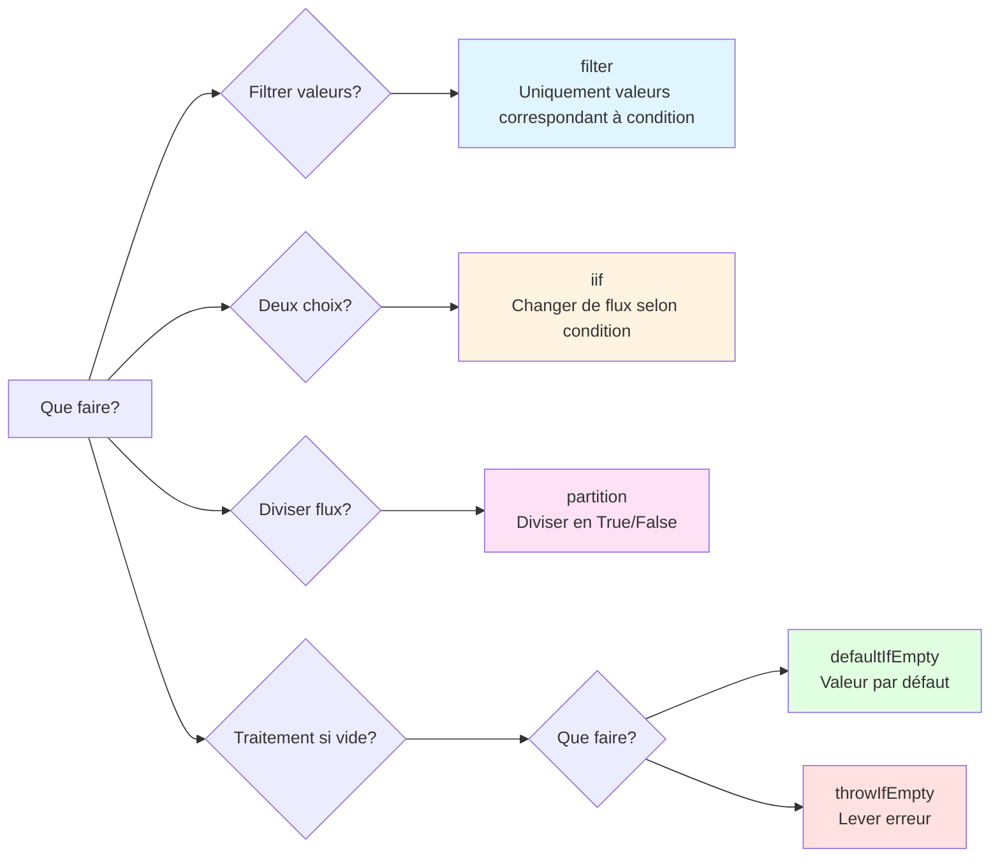

# Enfer d'imbrication if dans subscribe

## Pourquoi c'est un anti-pattern

Les "branchements conditionnels complexes dans subscribe" sont un **anti-pattern clair** dans RxJS. Ils doivent être évités pour les raisons suivantes.

### 1. Contraire à la philosophie de conception de RxJS

RxJS recommande la **programmation déclarative**. Il faut exprimer "quoi faire" dans le pipeline, et non écrire les détails de "comment faire" dans subscribe.

```typescript
// ❌ Anti-pattern: programmation impérative (procédurale)
userService.getUser(id).subscribe(user => {
  if (user.isActive) {
    if (user.role === 'admin') {
      console.log('Admin user');
    }
  }
});

// ✅ Style RxJS: programmation déclarative
userService.getUser(id).pipe(
  filter(user => user.isActive),
  filter(user => user.role === 'admin'),
  tap(user => console.log('Admin user'))
).subscribe();
```

### 2. Problème de même niveau que les autres anti-patterns

Comme les autres anti-patterns traités au Chapitre 10, cela provoque les problèmes suivants :

| Anti-pattern | Problème principal |
|---------------|---------|
| **Fuites mémoire** | Oubli d'unsubscribe |
| **Enfer de subscribe** | Souscriptions imbriquées |
| **Enfer if dans subscribe** ← Cette page | Branchements conditionnels complexes |

### 3. Problèmes concrets

1. **Faible lisibilité** - Imbrication profonde, intention du code peu claire
2. **Tests difficiles** - Trop de branchements conditionnels, explosion des cas de test
3. **Non réutilisable** - Logique enfermée dans subscribe, inutilisable ailleurs
4. **Débogage difficile** - Flux de valeurs difficile à suivre, identification du problème prend du temps
5. **Gestion d'erreurs complexe** - Difficile de tracer où l'erreur s'est produite

### 4. Plages acceptable et à éviter

```typescript
// ✅ Plage acceptable: branchement simple (1-2 instructions if)
subscribe(user => {
  if (user.isAdmin) {
    console.log('Admin user');
  } else {
    console.log('Regular user');
  }
});

// ⚠️ Attention: 2-3 imbrications
subscribe(user => {
  if (user) {
    if (user.isActive) {
      console.log('Active user');
    }
  }
});

// ❌ Anti-pattern: 3 imbrications ou plus
subscribe(user => {
  if (user) {
    if (user.isActive) {
      if (user.role === 'admin') {
        if (user.permissions.includes('write')) {
          // Ceci est clairement un anti-pattern
        }
      }
    }
  }
});
```

> [!IMPORTANT] Critères de jugement
> - **1-2 instructions if** : Plage acceptable (mais les opérateurs sont préférables)
> - **3 imbrications ou plus** : Anti-pattern clair (refactoring nécessaire)
> - **Traitement asynchrone imbriqué** : Refactoring immédiatement nécessaire


## Mauvais patterns courants

### Pattern 1 : branchements conditionnels complexes dans subscribe

```typescript
// ❌ Mauvais exemple: imbrication d'instructions if dans subscribe
userService.getUser(id).subscribe(user => {
  if (user) {
    if (user.isActive) {
      if (user.role === 'admin') {
        // Traitement pour administrateurs
        console.log('Admin user:', user.name);
        adminService.loadAdminData().subscribe(adminData => {
          if (adminData) {
            // Encore plus d'imbrication...
          }
        });
      } else {
        // Traitement pour utilisateurs réguliers
        console.log('Regular user:', user.name);
      }
    } else {
      // Utilisateur inactif
      console.log('Inactive user');
    }
  } else {
    // Utilisateur non trouvé
    console.log('User not found');
  }
});
```

### Problèmes de ce code
1. **Imbrication de 5 niveaux** - Lisibilité considérablement réduite
2. **Subscribe dans subscribe** - Risque de fuites mémoire
3. **Pas de gestion d'erreurs** - Incertain où l'erreur peut se produire
4. **Non testable** - Difficile de tester tous les chemins
5. **Logique non réutilisable** - Inutilisable ailleurs


## Solutions utilisant les opérateurs conditionnels de RxJS

### Solution 1 : branchement conditionnel avec filter

**Quand utiliser ?** : Filtrer les valeurs, exclure les valeurs non nécessaires

```typescript
import { filter, tap, switchMap } from 'rxjs';

// ✅ Bon exemple: séparer les conditions avec filter
userService.getUser(id).pipe(
  filter(user => user !== null),           // Vérification null
  filter(user => user.isActive),           // Vérification actif
  filter(user => user.role === 'admin'),   // Confirmation rôle
  tap(user => console.log('Admin user:', user.name)),
  switchMap(user => adminService.loadAdminData())
).subscribe({
  next: adminData => console.log('Admin data loaded', adminData),
  error: err => console.error('Error:', err)
});
```

> [!NOTE] Avantages
> - ✅ Chaque condition est indépendante (lisible)
> - ✅ Ordre clair dans le pipeline
> - ✅ Gestion d'erreurs centralisée

### Solution 2 : branchement binaire avec iif

**Quand utiliser ?** : Exécuter différents Observables selon condition

```typescript
import { iif, of, switchMap } from 'rxjs';

// ✅ Bon exemple: changer de flux selon condition avec iif
userService.getUser(id).pipe(
  switchMap(user =>
    iif(
      () => user.role === 'admin',
      adminService.loadAdminData(),    // Cas administrateur
      userService.loadUserData()       // Cas utilisateur régulier
    )
  )
).subscribe(data => console.log('Data:', data));
```

> [!NOTE] Avantages
> - ✅ Branchement binaire clair
> - ✅ Chaque traitement est un Observable indépendant
> - ✅ Facile à tester

### Solution 3 : traitement de division avec partition

**Quand utiliser ?** : Diviser flux en deux et traiter séparément

```typescript
import { partition, merge, tap, switchMap, map } from 'rxjs';

// ✅ Bon exemple: diviser flux en deux avec partition
const [activeUsers$, inactiveUsers$] = partition(
  userService.getUsers(),
  user => user.isActive
);

// Traitement utilisateurs actifs
const processedActive$ = activeUsers$.pipe(
  tap(user => console.log('Active:', user.name)),
  switchMap(user => userService.loadProfile(user.id))
);

// Traitement utilisateurs inactifs
const processedInactive$ = inactiveUsers$.pipe(
  tap(user => console.log('Inactive:', user.name)),
  map(user => ({ ...user, status: 'archived' }))
);

// Fusionner les deux flux
merge(processedActive$, processedInactive$).subscribe(
  result => console.log('Processed:', result)
);
```

> [!NOTE] Avantages
> - ✅ Séparation complète actif/inactif
> - ✅ Chacun peut être traité indépendamment
> - ✅ Facile à étendre

### Solution 4 : valeur par défaut avec defaultIfEmpty

**Quand utiliser ?** : Fournir valeur par défaut si vide

```typescript
import { defaultIfEmpty, filter } from 'rxjs';

// ✅ Bon exemple: fournir valeur par défaut si vide
userService.getUser(id).pipe(
  filter(user => user !== null),
  defaultIfEmpty({ id: 0, name: 'Guest', role: 'guest' })
).subscribe(user => {
  console.log('User:', user.name);
});
```

> [!NOTE] Avantages
> - ✅ Vérification null non nécessaire
> - ✅ Valeur par défaut claire
> - ✅ Branchement dans subscribe non nécessaire

### Solution 5 : gestion d'erreurs avec throwIfEmpty

**Quand utiliser ?** : Traiter comme erreur si vide

```typescript
import { throwIfEmpty, catchError, filter } from 'rxjs';
import { of } from 'rxjs';

// ✅ Bon exemple: lever erreur si vide
userService.getUser(id).pipe(
  filter(user => user !== null),
  throwIfEmpty(() => new Error('User not found')),
  catchError(err => {
    console.error('Error:', err.message);
    return of(null);
  })
).subscribe(user => {
  if (user) {
    console.log('User found:', user.name);
  }
});
```

> [!NOTE] Avantages
> - ✅ Traitement d'erreurs clair
> - ✅ Terminé dans le pipeline
> - ✅ Subscribe uniquement pour traitement de succès


## Exemple pratique : refactoring logique conditionnelle complexe

### Before : enfer if dans subscribe

```typescript
// ❌ Mauvais exemple: logique conditionnelle complexe (6 niveaux d'imbrication)
apiService.fetchData().subscribe(data => {
  if (data) {
    if (data.status === 'success') {
      if (data.result) {
        if (data.result.items.length > 0) {
          data.result.items.forEach(item => {
            if (item.isValid) {
              if (item.price > 0) {
                // Traitement...
                console.log('Valid item:', item);
              }
            }
          });
        } else {
          console.log('No items found');
        }
      }
    } else {
      console.log('Request failed');
    }
  }
});
```

> [!WARNING] Problèmes
> - 6 niveaux d'imbrication
> - Encore plus de branchements conditionnels dans forEach
> - Pas de gestion d'erreurs
> - Non testable
> - Traitement de tableau inefficace

### After : structuré avec opérateurs

```typescript
import { filter, map, defaultIfEmpty, switchMap, tap } from 'rxjs';
import { from } from 'rxjs';

// ✅ Bon exemple: organiser conditions avec opérateurs
apiService.fetchData().pipe(
  // 1. Vérification existence données
  filter(data => data !== null),

  // 2. Vérification statut
  filter(data => data.status === 'success'),

  // 3. Vérification existence résultat
  filter(data => data.result !== null),

  // 4. Développer tableau
  map(data => data.result.items),
  defaultIfEmpty([]),  // Défaut si tableau vide

  // 5. Traiter chaque élément individuellement
  switchMap(items => from(items)),

  // 6. Uniquement éléments valides
  filter(item => item.isValid),

  // 7. Vérification prix
  filter(item => item.price > 0),

  // 8. Log de débogage
  tap(item => console.log('Valid item:', item))

).subscribe({
  next: item => console.log('Processing:', item),
  error: err => console.error('Error:', err),
  complete: () => console.log('All items processed')
});
```

> [!TIP] Améliorations
> - ✅ Imbrication 0 (tout aplati)
> - ✅ Chaque condition indépendante et lisible
> - ✅ Gestion d'erreurs ajoutée
> - ✅ Facile à tester (chaque opérateur peut être testé individuellement)
> - ✅ Traitement de tableau efficace (transformé en flux avec from())


## Guide de sélection d'opérateurs conditionnels

Le flowchart suivant permet de déterminer quel opérateur utiliser.



| Condition | Opérateur à utiliser | Raison |
|-----|----------------|------|
| Filtrer valeurs | `filter()` | Passer uniquement valeurs correspondant à condition |
| Choisir parmi deux options | `iif()` | Changer de flux selon condition |
| Diviser flux en deux | `partition()` | Diviser en deux flux par True/False |
| Défaut si vide | `defaultIfEmpty()` | Utiliser valeur par défaut s'il n'y a pas de valeur |
| Erreur si vide | `throwIfEmpty()` | Lever erreur s'il n'y a pas de valeur |
| Plusieurs options (3+) | Opérateur personnalisé | Cas nécessitant 3 branchements ou plus |


## Étapes de refactoring

### Étape 1 : Identifier les conditions
Énumérer toutes les instructions if dans subscribe

```typescript
// Ex: les conditions suivantes existent
if (data)                        // ← Condition 1
if (data.status === 'success')   // ← Condition 2
if (data.result)                 // ← Condition 3
if (item.isValid)                // ← Condition 4
if (item.price > 0)              // ← Condition 5
```

### Étape 2 : Classer les conditions
- **Conditions de filtrage** → `filter()`
- **Branchement binaire** → `iif()`
- **Division de flux** → `partition()`
- **Valeur par défaut** → `defaultIfEmpty()`
- **Condition d'erreur** → `throwIfEmpty()`

### Étape 3 : Convertir en pipeline
Remplacer conditions par opérateurs dans pipe

```typescript
.pipe(
  filter(data => data !== null),              // Condition 1
  filter(data => data.status === 'success'),  // Condition 2
  filter(data => data.result !== null),       // Condition 3
  switchMap(data => from(data.result.items)),
  filter(item => item.isValid),               // Condition 4
  filter(item => item.price > 0)              // Condition 5
)
```

### Étape 4 : Simplifier subscribe
Subscribe uniquement pour effets de bord (logs, manipulation DOM, etc.)

```typescript
.subscribe({
  next: item => console.log('Valid item:', item),
  error: err => console.error('Error:', err),
  complete: () => console.log('Complete')
});
```

### Étape 5 : Écrire tests
Vérifier que chaque opérateur fonctionne comme prévu

```typescript
// Ex: test de filter
it('should filter out null values', () => {
  const source$ = of(null, { id: 1 }, null);
  const result$ = source$.pipe(
    filter(data => data !== null)
  );

  result$.subscribe(data => {
    expect(data).not.toBeNull();
  });
});
```


## Réutilisation avec opérateurs personnalisés

La logique conditionnelle complexe peut être extraite en opérateurs personnalisés pour réutilisation.

```typescript
import { pipe } from 'rxjs';
import { filter } from 'rxjs';

// Opérateur personnalisé: uniquement utilisateurs admin actifs
function filterActiveAdmins<T extends { isActive: boolean; role: string }>() {
  return pipe(
    filter((user: T) => user.isActive),
    filter((user: T) => user.role === 'admin')
  );
}

// Exemple d'utilisation
userService.getUsers().pipe(
  filterActiveAdmins(),
  tap(user => console.log('Active admin:', user.name))
).subscribe();
```

> [!NOTE] Avantages
> - ✅ Réutilisable
> - ✅ Facile à tester
> - ✅ Intention claire par le nom


## Ressources d'apprentissage connexes

Pour comprendre cet anti-pattern, consultez également les sections suivantes.

- **[Chapitre 4: Opérateurs conditionnels](/fr/guide/operators/conditional/)** - Détails de filter, iif, defaultIfEmpty
- **[Chapitre 10: Anti-patterns](/fr/guide/anti-patterns/)** - Autres anti-patterns
- **[Chapitre 11: Mur de compréhension conceptuelle](/fr/guide/overcoming-difficulties/conceptual-understanding)** - Comprendre la programmation déclarative
- **[Chapitre 11: Sélection d'opérateurs](/fr/guide/overcoming-difficulties/operator-selection)** - Comment choisir les bons opérateurs


## Checklist d'évitement d'anti-patterns

Vérifiez votre code.

```markdown
- [ ] Pas 3 instructions if ou plus imbriquées dans subscribe
- [ ] Branchements conditionnels traités par opérateurs dans pipe
- [ ] Subscribe effectue uniquement effets de bord (logs, manipulation DOM)
- [ ] Utilise filter pour exclure valeurs non nécessaires
- [ ] Traitement si vide géré par defaultIfEmpty ou throwIfEmpty
- [ ] Conditions complexes extraites en opérateurs personnalisés
- [ ] Gestion d'erreurs effectuée par catchError
- [ ] Pas d'autres subscribes imbriqués dans subscribe
```

## Prochaines étapes

Après avoir compris cet anti-pattern, apprenez les patterns pratiques dans les pages suivantes.

1. **[Erreurs courantes et solutions](/fr/guide/anti-patterns/common-mistakes)** - Apprendre autres anti-patterns
2. **[Chapitre 11: Surmonter les difficultés](/fr/guide/overcoming-difficulties/)** - Surmonter difficultés spécifiques à RxJS
3. **[Chapitre 13: Patterns pratiques](/fr/guide/)** - Maîtriser patterns d'implémentation corrects (en préparation)

> [!TIP] Point important
> Les branchements conditionnels complexes dans subscribe sont un anti-pattern clair contraire à la philosophie de programmation déclarative de RxJS. Utilisez des opérateurs comme filter, iif, partition pour traiter les conditions dans le pipeline.
