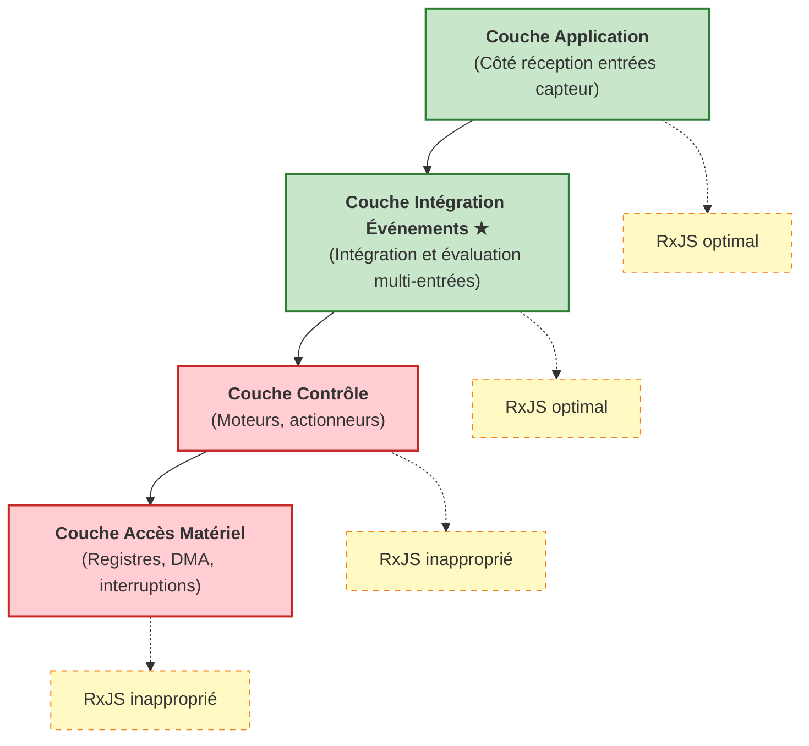

# Embarqué et RP

Dans les systèmes embarqués, comment la programmation réactive, en particulier le traitement de flux asynchrones comme RxJS, peut-elle être utilisée ? Cette page explique les possibilités et contraintes.

## Qu'est-ce que la programmation réactive

La programmation réactive est une **méthode déclarative traitant des flux de données asynchrones sur l'axe temporel**. Les événements et flux de données sont perçus comme des "valeurs changeant dans le temps", et on effectue transformations, combinaisons et filtrages.

Dans la programmation impérative traditionnelle, il faut décrire explicitement "quand" et "comment" traiter, mais dans la programmation réactive, on décrit de manière déclarative "quoi" traiter.

```ts
// Approche impérative traditionnelle
let sensorValue = 0;
setInterval(() => {
  sensorValue = readSensor();
  if (sensorValue > threshold) {
    handleAlert(sensorValue);
  }
}, 100);

// Approche réactive
sensorStream$
  .pipe(
    filter(value => value > threshold)
  )
  .subscribe(value => handleAlert(value));
```

L'approche réactive sépare clairement le flux de données et la logique de traitement, améliorant lisibilité et maintenabilité.

## Défis dans le développement embarqué

La programmation réactive n'est pas largement répandue dans les systèmes embarqués en raison des contraintes suivantes.

### 1. Contraintes de performance

De nombreux systèmes embarqués nécessitent des **réponses de l'ordre de la microseconde**.

```ts
// ❌ Inapproprié pour la couche de contrôle embarquée
motorControl$
  .pipe(
    map(signal => processSignal(signal)),  // Doit se terminer en quelques dizaines de μs
    filter(value => value > threshold)
  )
  .subscribe(value => actuateMotor(value));
```

::: warning Défis
- La chaîne d'opérateurs RxJS a un overhead important
- Possibilité de garbage collection
- Temps de réponse difficile à prédire

:::

### 2. Limitations mémoire

Les systèmes embarqués fonctionnent avec une mémoire limitée (quelques KB à quelques MB).

::: warning Défis
- L'allocation dynamique de mémoire est souvent interdite
- L'état interne d'Observable consomme de la mémoire
- Les opérateurs de buffering (`buffer`, `window`) utilisent particulièrement beaucoup de mémoire

:::

### 3. Niveau d'abstraction élevé

La programmation réactive a un niveau d'abstraction élevé, inapproprié pour le contrôle au niveau matériel.

::: warning Défis
- Inadapté aux opérations de registres et contrôle DMA
- Inapproprié pour les contrôles fins au niveau des bits
- Débogage complexe (traçage difficile des flux asynchrones)

:::

### 4. Compatibilité avec RTOS

Les Real-Time Operating Systems (RTOS) effectuent une planification de tâches basée sur les priorités, mais RxJS est basé sur une boucle d'événements.

::: warning Défis
- Possibilité d'inversion de priorité
- Timing d'exécution des tâches difficile à prédire
- Difficile de garantir le temps réel

:::

## Couche d'application optimale : Couche d'intégration d'événements

Dans les systèmes embarqués, la programmation réactive est la plus efficace dans la **"couche d'intégration d'événements"**.

### Position la plus utile du modèle réactif : Côté "réception" des entrées capteur

Dans les systèmes embarqués, la programmation réactive montre sa vraie valeur du **côté réception (entrées capteur)**.

#### Forces du modèle réactif côté réception (entrées capteur)
- Intégration de données asynchrones de multiples capteurs
- Description déclarative de corrélations sur l'axe temporel
- Expression naturelle de traitement événementiel
- Gestion d'état et filtrage faciles

#### Défis du modèle réactif côté émission (sorties de contrôle)
- Difficile de garantir le temps réel (réponse microseconde nécessaire)
- Overhead inacceptable
- Trop abstrait pour le contrôle direct du matériel

### Caractéristiques et avantages des flux d'entrée capteur

| Caractéristique | Approche impérative traditionnelle | Approche réactive | Avantage |
|------|---------------------|---------------------|------|
| **Intégration multi-capteurs** | Polling par capteur, synchro manuelle | Intégration déclarative avec `combineLatest`, `merge` | Code concis, intention claire |
| **Agrégation fenêtre temporelle** | Gestion manuelle timer et buffer | Automatisation avec `bufferTime`, `windowTime` | Réduction erreurs implémentation, meilleure maintenabilité |
| **Suppression bruit** | Implémentation moyenne mobile avec boucles et tableaux | Description déclarative avec `scan` + `map` | Haute lisibilité, réutilisable |
| **Détection anomalies** | Nidification complexe de flags et conditions | Expression claire avec `pairwise` + `filter` | Logique facile à suivre |
| **Corrélation événements** | Suivi événements avec variables d'état, jugement manuel | Détection patterns avec `merge` + `bufferTime` | Déclaratif, extensible |
| **Désabonnement** | Gestion manuelle flags, fuites faciles | Désabonnement automatique avec `takeUntil` | Prévention fuites mémoire |

### Différences avec le côté contrôle (émission)

Il est important de comprendre les différences de caractéristiques entre "réception" et "émission" dans les systèmes embarqués.

| Point de vue | Côté réception (entrées capteur) | Côté émission (sorties contrôle) |
|------|---------------------|------------------|
| **Temps réel** | Ordre milliseconde (relativement souple) | Ordre microseconde (strict) |
| **Nature du traitement** | Asynchrone, événementiel | Synchrone, exécution périodique |
| **Complexité** | Intégration multi-sources, gestion d'état | Sortie simple, priorité vitesse |
| **Compatibilité RxJS** | ✅ **Optimal** - Fort pour intégration événements | ❌ **Inapproprié** - Overhead important |
| **Traitement principal** | Filtrage, lissage, détection corrélation | Contrôle PWM, pilotage moteur, transfert DMA |

::: tip Spécialisation côté "réception" des entrées capteur
La programmation réactive est la plus efficace lorsqu'il s'agit d'**intégrer et évaluer plusieurs événements asynchrones sur l'axe temporel**. Spécialisez-vous dans le côté "réception" des entrées capteur, pas le côté "émission" comme les sorties de contrôle.
:::

### Stratification de l'architecture système



#### Caractéristiques de la couche d'intégration d'événements
- Intégration d'entrées de multiples capteurs et sources d'événements
- Évaluation de corrélations sur l'axe temporel
- Exigences de temps réel relativement souples (ordre milliseconde)
- Gestion d'état et évaluation conditionnelle au centre

## Exemples d'applications pratiques

### 1. Lissage des valeurs capteur

Lissage des entrées de multiples capteurs et suppression du bruit.

```ts
import { interval, combineLatest } from 'rxjs';
import { map, scan, share } from 'rxjs';

// Simulation de flux de capteurs
const temperatureSensor$ = interval(100).pipe(
  map(() => 25 + Math.random() * 5), // 25-30℃
  share()
);

const humiditySensor$ = interval(100).pipe(
  map(() => 50 + Math.random() * 10), // 50-60%
  share()
);

// Lissage par moyenne mobile
function movingAverage(windowSize: number) {
  return scan<number, number[]>((acc, value) => {
    const newWindow = [...acc, value];
    if (newWindow.length > windowSize) {
      newWindow.shift();
    }
    return newWindow;
  }, []).pipe(
    map(window => window.reduce((sum, val) => sum + val, 0) / window.length)
  );
}

const smoothedTemperature$ = temperatureSensor$.pipe(
  movingAverage(5),
  map(value => Math.round(value * 10) / 10)
);

const smoothedHumidity$ = humiditySensor$.pipe(
  movingAverage(5),
  map(value => Math.round(value * 10) / 10)
);

// Données environnementales intégrées
combineLatest([smoothedTemperature$, smoothedHumidity$])
  .pipe(
    map(([temp, humidity]) => ({
      temperature: temp,
      humidity: humidity,
      heatIndex: calculateHeatIndex(temp, humidity),
      timestamp: Date.now()
    }))
  )
  .subscribe(data => {
    console.log('Données environnement:', data);
  });

function calculateHeatIndex(temp: number, humidity: number): number {
  // Calcul simplifié de température ressentie
  return temp + (0.5555 * (6.11 * Math.exp(5417.753 * ((1/273.16) - (1/(273.15 + temp)))) - 10));
}
```

> [!NOTE] Avantages de l'intégration de capteurs
> - Synchronisation temporelle de valeurs multi-capteurs
> - Suppression bruit par moyenne mobile
> - Dérivation déclarative de valeurs calculées (température ressentie, etc.)

### 2. Détection de corrélation d'événements

Détection lorsque plusieurs événements se produisent dans une fenêtre temporelle spécifique.

```ts
import { Subject, merge } from 'rxjs';
import { filter, bufferTime, map } from 'rxjs';

// Flux d'événements
const motionDetected$ = new Subject<{ sensor: string; timestamp: number }>();
const doorOpened$ = new Subject<{ door: string; timestamp: number }>();
const lightOn$ = new Subject<{ room: string; timestamp: number }>();

// Intégration de tous les événements
const allEvents$ = merge(
  motionDetected$.pipe(map(e => ({ type: 'motion', ...e }))),
  doorOpened$.pipe(map(e => ({ type: 'door', ...e }))),
  lightOn$.pipe(map(e => ({ type: 'light', ...e })))
);

// Agrégation d'événements dans fenêtre d'1 seconde
allEvents$
  .pipe(
    bufferTime(1000),
    filter(events => events.length > 0),
    map(events => {
      const hasMotion = events.some(e => e.type === 'motion');
      const hasDoor = events.some(e => e.type === 'door');
      const hasLight = events.some(e => e.type === 'light');

      return {
        timestamp: Date.now(),
        events,
        pattern: {
          hasMotion,
          hasDoor,
          hasLight
        }
      };
    }),
    filter(result =>
      // Détection pattern entrée personne
      result.pattern.hasMotion && result.pattern.hasDoor
    )
  )
  .subscribe(result => {
    console.log('Détection entrée:', result);
    // Allumage auto si lumière éteinte
    if (!result.pattern.hasLight) {
      console.log('→ Allumage automatique lumière');
    }
  });

// Simulation déclenchement événements
setTimeout(() => motionDetected$.next({ sensor: 'entry', timestamp: Date.now() }), 100);
setTimeout(() => doorOpened$.next({ door: 'front', timestamp: Date.now() }), 200);
```

> [!TIP] Utilisation de corrélation d'événements
> - Estimation de situation à partir d'événements multiples dans fenêtre temporelle
> - Détection d'anomalies dans systèmes de sécurité
> - Logique d'automatisation maison intelligente

### 3. Détection d'anomalies

Détection de patterns anormaux dans les valeurs de capteurs.

```ts
import { interval } from 'rxjs';
import { map, pairwise, filter, share } from 'rxjs';

// Simulation capteur de vibration
const vibrationSensor$ = interval(50).pipe(
  map(() => {
    // Normal 0-10, anomalie 50+
    const normal = Math.random() * 10;
    const isAbnormal = Math.random() < 0.05; // 5% probabilité anomalie
    return isAbnormal ? 50 + Math.random() * 20 : normal;
  }),
  share()
);

// Logique détection anomalie
vibrationSensor$
  .pipe(
    pairwise(), // Paire de 2 valeurs consécutives
    map(([prev, current]) => ({
      prev,
      current,
      delta: Math.abs(current - prev),
      timestamp: Date.now()
    })),
    filter(data =>
      // Dépassement seuil ou changement brutal
      data.current > 30 || data.delta > 20
    )
  )
  .subscribe(data => {
    console.log('⚠️ Anomalie détectée:', {
      'Valeur actuelle': data.current.toFixed(2),
      'Variation': data.delta.toFixed(2),
      'Heure': new Date(data.timestamp).toISOString()
    });
  });
```

> [!WARNING] Points d'attention détection anomalies
> - Ajustement des seuils important (dépend environnement et équipement)
> - Filtrage nécessaire pour réduire faux positifs
> - Astuces efficaces comme alerter uniquement après N anomalies consécutives

### 4. Estimation d'état

Estimation de l'état d'un équipement à partir de valeurs de multiples capteurs.

```ts
import { combineLatest, interval } from 'rxjs';
import { map, distinctUntilChanged, share } from 'rxjs';

// Flux de capteurs
const current$ = interval(100).pipe(
  map(() => 1.5 + Math.random() * 0.5), // Courant 1.5-2.0A
  share()
);

const temperature$ = interval(100).pipe(
  map(() => 40 + Math.random() * 10), // Température 40-50℃
  share()
);

const vibration$ = interval(100).pipe(
  map(() => 5 + Math.random() * 5), // Vibration 5-10
  share()
);

// Définition des états
type MachineState = 'idle' | 'running' | 'overload' | 'warning';

interface MachineStatus {
  state: MachineState;
  current: number;
  temperature: number;
  vibration: number;
  timestamp: number;
}

// Logique d'estimation d'état
combineLatest([current$, temperature$, vibration$])
  .pipe(
    map(([current, temperature, vibration]): MachineStatus => {
      let state: MachineState = 'idle';

      // Logique de jugement d'état
      if (current > 1.8 && temperature > 45 && vibration > 8) {
        state = 'overload';
      } else if (temperature > 48 || vibration > 9) {
        state = 'warning';
      } else if (current > 1.6) {
        state = 'running';
      }

      return {
        state,
        current: Math.round(current * 100) / 100,
        temperature: Math.round(temperature * 10) / 10,
        vibration: Math.round(vibration * 10) / 10,
        timestamp: Date.now()
      };
    }),
    distinctUntilChanged((prev, curr) => prev.state === curr.state) // Notifier uniquement en cas de changement d'état
  )
  .subscribe(status => {
    console.log(`État équipement: ${status.state}`, {
      'Courant': `${status.current}A`,
      'Température': `${status.temperature}℃`,
      'Vibration': status.vibration
    });

    // Traitement selon l'état
    switch (status.state) {
      case 'overload':
        console.log('🔴 Surcharge détectée - Arrêt équipement');
        break;
      case 'warning':
        console.log('🟡 Avertissement - Renforcement surveillance');
        break;
    }
  });
```

> [!IMPORTANT] Points clés de l'estimation d'état
> - Jugement d'état en combinant valeurs multi-capteurs
> - Traitement uniquement lors de changement d'état avec `distinctUntilChanged`
> - Commencer par règles simples basées seuils, intégrer apprentissage machine si nécessaire

## Meilleures pratiques

### 1. Sélection de la couche d'application

```ts
// ✅ Bon exemple : Utilisation dans couche intégration événements
const userActivity$ = merge(
  buttonClick$,
  sensorInput$,
  timerEvent$
).pipe(
  debounceTime(100),
  map(event => processEvent(event))
);

// ❌ Mauvais exemple : Utilisation dans couche contrôle
const motorControl$ = interval(10).pipe(  // 10ms trop lent pour couche contrôle
  map(() => readEncoder()),
  map(value => calculatePID(value))
);
```

### 2. Gestion mémoire

```ts
// ✅ Désabonnement assuré
import { Subject } from 'rxjs';
import { takeUntil } from 'rxjs';

class SensorManager {
  private destroy$ = new Subject<void>();

  start() {
    sensorStream$
      .pipe(
        takeUntil(this.destroy$)
      )
      .subscribe(data => this.process(data));
  }

  stop() {
    this.destroy$.next();
    this.destroy$.complete();
  }

  private process(data: any) {
    // Traitement
  }
}
```

### 3. Limitation de taille de buffer

```ts
// ✅ Limitation explicite de taille de buffer
import { bufferTime } from 'rxjs';

sensorStream$
  .pipe(
    bufferTime(1000, null, 100) // Maximum 100 éléments
  )
  .subscribe(batch => processBatch(batch));

// ❌ Éviter buffer illimité
sensorStream$
  .pipe(
    bufferTime(10000) // Buffer 10s → Risque manque mémoire
  )
  .subscribe(batch => processBatch(batch));
```

### 4. Gestion d'erreurs

```ts
import { catchError, retry } from 'rxjs';
import { of } from 'rxjs';

sensorStream$
  .pipe(
    retry({ count: 3, delay: 1000 }),
    catchError(error => {
      console.error('Erreur capteur:', error);
      // Retourner valeur par défaut ou traitement fallback
      return of({ value: 0, error: true });
    })
  )
  .subscribe(data => {
    if (data.error) {
      handleSensorFailure();
    } else {
      processNormalData(data);
    }
  });
```

## Résumé

Points d'utilisation de la programmation réactive dans le développement embarqué

### Domaines applicables
- ✅ **Couche intégration événements** - Intégration entrées capteurs, détection corrélation événements
- ✅ **Couche application** - Estimation d'état, détection anomalies, visualisation données
- ❌ **Couche contrôle** - Contrôle moteurs, actionneurs (temps réel requis)
- ❌ **Couche accès matériel** - Opérations registres, DMA, traitement interruptions

### Exemples d'applications efficaces
- ✅ Lissage et intégration valeurs capteurs
- ✅ Détection corrélation événements sur axe temporel
- ✅ Détection de patterns anormaux
- ✅ Estimation d'état à partir multi-capteurs

### Points d'attention
- ⚠️ Surveillance et limitation utilisation mémoire
- ⚠️ Exécution assurée du désabonnement
- ⚠️ Limitation explicite de taille de buffer
- ⚠️ Gestion d'erreurs appropriée

La programmation réactive n'est pas applicable à "toutes les couches" des systèmes embarqués, mais est très efficace dans la **couche d'intégration événements**. Une utilisation dans les bonnes couches peut considérablement améliorer lisibilité et maintenabilité du code.

## Perspectives futures : Le réactif deviendra inévitable même dans l'embarqué

Les systèmes embarqués continuent d'évoluer, et l'importance de la programmation réactive devrait encore augmenter à l'avenir.

### Explosion du nombre de capteurs

Dans les systèmes embarqués modernes, en particulier les appareils IoT et systèmes intelligents, le nombre de capteurs traités augmente rapidement.

#### Complexification de l'intégration de capteurs
- Automobile : Dizaines à centaines de capteurs (ADAS, conduite autonome)
- Maison intelligente : Nombreux capteurs température, humidité, présence, porte, fenêtre, caméra
- Équipements industriels : Surveillance composite vibration, température, courant, pression, position
- Appareils portables : Rythme cardiaque, accélération, gyroscope, GPS, pression atmosphérique

#### Limites de l'approche impérative traditionnelle
```ts
// ❌ Intégration impérative de 10+ capteurs devient chaotique
let temp1, temp2, temp3, humidity1, humidity2, motion1, motion2;
let lastUpdate1, lastUpdate2, lastUpdate3;
// ... variables infinies

setInterval(() => {
  temp1 = readSensor1();
  temp2 = readSensor2();
  // ... code de polling devient énorme

  if (temp1 > threshold1 && humidity1 > threshold2 && ...) {
    // ... branchements conditionnels se complexifient
  }
}, 100);
```

#### Nécessité de l'approche réactive
```ts
// ✅ Description déclarative même avec augmentation des capteurs
const allSensors$ = combineLatest({
  temp1: temperatureSensor1$,
  temp2: temperatureSensor2$,
  temp3: temperatureSensor3$,
  humidity1: humiditySensor1$,
  humidity2: humiditySensor2$,
  motion1: motionSensor1$,
  motion2: motionSensor2$,
  // Ajout simple de lignes pour nouveaux capteurs
});

allSensors$
  .pipe(
    map(sensors => evaluateConditions(sensors)),
    filter(result => result.shouldAlert)
  )
  .subscribe(result => handleAlert(result));
```

### Montée de l'edge computing

Réduction de la dépendance au cloud et importance croissante du traitement des données sur appareils edge.

#### Exigences à l'edge
- Traitement données temps réel de multiples capteurs
- Détection d'anomalies et reconnaissance de patterns localement
- Exécution de modèles d'apprentissage machine légers
- Fonctionnement autonome lors de pannes réseau

Ces exigences s'accordent bien avec le **traitement de flux asynchrones**, faisant de la programmation réactive un choix naturel.

### Évolution du matériel

L'amélioration des performances des processeurs embarqués rend l'overhead de la programmation réactive acceptable.

| Époque | Performance processeur | Mémoire | Applicabilité réactive |
|------|-------------|--------|-------------------|
| Années 2000 | Quelques MHz, 8bit | Quelques KB | ❌ Difficile - Overhead important |
| Années 2010 | Dizaines~centaines MHz, 32bit | Dizaines KB~MB | △ Limité - Couche événements uniquement |
| 2020+ | Niveau GHz, 64bit, multi-cœurs | Centaines MB~GB | ✅ **Pratique** - Applicable à nombreuses couches |

#### Exemples de processeurs embarqués modernes
- Raspberry Pi 4: 1.5GHz quad-core, jusqu'à 8GB RAM
- ESP32: 240MHz dual-core, 520KB SRAM
- STM32H7: 480MHz, 1MB RAM

Avec ce matériel, l'overhead de RxJS est largement acceptable.

### Nécessité de la programmation réactive

Pour les raisons suivantes, la programmation réactive devient **une nécessité, pas un choix** même dans les systèmes embarqués.

::: info Raisons pour lesquelles la programmation réactive devient inévitable

1. **Augmentation du nombre de capteurs** - Limites de la gestion impérative de dizaines~centaines de capteurs
2. **Importance de la détection de corrélation temporelle** - Reconnaissance de patterns d'événements indispensable
3. **Montée de l'IA edge** - Optimal pour prétraitement de données capteurs
4. **Maintenabilité du code** - Nécessité de description déclarative pour systèmes complexes
5. **Évolution du matériel** - Overhead devenu acceptable

:::

### Stratégie de migration pratique

Stratégie lors de l'introduction de programmation réactive dans systèmes embarqués existants

#### Introduction progressive
1. **Phase 1** : Test d'introduction du réactif dans nouvelles fonctionnalités (couche intégration capteurs)
2. **Phase 2** : Remplacement de la partie traitement événements par du réactif
3. **Phase 3** : Réactivité de toute la couche application
4. **Maintien de l'approche traditionnelle pour la couche contrôle** - Ne pas changer les parties nécessitant temps réel

**Approche hybride :**
```ts
// Couche contrôle : Impératif traditionnel (réponse microseconde)
function controlMotor(speed: number) {
  // Opération directe registres, traitement rapide
  writeRegister(MOTOR_CONTROL_REG, speed);
}

// Couche intégration événements : Réactif (réponse milliseconde)
const motorSpeedCommand$ = combineLatest([
  targetSpeed$,
  currentLoad$,
  temperatureLimit$
]).pipe(
  map(([target, load, tempLimit]) => calculateOptimalSpeed(target, load, tempLimit))
);

motorSpeedCommand$.subscribe(speed => {
  // Passer la valeur décidée par le réactif à la fonction de contrôle traditionnelle
  controlMotor(speed);
});
```

Ainsi, en combinant correctement **programmation réactive (côté réception)** et **contrôle impératif traditionnel (côté émission)**, on peut tirer parti des avantages des deux.

## Pages connexes

- [Introduction à RxJS](/fr/guide/introduction) - Concepts de base de RxJS
- [Méthodes de création d'Observable](/fr/guide/observables/creation) - Création de flux de capteurs
- [Opérateurs de combinaison](/fr/guide/operators/combination/) - Détails de combineLatest, merge
- [Opérateurs de filtrage](/fr/guide/operators/filtering/) - Utilisation de filter, debounceTime
- [Gestion des erreurs](/fr/guide/error-handling/strategies) - Traitement des erreurs de capteurs
- [Débogage de performance](/fr/guide/debugging/performance) - Surveillance de l'utilisation mémoire

## Références

- [GitHub Discussions - Développement embarqué et programmation réactive](https://github.com/shuji-bonji/RxJS-with-TypeScript/discussions/13)
- [Documentation officielle RxJS](https://rxjs.dev/)
