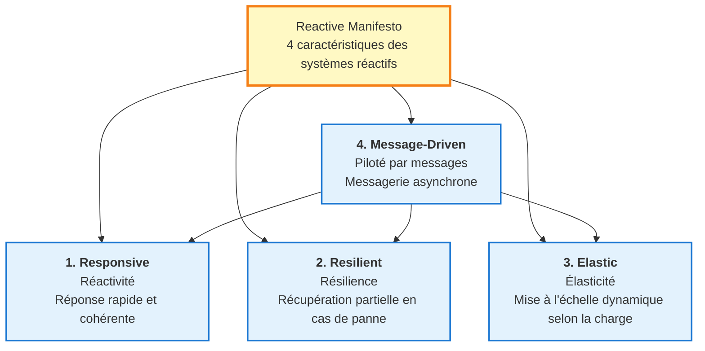
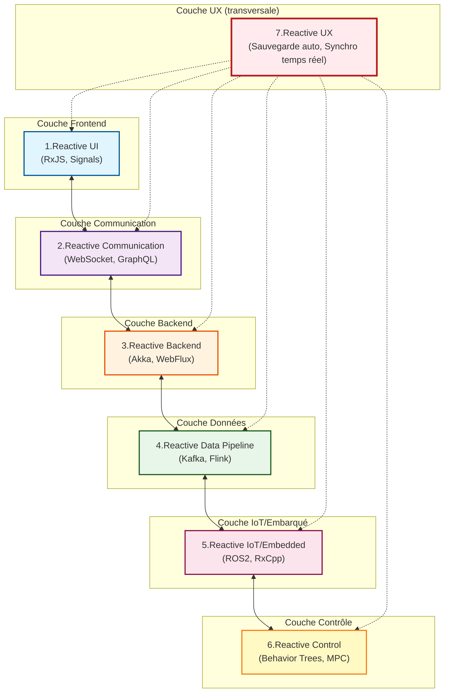
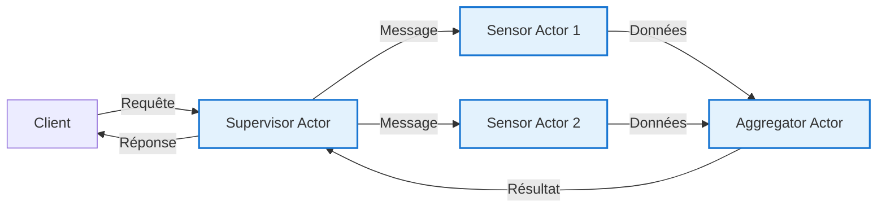
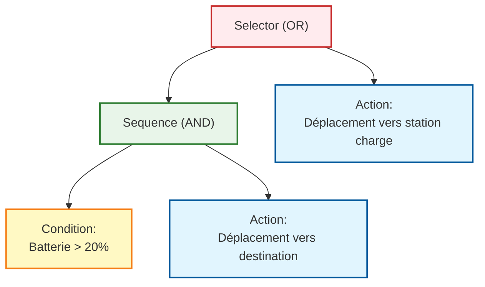
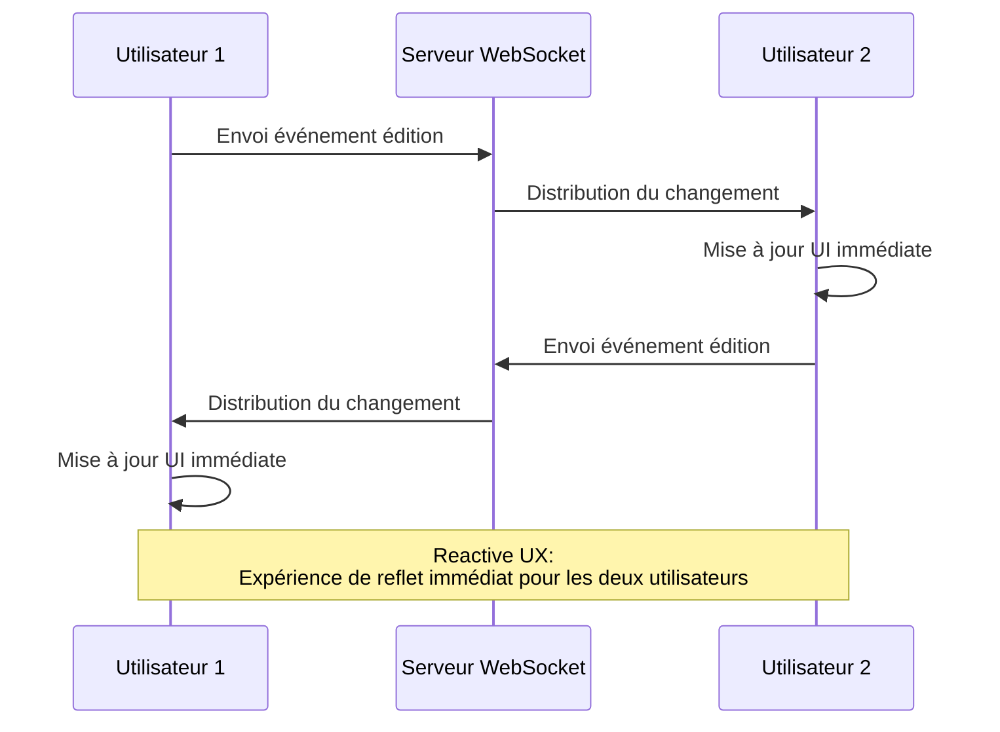

# Carte complète de l'architecture réactive

La programmation réactive a évolué au-delà du cadre des bibliothèques et frameworks pour devenir une **philosophie architecturale de systèmes entiers**.

Cette page explique systématiquement **la vue d'ensemble de l'architecture réactive** à travers 7 couches, de l'UI au backend, pipelines de données, IoT et systèmes de contrôle.

## Qu'est-ce que l'architecture réactive

L'architecture réactive est une approche de conception de systèmes centrée sur les **valeurs variant dans le temps (Time-Varying Values)**.

#### Philosophie centrale
> Du clic UI aux capteurs IoT, flux de données et contrôle robotique, tout est une question de **réaction aux valeurs qui changent dans le temps**

Pour réaliser cette philosophie, le [Reactive Manifesto](https://www.reactivemanifesto.org/) définit 4 caractéristiques importantes.

## Les 4 caractéristiques du Reactive Manifesto

Le Reactive Manifesto définit 4 caractéristiques que les systèmes réactifs doivent posséder.



### 1. Responsive (Réactivité)

Le système réagit **rapidement et de manière cohérente** aux entrées utilisateur et aux changements d'environnement.

::: tip Exemples concrets
- Retour immédiat aux opérations UI
- Prévisibilité du temps de réponse API
- Mises à jour de données en temps réel
:::

### 2. Resilient (Résilience)

Même en cas de panne, **récupération partielle** sans arrêt complet du système.

::: tip Exemples concrets
- Gestion d'erreurs et fallback
- Isolation des services (microservices)
- Retry automatique et circuit breaker
:::

### 3. Elastic (Élasticité)

**Ajustement dynamique des ressources** selon la charge, avec mise à l'échelle efficace.

::: tip Exemples concrets
- Auto-scaling
- Équilibrage de charge
- Contrôle de backpressure
:::

### 4. Message-Driven (Piloté par messages)

Communication entre composants via **messages asynchrones**, réalisant un couplage faible.

::: tip Exemples concrets
- Bus d'événements
- Files de messages (Kafka, RabbitMQ)
- Pattern Observable/Subscriber
:::

::: info Importance du Reactive Manifesto
Ces 4 caractéristiques constituent la **base théorique** de l'architecture réactive. RxJS et ReactiveX ne sont que des outils pour réaliser ces caractéristiques.
:::

## Les 7 couches de l'architecture réactive

L'architecture réactive est composée de 7 couches suivantes.

| # | Couche | Aperçu | Technologies représentatives |
|---|---|------|------------|
| 1 | **Reactive UI** | UI réagissant immédiatement aux entrées utilisateur | RxJS, Angular Signals, Svelte Runes, React Hooks |
| 2 | **Reactive Communication** | Communication en streaming client/serveur | WebSocket, SSE, GraphQL Subscriptions |
| 3 | **Reactive Backend** | Serveur événementiel et non-bloquant | Akka, Spring WebFlux, Vert.x, Node.js Streams |
| 4 | **Reactive Data Pipeline** | Flux d'événements comme modèle de données de première classe | Kafka, Flink, Apache Beam, Reactor |
| 5 | **Reactive IoT/Embedded** | Intégration et fusion de flux de capteurs | ROS2, RxCpp, RxRust, Zephyr |
| 6 | **Reactive Control** | Boucle de rétroaction capteur→contrôle | Behavior Trees, Digital Twin, MPC |
| 7 | **Reactive UX** | UX en boucle fermée à travers toutes les couches | Sauvegarde auto, édition collaborative temps réel |

### Schéma architectural global



## 1. Reactive UI (Frontend)

Couche qui **met à jour l'écran en temps réel** en réponse aux entrées utilisateur et opérations asynchrones.

### Concept central

> L'UI est une "projection de l'état qui change dans le temps"

### Pile technologique représentative

- **RxJS** - Traitement de flux via Observable/Operator
- **Angular Signals** - Primitives réactives d'Angular 19+
- **Svelte Runes** - $state, $derived de Svelte 5
- **React Hooks** - Gestion d'état via useState, useEffect
- **Vue Reactivity** - Réactivité via ref, reactive, computed
- **SolidJS** - Réactivité fine basée sur Signals

### Exemple d'implémentation (RxJS)

```typescript
import { fromEvent } from 'rxjs';
import { debounceTime, distinctUntilChanged, map } from 'rxjs';

// UI réactive pour boîte de recherche
const searchInput = document.querySelector<HTMLInputElement>('#search');
const resultsDiv = document.querySelector<HTMLDivElement>('#results');

const input$ = fromEvent(searchInput!, 'input').pipe(
  map(event => (event.target as HTMLInputElement).value),
  debounceTime(300),                    // Attendre 300ms (fin de saisie)
  distinctUntilChanged()                // Ignorer si même valeur
);

input$.subscribe(async searchTerm => {
  if (searchTerm.length === 0) {
    resultsDiv!.innerHTML = '';
    return;
  }

  // Appel API
  const results = await fetch(`/api/search?q=${encodeURIComponent(searchTerm)}`)
    .then(res => res.json());

  // Mise à jour UI immédiate
  resultsDiv!.innerHTML = results
    .map((r: any) => `<div class="result">${r.title}</div>`)
    .join('');
});
```

::: tip Avantages du Reactive UI
- Réduction des appels API inutiles via debounce/throttle
- Meilleure lisibilité avec description déclarative
- Intégration facile de multiples traitements asynchrones
:::

## 2. Reactive Communication (Couche Communication)

Couche réalisant le **streaming de données bidirectionnel** entre client/serveur.

### Pile technologique représentative

- **WebSocket** - Protocole de communication full-duplex
- **Server-Sent Events (SSE)** - Flux unidirectionnel serveur vers client
- **GraphQL Subscriptions** - Fonction d'abonnement temps réel GraphQL
- **tRPC** - Framework RPC type-safe
- **RxDB** - Base de données réactive (support hors ligne)

### Exemple d'implémentation (WebSocket + RxJS)

```typescript
import { webSocket } from 'rxjs/webSocket';
import { retry, catchError } from 'rxjs';
import { of } from 'rxjs';

// Traiter WebSocket comme Observable
const socket$ = webSocket<{ type: string; data: any }>({
  url: 'wss://example.com/socket',
  openObserver: {
    next: () => console.log('✅ Connexion WebSocket réussie')
  },
  closeObserver: {
    next: () => console.log('❌ Déconnexion WebSocket')
  }
});

// Réception de données temps réel
socket$
  .pipe(
    retry({ count: 3, delay: 1000 }),  // Reconnexion auto
    catchError(error => {
      console.error('Erreur WebSocket:', error);
      return of({ type: 'error', data: error });
    })
  )
  .subscribe(message => {
    switch (message.type) {
      case 'stock_price':
        updateStockChart(message.data);
        break;
      case 'notification':
        showNotification(message.data);
        break;
      // ... autres types de messages
    }
  });

// Envoi message au serveur
socket$.next({ type: 'subscribe', data: { symbol: 'AAPL' } });
```

::: info Affinité WebSocket et Observable
L'événement `onmessage` de WebSocket est le pattern Observable lui-même. La fonction webSocket de RxJS abstrait cela, facilitant retry et gestion d'erreurs.
:::

## 3. Reactive Backend (Backend)

Couche réalisant une architecture serveur scalable avec **I/O événementielle et non-bloquante**.

### Pile technologique représentative

- **Akka (Scala/Java)** - Framework basé sur modèle Actor
- **Vert.x (JVM)** - Toolkit réactif polyglotte
- **Spring WebFlux (Java)** - Framework Web non-bloquant basé sur Project Reactor
- **Node.js Streams** - Traitement I/O basé sur flux
- **Elixir/Phoenix LiveView** - Framework temps réel sur BEAM VM

### Concept du modèle Actor

Le modèle Actor combine **isolation** et **passage de messages asynchrone** pour le traitement concurrent.



### Exemple d'implémentation (Akka - Scala)

```scala
import akka.actor.{Actor, ActorRef, Props}

// Sensor Actor
class SensorActor extends Actor {
  def receive: Receive = {
    case SensorData(value) =>
      // Traitement des données
      val processed = transform(value)
      // Envoi à l'Actor parent
      context.parent ! ProcessedData(processed)

    case ErrorOccurred(error) =>
      // Gestion d'erreur
      context.parent ! FailureReport(error)
  }

  private def transform(value: Double): Double = {
    // Logique de transformation de données
    value * 2.0
  }
}

// Supervisor Actor
class SupervisorActor extends Actor {
  val sensor1: ActorRef = context.actorOf(Props[SensorActor], "sensor1")
  val sensor2: ActorRef = context.actorOf(Props[SensorActor], "sensor2")

  def receive: Receive = {
    case StartMonitoring =>
      sensor1 ! SensorData(10.5)
      sensor2 ! SensorData(20.3)

    case ProcessedData(value) =>
      println(s"Données reçues: $value")
      // Traitement d'agrégation, etc.
  }
}

// Définition des messages
case class SensorData(value: Double)
case class ProcessedData(value: Double)
case object StartMonitoring
case class ErrorOccurred(error: Throwable)
case class FailureReport(error: Throwable)
```

::: tip Avantages du modèle Actor
- **Isolation des pannes** - L'échec d'un Actor n'affecte pas les autres
- **Scalabilité** - Les Actors sont légers, peuvent être lancés par millions
- **Piloté par messages** - Conforme aux principes du Reactive Manifesto
:::

## 4. Reactive Data Pipeline (Pipeline de données)

Couche traitant les **flux d'événements comme modèle de données de première classe**.

### Concept central

> "Event Stream is the new Database" (Le flux d'événements est la nouvelle base de données)

Changement de paradigme d'une architecture centrée base de données traditionnelle vers une **architecture centrée flux d'événements**.

### Pile technologique représentative

- **Apache Kafka** - Plateforme de streaming d'événements distribuée
- **Apache Flink** - Moteur de traitement de flux
- **Apache Beam** - Modèle unifié de traitement batch/stream
- **Apache NiFi** - Automatisation de flux de données
- **Project Reactor** - Bibliothèque réactive sur JVM
- **Reactive Streams API** - Standard de traitement de flux JVM

### Pattern de pipeline de données

```
Event Source → Parse → Validate → Enrich → Aggregate → Store/Forward
```

### Exemple d'implémentation (pseudo-code)

```typescript
// Pipeline de flux type Kafka + Flink
stream
  .map(event => parseJSON(event))           // Parse
  .filter(data => isValid(data))            // Validation
  .map(data => enrichWithMetadata(data))    // Ajout métadonnées
  .groupBy(data => data.sensorId)           // Groupement par ID capteur
  .window(10.seconds)                       // Fenêtre de 10 secondes
  .reduce((acc, value) => aggregate(acc, value))  // Agrégation
  .sink(database)                           // Sauvegarde en base
```

### Expression correspondante en RxJS

```typescript
import { interval } from 'rxjs';
import { map, filter, groupBy, bufferTime, mergeMap } from 'rxjs';

interface SensorEvent {
  sensorId: string;
  value: number;
  timestamp: number;
}

// Simulation de flux d'événements
const eventStream$ = interval(100).pipe(
  map((): SensorEvent => ({
    sensorId: `sensor-${Math.floor(Math.random() * 3)}`,
    value: Math.random() * 100,
    timestamp: Date.now()
  }))
);

// Pipeline de données
eventStream$
  .pipe(
    // Validation
    filter(event => event.value >= 0 && event.value <= 100),

    // Groupement par ID capteur
    groupBy(event => event.sensorId),

    // Tampon de 10 secondes par groupe
    mergeMap(group$ =>
      group$.pipe(
        bufferTime(10000),
        filter(events => events.length > 0),
        map(events => ({
          sensorId: events[0].sensorId,
          avgValue: events.reduce((sum, e) => sum + e.value, 0) / events.length,
          count: events.length,
          timestamp: Date.now()
        }))
      )
    )
  )
  .subscribe(aggregated => {
    console.log('Données agrégées:', aggregated);
    // Sauvegarde en base
    saveToDatabase(aggregated);
  });

function saveToDatabase(data: any): void {
  // Logique de sauvegarde en base
}
```

::: warning Lien avec Event Sourcing
Event Sourcing est un pattern de conception enregistrant l'état du système comme historique d'événements. Combiné avec des plateformes de streaming d'événements comme Kafka, il permet de construire de puissants pipelines de données réactifs.
:::

## 5. Reactive IoT/Embedded (IoT et Embarqué)

Couche réalisant l'intégration et la fusion temps réel de flux de capteurs.

### Pile technologique représentative

- **ROS2 (Robot Operating System 2)** - Plateforme de développement robotique
- **RxCpp** - ReactiveX version C++
- **RxRust** - ReactiveX version Rust
- **Zephyr RTOS** - OS temps réel pour IoT
- **TinyOS** - OS pour réseaux de capteurs

### Différences avec l'UI

| Point de vue | Reactive UI | Reactive IoT |
|------|------------|--------------|
| **Objet de réactivité** | Entrée utilisateur, réponse API | Valeurs capteurs, signaux de contrôle |
| **Temps réel** | Ordre de la milliseconde (focus UX) | Ordre de la microseconde (focus contrôle) |
| **Traitement principal** | Affichage, validation | Filtrage, fusion, contrôle |

### Exemple d'implémentation (ROS2 - Python)

```python
import rclpy
from rclpy.node import Node
from sensor_msgs.msg import LaserScan
from geometry_msgs.msg import Twist

class ObstacleAvoidance(Node):
    def __init__(self):
        super().__init__('obstacle_avoidance')

        # Abonnement aux données du capteur LiDAR
        self.subscription = self.create_subscription(
            LaserScan,
            '/scan',
            self.laser_callback,
            10
        )

        # Publication des commandes de vitesse
        self.velocity_publisher = self.create_publisher(
            Twist,
            '/cmd_vel',
            10
        )

    def laser_callback(self, msg: LaserScan):
        # Traitement des données capteur (réactif)
        min_distance = min(msg.ranges)

        # Réaction à la détection d'obstacle
        if min_distance < 0.5:  # Obstacle dans les 50cm
            self.get_logger().warn(f'⚠️ Obstacle détecté: {min_distance:.2f}m')
            self.stop_robot()
        else:
            self.move_forward()

    def stop_robot(self):
        twist = Twist()
        twist.linear.x = 0.0
        twist.angular.z = 0.0
        self.velocity_publisher.publish(twist)

    def move_forward(self):
        twist = Twist()
        twist.linear.x = 0.3  # Avance à 0.3 m/s
        twist.angular.z = 0.0
        self.velocity_publisher.publish(twist)

def main(args=None):
    rclpy.init(args=args)
    node = ObstacleAvoidance()
    rclpy.spin(node)
    rclpy.shutdown()

if __name__ == '__main__':
    main()
```

::: info Fusion de capteurs et réactivité
La "fusion de capteurs" intégrant des données de multiples capteurs (LiDAR, caméra, IMU, GPS) est le même concept que `combineLatest` et `merge` de RxJS.
:::

## 6. Reactive Control (Systèmes de contrôle)

Couche réalisant une boucle de rétroaction du capteur au contrôle.

### Pile technologique représentative

- **Behavior Trees** - Sélection de comportement pour robotique/IA de jeu
- **Digital Twin** - Réplique numérique de système physique
- **Model Predictive Control (MPC)** - Contrôle prédictif
- **Cyber-Physical Systems (CPS)** - Systèmes cyber-physiques

### Structure Behavior Tree



**Fonctionnement :**
1. Batterie ≥ 20% → Déplacement vers destination
2. Batterie < 20% → Déplacement vers station de charge

### Expression réactive de la transition d'état

Les transitions d'état du Behavior Tree peuvent être exprimées avec `scan` ou `switchMap` de RxJS.

```typescript
import { interval, Subject } from 'rxjs';
import { map, scan, switchMap } from 'rxjs';

type BatteryLevel = number; // 0-100
type RobotState = 'IDLE' | 'MOVING_TO_GOAL' | 'MOVING_TO_CHARGER' | 'CHARGING';

interface RobotStatus {
  state: RobotState;
  batteryLevel: BatteryLevel;
}

// Simulation du niveau de batterie
const batteryLevel$ = interval(1000).pipe(
  scan((level, _) => Math.max(0, level - 1), 100) // Diminution de 1% par seconde
);

// Logique Behavior Tree
const robotState$ = batteryLevel$.pipe(
  map((batteryLevel): RobotStatus => {
    // Logique Selector (OR)
    if (batteryLevel > 20) {
      // Condition Sequence (AND) satisfaite
      return { state: 'MOVING_TO_GOAL', batteryLevel };
    } else {
      // Charge nécessaire
      return { state: 'MOVING_TO_CHARGER', batteryLevel };
    }
  })
);

robotState$.subscribe(status => {
  console.log(`State: ${status.state}, Battery: ${status.batteryLevel}%`);

  switch (status.state) {
    case 'MOVING_TO_GOAL':
      console.log('→ Déplacement vers destination');
      break;
    case 'MOVING_TO_CHARGER':
      console.log('⚠️ Batterie faible ! Déplacement vers station de charge');
      break;
  }
});
```

::: tip Systèmes de contrôle et réactivité
La "boucle de rétroaction" en ingénierie de contrôle est essentiellement la même chose que le "pilotage par événements" en programmation réactive. Les commandes de contrôle changent dynamiquement en réponse aux changements de valeurs de capteurs.
:::

## 7. Reactive UX (UX en boucle fermée)

Couche de plus haut niveau réalisant une **UX en boucle fermée** à travers toutes les couches.

### Concept central

> La réactivité de l'ensemble du système crée une expérience utilisateur cohérente

### Exemples représentatifs

| Service | Caractéristique Reactive UX |
|---------|-------------------|
| **Google Docs** | Sauvegarde auto, édition collaborative temps réel |
| **Figma** | Collaboration live multi-utilisateurs |
| **Firebase** | Synchronisation de données temps réel |
| **Slack** | Distribution et affichage instantanés de messages |
| **Notion** | Édition hors ligne et synchronisation transparente |

### Exemple d'implémentation : Fonction de sauvegarde automatique

```typescript
import { fromEvent, Subject } from 'rxjs';
import { debounceTime, distinctUntilChanged, switchMap, catchError } from 'rxjs';
import { of } from 'rxjs';

// Événement de changement de contenu de l'éditeur
const editor = document.querySelector<HTMLTextAreaElement>('#editor');
const statusDiv = document.querySelector<HTMLDivElement>('#status');

const editorChange$ = fromEvent(editor!, 'input').pipe(
  map(event => (event.target as HTMLTextAreaElement).value)
);

// Logique de sauvegarde automatique
const autoSave$ = editorChange$.pipe(
  debounceTime(2000),                    // Attendre 2s sans saisie
  distinctUntilChanged(),                // Ne pas sauver si contenu identique
  switchMap(content => {
    // Affichage en cours de sauvegarde
    statusDiv!.textContent = '💾 Sauvegarde...';

    // Appel API
    return fetch('/api/save', {
      method: 'POST',
      headers: { 'Content-Type': 'application/json' },
      body: JSON.stringify({ content })
    }).then(res => {
      if (!res.ok) throw new Error('Échec sauvegarde');
      return res.json();
    });
  }),
  catchError(error => {
    statusDiv!.textContent = '❌ Échec sauvegarde';
    return of(null);
  })
);

autoSave$.subscribe(result => {
  if (result) {
    statusDiv!.textContent = '✅ Sauvegarde réussie';
    setTimeout(() => {
      statusDiv!.textContent = '';
    }, 2000);
  }
});
```

### Mécanisme d'édition collaborative temps réel



::: info Essence du Reactive UX
Le Reactive UX est réalisé lorsque **toutes les couches** UI→communication→backend→pipeline de données→IoT→contrôle sont **réactives de manière cohérente**. Une seule couche réactive ne suffit pas pour atteindre un véritable Reactive UX.
:::

## Intégration entre couches et rôle de ReactiveX

Les 7 couches semblent indépendantes, mais sont intégrées de manière transparente avec **ReactiveX comme langage commun**.

### Intégration via ReactiveX

```mermaid
flowchart LR
    ui["Couche UI<br/>(RxJS)"]
    comm["Couche Communication<br/>(WebSocket Observable)"]
    backend["Couche Backend<br/>(Reactor)"]
    data["Couche Données<br/>(Kafka Streams)"]
    iot["Couche IoT<br/>(RxCpp)"]
    control["Couche Contrôle<br/>(Reactive Control)"]

    ui <-->|Observable| comm
    comm <-->|Observable| backend
    backend <-->|Stream| data
    data <-->|Stream| iot
    iot <-->|Observable| control

    classDef layer fill:#e3f2fd,stroke:#1976d2,stroke-width:2px,color:#333

    class ui,comm,backend,data,iot,control layer
```



**Concepts communs :**
- **Observable/Stream** - Valeurs changeant dans le temps
- **Operator/Transformation** - Transformation et filtrage de données
- **Subscribe/Consume** - Consommation d'événements
- **Backpressure** - Contrôle de charge
- **Error Handling** - Propagation et gestion des erreurs

::: tip Valeur de ReactiveX
ReactiveX permet de **traiter tout avec le même concept (Observable)**, des clics UI aux capteurs IoT, flux de données et contrôle robotique. Cela permet aux ingénieurs full-stack de concevoir l'ensemble du système avec un modèle de pensée cohérent.
:::

## Avantages de l'architecture réactive

### 1. Modèle conceptuel cohérent

Utilisation des **mêmes concepts** à travers différents domaines (UI, backend, données, IoT).

**Traditionnel :**
- UI : Event listeners
- Backend : Callbacks
- Données : Traitement batch
- IoT : Polling

**Réactif :**
- Tout : **Observable/Stream**

### 2. Traitement unifié de l'asynchrone

Unification de Promise, callbacks, événements et flux en **Observable**.

```typescript
import { from, fromEvent, ajax } from 'rxjs';

// Transformation Promise en flux
const promise$ = from(fetch('/api/data'));

// Transformation événement en flux
const click$ = fromEvent(button, 'click');

// Transformation appel Ajax en flux
const api$ = ajax('/api/endpoint');

// Tous traités de la même manière
promise$.subscribe(/*...*/);
click$.subscribe(/*...*/);
api$.subscribe(/*...*/);
```

### 3. Scalabilité et tolérance aux pannes

Grâce aux 4 caractéristiques du Reactive Manifesto :
- **Responsive** - Temps de réponse cohérent
- **Resilient** - Isolation et récupération des pannes
- **Elastic** - Mise à l'échelle dynamique selon charge
- **Message-Driven** - Composants faiblement couplés

### 4. Amélioration du temps réel

L'architecture événementielle permet de **propager immédiatement les changements de données**.

**Traditionnel (polling) :**
```
Client → [Requêtes périodiques] → Server
```

**Réactif (push) :**
```
Client ← [Notification immédiate au changement] ← Server
```

### 5. Amélioration de l'expérience développeur

Description déclarative rendant **l'intention du code claire**.

```typescript
// ❌ Impératif : intention difficile à lire
let lastValue = '';
input.addEventListener('input', (e) => {
  const value = e.target.value;
  if (value !== lastValue) {
    setTimeout(() => {
      if (value.length > 0) {
        fetch(`/api/search?q=${value}`)
          .then(/*...*/);
      }
    }, 300);
    lastValue = value;
  }
});

// ✅ Déclaratif : intention évidente
fromEvent(input, 'input')
  .pipe(
    map(e => e.target.value),
    debounceTime(300),
    distinctUntilChanged(),
    filter(value => value.length > 0),
    switchMap(value => ajax(`/api/search?q=${value}`))
  )
  .subscribe(/*...*/);
```

## Résumé

L'architecture réactive est une philosophie de conception de systèmes entiers centrée sur les **valeurs changeant dans le temps**.

### Rôles des 7 couches

| Couche | Rôle | Utilisation de ReactiveX |
|----|------|----------------|
| **1. Reactive UI** | Réaction immédiate aux entrées utilisateur | RxJS, Signals |
| **2. Reactive Communication** | Streaming client/serveur | WebSocket Observable |
| **3. Reactive Backend** | Serveur événementiel | Akka, Reactor |
| **4. Reactive Data Pipeline** | Traitement de flux d'événements | Kafka, Flink |
| **5. Reactive IoT/Embedded** | Intégration de flux de capteurs | RxCpp, ROS2 |
| **6. Reactive Control** | Contrôle en boucle de rétroaction | Behavior Trees |
| **7. Reactive UX** | Expérience cohérente à travers toutes les couches | Intégration de tout ce qui précède |

### Importance du Reactive Manifesto

::: info 4 caractéristiques

1. **Responsive (Réactivité)** - Réaction rapide et cohérente
2. **Resilient (Résilience)** - Récupération partielle en cas de panne
3. **Elastic (Élasticité)** - Mise à l'échelle dynamique selon charge
4. **Message-Driven (Piloté par messages)** - Messagerie asynchrone

:::

### Essence de ReactiveX

ReactiveX est un **langage commun pour traiter ces couches de manière transversale**.

> Du clic UI aux capteurs IoT, flux de données et contrôle robotique, tout est **réaction aux valeurs changeant dans le temps**

Ce concept unifié permet aux ingénieurs full-stack de concevoir l'ensemble du système avec un modèle de pensée cohérent.

### Prochaines étapes

Pour approfondir votre compréhension de l'architecture réactive :

1. **Commencer petit** - Commencer par une couche (Reactive UI)
2. **Expansion progressive** - Étendre aux couches communication, backend
3. **Apprendre des services réels** - Observer le fonctionnement de Google Docs, Figma
4. **Lire le Reactive Manifesto** - Comprendre les fondations théoriques

## Pages connexes

- [Développement embarqué et programmation réactive](/fr/guide/appendix/embedded-reactive-programming) - Détails de la couche IoT/embarqué
- [Méthodes réactives au-delà de ReactiveX](/fr/guide/appendix/reactive-patterns-beyond-rxjs) - Méthodes d'implémentation concrètes de chaque couche
- [Introduction à RxJS](/fr/guide/introduction) - Concepts de base de RxJS
- [Qu'est-ce qu'un Observable](/fr/guide/observables/what-is-observable) - Fondamentaux d'Observable
- [Opérateurs de combinaison](/fr/guide/operators/combination/) - Intégration de multiples flux

## Références

- [GitHub Discussions - Carte complète de l'architecture réactive](https://github.com/shuji-bonji/RxJS-with-TypeScript/discussions/15)
- [Reactive Manifesto](https://www.reactivemanifesto.org/) - Définition des systèmes réactifs
- [Documentation officielle RxJS](https://rxjs.dev/)
- [Documentation officielle Akka](https://doc.akka.io/)
- [Documentation officielle Apache Kafka](https://kafka.apache.org/documentation/)
- [Documentation officielle ROS2](https://docs.ros.org/)
