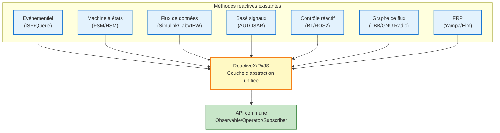

# Patterns réactifs hors ReactiveX

La philosophie de la programmation réactive a été largement pratiquée dans les domaines des systèmes embarqués et de l'ingénierie de contrôle bien avant l'apparition de ReactiveX (RxJS).

Cette page organise systématiquement les **méthodes qui réalisent les principes de la programmation réactive sans utiliser ReactiveX** et clarifie leur relation avec RxJS.

## Essence de la programmation réactive

Le cœur de la programmation réactive réside dans ces 3 principes :

1. **Flux de données (Data Flow)** - Les données sont traitées comme un flux qui change dans le temps
2. **Piloté par événements (Event-Driven)** - Le traitement s'exécute automatiquement lors d'événements
3. **Description déclarative (Declarative)** - Décrire "quoi faire", "quand/comment" est abstrait

Ces principes sont également réalisés dans de nombreuses méthodes au-delà de ReactiveX.

::: info Essence de ReactiveX
ReactiveX n'a pas **inventé** la réactivité, mais a **standardisé les pratiques existantes dans une couche d'abstraction unifiée**.
:::

## Méthodes réactives au-delà de ReactiveX

Présentation de 7 méthodes réactives représentatives utilisées dans les systèmes embarqués et l'ingénierie de contrôle.

| # | Méthode | Aperçu | Outils/Frameworks représentatifs |
|---|------|------|--------------------------|
| 1 | **Architecture événementielle** | Traitement asynchrone d'événements via ISR/queue | RTOS (FreeRTOS, Zephyr) |
| 2 | **Machine à états (FSM/HSM)** | Transitions d'états en réponse aux événements | QPC, SCXML, Yakindu |
| 3 | **Programmation par flux de données** | Pilotage de nœuds selon le flux de données | Simulink, LabVIEW, SCADE |
| 4 | **Contrôle basé sur signaux** | Propagation de mises à jour de valeurs dans tout le système | AUTOSAR COM Stack, Simulink |
| 5 | **Systèmes de contrôle réactifs** | Sélection de comportement selon changements environnementaux | Behavior Tree, ROS2 |
| 6 | **Bibliothèques de graphes de flux** | Traitement parallèle avec dépendances de données explicites | Intel TBB, GNU Radio, StreamIt |
| 7 | **Programmation réactive fonctionnelle** | Traitement fonctionnel de valeurs changeant dans le temps | Haskell Yampa, Elm, Dunai |

## 1. Architecture événementielle (Event-Driven Architecture)

Structure où les routines de service d'interruption (ISR) capturent les événements et notifient les tâches via files de messages.

### Exemple d'implémentation en C

```c
// File d'événements (globale)
typedef struct {
    EventType type;
    void* data;
} Event;

Event eventQueue[EVENT_QUEUE_SIZE];
int queueHead = 0;
int queueTail = 0;

// Routine de service d'interruption (ISR)
void ISR_SensorUpdate() {
    // Lecture des données du capteur
    SensorData* data = readSensor();

    // Push dans la file d'événements
    Event e = { EVENT_SENSOR_NEW_DATA, data };
    EventQueue_push(e);
}

// Tâche principale
void Task_MainLoop() {
    Event e;
    while (1) {
        if (EventQueue_pop(&e)) {
            switch (e.type) {
                case EVENT_SENSOR_NEW_DATA:
                    processSensorData((SensorData*)e.data);
                    break;
                case EVENT_TIMER_EXPIRED:
                    handleTimeout();
                    break;
                // ... autres traitements d'événements
            }
        }
    }
}
```

### Correspondance avec RxJS

| Modèle événementiel | RxJS |
|-----------------|------|
| `EventQueue` | `Observable` |
| `Task_MainLoop` | `subscribe()` |
| `ISR_SensorUpdate` | `next()` |
| Type d'événement | Type de valeur du flux |

::: tip Caractéristiques de l'événementiel
- Largement adopté dans les RTOS (Real-Time Operating System)
- Séparation claire entre traitement d'interruption et traitement de tâche
- Traitement asynchrone via queuing
:::

## 2. Machine à états (State Machine / FSM / HSM)

Les machines à états finis (FSM: Finite State Machine) et hiérarchiques (HSM: Hierarchical State Machine) sont des patterns qui font transitionner les états en fonction des entrées d'événements.

### Exemple de machine à états (C)

```c
typedef enum {
    STATE_IDLE,
    STATE_RUNNING,
    STATE_ERROR,
    STATE_SHUTDOWN
} State;

typedef enum {
    EVENT_START,
    EVENT_STOP,
    EVENT_ERROR_DETECTED,
    EVENT_RESET
} Event;

State currentState = STATE_IDLE;

void stateMachine(Event event) {
    switch (currentState) {
        case STATE_IDLE:
            if (event == EVENT_START) {
                currentState = STATE_RUNNING;
                startOperation();
            }
            break;

        case STATE_RUNNING:
            if (event == EVENT_STOP) {
                currentState = STATE_IDLE;
                stopOperation();
            } else if (event == EVENT_ERROR_DETECTED) {
                currentState = STATE_ERROR;
                handleError();
            }
            break;

        case STATE_ERROR:
            if (event == EVENT_RESET) {
                currentState = STATE_IDLE;
                resetSystem();
            }
            break;

        // ... autres états
    }
}
```

### Outils représentatifs
- **QPC (Quantum Platform)** - Framework de machines à états hiérarchiques
- **SCXML (State Chart XML)** - Langage de description de machines à états standard W3C
- **Yakindu Statechart Tools** - Outil de modélisation de statecharts

### Expression correspondante en RxJS

```typescript
import { Subject, scan } from 'rxjs';

type State = 'IDLE' | 'RUNNING' | 'ERROR' | 'SHUTDOWN';
type Event = 'START' | 'STOP' | 'ERROR_DETECTED' | 'RESET';

const events$ = new Subject<Event>();

const state$ = events$.pipe(
  scan((state: State, event: Event): State => {
    switch (state) {
      case 'IDLE':
        return event === 'START' ? 'RUNNING' : state;
      case 'RUNNING':
        if (event === 'STOP') return 'IDLE';
        if (event === 'ERROR_DETECTED') return 'ERROR';
        return state;
      case 'ERROR':
        return event === 'RESET' ? 'IDLE' : state;
      default:
        return state;
    }
  }, 'IDLE' as State)
);

state$.subscribe(state => console.log('État actuel:', state));

// Déclenchement d'événements
events$.next('START');   // → RUNNING
events$.next('STOP');    // → IDLE
```

::: info Avantages des machines à états hiérarchiques (HSM)
Les HSM peuvent grouper plusieurs états, avec une structure similaire à `share` et `shareReplay` de RxJS qui "regroupent les abonnements multiples".
:::

## 3. Programmation par flux de données (Dataflow Programming)

Méthode de programmation visuelle qui pilote les nœuds selon le flux de données.

### Outils représentatifs
- **MATLAB Simulink** - Conception et simulation de systèmes de contrôle
- **LabVIEW (National Instruments)** - Développement de systèmes de mesure et contrôle
- **SCADE (Esterel Technologies)** - Systèmes critiques (aérospatial, ferroviaire)

### Image du flux de données Simulink

```
[Capteur] → [Filtre passe-bas] → [Seuil] → [Condition] → [Actionneur]
   ↓              ↓                 ↓              ↓             ↓
Valeur brute  Valeur lissée    Valeur jugement  Vrai/Faux     Sortie
```

### Expression correspondante en RxJS

```typescript
import { interval } from 'rxjs';
import { map, filter, tap } from 'rxjs';

// Flux de capteur
const sensor$ = interval(100).pipe(
  map(() => Math.random() * 100) // Simulation de valeur capteur
);

// Pipeline de flux de données
sensor$
  .pipe(
    map(value => lowPassFilter(value)),        // Filtre passe-bas
    map(value => value > 50 ? value : 0),      // Traitement de seuil
    filter(value => value > 0),                // Jugement de condition
    tap(value => actuate(value))               // Pilotage actionneur
  )
  .subscribe();

function lowPassFilter(value: number): number {
  // Filtre passe-bas simple (moyenne mobile)
  return value * 0.3 + previousValue * 0.7;
}

function actuate(value: number): void {
  console.log('Sortie actionneur:', value);
}
```

::: tip Caractéristiques de la programmation par flux de données
- Compréhension visuelle du flux de données
- Largement adopté en ingénierie de contrôle et traitement du signal
- Structure très similaire au pipeline (`.pipe()`) de RxJS
:::

## 4. Contrôle basé sur signaux (Signal-Based Control)

Pattern qui propage les mises à jour de valeurs dans tout le système. AUTOSAR COM Stack et Simulink, standardisés dans l'industrie automobile, en sont des exemples représentatifs.

### Image de AUTOSAR COM Stack

```c
// Définition des signaux
typedef struct {
    uint16_t speed;        // Vitesse [km/h]
    uint8_t temperature;   // Température [℃]
    bool doorOpen;         // État d'ouverture de porte
} VehicleSignals;

VehicleSignals currentSignals;

// Mise à jour du signal
void updateSpeed(uint16_t newSpeed) {
    currentSignals.speed = newSpeed;
    // COM Stack notifie les abonnés
    Com_SendSignal(SIGNAL_ID_SPEED, &currentSignals.speed);
}

// Abonnement au signal
void speedMonitor() {
    uint16_t speed;
    Com_ReceiveSignal(SIGNAL_ID_SPEED, &speed);

    if (speed > 120) {
        triggerSpeedWarning();
    }
}
```

### Correspondance RxJS (BehaviorSubject)

```typescript
import { BehaviorSubject } from 'rxjs';

interface VehicleSignals {
  speed: number;
  temperature: number;
  doorOpen: boolean;
}

// BehaviorSubject - conserve la valeur actuelle
const vehicleSignals$ = new BehaviorSubject<VehicleSignals>({
  speed: 0,
  temperature: 20,
  doorOpen: false
});

// Mise à jour du signal
function updateSpeed(newSpeed: number) {
  const current = vehicleSignals$.value;
  vehicleSignals$.next({ ...current, speed: newSpeed });
}

// Abonnement au signal
vehicleSignals$.subscribe(signals => {
  if (signals.speed > 120) {
    console.log('⚠️ Avertissement dépassement de vitesse');
  }
});

updateSpeed(130); // → Avertissement déclenché
```

::: info Caractéristiques du contrôle basé sur signaux
- **Conserve toujours la valeur actuelle** - Mêmes caractéristiques que BehaviorSubject
- Largement adopté dans AUTOSAR (standard de l'industrie automobile)
- Utilisé pour la communication entre ECU (Electronic Control Unit)
:::

## 5. Systèmes de contrôle réactifs (Reactive Control Systems)

Méthodes implémentant la sélection de comportement selon les changements environnementaux pour la robotique et la conduite autonome.

### Frameworks représentatifs
- **Behavior Tree (BT)** - IA de jeu, contrôle robotique
- **ROS2 (Robot Operating System 2)** - Plateforme de développement robotique

### Structure Behavior Tree

```
Selector (OR)
├─ Sequence (AND)
│  ├─ Condition: Niveau batterie > 20%
│  └─ Action: Déplacement vers destination
└─ Action: Déplacement vers station de charge
```

### Pattern réactif ROS2 (Python)

```python
import rclpy
from rclpy.node import Node
from sensor_msgs.msg import LaserScan

class ObstacleDetector(Node):
    def __init__(self):
        super().__init__('obstacle_detector')
        # Abonnement aux données du capteur LiDAR
        self.subscription = self.create_subscription(
            LaserScan,
            '/scan',
            self.laser_callback,
            10
        )

    def laser_callback(self, msg):
        # Obtention de la distance minimale
        min_distance = min(msg.ranges)

        # Réaction à la détection d'obstacle
        if min_distance < 0.5:  # Dans les 50cm
            self.get_logger().warn('Obstacle détecté ! Arrêt')
            self.stop_robot()
```

### Expression correspondante en RxJS

```typescript
import { fromEvent } from 'rxjs';
import { map, filter } from 'rxjs';

// Flux de données du capteur LiDAR
const lidarData$ = fromEvent<LaserScan>(lidarSensor, 'scan');

lidarData$
  .pipe(
    map(scan => Math.min(...scan.ranges)),  // Obtenir distance minimale
    filter(minDistance => minDistance < 0.5) // Dans les 50cm
  )
  .subscribe(() => {
    console.warn('⚠️ Obstacle détecté ! Arrêt');
    stopRobot();
  });
```

::: tip Domaines d'application du contrôle réactif
- Évitement d'obstacles pour véhicules autonomes
- Vol autonome de drones
- Contrôle de sécurité pour robots industriels
:::

## 6. Bibliothèques de graphes de flux (Flow Graph Libraries)

Bibliothèques traitant explicitement les dépendances de données en environnement multi-thread.

### Bibliothèques représentatives
- **Intel TBB (Threading Building Blocks) Flow Graph**
- **GNU Radio** - Radio logicielle (SDR)
- **StreamIt (MIT)** - Langage de traitement de flux

### Exemple Intel TBB Flow Graph (C++)

```cpp
#include <tbb/flow_graph.h>
#include <iostream>

int main() {
    tbb::flow::graph g;

    // Nœud broadcast (rôle type Observable)
    tbb::flow::broadcast_node<int> source(g);

    // Nœud de transformation (rôle type map)
    tbb::flow::function_node<int, int> multiply(
        g,
        tbb::flow::unlimited,
        [](int x) { return x * 2; }
    );

    tbb::flow::function_node<int, int> add(
        g,
        tbb::flow::unlimited,
        [](int x) { return x + 10; }
    );

    // Nœud de sortie (rôle type subscribe)
    tbb::flow::function_node<int> output(
        g,
        tbb::flow::unlimited,
        [](int x) { std::cout << "Résultat: " << x << std::endl; }
    );

    // Connexion des arêtes
    tbb::flow::make_edge(source, multiply);
    tbb::flow::make_edge(multiply, add);
    tbb::flow::make_edge(add, output);

    // Injection de données
    source.try_put(5);  // → Résultat: 20 (5 * 2 + 10)
    g.wait_for_all();

    return 0;
}
```

### Expression correspondante en RxJS

```typescript
import { of } from 'rxjs';
import { map } from 'rxjs';

of(5)
  .pipe(
    map(x => x * 2),      // multiply
    map(x => x + 10)      // add
  )
  .subscribe(result => {
    console.log('Résultat:', result); // → Résultat: 20
  });
```

::: info Caractéristiques des graphes de flux
- **Optimisation de l'exécution parallèle** - Gestion explicite des dépendances de données
- Utilisation efficace des multiples cœurs CPU
- Largement adopté en traitement du signal, traitement d'images, systèmes de communication
:::

## 7. Programmation réactive fonctionnelle (FRP)

Functional Reactive Programming (FRP) est la base théorique de la programmation réactive.

### Langages/bibliothèques représentatifs
- **Haskell Yampa** - Développement de jeux, robotique
- **Elm** - Frontend web (framework type React type-safe)
- **Dunai** - Bibliothèque FRP généraliste

### Exemple Haskell Yampa

```haskell
import FRP.Yampa

-- Définition de fonction signal (Signal Function)
-- Transformation dépendante du temps Input → Output
simpleSF :: SF Double Double
simpleSF = arr (\x -> x * 2)       -- Multiplier par 2
       >>> integral                -- Intégration (accumulation temporelle)
       >>> arr (\x -> x + 10)      -- Ajouter 10

-- Exemple d'exécution
-- Entrée: valeur changeant dans le temps (ex: valeur capteur)
-- Sortie: flux de valeurs transformées
```

### Expression correspondante en RxJS

```typescript
import { interval } from 'rxjs';
import { map, scan } from 'rxjs';

const simpleSF$ = interval(100).pipe(
  map(x => x * 2),                         // arr (\x -> x * 2)
  scan((acc, value) => acc + value, 0),    // integral (intégration = accumulation)
  map(x => x + 10)                         // arr (\x -> x + 10)
);

simpleSF$.subscribe(result => console.log(result));
```

### Concepts principaux FRP

| Concept FRP | Description | Correspondance RxJS |
|--------|------|----------|
| **Signal** | Valeur changeant dans le temps | `Observable` |
| **Event** | Occurrence discrète | `Subject` |
| **Signal Function (SF)** | Fonction de transformation de signal | `pipe()` + opérateurs |
| **Behavior** | Changement temporel ayant toujours une valeur | `BehaviorSubject` |

::: info Importance de FRP
FRP est la **base théorique** de ReactiveX. Les concepts cultivés dans les langages fonctionnels purs comme Haskell ont été hérités par RxJS et ReactiveX.
:::

## Position de ReactiveX

En considérant les 7 méthodes vues jusqu'ici, l'essence de ReactiveX devient claire.

### Rôle joué par ReactiveX



ReactiveX fonctionne comme un **langage commun pour traiter ces méthodes existantes de manière transversale**.

### Avantages de ReactiveX

| Point de vue | Méthodes traditionnelles | ReactiveX/RxJS |
|------|-----------|---------------|
| **Coût d'apprentissage** | Concepts/outils différents par domaine | API unifiée (Observable/Operator) |
| **Portabilité** | Forte dépendance à la plateforme | Concepts communs entre langages (RxJava, RxSwift, etc.) |
| **Composabilité** | Difficile de combiner les méthodes | Composition flexible via opérateurs |
| **Débogage** | Outils spécifiques au domaine nécessaires | Outils communs RxJS DevTools, tap, etc. |
| **Tests** | Tests asynchrones complexes | TestScheduler, Marble Testing |

::: tip Essence de ReactiveX
ReactiveX est **intégration, pas invention**. Il est important de comprendre les méthodes réactives existantes et ReactiveX comme une couche d'abstraction pour les traiter de manière unifiée.
:::

## Utilisation pratique selon les cas

Chaque méthode a son domaine d'application approprié.

### Comparaison des domaines d'application

| Méthode | Utilisation optimale | Coût apprentissage | Portabilité |
|------|----------|-----------|--------|
| **Événementiel (ISR/Queue)** | Contrôle embarqué basé RTOS | Faible | Faible (dépendance plateforme) |
| **Machine à états (FSM/HSM)** | Contrôle nécessitant transitions d'états complexes | Moyen | Moyen (abstraction possible via QPC, etc.) |
| **Flux de données (Simulink)** | Conception/simulation systèmes de contrôle | Élevé | Faible (dépendance outil) |
| **Basé signaux (AUTOSAR)** | Communication entre ECU automobiles | Élevé | Faible (standard industrie mais spécialisé) |
| **Contrôle réactif (ROS2)** | Robotique, conduite autonome | Moyen | Moyen (écosystème ROS2) |
| **Graphe de flux (TBB)** | Traitement parallèle, traitement signal | Moyen | Moyen (environnement C++) |
| **FRP (Haskell)** | Importance type-safety, recherche académique | Élevé | Faible (langage fonctionnel) |
| **ReactiveX (RxJS)** | Applications web, traitement edge IoT, usage général | Moyen | **Élevé (support multi-langages)** |

### Directives de sélection

::: warning Contrôle temps réel dur (ordre microseconde)
→ **Événementiel (ISR/Queue)** ou **RTOS dédié**

ReactiveX inapproprié (overhead important)
:::

::: tip Contrôle temps réel souple (ordre milliseconde)
→ **ReactiveX/RxJS** optimal

Intégration capteurs, détection corrélation événements, détection anomalies, etc.
:::

::: info En cas de toolchain existante
→ **Prioriser les outils standards du domaine**

Exemple: Industrie automobile → AUTOSAR, Robotique → ROS2
:::

## Résumé

La philosophie de la programmation réactive a été pratiquée dans de nombreux domaines bien avant l'apparition de ReactiveX.

### Points importants

1. **ReactiveX est un intégrateur** - Langage commun pour traiter les méthodes existantes transversalement
2. **Solution optimale par domaine** - Chaque méthode a son domaine d'application approprié
3. **Communauté de concepts** - Événementiel, flux de données, description déclarative sont communs
4. **Synergie d'apprentissage** - Comprendre profondément une méthode facilite la compréhension des autres

### Signification d'apprendre ReactiveX

::: info Ce que l'apprentissage de ReactiveX apporte

1. **Compréhension transversale** - Concepts communs à l'embarqué, Web, mobile
2. **Compétences hautement portables** - Support multi-langages RxJava, RxSwift, RxKotlin, etc.
3. **Méthodes unifiées de débogage/test** - RxJS DevTools, Marble Testing
4. **Compréhension essentielle des méthodes existantes** - Base théorique de l'événementiel, machines à états, etc.

:::

Que ce soit systèmes embarqués ou applications web, **l'essence de la programmation réactive ne change pas**. ReactiveX est un outil puissant qui intègre ces connaissances et fournit une abstraction moderne.

## Pages connexes

- [Développement embarqué et programmation réactive](/fr/guide/appendix/embedded-reactive-programming) - Utilisation de RxJS dans les systèmes embarqués
- [Introduction à RxJS](/fr/guide/introduction) - Concepts de base de RxJS
- [Qu'est-ce qu'un Observable](/fr/guide/observables/what-is-observable) - Fondamentaux d'Observable
- [Qu'est-ce qu'un Subject](/fr/guide/subjects/what-is-subject) - Détails sur BehaviorSubject, etc.
- [Aperçu des opérateurs](/fr/guide/operators/) - Transformation et filtrage de données

## Références

- [GitHub Discussions - Méthodes réactives au-delà de ReactiveX (Perspective embarquée)](https://github.com/shuji-bonji/RxJS-with-TypeScript/discussions/14)
- [QPC (Quantum Platform)](https://www.state-machine.com/qpc/) - Framework de machines à états hiérarchiques
- [Intel TBB Flow Graph](https://www.intel.com/content/www/us/en/docs/onetbb/developer-guide-api-reference/2021-14/flow-graph.html)
- [Documentation ROS2](https://docs.ros.org/en/rolling/)
- [AUTOSAR Classic Platform](https://www.autosar.org/standards/classic-platform/)
- [Functional Reactive Programming (FRP)](https://wiki.haskell.org/Functional_Reactive_Programming)
