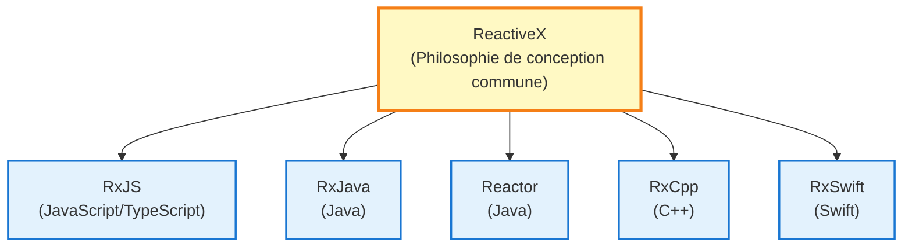
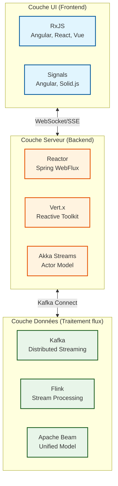
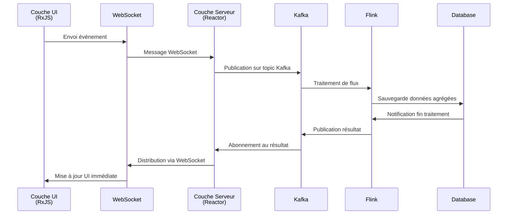

# RxJS et Reactive Streams

Lorsqu'on apprend RxJS, de nombreux développeurs se posent la question : "Comment RxJS se positionne-t-il dans la vue d'ensemble globale de la Programmation Réactive ?"

Cette page explique **les différences entre RxJS et le standard Reactive Streams**, **la vue d'ensemble complète de la pile technologique de la couche UI à la couche données**, et **les méthodes de coordination entre différentes technologies**.

## Position de RxJS

### Qu'est-ce que RxJS

**RxJS** (Reactive Extensions for JavaScript) est l'implémentation principale de la Programmation Réactive dans les **environnements navigateur et Node.js**.



::: info Caractéristiques de RxJS
- Fonctionne dans navigateur et Node.js
- Priorité absolue à la réactivité UI
- Léger et rapide
- Backpressure implicite
:::


## RxJS vs Standard Reactive Streams

La Programmation Réactive a deux grands courants : **RxJS** et le **standard Reactive Streams**.

### Qu'est-ce que le standard Reactive Streams

[Reactive Streams](https://www.reactive-streams.org/) est une spécification standard pour le traitement de flux sur JVM.

**Principales implémentations :**
- **Project Reactor** (Spring WebFlux)
- **RxJava 3**
- **Akka Streams**
- **Mutiny** (Quarkus)

**4 interfaces standardisées :**
```java
public interface Publisher<T> {
    void subscribe(Subscriber<? super T> s);
}

public interface Subscriber<T> {
    void onSubscribe(Subscription s);
    void onNext(T t);
    void onError(Throwable t);
    void onComplete();
}

public interface Subscription {
    void request(long n);  // Contrôle backpressure
    void cancel();
}

public interface Processor<T, R> extends Subscriber<T>, Publisher<R> {}
```

### Différence principale : Contrôle de backpressure

| Point de vue | RxJS | Standard Reactive Streams |
|------|------|---------------------|
| **Plateforme** | JavaScript/TypeScript (navigateur, Node.js) | JVM (Java, Scala, Kotlin) |
| **Backpressure** | Implicite (niveau opérateur) | Explicite (méthode `request(n)`) |
| **Priorité** | Réactivité UI | Débit serveur |
| **Standardisation** | API commune ReactiveX | Spécification Reactive Streams |

#### Backpressure RxJS (implicite)

```typescript
import { interval } from 'rxjs';
import { bufferTime, take } from 'rxjs';

// Backpressure contrôlée par opérateurs
interval(10)  // Émettre toutes les 10ms
  .pipe(
    bufferTime(1000),  // Buffer toutes les secondes (contrôle implicite)
    take(5)
  )
  .subscribe(batch => console.log('Batch:', batch.length));
```

#### Backpressure Reactive Streams (explicite)

```java
// Project Reactor (Java)
Flux.range(1, 1000)
    .subscribe(new BaseSubscriber<Integer>() {
        @Override
        protected void hookOnSubscribe(Subscription subscription) {
            request(10);  // Requête initiale de 10 éléments (explicite)
        }

        @Override
        protected void hookOnNext(Integer value) {
            System.out.println("Traitement: " + value);
            request(1);  // Requête du suivant après traitement (explicite)
        }
    });
```

> [!IMPORTANT]
> **Différence de backpressure**
>
> - **RxJS** : Contrôle implicite via opérateurs (`bufferTime`, `throttleTime`, `debounceTime`)
> - **Reactive Streams** : Contrôle explicite via méthode `request(n)`
>
> Cette différence reflète les exigences différentes de l'UI (RxJS) et du serveur (Reactive Streams).

## Pile technologique par couche

La Programmation Réactive forme une pile technologique couvrant plusieurs couches, de l'UI aux données.

### Architecture globale



### 1. Couche UI (Frontend)

**Technologies principales : RxJS, Signals**

```typescript
// RxJS (standard couche UI)
import { fromEvent } from 'rxjs';
import { debounceTime, distinctUntilChanged, switchMap } from 'rxjs';

const searchInput$ = fromEvent(input, 'input').pipe(
  map(event => (event.target as HTMLInputElement).value),
  debounceTime(300),
  distinctUntilChanged(),
  switchMap(query => fetch(`/api/search?q=${query}`).then(r => r.json()))
);

searchInput$.subscribe(results => updateUI(results));
```

::: info Caractéristiques :
- Fonctionne en environnement navigateur
- Priorité absolue à la réactivité UI
- Traite de manière unifiée entrée utilisateur, événements DOM, communication HTTP
:::

### 2. Couche Serveur (Backend)

**Technologies principales : Project Reactor, Vert.x, Akka Streams**

#### Project Reactor (Spring WebFlux)

```java
// Project Reactor (standard couche serveur)
@RestController
public class UserController {

    @GetMapping("/users")
    public Flux<User> getUsers() {
        return userRepository.findAll()  // Reactive Repository
            .filter(user -> user.isActive())
            .map(user -> enrichUserData(user))
            .onErrorResume(error -> Flux.empty());
    }

    @GetMapping("/users/{id}")
    public Mono<User> getUser(@PathVariable String id) {
        return userRepository.findById(id)
            .switchIfEmpty(Mono.error(new UserNotFoundException(id)));
    }
}
```


::: info Caractéristiques :
- Conforme au standard Reactive Streams
- I/O non-bloquante
- Haut débit
- Contrôle explicite de backpressure
:::

#### Akka Streams (Actor Model)

```scala
// Akka Streams (pour systèmes distribués)
val source = Source(1 to 100)
val flow = Flow[Int].map(_ * 2)
val sink = Sink.foreach[Int](println)

source.via(flow).to(sink).run()
```


::: info Caractéristiques :
- Basé sur modèle Actor
- Optimal pour systèmes distribués
- Isolation et récupération des pannes
:::

### 3. Couche Données (Traitement de flux)

**Technologies principales : Kafka, Flink, Apache Beam**

#### Apache Kafka (Streaming d'événements)

```java
// Kafka Streams (pipeline de données)
StreamsBuilder builder = new StreamsBuilder();

KStream<String, String> source = builder.stream("input-topic");

source
    .filter((key, value) -> value.length() > 10)
    .mapValues(value -> value.toUpperCase())
    .to("output-topic");

KafkaStreams streams = new KafkaStreams(builder.build(), config);
streams.start();
```


::: info Caractéristiques :
- Plateforme de streaming d'événements distribuée
- Haut débit, faible latence
- Base pour Event Sourcing, patterns CQRS
:::

#### Apache Flink (Traitement de flux)

```java
// Flink (traitement de flux temps réel)
StreamExecutionEnvironment env = StreamExecutionEnvironment.getExecutionEnvironment();

DataStream<Event> events = env.addSource(new KafkaSource<>());

events
    .filter(event -> event.getValue() > threshold)
    .keyBy(Event::getSensorId)
    .timeWindow(Time.seconds(10))
    .reduce((e1, e2) -> new Event(e1.getSensorId(), e1.getValue() + e2.getValue()))
    .addSink(new DatabaseSink());

env.execute("Stream Processing Job");
```


::: info Caractéristiques :
- Moteur de traitement de flux temps réel
- Garantie exactly-once
- Traitement de temps d'événement et watermarks
:::

## Technologies de pont : Coordination entre différentes couches

Comment coordonner entre différentes piles technologiques ?

### 1. Couche UI ⇄ Couche Serveur : WebSocket / SSE

#### WebSocket (Communication bidirectionnelle)

**Frontend (RxJS) :**
```typescript
import { webSocket } from 'rxjs/webSocket';

const socket$ = webSocket<Message>('wss://example.com/ws');

// Réception
socket$.subscribe(message => console.log('Reçu:', message));

// Envoi
socket$.next({ type: 'subscribe', channel: 'notifications' });
```

**Backend (Spring WebFlux) :**
```java
@Configuration
@EnableWebSocketMessageBroker
public class WebSocketConfig implements WebSocketMessageBrokerConfigurer {

    @Override
    public void configureMessageBroker(MessageBrokerRegistry config) {
        config.enableSimpleBroker("/topic");
        config.setApplicationDestinationPrefixes("/app");
    }

    @Override
    public void registerStompEndpoints(StompEndpointRegistry registry) {
        registry.addEndpoint("/ws").withSockJS();
    }
}

@Controller
public class NotificationController {

    @MessageMapping("/subscribe")
    public Flux<Notification> subscribe(@Payload SubscribeRequest request) {
        return notificationService.getNotificationStream(request.getChannel());
    }
}
```

#### Server-Sent Events (Serveur → Client)

**Frontend (RxJS) :**
```typescript
import { Observable } from 'rxjs';

function fromSSE<T>(url: string): Observable<T> {
  return new Observable(subscriber => {
    const eventSource = new EventSource(url);

    eventSource.onmessage = event => {
      subscriber.next(JSON.parse(event.data));
    };

    eventSource.onerror = error => {
      subscriber.error(error);
    };

    return () => eventSource.close();
  });
}

const notifications$ = fromSSE<Notification>('/api/notifications/stream');
notifications$.subscribe(n => console.log('Notification:', n));
```

**Backend (Spring WebFlux) :**
```java
@GetMapping(value = "/notifications/stream", produces = MediaType.TEXT_EVENT_STREAM_VALUE)
public Flux<Notification> streamNotifications() {
    return notificationService.getNotificationStream()
        .delayElements(Duration.ofSeconds(1));
}
```

### 2. Couche Serveur ⇄ Couche Données : Kafka Connect

**Couche serveur (Reactor) vers Kafka :**
```java
// Spring WebFlux + Kafka
@Service
public class EventPublisher {

    private final KafkaTemplate<String, Event> kafkaTemplate;

    public Mono<Void> publishEvent(Event event) {
        return Mono.fromFuture(
            kafkaTemplate.send("events-topic", event.getId(), event)
                .completable()
        ).then();
    }
}
```

**Kafka vers couche serveur (Reactor) :**
```java
// Kafka Consumer (Reactive)
@Service
public class EventConsumer {

    @KafkaListener(topics = "events-topic")
    public Mono<Void> consume(Event event) {
        return processEvent(event)
            .then();
    }

    private Mono<Void> processEvent(Event event) {
        return Mono.fromRunnable(() -> {
            System.out.println("Traitement événement: " + event);
        });
    }
}
```

### 3. Pipeline réactif de bout en bout



## Directives de sélection technologique

Quelle technologie utiliser dans quelle couche ?

### Sélection couche UI (Frontend)

| Besoin | Technologie recommandée | Raison |
|------|---------|------|
| Flux asynchrone complexe | **RxJS** | Opérateurs riches, API unifiée |
| Réactivité simple | **Angular Signals** / **Solid.js** | Coût apprentissage faible, intuitif |
| Standard framework | **React Hooks** / **Vue Composition API** | Intégration avec framework |

```typescript
// Choisir RxJS : flux asynchrone complexe
combineLatest([
  userInput$,
  apiStatus$,
  validation$
]).pipe(
  debounceTime(300),
  distinctUntilChanged(),
  switchMap(([input, status, isValid]) =>
    isValid ? submitData(input) : of(null)
  )
).subscribe(/*...*/);

// Choisir Signals : gestion d'état simple
const count = signal(0);
const doubled = computed(() => count() * 2);
```

### Sélection couche Serveur (Backend)

| Besoin | Technologie recommandée | Raison |
|------|---------|------|
| API haut débit | **Spring WebFlux** (Reactor) | Écosystème JVM, bibliothèques riches |
| Microservices | **Vert.x** / **Quarkus** (Mutiny) | Léger, démarrage rapide |
| Système distribué | **Akka Streams** | Actor Model, isolation des pannes |
| Environnement Node.js | **RxJS** / **Node.js Streams** | Unification JavaScript |

```java
// Spring WebFlux (API haut débit)
@GetMapping("/users")
public Flux<User> getUsers() {
    return userRepository.findAll()
        .filter(User::isActive)
        .map(this::enrichData);
}
```

### Sélection couche Données (Traitement de flux)

| Besoin | Technologie recommandée | Raison |
|------|---------|------|
| Streaming d'événements | **Apache Kafka** | Haut débit, distribué, persistance |
| Traitement temps réel | **Apache Flink** | Faible latence, gestion d'état |
| Intégration batch+flux | **Apache Beam** | Modèle API unifié |
| Traitement données IoT | **Kafka + Flink** | Scalabilité, fiabilité |

```java
// Kafka + Flink (traitement données IoT)
StreamExecutionEnvironment env = StreamExecutionEnvironment.getExecutionEnvironment();

DataStream<SensorReading> sensorData = env
    .addSource(new FlinkKafkaConsumer<>("sensors", deserializer, properties));

sensorData
    .keyBy(SensorReading::getSensorId)
    .timeWindow(Time.minutes(5))
    .aggregate(new AverageAggregator())
    .addSink(new FlinkKafkaProducer<>("aggregated-data", serializer, properties));
```

## Communauté et différences de syntaxe des opérateurs

RxJS, Reactor, Kafka Streams ont des **syntaxes similaires** mais des **sémantiques différentes**.

### Communauté : Pipeline déclaratif

**RxJS (couche UI) :**
```typescript
source$
  .pipe(
    filter(x => x > 10),
    map(x => x * 2),
    take(5)
  )
  .subscribe(console.log);
```

**Reactor (couche serveur) :**
```java
source
    .filter(x -> x > 10)
    .map(x -> x * 2)
    .take(5)
    .subscribe(System.out::println);
```

**Kafka Streams (couche données) :**
```java
stream
    .filter((key, value) -> value > 10)
    .mapValues(value -> value * 2)
    .to("output-topic");
```

### Différences : Modèle d'exécution et sémantiques

| Point de vue | RxJS | Reactor | Kafka Streams |
|------|------|---------|---------------|
| **Environnement d'exécution** | Single-thread (event loop) | Multi-thread possible | Traitement distribué |
| **Planification** | Implicite (sync par défaut) | Explicite (Schedulers) | Distribution automatique |
| **Gestion erreurs** | `catchError` | `onErrorResume` | Garantie Exactly-once |
| **Backpressure** | Niveau opérateur | `request(n)` | Contrôle automatique |

> [!WARNING]
> **Une syntaxe d'opérateur similaire ne signifie pas un fonctionnement identique.** Il est important de comprendre le modèle d'exécution et les sémantiques de chaque technologie.

## Forces et domaines d'application de RxJS

### Domaines où RxJS est le plus fort

1. **Traitement UI navigateur**
   - Traitement unifié de l'entrée utilisateur, événements DOM, communication HTTP

2. **I/O asynchrone Node.js**
   - Streaming d'opérations fichiers, communication réseau

3. **Intégration de traitements asynchrones multiples**
   - Flux complexes avec `combineLatest`, `merge`, `switchMap`, etc.

### Limites de RxJS

1. **Traitement serveur haut débit**
   - Reactor, Akka Streams basés JVM sont plus avantageux

2. **Traitement de flux distribué**
   - Kafka, Flink sont plus appropriés

3. **Contrôle strict de backpressure**
   - `request(n)` explicite du standard Reactive Streams est nécessaire

> [!TIP]
> **RxJS est le plus fort dans la couche UI, mais dans les couches serveur et données, d'autres technologies peuvent être plus appropriées.** Il n'est pas nécessaire d'utiliser RxJS dans toutes les couches.

## Résumé

### Position de RxJS

> [!IMPORTANT]
> RxJS est l'implémentation principale de la Programmation Réactive dans les **environnements navigateur et Node.js**. Il priorise la réactivité UI et adopte un contrôle de backpressure implicite.

### Vue d'ensemble de l'écosystème Reactive Streams

```
Couche UI         : RxJS, Signals
Couche Communication : WebSocket, SSE
Couche Serveur    : Reactor, Vert.x, Akka Streams
Couche Données    : Kafka, Flink, Apache Beam
```

### Directives de sélection technologique

| Couche | Technologie recommandée | Raison |
|----|---------|------|
| **Couche UI** | RxJS, Signals | Réactivité UI, opérateurs riches |
| **Couche Serveur** | Reactor, Vert.x | Haut débit, standard Reactive Streams |
| **Couche Données** | Kafka, Flink | Traitement distribué, scalabilité |

### Technologies de pont

- **UI ⇄ Serveur** : WebSocket, SSE
- **Serveur ⇄ Données** : Kafka Connect, Reactive Kafka

### Communauté de syntaxe des opérateurs

RxJS, Reactor, Kafka Streams ont des syntaxes similaires, mais des **modèles d'exécution et sémantiques différents**. Il est important de comprendre les caractéristiques de chaque technologie pour les utiliser de manière appropriée.

> [!TIP]
> **Il n'est pas nécessaire d'unifier toutes les couches avec RxJS.** En sélectionnant la technologie optimale pour chaque couche et en les coordonnant via des technologies de pont, vous pouvez construire un système réactif de bout en bout.

## Pages connexes

- [Carte complète de l'architecture réactive](/fr/guide/appendix/reactive-architecture-map) - Détails des 7 couches
- [Reactive Programming Reconsidered](/fr/guide/appendix/reactive-programming-reconsidered) - Forces et limites de RP
- [Opérateurs de combinaison](/fr/guide/operators/combination/) - Intégration de flux multiples
- [Gestion des erreurs](/fr/guide/error-handling/strategies) - Gestion d'erreurs RxJS

## Références

- [GitHub Discussion #16 - Reactive Streams Ecosystem and RxJS Positioning](https://github.com/shuji-bonji/RxJS-with-TypeScript/discussions/16)
- [Site officiel Reactive Streams](https://www.reactive-streams.org/)
- [Documentation officielle Project Reactor](https://projectreactor.io/docs)
- [Documentation officielle Apache Kafka](https://kafka.apache.org/documentation/)
- [Documentation officielle Apache Flink](https://flink.apache.org/docs/)
- [Documentation officielle RxJS](https://rxjs.dev/)
