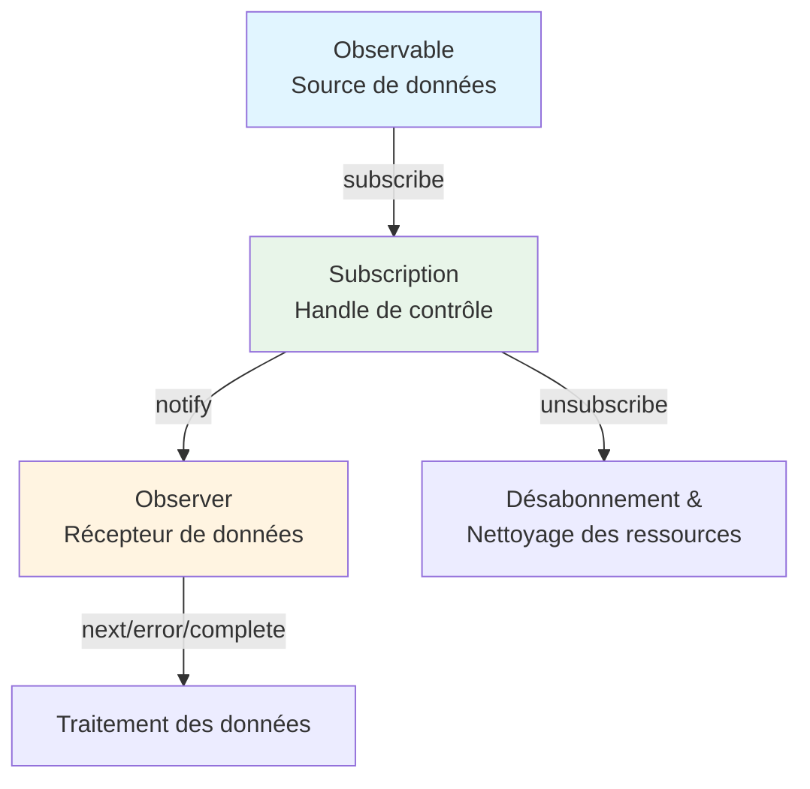

# Qu'est-ce qu'un flux ?

## Définition d'un flux

Un "flux" fait référence à **un flux de données qui se produit de manière séquentielle au fil du temps**. Il peut être considéré comme une collection de données apparaissant l'une après l'autre dans un certain ordre.

### Exemples de flux typiques dans la programmation traditionnelle
- Données provenant de la lecture de fichiers (par exemple, ReadableStream dans Node.js)
- Communications réseau (par exemple, réponses HTTP)
- Entrées et événements de l'utilisateur (mouvements de la souris, clics, entrées au clavier)

## Les flux dans RxJS

RxJS utilise **Observable** pour gérer les données qui se produisent dans le temps sous la forme d'un flux. Observable est un mécanisme permettant d'abstraire les données asynchrones, les données synchrones, les événements et le traitement temporel en tant que "flux".

### Avantages de l'Observable
- Peut être décrit de manière sûre pour les types (affinité TypeScript)
- Expression déclarative du flux de données
- La chaîne d'opérations par `pipe()` est possible
- Peut s'abonner explicitement par `subscribe()`
- Annulable par `unsubscribe()`

## Comparaison avec les flux conventionnels

| Caractéristique | Flux conventionnels | RxJS Observable |
|------|------------------|-------------------|
| Cible | Tendance à se limiter aux fichiers/réseaux, etc. | Asynchrone/événement/changement d'état arbitraire |
| Gestion des événements | Géré par des écouteurs d'événements au cas par cas | Streaming avec `fromEvent` |
| Annulation | Méthodes différentes | Gestion unifiée avec `unsubscribe()` |
| Composition/Conversion | Implémentation séparée avec du code procédural | Description concise avec des opérateurs (`map`, `filter`, etc.) |

## Relation avec Observer & Subscription

- **Observable** : Source de données (source de flux)
- **Observer** : Récepteur de données (avec next, error, complete)
- **Subscription** : Handle de contrôle pour l'abonnement (subscribe, unsubscribe, gestion des ressources)

Observable et Observer sont reliés par des callbacks et contrôlés par Subscription.

### Diagramme relationnel de base

## Résumé

Le concept de "flux", qui est au cœur de RxJS, est une arme puissante lorsqu'il s'agit de traitement asynchrone. Observable vous permet de gérer diverses sources de données de manière unifiée et de décrire les flux de données de manière déclarative et flexible.

## Relation avec le traitement des événements

Dans RxJS, les événements DOM peuvent également être traités comme des flux en utilisant `fromEvent`.
Le concept de flux devient plus clair en comparant les différences avec les écouteurs d'événements conventionnels.

> [!TIP]
> Voir [Streaming Events](/fr/guide/observables/events.md#comparison-between-traditional-event-processing-and-rxjs) pour une comparaison du traitement traditionnel des événements et de RxJS avec du code réel.
