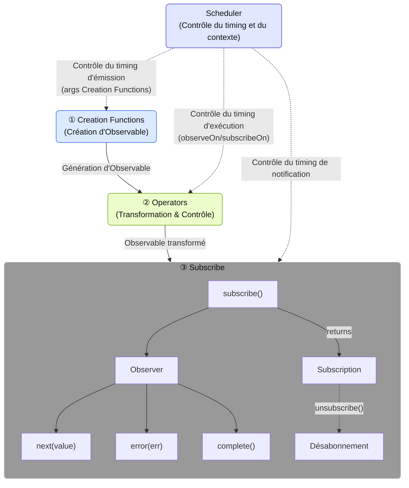
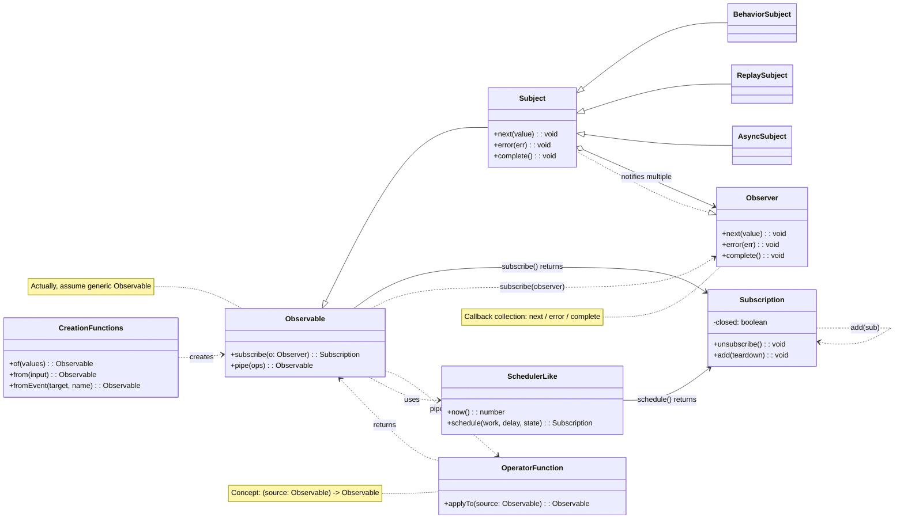

# Qu'est-ce que RxJS ?

## Aperçu
[RxJS (Reactive Extensions for JavaScript)](https://rxjs.dev) est une bibliothèque de "programmation réactive" en JavaScript.

> ### Qu'est-ce que la programmation réactive ?
> La programmation réactive est une méthode de création de programmes qui sont automatiquement mis à jour en réponse à des changements de données.
> Il s'agit d'un type de programmation événementielle, qui met l'accent sur la gestion des flux de données asynchrones. Elle se concentre sur le flux de données et construit des programmes qui réagissent à ce flux.

En d'autres termes, RxJS est une bibliothèque permettant de gérer les événements et les flux de données asynchrones dans un style fonctionnel, fournissant des outils puissants pour gérer les flux de données asynchrones à l'aide du modèle Observable.

> Observable est l'élément de base de RxJS pour représenter les événements et les flux de données asynchrones. Il s'agit d'une source de valeurs qui "circulent" et peuvent être reçues en s'y abonnant. Un Observable est un "flux de données" qui publie des valeurs au fil du temps, et vous pouvez recevoir ces valeurs en vous y abonnant.


> [!TIP]
> Si vous vous demandez : "Qu'est-ce qu'un flux de données ?" veuillez vous référer à [Qu'est-ce qu'un flux ?](/fr/guide/basics/what-is-a-stream).


## Exemple d'utilisation simple

```ts
import { fromEvent } from 'rxjs';

fromEvent(document, 'click').subscribe(event => {
  console.log('Cliqué:', event);
});
```

## Composants de base de RxJS

Pour maîtriser RxJS, il est important de comprendre les composants de base suivants.

| Composant | Vue d'ensemble |
|------|------|
| [`Observable`](../observables/what-is-observable.md) | La source du flux, qui représente les données qui se produisent de manière asynchrone ou dans le temps. |
| [`Observer`](../observables/observable-lifecycle.md#observer)[^observer] | L'entité qui s'abonne à l'Observable et reçoit des données de celui-ci. |
| [`Subscription`](../observables/observable-lifecycle.md#subscription) | Gère l'abonnement et le désabonnement de l'Observable. |
| [`Creation Functions`](../creation-functions/index.md) | Ensemble de fonctions permettant de créer et de combiner des Observables. |
| [`Operator`](../operators/index.md) | Ensemble de fonctions permettant de convertir et de contrôler un Observable. |
| [`Subject`](../subjects/what-is-subject.md)[^1] | C'est un relais qui a les propriétés d'un Observable et d'un Observer. |
| [`Scheduler`](../schedulers/async-control.md)[^2] | Mécanisme permettant de contrôler le moment de l'exécution de l'Observable. |

[^observer]: La classe Subscriber est utilisée comme implémentation. Pour plus de détails, voir [Différence entre Observer et Subscriber](../observables/observer-vs-subscriber.md).
[^1]: Un Subject est une entité spéciale qui peut agir à la fois comme un Observable qui émet des valeurs et comme un Observer qui reçoit des valeurs.
[^2]: Le Scheduler est utilisé pour contrôler le temps d'exécution et le contexte du traitement asynchrone et est également utile pour le débogage et la gestion des performances.

Elles ont leurs propres fonctions indépendantes, mais travaillent ensemble.
Par exemple, les Creation Functions créent et combinent les Observables, les Operators les transforment et les contrôlent, les Observers s'y abonnent et les Schedulers contrôlent le calendrier d'exécution, constituant ainsi le traitement du flux dans son ensemble.

#### Composants RxJS et flux de données


※ L'utilisation détaillée et les exemples de chaque composant sont expliqués séparément dans leurs propres chapitres.

### Diagramme de classe des composants



## Avantages de RxJS

| Avantage | Contenu |
|---|---|
| Code déclaratif[^3] | Décrivez "ce que vous voulez faire" avec `map`, `filter`, etc. et évitez les descriptions procédurales telles que les boucles for |
| Simplifier le traitement asynchrone | Éviter les `Promise` imbriquées et les callbacks, et écrire dans un flux intuitif |
| Gestion des erreurs | Gestion uniforme des erreurs dans les flux avec `.pipe(catchError(...))`, etc. |
| Annulable | Le flux peut être suspendu par `Subscription.unsubscribe()` |
| Divers opérateurs | De nombreux opérateurs tels que `debounceTime`, `mergeMap`, `combineLatest`, etc. peuvent être utilisés pour la conversion et la composition |

[^3]: > - Code déclaratif : code direct qui dit "quel type de résultat voulez-vous ?"
      > - Code procédural : code qui décrit "quel type de calcul doit être effectué pour obtenir le résultat souhaité"


## Cas d'utilisation

RxJS peut être utilisé dans toutes les situations où vous avez affaire à des "données qui changent au fil du temps". Voici quelques-uns des principaux cas d'utilisation.

### Communication en temps réel et Streaming

RxJS est particulièrement puissant pour les communications en temps réel telles que WebSockets et Server-Sent Events (SSE).

| Cas d'utilisation | Description | Principaux opérateurs |
|------|------|-------------------|
| Communication WebSocket | Chat, notifications, mises à jour des cours boursiers, etc. | [`webSocket`](../observables/creation.md#websocket), [`filter`](../operators/filtering/filter.md), [`map`](../operators/transformation/map.md) |
| Server-Sent Events | Notifications push depuis les serveurs | [`fromEvent`](../observables/events.md), [`retry`](../operators/utility/retry.md) |
| Surveillance des capteurs IoT | Traitement continu des données de capteurs | [`debounceTime`](../operators/filtering/debounceTime.md), [`distinctUntilChanged`](../operators/filtering/distinctUntilChanged.md) |

#### Exemple simple
```ts
import { webSocket } from 'rxjs/webSocket';
import { filter } from 'rxjs';

const socket$ = webSocket('wss://example.com/chat');

socket$.pipe(
  filter(msg => msg.type === 'message')
).subscribe(msg => console.log('Nouveau message:', msg.text));
```

### Gestion d'état et contrôle de formulaires

Gestion réactive des entrées utilisateur et des changements d'état.

> [!NOTE] Relation avec les frameworks
> Les frameworks front-end modernes (Angular Signals, React hooks, Vue Composition API, Svelte Runes, etc.) fournissent chacun leurs propres systèmes réactifs. RxJS est une bibliothèque indépendante du framework qui peut être utilisée conjointement ou séparément de ceux-ci. L'intégration de RxJS avec les mécanismes spécifiques aux frameworks sera discutée en détail au chapitre 15, "Intégration avec les frameworks" (en préparation).

| Cas d'utilisation | Description | Principaux opérateurs |
|------|------|-------------------|
| Contrôle des formulaires de saisie | Autocomplétion de recherche, validation en temps réel | [`debounceTime`](../operators/filtering/debounceTime.md), [`distinctUntilChanged`](../operators/filtering/distinctUntilChanged.md), [`switchMap`](../operators/transformation/switchMap.md) |
| Liaison de plusieurs éléments de formulaire | Mise à jour des éléments de saisie dépendants | [`combineLatest`](../creation-functions/combination/combineLatest.md), [`withLatestFrom`](../operators/combination/withLatestFrom.md) |
| Communication inter-composants | Bus d'événements et gestion d'état personnalisée | [`Subject`](../subjects/what-is-subject.md), [`share`](../operators/multicasting/share.md) |
| Traitement des événements UI | Clic, scroll, drag & drop | [`fromEvent`](../observables/events.md), [`takeUntil`](../operators/utility/takeUntil.md) |

#### Exemple simple
```ts
import { fromEvent, combineLatest } from 'rxjs';
import { debounceTime, map, switchMap } from 'rxjs';

const searchInput = document.querySelector('#search') as HTMLInputElement;
const sortSelect = document.querySelector('#sort') as HTMLInputElement;

const search$ = fromEvent(searchInput, 'input').pipe(
  map(e => (e.target as HTMLInputElement).value)
);

const sort$ = fromEvent(sortSelect, 'change').pipe(
  map(e => (e.target as HTMLSelectElement).value)
);

combineLatest([search$, sort$]).pipe(
  debounceTime(300),
  switchMap(([query, order]) =>
    fetch(`/api/search?q=${query}&sort=${order}`).then(r => r.json())
  )
).subscribe(results => console.log(results));
```

### Support hors ligne & PWA

Peut être utilisé pour le support hors ligne et la gestion de l'état du réseau dans les Progressive Web App (PWA).

| Cas d'utilisation | Description | Principaux opérateurs |
|------|------|-------------------|
| Surveillance de l'état du réseau | Détection en ligne/hors ligne | [`fromEvent`](../observables/events.md), [`merge`](../creation-functions/combination/merge.md) |
| Réessai hors ligne | Resynchronisation automatique lors de la restauration de la connexion | [`retry`](../operators/utility/retry.md), [`retryWhen`](../error-handling/retry-catch.md) |
| Contrôle du cache | Intégration Service Worker | [`switchMap`](../operators/transformation/switchMap.md), [`catchError`](../error-handling/retry-catch.md) |

#### Exemple simple
```ts
import { fromEvent, merge } from 'rxjs';
import { map, startWith } from 'rxjs';

const online$ = fromEvent(window, 'online').pipe(map(() => true));
const offline$ = fromEvent(window, 'offline').pipe(map(() => false));

merge(online$, offline$).pipe(
  startWith(navigator.onLine)
).subscribe(isOnline => {
  console.log(isOnline ? 'En ligne' : 'Hors ligne');
});
```

### API IA/Streaming

C'est également idéal pour gérer les réponses d'API streaming comme OpenAI.

| Cas d'utilisation | Description | Principaux opérateurs |
|------|------|-------------------|
| Sortie séquentielle de tokens | Affichage en temps réel des réponses IA | [`concatMap`](../operators/transformation/concatMap.md), [`scan`](../operators/transformation/scan.md) |
| Traitement streaming | Traitement Server-Sent Events | [`fromEvent`](../observables/events.md), [`map`](../operators/transformation/map.md) |
| Intégration back-end | Utilisation avec NestJS (standard RxJS) | Divers opérateurs |

### Communication HTTP et gestion des erreurs

La communication HTTP asynchrone peut être gérée élégamment.

| Cas d'utilisation | Description | Principaux opérateurs |
|------|------|-------------------|
| Requêtes API | Communication avec les APIs RESTful | [`switchMap`](../operators/transformation/switchMap.md), [`mergeMap`](../operators/transformation/mergeMap.md) |
| Gestion des erreurs | Réessais et fallbacks | [`catchError`](../error-handling/retry-catch.md), [`retry`](../operators/utility/retry.md) |
| Contrôle du timeout | Limites de temps de réponse | [`timeout`](../operators/utility/timeout.md) |
| Annulation | Abandon des requêtes inutiles | [`takeUntil`](../operators/utility/takeUntil.md), `unsubscribe()` |

### Gestion d'état & Architecture

Peut également être utilisé pour concevoir l'architecture globale de l'application.

| Cas d'utilisation | Description | Principaux opérateurs |
|------|------|-------------------|
| Bibliothèques de gestion d'état | NgRx, Redux-Observable, etc. | [`scan`](../operators/transformation/scan.md), [`share`](../operators/multicasting/share.md) |
| Gestion du flux d'événements | Utilisation dans DDD (Domain Driven Design) | [`Subject`](../subjects/what-is-subject.md), [`shareReplay`](../operators/multicasting/shareReplay.md) |
| Séparation de la couche de données | Architecture propre | Divers opérateurs |

---

> [!TIP]
> Voir aussi [la différence entre Promise et RxJS](./promise-vs-rxjs.md) pour plus d'informations sur l'utilisation de Promise et RxJS.

## Résumé

RxJS offre une approche puissante de la programmation asynchrone et événementielle, et sa philosophie de flux de données centrée sur Observable est particulièrement utile lorsqu'il s'agit de traitements asynchrones complexes.
