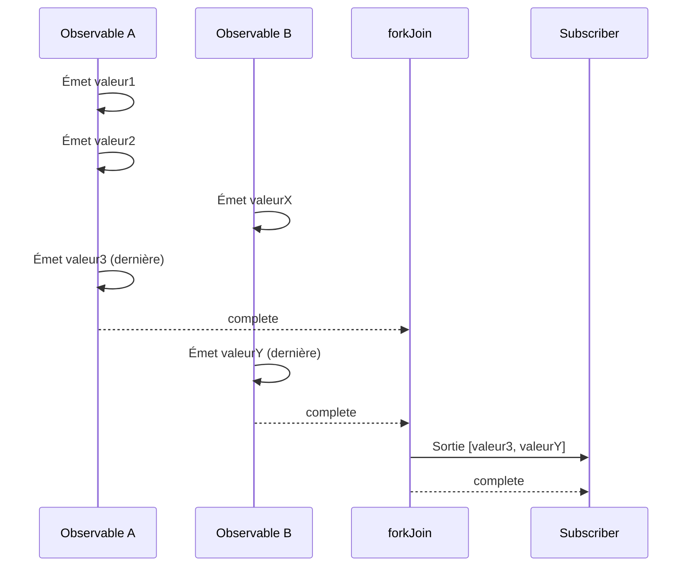
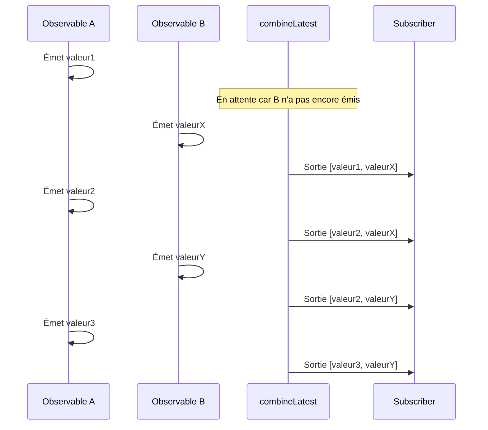

# Différence entre forkJoin et combineLatest

Lors de la combinaison de plusieurs Observables dans RxJS, `forkJoin` et `combineLatest` sont les Creation Functions les plus couramment utilisées. Cependant, ces deux ont des **comportements significativement différents**, et les utiliser incorrectement ne produira pas les résultats attendus.

Cette page compare minutieusement les deux à l'aide de diagrammes et d'exemples pratiques, rendant clair "lequel utiliser."

## Conclusion : Différence entre forkJoin et combineLatest

| Caractéristique | forkJoin | combineLatest |
|-----------------|----------|---------------|
| **Timing de sortie** | **Une fois** après que tout soit terminé | **À chaque fois** qu'une valeur est mise à jour |
| **Valeur de sortie** | **Dernière valeur** de chaque Observable | **Valeur la plus récente** de chaque Observable |
| **Condition de complétion** | Tous les Observables terminent | Tous les Observables terminent |
| **Cas d'utilisation principaux** | Appels API parallèles, chargement initial | Surveillance de formulaire, sync temps réel |
| **Flux infinis** | ❌ Ne peut pas utiliser | ✅ Peut utiliser (émet des valeurs même sans complétion) |

> [!TIP]
> **Façon simple de retenir**
> - `forkJoin` = "Une fois que tout le monde est prêt, **partir une fois**" (similaire à Promise.all)
> - `combineLatest` = "**Rapporter le dernier statut** chaque fois que quelqu'un bouge"

## Comprendre les différences de comportement avec des diagrammes

### Comportement de forkJoin

### Comportement de combineLatest

## Quand utiliser lequel (Guide cas par cas)

### Cas pour utiliser forkJoin

- **Appels API parallèles** : Quand vous voulez traiter seulement après que toutes les données soient prêtes
- **Chargement initial de données** : Récupérer toutes les données maîtres nécessaires au démarrage

> [!WARNING]
> `forkJoin` ne peut pas être utilisé avec des **Observables qui ne terminent jamais** (`interval`, WebSocket, flux d'événements, etc.).

### Cas pour utiliser combineLatest

- **Surveillance d'entrée de formulaire en temps réel** : Combiner plusieurs valeurs d'entrée pour la validation
- **Synchronisation temps réel de plusieurs flux** : Affichage intégré de données de capteurs
- **Combinaison de conditions de filtre** : Exécuter la recherche quand une condition change

## Résumé

| Critère de sélection | forkJoin | combineLatest |
|---------------------|----------|---------------|
| Traiter une fois quand tout est prêt | ✅ | ❌ |
| Traiter à chaque changement de valeur | ❌ | ✅ |
| Flux non-terminants | ❌ | ✅ |
| Utilisation type Promise.all | ✅ | ❌ |
| Synchronisation temps réel | ❌ | ✅ |

## Pages connexes

- **[forkJoin](/fr/guide/creation-functions/combination/forkJoin)** - Explication détaillée de forkJoin
- **[combineLatest](/fr/guide/creation-functions/combination/combineLatest)** - Explication détaillée de combineLatest
- **[zip](/fr/guide/creation-functions/combination/zip)** - Apparier les valeurs correspondantes
- **[merge](/fr/guide/creation-functions/combination/merge)** - Exécuter plusieurs Observables en parallèle
