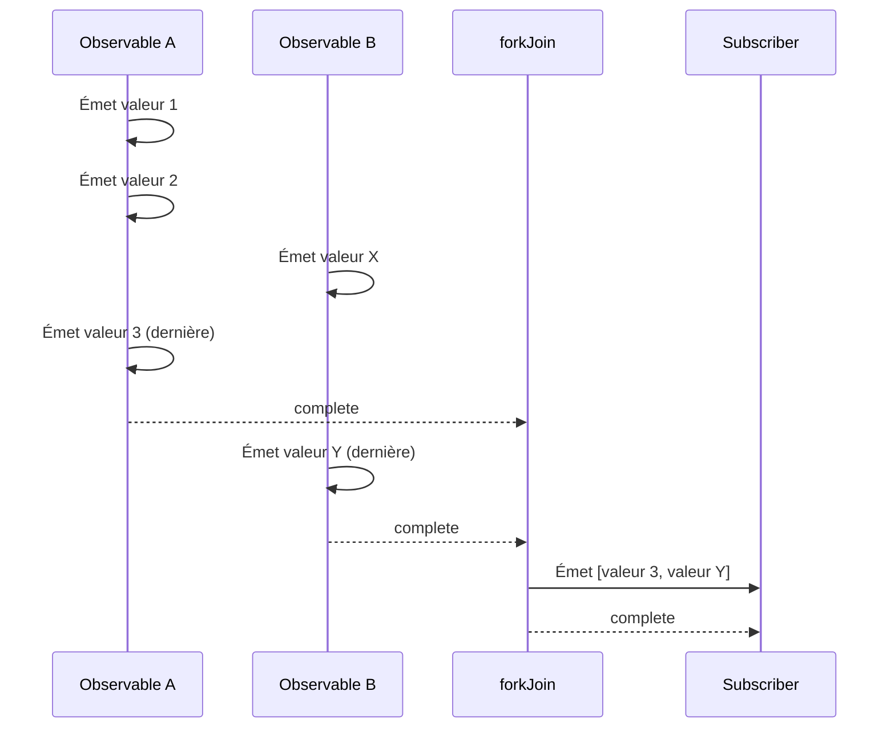
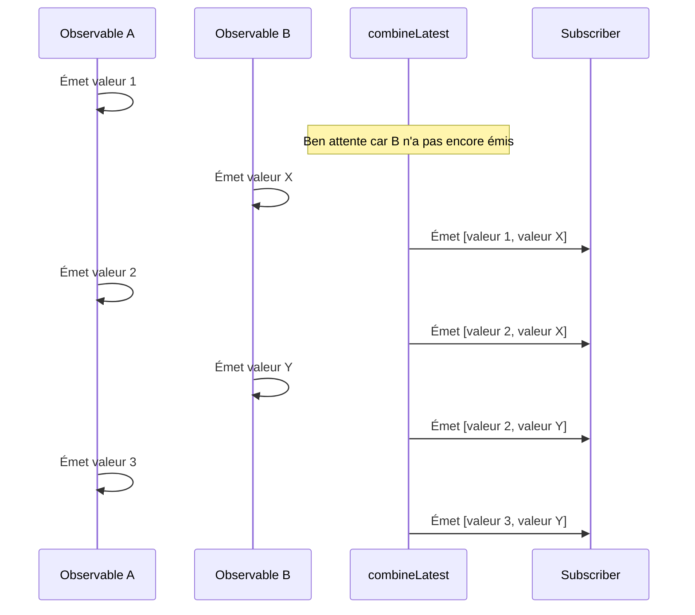
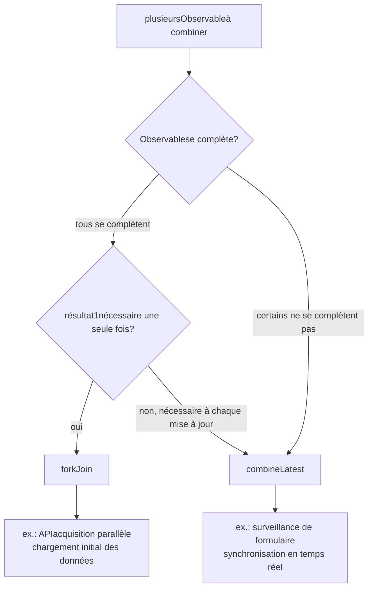

# Différence entre forkJoin et combineLatest

Lorsque l'on combine plusieurs Observables dans RxJS, `forkJoin` et `combineLatest` sont les fonctions de création les plus couramment utilisées. Cependant, ces deux fonctions **se comportent de manière très différente** et si elles ne sont pas utilisées correctement, elles ne produiront pas les résultats escomptés.

Cette page compare minutieusement les différences entre les deux, avec des illustrations et des exemples pratiques, afin de clarifier laquelle vous devez utiliser.

## Conclusion : la différence entre forkJoin et combineLatest

| Caractéristique | forkJoin | combineLatest |
|------|----------|---------------|
| **Timing d'émission** | **Une seule fois** après que tous sont terminés | **À chaque mise à jour** d'une valeur |
| **Valeurs émises** | La **dernière valeur** de chaque Observable | La **valeur la plus récente** de chaque Observable |
| **Condition de complétion** | Tous les Observables doivent se compléter | Tous les Observables doivent se compléter |
| **Cas d'usage principal** | Acquisition parallèle d'API, chargement initial | Surveillance de formulaire, synchronisation temps réel |
| **Flux infini** | ❌ Inutilisable (car il ne se complète pas) | ✅ Utilisable (émet sans se compléter) |

> [!TIP]
> **Facile à retenir**
> - `forkJoin` = « partir **une seule fois** quand tout le monde est présent » (similaire à Promise.all)
> - `combineLatest` = « **rapporter le dernier état** à chaque fois que quelqu'un bouge »

## Comprendre les différences de comportement avec les illustrations

### Comportement de forkJoin


```mermaid
sequenceDiagram
    participant A as Observable A
    participant B as Observable B
    participant F as forkJoin
    participant S as Subscriber

    A->>A: Émet valeur 1
    A->>A: Émet valeur 2
    B->>B: Émet valeur X
    A->>A: Émet valeur 3 (dernière)
    A-->>F: complete
    B->>B: Émet valeur Y (dernière)
    B-->>F: complete
    F->>S: Émet [valeur 3, valeur Y]
    F-->>S: complete
```

**Point** : attendre que tous les Observables soient `complete` et n'émettre **que la dernière valeur** une seule fois.

### Comportement de combineLatest


```mermaid
sequenceDiagram
    participant A as Observable A
    participant B as Observable B
    participant C as combineLatest
    participant S as Subscriber

    A->>A: Émet valeur 1
    Note over C: Ben attente car B n'a pas encore émis
    B->>B: Émet valeur X
    C->>S: Émet [valeur 1, valeur X]
    A->>A: Émet valeur 2
    C->>S: Émet [valeur 2, valeur X]
    B->>B: Émet valeur Y
    C->>S: Émet [valeur 2, valeur Y]
    A->>A: Émet valeur 3
    C->>S: Émet [valeur 3, valeur Y]
```

**Point** : une fois que tous les Observables ont émis leur première valeur, ils continueront à émettre la dernière combinaison **à chaque fois que l'un d'entre eux est mis à jour**.

## Différences observées dans la chronologie


```mermaid
gantt
    title forkJoin vs Timing d'émission de combineLatest
    dateFormat X
    axisFormat %s

    section Observable A
    valeur1 :a1, 0, 1
    valeur2 :a2, 2, 1
    valeur3 :a3, 4, 1
    complete :milestone, a_done, 5, 0

    section Observable B
    valeurX :b1, 1, 1
    valeurY :b2, 3, 1
    complete :milestone, b_done, 4, 0

    section forkJoinémission
    [valeur3,valeurY] :crit, fork_out, 5, 1

    section combineLatestémission
    [valeur1,valeurX] :c1, 1, 1
    [valeur2,valeurX] :c2, 2, 1
    [valeur2,valeurY] :c3, 3, 1
    [valeur3,valeurY] :c4, 4, 1
```

## Comparaison pratique : vérifier le comportement avec la même source de données

Appliquons `forkJoin` et `combineLatest` au même Observable et vérifions les différences dans la sortie.

```ts
import { forkJoin, combineLatest, interval, take, map } from 'rxjs';

// créer la zone d'affichage
const output = document.createElement('div');
output.innerHTML = '<h3>Comparaison forkJoin vs combineLatest:</h3>';
document.body.appendChild(output);

// Créer 2 Observables
const obs1$ = interval(1000).pipe(
  take(3),
  map(i => `A${i}`)
);

const obs2$ = interval(1500).pipe(
  take(2),
  map(i => `B${i}`)
);

// Zone d'affichage du résultat forkJoin
const forkJoinResult = document.createElement('div');
forkJoinResult.innerHTML = '<h4>forkJoin:</h4><div id="forkjoin-output">en attente...</div>';
output.appendChild(forkJoinResult);

// Zone d'affichage du résultat combineLatest
const combineLatestResult = document.createElement('div');
combineLatestResult.innerHTML = '<h4>combineLatest:</h4><div id="combinelatest-output"></div>';
output.appendChild(combineLatestResult);

// forkJoin：après complétion1n'émet qu'une fois
forkJoin([obs1$, obs2$]).subscribe(result => {
  const el = document.getElementById('forkjoin-output');
  if (el) {
    el.textContent = `émission: [${result.join(', ')}]`;
    el.style.color = 'green';
    el.style.fontWeight = 'bold';
  }
});

// combineLatest：émet à chaque mise à jour
const combineOutput = document.getElementById('combinelatest-output');
combineLatest([obs1$, obs2$]).subscribe(result => {
  if (combineOutput) {
    const item = document.createElement('div');
    item.textContent = `émission: [${result.join(', ')}]`;
    combineOutput.appendChild(item);
  }
});
```

**Résultat de l'exécution** :
- `forkJoin` : émet `[A2, B1]` **une seule fois** après environ 3 secondes
- `combineLatest` : émet **4 fois** à partir de 1,5 s environ (ex : `[A0, B0]` → `[A1, B0]` → `[A2, B0]` → `[A2, B1]`)

> [!NOTE]
> L'ordre de sortie de `combineLatest` dépend de la programmation du timer et peut varier selon l'environnement. Le point important est qu'une valeur est émise à chaque fois que l'une d'elles est mise à jour. Dans l'exemple ci-dessus, l'émission se fait 4 fois, mais l'ordre peut changer, par exemple `[A1, B0]` → `[A1, B1]`.

## Lequel utiliser (guide par cas)

### Cas où il faut utiliser forkJoin

#### 1. Acquisition parallèle de plusieurs API

Lorsque vous souhaitez traiter les données une fois toutes disponibles.

```ts
import { forkJoin } from 'rxjs';
import { ajax } from 'rxjs/ajax';

// récupérer simultanément les infos utilisateur et la config
forkJoin({
  user: ajax.getJSON('/api/user/123'),
  settings: ajax.getJSON('/api/settings'),
  notifications: ajax.getJSON('/api/notifications')
}).subscribe(({ user, settings, notifications }) => {
  // rendre l'écran une fois toutes les données reçues
  renderDashboard(user, settings, notifications);
});
```

#### 2. Acquisition groupée des données au chargement initial

Récupérer en bloc les données de base nécessaires au démarrage de l'application.

```ts
import { forkJoin } from 'rxjs';
import { ajax } from 'rxjs/ajax';

function loadInitialData() {
  return forkJoin({
    categories: ajax.getJSON('/api/categories'),
    countries: ajax.getJSON('/api/countries'),
    currencies: ajax.getJSON('/api/currencies')
  });
}
```

> [!WARNING]
> `forkJoin` ne peut pas être utilisé avec des **Observables qui ne se terminent pas** (par exemple `interval`, WebSocket, flux d'événements). S'il ne se termine pas, il continuera à attendre indéfiniment.

### Cas où il faut utiliser combineLatest

#### 1. Surveillance en temps réel de la saisie d'un formulaire

Combiner plusieurs valeurs de saisie pour mettre à jour la validation et l'affichage.

```ts
import { combineLatest, fromEvent } from 'rxjs';
import { map, startWith } from 'rxjs';

const name$ = fromEvent(nameInput, 'input').pipe(
  map(e => (e.target as HTMLInputElement).value),
  startWith('')
);

const email$ = fromEvent(emailInput, 'input').pipe(
  map(e => (e.target as HTMLInputElement).value),
  startWith('')
);

const age$ = fromEvent(ageInput, 'input').pipe(
  map(e => parseInt((e.target as HTMLInputElement).value) || 0),
  startWith(0)
);

// exécuter la validation à chaque changement d'entrée
combineLatest([name$, email$, age$]).subscribe(([name, email, age]) => {
  const isValid = name.length > 0 && email.includes('@') && age >= 18;
  submitButton.disabled = !isValid;
});
```

#### 2. Synchronisation en temps réel de plusieurs flux

Affichage intégré des données de capteurs et de l'état.

```ts
import { combineLatest, interval } from 'rxjs';
import { map } from 'rxjs';

const temperature$ = interval(2000).pipe(map(() => 20 + Math.random() * 10));
const humidity$ = interval(3000).pipe(map(() => 40 + Math.random() * 30));
const pressure$ = interval(2500).pipe(map(() => 1000 + Math.random() * 50));

combineLatest([temperature$, humidity$, pressure$]).subscribe(
  ([temp, humidity, pressure]) => {
    updateDashboard({ temp, humidity, pressure });
  }
);
```

#### 3. Combinaison de conditions de filtre

Lancer une recherche à chaque fois que plusieurs conditions de filtre changent.

```ts
import { combineLatest, BehaviorSubject } from 'rxjs';
import { debounceTime, switchMap } from 'rxjs';

const searchText$ = new BehaviorSubject('');
const category$ = new BehaviorSubject('all');
const sortOrder$ = new BehaviorSubject('asc');

combineLatest([searchText$, category$, sortOrder$]).pipe(
  debounceTime(300),
  switchMap(([text, category, sort]) =>
    fetchProducts({ text, category, sort })
  )
).subscribe(products => {
  renderProductList(products);
});
```

## Organigramme d'utilisation


```mermaid
flowchart TD
    A[plusieursObservableà combiner] --> B{Observablese complète?}
    B -->|tous se complètent| C{résultat1nécessaire une seule fois?}
    B -->|certains ne se complètent pas| D[combineLatest]
    C -->|oui| E[forkJoin]
    C -->|non, nécessaire à chaque mise à jour| D

    E --> E1[ex.: APIacquisition parallèle<br>chargement initial des données]
    D --> D1[ex.: surveillance de formulaire<br>synchronisation en temps réel]
```

## Erreurs courantes et remèdes

### Erreur 1 : utiliser forkJoin sur un Observable qui ne se termine pas

```ts
// ❌ ne sera jamais émis
forkJoin([
  interval(1000),  // ne se complète pas
  ajax.getJSON('/api/data')
]).subscribe(console.log);

// ✅ takele compléter aveccombineLatestutiliser
forkJoin([
  interval(1000).pipe(take(5)),  // 5se complète en
  ajax.getJSON('/api/data')
]).subscribe(console.log);
```

### Erreur 2 : pas de valeur initiale dans combineLatest

```ts
// ❌ name$jusqu'à ce que B émetteemail$même s'il y a des valeurs, rien n'est émis
combineLatest([name$, email$]).subscribe(console.log);

// ✅ startWithdéfinir une valeur initiale avec
combineLatest([
  name$.pipe(startWith('')),
  email$.pipe(startWith(''))
]).subscribe(console.log);
```

## Résumé

| Critère de sélection | forkJoin | combineLatest |
|----------|----------|---------------|
| Traitement une seule fois quand tous sont prêts | ✅ | ❌ |
| Traitement à chaque changement de valeur | ❌ | ✅ |
| Flux qui ne se complètent pas | ❌ | ✅ |
| Usage type Promise.all | ✅ | ❌ |
| Synchronisation en temps réel | ❌ | ✅ |

> [!IMPORTANT]
> **Principe d'utilisation**
> - **forkJoin** : « une seule fois quand tout le monde est présent » → acquisition parallèle d'API, chargement initial
> - **combineLatest** : « mise à jour à chaque fois que quelqu'un bouge » → surveillance de formulaires, UI en temps réel

## Pages connexes

- **[forkJoin](/fr/guide/creation-functions/combination/forkJoin)** - Explication détaillée de forkJoin
- **[combineLatest](/fr/guide/creation-functions/combination/combineLatest)** - Explication détaillée de combineLatest
- **[zip](/fr/guide/creation-functions/combination/zip)** - Apparier les valeurs correspondantes
- **[merge](/fr/guide/creation-functions/combination/merge)** - Exécuter plusieurs Observables en parallèle
- **[withLatestFrom](/fr/guide/operators/combination/withLatestFrom)** - Seul le flux principal déclenche
