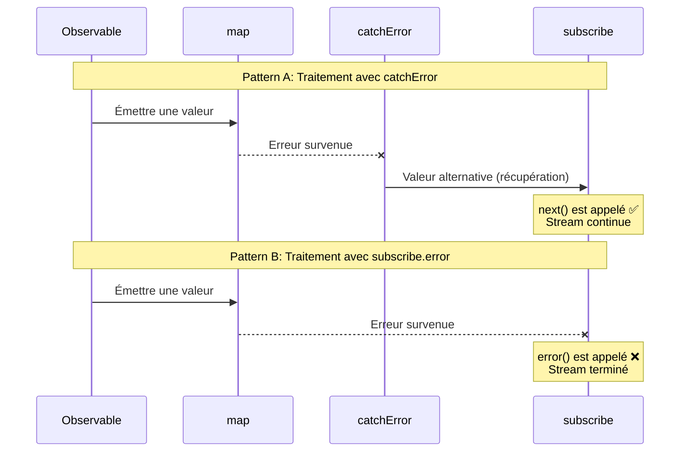
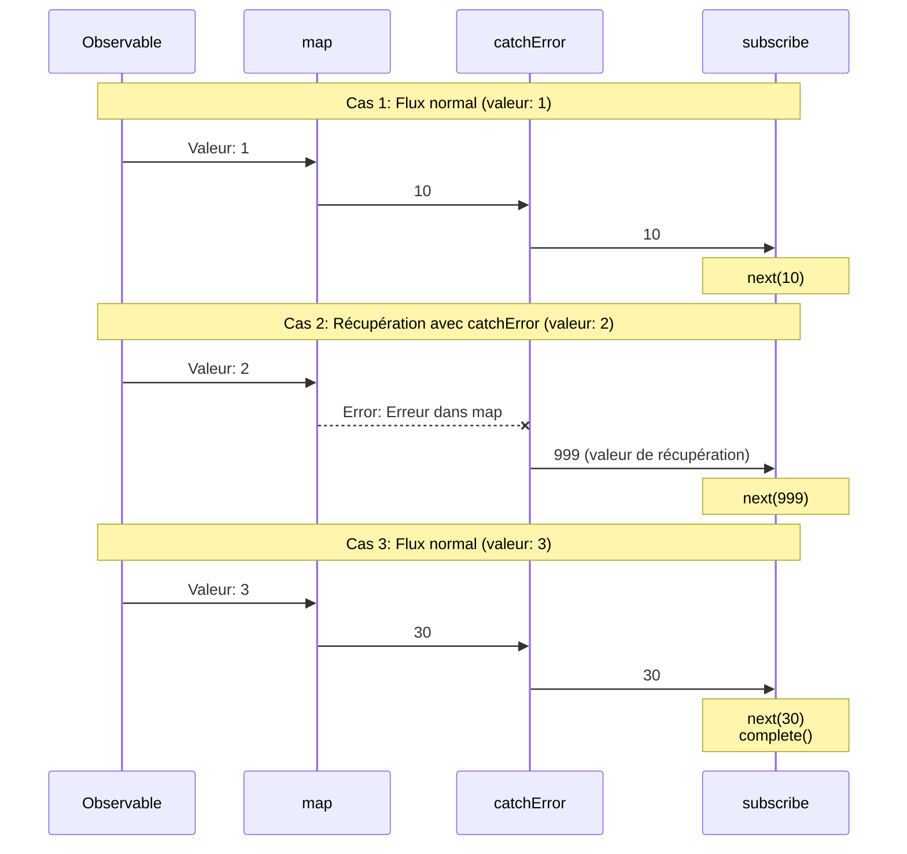
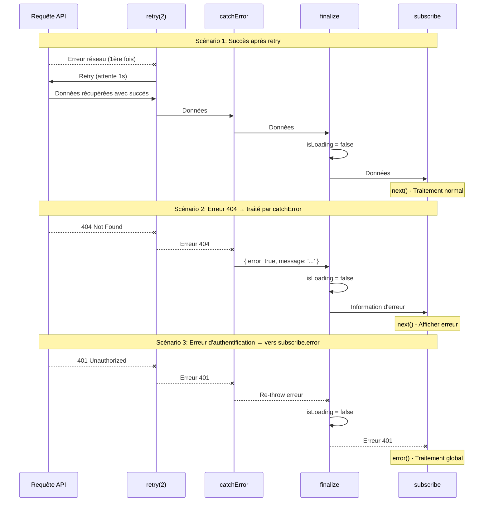
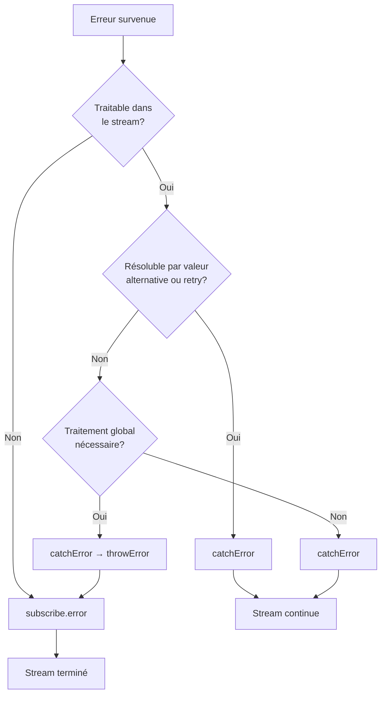

# Emplacements de gestion d'erreurs

Lors du traitement des erreurs dans RxJS, « où » capturer l'erreur est une décision de conception importante. RxJS a deux emplacements principaux pour la gestion des erreurs : l'opérateur `catchError` dans le pipeline et le callback `error` dans le `subscribe` final. Cette page explique les différences entre les deux et leur utilisation appropriée.

## Les deux emplacements de gestion des erreurs

La gestion des erreurs dans RxJS a deux emplacements principaux :

1. **Dans le pipeline** - `.pipe(catchError(...))`
2. **Lors de la souscription** - `subscribe({ error: ... })`

En comprenant cette différence, vous pouvez construire une stratégie de gestion des erreurs robuste et maintenable.

## Tableau comparatif : catchError vs subscribe.error

Le tableau suivant résume les principales différences entre les deux approches.

| Élément | `.pipe(catchError(...))` | `subscribe({ error: ... })` |
|------|-------------------------|----------------------------|
| **Timing du traitement** | Dans le pipeline (traitement intermédiaire) | Lors de la souscription finale (point final) |
| **Type d'erreurs** | Erreurs survenues dans le stream | Erreurs non capturées |
| **Usage principal** | Récupération, transformation, retry des erreurs | Notification finale d'erreur, journalisation |
| **Continuité du stream** | Peut continuer en retournant un Observable alternatif | Stream terminé (plus de valeurs émises) |
| **Possibilité de récupération** | ✅ Possible (valeur alternative ou retry) | ❌ Impossible (terminé) |
| **Emplacements multiples** | ✅ Possible (plusieurs dans le pipeline) | ⚠️ Un seul par subscribe |
| **Type de retour** | Doit retourner `Observable<T>` | `void` (ne retourne rien) |

### Diagramme de séquence : Différence entre catchError et subscribe.error

Le diagramme suivant montre visuellement la différence entre le traitement avec `catchError` et avec `subscribe.error`.



#### Points importants de ce diagramme

**Pattern A (utilisation de catchError) :**
- Même si une erreur se produit, `catchError` retourne une valeur alternative, donc `next()` de `subscribe` est appelé
- Le stream continue et les valeurs suivantes peuvent être traitées
- « Récupère » de l'erreur et revient à un stream normal

**Pattern B (utilisation de subscribe.error) :**
- Quand l'erreur atteint `subscribe`, le callback `error()` est appelé
- Le stream se termine et plus aucune valeur ne passe
- « Notifie » l'erreur et termine le stream

## Comprendre le flux des erreurs

Voyons avec un exemple de code réel comment les erreurs circulent.

```typescript
import { of, map, catchError } from 'rxjs';
of(1, 2, 3).pipe(
  map(x => {
    if (x === 2) throw new Error('Erreur dans map');  // ①
    return x * 10;
  }),
  catchError(err => {
    console.log('Capturé par catchError:', err.message);  // ②
    return of(999); // Récupération
  })
).subscribe({
  next: val => console.log('Valeur:', val),
  error: err => console.log('Capturé par subscribe.error:', err), // ③
  complete: () => console.log('Terminé')
});

// Sortie:
// Valeur: 10
// Capturé par catchError: Erreur dans map (← traité en ②)
// Valeur: 999 (← récupération réussie)
// Valeur: 30
// Terminé
```

Dans cet exemple,
1. Une erreur se produit dans `map` (①)
2. `catchError` capture l'erreur et récupère (②)
3. `subscribe.error` n'est pas appelé (car l'erreur a été traitée)

> [!TIP] Flux des erreurs
> Les erreurs traitées par `catchError` n'atteignent pas `subscribe.error`. `catchError` a le rôle de « traiter l'erreur et revenir à un stream normal ».

### Diagramme de séquence : Flux des erreurs (3 cas)

Le diagramme suivant montre comment les erreurs se propagent dans 3 cas.



#### Comme le montre ce diagramme
- **Cas 1 et 3** : Sans erreur, les valeurs passent de `map` → `catchError` → `subscribe` dans l'ordre
- **Cas 2** : Quand une erreur se produit dans `map`, `catchError` la capture et retourne une valeur de récupération (999)
- Les erreurs traitées par `catchError` n'atteignent pas `subscribe.error`

## Erreurs capturées par catchError

`catchError` dans le pipeline peut capturer les erreurs suivantes.

| Source de l'erreur | Exemple | Traitable par catchError |
|----------------|-----|---------------------|
| throw dans un opérateur | `map(x => { throw new Error() })` | ✅ |
| Erreur HTTP | `ajax.get('/api').pipe(catchError(...))` | ✅ |
| Erreur dans switchMap | `switchMap(() => throwError(...))` | ✅ |
| Observable personnalisé | `new Observable(sub => sub.error(...))` | ✅ |
| reject de Promise | `from(Promise.reject(...))` | ✅ |

### Exemple pratique : Traitement graduel des erreurs API

```typescript
import { of, throwError, catchError, switchMap } from 'rxjs';
import { ajax } from 'rxjs/ajax';

// Traitement des erreurs API avec catchError
ajax.get('/api/user/123').pipe(
  catchError(err => {
    if (err.status === 404) {
      // Erreur 404 → retourner un utilisateur par défaut
      return of({ id: 123, name: 'Utilisateur par défaut' });
    }
    // Autres erreurs re-throw (vers subscribe.error)
    return throwError(() => err);
  }),
  switchMap(user => {
    // Après avoir obtenu l'utilisateur, récupérer le profil
    return ajax.get(`/api/profile/${user.id}`);
  }),
  catchError(err => {
    console.log('Erreur de récupération du profil:', err);
    // Continuer sans profil
    return of(null);
  })
).subscribe({
  next: profile => console.log('Profil:', profile),
  error: err => console.log('Erreur finale:', err) // Seulement les erreurs non traitées par catchError
});
```

> [!IMPORTANT] Placer plusieurs catchError
> En plaçant plusieurs `catchError` dans le pipeline, vous pouvez traiter individuellement les erreurs à différentes étapes. Cela permet une gestion fine des erreurs.

## Erreurs capturées par subscribe.error

Le callback `error` de `subscribe` capture les erreurs suivantes.

| Type d'erreur | Description | Exemple |
|------------|------|-----|
| **Erreur non traitée par catchError** | Erreur non traitée dans le pipeline | Erreur propagée telle quelle |
| **Re-throw après catchError** | Erreur explicitement re-throw dans catchError | `catchError(e => throwError(() => e))` |

### Exemple pratique : Traitement graduel des erreurs et re-throw

```typescript
import { of, throwError, map, catchError } from 'rxjs';
// Pattern 1: Erreur non traitée par catchError
throwError(() => new Error('Erreur non traitée')).subscribe({
  next: val => console.log('Valeur:', val),
  error: err => console.log('subscribe.error:', err.message)
  // Sortie: subscribe.error: Erreur non traitée
});

// Pattern 2: Re-throw dans catchError
of(1).pipe(
  map(() => { throw new Error('Erreur dans map'); }),
  catchError(err => {
    console.log('Capturé par catchError:', err.message);
    // Après journalisation, re-throw de l'erreur
    return throwError(() => new Error('Erreur re-throw'));
  })
).subscribe({
  next: val => console.log('Valeur:', val),
  error: err => console.log('subscribe.error:', err.message)
  // Sortie:
  // Capturé par catchError: Erreur dans map
  // subscribe.error: Erreur re-throw
});
```

> [!WARNING] À propos des erreurs dans subscribe
> `throw` dans les callbacks `next` et `complete` de `subscribe` **n'est pas recommandé**. La gestion des erreurs doit toujours être faite dans le pipeline (`catchError`). throw dans subscribe peut causer un comportement indéfini.

## Critères de choix

Le choix dépend de « où vous voulez traiter l'erreur ».

### Cas où utiliser catchError

Utilisez `catchError` si les conditions suivantes s'appliquent.

- ✅ **Vous voulez terminer le traitement dans le stream**
- ✅ **Vous pouvez fournir une valeur alternative ou des données de fallback**
- ✅ **Il y a une possibilité de résolution par retry**
- ✅ **Vous voulez transformer l'erreur et passer à un autre Observable**
- ✅ **Vous voulez continuer le traitement suivant**

#### Pattern 1 : Format unifié pour succès et erreur

```typescript
import { of, throwError, catchError, map } from 'rxjs';
interface User {
  id: number;
  name: string;
}

interface ApiResult {
  success: boolean;
  data?: User[];
  error?: string;
}

// Simulation d'appel API (exemple qui génère une erreur)
function fetchUsers(shouldFail: boolean) {
  if (shouldFail) {
    return throwError(() => new Error('Erreur réseau'));
  }
  return of<User[]>([
    { id: 1, name: 'Yamada Taro' },
    { id: 2, name: 'Sato Hanako' }
  ]);
}

fetchUsers(true).pipe(
  // Succès: transformer en { success: true, data: [...] }
  map(users => ({ success: true, data: users } as ApiResult)),
  // Erreur: transformer en { success: false, error: '...' }
  catchError(err => {
    return of<ApiResult>({
      success: false,
      error: 'Échec de récupération des utilisateurs'
    });
  })
).subscribe(result => {
  // Traitement uniforme pour succès et erreur
  if (result.success) {
    console.log('Utilisateurs:', result.data);
  } else {
    console.log('Erreur survenue:', result.error);
  }
});

// Sortie: Erreur survenue: Échec de récupération des utilisateurs
```

#### Pattern 2 : Retour simple d'une valeur par défaut

```typescript
import { of, throwError, catchError } from 'rxjs';
interface User {
  id: number;
  name: string;
}

// Simulation d'appel API (exemple qui génère une erreur)
function fetchUsers(shouldFail: boolean) {
  if (shouldFail) {
    return throwError(() => new Error('Erreur réseau'));
  }
  return of<User[]>([
    { id: 1, name: 'Yamada Taro' },
    { id: 2, name: 'Sato Hanako' }
  ]);
}

fetchUsers(true).pipe(
  catchError(err => {
    console.error('Une erreur s\'est produite:', err.message);
    // Retourner un tableau vide comme valeur par défaut
    return of<User[]>([]);
  })
).subscribe(users => {
  if (users.length === 0) {
    console.log('Aucun utilisateur trouvé');
  } else {
    console.log('Utilisateurs:', users);
  }
});

// Sortie:
// Une erreur s'est produite: Erreur réseau
// Aucun utilisateur trouvé
```

### Cas où utiliser subscribe.error

Utilisez `subscribe.error` si les conditions suivantes s'appliquent.

- ✅ **Vous voulez traiter avec un gestionnaire d'erreurs global**
- ✅ **Un traitement affectant toute l'application est nécessaire**
- ✅ **Vous voulez envoyer les logs d'erreur au serveur**
- ✅ **Vous voulez terminer le stream**
- ✅ **Traitement d'erreur en dernière ligne de défense**

```typescript
import { throwError, catchError, retry } from 'rxjs';
import { ajax } from 'rxjs/ajax';

ajax.getJSON('/api/critical-data').pipe(
  retry(2),
  catchError(err => {
    if (err.status === 401) {
      // Erreur d'authentification re-throw (traitement global)
      return throwError(() => err);
    }
    // Autres traitements
    return throwError(() => new Error('Échec de récupération des données'));
  })
).subscribe({
  next: data => console.log('Données:', data),
  error: err => {
    // Gestionnaire d'erreurs global
    globalErrorHandler.handle(err);
    // Navigation vers page d'erreur
    router.navigate(['/error']);
  }
});
```

## Pattern pratique : Gestion hiérarchique des erreurs

En pratique, une gestion hiérarchique combinant `catchError` et `subscribe.error` est efficace.

```typescript
import { of, throwError, catchError, retry, finalize } from 'rxjs';
import { ajax } from 'rxjs/ajax';

function fetchUserData(userId: string) {
  let isLoading = true;

  return ajax.getJSON(`/api/users/${userId}`).pipe(
    // Niveau 1: Erreurs réseau avec possibilité de retry
    retry({ count: 2, delay: 1000 }),

    // Niveau 2: Erreurs récupérables
    catchError((error) => {
      if (error.status === 404) {
        // 404 → continuer avec données par défaut
        return of({
          error: true,
          message: 'Utilisateur non trouvé',
          data: null
        });
      } else if (error.status >= 500) {
        // 500+ → continuer avec message d'erreur
        return of({
          error: true,
          message: 'Une erreur serveur s\'est produite',
          data: null
        });
      }
      // Autres erreurs re-throw (vers subscribe.error)
      return throwError(() => error);
    }),

    // Niveau 3: Nettoyage toujours exécuté
    finalize(() => {
      isLoading = false;
      console.log('Chargement terminé');
    })
  );
}

// Exemple d'utilisation
fetchUserData('123').subscribe({
  next: (result) => {
    if (result.error) {
      // Erreur traitée par catchError (afficher dans l'UI)
      console.error('Erreur utilisateur:', result.message);
      showUserFriendlyError(result.message);
    } else {
      // Données normales
      console.log('Données utilisateur:', result.data);
      displayUserData(result.data);
    }
  },
  error: (err) => {
    // Erreur fatale non traitée par catchError
    console.error('Erreur fatale:', err);
    // Notifier le gestionnaire d'erreurs global
    globalErrorHandler.handle(err);
    // Naviguer vers page d'erreur
    navigateToErrorPage();
  },
  complete: () => console.log('Traitement terminé')
});

// Fonctions utilitaires
function showUserFriendlyError(message: string) {
  console.log('Affichage erreur dans l\'UI:', message);
}
function displayUserData(data: any) {
  console.log('Affichage données dans l\'UI:', data);
}
function navigateToErrorPage() {
  console.log('Navigation vers page d\'erreur');
}

// Gestionnaire d'erreurs global
const globalErrorHandler = {
  handle(err: any) {
    console.error('Erreur globale:', err);
    // Envoyer le log d'erreur au serveur
    // sendErrorLog(err);
  }
};
```

> [!TIP] Avantages de la gestion hiérarchique des erreurs
> - **Niveau 1 (retry)** : Récupération automatique des erreurs réseau temporaires
> - **Niveau 2 (catchError)** : Fournir des messages d'erreur conviviaux
> - **Niveau 3 (subscribe.error)** : Traiter les erreurs inattendues en dernière ligne de défense
> - **finalize** : Toujours nettoyer les ressources

### Diagramme de séquence : Flux de gestion hiérarchique des erreurs

Le diagramme suivant montre le flux de gestion hiérarchique des erreurs : retry → catchError → finalize → subscribe.



#### Comme le montre ce diagramme
- **Scénario 1** : Les erreurs temporaires sont récupérées par `retry` et les données sont récupérées normalement
- **Scénario 2** : L'erreur 404 est capturée par `catchError` et transformée en message convivial
- **Scénario 3** : L'erreur d'authentification est re-throw par `catchError` et gérée de manière centralisée par `subscribe.error`
- **Tous les scénarios** : `finalize` s'exécute toujours et réinitialise l'état de chargement

## Guide de choix par scénario

Voici un guide sur lequel utiliser selon le scénario réel.

| Scénario | Recommandé | Raison |
|---------|------|------|
| 404 Not Found → Afficher valeur par défaut | `catchError` | Peut retourner une valeur alternative dans le stream |
| Erreur réseau temporaire → Retry | `catchError` | Continuer le traitement après retry |
| Erreur d'authentification (401) → Écran de connexion | Les deux possibles | catchError pour redirection ou subscribe.error pour gestion centralisée |
| Erreur serveur 500 → Page d'erreur | Les deux possibles | catchError si retry, subscribe.error si terminer immédiatement |
| Erreur de validation → Afficher dans le formulaire | `catchError` | Passer les informations d'erreur à l'UI pour affichage |
| Erreur inattendue → Envoi de logs | `subscribe.error` | Journaliser en dernière ligne de défense |

### Exemple de traitement flexible des erreurs d'authentification

Les erreurs d'authentification (401) peuvent être gérées par les deux approches selon la conception.

```typescript
import { throwError, EMPTY, catchError } from 'rxjs';
import { ajax } from 'rxjs/ajax';

// Approche 1: Redirection avec catchError (terminer dans le stream)
ajax.getJSON('/api/protected-data').pipe(
  catchError(err => {
    if (err.status === 401) {
      // Traiter l'erreur d'authentification avec catchError
      router.navigate(['/login']);
      return EMPTY; // Vider le stream et terminer
    }
    return throwError(() => err);
  })
).subscribe({
  next: data => console.log('Données:', data)
});

// Approche 2: Gestion centralisée avec subscribe.error
ajax.getJSON('/api/protected-data').pipe(
  catchError(err => {
    // Re-throw les erreurs d'authentification (traitement global)
    if (err.status === 401) {
      return throwError(() => err);
    }
    // Traiter les autres
    return throwError(() => err);
  })
).subscribe({
  next: data => console.log('Données:', data),
  error: err => {
    if (err.status === 401) {
      // Gestionnaire d'authentification global
      authService.handleUnauthorized();
    }
  }
});
```

> [!NOTE] Choix de conception
> Pour les erreurs affectant toute l'application comme les erreurs d'authentification, l'emplacement du traitement est déterminé par la politique de conception du projet.
> - **Traitement distribué** : Traitement individuel pour chaque appel API (catchError)
> - **Gestion centralisée** : Traitement unifié avec un gestionnaire d'erreurs global (subscribe.error)

## Organigramme : Choix de gestion des erreurs



## Bonnes pratiques

### 1. Capturer tôt, re-throw tard

```typescript
import { throwError, catchError, map } from 'rxjs';
import { ajax } from 'rxjs/ajax';

ajax.getJSON('/api/data').pipe(
  // Capturer tôt
  catchError(err => {
    console.log('Log d\'erreur:', err);
    // Si non traitable, re-throw
    return throwError(() => err);
  }),
  map(data => transformData(data)),
  // Capturer aussi les erreurs de transformation
  catchError(err => {
    console.log('Erreur de transformation:', err);
    return throwError(() => err);
  })
).subscribe({
  next: data => console.log('Données:', data),
  error: err => {
    // Gestionnaire d'erreurs final
    globalErrorHandler.handle(err);
  }
});

function transformData(data: any) {
  return data;
}
```

### 2. Distinguer clairement les types d'erreurs

```typescript
import { of, throwError, catchError } from 'rxjs';
import { ajax } from 'rxjs/ajax';

// Types d'erreurs personnalisés
class RecoverableError extends Error {
  constructor(message: string) {
    super(message);
    this.name = 'RecoverableError';
  }
}

class FatalError extends Error {
  constructor(message: string) {
    super(message);
    this.name = 'FatalError';
  }
}

ajax.getJSON('/api/data').pipe(
  catchError(err => {
    if (err.status === 404 || err.status === 500) {
      // Récupérable
      return throwError(() => new RecoverableError(err.message));
    }
    // Erreur fatale
    return throwError(() => new FatalError(err.message));
  })
).subscribe({
  next: data => console.log('Données:', data),
  error: err => {
    if (err instanceof RecoverableError) {
      // Traitement de récupération
      console.log('Erreur récupérable:', err.message);
    } else if (err instanceof FatalError) {
      // Traitement d'erreur fatale
      console.error('Erreur fatale:', err.message);
    }
  }
});
```

### 3. Nettoyage garanti avec finalize

```typescript
import { of, catchError, finalize } from 'rxjs';
import { ajax } from 'rxjs/ajax';

let isLoading = true;
let resourceHandle: any = null;

ajax.getJSON('/api/data').pipe(
  catchError(err => {
    console.log('Traitement d\'erreur:', err);
    return of(null);
  }),
  finalize(() => {
    // Exécuté dans tous les cas (succès ou échec)
    isLoading = false;
    if (resourceHandle) {
      resourceHandle.release();
      resourceHandle = null;
    }
    console.log('Nettoyage terminé');
  })
).subscribe({
  next: data => console.log('Données:', data),
  error: err => console.error('Erreur:', err)
});
```
## Questions fréquentes

::: info **Q: Faut-il écrire à la fois catchError et subscribe.error?**
R: Oui, il est recommandé d'écrire les deux.
`catchError` sert pour les « erreurs traitables »,
`subscribe.error` sert de « dernière ligne de défense pour les erreurs inattendues ».
:::

::: info **Q: Si je fais throwError() dans catchError, où va-t-il?**
R: S'il y a un `catchError` suivant, il y sera capturé, sinon il atteindra `subscribe.error`.
:::


::: info **Q: Peut-on placer plusieurs catchError?**
R: Oui, plusieurs peuvent être placés dans le pipeline. Vous pouvez traiter différentes erreurs à chaque étape.
:::

::: info **Q: Que se passe-t-il si on omet subscribe.error?**
R: Si une erreur se produit, `"Unhandled error"` sera affiché dans la console et l'application peut avoir un comportement inattendu. Il est recommandé de toujours l'écrire.
:::

::: info **Q: Que se passe-t-il si on retourne EMPTY dans catchError?**
R: Le stream se termine immédiatement. `complete()` est appelé sans émettre de valeur. Utilisez-le quand vous voulez ignorer l'erreur.
```typescript
import { EMPTY, catchError } from 'rxjs';
source$.pipe(
  catchError(() => EMPTY) // Ignorer l'erreur et terminer
).subscribe({
  next: val => console.log(val),
  complete: () => console.log('Terminé') // Ceci est appelé
});
```
:::

::: info **Q: Le stream se termine-t-il toujours si une erreur se produit?**
R: Non. Si traité avec `catchError`, le stream continue. Il se termine seulement s'il atteint `subscribe.error`.
:::

::: info **Q: finalize doit-il être placé avant ou après catchError?**
R: Généralement **après catchError**. Cela garantit que le nettoyage s'exécute même après le traitement des erreurs.
```typescript
source$.pipe(
  retry(2),
  catchError(err => of(defaultValue)),
  finalize(() => cleanup()) // Après catchError
)
```
:::

::: info **Q: Quelle est la différence entre catchError et try-catch?**
R: `try-catch` capture uniquement les **erreurs synchrones**, tandis que `catchError` capture toutes les erreurs dans le stream incluant les **erreurs asynchrones** (requêtes HTTP, timers, etc.).
:::

## Résumé

En comprenant les deux emplacements de gestion des erreurs dans RxJS, vous pouvez construire une stratégie efficace de gestion des erreurs.

### Points importants

- **catchError** : Récupérer des erreurs dans le stream et continuer le traitement
- **subscribe.error** : Capturer les erreurs non traitées en dernière ligne de défense
- **Traitement hiérarchique** : La combinaison retry → catchError → finalize → subscribe.error est efficace
- **Distinction claire** : Décider si le traitement peut être terminé dans le stream

> [!IMPORTANT] Principes de conception de la gestion des erreurs
> 1. **Capturer les erreurs tôt, re-throw si nécessaire**
> 2. **Traiter les erreurs récupérables avec catchError**
> 3. **Traiter les erreurs au niveau application avec subscribe.error**
> 4. **Toujours nettoyer les ressources avec finalize**
> 5. **Distinguer clairement les types d'erreurs pour le traitement**

## Sections connexes

- **[Stratégies de gestion des erreurs](/fr/guide/error-handling/strategies)** - Stratégie complète de gestion des erreurs RxJS
- **[retry et catchError](/fr/guide/error-handling/retry-catch)** - Détails sur retry et capture d'erreurs
- **[finalize et complete](/fr/guide/error-handling/finalize)** - Libération des ressources et traitement de complétion
- **[Erreurs courantes et solutions](/fr/guide/anti-patterns/common-mistakes#9-étouffer-les-erreurs)** - Anti-patterns de gestion des erreurs

## Ressources de référence

- [Documentation officielle RxJS - catchError](https://rxjs.dev/api/index/function/catchError)
- [Documentation officielle RxJS - retry](https://rxjs.dev/api/index/function/retry)
- [Learn RxJS - Error Handling](https://www.learnrxjs.io/learn-rxjs/operators/error_handling)
