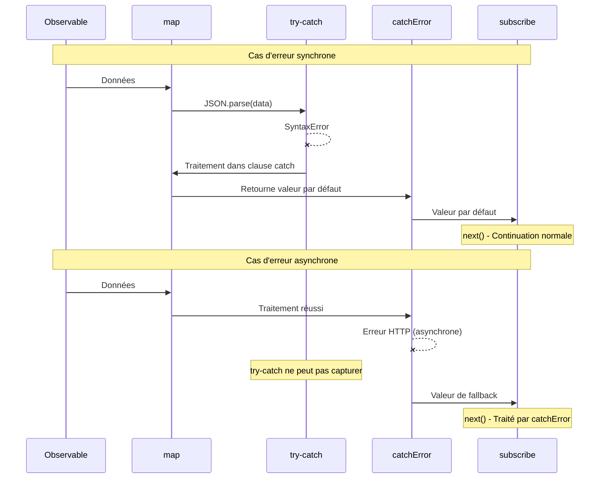

# Intégration de try-catch avec RxJS

JavaScript dispose de `try-catch` comme gestion standard des erreurs, mais RxJS a ses propres mécanismes de gestion des erreurs comme `catchError` et `subscribe.error`. Cette page explique les différences entre les deux et les méthodes appropriées pour les combiner.

## try-catch vs Gestion des erreurs RxJS

### Différences fondamentales

| Élément | try-catch | catchError / subscribe.error |
|------|-----------|------------------------------|
| **Cible** | Code synchrone | Streams asynchrones |
| **Type d'erreurs** | Exceptions JavaScript | Toutes les erreurs dans l'Observable |
| **Portée** | Uniquement dans le bloc try-catch | Tout le pipeline |
| **Support asynchrone** | ❌ Ne peut pas capturer les erreurs asynchrones | ✅ Peut capturer les erreurs asynchrones |
| **Continuité du stream** | - | ✅ Peut continuer avec catchError |

### Erreurs que try-catch ne peut pas capturer

Les erreurs asynchrones suivantes ne peuvent pas être capturées par `try-catch`.

```typescript
import { timer, throwError, mergeMap, catchError } from 'rxjs';
// ❌ try-catch ne peut pas capturer les erreurs asynchrones
try {
  setTimeout(() => {
    throw new Error('Erreur asynchrone');
  }, 1000);
} catch (error) {
  // Ceci ne sera pas exécuté
  console.error('Capturé:', error);
}

// ✅ RxJS peut capturer les erreurs asynchrones

timer(1000).pipe(
  mergeMap(() => throwError(() => new Error('Erreur asynchrone'))),
  catchError(error => {
    console.error('Capturé:', error.message); // ✅ Exécuté
    return of('Valeur par défaut');
  })
).subscribe();
```

> [!IMPORTANT] Limitation de try-catch
> `try-catch` cible uniquement le **code synchrone**. Il ne peut pas capturer les erreurs survenant dans les traitements asynchrones comme setTimeout, requêtes HTTP, Promise, Observable.

## Cas où utiliser try-catch

Même en utilisant RxJS, `try-catch` est nécessaire dans les cas suivants.

### 1. Gestion des erreurs lors du nettoyage des ressources

Dans `finalize` ou `using`, utilisez `try-catch` pour capturer les erreurs lors de la libération des ressources.

```typescript
import { interval, take, finalize } from 'rxjs';
let ws: WebSocket | null = null;

interval(1000).pipe(
  take(5),
  finalize(() => {
    // Traiter les erreurs de libération des ressources avec try-catch
    try {
      if (ws) {
        ws.close();
        console.log('WebSocket fermé normalement');
      }
    } catch (error) {
      // L'application continue même si la fermeture échoue
      console.error('Erreur de fermeture WebSocket:', error);
    }
  })
).subscribe({
  next: val => console.log('Valeur:', val)
});
```

**Raison**: La libération des ressources peut échouer mais on veut souvent continuer l'application.

### 2. Gestion des erreurs synchrones dans les Observable personnalisés

Lors de la conversion d'erreurs synchrones en erreurs RxJS dans `new Observable()`.

```typescript
import { Observable } from 'rxjs';

interface User {
  id: number;
  name: string;
}

function parseUserData(json: string): Observable<User> {
  return new Observable<User>(subscriber => {
    try {
      // JSON.parse est synchrone donc capturer avec try-catch
      const data = JSON.parse(json);

      // Validation
      if (!data.id || !data.name) {
        throw new Error('Données utilisateur invalides');
      }

      subscriber.next(data);
      subscriber.complete();
    } catch (error) {
      // Convertir l'erreur synchrone en erreur RxJS
      subscriber.error(error);
    }
  });
}

// Exemple d'utilisation
parseUserData('{"id": 1, "name": "Taro"}').subscribe({
  next: user => console.log('Utilisateur:', user),
  error: err => console.error('Erreur:', err.message)
});

// JSON invalide
parseUserData('invalid json').subscribe({
  next: user => console.log('Utilisateur:', user),
  error: err => console.error('Erreur:', err.message) // Capturer l'erreur JSON.parse
});
```

**Raison**: Pour propager les erreurs de traitements synchrones (JSON.parse, validation, etc.) comme erreurs Observable.

### 3. Intégration avec des bibliothèques externes

Gestion des erreurs lors de l'utilisation de bibliothèques externes qui n'utilisent pas RxJS.

```typescript
import { of, map, catchError } from 'rxjs';
// Bibliothèque externe (ex: bibliothèque de traitement d'images)
declare const ExternalImageLib: {
  process(data: string): string;
};

of('image-data-1', 'image-data-2', 'invalid-data').pipe(
  map(imageData => {
    try {
      // La bibliothèque externe peut lever des exceptions
      const processed = ExternalImageLib.process(imageData);
      return { success: true, data: processed };
    } catch (error) {
      // Capturer l'erreur synchrone et retourner comme valeur avec info d'erreur
      console.error('Erreur de traitement d\'image:', error);
      return { success: false, error: (error as Error).message };
    }
  })
).subscribe({
  next: result => {
    if (result.success) {
      console.log('Traitement réussi:', result.data);
    } else {
      console.log('Traitement échoué:', result.error);
    }
  }
});
```

**Raison**: Pour traiter les erreurs des bibliothèques externes en toute sécurité dans le stream et continuer le stream.

### 4. Traitement synchrone dans les opérateurs

Lors de traitements synchrones dans des opérateurs comme `map`, `tap`.

```typescript
import { of, map } from 'rxjs';
interface Config {
  apiUrl: string;
  timeout: number;
}

of('{"apiUrl": "https://api.example.com", "timeout": 5000}').pipe(
  map(jsonString => {
    try {
      const config: Config = JSON.parse(jsonString);

      // Validation des valeurs de configuration
      if (config.timeout < 0) {
        throw new Error('Le timeout doit être un nombre positif');
      }

      return config;
    } catch (error) {
      console.error('Erreur d\'analyse de la configuration:', error);
      // Retourner une configuration par défaut
      return { apiUrl: 'https://default.example.com', timeout: 3000 };
    }
  })
).subscribe({
  next: config => console.log('Configuration:', config)
});
```

**Raison**: Pour traiter les erreurs synchrones dans les opérateurs et retourner des valeurs par défaut sans interrompre le stream.

## Patterns pratiques de combinaison

### Pattern 1: Gestion hiérarchique des erreurs

Approche hiérarchique où les erreurs synchrones sont traitées avec `try-catch` et les erreurs asynchrones avec `catchError`.

```typescript
import { of, map, catchError, finalize } from 'rxjs';
import { ajax } from 'rxjs/ajax';

interface ApiResponse {
  data: string;
  timestamp: number;
}

let connection: any = null;

ajax.getJSON<ApiResponse>('https://api.example.com/data').pipe(
  // Niveau 1: Traiter les erreurs de traitement synchrone avec try-catch
  map(response => {
    try {
      // Transformation des données (traitement synchrone)
      const decoded = atob(response.data);
      return { decoded, timestamp: response.timestamp };
    } catch (error) {
      console.error('Erreur de décodage:', error);
      throw new Error('Échec de la transformation des données');
    }
  }),
  // Niveau 2: Traiter les erreurs asynchrones avec catchError
  catchError(error => {
    console.error('Erreur d\'appel API:', error);
    return of({ decoded: '', timestamp: Date.now() });
  }),
  // Niveau 3: Protéger le nettoyage des ressources avec try-catch
  finalize(() => {
    try {
      if (connection) {
        connection.close();
        console.log('Connexion fermée');
      }
    } catch (error) {
      console.error('Erreur de fermeture:', error);
    }
  })
).subscribe({
  next: result => console.log('Résultat:', result),
  error: err => console.error('Erreur finale:', err)
});
```

### Pattern 2: Gestion des ressources avec using()

```typescript
import { using, interval, take } from 'rxjs';
interface ManagedResource {
  id: string;
  close: () => void;
}

function createManagedStream(resource: ManagedResource) {
  return using(
    // Factory de ressources
    () => {
      console.log('Création de ressource:', resource.id);

      return {
        unsubscribe: () => {
          // Traiter les erreurs de libération de ressources avec try-catch
          try {
            resource.close();
            console.log('Libération de ressource réussie:', resource.id);
          } catch (error) {
            console.error('Erreur de libération de ressource:', resource.id, error);
            // L'application continue même si une erreur se produit
          }
        }
      };
    },
    // Factory d'Observable
    () => interval(1000).pipe(take(3))
  );
}

// Exemple d'utilisation
const resource: ManagedResource = {
  id: 'resource-1',
  close: () => {
    // La fermeture peut échouer
    if (Math.random() > 0.5) {
      throw new Error('Échec de fermeture');
    }
  }
};

createManagedStream(resource).subscribe({
  next: val => console.log('Valeur:', val),
  complete: () => console.log('Terminé')
});
```

### Pattern 3: Transformation d'erreurs personnalisée

Transformer les erreurs d'API externes en erreurs spécifiques à l'application.

```typescript
import { Observable, throwError, catchError, map } from 'rxjs';
import { ajax } from 'rxjs/ajax';

// Classes d'erreur personnalisées
class ValidationError extends Error {
  constructor(message: string, public field: string) {
    super(message);
    this.name = 'ValidationError';
  }
}

class NetworkError extends Error {
  constructor(message: string, public statusCode: number) {
    super(message);
    this.name = 'NetworkError';
  }
}

interface UserData {
  email: string;
  age: number;
}

function validateAndFetchUser(userId: string): Observable<UserData> {
  return ajax.getJSON<UserData>(`https://api.example.com/users/${userId}`).pipe(
    map(user => {
      try {
        // Validation synchrone
        if (!user.email || !user.email.includes('@')) {
          throw new ValidationError('Adresse email invalide', 'email');
        }
        if (user.age < 0 || user.age > 150) {
          throw new ValidationError('Âge invalide', 'age');
        }
        return user;
      } catch (error) {
        if (error instanceof ValidationError) {
          // Re-throw les erreurs de validation comme erreurs RxJS
          throw error;
        }
        throw new Error('Erreur de validation des données');
      }
    }),
    catchError(error => {
      // Traiter les erreurs asynchrones (erreurs HTTP, etc.)
      if (error.status) {
        const networkError = new NetworkError(
          `HTTP ${error.status}: ${error.message}`,
          error.status
        );
        return throwError(() => networkError);
      }
      return throwError(() => error);
    })
  );
}

// Exemple d'utilisation
validateAndFetchUser('123').subscribe({
  next: user => console.log('Utilisateur:', user),
  error: err => {
    if (err instanceof ValidationError) {
      console.error(`Erreur de validation (${err.field}):`, err.message);
    } else if (err instanceof NetworkError) {
      console.error(`Erreur réseau (${err.statusCode}):`, err.message);
    } else {
      console.error('Erreur inattendue:', err);
    }
  }
});
```

## Diagramme de séquence: Coopération entre try-catch et catchError



#### Comme le montre ce diagramme
- **Erreur synchrone**: Capturée par `try-catch` → Traitée → Stream continue
- **Erreur asynchrone**: Contourne `try-catch` → Capturée par `catchError`

## Anti-patterns

### ❌ Anti-pattern 1: Essayer de capturer les erreurs asynchrones avec try-catch

```typescript
// ❌ Mauvais exemple: Les erreurs asynchrones ne peuvent pas être capturées
import { ajax } from 'rxjs/ajax';

try {
  ajax.getJSON('https://api.example.com/data').subscribe({
    next: data => console.log(data)
  });
} catch (error) {
  // Les erreurs HTTP ne sont pas capturées ici
  console.error('Erreur:', error);
}
```

```typescript
import { of, catchError } from 'rxjs';
// ✅ Bon exemple: Traiter avec catchError ou subscribe.error
import { ajax } from 'rxjs/ajax';

ajax.getJSON('https://api.example.com/data').pipe(
  catchError(error => {
    console.error('Erreur HTTP:', error);
    return of(null);
  })
).subscribe({
  next: data => console.log(data)
});
```

### ❌ Anti-pattern 2: Étouffer les erreurs avec try-catch

```typescript
import { of, map } from 'rxjs';
// ❌ Mauvais exemple: Juste logger l'erreur et l'étouffer

of('invalid-json').pipe(
  map(json => {
    try {
      return JSON.parse(json);
    } catch (error) {
      console.error('Erreur:', error);
      return null; // L'information d'erreur est perdue
    }
  })
).subscribe({
  next: data => {
    // On ne remarque pas si data est null
    console.log(data);
  }
});
```

```typescript
import { of, map } from 'rxjs';
// ✅ Bon exemple: Préserver l'information d'erreur

interface ParseResult {
  success: boolean;
  data?: any;
  error?: string;
}

of('invalid-json').pipe(
  map(json => {
    try {
      const data = JSON.parse(json);
      return { success: true, data } as ParseResult;
    } catch (error) {
      return {
        success: false,
        error: (error as Error).message
      } as ParseResult;
    }
  })
).subscribe({
  next: result => {
    if (result.success) {
      console.log('Données:', result.data);
    } else {
      console.error('Erreur de parsing:', result.error);
    }
  }
});
```

### ❌ Anti-pattern 3: Utilisation excessive de try-catch

```typescript
import { of, map } from 'rxjs';
// ❌ Mauvais exemple: Envelopper avec try-catch des erreurs que RxJS peut traiter

of(1, 2, 3).pipe(
  map(x => {
    try {
      return x * 10;
    } catch (error) {
      // Ce code ne lève pas d'erreur donc inutile
      return 0;
    }
  })
).subscribe();
```

```typescript
import { of, map } from 'rxjs';
// ✅ Bon exemple: Utiliser try-catch seulement où nécessaire

of('{"value": 1}', 'invalid', '{"value": 2}').pipe(
  map(json => {
    try {
      // JSON.parse peut lever une exception donc try-catch est nécessaire
      return JSON.parse(json);
    } catch (error) {
      console.error('Erreur d\'analyse JSON:', error);
      return { value: 0 };
    }
  })
).subscribe({
  next: data => console.log('Données:', data)
});
```

## Bonnes pratiques

### 1. Différencier selon le type d'erreur

```typescript
import { of, map, catchError, finalize } from 'rxjs';
import { ajax } from 'rxjs/ajax';

// Différenciation claire
ajax.getJSON<{ data: string }>('https://api.example.com/data').pipe(
  // Erreurs de traitement synchrone → try-catch
  map(response => {
    try {
      return JSON.parse(response.data);
    } catch (error) {
      console.error('Erreur de parsing:', error);
      return {};
    }
  }),
  // Erreurs asynchrones → catchError
  catchError(error => {
    console.error('Erreur API:', error);
    return of({});
  }),
  // Erreurs lors du nettoyage → try-catch
  finalize(() => {
    try {
      // Traitement de libération des ressources
    } catch (error) {
      console.error('Erreur de nettoyage:', error);
    }
  })
).subscribe();
```

### 2. Préserver l'information d'erreur

```typescript
import { of, map } from 'rxjs';
interface Result<T> {
  success: boolean;
  value?: T;
  error?: string;
}

function safeParse<T>(json: string): Result<T> {
  try {
    const value = JSON.parse(json);
    return { success: true, value };
  } catch (error) {
    return {
      success: false,
      error: error instanceof Error ? error.message : String(error)
    };
  }
}

of('{"name": "Taro"}', 'invalid').pipe(
  map(json => safeParse(json))
).subscribe({
  next: result => {
    if (result.success) {
      console.log('Succès:', result.value);
    } else {
      console.error('Échec:', result.error);
    }
  }
});
```

### 3. Fournir des informations détaillées avec des erreurs personnalisées

```typescript
import { of, map } from 'rxjs';
// Classe d'erreur personnalisée
class DataProcessingError extends Error {
  constructor(
    message: string,
    public readonly data: unknown,
    public readonly step: string
  ) {
    super(message);
    this.name = 'DataProcessingError';
  }
}


of({ raw: 'some-data' }).pipe(
  map(input => {
    try {
      // Traitement complexe
      const processed = processData(input.raw);
      return processed;
    } catch (error) {
      throw new DataProcessingError(
        'Échec du traitement des données',
        input,
        'processing'
      );
    }
  })
).subscribe({
  next: data => console.log('Traité:', data),
  error: (err: DataProcessingError) => {
    console.error(`Erreur (${err.step}):`, err.message);
    console.error('Données d\'entrée:', err.data);
  }
});

function processData(raw: string): any {
  return raw;
}
```

### 4. Journalisation et monitoring

```typescript
import { of, map, catchError, tap } from 'rxjs';
import { ajax } from 'rxjs/ajax';

// Fonction de surveillance des erreurs
function logError(context: string, error: Error): void {
  console.error(`[${context}]`, error.message);
  // En production, envoyer au service de surveillance des erreurs
  // errorMonitoringService.captureException(error, { context });
}

ajax.getJSON('https://api.example.com/data').pipe(
  tap(data => console.log('Reçu:', data)),
  map(data => {
    try {
      // Transformation des données
      return transformData(data);
    } catch (error) {
      logError('Data Transformation', error as Error);
      throw error; // Propager à catchError
    }
  }),
  catchError(error => {
    logError('API Request', error);
    return of(null);
  })
).subscribe();

function transformData(data: any): any {
  return data;
}
```

## Questions fréquentes

::: info **Q: Faut-il utiliser à la fois try-catch et catchError?**
R: Oui, une différenciation est nécessaire.
- **try-catch**: Erreurs de traitement synchrone (JSON.parse, validation, etc.)
- **catchError**: Erreurs asynchrones (HTTP, timers, Promise, etc.)
:::

::: info **Q: Est-il préférable de throw dans map ou de traiter avec try-catch?**
R: Cela dépend de la situation.
- **throw**: Quand vous voulez propager l'erreur à tout le stream
- **Traiter avec try-catch**: Quand vous voulez récupérer sur place et continuer le stream
```typescript
// Exemple de throw
map(x => {
  if (x < 0) throw new Error('Nombre négatif');
  return x;
})

// Exemple de traitement avec try-catch
map(x => {
  try {
    return riskyOperation(x);
  } catch (error) {
    return defaultValue; // Récupération sur place
  }
})
```
:::

::: info **Q: Que se passe-t-il si une erreur se produit dans finalize?**
R: Si une erreur se produit dans `finalize`, elle n'est pas propagée à `subscribe.error`, mais affichée comme `Uncaught Error` dans la console. Par conséquent, vous devez toujours capturer les erreurs avec `try-catch` dans `finalize`.
:::

::: info **Q: Peut-on utiliser la combinaison async/await et try-catch?**
R: Oui, c'est efficace pour gérer les Promise.
```typescript
import { from, mergeMap } from 'rxjs';
async function fetchData(id: string): Promise<any> {
  try {
    const response = await fetch(`/api/data/${id}`);
    return await response.json();
  } catch (error) {
    console.error('Erreur Fetch:', error);
    throw error;
  }
}

from([1, 2, 3]).pipe(
  mergeMap(id => from(fetchData(String(id))))
).subscribe({
  next: data => console.log('Données:', data),
  error: err => console.error('Erreur:', err)
});
```
:::

::: info **Q: Dans un Observable personnalisé, faut-il appeler subscriber.error() ou throw?**
R: Dans `new Observable()`, **utilisez subscriber.error()**.
```typescript
// ✅ Correct
new Observable(subscriber => {
  try {
    const data = riskyOperation();
    subscriber.next(data);
  } catch (error) {
    subscriber.error(error); // Propager comme erreur RxJS
  }
})

// ❌ Incorrect (throw dans le constructeur Observable peut causer un comportement inattendu)
new Observable(subscriber => {
  const data = riskyOperation(); // L'erreur peut ne pas être capturée
  subscriber.next(data);
})
```
:::

## Résumé

`try-catch` et la gestion des erreurs RxJS ont chacun des rôles différents, et en les combinant, une gestion robuste des erreurs peut être réalisée.

### Principes de différenciation

| Scénario | Recommandé | Raison |
|---------|------|------|
| Traitement synchrone (JSON.parse, validation) | try-catch | Capturer immédiatement les erreurs synchrones |
| Traitement asynchrone (HTTP, timers) | catchError | Capturer les erreurs asynchrones |
| Libération des ressources (finalize, using) | try-catch | Traiter en toute sécurité les échecs de libération |
| À l'intérieur d'un Observable personnalisé | try-catch + subscriber.error() | Convertir les erreurs synchrones en erreurs RxJS |
| Intégration avec bibliothèques externes | try-catch | Traiter en toute sécurité les erreurs des bibliothèques |

> [!IMPORTANT] Principes importants
> 1. **Traitement synchrone avec try-catch, traitement asynchrone avec catchError/subscribe.error**
> 2. **Toujours capturer les erreurs avec try-catch dans finalize**
> 3. **Ne pas étouffer l'information d'erreur, propager ou enregistrer correctement**
> 4. **Fournir des informations détaillées avec des classes d'erreur personnalisées**
> 5. **Ne pas utiliser de try-catch inutiles (le code devient complexe)**

## Sections connexes

- **[Les deux emplacements de gestion des erreurs](/fr/guide/error-handling/error-handling-locations)** - Différence entre catchError et subscribe.error
- **[Stratégies de gestion des erreurs](/fr/guide/error-handling/strategies)** - Stratégie complète de gestion des erreurs RxJS
- **[using()](/fr/guide/creation-functions/control/using)** - Exemples de combinaison de gestion des ressources et try-catch
- **[finalize et complete](/fr/guide/error-handling/finalize)** - Gestion des erreurs lors de la libération des ressources

## Ressources de référence

- [Documentation officielle RxJS - catchError](https://rxjs.dev/api/index/function/catchError)
- [MDN - try...catch](https://developer.mozilla.org/fr/docs/Web/JavaScript/Reference/Statements/try...catch)
- [Documentation officielle RxJS - Error Handling](https://rxjs.dev/guide/error-handling)
