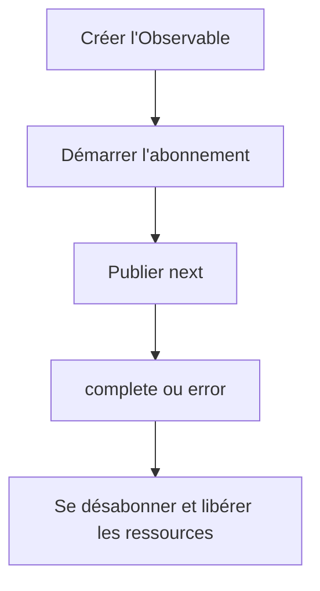

# Cycle de vie de l'Observable

Cette section fournit une description étape par étape du cycle de vie des Observables dans RxJS, de la création à la gestion des ressources, en passant par l'abonnement, la publication des données, la notification de l'achèvement et des erreurs et le désabonnement.
La compréhension de ce cycle de vie est la base d'une utilisation efficace de RxJS.

## Aperçu du cycle de vie de l'Observable

Le cycle de vie d'un Observable fait référence à la séquence suivante : comment un Observable est créé, quand il publie des données, comment il est terminé ou notifié d'erreurs, et enfin quand les ressources sont libérées. En comprenant cela, il est possible de comprendre correctement le comportement de RxJS, de se désabonner au moment voulu, de contrôler les effets de bord et de gérer correctement les erreurs.

### 🔄 Diagramme du cycle de vie de l'Observable (Transitions d'état)



## Structure du cycle de vie de l'Observable

Le cycle de vie de l'Observable se compose des phases suivantes :

| Ordre | Phase | Contenu |
|---|---|---|
| 1 | Création | Création d'une instance d'Observable |
| 2 | Abonnement | Démarrage de l'abonnement avec la méthode `subscribe()` |
| 3 | Exécution | <li>`next()` : Publication de données</li><li>`error()` : Notification d'erreur</li><li>`complete()` : Notification d'achèvement</li> |
| 4 | Élimination | Désabonnement avec la méthode `unsubscribe()` |

L'Observable est "paresseux", ce qui signifie qu'aucun flux n'est émis tant que la méthode `subscribe()` n'est pas appelée. De plus, le flux se termine lorsque `complete()` ou `error()` est appelé, et tout appel ultérieur à `next()` est ignoré.

> [!CAUTION]
> Aucun "traitement" d'aucune sorte n'est directement effectué par `subscribe()`.
> L'expression "Il ne sera pas exécuté tant que vous n'aurez pas appelé `subscribe()`" est souvent utilisée,
> mais pour être précis, "la logique interne de l'Observable (processus de notification)" est déclenchée pour la première fois par `subscribe()`.
>
> Les opérateurs tels que `pipe()` ne font que construire la chaîne d'évaluation ; l'exécution est initiée par les callbacks de l'Observer.

### Exemple de cycle de vie de l'Observable

```ts
import { Observable } from 'rxjs';

// 1. Création de l'Observable
const observable$ = new Observable<number>(subscriber => {
  console.log('Début de l\'exécution de l\'Observable');

  // 3. Exécution : Publication des données
  subscriber.next(1);
  subscriber.next(2);

  // Configuration de la minuterie
  const timerId = setTimeout(() => {
    subscriber.next(3);
    subscriber.complete(); // 3. Exécution : Notification d'achèvement
    console.log('Observable terminé');
  }, 1000);

  // Retour de la fonction de nettoyage (appelée lors du désabonnement)
  return () => {
    console.log('Nettoyage exécuté');
    clearTimeout(timerId);
  };
});

// 2. Abonnement
const subscription = observable$.subscribe({
  next: value => console.log('Valeur suivante:', value),
  error: err => console.error('Erreur:', err),
  complete: () => console.log('Notification d\'achèvement reçue')
});

// 4. Désabonnement (manuel ou à l'achèvement)
setTimeout(() => {
  console.log('Désabonnement manuel');
  subscription.unsubscribe();
}, 500); // Désabonnement à 500ms (avant la notification d'achèvement)

// Sortie :
// Début de l'exécution de l'Observable
// Valeur suivante: 1
// Valeur suivante: 2
// Désabonnement manuel
// Nettoyage exécuté
```

## Observer {#observer}

L'Observer est un objet qui sert de récepteur pour les notifications provenant d'un Observable. Lorsque vous vous abonnez à un Observable, vous passez un Observer pour traiter les données émises, les erreurs et les notifications d'achèvement.

### Les trois fonctions de rappel de l'Observer

L'Observer est une interface permettant de recevoir les notifications de l'Observable.
Il possède trois fonctions de rappel :
- `next` : Publication de données
- `error` : Notification d'erreur
- `complete` : Notification d'achèvement

#### Exemple

```ts
import { Observer, of } from 'rxjs';

// Objet Observer complet
const observer: Observer<number> = {
  next: value => console.log('Valeur:', value), // Publication des données
  error: err => console.error('Erreur:', err),  // Notification d'erreur
  complete: () => console.log('Terminé')        // Notification d'achèvement
};

const observable$ = of(1, 2, 3); // Créer facilement un Observable

// Utilisation de l'objet Observer
observable$.subscribe(observer);

// Un Observer partiel est également possible
observable$.subscribe({
  next: value => console.log('Valeur seulement:', value)
});

// Format objet (recommandé)
observable$.subscribe({
  next: value => console.log('Valeur::', value),
  error: err => console.error('Erreur:', err),
  complete: () => console.log('Terminé::')
});

// Sortie :
// Valeur: 1
// Valeur: 2
// Valeur: 3
// Terminé
// Valeur seulement: 1
// Valeur seulement: 2
// Valeur seulement: 3
// Valeur:: 1
// Valeur:: 2
// Valeur:: 3
// Terminé::
```

## Subscription {#subscription}

La Subscription représente l'exécution de l'Observable et est principalement utilisée pour le désabonnement avec `unsubscribe()`.

#### Exemple

```ts
import { interval } from 'rxjs';
import { take } from 'rxjs';

const numbers$ = interval(1000).pipe(take(5));

// Conserver la subscription
const subscription = numbers$.subscribe({
  next: value => console.log('Valeur:', value),
  complete: () => console.log('Terminé')
});

// Désabonnement manuel après 3 secondes
setTimeout(() => {
  subscription.unsubscribe(); // Désabonnement
  console.log('Désabonné');
}, 3000);

// Sortie :
// Valeur: 0
// Valeur: 1
// Valeur: 2
// Désabonné
```

## Gestion des erreurs

Dans le cycle de vie d'un Observable, appeler `error()` termine immédiatement le flux, et `complete()` n'est pas appelé. C'est pourquoi l'utilisation de `catchError` et la conception de `retry` sont importantes.

#### Exemple

```ts
import { Observable, of } from 'rxjs';
import { catchError, retry } from 'rxjs';

// Observable qui génère une erreur
const failingObservable$ = new Observable<number>(subscriber => {
  subscriber.next(1);
  subscriber.next(2);
  subscriber.error(new Error('Erreur intentionnelle'));
  // Notez que complete n'est pas appelé après l'erreur
});

// Exemple de gestion des erreurs
failingObservable$.pipe(
  // Réessayer 3 fois en cas d'erreur
  retry(3),
  // Si l'erreur persiste, passer à l'Observable alternatif
  catchError(error => {
    console.error('Erreur détectée:', error.message);
    return of('Valeur alternative après l\'erreur');
  })
).subscribe({
  next: value => console.log('Valeur:', value),
  error: err => console.error('Erreur non gérée:', err),
  complete: () => console.log('Terminé')
});

// Sortie :
// Valeur: 1
// Valeur: 2
// Valeur: 1
// Valeur: 2
// Valeur: 1
// Valeur: 2
// Valeur: 1
// Valeur: 2
// Erreur détectée: Erreur intentionnelle
// Valeur: Valeur alternative après l'erreur
// Terminé
```

## Cycle de vie de l'achèvement

L'achèvement d'un Observable se produit lorsque `complete()` est explicitement appelé ou lorsqu'un flux fini est terminé.

#### Exemple

```ts
import { of, interval, Observable } from 'rxjs';
import { take } from 'rxjs';

// Observable fini (se termine automatiquement)
const finite$ = of(1, 2, 3);
finite$.subscribe({
  next: value => console.log('Valeur finie:', value),
  complete: () => console.log('Observable fini terminé')
});

// Conversion d'un Observable infini en fini
const limited$ = interval(1000).pipe(take(3));
limited$.subscribe({
  next: value => console.log('Valeur limitée:', value),
  complete: () => console.log('Observable limité terminé')
});

// Observable complété manuellement
const manual$ = new Observable<number>(subscriber => {
  subscriber.next(1);

  setTimeout(() => {
    subscriber.next(2);
    subscriber.complete(); // Compléter explicitement
  }, 2000);
});

manual$.subscribe({
  next: value => console.log('Valeur manuelle:', value),
  complete: () => console.log('Observable manuel terminé')
});

// Sortie :
// Valeur finie: 1
// Valeur finie: 2
// Valeur finie: 3
// Observable fini terminé
// Valeur manuelle: 1
// Valeur limitée: 0
// Valeur limitée: 1
// Valeur manuelle: 2
// Observable manuel terminé
// Valeur limitée: 2
// Observable limité terminé
```

## Gestion des ressources et prévention des fuites de mémoire

Il est important de se désabonner au moment opportun pour éviter les fuites de mémoire.

#### Exemple

```ts
import { interval, Subject } from 'rxjs';
import { takeUntil } from 'rxjs';

// Imitation du cycle de vie d'un composant
class Component {
  private destroy$ = new Subject<void>();

  constructor() {
    // Intervalle toutes les 1 seconde (cause potentielle de fuite de mémoire)
    interval(1000).pipe(
      // Désabonnement automatique lorsque le composant est détruit
      takeUntil(this.destroy$)
    ).subscribe(value => {
      console.log('Valeur dans le composant:', value);
    });
  }

  // Destruction du composant
  ngOnDestroy() {
    console.log('Composant détruit');
    this.destroy$.next();
    this.destroy$.complete();
  }
}

// Exemple d'utilisation
const component = new Component();

// Détruire le composant après 5 secondes
setTimeout(() => {
  (component as any).ngOnDestroy();
}, 5000);

// Sortie :
// Valeur dans le composant: 0
// Valeur dans le composant: 1
// Valeur dans le composant: 2
// Valeur dans le composant: 3
// Valeur dans le composant: 4
// Composant détruit
```

## Résumé

Comprendre le cycle de vie d'un Observable vous permet de :

- Libérer les ressources au moment opportun
- Mettre en œuvre des stratégies de gestion des erreurs et de récupération
- Différencier les Observables froids et chauds
- Gérer les effets secondaires

En particulier, les frameworks basés sur des composants tels qu'Angular et React nécessitent une gestion des abonnements tout au long du cycle de vie, en tirant parti de `takeUntil`, `unsubscribe`, `finalize`, etc.
