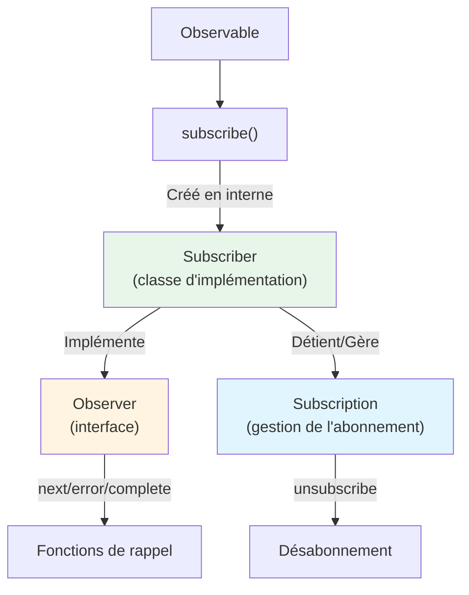
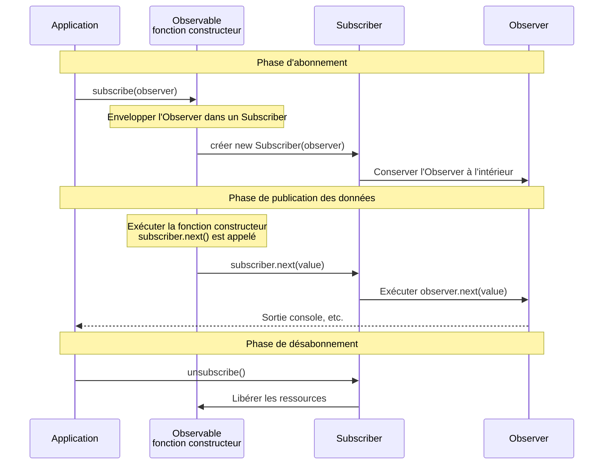

# Différence entre Observer et Subscriber

## Pourquoi ils sont confondus

Lors de l'apprentissage de RxJS, les termes "Observer" et "Subscriber" apparaissent et peuvent prêter à confusion. Ces deux termes sont étroitement liés, mais ils ont des rôles distincts.

## Qu'est-ce qu'un Observer ?

Un **Observer** est une **interface** pour recevoir des données.

### Définition de l'Observer

```typescript
interface Observer<T> {
  next: (value: T) => void;       // Recevoir une valeur
  error?: (err: any) => void;     // Recevoir une erreur
  complete?: () => void;          // Recevoir l'achèvement
}
```

### Rôle de l'Observer
- Définit "comment" recevoir des données
- Possède 3 fonctions de rappel
- Décrit **quoi** faire

## Qu'est-ce qu'un Subscriber ?

**Subscriber** est une **classe** qui implémente l'Observer et exécute le processus d'abonnement proprement dit.

### Rôle du Subscriber
- Exécute les rappels de l'Observer
- Détient la Subscription (gestion de l'abonnement)
- Gère le processus de désabonnement
- Contrôle **comment** exécuter

## Deux situations où le Subscriber apparaît

Le Subscriber apparaît en fait dans **deux situations différentes**. Cependant, **il s'agit dans les deux cas du même objet Subscriber**. Comprendre cette différence est essentiel pour éviter toute confusion.

### Situation 1 : Lors de la création d'un Observable (reçu en tant que paramètre)

Lors de la création d'un Observable avec `new Observable()`, `subscriber` est passé en paramètre à la fonction constructeur.

```typescript
import { Observable } from 'rxjs';

// Utiliser subscriber pour publier des valeurs (le type est Subscriber<number>)
const observable$ = new Observable<number>(subscriber => {
  subscriber.next(1);      // Publier une valeur
  subscriber.next(2);
  subscriber.complete();   // Notifier l'achèvement
});
```

::: tip Type du subscriber dans cette situation
- Type : `Subscriber<number>`
- Rôle : Utilisé pour publier des données à l'intérieur de l'Observable
- Les développeurs l'utilisent directement (appel de `next()`, `error()`, `complete()`)
:::

### Situation 2 : Lors de l'appel à subscribe() (Observer → Converti en Subscriber)

Lorsque vous appelez `subscribe()` sur un Observable, **l'Observer passé par le développeur est converti en interne en un Subscriber**.

```typescript
// Le développeur passe une interface Observer
observable$.subscribe({
  next: value => console.log('Valeur suivante:', value),
  error: err => console.error('Erreur:', err),
  complete: () => console.log('Terminé')
});

// ↑ RxJS crée en interne un Subscriber comme suit
// const subscriber = new Subscriber(observer);
// Et ce subscriber est passé comme paramètre dans la situation 1
```

::: tip Traitement dans cette situation
1. Le développeur passe une interface `Observer`
2. RxJS enveloppe en interne l'`Observer` dans un `Subscriber`
3. Ce `Subscriber` est passé à la fonction constructeur de l'Observable (= `subscriber` dans la situation 1)
:::

### Important : Il s'agit dans les deux cas du même objet Subscriber

> [!IMPORTANT] Le `Subscriber` dans les situations 1 et 2 est le même objet
>
> ```typescript
> const observable$ = new Observable(subscriber => {
>   // Ce subscriber est l'objet Subscriber lui-même
>   // créé lors de l'appel à subscribe()
>   subscriber.next(1);
> });
>
> observable$.subscribe({
>   // Cet Observer est enveloppé dans un Subscriber,
>   // et passé à la fonction constructeur ci-dessus
>   next: v => console.log(v)
> });
> ```
>
> **En d'autres termes :**
> - Le développeur appelle `subscribe(observer)`
> - RxJS crée `new Subscriber(observer)`
> - Ce Subscriber devient l'argument de la fonction constructeur de l'Observable
> - Par conséquent, `subscriber` dans la situation 1 = `Subscriber` créé dans la situation 2

## Illustration des relations



## Différences observées dans le code

### Exemple complet : De la création de l'Observable à l'abonnement

```typescript
import { Observable } from 'rxjs';

// 1. Lors de la création de l'Observable : utiliser subscriber pour publier des valeurs
const observable$ = new Observable<number>(subscriber => {
  console.log('Abonnement démarré');
  subscriber.next(1);
  subscriber.next(2);
  subscriber.next(3);
  subscriber.complete();
});

// 2. Lors de l'abonnement : passer l'Observer (le Subscriber est créé en interne)
observable$.subscribe({
  next: value => console.log('Valeur suivante:', value),
  error: err => console.error('Erreur:', err),
  complete: () => console.log('Terminé')
});

// Sortie :
// Abonnement démarré
// Valeur suivante: 1
// Valeur suivante: 2
// Valeur suivante: 3
// Terminé
```

#### Dans cet exemple
- **`subscriber` au moment de la création** : Utilisé pour publier des données à l'intérieur de l'Observable
- **`Observer` au moment de l'abonnement** : Définit le processus de réception des données publiées

### Lors du passage d'un Observer

```typescript
import { interval } from 'rxjs';

const observer = {
  next: (value: number) => console.log(value),
  error: (err: any) => console.error(err),
  complete: () => console.log('Terminé')
};

// Passer l'Observer à subscribe
const subscription = interval(1000).subscribe(observer);
// En interne, un Subscriber est créé et exécute les callbacks de l'observer
```

### Lorsque l'on passe des callbacks directement (Notation simplifiée)

```typescript
// Cela crée également un Subscriber en interne
const subscription = interval(1000).subscribe(
  value => console.log(value),  // next
  err => console.error(err),    // error
  () => console.log('Terminé')  // complete
);
```

## Flux d'opérations réel

Le diagramme de séquence suivant montre le flux allant de la création de l'Observable à l'abonnement et à la publication des données.



**Points importants de ce flux :**
1. Lorsque `subscribe(observer)` est appelé, un `new Subscriber(observer)` est créé
2. Ce Subscriber est passé en paramètre à la fonction constructeur de l'Observable
3. Lorsque `subscriber.next()` est appelé dans la fonction constructeur, la fonction interne `observer.next()` est exécutée
4. En d'autres termes, **`subscriber` dans la situation 1 = `Subscriber` créé dans la situation 2**

## Points importants

> [!IMPORTANT] L'Observer est le "plan", le Subscriber est l'"exécuteur"
> - **Observer** : Une interface qui **définit** comment recevoir des données
> - **Subscriber** : Une classe qui **implémente** l'Observer et **exécute** l'abonnement
> - Le Subscriber apparaît dans deux situations

> [!TIP] Comprendre quand utiliser le Subscriber
> - **Lors de la création d'un Observable** : Utilisez le paramètre `subscriber` dans `new Observable(subscriber => {...})` directement
> - **Lors de l'abonnement** : Lors de l'appel à `subscribe(observer)`, un Subscriber est automatiquement créé en interne
>
> Dans les deux cas, le Subscriber est le même objet avec les méthodes `next()`, `error()`, `complete()`.

## Modèles de confusion courants

### ❌ Mauvaise compréhension #1

"Le `subscriber` lors de la création d'un Observable et l'`observer` lors de l'abonnement sont deux choses différentes"

### ❌ Mauvaise compréhension #2

"Le Subscriber est une implémentation interne, donc les développeurs n'y touchent pas"

### ✅ Compréhension correcte

**Faits importants :**
- L'**Observer** que le développeur passe dans `subscribe(observer)` est enveloppé en interne dans un **Subscriber**
- Ce **Subscriber** est passé en paramètre à la fonction constructeur lors de la création de l'Observable
- En d'autres termes, **`subscriber` dans la situation 1 = `Subscriber` créé dans la situation 2 (même objet)**

### Comprendre avec un exemple complet

```typescript
import { Observable } from 'rxjs';

// 1. Créer l'Observable (rien n'est exécuté à ce stade)
const observable$ = new Observable<number>(subscriber => {
  console.log('La fonction constructeur a été exécutée!');
  subscriber.next(1);
  subscriber.next(2);
  subscriber.complete();
});

// 2. S'abonner (la fonction constructeur est exécutée pour la première fois à ce moment)
observable$.subscribe({
  next: v => console.log('Reçu:', v),
  complete: () => console.log('Terminé')
});

// Sortie :
// La fonction constructeur a été exécutée!
// Reçu: 1
// Reçu: 2
// Terminé
```

**Flux dans cet exemple :**
1. `observable$.subscribe({...})` est appelé
2. RxJS crée `new Subscriber({next: ..., complete: ...})`
3. La fonction constructeur `(subscriber => {...})` est exécutée avec ce `Subscriber` comme paramètre
4. `subscriber.next(1)` est appelé dans la fonction constructeur
5. En interne, `observer.next(1)` est exécuté et "Reçu: 1" est affiché

**En d'autres termes :**
- `subscriber` dans la situation 1 ← ceci
- `Subscriber` créé dans la situation 2 ← ceci
- **Même objet !**

## Résumé

### Comparaison de l'Observer et du Subscriber

| | Observer | Subscriber |
|---|----------|------------|
| **Type** | Interface | Classe (implémente Observer) |
| **Rôle** | Définit comment recevoir des données | Exécute le processus d'abonnement réel |
| **Contenu** | Callbacks next/error/complete | Observer + gestion de la Subscription |
| **Quand il apparaît** | Uniquement lors de l'abonnement | Lors de la création de l'Observable et de l'abonnement |

### Important : Relation dans les deux situations

| Situation | Ce que le développeur gère | Type réel | Relation |
|------|------------------|----------|--------|
| **Lors de la création de l'Observable** | Paramètre dans `new Observable(subscriber => {...})` | `Subscriber<T>` | Le développeur l'utilise directement |
| **Lors de l'abonnement** | Objet passé à `subscribe(observer)` | `Observer<T>` → Converti en interne en `Subscriber<T>` | RxJS convertit automatiquement |

> [!IMPORTANT] Point central
> - L'`Observer` que le développeur passe dans `subscribe(observer)` est enveloppé dans un `Subscriber` en interne
> - Ce `Subscriber` est passé en paramètre à la fonction constructeur de l'Observable
> - Par conséquent, **le `Subscriber` utilisé dans les deux situations est le même objet**

## Prochaines étapes

Maintenant que vous comprenez la différence entre l'Observer et le Subscriber, nous allons nous intéresser à la gestion des abonnements proprement dite.

- [Cycle de vie de l'Observable](/fr/guide/observables/observable-lifecycle) - Flux du début à la fin de l'abonnement
- [Gestion des abonnements](/fr/guide/observables/observable-lifecycle#subscription) - Désabonnement et gestion des ressources

## Ressources de référence

- [Documentation officielle RxJS - Observer](https://rxjs.dev/guide/observer) - Spécification détaillée de l'Observer
- [Documentation officielle RxJS - Subscription](https://rxjs.dev/guide/subscription) - Spécification détaillée de la Subscription
- [Understanding the Difference Between Observer and Subscriber in RxJS](https://www.codingscenes.com/posts/92/Understanding-the-Difference-Between-Observer-and-Subscriber-in-RxJS) - Fonctionnalités étendues du Subscriber et exemples pratiques
