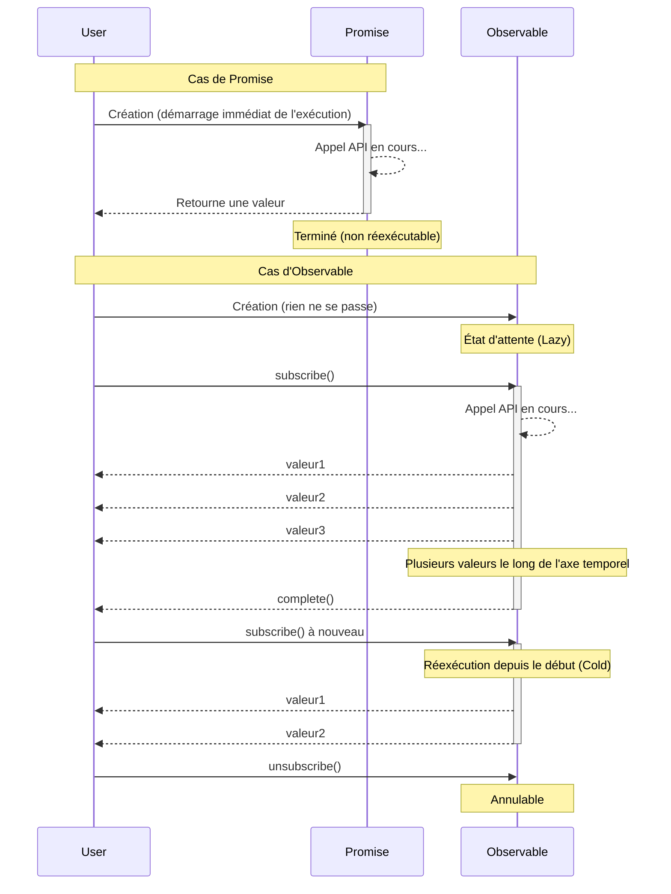

# Barrière de compréhension conceptuelle

La première barrière de RxJS est la **compréhension des concepts**. En particulier pour les développeurs habitués à Promise, le comportement d'Observable peut être contre-intuitif.

## Différence essentielle entre Observable et Promise

### Promise: traitement asynchrone unique

```typescript
// Promise: retourne une valeur une seule fois
const userPromise = fetch('/api/user/1').then(res => res.json());

userPromise.then(user => console.log(user)); // Récupère les informations utilisateur une seule fois
userPromise.then(user => console.log(user)); // Même résultat mis en cache
```

> [!TIP] Caractéristiques
> - **Eager (exécution immédiate)** - Le traitement démarre dès la création de Promise
> - **Complète une seule fois** - Soit succès, soit échec, une seule fois
> - **Non annulable** - Une fois démarrée, impossible d'arrêter
> - **Toujours Hot** - Plusieurs then partagent le même résultat

### Observable: Stream (flux de données avec un axe temporel)

```typescript
import { Observable } from 'rxjs';

// Observable: fait circuler plusieurs valeurs le long de l'axe temporel
const user$ = new Observable<User>(subscriber => {
  console.log('Début de l\'exécution de Observable!');
  fetch('/api/user/1')
    .then(res => res.json())
    .then(user => {
      subscriber.next(user);
      subscriber.complete();
    });
});

// ❌ Rien ne se passe à ce stade (Lazy)
console.log('Création de Observable terminée');

// ✅ S'exécute seulement après subscribe
user$.subscribe(user => console.log('Abonnement1:', user));
user$.subscribe(user => console.log('Abonnement2:', user));
// → L'appel API est exécuté 2 fois (Cold Observable)
```

#### Sortie
```
Création de Observable terminée
Début de l'exécution de Observable!
Abonnement1: { id: 1, name: 'Alice' }
Début de l'exécution de Observable!
Abonnement2: { id: 1, name: 'Alice' }
```

> [!TIP] Caractéristiques
> - **Lazy (exécution différée)** - Rien ne se passe jusqu'à subscribe
> - **Peut faire circuler plusieurs valeurs** - next() peut être appelé plusieurs fois
> - **Annulable** - Peut être arrêté avec unsubscribe
> - **Cold ou Hot** - Choix entre exécution par abonnement ou partage

### Tableau comparatif

| Caractéristique | Promise | Observable |
|---|---|---|
| **Timing d'exécution** | Immédiat (Eager) | À l'abonnement (Lazy) |
| **Nombre de valeurs** | Une seule fois | 0 fois ou plus (plusieurs possibles) |
| **Annulation** | Impossible | Possible (unsubscribe) |
| **Réutilisation** | Résultat mis en cache | Réexécution à chaque abonnement (Cold) |
| **Après erreur** | Terminaison | Terminaison (retry possible) |

### Visualisation de la différence de comportement

Le diagramme de séquence suivant montre la différence de flux d'exécution entre Promise et Observable.



### Malentendus courants

#### ❌ Malentendu 1: "Observable est réservé à l'asynchrone"

```typescript
// Observable peut également gérer les traitements synchrones
import { of } from 'rxjs';

const sync$ = of(1, 2, 3);

console.log('Avant subscribe');
sync$.subscribe(value => console.log(value));
console.log('Après subscribe');

// Sortie (exécution synchrone):
// Avant subscribe
// 1
// 2
// 3
// Après subscribe
```

#### ❌ Malentendu 2: "subscribe retourne une valeur"

```typescript
import { map, of } from "rxjs";

const observable$ = of(1, 2, 3);

// ❌ Mauvais exemple: pensée de type Promise
const value = observable$.subscribe(x => x); // value est un objet Subscription
console.log(value); // Subscription { ... } ← Pas la valeur attendue

// ✅ Bon exemple: pensée de type Observable
observable$.pipe(
  map(x => x * 2)
).subscribe(value => {
  console.log(value); // Utiliser la valeur ici
});
```

## Compréhension intuitive de Cold vs Hot

### Cold Observable: stream indépendant par abonnement

```typescript
import { interval } from 'rxjs';
import { take } from 'rxjs';

// Cold: chaque abonné a son propre timer indépendant
const cold$ = interval(1000).pipe(take(3));

console.log('Début abonnement1');
cold$.subscribe(x => console.log('Abonnement1:', x));

setTimeout(() => {
  console.log('Début abonnement2 (après 2 secondes)');
  cold$.subscribe(x => console.log('Abonnement2:', x));
}, 2000);

// Sortie:
// Début abonnement1
// Abonnement1: 0        (après 1 seconde)
// Abonnement1: 1        (après 2 secondes)
// Début abonnement2 (après 2 secondes)
// Abonnement1: 2        (après 3 secondes)
// Abonnement2: 0        (après 3 secondes) ← Abonnement2 démarre depuis le début
// Abonnement2: 1        (après 4 secondes)
// Abonnement2: 2        (après 5 secondes)
```

> [!TIP] Caractéristiques de Cold
> - **Exécution indépendante** par abonnement
> - Conserve le "plan" des données
> - Exemples: appel API HTTP, timer, lecture de fichier

### Hot Observable: tous les abonnés partagent le même stream

```typescript
import { interval } from 'rxjs';
import { take, share } from 'rxjs';

// Hot: partagé avec share()
const hot$ = interval(1000).pipe(
  take(3),
  share() // Devient Hot avec ceci
);

console.log('Début abonnement1');
hot$.subscribe(x => console.log('Abonnement1:', x));

setTimeout(() => {
  console.log('Début abonnement2 (après 2 secondes)');
  hot$.subscribe(x => console.log('Abonnement2:', x));
}, 2000);

// Sortie:
// Début abonnement1
// Abonnement1: 0        (après 1 seconde)
// Abonnement1: 1        (après 2 secondes)
// Début abonnement2 (après 2 secondes)
// Abonnement1: 2        (après 3 secondes)
// Abonnement2: 2        (après 3 secondes) ← Abonnement2 rejoint en cours
```

> [!TIP] Caractéristiques de Hot
> - Tous les abonnés **partagent la même exécution**
> - État où les données sont "diffusées"
> - Exemples: événement de clic, WebSocket, Subject

### Méthode d'identification Cold/Hot

```typescript
import { fromEvent, interval, of, Subject } from 'rxjs';
import { share } from 'rxjs';

// Cold (exécution indépendante par abonnement)
const cold1$ = of(1, 2, 3);
const cold2$ = interval(1000);
const cold3$ = ajax('/api/data');
const cold4$ = fromEvent(button, 'click'); // Cold mais spécial

// Hot (partagé entre abonnés)
const hot1$ = new Subject<number>();
const hot2$ = interval(1000).pipe(share()); // Convertit Cold en Hot
```

> [!IMPORTANT] Comment distinguer
> - **Creation Functions (of, from, fromEvent, interval, ajax, etc.)** → Cold
> - **Famille Subject** → Hot
> - **Utilisation de share(), shareReplay()** → Convertit Cold en Hot

## Transition vers la pensée déclarative

### Impératif vs Déclaratif

RxJS suit le paradigme de **programmation déclarative**.

#### ❌ Pensée impérative (Promise/async-await)

```typescript
// Impératif: décrit "comment" traiter
async function processUsers() {
  const response = await fetch('/api/users');
  const users = await response.json();

  const activeUsers = [];
  for (const user of users) {
    if (user.isActive) {
      activeUsers.push(user);
    }
  }

  const userNames = [];
  for (const user of activeUsers) {
    userNames.push(user.name.toUpperCase());
  }

  return userNames;
}
```

#### ✅ Pensée déclarative (RxJS)

```typescript
import { from } from 'rxjs';
import { mergeMap, filter, map, toArray } from 'rxjs';

// Déclaratif: décrit "quoi" transformer
const processUsers$ = from(fetch('/api/users')).pipe(
  mergeMap(res => res.json()),
  mergeMap(users => users), // Développe le tableau
  filter(user => user.isActive),
  map(user => user.name.toUpperCase()),
  toArray()
);

processUsers$.subscribe(userNames => console.log(userNames));
```

::: tip Différence
- **Impératif**: décrit les procédures (boucles, branchements conditionnels, affectations de variables)
- **Déclaratif**: décrit le pipeline de transformations (flux de données)
:::

### Points de transition de pensée

#### Point 1: Ne pas traiter les données dans subscribe

Le traitement de transformation des données se fait dans pipe, subscribe est uniquement pour les effets de bord.

```typescript
import { filter, map, of } from "rxjs";

const observable$ = of(1, 2, 3);
// ❌ Mauvais exemple: traitement dans subscribe
observable$.subscribe(value => {
  const doubled = value * 2;           // 👈 Calcul dans subscribe
  const filtered = doubled > 4 ? doubled : null;  // 👈 Branchement conditionnel dans subscribe
  if (filtered) {                      // 👈 Instruction if dans subscribe
    console.log(filtered);
  }
});

// ✅ Bon exemple: transformation dans pipe
observable$.pipe(
  map(value => value * 2),       // Calcul dans pipe
  filter(value => value > 4)     // Filtrage aussi dans pipe
).subscribe(value => console.log(value));  // subscribe uniquement pour les effets de bord
```

#### Point 2: Ne pas utiliser de variables intermédiaires

```typescript
import { filter, map, Observable, of } from "rxjs";

const source$ = of(1, 2, 3, 4, 5);

// ❌ Mauvais exemple: sauvegarde dans des variables intermédiaires
let doubled$: Observable<number>;      // 👈 Déclaration de variable intermédiaire
let filtered$: Observable<number>;     // 👈 Déclaration de variable intermédiaire

doubled$ = source$.pipe(map(x => x * 2));    // 👈 Affectation à variable intermédiaire
filtered$ = doubled$.pipe(filter(x => x > 5)); // 👈 Affectation à variable intermédiaire
filtered$.subscribe(console.log);

// ✅ Bon exemple: enchaîner avec pipeline
source$.pipe(
  map(x => x * 2),      // Enchaîner directement dans le pipeline
  filter(x => x > 5)    // Enchaîner directement dans le pipeline
).subscribe(console.log);
```

#### Point 3: Éviter les subscribe imbriqués

```typescript
// ❌ Mauvais exemple: subscribe imbriqués
getUser$(userId).subscribe(user => {
  getOrders$(user.id).subscribe(orders => {  // 👈 subscribe supplémentaire dans subscribe (imbrication)
    console.log(user, orders);
  });  // 👈 La désinscription devient complexe
});

// ✅ Bon exemple: aplatir avec mergeMap
getUser$(userId).pipe(
  mergeMap(user =>                // Aplatir l'Observable interne avec mergeMap
    getOrders$(user.id).pipe(
      map(orders => ({ user, orders }))
    )
  )
).subscribe(({ user, orders }) => console.log(user, orders));  // Abonnement en un seul endroit
```

#### Point 4: Organiser avec la syntaxe de séparation en 3 étapes

Une technique importante qui améliore considérablement la lisibilité et la maintenabilité du code RxJS est la **syntaxe de séparation par étapes**.

```typescript
// ❌ Mauvais exemple: tout mélangé en une ligne
fromEvent(document, 'click').pipe(
  map(event => (event as MouseEvent).clientX),
  filter(x => x > 100),
  throttleTime(200)
).subscribe({
  next: x => console.log('Position du clic:', x),
  error: err => console.error(err)
});
```

> [!IMPORTANT] Points problématiques
> - Définition de stream, transformation et abonnement sont mélangés
> - Débogage difficile (on ne sait pas où le problème se produit)
> - Difficile à tester
> - Non réutilisable

```typescript
// ✅ Bon exemple: séparé en 3 étapes

import { filter, fromEvent, map, throttleTime } from "rxjs";

// 1. Définition de l'Observable (source du stream)
const clicks$ = fromEvent(document, 'click');

// 2. Définition du pipeline (traitement de transformation des données)
const processed$ = clicks$.pipe(
  map(event => (event as MouseEvent).clientX),
  filter(x => x > 100),
  throttleTime(200)
);

// 3. Traitement d'abonnement (exécution des effets de bord)
const subscription = processed$.subscribe({
  next: x => console.log('Position du clic:', x),
  error: err => console.error(err),
  complete: () => console.log('Terminé')
});
```

#### Avantages
- **Débogage facile** - Possibilité d'insérer `console.log` ou `tap` à chaque étape
- **Testable** - `processed$` peut être testé indépendamment
- **Réutilisabilité** - `clicks$` et `processed$` peuvent être utilisés ailleurs
- **Lisibilité améliorée** - L'intention du code devient claire

**La syntaxe de séparation par étapes est l'une des techniques les plus pratiques pour surmonter les difficultés de RxJS.**

Pour plus de détails, consultez **[Chapitre 10: Enfer des one-liners et syntaxe de séparation par étapes](/fr/guide/anti-patterns/one-liner-hell)**.

## Expérimenter pour comprendre (Utilisation du Starter Kit)

### Expérience 1: Différence entre Lazy et Eager

```typescript
import { Observable } from 'rxjs';

console.log('=== Promise (Eager) ===');
const promise = new Promise((resolve) => {
  console.log('Exécution de Promise!');
  resolve(42);
});
console.log('Création de Promise terminée');
promise.then(value => console.log('Résultat Promise:', value));

console.log('\n=== Observable (Lazy) ===');
const observable$ = new Observable(subscriber => {
  console.log('Exécution de Observable!');
  subscriber.next(42);
  subscriber.complete();
});
console.log('Création de Observable terminée');
observable$.subscribe(value => console.log('Résultat Observable:', value));

// Sortie:
// === Promise (Eager) ===
// Exécution de Promise!
// Création de Promise terminée
// Résultat Promise: 42
//
// === Observable (Lazy) ===
// Création de Observable terminée
// Exécution de Observable!
// Résultat Observable: 42
```

### Expérience 2: Différence entre Cold et Hot

```typescript
import { interval } from 'rxjs';
import { take, share } from 'rxjs';

// Cold: indépendant par abonnement
const cold$ = interval(1000).pipe(take(3));

console.log('Cold Observable:');
cold$.subscribe(x => console.log('Cold abonnement1:', x));
setTimeout(() => {
  cold$.subscribe(x => console.log('Cold abonnement2:', x));
}, 2000);

// Hot: partagé
const hot$ = interval(1000).pipe(take(3), share());

setTimeout(() => {
  console.log('\nHot Observable:');
  hot$.subscribe(x => console.log('Hot abonnement1:', x));
  setTimeout(() => {
    hot$.subscribe(x => console.log('Hot abonnement2:', x));
  }, 2000);
}, 6000);
```

**Exécutez-le dans [l'environnement d'exécution d'apprentissage](/fr/guide/starter-kid) pour ressentir la différence.**

### Expérience 3: Déclaratif vs Impératif

```typescript
import { of } from 'rxjs';
import { map, filter } from 'rxjs';

const numbers = [1, 2, 3, 4, 5, 6, 7, 8, 9, 10];

// Impératif
console.log('=== Impératif ===');
const result1: number[] = [];
for (const num of numbers) {
  const doubled = num * 2;
  if (doubled > 10) {
    result1.push(doubled);
  }
}
console.log(result1);

// Déclaratif
console.log('\n=== Déclaratif ===');
of(...numbers).pipe(
  map(num => num * 2),
  filter(num => num > 10)
).subscribe(num => console.log(num));
```

## Vérification de la compréhension

Vérifiez si vous pouvez répondre aux questions suivantes.

```markdown
## Concepts de base
- [ ] Je peux citer 3 différences entre Promise et Observable
- [ ] Je peux expliquer la différence entre Lazy et Eager
- [ ] Je peux expliquer la différence entre Cold et Hot avec des exemples

## Pratique
- [ ] Je peux expliquer pourquoi il ne faut pas tout compléter dans subscribe
- [ ] Je sais comment corriger des subscribe imbriqués
- [ ] Je connais comment convertir un Cold Observable en Hot

## Débogage
- [ ] Je peux identifier la cause quand un Observable ne s'exécute pas
- [ ] Je comprends la cause de l'exécution multiple des abonnements
```

## Prochaines étapes

Une fois la compréhension conceptuelle acquise, passons aux barrières pratiques suivantes.

- **Barrière de gestion du cycle de vie** (en préparation) - Quand subscribe/unsubscribe
- **Hésitation dans la sélection d'opérateur** (en préparation) - Critères de choix parmi 100+ opérateurs

## Sections connexes

- **[Qu'est-ce que RxJS](/fr/guide/basics/what-is-rxjs)** - Concepts de base de RxJS
- **[Différence entre Promise et RxJS](/fr/guide/basics/promise-vs-rxjs)** - Promise vs Observable
- **[Cold and Hot Observables](/fr/guide/observables/cold-and-hot-observables)** - Explication détaillée de Cold/Hot
