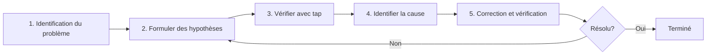

# Difficulté du débogage

Dans RxJS, lorsque vous rencontrez des problèmes comme **"les valeurs ne circulent pas", "les valeurs émises sont différentes de celles attendues" ou "il y a peut-être une fuite mémoire"**, ne pas connaître les méthodes de débogage appropriées peut prendre beaucoup de temps pour résoudre. Cette page explique de manière complète les techniques de débogage spécifiques à RxJS.

## Stratégie de base du débogage RxJS

### 5 étapes du débogage



### Étape 1: Identification du problème

D'abord, clarifiez **quel est le problème**.

| Symptôme | Causes possibles |
|---|---|
| Aucune valeur ne circule | Oubli de subscribe, completion avant émission, exclusion par filter |
| Première valeur non émise | Condition initiale de combineLatest non atteinte, BehaviorSubject non configuré |
| Ordre incorrect | Utilisation de mergeMap, timing asynchrone |
| Valeurs dupliquées | Plusieurs souscriptions sans share, mauvaise utilisation de shareReplay |
| Fuite mémoire | Oubli d'unsubscribe, shareReplay avec refCount: false |
| Valeurs retardées | debounceTime, throttleTime, traitement asynchrone |

### Étape 2: Formuler des hypothèses

**Supposez** la cause du problème.

```typescript
// Exemple: Problème "aucune valeur émise"
// Hypothèse 1: Pas de subscribe?
// Hypothèse 2: complete/error trop rapide?
// Hypothèse 3: Exclu par filter?
// Hypothèse 4: Traitement asynchrone prend du temps?
```

### Étape 3: Vérifier avec tap

Insérez `tap` à chaque étape pour vérifier **ce qui se passe réellement**.

```typescript
import { of } from 'rxjs';
import { map, filter, tap } from 'rxjs';

of(1, 2, 3, 4, 5).pipe(
  tap(v => console.log('🔵 Entrée:', v)),
  filter(x => x > 10), // ❌ Tout est exclu
  tap(v => console.log('✅ Passé filter:', v)),
  map(x => x * 10),
  tap(v => console.log('🟢 Après map:', v))
).subscribe(result => {
  console.log('📦 Résultat:', result);
});

// Sortie:
// 🔵 Entrée: 1
// 🔵 Entrée: 2
// 🔵 Entrée: 3
// 🔵 Entrée: 4
// 🔵 Entrée: 5
// (Aucun passage par filter → filter est la cause)
```

## Scénarios de débogage courants

### Scénario 1: Aucune valeur ne circule

#### Problème 1-1: Oubli de subscribe

#### ❌ Mauvais exemple: Pas de subscribe
```typescript
import { of } from 'rxjs';
import { map } from 'rxjs';

const result$ = of(1, 2, 3).pipe(
  map(x => x * 10)
);

console.log('Terminé'); // Émis immédiatement
// Aucune valeur ne circule dans result$ (pas de subscribe)
```

#### ✅ Bon exemple: Faire un subscribe
```typescript
import { of } from 'rxjs';
import { map } from 'rxjs';

const result$ = of(1, 2, 3).pipe(
  map(x => x * 10)
);

result$.subscribe(value => {
  console.log('Valeur:', value);
});

console.log('Terminé');

// Sortie:
// Valeur: 10
// Valeur: 20
// Valeur: 30
// Terminé
```

> [!IMPORTANT] Point de contrôle
> - Rien ne se passe en définissant simplement un Observable
> - **Il faut obligatoirement faire un subscribe**
> - Avec async pipe, pas besoin de subscribe (Angular, etc.)

#### Problème 1-2: complete/error arrive trop tôt

#### ❌ Mauvais exemple: complete arrive en premier
```typescript
import { EMPTY } from 'rxjs';
import { map } from 'rxjs';

EMPTY.pipe( // ❌ Complete immédiatement
  map(x => x * 10)
).subscribe({
  next: value => console.log('Valeur:', value),
  complete: () => console.log('Complété')
});

// Sortie:
// Complété
// (Aucune valeur circulée)
```

#### ✅ Bon exemple: Vérifier avec tap
```typescript
import { EMPTY } from 'rxjs';
import { map, tap } from 'rxjs';

EMPTY.pipe(
  tap(() => console.log('👁️ Valeur reçue')), // Pas émis
  map(x => x * 10)
).subscribe({
  next: value => console.log('Valeur:', value),
  complete: () => console.log('Complété')
});

// Sortie:
// Complété
// (tap n'est pas non plus exécuté → EMPTY est la cause)
```

#### Problème 1-3: Exclu par filter

#### ❌ Mauvais exemple: Tout exclu sans s'en rendre compte
```typescript
import { of } from 'rxjs';
import { filter } from 'rxjs';

of(1, 2, 3, 4, 5).pipe(
  filter(x => x > 100) // ❌ Tout exclu
).subscribe(value => {
  console.log('Valeur:', value); // Aucune sortie
});
```

#### ✅ Bon exemple: Vérifier avec tap
```typescript
import { of } from 'rxjs';
import { filter, tap } from 'rxjs';

of(1, 2, 3, 4, 5).pipe(
  tap(v => console.log('Avant filter:', v)),
  filter(x => x > 100),
  tap(v => console.log('Après filter:', v)) // Aucune sortie
).subscribe(value => {
  console.log('Valeur:', value);
});

// Sortie:
// Avant filter: 1
// Avant filter: 2
// Avant filter: 3
// Avant filter: 4
// Avant filter: 5
// (Aucun après filter → filter trop strict)
```

### Scénario 2: Valeurs émises différentes de celles attendues

#### Problème 2-1: Erreur de conversion de type

#### ❌ Mauvais exemple: Confusion string et nombre
```typescript
import { of } from 'rxjs';
import { map } from 'rxjs';

const input = '5'; // Chaîne

of(input).pipe(
  map(x => x + 10) // ❌ '5' + 10 = '510' (concaténation de chaîne)
).subscribe(result => {
  console.log('Résultat:', result); // Résultat: 510
  console.log('Type:', typeof result); // Type: string
});
```

#### ✅ Bon exemple: Vérifier le type avec tap
```typescript
import { of } from 'rxjs';
import { map, tap } from 'rxjs';

const input = '5';

of(input).pipe(
  tap(x => console.log('Entrée:', x, typeof x)),
  map(x => Number(x)), // Convertir en nombre
  tap(x => console.log('Après conversion:', x, typeof x)),
  map(x => x + 10)
).subscribe(result => {
  console.log('Résultat:', result); // Résultat: 15
});
```

#### Problème 2-2: Ordre asynchrone

#### ❌ Mauvais exemple: Ordre perturbé avec mergeMap
```typescript
import { of } from 'rxjs';
import { mergeMap, delay } from 'rxjs';

of(1, 2, 3).pipe(
  mergeMap(x =>
    of(x * 10).pipe(
      delay(Math.random() * 1000) // Délai aléatoire
    )
  )
).subscribe(value => {
  console.log('Valeur:', value);
});

// Exemple de sortie (ordre non garanti):
// Valeur: 20
// Valeur: 10
// Valeur: 30
```

#### ✅ Bon exemple: Garantir l'ordre avec concatMap
```typescript
import { of } from 'rxjs';
import { concatMap, delay, tap } from 'rxjs';

of(1, 2, 3).pipe(
  tap(x => console.log('Entrée:', x)),
  concatMap(x =>
    of(x * 10).pipe(
      delay(Math.random() * 1000),
      tap(v => console.log('Complété:', v))
    )
  )
).subscribe(value => {
  console.log('Valeur:', value);
});

// Sortie (toujours dans cet ordre):
// Entrée: 1
// Complété: 10
// Valeur: 10
// Entrée: 2
// Complété: 20
// Valeur: 20
// Entrée: 3
// Complété: 30
// Valeur: 30
```

### Scénario 3: Détection de fuite mémoire

#### Problème 3-1: Oubli d'unsubscribe

#### ❌ Mauvais exemple: Pas d'unsubscribe
```typescript
import { interval } from 'rxjs';

class Component {
  ngOnInit() {
    interval(1000).subscribe(n => {
      console.log('Valeur:', n); // Continue éternellement
    });
  }

  ngOnDestroy() {
    // Pas d'unsubscribe → Fuite mémoire
  }
}
```

#### ✅ Bon exemple: Désinscription automatique avec takeUntil
```typescript
import { interval, Subject } from 'rxjs';
import { takeUntil } from 'rxjs';

class Component {
  private destroy$ = new Subject<void>();

  ngOnInit() {
    interval(1000).pipe(
      takeUntil(this.destroy$)
    ).subscribe(n => {
      console.log('Valeur:', n);
    });
  }

  ngOnDestroy() {
    this.destroy$.next();
    this.destroy$.complete();
    console.log('Désinscription complétée');
  }
}
```

#### Problème 3-2: Fuite mémoire avec shareReplay

#### ❌ Mauvais exemple: Fuite avec refCount: false
```typescript
import { interval } from 'rxjs';
import { shareReplay, take, tap } from 'rxjs';

const data$ = interval(1000).pipe(
  take(100),
  tap(n => console.log('Généré:', n)),
  shareReplay({ bufferSize: 1, refCount: false })
  // ❌ refCount: false → Continue éternellement
);

const sub = data$.subscribe(n => console.log('Souscription 1:', n));

setTimeout(() => {
  sub.unsubscribe();
  console.log('Désinscrit mais continue en interne');
}, 5000);
```

#### ✅ Bon exemple: Arrêt automatique avec refCount: true
```typescript
import { interval } from 'rxjs';
import { shareReplay, take, tap } from 'rxjs';

const data$ = interval(1000).pipe(
  take(100),
  tap(n => console.log('Généré:', n)),
  shareReplay({ bufferSize: 1, refCount: true })
  // ✅ refCount: true → Arrêt lors de toutes désinscriptions
);

const sub = data$.subscribe(n => console.log('Souscription 1:', n));

setTimeout(() => {
  sub.unsubscribe();
  console.log('Désinscription → Flux aussi arrêté');
}, 5000);
```

## Outils et techniques de débogage

### 1. Débogage progressif avec tap

```typescript
import { of } from 'rxjs';
import { map, filter, tap } from 'rxjs';

const debugTap = <T>(label: string, color: string = '🔵') =>
  tap<T>({
    next: value => console.log(`${color} [${label}] next:`, value),
    error: error => console.error(`❌ [${label}] error:`, error),
    complete: () => console.log(`✅ [${label}] complete`)
  });

of(1, 2, 3, 4, 5).pipe(
  debugTap('Entrée'),
  filter(x => x % 2 === 0),
  debugTap('Après filter', '🟢'),
  map(x => x * 10),
  debugTap('Après map', '🟡')
).subscribe({
  next: value => console.log('📦 Résultat final:', value),
  complete: () => console.log('🏁 Terminé')
});
```

### 2. Opérateur de débogage personnalisé

```typescript
import { tap, timestamp, delay } from 'rxjs';
import { MonoTypeOperatorFunction } from 'rxjs';

interface DebugOptions {
  label: string;
  showTimestamp?: boolean;
  showDiff?: boolean;
}

let lastTimestamp = 0;

function debug<T>(options: DebugOptions): MonoTypeOperatorFunction<T> {
  const { label, showTimestamp = true, showDiff = true } = options;

  return source => source.pipe(
    timestamp(),
    tap(({ value, timestamp }) => {
      const parts = [`[${label}]`, value];

      if (showTimestamp) {
        parts.push(`@${new Date(timestamp).toISOString()}`);
      }

      if (showDiff && lastTimestamp > 0) {
        const diff = timestamp - lastTimestamp;
        parts.push(`(+${diff}ms)`);
      }

      console.log(...parts);
      lastTimestamp = timestamp;
    }),
    map(({ value }) => value)
  );
}

// Utilisation
import { interval } from 'rxjs';
import { map, take } from 'rxjs';

interval(500).pipe(
  take(5),
  debug({ label: 'Timer' }),
  map(x => x * 10),
  debug({ label: 'Après conversion', showDiff: false })
).subscribe();
```

### 3. RxJS DevTools (Extension navigateur)

**Méthode d'installation:**
1. Rechercher "RxJS DevTools" dans Chrome/Edge Web Store
2. Ajouter l'extension
3. Ouvrir DevTools, cliquer sur l'onglet "RxJS"

**Fonctionnalités principales:**
- Surveillance en temps réel de tous les Observables
- Visualisation avec Marble Diagram
- Traçage de subscribe/unsubscribe
- Analyse de performance

**Exemple d'utilisation:**
```typescript
import { interval } from 'rxjs';
import { map, take } from 'rxjs';

// Automatiquement détecté par DevTools
const timer$ = interval(1000).pipe(
  take(10),
  map(x => x * 2)
);

timer$.subscribe(value => console.log(value));
```

### 4. Débogage des erreurs

#### Identifier l'emplacement de l'erreur

```typescript
import { of, throwError } from 'rxjs';
import { map, catchError, tap } from 'rxjs';

of(1, 2, 3).pipe(
  tap(v => console.log('1. Entrée:', v)),
  map(x => {
    if (x === 2) {
      throw new Error('2 ne peut pas être utilisé');
    }
    return x * 10;
  }),
  tap(v => console.log('2. Après map:', v)), // Non exécuté en cas d'erreur
  catchError(error => {
    console.error('3. Erreur capturée:', error.message);
    return of(-1); // Retourner valeur par défaut
  }),
  tap(v => console.log('4. Après catchError:', v))
).subscribe({
  next: value => console.log('5. Résultat:', value),
  error: error => console.error('Erreur souscription:', error),
  complete: () => console.log('6. Complété')
});

// Sortie:
// 1. Entrée: 1
// 2. Après map: 10
// 5. Résultat: 10
// 1. Entrée: 2
// 3. Erreur capturée: 2 ne peut pas être utilisé
// 4. Après catchError: -1
// 5. Résultat: -1
// 6. Complété
```

## Débogage de performance

### Problème 1: Recalcul excessif

#### ❌ Mauvais exemple: Recalcul fréquent avec combineLatest
```typescript
import { BehaviorSubject, combineLatest } from 'rxjs';
import { map } from 'rxjs';

const a$ = new BehaviorSubject(1);
const b$ = new BehaviorSubject(2);
const c$ = new BehaviorSubject(3);

combineLatest([a$, b$, c$]).pipe(
  map(([a, b, c]) => {
    console.log('Calcul lourd exécuté'); // Exécuté fréquemment
    return a + b + c;
  })
).subscribe(result => console.log('Résultat:', result));

// Mise à jour fréquente
setInterval(() => {
  a$.next(Math.random());
}, 100);
```

#### ✅ Bon exemple: Exclure les doublons avec distinctUntilChanged
```typescript
import { BehaviorSubject, combineLatest } from 'rxjs';
import { map, distinctUntilChanged } from 'rxjs';

const a$ = new BehaviorSubject(1);
const b$ = new BehaviorSubject(2);
const c$ = new BehaviorSubject(3);

combineLatest([a$, b$, c$]).pipe(
  map(([a, b, c]) => Math.floor(a) + Math.floor(b) + Math.floor(c)),
  distinctUntilChanged(), // Passe seulement si la valeur change
  map(sum => {
    console.log('Calcul lourd exécuté'); // Seulement si la valeur change
    return sum * 2;
  })
).subscribe(result => console.log('Résultat:', result));

setInterval(() => {
  a$.next(Math.random());
}, 100);
```

### Problème 2: Surveillance de l'utilisation mémoire

```typescript
import { interval } from 'rxjs';
import { scan, tap } from 'rxjs';

let itemCount = 0;

interval(100).pipe(
  scan((acc, val) => {
    acc.push(val);
    itemCount = acc.length;
    return acc;
  }, [] as number[]),
  tap(() => {
    if (itemCount % 100 === 0) {
      console.log(`Nombre d'éléments: ${itemCount}`);
      if (itemCount > 10000) {
        console.warn('⚠️ Utilisation mémoire excessive');
      }
    }
  })
).subscribe();
```

### Problème 3: Surveillance du nombre de souscriptions

```typescript
import { Observable, Subject } from 'rxjs';

class MonitoredSubject<T> extends Subject<T> {
  private subscriptionCount = 0;

  subscribe(...args: any[]): any {
    this.subscriptionCount++;
    console.log(`Nombre de souscriptions: ${this.subscriptionCount}`);

    const subscription = super.subscribe(...args);

    const originalUnsubscribe = subscription.unsubscribe.bind(subscription);
    subscription.unsubscribe = () => {
      this.subscriptionCount--;
      console.log(`Nombre de souscriptions: ${this.subscriptionCount}`);
      originalUnsubscribe();
    };

    return subscription;
  }
}

// Utilisation
const data$ = new MonitoredSubject<number>();

const sub1 = data$.subscribe(v => console.log('Souscription 1:', v));
const sub2 = data$.subscribe(v => console.log('Souscription 2:', v));

sub1.unsubscribe();
sub2.unsubscribe();

// Sortie:
// Nombre de souscriptions: 1
// Nombre de souscriptions: 2
// Nombre de souscriptions: 1
// Nombre de souscriptions: 0
```

## Checklist de débogage

En cas de problème, vérifiez les points suivants dans l'ordre.

```markdown
## Vérification de base
- [ ] `subscribe()` est-il appelé
- [ ] `complete` ou `error` n'arrive pas trop tôt
- [ ] Les valeurs ne sont pas exclues par `filter` ou `take`
- [ ] Attend-on la completion du traitement asynchrone

## Vérification du timing
- [ ] Comprend-on le synchrone/asynchrone
- [ ] A-t-on vérifié l'impact de `delay`, `debounceTime`, `throttleTime`
- [ ] La condition de premier déclenchement de `combineLatest` est-elle remplie

## Vérification mémoire
- [ ] Utilise-t-on `unsubscribe` ou `takeUntil`
- [ ] A-t-on défini `refCount: true` dans `shareReplay`
- [ ] Les Observables infinis sont-ils correctement limités

## Vérification performance
- [ ] Pas de recalcul excessif (considérer `distinctUntilChanged`)
- [ ] Le nombre de souscriptions n'augmente pas trop
- [ ] Les traitements lourds sont-ils asynchronisés avec `observeOn(asyncScheduler)`
```

## Checklist de compréhension

Vérifiez si vous pouvez répondre aux questions suivantes.

```markdown
## Débogage de base
- [ ] Déboguer le flux de valeurs avec tap
- [ ] Identifier l'emplacement de l'erreur
- [ ] Vérifier le timing de complete/error

## Utilisation d'outils
- [ ] Connaître l'utilisation de base de RxJS DevTools
- [ ] Créer un opérateur de débogage personnalisé
- [ ] Mesurer le timing avec timestamp

## Résolution de problèmes
- [ ] Identifier la cause de non-flux de valeurs
- [ ] Trouver les signes de fuite mémoire
- [ ] Identifier les problèmes de performance

## Prévention
- [ ] Avoir l'habitude du débogage progressif avec tap
- [ ] Implémenter correctement la gestion d'erreur
- [ ] Connaître les mesures contre les fuites mémoire
```

## Prochaines étapes

Après avoir compris les techniques de débogage, intégrez toutes les connaissances apprises jusqu'à présent pour apprendre les **patterns pratiques**.

→ **Chapitre 13: Recueil de patterns pratiques** (en préparation) - Recueil de patterns utilisables en pratique

## Pages connexes

- **[Chapitre 8: Techniques de débogage RxJS](/fr/guide/debugging/)** - Vue d'ensemble des techniques de débogage
- **[Chapitre 9: Tests Marble](/fr/guide/testing/marble-testing)** - Débogage avec TestScheduler
- **[Compréhension du timing et de l'ordre](/fr/guide/overcoming-difficulties/timing-and-order)** - Débogage avec tap
- **[Chapitre 10: Erreurs courantes et solutions](/fr/guide/anti-patterns/common-mistakes)** - Éviter les anti-patterns

## 🎯 Exercices pratiques

### Problème 1: Identification de la cause de non-flux de valeurs

Dans le code suivant, identifiez pourquoi aucune valeur n'est émise.

```typescript
import { Subject, combineLatest } from 'rxjs';

const a$ = new Subject<number>();
const b$ = new Subject<number>();

combineLatest([a$, b$]).subscribe(([a, b]) => {
  console.log('Valeur:', a, b);
});

a$.next(1);
console.log('Terminé');
```

<details>
<summary>Réponse</summary>

> [!NOTE] Cause
> `combineLatest` ne déclenche pas tant que tous les flux n'ont pas émis au moins une fois
>
> Comme `b$` n'a pas encore émis de valeur, `a$.next(1)` seul ne déclenche pas.

#### Méthode de correction 1: Émettre une valeur aussi pour b$
```typescript
import { Subject, combineLatest } from 'rxjs';

const a$ = new Subject<number>();
const b$ = new Subject<number>();

combineLatest([a$, b$]).subscribe(([a, b]) => {
  console.log('Valeur:', a, b);
});

a$.next(1);
b$.next(2); // ← Déclenche ici
console.log('Terminé');

// Sortie:
// Valeur: 1 2
// Terminé
```

#### Méthode de correction 2: Utiliser BehaviorSubject
```typescript
import { BehaviorSubject, combineLatest } from 'rxjs';

const a$ = new BehaviorSubject<number>(0); // Valeur initiale
const b$ = new BehaviorSubject<number>(0);

combineLatest([a$, b$]).subscribe(([a, b]) => {
  console.log('Valeur:', a, b);
});

// Sortie: Valeur: 0 0 (déclenché immédiatement)

a$.next(1);
// Sortie: Valeur: 1 0
```

> [!NOTE] Technique de débogage
> En utilisant tap pour vérifier les valeurs de chaque flux, on peut savoir où ça bloque.
> ```typescript
> a$.pipe(tap(v => console.log('a$:', v)))
> b$.pipe(tap(v => console.log('b$:', v)))
> ```

</details>

### Problème 2: Correction de fuite mémoire

Le code suivant contient une fuite mémoire. Corrigez-le.

```typescript
import { interval } from 'rxjs';
import { Component } from '@angular/core';

class MyComponent implements Component {
  ngOnInit() {
    interval(1000).subscribe(n => {
      console.log('Timer:', n);
    });
  }

  ngOnDestroy() {
    console.log('Destruction');
  }
}
```

<details>
<summary>Réponse</summary>

> [!NOTE] Problème
> Comme pas d'unsubscribe dans `ngOnDestroy`, interval continue même après destruction du composant**

#### Méthode de correction 1: Sauvegarder Subscription et unsubscribe
```typescript
import { interval, Subscription } from 'rxjs';

class MyComponent {
  private subscription!: Subscription;

  ngOnInit() {
    this.subscription = interval(1000).subscribe(n => {
      console.log('Timer:', n);
    });
  }

  ngOnDestroy() {
    this.subscription.unsubscribe();
    console.log('Destruction & désinscription');
  }
}
```

#### Méthode de correction 2: Utiliser takeUntil (recommandé)
```typescript
import { interval, Subject } from 'rxjs';
import { takeUntil } from 'rxjs';

class MyComponent {
  private destroy$ = new Subject<void>();

  ngOnInit() {
    interval(1000).pipe(
      takeUntil(this.destroy$)
    ).subscribe(n => {
      console.log('Timer:', n);
    });
  }

  ngOnDestroy() {
    this.destroy$.next();
    this.destroy$.complete();
    console.log('Destruction & désinscription');
  }
}
```

> [!IMPORTANT] Points clés
> - Les Observables infinis comme interval nécessitent obligatoirement unsubscribe
> - Le pattern takeUntil est recommandé (permet de gérer plusieurs souscriptions en lot)
> - Dans le cas d'Angular, async pipe fait automatiquement unsubscribe

</details>

### Problème 3: Problème d'ordre

Expliquez pourquoi l'ordre n'est pas garanti dans le code suivant et corrigez-le.

```typescript
import { from } from 'rxjs';
import { mergeMap, delay } from 'rxjs';

from([1, 2, 3]).pipe(
  mergeMap(x =>
    of(x).pipe(
      delay(Math.random() * 1000)
    )
  )
).subscribe(value => console.log(value));

// Exemple de sortie: 2, 1, 3 (ordre non garanti)
```

<details>
<summary>Réponse</summary>

> [!NOTE] Problème
> Comme `mergeMap` exécute en parallèle, l'ordre de completion dépend du temps d'exécution**

#### Méthode de correction: Utiliser concatMap
```typescript
import { from, of } from 'rxjs';
import { concatMap, delay, tap } from 'rxjs';

from([1, 2, 3]).pipe(
  tap(x => console.log('Début:', x)),
  concatMap(x =>
    of(x).pipe(
      delay(Math.random() * 1000),
      tap(v => console.log('Complété:', v))
    )
  )
).subscribe(value => console.log('Résultat:', value));

// Sortie (toujours dans cet ordre):
// Début: 1
// Complété: 1
// Résultat: 1
// Début: 2
// Complété: 2
// Résultat: 2
// Début: 3
// Complété: 3
// Résultat: 3
```

> [!NOTE] Raison
> - **mergeMap**: Exécution parallèle, ordre de completion non garanti
> - **concatMap**: Exécution séquentielle, sortie toujours dans le même ordre que l'entrée
> - **switchMap**: Dernier uniquement, traitement ancien annulé
> - **exhaustMap**: Ignore les nouveaux traitements pendant l'exécution

#### Comparaison avec Marble Diagram
```
Entrée:  --1--2--3----|

mergeMap: --2--1--3--|  (ordre de completion)
concatMap: --1--2--3-| (ordre d'entrée)
```

</details>

### Problème 4: Amélioration de performance

Le code suivant a un recalcul fréquent. Améliorez la performance.

```typescript
import { fromEvent } from 'rxjs';
import { map } from 'rxjs';

const input = document.querySelector('input')!;

fromEvent(input, 'input').pipe(
  map(e => (e.target as HTMLInputElement).value),
  map(value => {
    console.log('Calcul lourd exécuté');
    return value.toUpperCase();
  })
).subscribe(result => console.log(result));

// L'utilisateur saisit "hello"
// Calcul lourd exécuté (h)
// Calcul lourd exécuté (he)
// Calcul lourd exécuté (hel)
// Calcul lourd exécuté (hell)
// Calcul lourd exécuté (hello)
```

<details>
<summary>Réponse</summary>

#### Méthode d'amélioration 1: Attendre la fin de saisie avec debounceTime
```typescript
import { fromEvent } from 'rxjs';
import { map, debounceTime } from 'rxjs';

const input = document.querySelector('input')!;

fromEvent(input, 'input').pipe(
  debounceTime(300), // Exécute si pas de saisie pendant 300ms
  map(e => (e.target as HTMLInputElement).value),
  map(value => {
    console.log('Calcul lourd exécuté');
    return value.toUpperCase();
  })
).subscribe(result => console.log(result));

// Exécuté une seule fois après saisie de "hello" et attente de 300ms
```

#### Méthode d'amélioration 2: Exclure les doublons avec distinctUntilChanged
```typescript
import { fromEvent } from 'rxjs';
import { map, debounceTime, distinctUntilChanged } from 'rxjs';

const input = document.querySelector('input')!;

fromEvent(input, 'input').pipe(
  debounceTime(300),
  map(e => (e.target as HTMLInputElement).value),
  distinctUntilChanged(), // Ignore si même valeur que précédent
  map(value => {
    console.log('Calcul lourd exécuté');
    return value.toUpperCase();
  })
).subscribe(result => console.log(result));
```

> [!TIP] Techniques d'amélioration de performance
> - **debounceTime**: Attendre la fin de saisie
> - **throttleTime**: Échantillonner à intervalles réguliers
> - **distinctUntilChanged**: Exclure les doublons
> - **observeOn(asyncScheduler)**: Asynchroniser les traitements lourds
> - **shareReplay**: Mettre en cache les résultats

</details>
