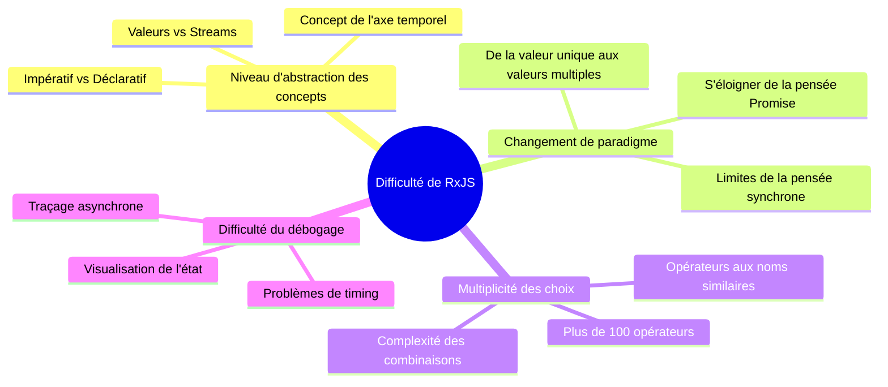
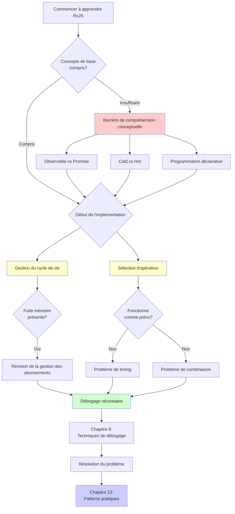
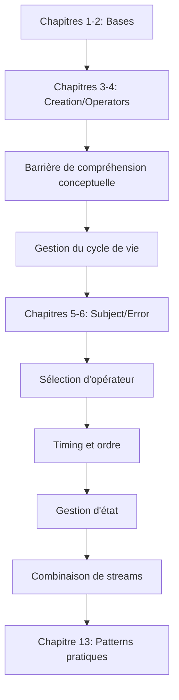
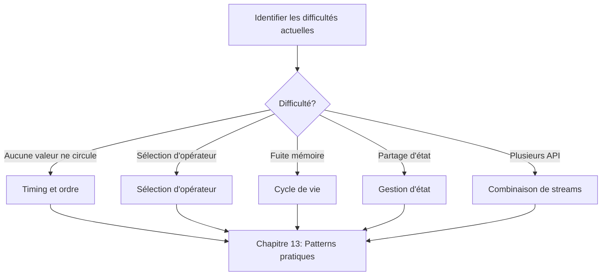
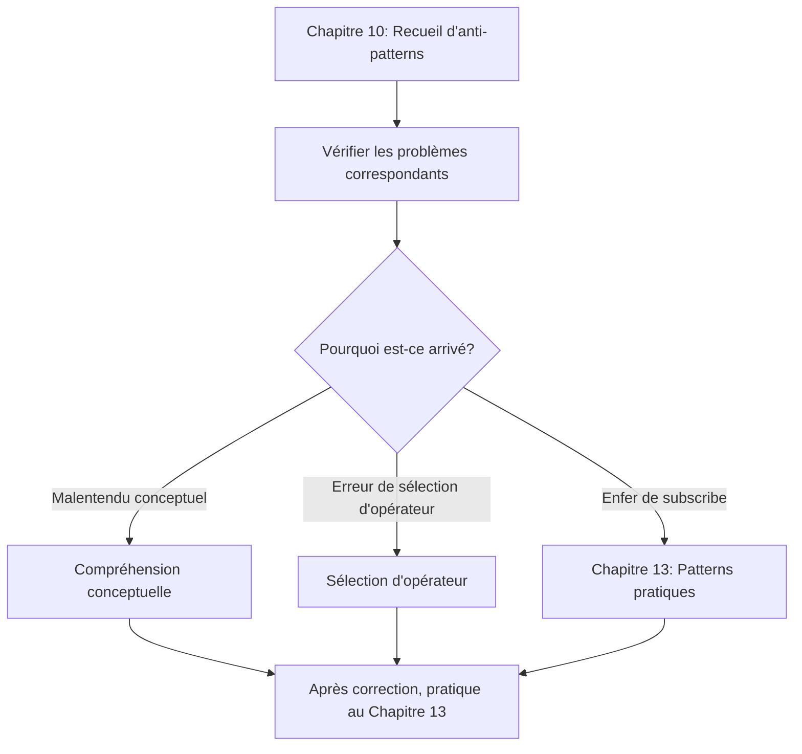

# Surmonter les difficultés de RxJS

Même les développeurs expérimentés en TypeScript et en développement d'applications rencontrent de nombreuses difficultés lors de la mise en pratique de RxJS. Cette section explique systématiquement les points difficiles spécifiques à RxJS et comment les surmonter.

## Pourquoi RxJS est-il difficile?

La difficulté de RxJS réside dans **le haut niveau d'abstraction des concepts** et **la nécessité d'un changement de paradigme**. Même les développeurs expérimentés sont déconcertés par le fait que leurs connaissances et schémas de pensée antérieurs ne fonctionnent pas. Voyons les points de difficulté spécifiques ci-dessous.

### Les connaissances existantes ne s'appliquent pas

Les développeurs habitués à Promise et Async/Await sont confus lorsqu'ils essaient d'utiliser RxJS avec la même approche.

```typescript
// ❌ Pensée de type Promise : vouloir obtenir la valeur directement
observable.subscribe(value => {
  const result = value * 2;
  return result; // Cela ne retourne rien
});

// ✅ Pensée de type RxJS : transformer le stream
const doubled$ = observable.pipe(
  map(value => value * 2)
);
```

> [!IMPORTANT] Points problématiques
> - La pensée de la programmation impérative (then/await de Promise) ne fonctionne pas
> - Il faut penser en termes de "transformation de stream" plutôt que de valeurs
> - Essayer de tout compléter dans subscribe conduit à des anti-patterns

### Le concept de l'axe temporel est ajouté

La caractéristique la plus importante de RxJS est le concept de "l'axe temporel". Promise retourne une valeur une seule fois, mais Observable peut faire circuler plusieurs valeurs au fil du temps.

```typescript
// Promise: retourne une valeur une seule fois
const promise = fetch('/api/data');

// Observable: plusieurs valeurs circulent le long de l'axe temporel
const clicks$ = fromEvent(button, 'click');
//                     axe temporel
// clicks$:  ------click----click--click---------->
```

> [!IMPORTANT] Points problématiques
> - Il faut toujours être conscient de "quand les valeurs circulent"
> - La différence synchrone/asynchrone affecte le comportement
> - La lecture des Marble Diagrams devient indispensable

### Choisir parmi plus de 100 opérateurs

RxJS dispose de plus de 100 opérateurs, et les débutants sont perdus dans leur choix. Il y a beaucoup d'opérateurs aux noms similaires, ce qui rend difficile de juger lequel utiliser.

> [!IMPORTANT] Préoccupations courantes
> - "map, mergeMap, switchMap, concatMap... Je ne comprends pas la différence"
> - "debounceTime et throttleTime, lequel utiliser?"
> - "combineLatest et zip, quelle est la différence?"

→ Le Chapitre 11 fournit des **critères de sélection pratiques**.

### Vue d'ensemble de la difficulté de RxJS

Le diagramme suivant montre de quels éléments est composée la difficulté de RxJS.



## Liste des principales difficultés

Nous avons classé les principales difficultés rencontrées lors de l'apprentissage et de la pratique de RxJS en 7 catégories. Chaque point de difficulté a une page dédiée qui explique en détail les solutions spécifiques. Tout d'abord, identifiez les difficultés auxquelles vous êtes confronté dans le tableau ci-dessous.

| Difficulté | Contenu | Symptômes courants |
|---|---|---|
| **[Barrière de compréhension conceptuelle](/fr/guide/overcoming-difficulties/conceptual-understanding)** | Observable vs Promise, Cold vs Hot | "Quelle est la différence avec Promise?" |
| **[Gestion du cycle de vie](/fr/guide/overcoming-difficulties/lifecycle-management)** | subscribe/unsubscribe, fuites mémoire | "Quand dois-je unsubscribe?" |
| **[Sélection d'opérateur](/fr/guide/overcoming-difficulties/operator-selection)** | Critères pour choisir parmi 100+ opérateurs | "Quel opérateur utiliser?" |
| **[Timing et ordre](/fr/guide/overcoming-difficulties/timing-and-order)** | Quand les valeurs circulent, synchrone vs asynchrone | "Pourquoi aucune valeur ne sort?" |
| **[Gestion d'état](/fr/guide/overcoming-difficulties/state-and-sharing)** | Subject, share/shareReplay | "Je veux partager l'état" |
| **[Combinaison de plusieurs streams](/fr/guide/overcoming-difficulties/stream-combination)** | combineLatest, zip, withLatestFrom | "Je veux combiner les résultats de 2 API" |
| **[Débogage](/fr/guide/overcoming-difficulties/debugging-guide)** | Aucune valeur ne circule, valeurs différentes de celles attendues | "Je ne comprends pas ce qui se passe" |

### Relation entre les difficultés

Les difficultés de RxJS ne sont pas indépendantes, elles sont interconnectées. Le diagramme de flux suivant montre dans quel ordre vous rencontrez les difficultés pendant le processus d'apprentissage et comment elles s'enchaînent. Vérifiez à quelle étape vous vous trouvez actuellement.



## Comment utiliser chaque section

Les articles de ce chapitre peuvent être lus indépendamment. Commencez à lire à partir de la section qui correspond à vos difficultés. Ci-dessous, nous expliquons comment les utiliser efficacement.

### 1. Identifiez vos difficultés

Dans le tableau ci-dessus, sélectionnez la section qui correspond aux **difficultés actuelles** auxquelles vous êtes confronté. Vous pouvez également effectuer une recherche inversée à partir des symptômes de difficulté.

#### Exemples
- Les valeurs ne sont pas récupérées lors d'un appel API → [Timing et ordre](/fr/guide/overcoming-difficulties/timing-and-order)
- Inquiétude concernant les fuites mémoire → [Gestion du cycle de vie](/fr/guide/overcoming-difficulties/lifecycle-management)
- Hésitation entre mergeMap et switchMap → [Sélection d'opérateur](/fr/guide/overcoming-difficulties/operator-selection)
- Vouloir partager l'état entre plusieurs composants → [Gestion d'état](/fr/guide/overcoming-difficulties/state-and-sharing)
- Vouloir combiner les résultats de 2 API → [Combinaison de plusieurs streams](/fr/guide/overcoming-difficulties/stream-combination)
- Ne pas savoir comment déboguer → [Débogage](/fr/guide/overcoming-difficulties/debugging-guide)

### 2. Comprendre avec mauvais exemple → bon exemple

Chaque section est structurée comme suit.

```
❌ Mauvais exemple (pattern dans lequel on tombe facilement)
↓
✅ Bon exemple (pattern recommandé)
↓
💡 Explication (pourquoi c'est mauvais, pourquoi c'est bon)
↓
🎯 Exercices pratiques (vérification de la compréhension)
```

### 3. Expérimenter avec le Starter Kit

Tous les exemples de code peuvent être exécutés dans [l'environnement d'exécution d'apprentissage](/fr/guide/starter-kid).

#### Flux d'apprentissage recommandé
1. Copier et exécuter le mauvais exemple → expérimenter le problème
2. Copier et exécuter le bon exemple → ressentir la différence
3. Appliquer à votre propre code → consolider

## Feuille de route d'apprentissage

La façon de procéder varie selon votre niveau de compétence actuel et vos objectifs. Choisissez la feuille de route qui vous convient parmi les 3 modèles suivants.

### Si vous apprenez RxJS pour la première fois

Une approche systématique qui consiste à apprendre à partir des bases dans l'ordre et à surmonter les difficultés rencontrées dans chaque chapitre.



### Si vous comprenez les bases mais rencontrez des difficultés en pratique

Si vous avez des connaissances de base mais que vous rencontrez des problèmes dans des projets réels, il est plus efficace d'aborder directement les points de difficulté.



### Si vous tombez dans des anti-patterns

Si vous écrivez déjà du code RxJS mais que vous soupçonnez d'être tombé dans des anti-patterns, commencez par identifier le problème au Chapitre 10, puis comprenez les difficultés qui en sont la cause.



## Sections connexes

Le Chapitre 11 (Surmonter les difficultés de RxJS) est étroitement lié aux autres chapitres pour améliorer l'efficacité de l'apprentissage. Il est particulièrement étroitement lié aux 3 chapitres suivants, et la compréhension s'approfondit en les lisant ensemble.

- **[Chapitre 10: Recueil d'anti-patterns RxJS](/fr/guide/anti-patterns/)** - Apprendre "ce qui est mauvais"
- **[Chapitre 13: Recueil de patterns pratiques](/fr/guide/)** - Apprendre "comment écrire" (en préparation)
- **[Chapitre 8: Techniques de débogage RxJS](/fr/guide/debugging/)** - Apprendre "comment trouver les problèmes"

#### Flux d'apprentissage
1. **Chapitre 11 (ce chapitre)** - Comprendre les difficultés de RxJS
2. **Chapitre 10** - Connaître les anti-patterns spécifiques
3. **Chapitre 13** - Maîtriser les patterns d'implémentation corrects

## Liste de vérification de la compréhension

Il s'agit d'une liste de vérification pour confirmer votre compréhension après avoir étudié chaque section. Si vous pouvez cocher tous les éléments, vous avez atteint le niveau où vous pouvez utiliser le contenu de cette section en pratique.

```markdown
## Compréhension conceptuelle
- [ ] Je peux expliquer la différence entre Observable et Promise
- [ ] Je peux expliquer la différence entre Cold et Hot avec des exemples
- [ ] Je comprends les avantages de la programmation déclarative

## Compétences pratiques
- [ ] Je peux subscribe/unsubscribe au moment approprié
- [ ] Je peux sélectionner l'opérateur approprié à l'objectif
- [ ] Je peux lire les Marble Diagrams et prédire le comportement

## Débogage
- [ ] Je peux déboguer les streams avec tap
- [ ] Je peux identifier la cause de l'absence de circulation de valeurs
- [ ] Je peux trouver les signes de fuites mémoire
```

## Prochaines étapes

Après avoir saisi la vue d'ensemble des difficultés de RxJS sur cette page, passez à l'apprentissage spécifique.

**Page à lire en premier:**

→ **[Barrière de compréhension conceptuelle](/fr/guide/overcoming-difficulties/conceptual-understanding)** - Comprendre la façon de penser essentielle de RxJS

Cette page se concentre sur la "compréhension conceptuelle" qui est à la base de toutes les difficultés. En commençant par ici, vous serez en mesure de comprendre plus facilement les autres points de difficulté. Après avoir compris les concepts, passez à la page du point de difficulté spécifique auquel vous êtes confronté.
