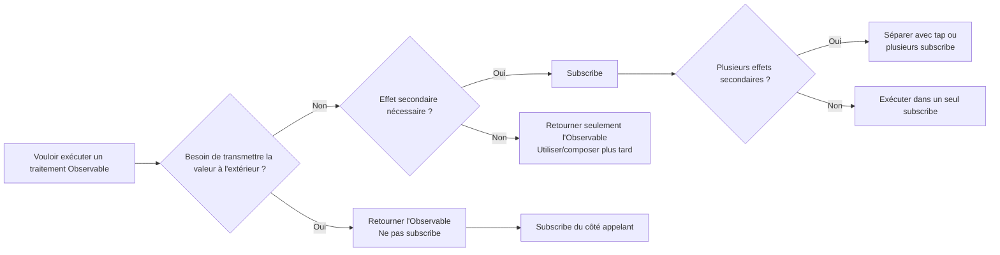
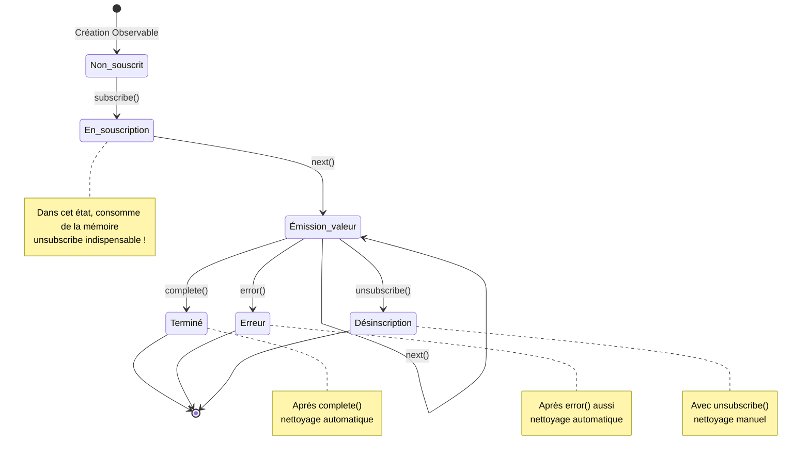
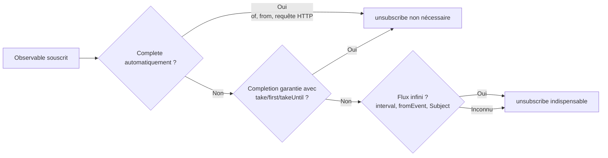

# Le mur de la gestion du cycle de vie

L'un des plus grands pièges de RxJS est **la gestion du cycle de vie**. Si vous vous trompez sur "quand subscribe" et "quand unsubscribe", cela peut entraîner des fuites mémoire et des bugs.

## Quand devez-vous subscribe ?

### Principe de base : Ne pas subscribe jusqu'au dernier moment

#### ❌ Mauvais exemple : Subscribe au milieu du processus
```typescript
import { interval } from 'rxjs';

function getEvenNumbers() {
  const numbers$ = interval(1000);

  // Subscribe à l'intérieur
  numbers$.subscribe(n => {
    if (n % 2 === 0) {
      console.log(n); // Comment transmettre ceci à l'extérieur ?
    }
  });
}
```

#### ✅ Bon exemple : Retourner l'Observable et subscribe du côté appelant
```typescript
import { interval } from 'rxjs';
import { filter, take } from 'rxjs';

function getEvenNumbers() {
  return interval(1000).pipe(
    filter(n => n % 2 === 0),
    take(5)
  );
}

// Subscribe du côté utilisateur
const subscription = getEvenNumbers().subscribe(n => {
  console.log(n);
});
```

::: tip 💡 Explication
- **Mauvais exemple** : Subscribe dans la fonction = perte de contrôle (impossible d'annuler, de composer)
- **Bon exemple** : Retourner l'Observable permet au côté appelant de contrôler
:::

### subscribe est un déclencheur d'« effets secondaires »

#### ❌ Mauvais exemple : Exécuter plusieurs effets secondaires dans subscribe
```typescript
import { fromEvent } from 'rxjs';
import { map } from 'rxjs';

const button = document.querySelector('button')!;

fromEvent(button, 'click')
  .pipe(map(() => Math.random()))
  .subscribe(randomValue => {
    // Effet secondaire 1 : Manipulation DOM
    document.querySelector('#result')!.textContent = randomValue.toString();

    // Effet secondaire 2 : Appel API
    fetch('/api/log', {
      method: 'POST',
      body: JSON.stringify({ value: randomValue })
    });

    // Effet secondaire 3 : LocalStorage
    localStorage.setItem('lastValue', randomValue.toString());
  });
```

#### ✅ Bon exemple : Séparer les effets secondaires et ne subscribe que ce qui est nécessaire
```typescript
import { fromEvent } from 'rxjs';
import { map } from 'rxjs';

const button = document.querySelector('button')!;

const randomClicks$ = fromEvent(button, 'click').pipe(
  map(() => Math.random())
);

// Si seule la mise à jour DOM est nécessaire
randomClicks$.subscribe(value => {
  document.querySelector('#result')!.textContent = value.toString();
});

// Si seul le log est nécessaire
randomClicks$.subscribe(value => {
  fetch('/api/log', {
    method: 'POST',
    body: JSON.stringify({ value })
  });
});
```

::: tip 💡 Explication
- **subscribe = point d'exécution des effets secondaires**
- **Si les effets secondaires sont indépendants** : Séparer en plusieurs subscribe (contrôle individuel possible)
- **Si les effets secondaires sont toujours exécutés ensemble** : OK de les regrouper dans un seul subscribe
- **Si un effet secondaire est nécessaire dans le pipeline** : Utiliser l'opérateur `tap`
:::

### Quand devez-vous subscribe : Diagramme de flux de décision



### Vue d'ensemble du cycle de vie de la souscription

Le diagramme de transition d'état suivant montre par quels états passe une souscription Observable avant de se terminer.



> [!IMPORTANT] Points de gestion du cycle de vie
> - **En souscription** : État avec risque de fuite mémoire
> - **complete/error** : Nettoyage automatique (unsubscribe non nécessaire)
> - **unsubscribe** : Nettoyage manuel nécessaire (surtout pour les flux infinis)

## Quand devez-vous unsubscribe ?

### Principe de base : Toujours se désinscrire après avoir souscrit

#### ❌ Mauvais exemple : Ne pas unsubscribe → Fuite mémoire
```typescript
import { interval } from 'rxjs';

const button = document.querySelector('button')!;

function startTimer() {
  interval(1000).subscribe(n => {
    console.log(n);
  });
  // Cette souscription continue indéfiniment !
}

// Une nouvelle souscription est ajoutée à chaque clic
button.addEventListener('click', startTimer);
// 10 clics = 10 souscriptions fonctionnent simultanément !
```

#### ✅ Bon exemple : Se désinscrire avec unsubscribe
```typescript
import { interval } from 'rxjs';

function startTimer() {
  const subscription = interval(1000).subscribe(n => {
    console.log(n);
  });

  // Se désinscrire après 5 secondes
  setTimeout(() => {
    subscription.unsubscribe();
    console.log('Souscription annulée');
  }, 5000);
}
```

::: tip 💡 Explication
- **Les flux infinis** (interval, fromEvent, etc.) nécessitent toujours unsubscribe
- Sans unsubscribe, fuite mémoire + traitement inutile continue
:::

### Cas où unsubscribe n'est pas nécessaire


#### ✅ Observable qui complete automatiquement

```typescript
of(1, 2, 3).subscribe(n => console.log(n));
// Nettoyage automatique après complete

from([1, 2, 3]).subscribe(n => console.log(n));
// Nettoyage automatique après complete
```

#### ✅ Completion garantie avec take, etc.
```typescript
interval(1000).pipe(
  take(5) // Complete automatiquement après 5 fois
).subscribe(n => console.log(n));
```

#### ✅ Terminaison par erreur
```typescript
throwError(() => new Error('Error')).subscribe({
  error: err => console.error(err)
});
```

#### ✅ EMPTY (complete immédiatement)
```typescript
EMPTY.subscribe(() => console.log('Non exécuté'));
```

> [!TIP] 💡 Explication
> unsubscribe n'est pas nécessaire dans les cas suivants
> 1. **Observable qui appelle complete()** - Nettoyage automatique
> 2. **Quand error() est appelé** - Nettoyage automatique également
> 3. **Completion garantie avec take(n), etc.** - Complete explicitement
> > [!IMPORTANT] Important
> > Les flux infinis (interval, fromEvent, Subject, etc.) nécessitent toujours unsubscribe !

### Diagramme de flux pour déterminer si unsubscribe est nécessaire



**En cas de doute, unsubscribe est plus sûr !**

## Patterns pour prévenir les fuites mémoire

### Pattern 1 : Gérer avec l'objet Subscription

```typescript
import { interval, fromEvent } from 'rxjs';
import { Subscription } from 'rxjs';

class MyComponent {
  private subscription = new Subscription();

  ngOnInit() {
    // Ajouter plusieurs souscriptions à une seule Subscription
    this.subscription.add(
      interval(1000).subscribe(n => console.log('Timer:', n))
    );

    this.subscription.add(
      fromEvent(document, 'click').subscribe(() => console.log('Click!'))
    );

    this.subscription.add(
      fromEvent(window, 'resize').subscribe(() => console.log('Resize!'))
    );
  }

  ngOnDestroy() {
    // Annuler toutes les souscriptions en une seule fois
    this.subscription.unsubscribe();
  }
}
```

#### 💡 Avantages

- Gérer plusieurs souscriptions avec un seul objet
- Annulation en bloc dans `ngOnDestroy`
- Ajout et suppression faciles

### Pattern 2 : Gérer avec un tableau

```typescript
import { interval, fromEvent } from 'rxjs';
import { Subscription } from 'rxjs';

class MyComponent {
  private subscriptions: Subscription[] = [];

  ngOnInit() {
    this.subscriptions.push(
      interval(1000).subscribe(n => console.log('Timer:', n))
    );

    this.subscriptions.push(
      fromEvent(document, 'click').subscribe(() => console.log('Click!'))
    );
  }

  ngOnDestroy() {
    this.subscriptions.forEach(sub => sub.unsubscribe());
    this.subscriptions = [];
  }
}
```

#### 💡 Avantages

- Gestion flexible avec opérations sur tableau
- Annulation individuelle possible
- Facile à déboguer (vérifier le tableau avec console.log)

### Pattern 3 : Pattern takeUntil (recommandé)

```typescript
import { interval, fromEvent, Subject } from 'rxjs';
import { takeUntil } from 'rxjs';

class MyComponent {
  private destroy$ = new Subject<void>();

  ngOnInit() {
    // Ajouter takeUntil(this.destroy$) à toutes les souscriptions
    interval(1000).pipe(
      takeUntil(this.destroy$)
    ).subscribe(n => console.log('Timer:', n));

    fromEvent(document, 'click').pipe(
      takeUntil(this.destroy$)
    ).subscribe(() => console.log('Click!'));

    fromEvent(window, 'resize').pipe(
      takeUntil(this.destroy$)
    ).subscribe(() => console.log('Resize!'));
  }

  ngOnDestroy() {
    // Annuler toutes les souscriptions avec un seul next()
    this.destroy$.next();
    this.destroy$.complete();
  }
}
```

#### 💡 Avantages

- **Le plus déclaratif** - Spécifie explicitement la condition de completion dans le pipeline
- **Pas besoin d'objet Subscription** - Bonne efficacité mémoire
- **Lisible** - En regardant le code, on comprend "complete avec destroy$"

## Guide complet du pattern takeUntil

### Pattern de base

```typescript
import { interval, Subject } from 'rxjs';
import { takeUntil } from 'rxjs';

const destroy$ = new Subject<void>();

// Cette souscription continue jusqu'à ce que destroy$ émette next()
interval(1000).pipe(
  takeUntil(destroy$)
).subscribe(n => console.log(n));

// Arrêter toutes les souscriptions après 5 secondes
setTimeout(() => {
  destroy$.next();
  destroy$.complete();
}, 5000);
```

#### Marble Diagram

```
interval(1000):  --0--1--2--3--4--5--6--7-->
destroy$:        ----------X
                          ↑
                       appel next()

Résultat takeUntil:   --0--1--2|
                          ↑
                       complete
```

### Application à plusieurs Observables

```typescript
import { interval, fromEvent, timer, Subject } from 'rxjs';
import { takeUntil, map } from 'rxjs';

const destroy$ = new Subject<void>();

// Pattern : Utiliser le même destroy$ pour tous les flux
interval(1000).pipe(
  takeUntil(destroy$),
  map(n => `Timer: ${n}`)
).subscribe(console.log);

fromEvent(document, 'click').pipe(
  takeUntil(destroy$),
  map(() => 'Click!')
).subscribe(console.log);

timer(2000).pipe(
  takeUntil(destroy$),
  map(() => 'Timer finished')
).subscribe(console.log);

// Arrêt en bloc
function cleanup() {
  destroy$.next();
  destroy$.complete();
}

// Exemple : Appeler cleanup() lors de la transition de page
window.addEventListener('beforeunload', cleanup);
```

## Erreurs courantes avec le pattern takeUntil

### Erreur 1 : Position incorrecte de takeUntil

#### ❌ Mauvais exemple : map avant takeUntil
```typescript
import { interval, Subject } from 'rxjs';
import { map, takeUntil } from 'rxjs';

const destroy$ = new Subject<void>();

interval(1000).pipe(
  takeUntil(destroy$),  // Même si on complete ici...
  map(n => n * 2)       // map peut être exécuté
).subscribe(console.log);
```

#### ✅ Bon exemple : takeUntil placé en dernier
```typescript
import { interval, Subject } from 'rxjs';
import { map, takeUntil } from 'rxjs';

const destroy$ = new Subject<void>();

interval(1000).pipe(
  map(n => n * 2),
  takeUntil(destroy$)  // Après tous les opérateurs
).subscribe(console.log);
```

> [!TIP]💡 Explication
> - **Placer takeUntil le plus tard possible** en dernier
> - Exception : Parfois placé avant les opérateurs multicast comme shareReplay

### Erreur 2 : Ne pas complete destroy$

#### ❌ Mauvais exemple : Ne pas appeler complete()
```typescript
import { Subject } from 'rxjs';

const destroy$ = new Subject<void>();

function cleanup() {
  destroy$.next();
  // ❌ Ne pas appeler complete()
}

// Problème : destroy$ lui-même devient une source de fuite mémoire
```

#### ✅ Bon exemple : Appeler à la fois next() et complete()
```typescript
import { Subject } from 'rxjs';

const destroy$ = new Subject<void>();

function cleanup() {
  destroy$.next();
  destroy$.complete();
}
```

> [!TIP]💡 Explication
> - Avec seulement `next()`, destroy$ reste souscrit
> - **Toujours appeler aussi `complete()`**

### Erreur 3 : Essayer de réutiliser

#### ❌ Mauvais exemple : Réutiliser un Subject déjà complete
```typescript
import { interval, Subject } from 'rxjs';
import { takeUntil } from 'rxjs';

const destroy$ = new Subject<void>();

function start() {
  interval(1000).pipe(
    takeUntil(destroy$)
  ).subscribe(console.log);
}

function stop() {
  destroy$.next();
  destroy$.complete();
}

start();
setTimeout(stop, 3000);

// ❌ Problème : destroy$ est déjà complete, donc redémarrer start() termine immédiatement
setTimeout(start, 5000); // Cela ne fonctionne pas
```

#### ✅ Bon exemple : Régénérer destroy$
```typescript
import { interval, Subject } from 'rxjs';
import { takeUntil } from 'rxjs';

class MyComponent {
  private destroy$ = new Subject<void>();

  start() {
    // Régénérer si déjà complete
    if (this.destroy$.closed) {
      this.destroy$ = new Subject<void>();
    }

    interval(1000).pipe(
      takeUntil(this.destroy$)
    ).subscribe(console.log);
  }

  stop() {
    this.destroy$.next();
    this.destroy$.complete();
  }
}
```

> [!TIP] 💡 Explication
> - **Un Subject ne peut pas être réutilisé une fois complete**
> - Si redémarrage nécessaire, créer un nouveau Subject

## Meilleures pratiques de gestion des Subscriptions

### Meilleure pratique 1 : Avoir un destroy$ par composant/classe

```typescript
import { Subject } from 'rxjs';
import { takeUntil } from 'rxjs';

class UserProfileComponent {
  private destroy$ = new Subject<void>();

  constructor(private userService: UserService) {}

  ngOnInit() {
    this.userService.getUser().pipe(
      takeUntil(this.destroy$)
    ).subscribe(user => {
      console.log(user);
    });

    this.userService.getUserPosts().pipe(
      takeUntil(this.destroy$)
    ).subscribe(posts => {
      console.log(posts);
    });
  }

  ngOnDestroy() {
    this.destroy$.next();
    this.destroy$.complete();
  }
}
```

#### 💡 Avantages

- **Cohérence** - Même pattern dans tous les composants
- **Maintenabilité** - Pas besoin de modifier ngOnDestroy lors de l'ajout de nouvelles souscriptions
- **Sécurité** - Aucun oubli d'unsubscribe

### Meilleure pratique 2 : Utiliser AsyncPipe (cas Angular)

```typescript
import { Component } from '@angular/core';
import { Observable } from 'rxjs';

@Component({
  selector: 'app-user-profile',
  template: `
    <!-- AsyncPipe subscribe/unsubscribe automatiquement -->
    <div *ngIf="user$ | async as user">
      <h1>{{ user.name }}</h1>
      <p>{{ user.email }}</p>
    </div>

    <ul>
      <li *ngFor="let post of posts$ | async">
        {{ post.title }}
      </li>
    </ul>
  `
})
export class UserProfileComponent {
  user$: Observable<User>;
  posts$: Observable<Post[]>;

  constructor(private userService: UserService) {
    // Passer l'Observable directement au template
    this.user$ = this.userService.getUser();
    this.posts$ = this.userService.getUserPosts();

    // Pas besoin de ngOnDestroy ! AsyncPipe annule automatiquement
  }
}
```

#### 💡 Avantages

- **Unsubscribe automatique** - Annulation automatique lors de la destruction du composant
- **Compatible OnPush** - Détection de changement optimisée
- **Code concis** - Pas de boilerplate subscribe/unsubscribe

### Meilleure pratique 3 : Changer de stratégie selon longue durée vs courte durée

```typescript
import { Injectable } from '@angular/core';
import { BehaviorSubject, interval, fromEvent } from 'rxjs';
import { takeUntil } from 'rxjs';

@Injectable({ providedIn: 'root' })
export class DataService {
  // ✅ État partagé dans tout le service (longue durée)
  // → Maintenir la souscription jusqu'à la fin de l'application
  private userState$ = new BehaviorSubject<User | null>(null);

  getUser() {
    return this.userState$.asObservable();
  }

  // ❌ Ne pas subscribe directement dans le composant
  // ✅ Subscribe avec AsyncPipe ou takeUntil
}

class MyComponent {
  private destroy$ = new Subject<void>();

  ngOnInit() {
    // ✅ Souscription liée au cycle de vie du composant (courte durée)
    // → Toujours annuler dans ngOnDestroy
    interval(1000).pipe(
      takeUntil(this.destroy$)
    ).subscribe(n => console.log(n));

    fromEvent(window, 'resize').pipe(
      takeUntil(this.destroy$)
    ).subscribe(() => console.log('Resize'));
  }

  ngOnDestroy() {
    this.destroy$.next();
    this.destroy$.complete();
  }
}
```

> [!IMPORTANT] 💡 Principes
> | Type de souscription | Cycle de vie | Méthode de gestion |
> |---|---|---|
> | **État global** | Toute l'application | BehaviorSubject + AsyncPipe |
> | **Spécifique à la page/route** | Pendant que la route est active | takeUntil(routeDestroy$) |
> | **Spécifique au composant** | Pendant que le composant existe | takeUntil(destroy$) ou AsyncPipe |
> | **Appel API unique** | Jusqu'à completion | take(1) ou first() |

### Meilleure pratique 4 : Définir des conditions de completion explicites

#### ❌ Mauvais exemple : Incertain quand ça se termine
```typescript
import { fromEvent } from 'rxjs';

fromEvent(document, 'click').subscribe(() => {
  console.log('Click');
});
```

#### ✅ Bon exemple 1 : Limite de nombre
```typescript
import { fromEvent } from 'rxjs';
import { take } from 'rxjs';

fromEvent(document, 'click').pipe(
  take(5) // Terminaison automatique après 5 fois
).subscribe(() => {
  console.log('Click (maximum 5 fois)');
});
```

#### ✅ Bon exemple 2 : Limite de temps
```typescript
import { fromEvent, timer } from 'rxjs';
import { takeUntil } from 'rxjs';

const timeout$ = timer(10000); // Après 10 secondes
fromEvent(document, 'click').pipe(
  takeUntil(timeout$)
).subscribe(() => {
  console.log('Click (dans les 10 secondes)');
});
```

#### ✅ Bon exemple 3 : Plusieurs conditions de terminaison
```typescript
import { fromEvent, Subject, merge } from 'rxjs';
import { takeUntil, take } from 'rxjs';

const destroy$ = new Subject<void>();
const maxClicks$ = fromEvent(document, 'click').pipe(take(10));

fromEvent(document, 'mousemove').pipe(
  takeUntil(merge(destroy$, maxClicks$)) // Termine avec l'un ou l'autre
).subscribe(() => {
  console.log('Mouse move');
});
```

> [!IMPORTANT] 💡 Principes
> - **Spécifier explicitement "quand ça se termine"** - Éviter les flux infinis
> - Définir les conditions de completion avec take, first, takeWhile, takeUntil, etc.
> - Lier au cycle de vie (destroy$, timeout$, etc.)

## Liste de vérification de la compréhension

Vérifiez si vous pouvez répondre aux questions suivantes.

```markdown
## Compréhension de base
- [ ] Pouvoir expliquer ce qui se passe quand on subscribe à un Observable
- [ ] Pouvoir distinguer les cas où unsubscribe est nécessaire et non nécessaire
- [ ] Pouvoir expliquer les causes des fuites mémoire

## Application de patterns
- [ ] Pouvoir gérer plusieurs souscriptions avec l'objet Subscription
- [ ] Pouvoir implémenter le pattern takeUntil
- [ ] Pouvoir placer destroy$ correctement (dernier opérateur)

## Meilleures pratiques
- [ ] Savoir quand utiliser AsyncPipe
- [ ] Pouvoir gérer en distinguant souscriptions longue durée et courte durée
- [ ] Pouvoir définir des conditions de completion explicites

## Débogage
- [ ] Connaître une méthode pour détecter les fuites mémoire
- [ ] Pouvoir trouver les oublis d'unsubscribe
- [ ] Pouvoir vérifier le nombre de souscriptions avec les DevTools du navigateur
```

## Prochaines étapes

Après avoir compris la gestion du cycle de vie, apprenez ensuite **la sélection d'opérateurs**.

→ **[Les hésitations dans la sélection d'opérateurs](/fr/guide/overcoming-difficulties/operator-selection)** - Critères pour choisir parmi plus de 100 opérateurs

## Pages connexes

- **[Chapitre 2 : Cycle de vie des Observables](/fr/guide/observables/observable-lifecycle)** - Bases de subscribe/unsubscribe
- **[Chapitre 10 : Erreurs courantes et solutions](/fr/guide/anti-patterns/common-mistakes)** - Subscribe imbriqués, fuites mémoire, etc.
- **[Chapitre 13 : Patterns de traitement de formulaires](/fr/guide/)** - Utilisation en pratique (en préparation)
- **[Chapitre 8 : Débogage des fuites mémoire](/fr/guide/debugging/)** - Méthodes de débogage

## 🎯 Exercices pratiques

### Problème 1 : Corriger la fuite mémoire

Le code suivant contient une fuite mémoire. Corrigez-le.

```typescript
class ChatComponent {
  ngOnInit() {
    interval(5000).subscribe(() => {
      this.chatService.checkNewMessages().subscribe(messages => {
        console.log('New messages:', messages);
      });
    });
  }
}
```

<details>
<summary>Exemple de solution</summary>

```typescript
class ChatComponent {
  private destroy$ = new Subject<void>();

  ngOnInit() {
    interval(5000).pipe(
      takeUntil(this.destroy$),
      switchMap(() => this.chatService.checkNewMessages())
    ).subscribe(messages => {
      console.log('New messages:', messages);
    });
  }

  ngOnDestroy() {
    this.destroy$.next();
    this.destroy$.complete();
  }
}
```

> [!NOTE] Points de correction
> 1. Ajout du Subject `destroy$`
> 2. Arrêt de l'interval avec `takeUntil(this.destroy$)`
> 3. Résolution des subscribe imbriqués avec `switchMap`
> 4. Nettoyage dans `ngOnDestroy`

</details>

### Problème 2 : Sélection du pattern approprié

Choisissez le meilleur pattern de gestion de souscription pour les scénarios suivants.

1. Requête HTTP (une seule fois)
2. Connexion WebSocket (pendant l'existence du composant)
3. État utilisateur global (toute l'application)

<details>
<summary>Exemple de solution</summary>

**1. Requête HTTP (une seule fois)**
```typescript
// ✅ take(1) ou first() - Complete automatiquement après 1 fois
this.http.get('/api/user').pipe(
  take(1)
).subscribe(user => console.log(user));

// Ou AsyncPipe (cas Angular)
user$ = this.http.get('/api/user');
```

**2. Connexion WebSocket (pendant l'existence du composant)**
```typescript
// ✅ Pattern takeUntil - Déconnexion lors de la destruction du composant
private destroy$ = new Subject<void>();

ngOnInit() {
  this.websocket.connect().pipe(
    takeUntil(this.destroy$)
  ).subscribe(message => console.log(message));
}

ngOnDestroy() {
  this.destroy$.next();
  this.destroy$.complete();
}
```

**3. État utilisateur global (toute l'application)**
```typescript
// ✅ BehaviorSubject + AsyncPipe - unsubscribe non nécessaire
@Injectable({ providedIn: 'root' })
class AuthService {
  private userState$ = new BehaviorSubject<User | null>(null);

  getUser() {
    return this.userState$.asObservable();
  }
}

// Utilisation dans le composant
user$ = this.authService.getUser(); // Subscribe avec AsyncPipe
```

</details>
